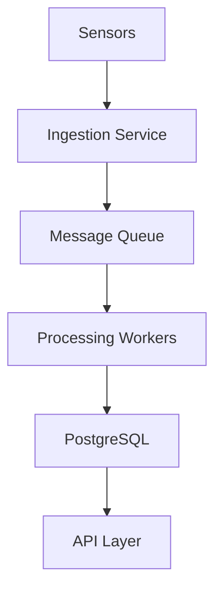

# DocFlow Collaborative Workflow Guide

> Making the process of flowing requirements into PRDs, exploring designs, and drafting implementation specs a massively collaborative effort with minimal headache.

## Overview

DocFlow's collaborative workflow creates a traceable chain from initial requirements through final implementation specs. Every document knows its ancestry, team members can work in parallel, and the AI agent helps maintain consistency across the chain.

```
┌─────────────────────────────────────────────────────────────────────┐
│                    Document Workflow Chain                          │
├─────────────────────────────────────────────────────────────────────┤
│                                                                     │
│   Requirements  ─────►  PRDs  ─────►  Designs  ─────►  Specs       │
│   (What we need)       (Why/What)    (How)           (Build this)  │
│                                                                     │
│   ┌─────┐              ┌─────┐       ┌─────┐         ┌─────┐       │
│   │REQ-1│──────────────│PRD-1│───────│DES-1│─────────│SPC-1│       │
│   └─────┘              └─────┘       └─────┘         └─────┘       │
│      │                    │             │               │           │
│      │    ┌─────┐         │             │               │           │
│      └────│PRD-2│─────────┘             │               │           │
│           └─────┘                       │               │           │
│              │                          │               │           │
│              │          ┌─────┐         │               │           │
│              └──────────│DES-2│─────────┘               │           │
│                         └─────┘                         │           │
│                            │                            │           │
│                            └────────────────────────────┘           │
│                                                                     │
│   Many-to-many relationships: one requirement can spawn multiple    │
│   PRDs; multiple designs can merge into one spec                    │
│                                                                     │
└─────────────────────────────────────────────────────────────────────┘
```

## Document Types & Templates

### 1. Requirements

The starting point. Captures what we need without prescribing solutions.

```bash
# Create via CLI
docflow new "Loop Instrumentation Data Capture" --type requirement --project "bubble_flow_loop"

# Create via agent
> Create a new requirement document for capturing real-time sensor data from the bubble flow loop
```

**Template structure:**

```markdown
# [REQ-XXX] Requirement Title

## Summary
Brief description of what is needed.

## Business Context
Why this is needed. Who requested it. Impact if not delivered.

## User Stories
- As a [role], I want [capability] so that [benefit]

## Acceptance Criteria
- [ ] Criterion 1
- [ ] Criterion 2

## Constraints
- Technical constraints
- Timeline constraints
- Resource constraints

## Dependencies
- Other requirements this depends on
- External systems involved

## Priority
[ ] Critical | [ ] High | [ ] Medium | [ ] Low

## Stakeholders
- @researcher1 (owner)
- @researcher2 (reviewer)
```

### 2. Product Requirements Documents (PRDs)

Translates requirements into detailed product specifications.

```bash
docflow new "Sensor Data Pipeline PRD" --type prd --parent REQ-042
```

**Template structure:**

```markdown
# [PRD-XXX] Product Requirements Document

## Source Requirements
- REQ-042: Loop Instrumentation Data Capture

## Overview
What we're building and why.

## Goals
1. Primary goal
2. Secondary goal

## Non-Goals
What we're explicitly NOT doing.

## User Experience

### User Personas
- Research Scientist: Needs real-time data visualization
- Graduate Student: Needs data export for analysis

### User Flows
1. Flow 1 description
2. Flow 2 description

## Functional Requirements

### FR1: Data Ingestion
- Accept data from N sensors
- Support sampling rates up to X Hz

### FR2: Data Storage
- Store raw and processed data
- Retention period: Y days

## Non-Functional Requirements

### Performance
- Latency: < X ms
- Throughput: Y events/sec

### Reliability
- Uptime: 99.X%
- Data durability: 99.99%

## Technical Considerations
High-level technical approach (not detailed design).

## Success Metrics
How we'll know this succeeded.

## Timeline
Rough phases and milestones.

## Open Questions
Things that need to be resolved.
```

### 3. Design Documents

Explores HOW to implement PRD requirements.

```bash
docflow new "Sensor Pipeline Architecture" --type design --parent PRD-017

# Ask agent to help draft
> Help me draft a design document for the sensor data pipeline, considering our existing PostgreSQL infrastructure
```

**Template structure:**

```markdown
# [DES-XXX] Design Document

## Source PRDs
- PRD-017: Sensor Data Pipeline

## Problem Statement
Technical problem we're solving.

## Background
Context needed to understand the design.

## Goals
Technical goals for this design.

## Non-Goals
What this design explicitly excludes.

## Proposed Solution

### Architecture Overview


### Component Design

#### Component 1: Ingestion Service
- Responsibility
- Interface
- Implementation approach

#### Component 2: Processing Pipeline
...

## Alternatives Considered

### Alternative 1
What: Brief description
Pros: List of advantages
Cons: List of disadvantages
Why rejected: Reason

### Alternative 2
...

## Data Model
```sql
CREATE TABLE sensor_readings (
    id BIGSERIAL PRIMARY KEY,
    sensor_id UUID NOT NULL,
    timestamp TIMESTAMPTZ NOT NULL,
    value JSONB NOT NULL
);
```

## API Design
```
POST /api/v1/readings
GET /api/v1/readings?sensor_id=X&from=T1&to=T2
```

## Security Considerations
- Authentication approach
- Authorization model
- Data protection

## Testing Strategy
- Unit testing approach
- Integration testing
- Performance testing

## Deployment Strategy
- Rollout plan
- Rollback plan
- Monitoring

## Open Questions
Unresolved technical questions.

## References
- Related designs
- External documentation
```

### 4. Implementation Specs

The final, buildable specification. This is what gets handed to developers.

```bash
docflow new "Sensor Ingestion Service Spec" --type spec --parent DES-003
```

**Template structure:**

```markdown
# [SPC-XXX] Implementation Specification

## Source Designs
- DES-003: Sensor Pipeline Architecture

## Scope
Exactly what this spec covers.

## Implementation Details

### File Structure
```
sensor_ingestion/
├── __init__.py
├── service.py
├── handlers/
│   ├── __init__.py
│   ├── tcp_handler.py
│   └── mqtt_handler.py
├── models/
│   ├── reading.py
│   └── sensor.py
└── tests/
    ├── test_handlers.py
    └── test_service.py
```

### Class/Module Specifications

#### SensorIngestionService
```python
class SensorIngestionService:
    """
    Main service for ingesting sensor data.
    
    Attributes:
        config: Service configuration
        handlers: Protocol handlers
        queue: Output message queue
    """
    
    def __init__(self, config: ServiceConfig):
        """Initialize with configuration."""
        
    async def start(self) -> None:
        """Start the ingestion service."""
        
    async def stop(self) -> None:
        """Gracefully stop the service."""
        
    async def process_reading(self, reading: SensorReading) -> None:
        """Process a single sensor reading."""
```

### Database Migrations
```sql
-- Migration: 001_create_sensor_tables.sql

CREATE EXTENSION IF NOT EXISTS timescaledb;

CREATE TABLE sensors (
    id UUID PRIMARY KEY DEFAULT gen_random_uuid(),
    name TEXT NOT NULL,
    type TEXT NOT NULL,
    location JSONB,
    metadata JSONB,
    created_at TIMESTAMPTZ DEFAULT NOW()
);

CREATE TABLE readings (
    time TIMESTAMPTZ NOT NULL,
    sensor_id UUID NOT NULL REFERENCES sensors(id),
    value DOUBLE PRECISION NOT NULL,
    quality INTEGER DEFAULT 0,
    metadata JSONB
);

SELECT create_hypertable('readings', 'time');
```

### Configuration Schema
```yaml
# config.yaml schema
sensor_ingestion:
  port: 8080
  protocols:
    tcp:
      enabled: true
      port: 9000
    mqtt:
      enabled: true
      broker: "mqtt://localhost:1883"
  queue:
    type: "rabbitmq"
    url: "amqp://localhost"
  batch_size: 100
  flush_interval_ms: 1000
```

### Error Handling
| Error Type | Cause | Handling |
|------------|-------|----------|
| ConnectionError | Sensor disconnect | Retry with backoff |
| ValidationError | Invalid data | Log and skip |
| QueueFull | Backpressure | Apply backpressure to sensors |

### Testing Requirements

#### Unit Tests
- [ ] Test reading validation
- [ ] Test batch assembly
- [ ] Test error handling

#### Integration Tests
- [ ] Test TCP handler with mock sensor
- [ ] Test MQTT handler with test broker
- [ ] Test queue publishing

#### Performance Tests
- [ ] Sustain 10k readings/sec
- [ ] Latency p99 < 10ms

## Dependencies
- Python 3.11+
- asyncio
- pydantic
- aio-pika (RabbitMQ)
- asyncpg (PostgreSQL)

## Deployment Checklist
- [ ] Database migrations applied
- [ ] Configuration secrets in vault
- [ ] Monitoring dashboards created
- [ ] Alerts configured
- [ ] Documentation updated

## Acceptance Criteria
Direct mapping from PRD acceptance criteria with technical verification steps.
```

---

## Collaborative Workflows

### Workflow 1: Solo Author → Team Review

For individual work that needs team validation.

```
┌──────────────────────────────────────────────────────────────────┐
│  Solo → Review Workflow                                          │
├──────────────────────────────────────────────────────────────────┤
│                                                                  │
│  1. Author drafts          2. Submit for review                  │
│     ┌─────────┐               ┌─────────────────┐               │
│     │ Draft   │──────────────►│ Review Request  │               │
│     │ (solo)  │               │ @team-members   │               │
│     └─────────┘               └─────────────────┘               │
│                                        │                         │
│                                        ▼                         │
│  4. Author addresses       3. Team provides feedback             │
│     ┌─────────┐               ┌─────────────────┐               │
│     │Revision │◄──────────────│ Comments/       │               │
│     │         │               │ Suggestions     │               │
│     └─────────┘               └─────────────────┘               │
│         │                                                        │
│         ▼                                                        │
│  5. Final approval         6. Published                          │
│     ┌─────────┐               ┌─────────────────┐               │
│     │Approved │──────────────►│ Published       │               │
│     │         │               │ (immutable)     │               │
│     └─────────┘               └─────────────────┘               │
│                                                                  │
└──────────────────────────────────────────────────────────────────┘
```

**CLI Commands:**

```bash
# Create draft
docflow new "My Design" --type design

# Submit for review
docflow review request DES-015 --reviewers "@alice,@bob"

# Check review status
docflow review status DES-015

# Address feedback (after revision)
docflow review respond DES-015 --message "Addressed all comments"

# Approve (as reviewer)
docflow review approve DES-015

# Publish (after all approvals)
docflow publish DES-015
```

**Agent Interaction:**

```
> Submit my sensor pipeline design for review by the thermal team

I've submitted DES-015 for review. Here's the summary:
- Document: Sensor Pipeline Architecture
- Reviewers: @alice (thermal-lead), @bob (thermal-analyst)
- Status: Pending review

The reviewers will be notified. You'll receive updates when they comment.
```

### Workflow 2: Collaborative Drafting

For documents that benefit from multiple authors working together.

```
┌──────────────────────────────────────────────────────────────────┐
│  Collaborative Drafting Workflow                                 │
├──────────────────────────────────────────────────────────────────┤
│                                                                  │
│  ┌─────────┐   ┌─────────┐   ┌─────────┐                        │
│  │Section 1│   │Section 2│   │Section 3│                        │
│  │@alice   │   │@bob     │   │@carol   │                        │
│  └────┬────┘   └────┬────┘   └────┬────┘                        │
│       │             │             │                              │
│       └─────────────┼─────────────┘                              │
│                     ▼                                            │
│              ┌─────────────┐                                     │
│              │  Assembled  │                                     │
│              │  Draft      │                                     │
│              └──────┬──────┘                                     │
│                     │                                            │
│                     ▼                                            │
│              ┌─────────────┐                                     │
│              │ Consistency │  ← Agent helps here!                │
│              │ Review      │                                     │
│              └──────┬──────┘                                     │
│                     │                                            │
│                     ▼                                            │
│              ┌─────────────┐                                     │
│              │  Unified    │                                     │
│              │  Document   │                                     │
│              └─────────────┘                                     │
│                                                                  │
└──────────────────────────────────────────────────────────────────┘
```

**Agent-Assisted Consistency Check:**

```
> Check PRD-023 for consistency issues

I've analyzed PRD-023 and found a few inconsistencies:

1. **Terminology mismatch** (Section 2 vs Section 4)
   - Section 2 uses "data pipeline"
   - Section 4 uses "ingestion service"
   → Suggest standardizing on "data pipeline"

2. **Timeline conflict**
   - Section 3 mentions Q2 delivery
   - Section 5 references Q3 milestones
   → Needs alignment

3. **Missing cross-reference**
   - Section 4 references REQ-045 
   - REQ-045 not listed in Source Requirements
   → Add to Source Requirements or verify reference

Would you like me to suggest specific edits?
```

### Workflow 3: Requirement → Spec Pipeline

The full collaborative journey from requirement to implementation spec.

```
┌──────────────────────────────────────────────────────────────────────────┐
│  Full Pipeline Workflow                                                  │
├──────────────────────────────────────────────────────────────────────────┤
│                                                                          │
│  Phase 1: Requirements Gathering                                         │
│  ─────────────────────────────────                                       │
│  • Stakeholder interviews                                                │
│  • User research                                                         │
│  • Competitive analysis                                                  │
│  Output: REQ-XXX documents                                               │
│                                                                          │
│  Phase 2: PRD Development                                                │
│  ────────────────────────                                                │
│  • Product team drafts PRD from requirements                             │
│  • Agent helps identify related requirements                             │
│  • Cross-functional review                                               │
│  Output: PRD-XXX documents (linked to REQ-XXX)                          │
│                                                                          │
│  Phase 3: Design Exploration                                             │
│  ──────────────────────────                                              │
│  • Technical team explores approaches                                    │
│  • Multiple designs may address same PRD                                 │
│  • Architecture review                                                   │
│  • Agent helps check consistency with PRD                                │
│  Output: DES-XXX documents (linked to PRD-XXX)                          │
│                                                                          │
│  Phase 4: Spec Creation                                                  │
│  ──────────────────────                                                  │
│  • Implementation details finalized                                      │
│  • Agent generates initial spec from design                              │
│  • Engineering review                                                    │
│  Output: SPC-XXX documents (linked to DES-XXX)                          │
│                                                                          │
│  Phase 5: Implementation                                                 │
│  ────────────────────────                                                │
│  • Code written to spec                                                  │
│  • Tests verify spec compliance                                          │
│  • Spec updated if changes needed                                        │
│  Output: Code (linked to SPC-XXX)                                       │
│                                                                          │
└──────────────────────────────────────────────────────────────────────────┘
```

**Tracing the Chain:**

```bash
# See what requirement led to a spec
docflow chain SPC-089 --direction upstream

# See what specs implement a requirement
docflow chain REQ-042 --direction downstream

# Full picture
docflow chain REQ-042 --direction both
```

**Agent Query:**

```
> What specs implement the data capture requirements?

Here's the chain from data capture requirements to implementation specs:

REQ-042: Loop Instrumentation Data Capture
├── PRD-017: Sensor Data Pipeline
│   ├── DES-003: Sensor Pipeline Architecture
│   │   ├── SPC-089: Sensor Ingestion Service [✓ Complete]
│   │   └── SPC-092: Data Processing Workers [In Progress]
│   └── DES-007: Data Storage Design
│       └── SPC-103: TimescaleDB Schema [Draft]
└── PRD-019: Real-Time Visualization
    └── DES-012: Dashboard Architecture
        └── (no specs yet)

4 specs total, 1 complete, 1 in progress, 1 draft, 1 not started.
```

---

## Team Collaboration Features

### 1. Ownership & Accountability

Every document has clear ownership:

```yaml
# Document metadata
ownership:
  author: "@ben"           # Original creator
  owner: "@alice"          # Current responsible party
  contributors:            # People who've edited
    - "@bob"
    - "@carol"
  reviewers:               # Required approvers
    - "@thermal-lead"
    - "@safety-team"
```

**Transfer ownership:**

```bash
docflow ownership transfer DES-015 --to "@alice" --reason "Taking over while Ben on leave"
```

### 2. Subscriptions & Notifications

Stay informed about relevant documents:

```bash
# Subscribe to a document
docflow subscribe DES-015

# Subscribe to all documents in a project
docflow subscribe --project "bubble_flow_loop"

# Subscribe to a document type
docflow subscribe --type spec

# Watch for specific changes
docflow subscribe DES-015 --events "comment,status_change,revision"
```

### 3. Team Dashboards

```
> Show me the thermal team's document status

Thermal Team Document Dashboard
═══════════════════════════════

Requirements (3 active)
  ✓ REQ-042 Data Capture         Published    @ben
  ◐ REQ-051 Safety Interlocks    In Review    @alice
  ○ REQ-055 Calibration          Draft        @bob

PRDs (2 active)
  ✓ PRD-017 Sensor Pipeline      Published    @alice
  ◐ PRD-023 Safety System        In Review    @carol

Designs (4 active)
  ✓ DES-003 Pipeline Arch        Published    @ben
  ✓ DES-007 Storage Design       Published    @alice
  ◐ DES-012 Dashboard Arch       In Review    @bob
  ○ DES-019 Safety Controller    Draft        @carol

Specs (3 active)
  ✓ SPC-089 Ingestion Service    Published    @alice
  ◐ SPC-092 Processing Workers   In Progress  @ben
  ○ SPC-103 TimescaleDB Schema   Draft        @bob

Legend: ✓ Published  ◐ In Progress/Review  ○ Draft

Blocked items: None
Overdue reviews: PRD-023 (3 days overdue)
```

### 4. Conflict Resolution

When multiple people edit the same document:

```
> I'm getting a conflict trying to save my changes to DES-015

I see you have a conflict with DES-015. Here's what happened:

Your version: Started editing at 2:30 PM
Conflicting version: @alice saved changes at 2:45 PM

Changed sections:
- Section 3: Data Model (both modified)
- Section 5: API Design (only @alice)

Options:
1. **Merge manually** - I'll show you both versions side-by-side
2. **Take theirs** - Discard your changes to Section 3
3. **Take yours** - Overwrite Alice's Section 3 changes
4. **Create branch** - Save as DES-015-ben for later merge

Which would you prefer?
```

---

## Agent-Assisted Workflows

### 1. Draft Generation

```
> Create a PRD for the new calibration system based on REQ-055

I've drafted PRD-025 based on REQ-055. Here's the summary:

**PRD-025: Calibration System**

Based on: REQ-055 (Automated Calibration)

I've pre-filled these sections from the requirement:
- Overview (from REQ summary)
- Goals (from REQ acceptance criteria)
- User personas (inferred from stakeholders)
- Functional requirements (from REQ user stories)

Sections needing your input:
- [ ] Non-functional requirements
- [ ] Technical considerations
- [ ] Success metrics
- [ ] Timeline

I've also identified related documents that might be relevant:
- DES-007 mentions calibration data storage
- SPC-089 has sensor calibration interfaces

Would you like me to open the draft for editing?
```

### 2. Consistency Checking

```
> Check if SPC-103 is consistent with its parent design

Checking SPC-103 against DES-007...

✓ Data model matches design
✓ API endpoints align with interface spec
✗ Missing error handling for Case 3 from design
✗ Batch size (100) differs from design (500)
? Retention policy not specified in either document

Issues found: 2 inconsistencies, 1 gap

Would you like me to:
1. Show detailed comparison
2. Suggest fixes for the spec
3. Flag these for review
```

### 3. Impact Analysis

```
> If I change REQ-042's acceptance criteria, what's affected?

Impact Analysis for REQ-042 changes:

Direct dependencies (would need updates):
├── PRD-017: Sensor Data Pipeline
│   └── Section 4: Functional Requirements
├── PRD-019: Real-Time Visualization  
│   └── Section 3: Data Requirements

Indirect dependencies (may need review):
├── DES-003: Uses PRD-017 requirements
├── DES-007: Storage based on PRD-017
├── DES-012: Visualization requirements
├── SPC-089: Implements DES-003
├── SPC-092: Implements DES-003
└── SPC-103: Implements DES-007

Total: 2 documents need updates, 6 need review

Affected team members:
- @alice (owns PRD-017, DES-007)
- @bob (owns DES-012)
- @carol (contributor to SPC-089)

Shall I notify them about the potential change?
```

### 4. Gap Analysis

```
> Are there any requirements without implementation specs?

Gap Analysis: Requirements → Specs

Fully implemented (spec exists and complete):
✓ REQ-042: Data Capture → SPC-089 (Published)
✓ REQ-043: Data Storage → SPC-103 (Published)

Partially implemented (spec in progress):
◐ REQ-044: Processing → SPC-092 (Draft, 60% complete)
◐ REQ-048: Alerting → SPC-107 (In Review)

Not started (no spec):
○ REQ-051: Safety Interlocks
  → Has PRD-023 (Published)
  → Has DES-019 (Draft)
  → Missing: Implementation spec

○ REQ-055: Calibration
  → Has PRD-025 (Draft)
  → Missing: Design + Spec

Orphaned (no downstream documents):
⚠ REQ-049: Legacy Integration
  → No PRD, Design, or Spec
  → Last updated: 45 days ago

Summary: 2 complete, 2 in progress, 2 not started, 1 orphaned
```

---

## Research & Publication Workflow

DocFlow supports the unique needs of academic research:

### Literature Review → Research Requirements

```
> Help me create research requirements from my literature review notes

I'll help you convert your literature review into actionable research requirements.

From your notes, I've identified these potential requirements:

1. **Gap in existing methods** (Section 3.2)
   → REQ: Develop improved correlation for two-phase flow
   
2. **Unexplored parameter space** (Section 4.1)
   → REQ: Characterize behavior at high void fractions
   
3. **Conflicting results in literature** (Section 5.3)
   → REQ: Resolve discrepancy through controlled experiments

Shall I create requirement documents for these? I'll link them to your literature review document.
```

### Research Design → Experiment Specs

```
> Create an experiment specification from my research design

I've drafted SPC-EXP-012 based on your research design DES-RES-005.

Pre-filled from design:
- Experimental objectives
- Parameter ranges
- Measurement requirements
- Safety considerations

Added standard sections:
- Equipment checklist
- Pre-experiment procedures
- Data recording protocol
- Post-experiment procedures

Missing (please complete):
- [ ] Specific test matrix
- [ ] Acceptance criteria for data quality
- [ ] Contingency procedures

Your experiment design references 3 related experiments:
- SPC-EXP-008: Similar void fraction range
- SPC-EXP-010: Same flow loop configuration
- SPC-EXP-011: Validation experiment

Would you like to review their protocols for consistency?
```

### Publication Preparation

```
> Help me gather materials for the ANS Winter 2025 paper

Gathering materials for ANS Winter 2025 submission...

Related documents found:
├── Requirements
│   └── REQ-RES-003: Bubble behavior characterization
├── Designs
│   ├── DES-RES-005: Experimental methodology
│   └── DES-RES-007: Analysis approach
├── Specs
│   ├── SPC-EXP-012: Main experiment (completed)
│   └── SPC-EXP-015: Validation experiment (completed)
├── Data
│   ├── Results from SPC-EXP-012 runs
│   └── Validation data from SPC-EXP-015
└── Previous publications
    └── ANS Summer 2024 paper (related work)

I can help you:
1. Generate a document outline from these materials
2. Create a bibliography from referenced sources
3. Extract key figures and tables from experiment specs
4. Draft an abstract based on the requirements and results

What would you like to start with?
```

---

## Best Practices

### 1. Start Small, Grow Incrementally

Don't try to document everything at once:

```
Week 1: Document one critical requirement
Week 2: Create PRD from that requirement
Week 3: Draft design
Week 4: Write spec

Then expand to more requirements.
```

### 2. Use the Agent for First Drafts

Let the agent do the heavy lifting:

```
> Draft a design document for [topic] considering [constraints]

Then review and refine. It's faster than starting from blank.
```

### 3. Link Early, Link Often

Create relationships as soon as you know them:

```bash
docflow link DES-015 --parent PRD-017
docflow link DES-015 --related DES-003 --relationship "alternative_to"
```

### 4. Review in Context

When reviewing, ask the agent for context:

```
> I'm reviewing DES-015. What should I check?

For DES-015 review, verify:

1. Alignment with PRD-017:
   - All functional requirements addressed? 
   - Performance targets achievable?
   
2. Consistency with related designs:
   - DES-003 uses same data model?
   - DES-007 storage compatible?
   
3. Technical completeness:
   - All major components specified?
   - Error handling defined?
   - Security considerations addressed?
   
4. Implementability:
   - Can this be built with current resources?
   - Dependencies available?
   - Timeline realistic?
```

### 5. Keep History, Don't Delete

DocFlow preserves document history. If something is wrong, revise don't delete:

```bash
# See revision history
docflow history DES-015

# Compare versions
docflow diff DES-015 --v1 3 --v2 5

# Restore old version (creates new revision)
docflow restore DES-015 --version 3
```

---

## Getting Started

### 1. Initialize Your Project

```bash
docflow init --project "my_project"
```

### 2. Import Existing Documents

```bash
# Import a folder of markdown files
docflow import ./existing_docs --project "my_project"

# The agent will suggest document types and relationships
```

### 3. Start the Workflow

```bash
# Create your first requirement
docflow new "My First Requirement" --type requirement --project "my_project"

# Let the agent help
docflow chat

> Help me document my project requirements
```

### 4. Invite Your Team

```bash
# Add team members
docflow team add @alice --role contributor
docflow team add @bob --role reviewer

# Share a document for collaboration
docflow share DES-015 --team
```

---

## Next Steps

- **[IDE Integration Guide](./IDE_INTEGRATION.md)**: Set up VS Code and PyCharm plugins
- **[API Reference](./API_REFERENCE.md)**: Integrate DocFlow into your tools
- **[Administration Guide](./ADMIN_GUIDE.md)**: Set up DocFlow for your organization
