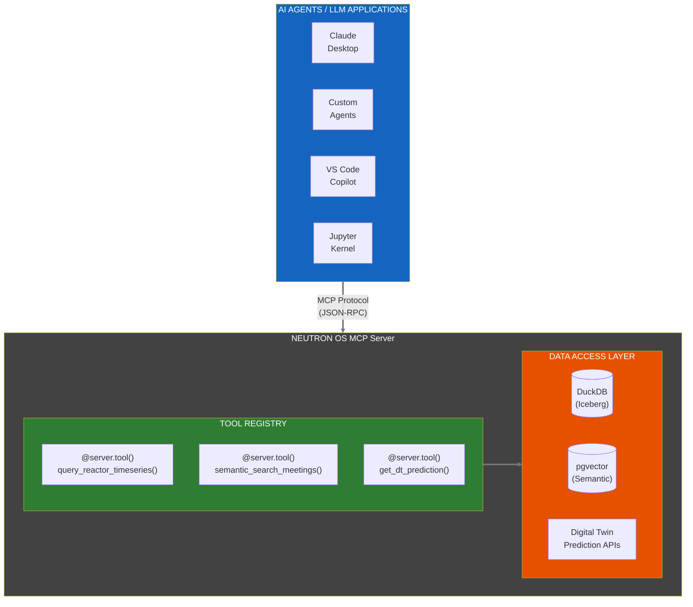

# ADR-006: MCP Server for Agentic Data Access

**Status:** Proposed  
**Date:** 2026-01-15  
**Decision Makers:** Ben, Team  
**Inspired By:** INL DeepLynx Nexus `deeplynx.mcp/` implementation

## Context

AI agents and LLM-powered applications need programmatic access to Neutron OS data. Currently, data access requires:
1. Direct SQL queries (requires schema knowledge)
2. Custom API endpoints (requires development effort per use case)
3. Manual data export (not suitable for automation)

INL's DeepLynx Nexus has implemented an early MCP (Model Context Protocol) server that exposes tools for AI agents to query projects and records. This pattern is worth adopting.

The Model Context Protocol (MCP) is Anthropic's open standard for connecting AI assistants to external data sources and tools. It provides a standardized way for LLMs to:
- Discover available tools
- Execute queries with proper parameters
- Receive structured responses

## Decision

We will implement a **Python MCP server** exposing Neutron OS data and operations as tools for AI agents.

### Tool Categories

| Category | Tools | Purpose |
|----------|-------|---------|
| **Query** | `query_reactor_timeseries`, `query_simulation_outputs`, `search_log_entries` | Read data from lakehouse |
| **Semantic** | `semantic_search_meetings`, `find_similar_scenarios` | Vector search via pgvector |
| **Metadata** | `list_projects`, `get_schema`, `list_tables` | Discovery and schema info |
| **Predict** | `get_dt_prediction`, `compare_prediction_actual` | Digital twin outputs |
| **Write** | `create_log_entry`, `log_meeting_action_item` | Controlled data creation |

### Architecture



### Implementation

```python
# services/mcp-server/neutron_os_mcp/server.py

from mcp.server import Server
from mcp.types import Tool, TextContent
import duckdb

server = Server("neutron-os")

@server.tool()
async def query_reactor_timeseries(
    reactor_id: str,
    metric: str,
    start_time: str,
    end_time: str,
    limit: int = 1000
) -> list[TextContent]:
    """
    Query reactor time-series data from the lakehouse.
    
    Args:
        reactor_id: Reactor identifier (e.g., 'TRIGA-001')
        metric: Metric to query (e.g., 'power_kw', 'temp_fuel_c')
        start_time: ISO timestamp start
        end_time: ISO timestamp end
        limit: Max rows to return
    
    Returns:
        Markdown table of results
    """
    sql = f"""
    SELECT timestamp, {metric}
    FROM gold.reactor_metrics
    WHERE reactor_id = ?
      AND timestamp BETWEEN ? AND ?
    ORDER BY timestamp
    LIMIT ?
    """
    conn = duckdb.connect('/path/to/lakehouse')
    result = conn.execute(sql, [reactor_id, start_time, end_time, limit]).fetchdf()
    return [TextContent(type="text", text=result.to_markdown())]

@server.tool()
async def search_log_entries(
    query: str,
    facility: str | None = None,
    entry_type: str | None = None,  # 'ops' or 'dt'
    limit: int = 10
) -> list[TextContent]:
    """
    Semantic search over unified log entries using pgvector embeddings.
    
    Args:
        query: Natural language search query
        facility: Optional facility filter
        entry_type: Optional filter for 'ops' or 'dt' entries
        limit: Max results
    
    Returns:
        Relevant log entries with similarity scores
    """
    # Implementation uses pgvector for semantic search
    ...

@server.tool()
async def get_dt_prediction(
    digital_twin: str,
    prediction_type: str,
    horizon_seconds: int = 60
) -> list[TextContent]:
    """
    Get current digital twin prediction for reactor state.
    
    Args:
        digital_twin: Which DT to query ('triga', 'msr', 'mit_loop', 'offgas')
        prediction_type: What to predict ('power', 'temperature', 'xe_concentration')
        horizon_seconds: How far ahead to predict
    
    Returns:
        Prediction with uncertainty bounds
    """
    ...
```

## Alternatives Considered

| Alternative | Reason Not Selected |
|-------------|---------------------|
| GraphQL API | LLMs generate SQL better than GraphQL; adds complexity |
| REST endpoints only | No standardized tool discovery; harder for agents |
| Direct database access | Security risk; no rate limiting; no audit |
| DeepLynx adoption | Different data model; C# stack doesn't fit our team |

## Comparison with DeepLynx MCP

| Aspect | DeepLynx MCP | Neutron OS MCP |
|--------|--------------|----------------|
| Language | C# | Python |
| Data Model | Graph (records/edges) | SQL (Iceberg tables) |
| Tools | ProjectTools, RecordTools | Query, Semantic, Predict tools |
| Auth | Inherited from DeepLynx | API keys + RLS |

## Consequences

### Positive
- AI agents can query data without schema knowledge
- Standardized interface for all LLM applications
- Audit trail of agent queries
- Rate limiting and access control at tool level

### Negative
- New service to maintain
- Must keep tools in sync with schema changes
- Potential for expensive queries if not bounded

### Mitigations
- Auto-generate tool docs from schema
- Enforce query limits in tool implementations
- Log all tool invocations for audit

## Implementation Plan

| Phase | Deliverable | Timeline |
|-------|-------------|----------|
| 1 | Query tools (read-only) | Week 1-2 |
| 2 | Semantic search tools | Week 3 |
| 3 | Digital twin prediction tools | Week 4 |
| 4 | Write tools (with approval flow) | Week 5-6 |

## Relationship to Search/AI Module

The MCP Server is the **technical foundation** for the planned **Search/AI module** (see [Executive PRD](../prd/neutron-os-executive-prd.md)). The module will provide:

| Capability | MCP Foundation | User-Facing Feature |
|------------|----------------|---------------------|
| **RAG** | `semantic_search_*` tools | Natural language queries over facility docs |
| **Workflow Agents** | Write tools + approval flow | AI-assisted data entry, meeting summarization |
| **Tuned LLMs** | Domain context via tools | Nuclear-specific terminology understanding |

The Search/AI module is configured **off by default** but builds on MCP infrastructure that exists for all facilities.

## References

- [Model Context Protocol Specification](https://modelcontextprotocol.io/)
- [DeepLynx MCP Implementation](https://github.com/idaholab/DeepLynx/tree/main/deeplynx.mcp)
- [mcp Python SDK](https://github.com/anthropics/mcp)
- [Tech Spec §1.5: Application Modules](../specs/neutron-os-master-tech-spec.md)
