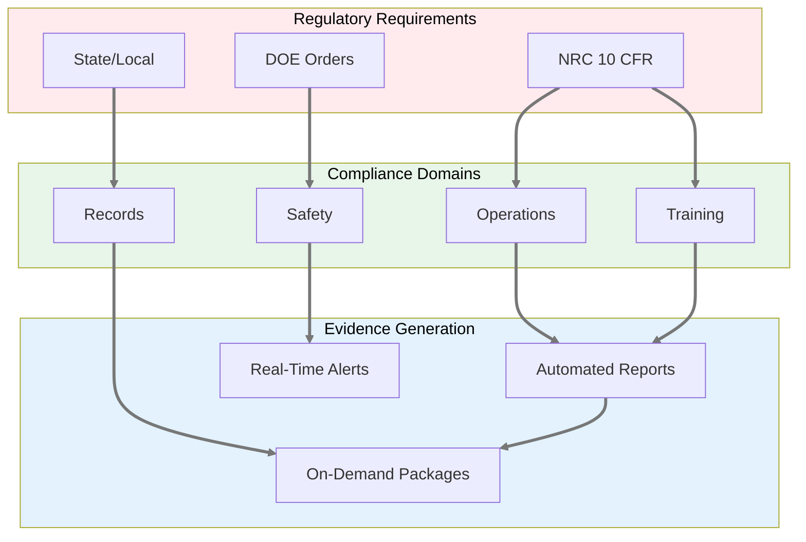
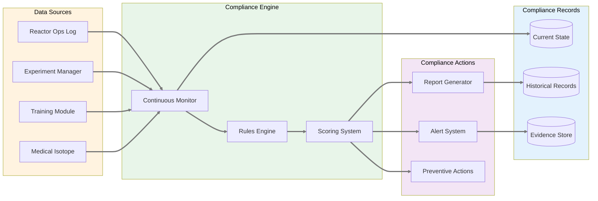
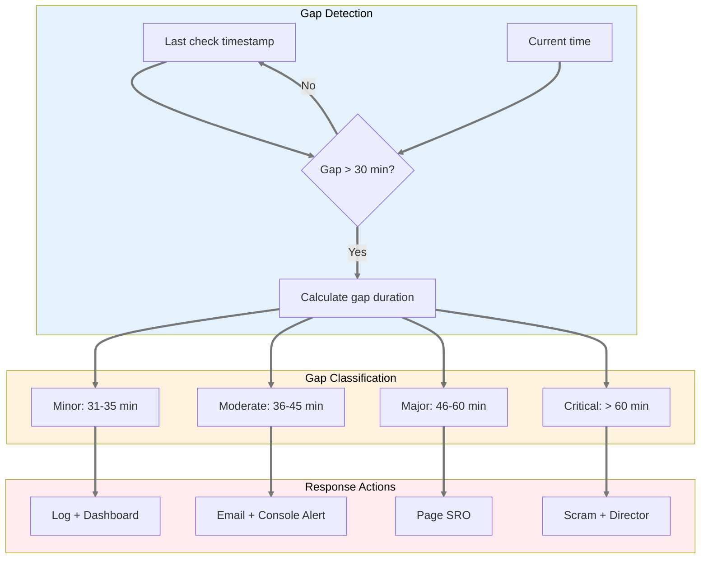
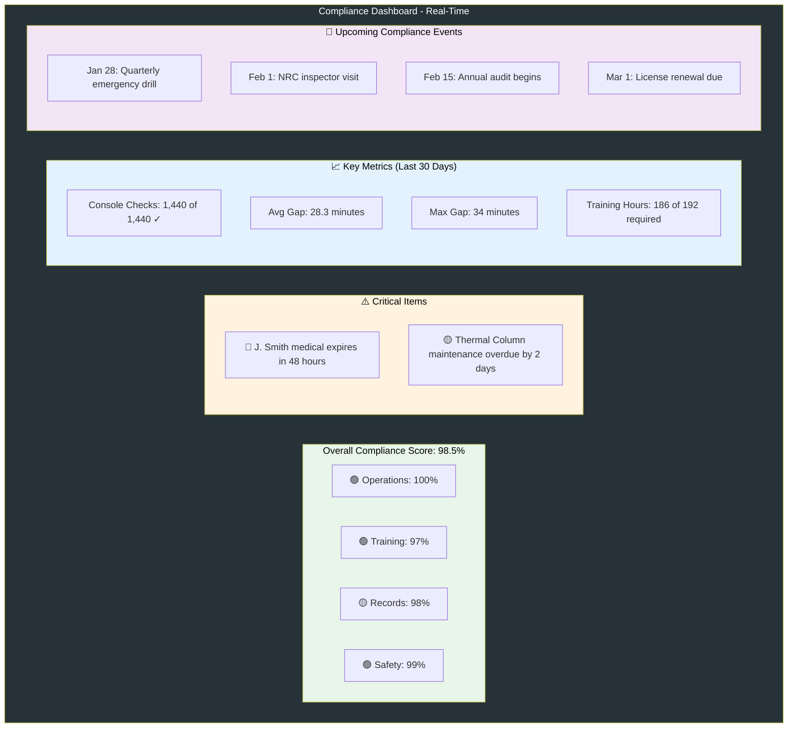
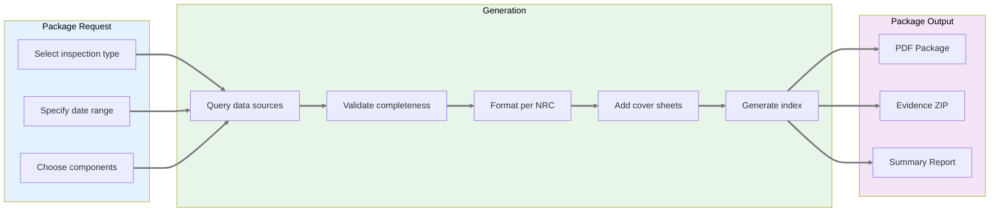

# Product Requirements Document: Compliance Tracking System

**Module:** Cross-Cutting Compliance Infrastructure  
**Status:** Draft  
**Last Updated:** January 22, 2026  
**Stakeholder Input:** Jim (TJ) - NRC requirements, 30-min checks, 2-year inspection scope  
**Related Modules:** [Reactor Ops Log](reactor-ops-log-prd.md), [Experiment Manager](experiment-manager-prd.md), [Training](../specs/neutron-os-master-tech-spec.md)  
**Parent:** [Executive PRD](neutron-os-executive-prd.md)

---

## Executive Summary

The Compliance Tracking System is a **cross-cutting concern** that ensures regulatory compliance across all Neutron OS modules. It monitors operational requirements (30-minute console checks, training currency, authorization validity), generates evidence packages for inspections, and provides real-time compliance dashboards. Rather than each module implementing its own compliance logic, this centralized system provides consistent tracking, alerting, and reporting.

**Key Principle:** Compliance is about **monitoring, evidence, and reporting**, not about the operational activities themselves. The Reactor Ops Log records operations, Training tracks certifications, but the Compliance System ensures nothing falls through the cracks.

---

## Regulatory Framework



---

## Compliance Monitoring Architecture



---

## Key Compliance Requirements

### 30-Minute Console Checks (Jim's Priority)



### Training Currency Tracking

| Requirement | Frequency | Track | Alert | Action |
|-------------|-----------|-------|-------|--------|
| **Initial Qualification** | Once | Completion date, exam score | N/A | Enable operator privileges |
| **Requalification** | 4 hrs/quarter | Hours completed, topics covered | 30 days before due | Block console access if expired |
| **Medical Exam** | Annual | Exam date, clearance status | 60 days before due | Remove from shift schedule |
| **Emergency Drill** | Quarterly | Participation, role, performance | 2 weeks before quarter end | Schedule makeup session |
| **Regulatory Changes** | As needed | Training date, acknowledgment | Upon publication | Require read & sign |

### Experiment Authorization Tracking

```mermaid
stateDiagram-v2
    [*] --> Draft: Researcher creates
    Draft --> Submitted: Submit for review
    
    Submitted --> UnderReview: RM assigns reviewer
    UnderReview --> ChangesRequested: Issues found
    ChangesRequested --> Submitted: Resubmit
    
    UnderReview --> HPReview: RM approves
    HPReview --> DirectorReview: HP approves
    DirectorReview --> ROCQueue: Director approves
    
    ROCQueue --> ROCReview: Monthly meeting
    ROCReview --> Approved: ROC approves
    ROCReview --> Rejected: ROC rejects
    
    Approved --> Active: First use
    Active --> Expired: Time/usage limit
    Expired --> Renewal: Request extension
    Renewal --> ROCQueue: Review again
    
    Rejected --> [*]
    
    note right of Approved
        Authorized Experiment
        can cover multiple
        Routine Experiments
    end note
    linkStyle default stroke:#777777,stroke-width:3px
```

---

## Compliance Dashboards

### Real-Time Compliance Monitor



### NRC Inspection Package Generator



---

## User Stories

### Compliance Officers

1. **As a compliance officer**, I want a real-time dashboard showing all compliance metrics so I can identify issues before they become violations.

2. **As a compliance officer**, I want to generate NRC inspection packages covering any 2-year period with one click.

3. **As a compliance officer**, I want automatic alerts when any compliance metric drops below threshold so I can take corrective action.

4. **As a compliance officer**, I want trend analysis showing compliance patterns over time to identify systemic issues.

### Operations Staff

5. **As a reactor operator**, I want visual/audio reminder for 30-minute checks so I never miss one.

6. **As a shift supervisor**, I want to see compliance status for my shift including any gaps from previous shifts.

7. **As a reactor manager**, I want weekly compliance reports showing performance by shift and operator.

### Training Coordinators

8. **As a training coordinator**, I want to see who needs requalification in the next 30/60/90 days.

9. **As a training coordinator**, I want automatic scheduling of required training before expiration.

10. **As a training coordinator**, I want proof of completion records that satisfy NRC requirements.

### Management

11. **As a facility director**, I want monthly compliance trending to present at management reviews.

12. **As a facility director**, I want predictive alerts about future compliance risks based on current trends.

---

## Compliance Rules Engine

### Rule Categories

| Category | Examples | Enforcement | Escalation |
|----------|----------|-------------|------------|
| **Hard Requirements** | 30-min checks, licensed operator on console | System interlock - cannot proceed | Immediate to SRO/RM |
| **Procedural** | Two-person rule, independent verification | Warning with override option | Log override with reason |
| **Best Practice** | ALARA reviews, pre-job briefs | Suggestion only | Track for trending |
| **Facility-Specific** | Local procedures, additional requirements | Configurable enforcement | Per facility policy |

### Rule Definition Language

```yaml
# Example: 30-Minute Console Check Rule
rule:
  id: NRC-10CFR50-CONSOLE-CHECK
  name: "30-Minute Console Check"
  category: hard_requirement
  regulation: "10 CFR 50.54(i)"
  description: "Licensed operator must check console indicators every 30 minutes during operation"
  
  trigger:
    source: reactor_ops_log
    event: console_check_logged
    
  condition:
    time_since_last: 
      max_minutes: 30
      
  violation_response:
    minor:  # 31-35 minutes
      - log_gap
      - update_dashboard
      
    moderate:  # 36-45 minutes  
      - log_gap
      - email_supervisor
      - console_alert
      
    major:  # 46-60 minutes
      - log_gap
      - page_sro
      - email_reactor_manager
      
    critical:  # >60 minutes
      - log_gap
      - automatic_scram
      - notify_director
      - file_event_report
```

---

## Integration Points

### Data Sources

| System | Provides | Update Frequency | Used For |
|--------|----------|------------------|----------|
| **Reactor Ops Log** | Console checks, power levels, maintenance | Real-time | 30-min compliance, tech specs |
| **Experiment Manager** | ROC approvals, sample records | On change | Authorization validity |
| **Training Module** | Certifications, hours, expiry | Daily sync | Currency tracking |
| **Medical Isotope** | QA records, shipping docs | On completion | Quality compliance |
| **Personnel** | Medical clearance, background checks | Weekly sync | Operator eligibility |
| **Scheduling** | Planned activities, staff assignments | Real-time | Coverage verification |

### Compliance Outputs

| Output | Format | Recipients | Frequency |
|--------|--------|-----------|-----------|
| **Real-time Dashboard** | Web/Mobile | All staff | Continuous |
| **Daily Summary** | Email | Supervisors, RM | 6 AM daily |
| **Weekly Report** | PDF | Management | Monday AM |
| **Monthly Metrics** | PDF + Excel | Director, ROC | 1st of month |
| **NRC Package** | PDF + ZIP | Inspectors | On demand |
| **Audit Trail** | Immutable log | Compliance, IT | Continuous |

---

## Success Metrics

| Metric | Target | Current Baseline | Measurement |
|--------|--------|------------------|-------------|
| **30-Min Check Compliance** | 100% | 98.5% (paper logs) | Zero gaps >30 min |
| **Training Currency** | 100% | 95% (spreadsheet) | All ops qualified |
| **Inspection Prep Time** | <4 hours | 2-3 days | Package generation time |
| **Evidence Completeness** | 100% | ~90% (searching) | All required docs present |
| **Alert Response Time** | <5 min | Unknown | Time to acknowledge |
| **Audit Findings** | Zero repeat | 2-3 per year | NRC inspection results |

---

## Implementation Considerations

### Data Retention

Data retention policies are defined at the system level in the master specification. This module implements compliance-specific retention tracking:

**See also:** 
- [Master Tech Spec § 9.2: Backup & Archive Strategy](../specs/neutron-os-master-tech-spec.md#92-backup--archive-strategy)
- [Data Architecture § 9: Backup & Retention Policy](../specs/data-architecture-spec.md#9-backup--retention-policy)

**Compliance-Specific Retention Windows:**
- **Operational data**: 2 years minimum per NRC inspection window
- **Training records**: 5 years for initial qualifications, 3 years for recurring
- **Audit trails**: 7 years for all compliance actions (exceeds NRC minimum for defensibility)
- **Inspection packages**: Permanent archive in facility-controlled storage

**Integration with System Backup Strategy:**
- All compliance records are included in the daily backup cycle
- Inspection packages are automatically archived to Glacier-tier storage
- Training records are encrypted and retained per facility policy
- All retention is enforced at the data layer, not just in application logic

### Access Control

- **View dashboards**: All badged personnel
- **Acknowledge alerts**: Authorized operators
- **Override warnings**: SRO or above
- **Modify rules**: Compliance officer + RM approval
- **Generate packages**: Compliance, management, NRC

### Fail-Safe Design

```mermaid
flowchart TD
    subgraph Normal["✅ Normal Operation"]
        N1[Real-time monitoring]
        N2[Automated alerts]
        N3[Dashboard updates]
    end
    
    subgraph Degraded["⚠️ Degraded Mode"]
        D1[Batch processing (hourly)]
        D2[Email alerts only]
        D3[Static reports]
    end
    
    subgraph Failure["🔴 System Failure"]
        F1[Paper log backup]
        F2[Manual verification]
        F3[Recovery procedures]
    end
    
    Normal -->|Connection lost| Degraded
    Degraded -->|System down| Failure
    Failure -->|System restored| Normal
    
    style Normal fill:#e8f5e9,color:#000000
    style Degraded fill:#fff3e0,color:#000000
    style Failure fill:#ffebee,color:#000000
    linkStyle default stroke:#777777,stroke-width:3px
```

---

## Implementation Phases

### Phase 1: Core Compliance (Month 1)
- 30-minute check tracking
- Basic compliance dashboard
- Manual gap reporting
- Simple alerting

### Phase 2: Expanded Tracking (Month 2)
- Training currency
- Experiment authorizations
- Automated alerts
- Weekly reports

### Phase 3: NRC Package Generation (Month 3)
- Evidence compilation
- Package formatting
- Search and retrieval
- Archive system

### Phase 4: Advanced Analytics (Months 4-6)
- Predictive analytics
- Trend identification
- Risk scoring
- Process optimization

---

*This PRD defines the Compliance Tracking System as a cross-cutting concern that monitors regulatory requirements across all Neutron OS modules while maintaining separation of concerns.*