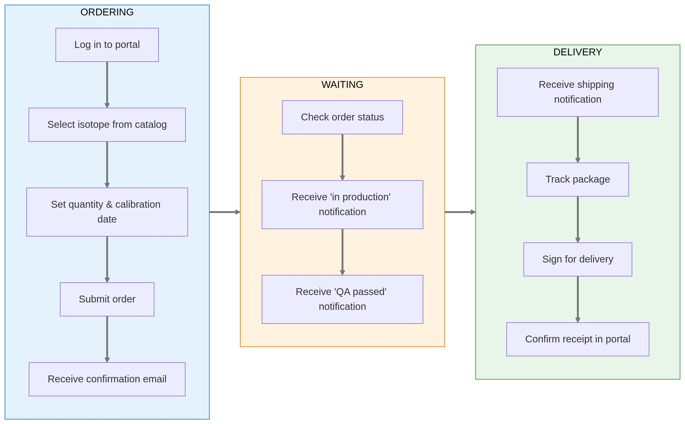
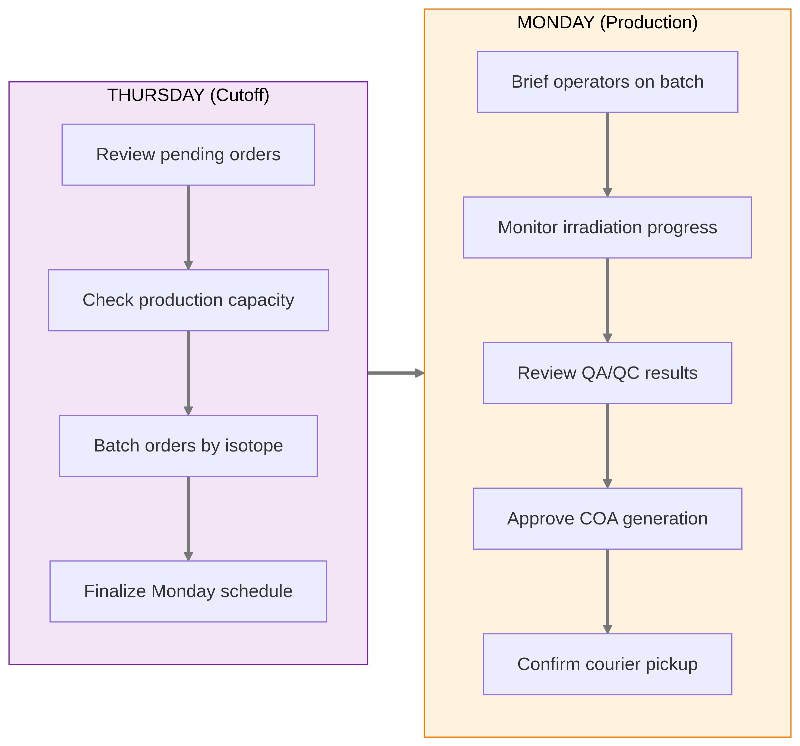
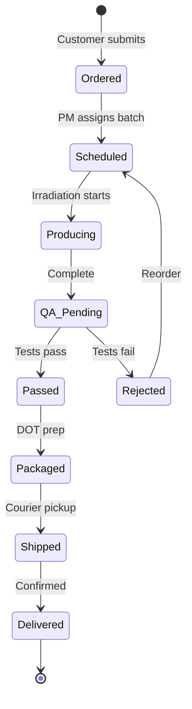
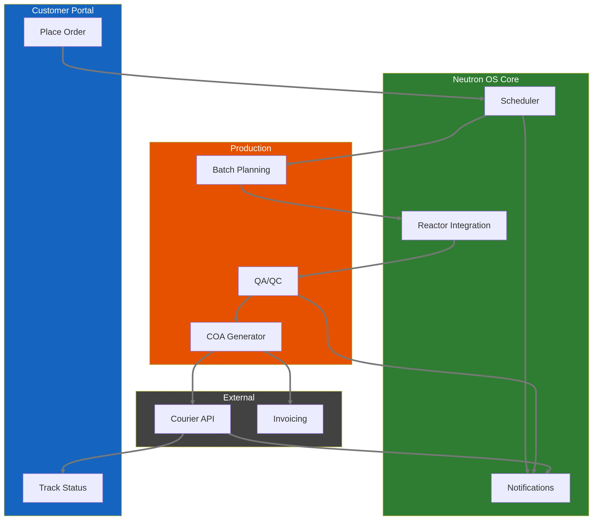
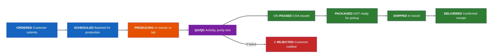
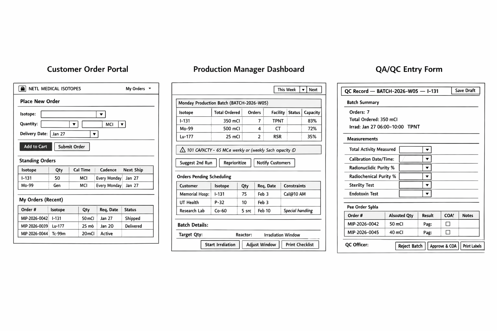
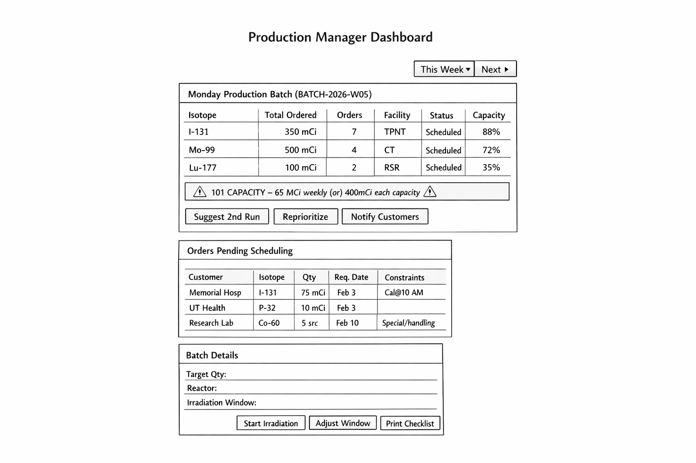
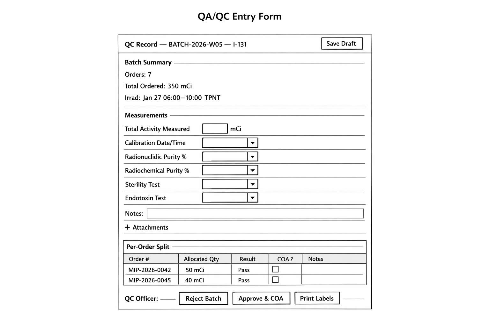
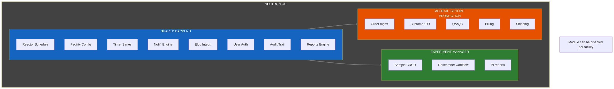

**Product Requirements Document: Medical Isotope Production**

**[published] v2.1.3** | February 25, 2026

**Module:** Medical Isotope Production & Fulfillment

**Related Modules:** Experiment Manager (shared backend, different workflow)  
**Parent Document:** Neutron OS Executive PRD

**Module Type:** Optional (configurable on/off per facility mission)

**Table of Contents**
- [Executive Summary](#executive-summary)
- [User Journey Map](#user-journey-map)
- [Hospital Customer: Order to Delivery](#hospital-customer:-order-to-delivery)
- [Production Manager: Weekly Batch](#production-manager:-weekly-batch)
- [Order State Machine](#order-state-machine)
- [System Integration](#system-integration)
- [Current State (to be validated)](#current-state-to-be-validated)
- [User Stories](#user-stories)
- [Primary Users](#primary-users)
- [User Stories: Ordering](#user-stories:-ordering)
- [User Stories: Production](#user-stories:-production)
- [User Stories: Quality & Compliance](#user-stories:-quality--compliance)
- [User Stories: Fulfillment & Delivery](#user-stories:-fulfillment--delivery)
- [User Stories: Analytics](#user-stories:-analytics)
- [Isotope Catalog (Configurable)](#isotope-catalog-configurable)
- [Workflow Stages](#workflow-stages)
- [Stage Transitions](#stage-transitions)
- [Order Schema](#order-schema)
- [Production Batch Schema](#production-batch-schema)
- [QC Record Schema](#qc-record-schema)
- [UI Mockup Concepts](#ui-mockup-concepts)
- [Customer Order Portal](#customer-order-portal)
- [Production Manager Dashboard](#production-manager-dashboard)
- [QA/QC Entry Form](#qa/qc-entry-form)
- [Integration Points](#integration-points)
- [Shared with Experiment Manager](#shared-with-experiment-manager)
- [Medical Isotope-Specific](#medical-isotope-specific)
- [Regulatory Considerations](#regulatory-considerations)
- [NRC Requirements](#nrc-requirements)
- [FDA Requirements (if applicable)](#fda-requirements-if-applicable)
- [DOT Requirements](#dot-requirements)
- [Configurability](#configurability)
- [Success Metrics](#success-metrics)
- [Open Questions](#open-questions)
- [Relationship to Experiment Manager](#relationship-to-experiment-manager)
- [NEUP Research Addendum](#neup-research-addendum)
- [NEUP Proposal: Medical Isotope Production Optimization](#neup-proposal:-medical-isotope-production-optimization)
- [Optimization Objectives](#optimization-objectives)
- [New Requirements](#new-requirements)
- [New User Stories](#new-user-stories)
- [Digital Twin Integration](#digital-twin-integration)

## Executive Summary

The Medical Isotope Production module manages the end-to-end workflow
for producing and delivering medical radioisotopes to healthcare
providers. It replaces the current manual process (phone calls,
spreadsheets, weekly production schedules) with a digital system that
handles ordering, production scheduling, quality assurance, fulfillment,
and delivery tracking.

**Key Distinction from Experiment Manager:**

- **Experiment Manager:** Researcher-initiated, variable samples,
  research outcomes

- **Medical Isotope Production:** Customer-initiated orders,
  standardized products, patient care outcomes

Both share technical backend (scheduling, tracking, reactor integration)
but serve fundamentally different workflows and stakeholders.

## User Journey Map

### Hospital Customer: Order to Delivery

### Production Manager: Weekly Batch

### Order State Machine

### System Integration

## Current State (to be validated)

Based on typical research reactor medical isotope programs:

- **Production cadence:** Weekly, typically Mondays
- **Ordering process:** Phone calls and emails to reactor staff
- **Tracking:** Spreadsheets, paper records
- **Delivery:** Courier pickup on production day
- **Customers:** Hospital nuclear medicine departments, radiopharmacies, research institutions

**Pain points (hypothesized):**

- No self-service ordering for repeat customers

- Manual coordination between customer requests and production schedule

- Limited visibility into order status

- Paper-based QA/QC records

- Reactive (not proactive) communication about delays

## User Stories

### Primary Users

| User | Need |
|----|----|
| Hospital/Radiopharmacy Staff | Order isotopes reliably, know when they'll arrive |
| Reactor Production Manager | See all orders, plan production batch, track fulfillment |
| QA/QC Officer | Document quality checks, certify shipments |
| Courier/Logistics | Know pickup times, receive shipping documentation |
| Billing/Admin | Generate invoices, track payments |
| Facility Director | See production metrics, revenue, capacity utilization |

### User Stories: Ordering

1.  **As a hospital nuclear medicine tech**, I want to place a standing
    order for I-131 (same quantity, same day each week) so that I don't
    have to call every week.

2.  **As a hospital buyer**, I want to see available isotopes and
    current lead times so that I can plan patient treatments.

3.  **As a new customer**, I want to request an account and see pricing
    before committing.

4.  **As an existing customer**, I want to view my order history and
    reorder with one click.

5.  **As a customer**, I want to receive automatic confirmation when my
    order is accepted and updates when it ships.

### User Stories: Production

6.  **As a production manager**, I want to see all orders for the
    upcoming production cycle so that I can batch similar isotopes
    efficiently.

7.  **As a production manager**, I want to flag when demand exceeds
    capacity so that I can prioritize or reschedule orders.

8.  **As an operator**, I want a production checklist that guides me
    through irradiation steps for each isotope type.

9.  **As a production manager**, I want to record actual production
    quantities (may differ from target due to yield variations).

### User Stories: Quality & Compliance

10. **As a QA officer**, I want to record quality measurements
    (activity, purity, sterility) against acceptance criteria.

11. **As a QA officer**, I want to generate a Certificate of Analysis
    (COA) for each shipment.

12. **As a compliance officer**, I want immutable records of all
    production and QA activities for FDA/NRC inspection.

13. **As a QA officer**, I want to reject a batch if it doesn't meet
    specifications and notify the customer.

### User Stories: Fulfillment & Delivery

14. **As a shipping coordinator**, I want to generate shipping labels
    and DOT-compliant documentation.

15. **As a courier**, I want to know exactly when packages are ready for
    pickup.

16. **As a customer**, I want real-time tracking of my shipment.

17. **As a customer**, I want proof of delivery with timestamp and
    signature.

### User Stories: Analytics

18. **As a facility director**, I want to see monthly production volume,
    revenue, and on-time delivery rate.

19. **As a production manager**, I want to see yield trends over time
    (are we getting better or worse at production?).

## Isotope Catalog (Configurable)

Example products for a TRIGA facility (actual catalog varies):

| Isotope | Half-Life | Common Use | Typical Order Unit | Production Method |
|----|----|----|----|----|
| I-131 | 8.0 days | Thyroid treatment | mCi | Fission product extraction |
| Mo-99/Tc-99m | 66h / 6h | Diagnostic imaging | Generator | Fission product or (n,γ) |
| Lu-177 | 6.7 days | Cancer therapy | mCi | (n,γ) on Lu-176 |
| Ir-192 | 74 days | Brachytherapy | Seeds | (n,γ) on Ir-191 |
| Co-60 | 5.3 years | Radiation therapy | Sources | (n,γ) on Co-59 |
| P-32 | 14.3 days | Research/therapy | mCi | (n,γ) on S-32 |

**Configurable per facility:**

- Which isotopes are offered

- Pricing per unit

- Minimum/maximum order quantities

- Lead time requirements

- Available production days

## Workflow Stages

### Stage Transitions

| From | To | Trigger | Data Captured |
|----|----|----|----|
| Ordered | Scheduled | Manager assigns to production batch | Production date, batch ID |
| Scheduled | Producing | Irradiation begins | Start time, reactor conditions |
| Producing | QA/QC | Irradiation complete, sample ready | End time, actual activity |
| QA/QC | Passed | All QC checks pass | QC measurements, COA |
| QA/QC | Rejected | Any QC check fails | Failure reason |
| Passed | Packaged | Package prepared | Package ID, DOT class |
| Packaged | Shipped | Courier picks up | Tracking number, pickup time |
| Shipped | Delivered | Customer confirms receipt | Delivery time, signature |

## Order Schema

| Field | Type | Description | Example |
|----|----|----|----|
| order_id | UUID | System-assigned | 550e8400-... |
| order_number | string | Human-readable | MIP-2026-0042 |
| customer_id | UUID | Link to customer record |  |
| isotope_code | enum | From catalog | I-131 |
| quantity_ordered | decimal | Requested amount | 50.0 |
| quantity_unit | enum | mCi, µCi, MBq, etc. | mCi |
| calibration_datetime | timestamp | When activity should be calibrated to | 2026-01-27T12:00:00Z |
| requested_delivery_date | date | Customer's requested date | 2026-01-27 |
| actual_delivery_date | date | When delivered |  |
| order_status | enum | Current stage | producing |
| production_batch_id | UUID | Link to production batch |  |
| total_price | decimal | Calculated from catalog | 1250.00 |
| special_instructions | text | Customer notes | "Need by 10 AM for patient treatment" |
| created_at | timestamp | Order submission time |  |
| updated_at | timestamp | Last status change |  |

## Production Batch Schema

| Field | Type | Description | Example |
|----|----|----|----|
| batch_id | UUID | System-assigned |  |
| batch_number | string | Human-readable | BATCH-2026-W04 |
| production_date | date | Scheduled production | 2026-01-27 |
| isotope_code | enum | Isotope being produced | I-131 |
| target_quantity | decimal | Sum of orders | 500.0 |
| actual_quantity | decimal | What was actually produced | 485.0 |
| yield_percentage | decimal | Actual/target | 97.0 |
| reactor_power_kw | decimal | Power during irradiation | 950.0 |
| irradiation_start | timestamp | Start time |  |
| irradiation_end | timestamp | End time |  |
| irradiation_facility | enum | Which facility | TPNT |
| batch_status | enum | Current status | qa_pending |
| orders | array\[UUID\] | Orders in this batch |  |

## QC Record Schema

| Field | Type | Description | Example |
|----|----|----|----|
| qc_id | UUID | System-assigned |  |
| batch_id | UUID | Link to batch |  |
| order_id | UUID | Link to specific order (if split batch) |  |
| measured_activity | decimal | Measured activity | 52.3 |
| activity_unit | enum | Unit | mCi |
| calibration_datetime | timestamp | When measured |  |
| radionuclidic_purity | decimal | % purity | 99.8 |
| radiochemical_purity | decimal | % purity | 99.5 |
| sterility_test | enum | pass/fail/na | pass |
| endotoxin_test | enum | pass/fail/na | pass |
| overall_result | enum | pass/fail | pass |
| qc_officer_id | string | Who performed QC |  |
| notes | text | Additional observations |  |
| coa_generated | boolean | COA issued | true |
| coa_file_uri | string | Link to PDF |  |

## UI Mockup Concepts

### Customer Order Portal

### Production Manager Dashboard

### QA/QC Entry Form

## Integration Points

### Shared with Experiment Manager

| Component                   | Shared? | Notes                                  |
|-----------------------------|---------|----------------------------------------|
| Reactor scheduling          | Yes     | Both need to book reactor time         |
| Reactor time-series         | Yes     | Both correlate with reactor conditions |
| Facility definitions        | Yes     | Same irradiation positions             |
| Reactor Ops Log integration | Yes     | Production activities logged           |
| User authentication         | Yes     | Same identity system                   |
| Notification engine         | Yes     | Both send emails/SMS                   |

### Medical Isotope-Specific

| Component            | Description                                  |
|----------------------|----------------------------------------------|
| Customer database    | Hospitals, radiopharmacies with billing info |
| Pricing engine       | Catalog prices, volume discounts             |
| COA generator        | PDF certificates with regulatory formatting  |
| Shipping integration | DOT compliance, tracking APIs (FedEx, UPS)   |
| Billing/invoicing    | Connect to accounting system                 |

## Regulatory Considerations

### NRC Requirements

- 10 CFR Part 30: Specific licenses for byproduct material

- 10 CFR Part 35: Medical use of byproduct material

- Package labeling and shipping documentation

### FDA Requirements (if applicable)

- Drug Master Files (DMF) for certain radiopharmaceuticals

- cGMP compliance for radiopharmaceutical production

### DOT Requirements

- 49 CFR 173: Packaging requirements

- Proper shipping names, UN numbers

- Activity limits per package

**System Support:**

- Templates for required documentation

- Validation that activity limits aren't exceeded

- Audit trail for all production and QC activities

## Configurability

| Aspect | Configurable | Notes |
|----|----|----|
| Isotope catalog | Yes | Each facility offers different isotopes |
| Pricing | Yes | Facility-specific pricing |
| Production days | Yes | Some facilities produce multiple days/week |
| QC parameters | Yes | Acceptance criteria may vary by product |
| Customer tiers | Yes | Academic vs. commercial pricing |
| Lead time rules | Yes | Order cutoff times |
| Shipping carriers | Yes | Which couriers are used |
| Documentation templates | Yes | Facility branding, format preferences |

**Module On/Off:**

- Facility director can enable/disable entire module

- Facilities without medical isotope programs don't see this module at
  all

- When enabled, appears as separate section in Neutron OS navigation

## Success Metrics

| Metric | Target | Measurement |
|----|----|----|
| Order-to-delivery time | \<24 hours from production | Timestamp tracking |
| On-time delivery rate | \>98% | Delivered by requested date |
| QC pass rate | \>99% | Batches passing all QC |
| Customer self-service | \>80% of orders via portal | vs. phone/email |
| Repeat order rate | Track | Customer loyalty indicator |
| Revenue per production day | Track | Operational efficiency |

## Open Questions

20. **Existing customer list:** Who are current medical isotope
    customers? What's order volume?

21. **Pricing structure:** How is pricing determined? Volume discounts?

22. **Production capacity:** What's max weekly production per isotope?

23. **Shipping logistics:** Which carriers? Who schedules pickups?

24. **Billing integration:** What accounting system is used?

25. **Standing order patterns:** What % of orders are recurring vs.
    one-time?

26. **Regulatory documentation:** What COA format is currently used?

## Relationship to Experiment Manager

**Shared code estimate:** ~60% of backend logic is reusable between
modules.

## NEUP Research Addendum

### NEUP Proposal: Medical Isotope Production Optimization

**Proposal:** AI-driven optimization of medical isotope production
scheduling and yield prediction.

**Supporting PRD Sections:**

- Section "Production Batch Schema" (target_quantity, actual_quantity,
  yield_percentage)

- User stories around production scheduling

- Integration with Scheduling System PRD

**Gap Addressed:** Current PRD relies on manual batch planning by
production manager; no optimization or yield prediction.

#### Optimization Objectives

| Objective | Weight | Description |
|----|----|----|
| Maximize yield | 40% | Minimize decay losses between production and calibration |
| Meet deadlines | 35% | Ensure all orders ship on time |
| Reactor efficiency | 15% | Optimize reactor time utilization |
| Balance portfolio | 10% | Distribute production across isotope types |

#### New Requirements

| ID | Requirement | Priority |
|----|----|----|
| MI-020 | Yield prediction model based on historical data and reactor conditions | P1 |
| MI-021 | AI-recommended production schedules minimizing decay losses | P1 |
| MI-022 | Alternative schedule generation when constraints conflict | P2 |
| MI-023 | Integration with DT power predictions for flux estimation | P2 |

#### New User Stories

27. **As a production manager**, I want AI-recommended production
    schedules that minimize decay losses while meeting all customer
    deadlines.

28. **As a production manager**, I want yield predictions with
    confidence intervals before committing to a production batch.

29. **As a production manager**, I want to see the impact of reactor
    schedule changes on all pending isotope orders.

#### Digital Twin Integration

| DT Capability        | Isotope Production Use                          |
|----------------------|-------------------------------------------------|
| Power predictions    | Estimate flux during planned irradiation window |
| Burnup tracking      | Adjust activation estimates for target position |
| Schedule integration | Coordinate with other facility activities       |

*This addendum should be reviewed with medical isotope program
leadership when NEUP results are announced.*

*Document Status: Draft - Needs validation with NETL medical isotope
program staff*
