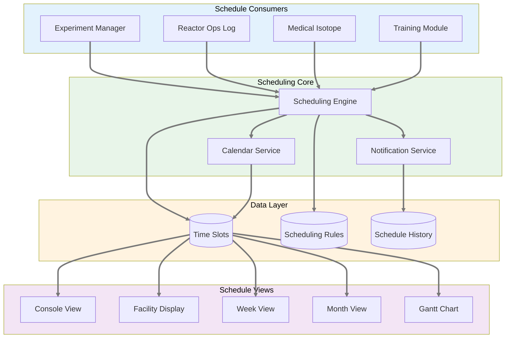
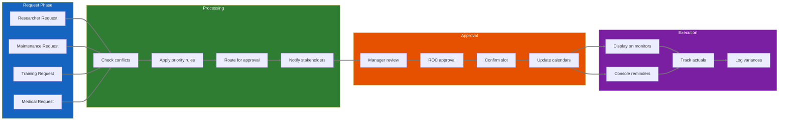
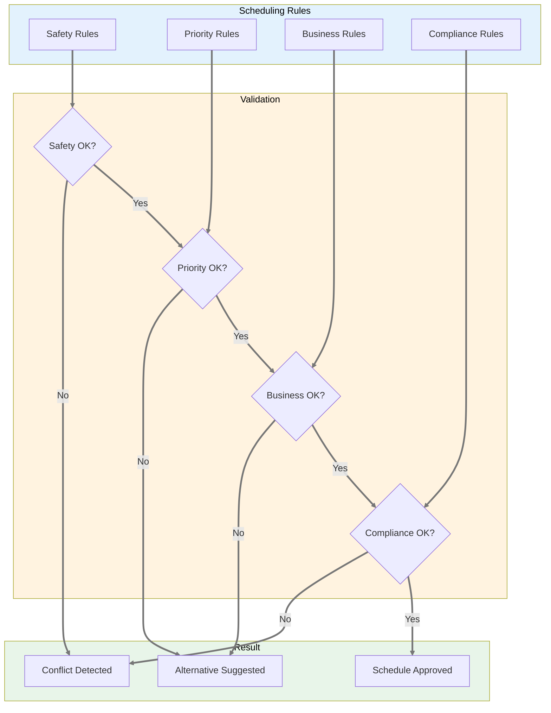
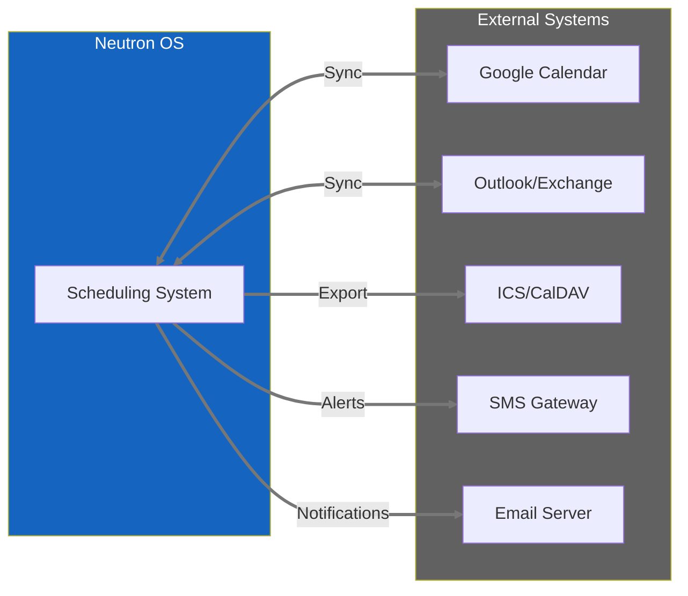
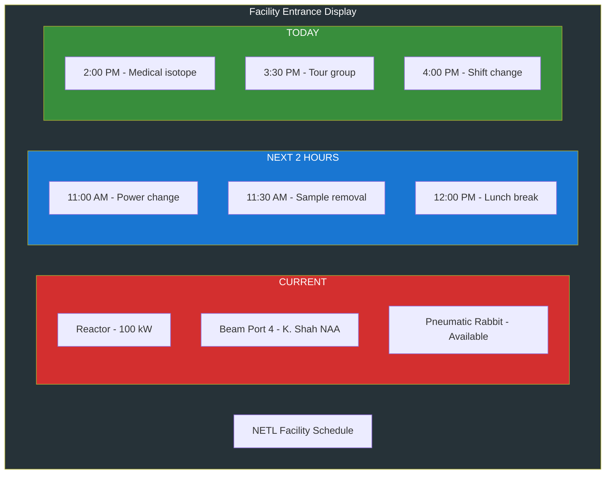

# Product Requirements Document: Scheduling System

**Module:** Cross-Cutting Scheduling Infrastructure  
**Status:** Draft  
**Last Updated:** January 22, 2026  
**Stakeholder Input:** Jim (TJ), Khiloni Shah, Nick Luciano  
**Related Modules:** [Experiment Manager](experiment-manager-prd.md), [Reactor Ops Log](reactor-ops-log-prd.md), [Medical Isotope](medical-isotope-prd.md)  
**Parent:** [Executive PRD](neutron-os-executive-prd.md)

---

## Executive Summary

The Scheduling System is a **cross-cutting concern** that provides unified time management across all Neutron OS modules. It handles reactor time allocation, facility bookings, staff assignments, maintenance windows, and regulatory inspection scheduling. Rather than each module implementing its own scheduling logic, this centralized system ensures consistency, prevents conflicts, and provides holistic visibility.

**Key Principle:** Scheduling is about **time slot allocation and conflict resolution**, not about the specifics of what happens in those slots. The Experiment Manager, Reactor Ops Log, and other modules consume scheduling services but don't own them.

---

## System Architecture

---

## User Journey: Multi-Module Scheduling

---

## Resource Types & Constraints

### Schedulable Resources

| Resource Type | Examples | Constraints | Priority |
|--------------|----------|-------------|----------|
| **Reactor Time** | Core operations, power levels | Safety limits, maintenance windows | Critical |
| **Facilities** | Beam ports, pneumatic rabbit, thermal column | One experiment at a time | High |
| **Staff** | SRO on console, HP coverage | Certification requirements, shift limits | Critical |
| **Equipment** | Detectors, hot cells, glove boxes | Calibration status, availability | Medium |
| **Spaces** | Labs, conference rooms, training areas | Capacity limits, safety requirements | Low |

### Scheduling Rules Engine

---

## Integration Points

### Module Interfaces

Each module interacts with the Scheduling System through defined interfaces:

| Module | Provides to Scheduler | Receives from Scheduler |
|--------|---------------------|------------------------|
| **Experiment Manager** | Sample metadata, duration estimates, facility needs | Approved time slots, conflict notifications |
| **Reactor Ops Log** | Maintenance windows, shift schedules | Upcoming events, staff assignments |
| **Medical Isotope** | Production requirements, shipping deadlines | Batch scheduling, resource allocation |
| **Training** | Requalification needs, course schedules | Available slots, compliance tracking |
| **Personnel** | Staff availability, certification status | Shift assignments, coverage gaps |

### External Integrations

---

## User Stories

### Schedule Requesters

1. **As a researcher**, I want to see all available reactor time slots for next week so I can plan my experiment.

2. **As a maintenance engineer**, I want to block out 4 hours for pump replacement with automatic notifications to affected users.

3. **As a training coordinator**, I want to ensure each operator gets their 4 hours/quarter requalification scheduled before deadlines.

4. **As a medical isotope customer**, I want to see available production slots that meet my delivery requirements.

### Schedule Managers

5. **As a reactor manager**, I want to review all pending schedule requests in one place with conflict indicators.

6. **As a reactor manager**, I want to set recurring maintenance windows (e.g., "Every Tuesday 6-8 AM") that automatically block scheduling.

7. **As a shift supervisor**, I want to see staffing levels for next week to identify coverage gaps.

8. **As a facility director**, I want monthly utilization reports showing scheduled vs. actual usage by category.

### Schedule Consumers

9. **As a reactor operator**, I want to see the next 4 hours of scheduled activities on my console display.

10. **As any staff member**, I want to see today's facility schedule on the entrance display when I arrive.

11. **As a researcher**, I want automatic email/SMS reminders 24 hours before my scheduled reactor time.

12. **As a compliance officer**, I want to verify that all required training was completed within regulatory timeframes.

---

## Display Requirements

### Facility Entrance Display

### Console 4-Hour View

```mermaid
gantt
    title Reactor Console - Next 4 Hours
    dateFormat HH:mm
    axisFormat %H:%M
    section Reactor
    100 kW Operation    :active, r1, 10:30, 11:00
    Power Change        :crit, r2, 11:00, 11:15
    50 kW Operation     :r3, 11:15, 14:30
    section Beam Port 4
    K. Shah NAA         :active, bp1, 10:30, 11:30
    Available           :bp2, 11:30, 14:00
    M. Johnson Setup    :bp3, 14:00, 14:30
    section Pneumatic
    Available           :p1, 10:30, 14:00
    Medical Isotope     :crit, p2, 14:00, 14:30
    section Staff
    SRO: T. Miller      :s1, 10:30, 14:30
    RO: J. Davis        :s2, 10:30, 14:30
```

---

## Success Metrics

| Metric | Target | Measurement Method |
|--------|--------|-------------------|
| **Schedule Accuracy** | 90% of scheduled activities start within 15 min | Compare scheduled vs. actual from ops log |
| **Conflict Rate** | <5% of requests have conflicts | Track rejection reasons |
| **Self-Service Adoption** | 80% of requests via portal (not email/phone) | Source tracking on requests |
| **Notification Delivery** | 100% of approved requests get confirmation within 5 min | Notification system logs |
| **Utilization Visibility** | Real-time dashboard always within 1 hour of actual | Compare schedule to ops log |
| **Compliance Coverage** | 100% of required training scheduled before expiry | Training deadline reports |

---

## Technical Requirements

### Performance

- Schedule queries return in <200ms for week view
- Support 1000+ schedule items per month
- Handle 50+ concurrent schedule viewers
- Real-time updates to all displays within 5 seconds

### Reliability

- 99.9% uptime for viewing schedules
- Graceful degradation if external calendars unavailable
- Offline-first design for read-only schedule access
- Audit trail of all schedule changes

**See also:** [Master Tech Spec § 9.4: Phased Deployment Topology](../specs/neutron-os-master-tech-spec.md#94-phased-deployment-topology) and [§ 9.6: System Resilience & Offline-First Pattern](../specs/neutron-os-master-tech-spec.md#96-system-resilience--offline-first-pattern)

The Scheduling System implements offline-first patterns to support facility operations during cloud outages:
- **Local cache**: SQLite replica of schedules synced daily at minimum
- **Outage behavior**: Serves read-only schedules from local cache; changes queued for sync when online
- **Facility displays**: Independent local data sources prevent single point of failure
- **Phased deployment**: Control room displays work even if facility server is offline; facility server works even if cloud is offline

### Security

- Role-based access to approval functions
- Immutable audit log of approvals
- Encryption of external calendar credentials
- Rate limiting on public schedule views

---

## Implementation Phases

### Phase 1: Core Scheduling (Months 1-2)
- Basic time slot management
- Conflict detection
- Manual approval workflow
- Console and facility displays

### Phase 2: Module Integration (Months 2-3)
- Experiment Manager integration
- Reactor Ops Log integration
- Notification system
- Basic reporting

### Phase 3: Advanced Features (Months 3-4)
- External calendar sync
- Recurring schedules
- Priority/optimization engine
- Mobile access

### Phase 4: Intelligence (Months 4-6)
- Utilization analytics
- Predictive scheduling
- Resource optimization
- Compliance forecasting

---

*This PRD defines the Scheduling System as a cross-cutting concern that serves all Neutron OS modules while maintaining separation of concerns.*