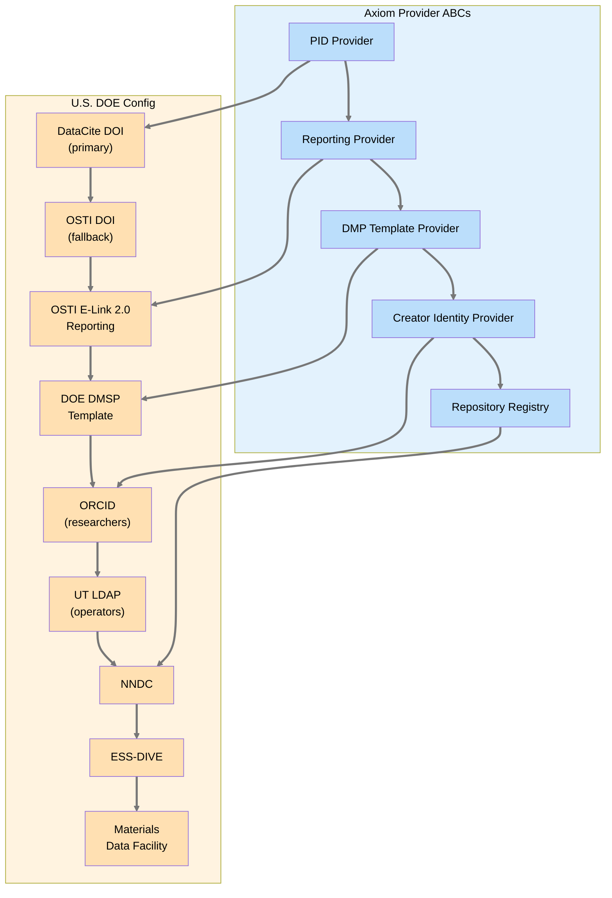

# Addendum: U.S. DOE Jurisdiction Provider Mapping

> This document maps Axiom's jurisdiction-agnostic provider abstractions to their concrete U.S. DOE / NRC configurations for Neutron OS deployments at U.S. nuclear facilities.

**Parent:** [Axiom Research Data Management PRD](https://github.com/…/axiom/docs/requirements/prd-doe-data-management.md)
**Related:** [NOS DOE Data Management PRD](prd-doe-data-management.md)
**Last Updated:** 2026-04-01

---

## Purpose

Axiom defines jurisdiction-agnostic infrastructure for FAIR data management: PID providers, reporting providers, DMP template providers, creator identity providers, and repository registries. This addendum specifies **exactly how Neutron OS configures those abstractions** for U.S. DOE-funded nuclear research, providing a concrete reference for facility operators and grant proposal writers.

---

## Provider Configuration Summary



---

## 1. PID Provider → DataCite DOI + OSTI Fallback

| Setting | Value | Notes |
|---|---|---|
| **Primary provider** | `datacite` | Mints DOIs via DataCite API. Requires UT institutional membership or DOE lab DataCite account. |
| **Fallback provider** | `osti` | OSTI assigns DOIs when datasets are reported via E-Link. Use when DataCite membership is unavailable. |
| **Offline behavior** | Queue minting requests locally; sync on connectivity restore | Nuclear facilities may operate air-gapped for periods. |
| **DOI prefix** | Assigned by DataCite to institution (e.g., `10.25982/` for some DOE labs) | Configured per deployment. |

**Example configuration:**
```toml
[data_management.pid]
providers = ["datacite", "osti"]
primary = "datacite"

[data_management.pid.datacite]
api_endpoint = "https://api.datacite.org"
repository_id_env = "DATACITE_REPOSITORY_ID"
password_env = "DATACITE_PASSWORD"
doi_prefix = "10.XXXXX"

[data_management.pid.osti]
api_endpoint = "https://www.osti.gov/elink/2.0"
api_key_env = "OSTI_API_KEY"
site_code = "UT-NETL"
```

---

## 2. Reporting Provider → OSTI E-Link 2.0

| Setting | Value | Notes |
|---|---|---|
| **Provider** | `osti` | Reports published datasets to DOE Office of Scientific and Technical Information. |
| **API** | OSTI E-Link 2.0 REST API | JSON submission; returns OSTI ID and DOI. |
| **Trigger** | Automatic on dataset transition to `published` status | Per Axiom TFA-001 lifecycle. |
| **Required fields** | title, authors, abstract, DOI, publication_date, sponsoring_organization, contract_number, access_limitations, repository_url | Per DOE Order 241.1C. |
| **Retry policy** | Exponential backoff, max 3 retries over 24 hours | Per Axiom RPT-004. |

**DOE-specific reporting obligations:**
- All scientific data from DOE-funded awards MUST be reported to OSTI (DOE Order 241.1C)
- Reports MUST be submitted within 6 months of first public access
- Restricted datasets still reported with access limitation metadata (OSTI tracks but does not host)

**Example configuration:**
```toml
[data_management.reporting]
providers = ["osti"]

[data_management.reporting.osti]
api_endpoint = "https://www.osti.gov/elink/2.0/records"
api_key_env = "OSTI_API_KEY"
site_code = "UT-NETL"
sponsoring_org = "USDOE"
# Contract number populated per-dataset from funding_source metadata
```

---

## 3. DMP Template Provider → DOE DMSP

| Setting | Value | Notes |
|---|---|---|
| **Provider** | `doe_dmsp` | Generates Data Management and Sharing Plans per DOE requirements effective Oct 1, 2025. |
| **Template structure** | 5 mandatory sections | See mapping below. |
| **Export formats** | PDF, Word (via PRT publisher) | Per DOE solicitation requirements. |
| **CLI** | `neut dmsp generate --project <name>` | Auto-populates from facility config + platform metadata. |

**DOE DMSP section → Axiom capability mapping:**

| DOE DMSP Section | What DOE Requires | Axiom Capability | Neutron OS Extension |
|---|---|---|---|
| **1. Validation & Replication** | Describe how data enables validation of published results | Iceberg time-travel queries; immutable audit trails; checksummed storage | Nuclear measurement quality SLOs (±°C, ±inch, ±%); HMAC-chained ops logs |
| **2. Timely & Fair Access** | Data supporting publications must be open at time of publication; timelines for other data | Embargo lifecycle engine (draft → embargoed → published); configurable embargo duration (DOE default: 12 months) | Export control tier mapping; EC datasets document alternative validation methods per 10 CFR 810 |
| **3. Repository Selection** | Select repositories aligned with NSTC desirable characteristics | Repository registry with NSTC qualification evaluation | Pre-configured nuclear repositories: NNDC, ESS-DIVE, MDF, OSTI DOE Data Explorer, ICSBEP/IRPhEP |
| **4. Resource Allocation** | Describe available and proposed resources for data management | Resource metering (storage, compute per facility/project); usage export for budget reporting | Facility infrastructure description auto-populated from platform config (Rascal, TACC allocations) |
| **5. Sharing Limitations** | Document protections for confidentiality, privacy, IP, security | License metadata (SPDX); DSA templates; access tier enforcement (public/restricted/EC) | 8-layer export control defense; EC → DMSP limitation auto-mapping with authority citation (10 CFR 810, EAR, ITAR); over-classification alerting |

---

## 4. Creator Identity Provider → ORCID + UT LDAP

| Setting | Value | Notes |
|---|---|---|
| **Primary provider** | `orcid` | For researchers, PIs, graduate students. Links published datasets to researcher identity. |
| **Secondary provider** | `ldap` | For facility operators who may not have ORCID iDs. Resolves against UT institutional directory. |
| **Fallback provider** | `local` | Manual identity entry for external collaborators not in ORCID or LDAP. |

**Example configuration:**
```toml
[data_management.creator_identity]
providers = ["orcid", "ldap", "local"]
primary = "orcid"

[data_management.creator_identity.orcid]
api_endpoint = "https://pub.orcid.org/v3.0"
# Read-only public API; no credentials needed for lookup

[data_management.creator_identity.ldap]
server = "ldap://ldap.utexas.edu"
base_dn = "ou=people,dc=utexas,dc=edu"
search_field = "uid"
```

---

## 5. Repository Registry → Nuclear Data Repositories

| Repository | Type | Deposit Method | Best For |
|---|---|---|---|
| **NNDC** (Brookhaven) | Nuclear data | Manual upload + metadata export | Cross-section data, decay data, nuclear structure |
| **ESS-DIVE** (LBNL) | Environmental/Earth science | REST API (ESS-DIVE API v1) | Environmental monitoring, reactor site characterization |
| **Materials Data Facility** (ANL/UChicago) | Materials science | Globus-based ingest | Fuel performance data, irradiation effects, material properties |
| **OSTI DOE Data Explorer** | General DOE | Via OSTI E-Link reporting | Any DOE-funded dataset (auto-populated from reporting provider) |
| **ICSBEP/IRPhEP** (INL) | Benchmark data | Manual submission to evaluators | Criticality safety benchmarks, reactor physics benchmarks |
| **OECD/NEA Data Bank** | International nuclear data | Institutional submission | Reactor operational data, international collaboration datasets |

**Example configuration:**
```toml
[data_management.repositories]

[data_management.repositories.nndc]
name = "National Nuclear Data Center"
url = "https://www.nndc.bnl.gov"
deposit_method = "manual"
nstc_qualified = true
best_for = ["cross_section", "decay", "nuclear_structure"]

[data_management.repositories.ess_dive]
name = "ESS-DIVE"
url = "https://ess-dive.lbl.gov"
deposit_method = "api"
api_endpoint = "https://api.ess-dive.lbl.gov/packages"
api_key_env = "ESSDIVE_API_KEY"
nstc_qualified = true
best_for = ["environmental", "site_characterization"]

[data_management.repositories.mdf]
name = "Materials Data Facility"
url = "https://materialsdatafacility.org"
deposit_method = "globus"
nstc_qualified = true
best_for = ["fuel_performance", "irradiation_effects", "materials"]

[data_management.repositories.icsbep]
name = "ICSBEP/IRPhEP"
url = "https://www.oecd-nea.org/jcms/pl_39910"
deposit_method = "manual"
nstc_qualified = true
best_for = ["criticality_benchmarks", "reactor_physics_benchmarks"]
```

---

## 6. Export Control Regime → U.S. Regulations

Axiom's access tier model (public / restricted / export_controlled) maps to specific U.S. regulatory authorities in nuclear contexts:

| Axiom Access Tier | U.S. Regulatory Authority | Scope | Platform Enforcement |
|---|---|---|---|
| `public` | None | Unrestricted data | Standard access; no special handling |
| `restricted` | Facility policy, FOIA exemptions, CBI | Sensitive but unclassified; business-confidential | VPN-only access; facility-scope visibility; DSA required |
| `export_controlled` | **10 CFR 810** (DOE nuclear technology transfer), **EAR** (Commerce Dept), **ITAR** (State Dept) | Nuclear technology, dual-use items, defense articles | 8-layer defense; authorized-system-only storage; no cloud; VPN + role + system authorization; session suspension on leakage |

**DMSP sharing limitation auto-population:** When a dataset is classified `export_controlled`, the DMSP generator (§3 above) automatically populates Section 5 (Sharing Limitations) with:
- The applicable authority (10 CFR 810, EAR, or ITAR — from dataset metadata)
- Justification text: *"This dataset contains [nuclear technology / dual-use items / defense articles] subject to [authority]. Access is limited to authorized personnel on approved systems per [facility export control plan reference]."*
- Alternative validation statement: *"Qualified researchers may request access via Data Sharing Agreement. Contact [facility ECO]."*

---

## 7. Retention Policy → NRC Requirements

Axiom's configurable retention engine maps to NRC-mandated minimums for nuclear facilities:

| Axiom Retention Tier | NRC Requirement | Duration | Applies To |
|---|---|---|---|
| Hot (operational) | Inspection readiness | 90 days | Active operational data |
| Warm (regulatory) | NRC inspection window | 2 years | Console logs, surveillance tests |
| Cold (archival) | 10 CFR 50.71 records | 7 years | Facility records required by license |
| Permanent | Safety basis | Indefinite | SAR, license amendments, design basis documents |
| Custom | Training records | 5 years initial / 3 years recurring | Operator qualifications, requalification |

---

## Applicability

This addendum applies to Neutron OS deployments at:
- U.S. DOE national laboratories operating research reactors
- U.S. university research reactors receiving NEUP or other DOE funding
- U.S. facilities participating in DOE LDRD programs
- Any facility receiving U.S. federal funding for nuclear research (DOE, NRC, DOD, NNSA)

For non-U.S. deployments, a separate jurisdiction mapping addendum should be created using this document as a template. The Axiom provider abstractions are identical; only the concrete provider configurations change.
