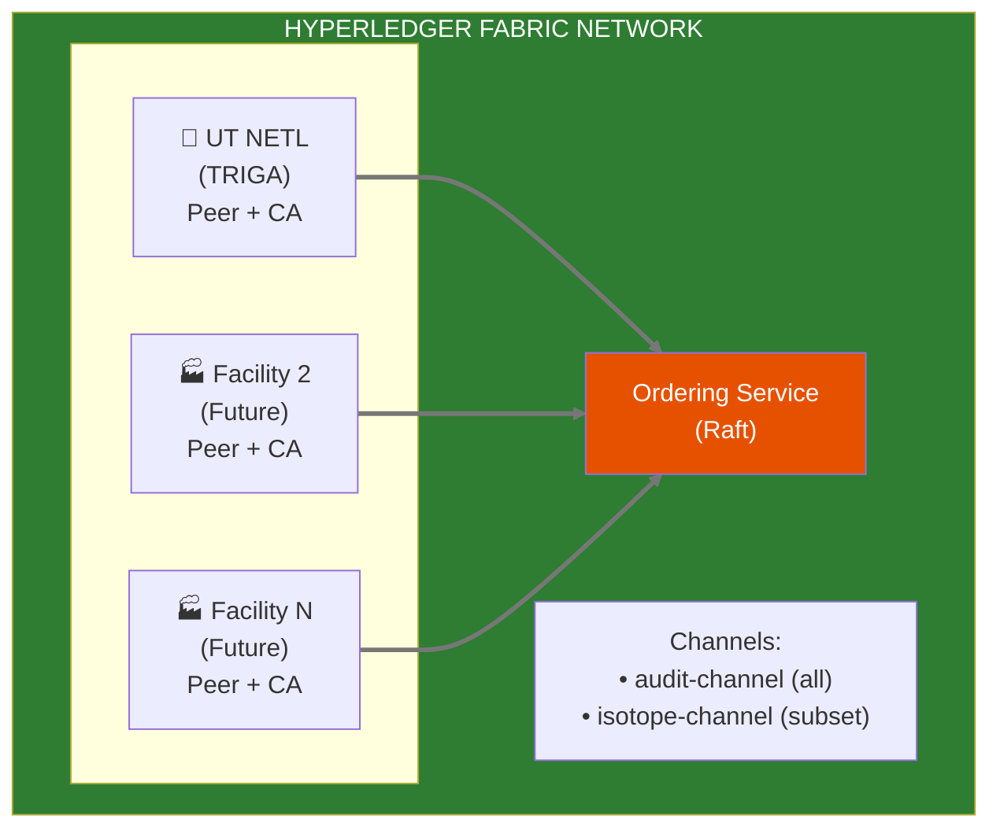

# ADR-002: Hyperledger Fabric for Multi-Facility Immutable Audit

**Status:** Proposed  
**Date:** 2026-01-14  
**Decision Makers:** Ben, Team

## Context

Nuclear reactor operations require immutable, tamper-proof audit trails for:
- Regulatory compliance (NRC 10 CFR 50.9)
- Non-repudiation of operator logs (Reactor Ops Log)
- Chain of custody for evidence packages
- Multi-facility attestation (commercialization target)

We need a solution that:
1. Provides cryptographic immutability
2. Supports multi-organization consensus (future facilities)
3. Uses permissioned access (not public blockchain)
4. Aligns with Apache 2.0 licensing requirements

## Decision

We will use **Hyperledger Fabric** as the blockchain infrastructure, designed for multi-facility from day 1 even if initially only one facility participates.

For single-facility development, we may use **Immudb** as a lightweight alternative that can later feed into Fabric.

## Alternatives Considered

| Option | Pros | Cons | Verdict |
|--------|------|------|---------|
| **Hyperledger Fabric** | Enterprise-grade, multi-org, smart contracts | Complex deployment | ✅ Selected |
| **Immudb** | Lightweight, fast, SQL-like | Single-org only, less "blockchain credibility" | ✅ Dev/staging |
| **Amazon QLDB** | Managed, simple | Proprietary, AWS lock-in | ❌ |
| **Ethereum L2** | Public verification | Overkill, gas costs, public exposure | ❌ |

## Architecture

### Multi-Facility Network (Target State)

### Chaincode (Smart Contracts)

1. **Audit Chaincode** - Log all audit events, verify inclusion
2. **OpsLog Chaincode** - Immutable operator log entries with signatures
3. **Evidence Chaincode** - Hash manifests for audit packages

## Consequences

### Positive
- Cryptographic proof of audit trail integrity
- Multi-facility consensus without central authority
- Smart contracts encode audit rules
- NRC-defensible records ("blockchain-backed")
- Commercialization differentiator

### Negative
- Complex infrastructure (peers, orderers, CAs)
- Requires Fabric expertise or learning curve
- Higher latency than simple database (consensus overhead)

### Mitigations
- Use Immudb for development/single-facility MVP
- Fabric network deployed via Helm charts
- Start with single-org Fabric, add orgs incrementally
- Document Fabric operations runbooks

## Implementation Path

1. **Phase 1:** Immudb for local development and early MVP
2. **Phase 2:** Single-org Fabric network (UT NETL only)
3. **Phase 3:** Multi-org capability (when second facility onboards)
4. **Phase 4:** Cross-facility channels (isotope tracking, etc.)

## References

- [Hyperledger Fabric Docs](https://hyperledger-fabric.readthedocs.io/)
- [Hyperledger Bevel](https://github.com/hyperledger/bevel) - K8s deployment
- [Immudb](https://immudb.io/) - Lightweight immutable database
