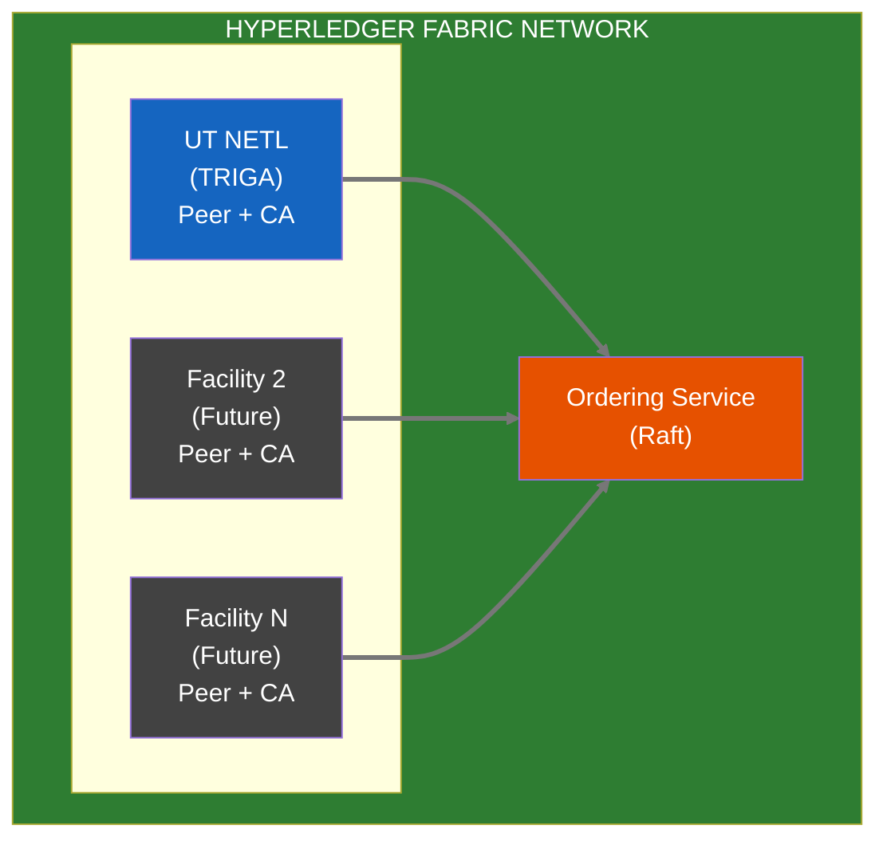

# ADR-002: Hyperledger Fabric for Multi-Facility Immutable Audit — Neutron OS Nuclear Context

> This architecture decision is made at the Axiom platform level. This document captures nuclear-specific context only.

**Upstream:** [Axiom adr-002-hyperledger-fabric-multi-facility.md](https://github.com/…/axiom/docs/requirements/adr-002-hyperledger-fabric-multi-facility.md)

---

## Nuclear Context

### Regulatory Driver

Nuclear reactor operations require immutable, tamper-proof audit trails for:
- **NRC 10 CFR 50.9** regulatory compliance (completeness and accuracy of records)
- Non-repudiation of **Reactor Ops Log** entries
- NRC-defensible records ("blockchain-backed")

### Facility Network Topology

The founding Fabric peer is **UT NETL (TRIGA)**, not a generic facility:

### Implementation Path (Nuclear-Specific)

1. **Phase 1:** Immudb for local development and early MVP
2. **Phase 2:** Single-org Fabric network (UT NETL only)
3. **Phase 3:** Multi-org capability (when second facility onboards)
4. **Phase 4:** Cross-facility channels (isotope tracking, etc.)
