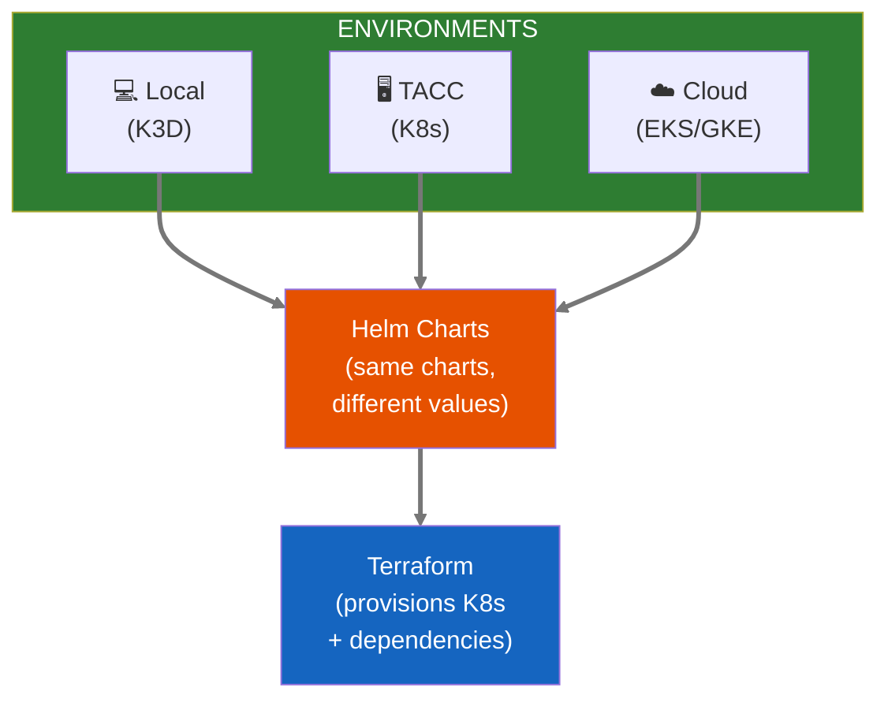

# ADR-004: Infrastructure as Code with Terraform, Kubernetes, and Helm

**Status:** Proposed  
**Date:** 2026-01-14  
**Decision Makers:** Ben, Team

## Context

Neutron OS needs to run on multiple environments:
- Local development (individual laptops)
- TACC HPC (Frontera, Lonestar6 Kubernetes)
- Cloud providers (AWS, GCP, Azure) for commercialization

We need infrastructure that:
1. Is reproducible and version-controlled
2. Runs identically across environments
3. Avoids vendor lock-in
4. Supports GitOps workflows

## Decision

We will standardize on:
- **Terraform** - Infrastructure provisioning
- **Kubernetes** - Container orchestration (all environments)
- **Helm** - Kubernetes package management
- **K3D** - Local Kubernetes clusters (lightweight K3s in Docker)

We will **NOT use Docker-Compose** for any environment.

## Infrastructure Standards

| ✅ Use | ❌ Avoid |
|--------|----------|
| Terraform | CloudFormation, ARM templates, Pulumi |
| Kubernetes | Docker Swarm, Nomad |
| Helm | Kustomize-only, raw manifests |
| K3D (local) | Docker-Compose, Minikube |
| S3-compatible storage | Provider-specific storage APIs |

## Alternatives Considered

| Area | Selected | Alternative | Reason |
|------|----------|-------------|--------|
| IaC | Terraform | Pulumi | Terraform more mature, larger community |
| Local K8s | K3D | Minikube, Kind | K3D faster, lighter, K3s compatible |
| Packaging | Helm | Kustomize | Helm better for templating, dependencies |
| Compose | None | Docker-Compose | Not K8s-native, different semantics |

## Architecture



## Directory Structure

```
infra/
├── terraform/
│   ├── modules/
│   │   ├── k8s-cluster/      # Cloud-agnostic cluster
│   │   ├── storage/          # S3-compatible storage
│   │   └── networking/       # VPC, DNS, etc.
│   └── environments/
│       ├── local/            # K3D (no-op Terraform)
│       ├── tacc/             # TACC-specific
│       └── cloud/            # AWS/GCP/Azure
│
├── helm/
│   ├── charts/
│   │   ├── neutron-lakehouse/
│   │   ├── neutron-fabric/
│   │   └── neutron-keycloak/
│   └── values/
│       ├── local.yaml
│       ├── tacc.yaml
│       └── prod.yaml
│
└── k3d/
    ├── cluster-config.yaml
    └── registries.yaml
```

## Consequences

### Positive
- Same deployment manifests work everywhere
- GitOps-ready (Argo CD, Flux compatible)
- Team learns one set of tools
- Easy to replicate environments

### Negative
- K3D requires Docker (but not Docker-Compose)
- Terraform state management complexity
- Helm chart maintenance overhead

### Mitigations
- Use Terraform Cloud or S3 backend for state
- Helm chart versioning with semantic versioning
- Document local setup in `docs/development/`

## Exception: Hyperledger Fabric

Hyperledger Fabric's official development tooling uses Docker containers directly. We accept this exception for chaincode development only. Production Fabric deployment will use Kubernetes via [Hyperledger Bevel](https://github.com/hyperledger/bevel).

## References

- [Terraform](https://www.terraform.io/)
- [Kubernetes](https://kubernetes.io/)
- [Helm](https://helm.sh/)
- [K3D](https://k3d.io/)
- [K3s](https://k3s.io/)
