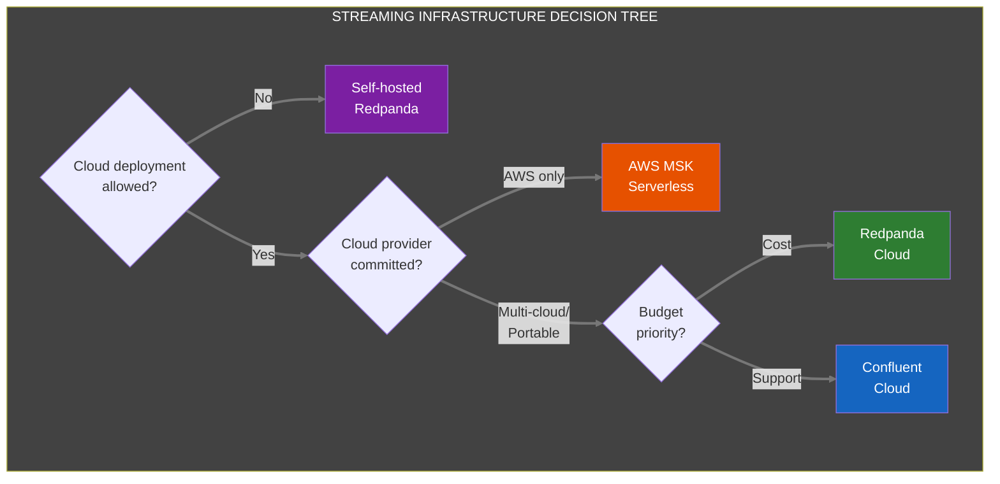
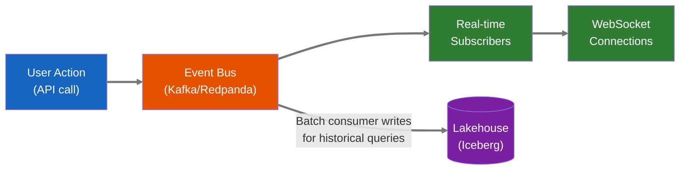
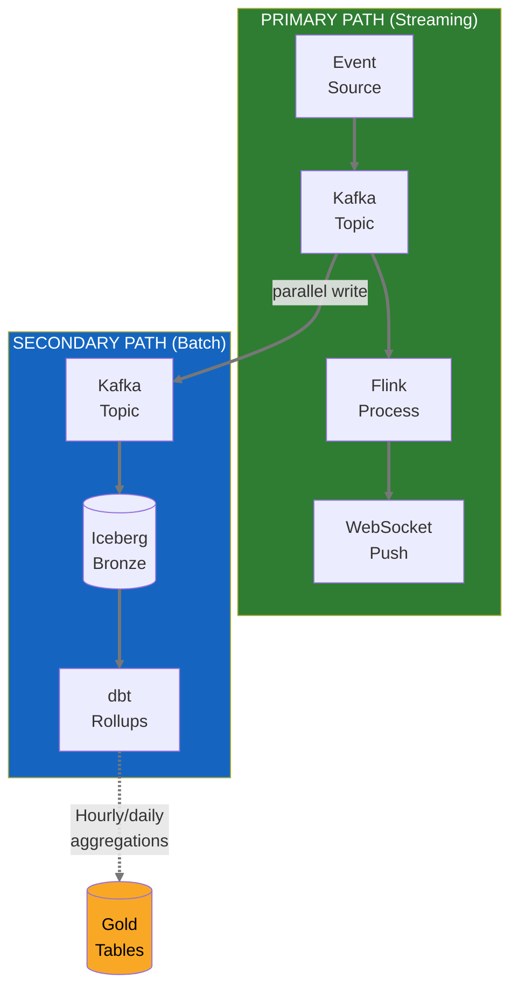

# ADR 007: Streaming-First Architecture with Batch Fallbacks

**Date:** 2026-01-21  
**Status:** Proposed  
**Deciders:** Ben Booth, UT Computational NE Team  

---

## Context

Neutron OS needs to handle data from multiple sources with varying latency requirements:
- **Reactor telemetry**: Safety-critical, benefits significantly from real-time updates
- **Operations logs**: Concurrent console editing, shift handoffs, compliance tracking
- **Experiment status**: Real-time position availability, instant approval notifications
- **Production orders**: Customer-facing status updates, delivery tracking

The question: **Should we build for batch and retrofit streaming later, or build streaming-first?**

### Why Streaming-First Matters for Commercial Scale

Today's research reactors generate megabytes of data per day. Tomorrow's commercial fleet will generate **petabytes**. A single operator may manage dozens of units across multiple sites, each streaming thousands of sensor channels. The architecture decisions we make now determine whether we can scale to that reality.

**Streaming-first enables capabilities that batch architectures cannot retrofit:**

| Capability | Why Streaming Is Required |
|------------|---------------------------|
| **Fleet-wide anomaly correlation** | Detect patterns across 50 units in real-time; batch delays miss transients |
| **Instant safety limit propagation** | Updated operating envelope flows to all systems in <1 second |
| **Coordinated load-following** | Grid demand response requires sub-second coordination across units |
| **Predictive maintenance at scale** | ML models need live sensor feeds to detect degradation before failure |
| **Regulatory real-time audit** | NRC moving toward continuous monitoring; batch reports won't satisfy |

**Streaming-first means:**
- Real-time is the default, not a future enhancement
- Every data change propagates immediately to all subscribers
- Batch processing exists as a fallback for cost optimization and historical analysis
- The UI assumes live data; staleness is the exception, not the norm

This architecture handles one research reactor today and fifty commercial units tomorrow—without rewrites.

### Constraints Reconsidered

1. **Nick's feedback**: "We'd ideally get live streaming, but currently we just upload the data after-hours due to cost."
   - **Reframe**: Nick *wants* streaming; cost was the blocker with existing tools. We can solve this.
   
2. **Budget reality**: Real-time infrastructure (Kafka, streaming compute) adds complexity
   - **Reframe**: Managed services eliminate ops burden. Cost is ~$200-400/month for our scale.
   
3. **UX requirement**: Users must understand data freshness to make safe decisions
   - **Reframe**: With streaming-first, "Live" is the default indicator. Staleness warnings only appear when something is wrong.

---

## Technology Evaluation

### Real-Time Transport Protocol Selection

Why WebSockets? We evaluated all major options:

| Protocol | Latency | Browser Support | Bidirectional | Verdict |
|----------|---------|-----------------|---------------|---------|
| **WebSocket** | ~10ms | ✅ Universal | ✅ Yes | **Selected for interactive UIs** |
| **Server-Sent Events (SSE)** | ~50ms | ✅ Universal | ❌ One-way | **Selected for displays** |
| **WebTransport** | ~5ms | ⚠️ Chrome/Edge only | ✅ Yes | Future option (2027+) |
| **gRPC-Web** | ~15ms | ⚠️ Requires proxy | ✅ Yes | Overkill for UI; good for services |
| **HTTP/2 Push** | ~20ms | ❌ Deprecated | ❌ One-way | Not viable |
| **QUIC** | ~3ms | ⚠️ Low-level | ✅ Yes | Underlying transport, not API |

**Decision:** WebSocket for bidirectional (console sync, collaborative editing), SSE for unidirectional (entrance displays, status boards). Monitor WebTransport adoption for future migration.

**Why not gRPC streaming?** Excellent for service-to-service, but adds proxy complexity for browser clients. Our primary consumers are web UIs, not backend services.

### Event Streaming Infrastructure Selection

| Provider | Kafka Compatible | Latency | Ops Burden | Cost (our scale) | Lock-in | Verdict |
|----------|------------------|---------|------------|------------------|---------|---------|
| **Redpanda Cloud** | ✅ 100% | <10ms p99 | Zero (managed) | ~$150-300/mo | Low | **Primary choice** |
| **Confluent Cloud** | ✅ 100% | <10ms p99 | Zero (managed) | ~$200-400/mo | Medium | **Alternative** |
| **AWS MSK Serverless** | ✅ 100% | ~20ms p99 | Low | ~$200-350/mo | High (AWS) | AWS-committed only |
| **GCP Pub/Sub** | ❌ No | ~30ms p99 | Zero | ~$100-200/mo | High (GCP) | Not Kafka; different API |
| **Azure Event Hubs** | ⚠️ Partial | ~25ms p99 | Low | ~$180-300/mo | High (Azure) | Kafka API subset only |
| **Self-hosted Redpanda** | ✅ 100% | <5ms p99 | High | ~$50/mo (compute) | None | Air-gapped deployments |
| **Self-hosted Kafka** | ✅ 100% | <5ms p99 | Very High | ~$80/mo (compute) | None | Not recommended |

**Decision: Redpanda Cloud as primary, with Confluent Cloud as fallback.**

**Rationale:**
- **Why Redpanda over Confluent?** Similar capabilities, but Redpanda has simpler architecture (no ZooKeeper), lower latency, and 25% lower cost at our scale. Both provide 100% Kafka API compatibility.
- **Why not AWS MSK?** If we're committed to AWS, MSK Serverless is viable. But we want cloud-agnostic deployment (TACC, AWS, GCP, on-prem). Redpanda runs anywhere.
- **Why not GCP Pub/Sub?** Not Kafka-compatible. Would require maintaining two different streaming APIs (Kafka for some deployments, Pub/Sub for GCP). Standardizing on Kafka API simplifies development.
- **When to self-host?** Air-gapped deployments (e.g., some DOE facilities) or if monthly costs exceed ~$1,000/mo. Redpanda single-node is production-ready.



---

## Decision

**Build for streaming; use batch as fallback.**

Specifically:
1. **Day 1 implementation** uses event streaming (Kafka/Redpanda) as the primary data flow
2. **All state changes** publish to event streams before writing to the lakehouse
3. **UI components** assume live data; show "⚠️ Stale" only when streaming is degraded
4. **Batch processing** handles historical aggregations, reports, and fallback during outages
5. **APIs** are WebSocket/SSE-first; REST endpoints for compatibility and initial data load

---

## Consequences

### Positive

| Benefit | Description |
|---------|-------------|
| **Commercial-scale ready** | Same architecture handles research reactor or 50-unit fleet |
| **Better UX** | Users see changes instantly; no refresh buttons, no wondering if data is current |
| **Safety-critical readiness** | Console sync, 30-min timers, concurrent editing work natively |
| **Simpler mental model** | "Data is live" is easier than "data might be 5 minutes old" |
| **Fleet operations** | Correlate anomalies, propagate limits, coordinate load-following across units |

### Negative

| Risk | Mitigation |
|------|------------|
| Higher initial infrastructure cost | Use managed streaming (see Technology Evaluation); ~$200-400/mo at our scale |
| Streaming complexity | Abstract behind event SDK; developers don't touch Kafka directly |
| Network dependency | Batch fallback automatically kicks in; local caching for offline resilience |
| Debugging distributed systems | Comprehensive event tracing; dead letter queues; replay capability |

### Trade-offs Accepted

- Higher monthly infrastructure cost (~$200-500/mo vs. ~$50/mo for batch-only)
- Team needs to learn event-driven patterns (investment in skills)
- More moving parts in production (mitigated by managed services)

---

## Technical Implementation

### Event-Driven Core

All state changes flow through the event bus:



### UI Pattern: "Live" as Default

Every data display assumes live data:

```
┌─────────────────────────────────────────────────┐
│  Reactor Power: 950 kW                          │
│  ─────────────────────────────────────────────  │
│  🟢 Live                                        │
└─────────────────────────────────────────────────┘
```

When streaming is degraded:

```
┌─────────────────────────────────────────────────┐
│  Reactor Power: 950 kW                          │
│  ─────────────────────────────────────────────  │
│  ⚠️ Data may be stale (last update: 5 min ago) │
│     [Retry Connection]                          │
└─────────────────────────────────────────────────┘
```

### Latency Targets

| Feature | Target Latency | Implementation |
|---------|---------------|----------------|
| **Ops Log console sync** | < 500ms | WebSocket + Kafka |
| **30-minute check timer** | < 100ms | Shared state via WebSocket |
| **Facility entrance display** | < 2s | Server-Sent Events |
| **Sample status updates** | < 1s | WebSocket subscription |
| **Dashboard refresh** | < 5s | Streaming aggregations |
| **Historical queries** | < 3s | Batch-processed Gold tables |

### Batch Fallback Strategy

Batch processing serves three purposes:

1. **Historical aggregations**: Hourly/daily/monthly rollups for dashboards
2. **Disaster recovery**: If streaming fails, batch catches up from event log
3. **Cost optimization**: Some analytics (burnup calculations) don't need real-time



### Module-Specific Streaming Implementation

| Module | Streaming Approach | Batch Fallback |
|--------|-------------------|----------------|
| **Ops Log Console Sync** | WebSocket pub/sub, CRDT for conflicts | 30s polling if WS fails |
| **30-Minute Check Timer** | Shared countdown via WebSocket | Local timer + sync on reconnect |
| **Facility Entrance Display** | Server-Sent Events | 60s polling fallback |
| **Sample Status** | WebSocket subscription per sample | REST polling on demand |
| **Production Orders** | WebSocket for status, SSE for tracking | Email notifications as backup |
| **Burnup Dashboard** | Batch (no streaming needed) | N/A - batch is primary |
| **Historical Analytics** | Batch (by definition) | N/A - batch is primary |

---

## API Design Patterns

### WebSocket-First (Primary)

```javascript
// Client connects and subscribes
const ws = new NeutronOSClient('wss://api.neutron-os.io/v1/stream');

// Subscribe to reactor status
ws.subscribe('reactor.status', { facility: 'netl-triga' }, (event) => {
  updateDisplay(event.data);
});

// Subscribe to ops log entries
ws.subscribe('opslog.entries', { facility: 'netl-triga' }, (event) => {
  appendEntry(event.data);
});
```

### REST for Initial Load & Fallback

```http
GET /api/v1/reactor/status?facility=netl-triga
Response:
{
  "power_kw": 950,
  "status": "critical",
  "timestamp": "2026-01-21T14:32:00.123Z",
  "streaming_available": true,
  "ws_endpoint": "wss://api.neutron-os.io/v1/stream"
}
```

### Server-Sent Events for Simple Displays

```javascript
// For entrance displays that just need one-way updates
const events = new EventSource('/api/v1/facility/netl-triga/display');
events.onmessage = (e) => updateEntranceDisplay(JSON.parse(e.data));
```

---

## Infrastructure

### Managed Services (Recommended)

| Component | Primary Choice | Alternative | Monthly Cost (Est.) |
|-----------|----------------|-------------|---------------------|
| Event streaming | Redpanda Cloud | Confluent Cloud, AWS MSK | $150-300 |
| Stream processing | Redpanda Transforms (in-broker) | Apache Flink, Kafka Streams | $0-200 |
| WebSocket gateway | Fastify + uWebSockets.js | AWS API Gateway WebSocket | $50-100 |
| **Total streaming infra** | | | **~$200-600/mo** |

### Self-Hosted Alternative (Air-Gapped / Cost-Sensitive)

For deployments where cloud services aren't permitted or cost exceeds ~$800/mo:

| Component | Recommendation | Notes |
|-----------|----------------|-------|
| Event streaming | Redpanda (single-node) | No ZooKeeper; runs on 4GB RAM |
| Stream processing | Embedded (in Redpanda) | Or Flink if complex CEP needed |
| WebSocket gateway | FastAPI + Redis pub/sub | Or Socket.io for simpler setup |
| Deployment | Helm chart on K3s | Same chart as cloud; different values |

---

## Migration Path

For facilities starting with limited infrastructure:

| Phase | Capability | Infrastructure |
|-------|------------|----------------|
| **Phase 0** | REST + polling (5 min) | Existing setup |
| **Phase 1** | WebSocket for critical features | Add WS gateway |
| **Phase 2** | Full streaming | Add Kafka/Redpanda |
| **Phase 3** | Edge streaming | Add local event bus |

Facilities can enter at any phase based on their needs and budget.

---

## Affected Components

- **All UI components**: Assume live data; implement connection status indicator
- **API layer**: WebSocket/SSE primary; REST for compatibility
- **Data pipelines**: Event-first; Dagster for batch aggregations only
- **Database schema**: Include `event_id`, `event_timestamp`, `version` for event sourcing

---

## References

- Martin Fowler: [Event Sourcing](https://martinfowler.com/eaaDev/EventSourcing.html)
- Redpanda: [Real-time streaming for modern applications](https://redpanda.com/)
- Confluent: [Event-Driven Architecture](https://www.confluent.io/learn/event-driven-architecture/)
- Tech Spec §4.8: Event-Driven Architecture
