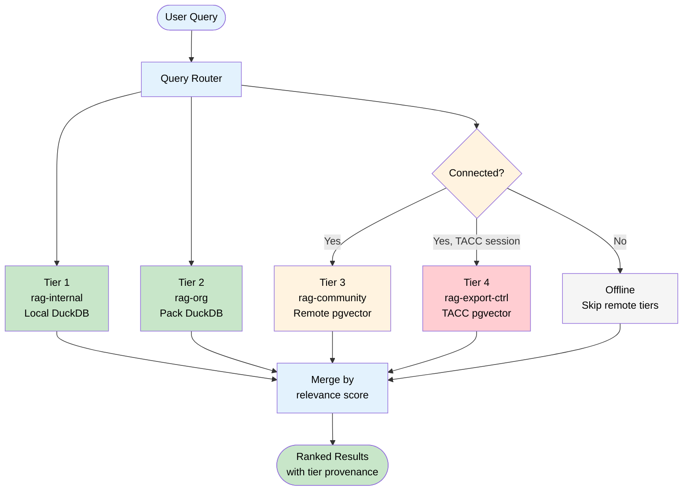
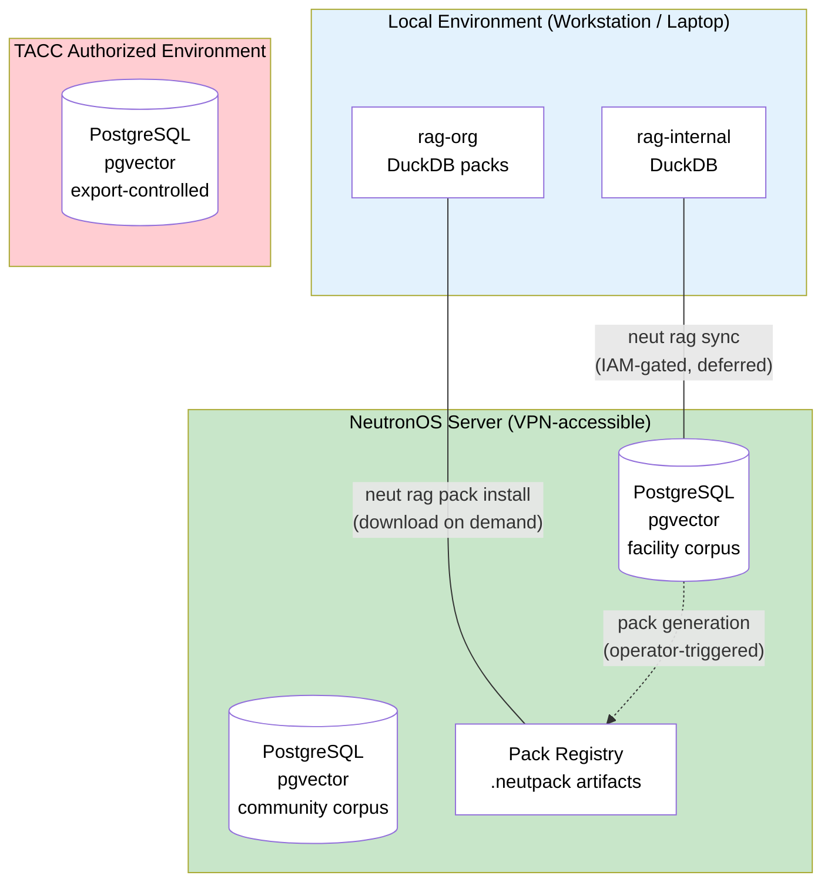

# ADR-014: RAG Tiered Local Cache — DuckDB Packs + Remote-Only Export-Controlled Tier

**Status:** Accepted
**Date:** 2026-03-20
**Owner:** Ben Booth

---

## Context

NeutronOS has a working RAG system backed by PostgreSQL + pgvector on the server
side. As facility and community corpora grow, a naive "sync everything" approach
fails on two dimensions:

**Scale.** Facility corpora will reach hundreds of millions of vectors.
Community corpora will be larger still. Full local replication is impractical
on operator workstations, and the cost-to-benefit of syncing data that will
rarely be queried offline is negative.

**Regulatory constraint.** Export-controlled nuclear computation codes (MCNP,
SCALE, ORIGEN, KENO, etc.) and their derivative data products are subject to
EAR and 10 CFR 810. Their embeddings and chunked text fragments are themselves
controlled data. These vectors legally cannot leave an authorized compute
environment. Any architecture that allows local caching of this tier would
require each user to hold independent authorization — which is neither scalable
nor the intent of the TACC authorized environment model.

**Offline requirement.** Nuclear facilities are network-unreliable environments.
VPN outages are routine. The system must remain useful during extended network
partitions — at minimum for personal and facility-local data. This is the
ForeFlight principle: pilots fly in the mountains with no cellular; chart data
is downloaded before departure, not streamed on demand.

**Current state gaps.** Personal RAG sync requires account-scoped IAM (not yet
implemented). Pack entitlement enforcement requires the same IAM service.
These are deferred, but the storage architecture must accommodate them without
structural change when they arrive.

---

## Decision

NeutronOS adopts a **four-tier RAG cache model**. Each tier has a distinct
storage location, sync strategy, and compliance posture. Tiers are not
interchangeable — data originating in a higher-restriction tier cannot be
promoted to a lower-restriction tier.

### Tier Summary

| Tier | Scope | Local store | Sync strategy | Offline capable |
|---|---|---|---|---|
| `rag-internal` | Personal | DuckDB (always local) | Account sync when connected | Yes |
| `rag-org` | Facility | DuckDB (pack-populated) | Versioned domain pack download | Yes (after pack download) |
| `rag-community` | Community | None | Query-time remote only | No |
| `rag-export-controlled` | TACC-resident | None (never local) | Never synced | No |

### Tier 1: `rag-internal` — Personal Corpus

Contains vectors the user has indexed themselves: personal notes, lab notebooks,
local document collections, session context. This tier is always local.

- **Local store:** DuckDB with the `vss` extension, embedded in the user's
  NeutronOS data directory (`~/.neut/rag/internal.duckdb`)
- **Size envelope:** ~10–50 MB. A personal corpus does not reach millions of
  vectors in normal use.
- **Sync:** When a server connection is available and the user is authenticated,
  the local DuckDB is synced to a server-side PostgreSQL account namespace.
  This is bidirectional, last-write-wins per chunk UUID.
- **IAM dependency:** Full sync requires an IAM service (deferred — see
  Implementation Phases). Until IAM is available, sync is manual
  (`neut rag export` / `neut rag import`).
- **Offline behavior:** Fully functional. No network dependency for reads or
  writes.

### Tier 2: `rag-org` — Facility Corpus

Contains the facility's curated knowledge base: procedures, technical
specifications, equipment documentation, operational history. This tier is
local after a pack is downloaded.

- **Local store:** DuckDB with `vss`, one file per domain pack
  (`~/.neut/rag/packs/{pack-id}-{version}.duckdb`)
- **Pack format:** Versioned signed artifacts with the `.neutpack` extension.
  A pack is a bundled DuckDB file plus a manifest:
  ```
  {pack-id}-{version}.neutpack
    ├── manifest.json      # id, version, semver, content-hash, entitlement-tier, signed-by
    ├── vectors.duckdb     # DuckDB + vss tables
    └── pack.sig           # detached Ed25519 signature
  ```
- **Versioning model:** Pack versions follow the aviation chart cycle model.
  Packs are released on a facility-defined cadence (e.g., monthly). Operators
  are notified when a newer pack version is available. Old packs remain
  functional until explicitly superseded or expired.
- **Size envelope:** 100 MB – 2 GB per pack, depending on corpus scope.
  Packs are downloaded on demand, not pushed.
- **Sync:** Not a live DB sync. Operators download a new pack version when it
  is released. Between releases, local data is static and guaranteed consistent
  (it came from a signed artifact).
- **IAM dependency:** Pack entitlement (who may download which packs) requires
  IAM. Until IAM is available, all available packs are treated as unentitled
  and freely downloadable by any connected user.
- **Offline behavior:** Fully functional for any pack that has been downloaded.
  New pack versions cannot be fetched without connectivity.

### Tier 3: `rag-community` — Community Corpus

Contains cross-facility shared knowledge: vendor documentation, standards,
public research, community-contributed procedures. This corpus is large enough
that local replication is not cost-effective for most users.

- **Local store:** None.
- **Query strategy:** Query-time remote call to the community PostgreSQL +
  pgvector server. Results are returned with a relevance score and merged with
  local tier results (see Query Fan-Out below).
- **Caching:** Query-result caching (short TTL, in-memory) is permitted for
  performance, but no vector-level local persistence.
- **Offline behavior:** Not available during network partition. The system
  degrades gracefully — local tiers remain functional.

### Tier 4: `rag-export-controlled` — TACC-Resident Corpus

Contains embeddings and chunked content derived from export-controlled nuclear
computation codes and their associated data products (cross-section libraries,
criticality benchmarks, shielding datasets, etc.).

- **Local store:** None. This tier is permanently TACC-resident.
- **Legal basis:** EAR and 10 CFR 810 restrict export-controlled content to
  authorized compute environments. The TACC Lonestar6/Frontera authorization
  boundary satisfies this requirement. Moving these vectors outside that boundary
  — including to a user's laptop, even an authorized user's laptop — would
  require the user to independently hold and maintain authorization, which is
  not the operational model.
- **Access:** Identity-gated via TACC LDAP/XSEDE credentials. Queries are
  proxied through a TACC-resident API endpoint; only query results (plain text
  chunks with citations) leave the boundary, not vectors.
- **Offline behavior:** Never available outside the TACC boundary. Queries
  require active TACC session.
- **Enforcement:** The NeutronOS query router MUST NOT cache, persist, or
  replicate any response payload from this tier outside the TACC boundary.
  This is a hard architectural constraint, not a configuration option.

---

## Query Fan-Out

When a RAG query is issued, the query router fans out across available tiers
and merges results by relevance score.



**Merge strategy:** Relevance scores are normalized per-tier before merging
(each tier may use different embedding dimensions or similarity metrics).
Results carry a `rag_tier` provenance field so the caller can display or
filter by source.

**Failure isolation:** A failure in any remote tier (connectivity, auth,
timeout) does not fail the overall query. The router logs the failure and
returns results from available tiers only.

---

## Local Store: DuckDB with `vss`

DuckDB with the `vss` (vector similarity search) extension is the local store
for Tiers 1 and 2. This choice is made over the alternatives listed below.

**Why DuckDB + vss:**
- Embedded — zero operational overhead, no daemon, no port conflicts, no
  install beyond `pip install duckdb`
- Fast enough for the target scale: `vss` uses HNSW indexing and handles up to
  ~10M vectors with acceptable query latency on developer hardware
- Single-file database suitable for pack distribution (a `.neutpack` is
  essentially a signed DuckDB file)
- DuckDB is already in the NeutronOS tech stack (medallion data platform)
- No local PostgreSQL instance required — avoids GB-scale cold install, pg
  service management, and port conflicts with any facility-local PostgreSQL

**Server side is unchanged:** PostgreSQL + pgvector remains the server-side
store for all tiers. The local DuckDB is a cache/offline replica, not a
replacement for the server.

---

## Alternatives Considered

### Full Local PostgreSQL Replica

Rejected. A local PostgreSQL instance adds significant operational weight: a
background service, port management, multi-GB initial sync on new install, and
ongoing WAL-based replication complexity. The offline benefit is real but
disproportionate to the cost. A user with a fresh laptop would need to download
the entire facility corpus before going into the field — which is exactly the
anti-pattern the pack model solves. DuckDB achieves the same offline capability
with targeted data only.

### Single Shared PostgreSQL for All Tiers

Rejected. A single PostgreSQL instance is a single point of failure. VPN
outages (common in facility environments) would make personal and facility data
inaccessible. Personal RAG queries at scale would degrade as the shared
instance absorbs facility and community load. The tiered model gives each
scope its own performance envelope and failure domain.

### SQLite

Rejected. SQLite has no native vector similarity search support. Third-party
extensions (e.g., `sqlite-vss`) exist but are not production-grade and would
require non-standard distribution. CLAUDE.md policy is "never SQLite in
production." DuckDB's `vss` extension is the correct tool for this use case.

---

## Architecture Diagram



---

## Consequences

### Positive

- Personal and facility data are available offline without any network
  dependency, satisfying the ForeFlight offline-first principle
- Pack model gives operators explicit control over when facility knowledge
  is updated locally — no surprise mid-session sync that degrades performance
- Export-controlled content never leaves the authorized boundary by
  architectural constraint, not just policy
- DuckDB + vss is already in the dependency graph; no new operational
  dependencies introduced
- Tier provenance in query results enables the UI to clearly indicate when a
  result came from export-controlled sources (important for access logging)
- Pack versioning is auditable — an operator can always identify which corpus
  version was active during a past session
- Failure isolation: losing connectivity degrades gracefully; personal and
  facility tiers remain fully functional

### Negative

- DuckDB `vss` has a vector limit (~10M) that is adequate for Tiers 1 and 2
  today but will need revisiting if personal corpora grow unexpectedly large.
  Migration path: promote to a lightweight server-side index or use approximate
  pre-filtering before `vss` query.
- Community corpus (Tier 3) is not available offline. Users in field
  environments lose access to cross-facility shared knowledge during network
  partitions. Mitigation: operators with known upcoming field periods can
  download a community pack snapshot (this is a future feature — not in scope
  for initial implementation).
- Pack distribution infrastructure (signing, registry, CDN) must be built and
  maintained. This is non-trivial operational work, though the design reuses
  patterns from established artifact distribution systems (Helm charts,
  container registries).
- Two query engines (DuckDB + pgvector) means two embedding / similarity
  search configurations must be kept in sync. Embedding model changes require
  regenerating and re-releasing all packs — this is expensive and must be
  planned as a breaking change.

### Neutral

- The personal sync mechanism (`rag-internal` ↔ server) is deferred until IAM
  is available. Manual export/import is the interim path. This is a known gap,
  not a regression.
- Pack entitlement (restricting which users can download which packs) is
  deferred until IAM. All packs are openly downloadable by any authenticated
  user in the interim. This is acceptable for the initial facility deployments
  where access control is handled at the network boundary.

---

## Implementation Phases

### Phase 1 — Pre-IAM (current)

| Capability | Status |
|---|---|
| DuckDB + vss local store for `rag-internal` | Implement |
| `neut rag index` — index local documents into Tier 1 | Implement |
| `neut rag query` — fan-out across available tiers | Implement |
| `.neutpack` format and local pack install (`neut rag pack install`) | Implement |
| Tier 4 proxy endpoint on TACC (identity-gated by TACC session) | Implement |
| `neut rag export` / `neut rag import` — manual Tier 1 sync | Implement |
| Pack signing infrastructure | Implement |
| Personal auto-sync (Tier 1 ↔ server) | Deferred — requires IAM |
| Pack entitlement enforcement | Deferred — requires IAM |
| Community pack snapshot download (Tier 3 offline) | Deferred — future feature |

### Phase 2 — Post-IAM

| Capability | Notes |
|---|---|
| Personal auto-sync | IAM provides account namespace + auth token for Tier 1 sync |
| Pack entitlement | IAM provides group membership → pack access policy mapping |
| Per-user Tier 4 audit log | IAM provides identity to bind to TACC access records |

---

## Related

- [ADR-011](adr-011-concurrent-file-writes.md) — Concurrent file write safety
  (applies to local DuckDB write paths under concurrent agent/CLI access)
- [ADR-012](adr-012-provider-identity.md) — Provider identity model
  (embedding providers that generate vectors for each tier follow this pattern)
- [project_rag_v2_architecture.md](../../.claude/memory/project_rag_v2_architecture.md) —
  Three-tier access model, two-dimensional content model, domain packs, knowledge
  maturity layers — the conceptual framework this ADR operationalizes
- `docs/tech-specs/spec-rag-tiered-cache.md` — Full implementation specification
  (to be written; this ADR is the decision record only)
- TACC Lonestar6 authorization boundary documentation (internal, not tracked in repo)
