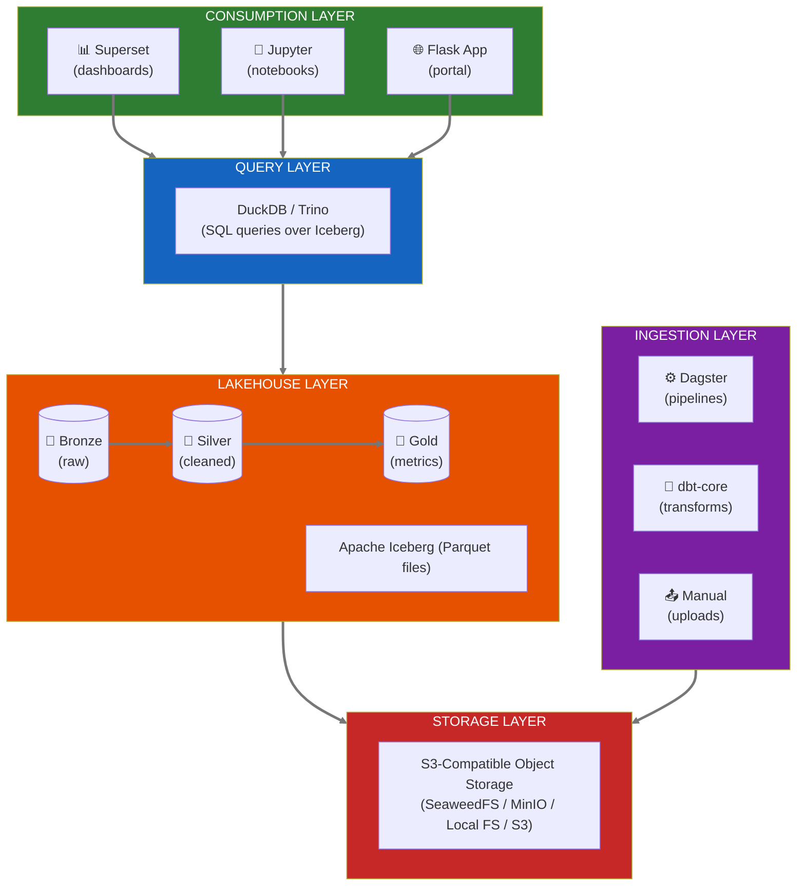

# ADR-003: Data Lakehouse with Iceberg, DuckDB, and Superset

**Status:** Proposed  
**Date:** 2026-01-14  
**Decision Makers:** Ben, Team

## Context

The current data architecture across digital twin repositories is fragmented:
- CSV files in various directories
- JSON files for logs and metadata
- PostgreSQL/TimescaleDB for some time-series
- No unified query layer
- No data versioning or time-travel

We need a modern data platform that:
1. Supports Bronze/Silver/Gold data tiers
2. Provides ACID transactions and time-travel
3. Enables self-service analytics
4. Uses open formats (no vendor lock-in)
5. Can scale from laptop to TACC cluster

## Decision

We will implement a **lakehouse architecture** using:
- **Apache Iceberg** - Open table format with ACID, time-travel, schema evolution
- **DuckDB** - Embedded analytics engine (local/single-node)
- **Trino** - Distributed query engine (when scale requires)
- **Apache Superset** - Self-service BI and dashboards
- **dbt-core** - SQL transformations (Bronze → Silver → Gold)
- **Dagster** - Pipeline orchestration

## Alternatives Considered

| Component | Selected | Alternative | Reason |
|-----------|----------|-------------|--------|
| Table format | Iceberg | Delta Lake | Iceberg more vendor-neutral, better catalog support |
| Embedded query | DuckDB | SQLite | DuckDB has columnar storage, better analytics |
| Distributed query | Trino | Spark SQL | Trino lighter weight, better for interactive |
| BI tool | Superset | Metabase | Superset Apache 2.0, more customizable |
| Orchestration | Dagster | Airflow | Dagster software-defined assets, better UX |

## Architecture

## Data Tiers

| Tier | Purpose | Retention | Example |
|------|---------|-----------|---------|
| **Bronze** | Raw data exactly as received | 7+ years | `serial_data_raw` |
| **Silver** | Cleaned, validated, typed | 7+ years | `reactor_timeseries_clean` |
| **Gold** | Aggregated, analytics-ready | 7+ years | `reactor_hourly_metrics` |

## Consequences

### Positive
- Open formats prevent vendor lock-in
- Time-travel enables regulatory lookback queries
- DuckDB runs on laptop for development
- Superset enables stakeholder self-service
- dbt provides testable transformations

### Negative
- More components to operate than simple Postgres
- Iceberg catalog adds complexity
- Team needs to learn dbt, Dagster patterns

### Mitigations
- Start with DuckDB + local files, add Trino when needed
- Use managed Iceberg catalog (REST catalog)
- Provide dbt model templates and examples

## Test-Driven Approach

Superset dashboard scenarios drive data model design:
1. Define dashboard requirements
2. Derive Gold table schemas
3. Write dbt tests that must pass
4. Implement Bronze → Silver → Gold pipeline
5. Validate with working dashboard

## Streaming-First Architecture

This lakehouse architecture is designed for **streaming-first** operation. See [ADR 007: Streaming-First Architecture](007-streaming-first-architecture.md) for the full approach:

- **Primary path:** Event streaming (Kafka/Redpanda) → Real-time subscribers → WebSocket push
- **Secondary path:** Events → Iceberg Bronze → dbt aggregations (batch fallback)

The event-sourcing pattern in the lakehouse (all changes captured as events) enables:
- Real-time UI updates as the default
- Batch processing for historical aggregations and disaster recovery
- Graceful degradation when streaming is unavailable

See Tech Spec §4.8 for implementation details.

## References

- [Apache Iceberg](https://iceberg.apache.org/)
- [DuckDB](https://duckdb.org/)
- [Apache Superset](https://superset.apache.org/)
- [dbt-core](https://www.getdbt.com/)
- [Dagster](https://dagster.io/)
- [Tech Spec §4.8: Event-Driven Architecture](../specs/neutron-os-master-tech-spec.md#48-event-driven-architecture--streaming-readiness)
