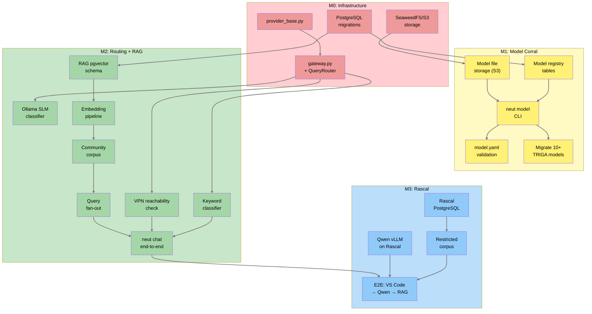
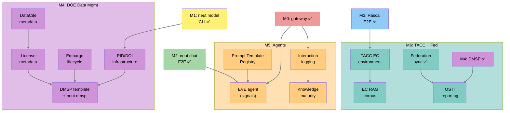

# Unified Execution Plan — 2026

> **Living document.** This is the single source of truth for what gets built, in what order, and why. It supersedes phasing sections in individual PRDs for scheduling purposes. PRDs remain authoritative for *what* to build; this document governs *when* and *in what order*.

**Last Updated:** 2026-04-01
**Tracks:** Neutron OS nuclear-domain work (references Axiom platform milestones as upstream dependencies)
**Upstream:** [Axiom Platform Execution Plan](https://github.com/…/axiom/docs/requirements/execution-plan-2026.md) — P0–P5 platform milestones
**Deployment targets:** Local workstation → Rascal (VPN) → TACC (HPC)

---

## Current State of Play

> Code lives in **Axiom** (the platform). Neutron OS is a thin CLI shell (`cli.py` + `demo` extension) that delegates to Axiom. The table below reflects Axiom implementation status.

| Capability | Spec | Code | Status |
|---|---|---|---|
| **CLI framework (`axi` / `neut`)** | ✅ | ✅ 17 registered nouns | Working: signal, mo, pub, doc, chat, code, rag, connect, db, log, mirror, status, test, update, install, note, serve |
| **LLM Gateway/Routing** | ✅ | ✅ `gateway.py` (1537 lines), `router.py` (457 lines), `provider_base.py` (359 lines) | Implemented: provider registry, tier routing, audit logging, connections |
| **RAG System** | ✅ | ✅ store, ingest, chunker, embeddings, sanitizer, watcher, personal indexing, CLI | Implemented: pgvector store, embedding pipeline, retrieval, personal workspace indexing |
| **EVE Agent (signal pipeline)** | ✅ | ✅ 69 files (~20k+ lines) | Implemented: signal ingestion, extraction, synthesis, correction review, media library, briefing, voice ID, echo suppression |
| **M-O Agent (steward)** | ✅ | ✅ 18 files | Implemented: node health, retention, log steward, repo hygiene, network monitoring |
| **PRT Agent (publisher)** | ✅ | ✅ 51 files | Implemented: DOCX generation, OneDrive/Box storage, publish engine, state tracking, validation |
| **Neut Agent (assistant)** | ✅ | ✅ 31 files / 10k lines | Implemented: chat, code assistance |
| **DFIB Agent (diagnostics)** | ✅ | ✅ 5 files | Implemented: platform health checks |
| **Prompt Registry** | ✅ | ✅ 266 lines | Implemented in `infra/prompt_registry.py` |
| **Model Corral** | ✅ | ❌ 0% | Nick & Cole waiting. Highest user-facing priority. No code yet. |
| **Data Platform (Iceberg/dbt)** | ✅ | 🟡 Schema sketched | Not wired to runtime |
| **Compliance Tracking** | ✅ | ❌ 0% | Not blocking feature work |
| **Federation** | ✅ (ADR-016) | ❌ 0% | Q4 target, not blocking |
| **FAIR / DMP** | ✅ (new PRDs) | ❌ 0% | Layered on top of above |

---

## Dependency Graph

The full dependency graph has 31 nodes across 7 milestones. For readability at portrait scale, it is split into two diagrams: the **critical path** (M0–M3) and the **extension path** (M4–M6).

#### Critical Path (M0 → M3)



#### Extension Path (M4 → M6)



---

## Milestone 0: Infrastructure Foundation

**Goal:** Shared infrastructure that M1 and M2 both need.
**Deployment:** Local workstation
**Status:** Mostly complete — gateway, routing, provider_base, RAG store all implemented in Axiom.

| # | Work Item | Axiom or NOS | Status | Notes |
|---|-----------|---|---|---|
| 0.1 | `provider_base.py` (ProviderBase, ProviderIdentityMixin) | Axiom | ✅ Done | 359 lines; ADR-012 three-layer identity |
| 0.2 | `gateway.py` (provider registry, route method, logging) | Axiom | ✅ Done | 1537 lines; tier routing, audit logging |
| 0.3 | PostgreSQL migration: model_registry, model_versions, model_lineage, model_validations tables | NOS | ❌ Remaining | Model Corral schema not yet created |
| 0.4 | PostgreSQL migration: RAG tables (documents, chunks, embeddings via pgvector) | Axiom | ✅ Done | pgvector store implemented |
| 0.5 | S3-compatible storage operational | Axiom | ❌ Remaining | Need SeaweedFS Docker or filesystem fallback for Model Corral artifacts |

> **Note on 0.5:** Per project policy, no MinIO. For local dev, use SeaweedFS Docker container or filesystem fallback. S3-compatible endpoint for Rascal/TACC comes in M3.

---

## Milestone 1: Model Corral (Feature 1)

**Goal:** Nick and Cole can `neut model search/add/pull/validate`. Physics models versioned and searchable.
**Deployment:** Local workstation (read/write with local storage)
**Timeline:** Weeks 2–5
**Unblocks:** Nick, Cole, TRIGA model migration, INL LDRD model schema alignment

| # | Work Item | Axiom or NOS | Depends On | Acceptance Criteria |
|---|-----------|---|---|---|
| 1.1 | Scaffold Model Corral extension (`neut-extension.toml`, CLI registration) | NOS | 0.3 | `neut model --help` shows subcommands |
| 1.2 | Implement `model.yaml` manifest parser + validator (schema, semver, status transitions) | NOS | — | Validates sample TRIGA model manifests; rejects malformed |
| 1.3 | Implement `neut model init <dir>` (scaffold model directory + model.yaml template) | NOS | 1.1, 1.2 | Creates valid skeleton; includes license, funding_source fields (DOE) |
| 1.4 | Implement `neut model validate <dir>` (schema + file + syntax checks) | NOS | 1.2 | Validates existing TRIGA models; reports clear errors |
| 1.5 | Implement `neut model add <dir>` (register in DB + upload artifacts to S3) | NOS | 0.3, 0.5, 1.2 | Model appears in registry; files retrievable |
| 1.6 | Implement `neut model search/list/show` (query registry) | NOS | 0.3 | Can find models by reactor_type, physics_code, keyword |
| 1.7 | Implement `neut model pull <model_id> <dest>` (download from registry) | NOS | 1.5 | Round-trip: add → pull produces identical directory |
| 1.8 | Implement `neut model lineage <model_id>` (ROM → physics chain display) | NOS | 0.3 | Shows parent_model chain in terminal |
| 1.9 | Migrate 10+ existing TRIGA models into registry | NOS | 1.5 | Models searchable, validated, documented |
| 1.10 | Add federated model fields to model.yaml (`federation_round`, `participating_facilities`, `aggregation_method`) | NOS | 1.2 | INL LDRD schema compatible |
| 1.11 | Add DOE DMSP fields: `license` (required), `funding_source`, `doi` | NOS | 1.2 | DOE-compliant model metadata |
| 1.12 | Dataset inventory: audit all project directories for data artifacts (INV-001) | NOS | — | [prd-dataset-inventory.md](prd-dataset-inventory.md) Tier 1 table populated with actual sizes, formats |
| 1.13 | Confirm funding source for all Tier 2 datasets (INV-002) | NOS | 1.12 | Each Tier 2 row has confirmed funding status |
| 1.14 | Migrate existing ROMs with training provenance (MIG-002) | NOS | 1.5 | ROM → physics model lineage visible via `neut model lineage` |
| 1.15 | Migrate benchmark input decks from `progression_problems/` (MIG-003) | NOS | 1.5 | Benchmarks searchable; linked to ICSBEP/IRPhEP references |

---

## Milestone 2: Intelligent LLM Routing + Community RAG (Feature 2)

**Goal:** `neut chat` routes queries intelligently (public vs. restricted), backed by searchable community knowledge corpus.
**Deployment:** Local workstation (public tier only initially)
**Status:** Axiom platform largely implemented. NOS-specific corpus and integration testing remain.

| # | Work Item | Axiom or NOS | Status | Notes |
|---|-----------|---|---|---|
| 2.1 | KeywordClassifier (keyword list → tier assignment) | Axiom | ✅ Done | In `router.py` (457 lines) |
| 2.2 | Ollama SLM classifier (local semantic classification, 2s timeout) | Axiom | ✅ Done | Integrated in routing pipeline |
| 2.3 | VPN reachability check (TCP connect, 1s timeout) | Axiom | ✅ Done | In routing pipeline |
| 2.4 | QueryRouter (combines classifiers + session mode + CLI overrides) | Axiom | ✅ Done | Full implementation in `router.py` + `gateway.py` |
| 2.5 | Embedding pipeline (Ollama local → pgvector) | Axiom | ✅ Done | `rag/embeddings.py` (255 lines), `rag/ingest.py` (229 lines) |
| 2.6 | Build community corpus bundle (~33k chunks, nuclear domain knowledge) | NOS | ❌ Remaining | Content curation + bundling needed |
| 2.7 | RAG retrieval (similarity search + access tier filtering) | Axiom | ✅ Done | `rag/store.py` (423 lines) |
| 2.8 | Personal workspace indexing (`axi rag index .`) | Axiom | ✅ Done | `rag/personal.py` (259 lines), `rag/watcher.py` (166 lines) |
| 2.9 | Wire RAG into `axi chat` (context injection before LLM call) | Axiom | ✅ Done | Neut agent (31 files / 10k lines) integrates RAG |
| 2.10 | Interaction logging | Axiom | ✅ Done | Audit logging in gateway + routing_audit |
| 2.11 | `axi rag` CLI (`index`, `search`, `status`) | Axiom | ✅ Done | `rag/cli.py` (349 lines) registered as `rag` noun |
| 2.12 | Validate E2E: `neut chat` → routing → RAG → grounded response on local | NOS | ❌ Remaining | Integration test with NOS CLI shell |

---

## Milestone 3: Rascal — Second Federated Node

**Goal:** Rascal joins the federation as the second Axiom node. Ben and Ondrej's local nodes discover Rascal, share its GPU (Qwen LLM) and restricted RAG corpus. RAG data packs work between nodes. This IS federation — not a precursor to it.
**Deployment:** Local + Rascal behind vpn.utexas.edu
**Timeline:** Weeks 5–9
**Upstream:** Axiom P2 (federation primitives + multi-store RAG)
**Prerequisite:** Rascal environment ready (separate session — PostgreSQL, Qwen vLLM, SeaweedFS)

| # | Work Item | Axiom or NOS | Depends On | Acceptance Criteria |
|---|-----------|---|---|---|
| 3.1 | Rascal PostgreSQL instance with pgvector (restricted tier store) | Infra | — | Accessible from VPN; pgvector enabled |
| 3.2 | Qwen vLLM endpoint on Rascal (OpenAI-compatible API) | Infra | — | `curl` returns completion from VPN |
| 3.3 | SeaweedFS on Rascal for Model Corral artifacts | Infra | — | `neut model add/pull` works against remote storage |
| 3.4 | Rascal node manifest + mDNS discovery (Axiom P2.1–2.2) | Axiom | — | Rascal appears in `axi federation list` from local workstation |
| 3.5 | Trust establishment — Ben's local node invites Rascal; bilateral approval (Axiom P2.3) | Axiom | 3.4 | Trust relationship active; resources visible |
| 3.6 | Rascal advertises LLM (Qwen) + restricted RAG store as federated resources (Axiom P2.4) | Axiom | 3.5 | `axi federation resources` shows Rascal's GPU + corpus |
| 3.7 | Dual-store RAG fan-out — local (public) + Rascal (restricted) (Axiom P2.6) | Axiom | 3.5, 3.1 | Queries return results from both stores, tier-filtered |
| 3.8 | Index restricted facility corpus on Rascal (Ollama embeddings on Rascal, never cloud) | NOS | 3.1 | Facility docs searchable via federated RAG |
| 3.9 | Build nuclear community corpus RAG data pack (Axiom P2.8) | NOS | 3.7 | `.axiompack` loadable on both local and Rascal nodes |
| 3.10 | E2E: Ondrej `neut chat` → federation discovers Rascal → routes to Qwen → RAG from both stores | NOS | 3.6, 3.7, 3.8 | Ondrej gets grounded, restricted-tier responses |
| 3.11 | Deployment playbook documented (`docs/playbooks/rascal-deployment.md`) | NOS | 3.10 | Reproducible by another operator |

---

## Milestone 4: DOE Data Management Layer

**Goal:** FAIR metadata, PIDs, embargo lifecycle, DMSP template operational. Platform satisfies DOE DMSP requirements.
**Deployment:** Local + Rascal
**Timeline:** Weeks 10–14
**Influence:** DOE requirements assessment (this session); enables NEUP 2027 proposals

| # | Work Item | Axiom or NOS | Depends On | Acceptance Criteria |
|---|-----------|---|---|---|
| 4.1 | Core metadata schema implementation (DataCite-aligned fields on all data objects) | Axiom | 0.3, 0.4 | Every dataset/model/corpus has title, creator, license, funding_source, PID slot |
| 4.2 | PID infrastructure (DataCite DOI minting or OSTI-assigned DOI) | Axiom | 4.1 | Published datasets get DOI; offline minting queued |
| 4.3 | Dataset access lifecycle engine (draft→embargoed→published→archived→tombstone) — extends PRT's existing StorageProvider pattern and state tracking | Axiom | 4.1 | State transitions enforced; embargo auto-expires; repository deposit providers (NNDC, ESS-DIVE, OSTI) implemented as StorageProvider subclasses |
| 4.4 | License metadata on all objects (CC-0, CC-BY, etc.) | Axiom | 4.1 | Model Corral `license` field enforced; RAG corpus licensed |
| 4.5 | Nuclear metadata extension registration (reactor_type, core_position, isotope, etc.) | NOS | 4.1 | Nuclear fields on facility datasets |
| 4.6 | NRC retention tier pre-configuration (2yr/5yr/7yr/permanent) | NOS | 4.1 | Compliance tracking validates retention assignments |
| 4.7 | Export control → DMSP sharing limitation mapping | NOS | 4.1 | EC datasets auto-populate DMSP limitations section |
| 4.8 | DMSP template + `neut dmsp generate` CLI | NOS | 4.1–4.7 | Generates DOE-compliant DMSP draft for NEUP proposal |
| 4.9 | DMSP compliance dashboard (datasets produced vs. shared, PID coverage, embargo status) | Axiom | 4.1–4.4 | Audit-ready compliance view |
| 4.10 | Ingest TRIGA operational time-series into Iceberg Bronze tier (MIG-005) | NOS | 0.3 | Raw data queryable via DuckDB |
| 4.11 | Ingest digital twin validation datasets — measured vs. predicted (MIG-006) | NOS | 0.3 | Linked to Model Corral entries by model_id |
| 4.12 | Ingest irradiation experiment results with nuclear metadata (MIG-007) | NOS | 0.3, 4.5 | Sample tracking data with NMETA fields |
| 4.13 | Create dbt Silver transforms for data quality validation (MIG-008) | NOS | 4.10–4.12 | Quality tests running; SLO violations flagged |
| 4.14 | Assign PIDs to all published datasets (MIG-009) | NOS | 4.2 | DOIs minted and resolvable |
| 4.15 | Generate DMSP compliance report covering all migrated datasets (MIG-010) | NOS | 4.9, 4.14 | Report shows % with PIDs, licenses, metadata |
| 4.16 | Migrate confirmed Tier 2 datasets through 12-point checklist (MIG-011) | NOS | 1.13, 4.1–4.7 | Each confirmed dataset fully compliant |

**Dataset migration details:** See [prd-dataset-inventory.md](prd-dataset-inventory.md) for full inventory, per-dataset checklist, and tracking table.

---

## Milestone 5: Intelligence Platform Hardening

**Goal:** Harden and extend already-implemented agents. Knowledge maturity promotion pipeline operational.
**Deployment:** Local + Rascal
**Timeline:** Weeks 12–18 (overlaps M4 tail)
**Status:** Core agents implemented in Axiom. Hardening and nuclear-specific integration remain.

| # | Work Item | Axiom or NOS | Status | Notes |
|---|-----------|---|---|---|
| 5.1 | Prompt Template Registry | Axiom | ✅ Done | `infra/prompt_registry.py` (266 lines) |
| 5.2 | EVE agent (signal ingestion + extraction) | Axiom | ✅ Done | 69 files: ingestion, extraction, synthesis, correction review, media library, briefing, voice ID |
| 5.3 | M-O agent (steward) | Axiom | ✅ Done | 18 files: node health, retention, log steward, repo hygiene, network |
| 5.4 | PRT agent (publisher) | Axiom | ✅ Done | 51 files: DOCX, OneDrive, Box, publish engine |
| 5.5 | DFIB agent (diagnostics) | Axiom | ✅ Done | 5 files: platform health checks |
| 5.6 | Nuclear community corpus for EVE signal extraction | NOS | ❌ Remaining | Configure EVE extractors for nuclear facility signal sources (reactor telemetry, NRC notices) |
| 5.7 | EVE crystallization → knowledge facts pipeline (Evaluator → Optimizer) | Axiom | ❌ Remaining | Crystallization logic exists in EVE; promotion to community facts needs wiring |
| 5.8 | M-O knowledge maturity sweep integration | Axiom | ❌ Remaining | Weekly sweeps with GREEN/YELLOW/RED scoring |
| 5.9 | Knowledge maturity promotion (personal → facility → community) with human review gate | Axiom | ❌ Remaining | Promotion pipeline + `axi rag review` CLI |

---

## Milestone 6: TACC — Third Federated Node + External Partners

**Goal:** TACC joins the federation as the export-controlled tier. Three-store RAG fan-out operational. External federation with OSU/INL.
**Deployment:** Local + Rascal + TACC + OSU (bilateral)
**Timeline:** Q4 2026
**Upstream:** Axiom P5 (scale + external federation)
**Prerequisite:** TACC environment provisioned (separate session)

| # | Work Item | Axiom or NOS | Depends On | Acceptance Criteria |
|---|-----------|---|---|---|
| 6.1 | TACC authorized EC environment (PostgreSQL + Ollama + SeaweedFS) | Infra | — | EC-only workloads run on TACC |
| 6.2 | TACC joins federation — same playbook as M3.4–3.6 (Axiom P5.1) | Axiom | 6.1 | TACC in `axi federation list`; resources advertised |
| 6.3 | Three-store RAG fan-out (local + Rascal + TACC) (Axiom P5.2) | Axiom | 3.7, 6.2 | Queries fan to all tiers user is authorized for |
| 6.4 | Export-controlled RAG corpus on TACC (EC ingest, embed, store — never local) (Axiom P5.3) | NOS | 6.1 | EC docs searchable only from authorized system |
| 6.5 | Federation dashboard — all three nodes visible (Axiom P5.4) | Axiom | 6.2 | Operator sees node health, sync, resources |
| 6.6 | External partner federation — bilateral with OSU TRIGA (Axiom P5.6) | Axiom | 3.5 | Community knowledge packs flowing between UT and OSU |
| 6.7 | OSTI reporting integration (Axiom P4.7 jurisdiction provider) | Axiom | 4.2 | Published datasets auto-reported to OSTI |
| 6.8 | Nuclear repository pre-population (NNDC, ESS-DIVE, MDF) | NOS | 4.2 | Repository registry configured with deposit guidance |

---

## Critical Path

With gateway, routing, RAG, and agents already implemented in Axiom, the critical path is:

```
0.3 (Model Corral DB) → 1.1 → 1.5 → 1.9 (Model Corral live)
0.5 (S3 storage)      → 1.5 → 3.3 (Rascal SeaweedFS)
Axiom P2 (federation primitives) → 3.4 → 3.10 (Rascal federated E2E)
2.6 (community corpus) → 3.9 (RAG data pack)
```

**Two parallel tracks:**
1. **M1 (Model Corral)** — needs DB migration + S3 storage. Unblocks Nick and Cole immediately.
2. **M3 (Rascal federation)** — needs Axiom P2 federation primitives + Rascal infra. Unblocks Ondrej and multi-node testing.

Both can proceed in parallel. M3 is no longer "after M2" — it's the first real deployment of Axiom federation.

---

## Decisions Needed

| # | Decision | Options | Impact | Needed By |
|---|----------|---------|--------|-----------|
| D1 | **PID provider activation** | All three (DataCite DOI, ARK, Handle) supported via Factory/Provider pattern. Decision is which to activate per deployment, not which to build. | Determines M4.2 configuration | M4 start |
| D2 | **Object storage for local dev** | SeaweedFS Docker vs filesystem fallback vs TACC S3 from day 1 | Determines M0.5 complexity | M0 start |
| D3 | **Community corpus content** | Curate from scratch vs adapt existing NRC/IAEA docs vs hybrid | Determines M2.6 effort | M2 mid |
| D4 | **RAG community corpus derivation from funded research** | All triggers DMSP vs only explicitly tagged | Determines M4 scope | M4 start |
| D5 | **Rascal PostgreSQL provisioning** | Dedicated instance vs shared TACC allocation | Determines M3.1 | M3 start |

---

## Relationship to OKR Documents

This execution plan implements the work described in:
- `axiom/docs/requirements/prd-okrs-2026.md` — Objectives 1–7
- `Neutron_OS/docs/requirements/prd-okrs-2026.md` — Objectives 1–3 + nuclear KRs

OKR documents define *what success looks like*. This document defines *the build order*. When they diverge, update this document and note the reason.

---

## Relationship to DOE Data Management PRDs

DOE requirements (prd-doe-data-management.md in both repos) are addressed primarily in M4, with foundational support in M1 (license/funding_source on models) and M2 (access tier enforcement). The DOE work is not on the critical path for M1–M3 but becomes critical for NEUP 2027 proposals.
