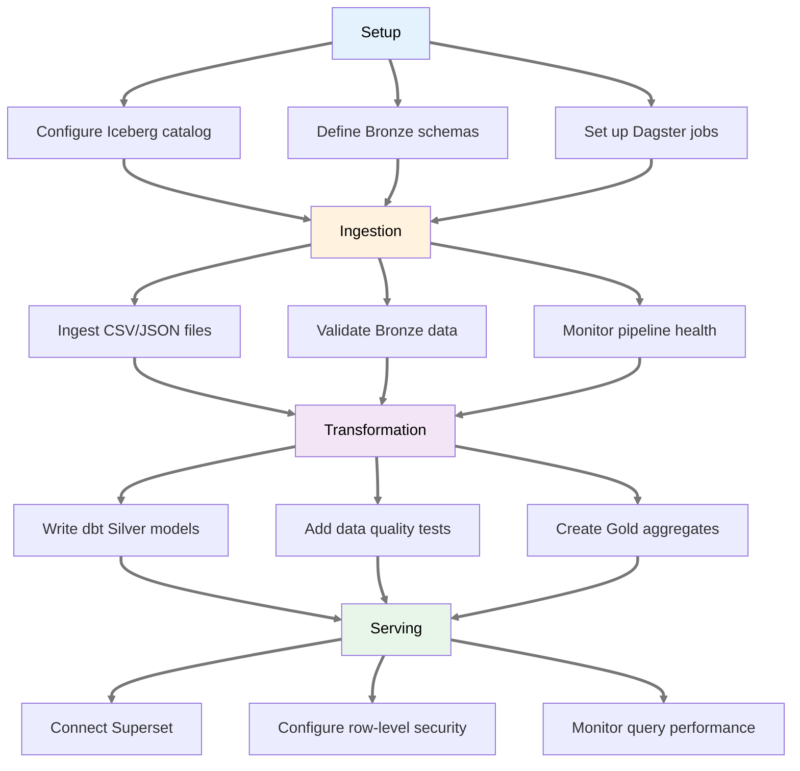
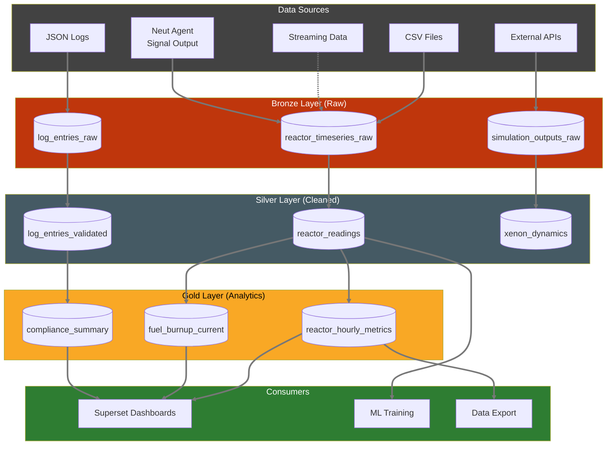
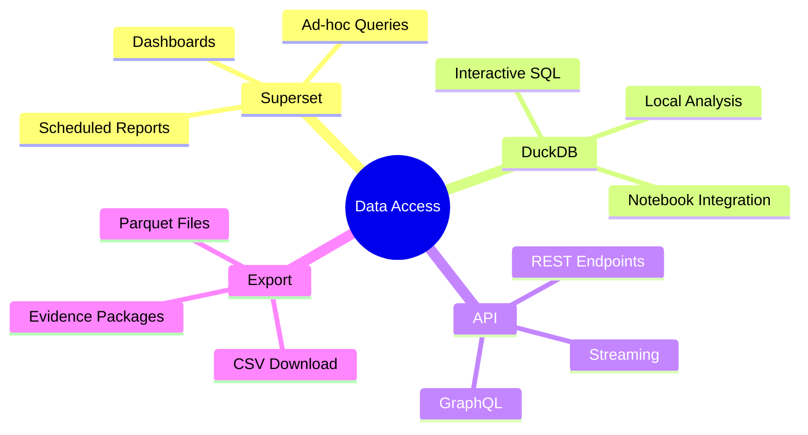

# Data Platform PRD

> **Implementation Status: 🔲 Not Started** — This PRD describes planned functionality. Implementation has not started. For the current data architecture design, see [Data Architecture Specification](../tech-specs/spec-data-architecture.md).

**Product:** Neutron OS Data Platform
**Status:** Draft
**Last Updated:** 2026-01-21
**Parent:** [Executive PRD](prd-executive.md)

---

## Overview

The Neutron OS Data Platform provides a unified data foundation for nuclear research and operations, replacing fragmented CSV/JSON files with a modern lakehouse architecture.

---

## User Journey Map

### Data Engineer: Pipeline Development



### Data Flow Architecture



### Query Access Patterns



---

## User Personas

| Persona | Description | Primary Needs |
|---------|-------------|---------------|
| **Reactor Operator** | Monitors reactor state | Real-time dashboards, historical lookback |
| **Researcher** | Analyzes experimental data | Self-service queries, data export |
| **Data Engineer** | Builds pipelines | Reliable ingestion, transformation tools |
| **Regulatory Inspector** | Reviews records | Immutable history, time-travel queries |
| **Facility Manager** | Oversees operations | KPI dashboards, anomaly alerts |

---

## Problem Statement

### Current State
- CSV files in various directories
- JSON for logs and metadata
- PostgreSQL/TimescaleDB for some time-series
- No unified query layer
- No data versioning
- Manual data preparation for analysis

### Future State
- Bronze/Silver/Gold data tiers (Iceberg)
- Time-travel queries for any historical state
- Self-service analytics (Superset)
- Automated pipelines (Dagster + dbt)
- Immutable audit trail for all data changes

---

## Data Architecture & Operational Requirements

The Data Platform implements the system-wide data architecture and operational requirements defined in technical specifications. Key policies are centralized to ensure consistency:

**See also:**
- [Data Architecture Specification § 9: Backup & Retention Policy](../tech-specs/spec-data-architecture.md#9-backup--retention-policy)
- [Master Tech Spec § 9.2: Backup & Archive Strategy](../tech-specs/spec-executive.md#92-backup--archive-strategy)

**Key Operational Policies:**
- **2-year live retention**: Data actively queried and in use via lakehouse (default for all deployments)
- **7-year archive retention**: Data retained in Glacier-tier storage for NRC-regulated facilities (opt-in; configured via `[retention] policy = "regulatory"` in `data-platform.toml`). Non-regulated deployments default to 2-year retention.
- **Multi-tier backup strategy**: Cloud replication (continuous), local daily, monthly Glacier archive, encrypted portable backup
- **Disaster recovery**: RPO <1 minute (regional), <24 hours (data corruption)
- **Immutability enforcement**: Iceberg table snapshots are immutable; all modifications tracked in transaction log

---

## Requirements

### Epic: Data Lake Foundation

| ID | Requirement | Priority |
|----|-------------|----------|
| DL-001 | Ingest reactor time-series to Bronze tier | P0 |
| DL-002 | S3-compatible object storage | P0 |
| DL-003 | Configurable retention policy (default 2-year; 7-year for NRC-regulated deployments) | P1 |
| DL-004 | Automated daily ingestion from Box | P0 |
| DL-005 | Manual upload capability for legacy data | P1 |

### Epic: Lakehouse (Iceberg + DuckDB)

| ID | Requirement | Priority |
|----|-------------|----------|
| LH-001 | Iceberg tables for Silver/Gold tiers | P0 |
| LH-002 | Time-travel queries | P0 |
| LH-003 | Schema evolution without downtime | P1 |
| LH-004 | DuckDB for embedded analytics | P0 |
| LH-005 | Trino for distributed queries | P2 |

### Epic: Transformations (dbt)

| ID | Requirement | Priority |
|----|-------------|----------|
| TR-001 | Bronze → Silver cleaning transforms | P0 |
| TR-002 | Silver → Gold aggregation transforms | P0 |
| TR-003 | dbt tests for data quality | P0 |
| TR-004 | Incremental model updates | P1 |
| TR-005 | Data lineage documentation | P1 |

### Epic: Orchestration (Dagster)

| ID | Requirement | Priority |
|----|-------------|----------|
| OR-001 | Scheduled daily ingestion | P0 |
| OR-002 | Sensor-triggered pipelines | P1 |
| OR-003 | Pipeline monitoring and alerting | P1 |
| OR-004 | Backfill capability | P1 |
| OR-005 | Dagster UI for pipeline visibility | P0 |

### Epic: Analytics (Superset)

| ID | Requirement | Priority |
|----|-------------|----------|
| AN-001 | Reactor Operations Dashboard | P0 |
| AN-002 | Self-service SQL queries | P0 |
| AN-003 | Dashboard export (PDF, PNG) | P1 |
| AN-004 | Dashboard version control (JSON in Git) | P0 |
| AN-005 | Role-based dashboard access | P1 |

### Epic: Audit & Compliance

| ID | Requirement | Priority |
|----|-------------|----------|
| AU-001 | All data mutations logged to audit trail | P0 |
| AU-002 | Merkle proof verification API | P0 |
| AU-003 | Evidence package generation | P1 |
| AU-004 | Data access logging | P1 |

### Epic: Semantic Search & Knowledge Graph

| ID | Requirement | Priority |
|----|-------------|----------|
| RAG-001 | Unified semantic search across all NeutronOS data | P1 |
| RAG-002 | Knowledge graph linking Silver/Gold tables, signals, and external context | P1 |
| RAG-003 | Vector search API for cross-domain queries | P2 |
| RAG-004 | Integration with Neut signal outputs (from sensing role) | P1 |
| RAG-005 | Query support: "What decisions were made about X?" → surfaces related signals | P2 |
| RAG-006 | Automatic re-indexing when Gold tables change | P2 |

---

## Test-Driven Approach

Superset scenarios drive data model design:
1. Define Superset dashboard requirements
2. Derive Gold table schemas
3. Write dbt tests (must pass)
4. Implement Bronze → Silver → Gold pipeline
5. Build dashboard, export JSON to Git
6. Stakeholder review and approval

See: [Superset Scenarios](../tech-specs/superset-scenarios/)

---

## Success Metrics

| Metric | Target |
|--------|--------|
| Dashboard load time (7-day view) | < 3 seconds |
| Dashboard load time (30-day view) | < 10 seconds |
| Ingestion latency (new data available) | < 1 hour |
| dbt test pass rate | 100% |
| Time-travel query support | Any point in 7-year window |

---

## Data Sources

| Source | Location | Format | Refresh |
|--------|----------|--------|---------|
| Reactor time-series | `serial_data/*.csv` | CSV | Daily |
| Core configurations | `static/core/*.csv` | CSV | Event-driven |
| Xenon dynamics | `Xe_burnup_2025.csv` | CSV | Simulation |
| Rod calibration | `CRH_*.csv`, `rho_vs_T.csv` | CSV | Event-driven |
| Log entries | Log service | JSON/API | Real-time |
| **Neut Signal Output** | Neut agent (sensing role: Media Library, extractors) | JSON/API | Real-time |
| **Agent State** | Agent State Management system | JSON/API | Event-driven |
---

## Technical Dependencies

- Apache Iceberg (table format)
- DuckDB (embedded query)
- Apache Superset (BI)
- dbt-core (transforms)
- Dagster (orchestration)
- Object storage (pending hosting decision)
- **Semantic search capability** (Vector database / embeddings infrastructure — specification TBD)
- **Neut agent integration** (Signal extraction and Bronze ingestion via Neut's sensing role — see [Intelligence Amplification Research](../research/intelligence-amplification.md))
- **Digital Twin integration** (ROM predictions, Shadow outputs, run tracking — see [Digital Twin Hosting PRD](prd-digital-twin-hosting.md))
- **Streaming infrastructure** (Redpanda/Flink for real-time ROM predictions — see [ADR-007](adr-007-streaming-first-architecture.md))

---

## Open Questions

1. Where will the data lake be hosted? (TACC, cloud, hybrid)
2. What time resolution for Gold tables? (hourly, daily)
3. How much historical data to backfill?
4. Should MPACT shadow predictions be included in dashboards?
5. **[RAG Integration]** How should Neut's signal outputs (from sensing role) flow into Bronze tables? (Direct ingestion, staging area, batching strategy)
6. **[Agent State]** Should Agent State Management system outputs (state snapshots, transitions) be persisted as Bronze/Silver tables?
7. **[Real-time Streaming]** What is the boundary between real-time Neut signal ingestion (sensing role) and batch medallion processing?

---

## Digital Twin Integration

This section defines how Digital Twin Hosting data flows into the Data Platform.

### DT Data Sources

| Source | Format | Refresh | Layer |
|--------|--------|---------|-------|
| **ROM Predictions** | JSON (via Redpanda) | Real-time (ROM-1: 10 Hz) | Bronze |
| **Shadow Runs** | HDF5/Parquet | Nightly batch | Bronze |
| **Physics Code Outputs** | HDF5/Parquet | On completion | Bronze |
| **Run Metadata** | PostgreSQL | Event-driven | Silver |
| **Validation Results** | JSON | Per-run | Silver |

### New Bronze Tables

| Table | Description | Partitioning |
|-------|-------------|--------------|
| `dt_runs_raw` | Raw run metadata from orchestrator | `facility`, `run_date` |
| `rom_predictions_raw` | ROM inference outputs | `facility`, `timestamp` |
| `shadow_outputs_raw` | Shadow simulation results | `facility`, `run_date` |
| `physics_outputs_raw` | High-fidelity code results | `facility`, `run_date` |

### New Silver Tables

| Table | Description | Key Transforms |
|-------|-------------|----------------|
| `dt_runs` | Validated run tracking | Schema enforcement, FK validation |
| `dt_run_states` | Reactor state snapshots per run | State interpolation, gap detection |
| `rom_predictions_validated` | Cleaned ROM outputs with UQ | Outlier removal, uncertainty bounds |
| `predicted_vs_measured` | Aligned prediction/measurement pairs | Timestamp alignment, sensor mapping |

### New Gold Tables

| Table | Description | Aggregation |
|-------|-------------|-------------|
| `prediction_accuracy_daily` | Daily accuracy metrics per ROM tier | RMSE, bias, max error by day |
| `model_drift_weekly` | Drift detection trends | Rolling comparison, confidence intervals |
| `rom_performance_summary` | ROM execution statistics | Latency p50/p95/p99, throughput |
| `shadow_comparison_summary` | Shadow vs actual analysis | Deviations by state variable |

### Integration with ADR-007 Streaming

ROM-1 predictions at 10 Hz flow through the streaming pipeline:

```
ROM-1 Inference → Redpanda (rom.predictions.v1) 
                     → Flink (timestamp alignment)
                         → Bronze (rom_predictions_raw)
                             → Real-time comparison (Flink)
                                 → WebSocket (control room)
```

Shadow and physics code outputs use batch ingestion after job completion.

### Data Quality Tests (dbt)

```yaml
# models/silver/dt_runs.yml
tests:
  - unique:
      column_name: run_id
  - accepted_values:
      column_name: run_type
      values: ['physics', 'shadow', 'rom_training', 'rom_inference', 'calibration']
  - relationships:
      to: ref('model_registry')
      field: model_id
  - not_null:
      columns: [run_id, run_type, model_id, reactor_type, facility, status]
```

### See Also

- [Digital Twin Hosting PRD](prd-digital-twin-hosting.md) — Full run tracking schema
- [Model Corral PRD](prd-model-corral.md) — Model registry integration
- [ADR-007: Streaming Architecture](adr-007-streaming-first-architecture.md) — Real-time data flow

---

## NEUP Research Addendum

This section identifies NEUP 2026 proposals that directly support, extend, or depend on the Data Platform capabilities.

### Supporting PRD Sections for NEUP Initiatives

| NEUP Proposal | Supporting Requirement | How It Helps |
|---------------|----------------------|--------------|
| All DT proposals | DL-001, LH-001 | Bronze/Silver/Gold tiers provide training data for ML models |
| All DT proposals | LH-002 (Time-travel) | Enables reproducible experiments on historical data states |
| Cherenkov Power Monitoring | TR-001, TR-002 | Transform pipeline ready for new sensor types |
| Resolving Sensor Data Conflicts | TR-003 (dbt tests) | Quality tests can validate reconciliation logic |
| KANs/PINNs/ML Neutronics | AN-001, AN-002 | Superset dashboards visualize model predictions |

### NEUP Proposal: Resolving Sensor Data Conflicts

**Proposal:** Methods for reconciling conflicting readings from redundant sensors in nuclear facilities.

**Gap Addressed:** Current PRD assumes sensor data arrives clean; no specification for multi-sensor fusion or conflict detection.

#### New Requirements: Sensor Data Reconciliation

| ID | Requirement | Priority |
|----|-------------|----------|
| TR-006 | Sensor conflict detection when redundant sensors disagree beyond threshold | P1 |
| TR-007 | Configurable reconciliation algorithms (weighted average, voting, Kalman filter) | P1 |
| TR-008 | Reconciliation metadata preserved in Silver layer | P1 |

#### New Silver Layer Transform: Sensor Fusion

```yaml
reconciliation_config:
  strategy: "weighted_average" | "voting" | "kalman_filter" | "ml_fusion"
  disagreement_threshold_pct: 5.0
  minimum_sensors_required: 2

output_fields:
  - reconciled_value: float
  - confidence_score: float
  - contributing_sensors: array<string>
  - quality_flag: "GOOD" | "CONFLICT" | "DEGRADED"
```

#### New Dashboard: Sensor Conflict Monitoring

| Metric | Visualization |
|--------|---------------|
| Active conflicts by sensor group | Real-time alert panel |
| Historical conflict frequency | Time-series chart |
| Sensor agreement matrix | Heatmap |
| Root cause patterns | Anomaly clustering |

---

### NEUP Proposal: Cherenkov Power Monitoring

**Proposal:** Using Cherenkov radiation camera images to provide independent power measurements.

**Gap Addressed:** Current PRD only handles structured sensor data (CSV, JSON); no image/video ingestion pipeline.

#### New Data Source

| Source | Location | Format | Refresh |
|--------|----------|--------|----------|
| **Cherenkov camera** | Pool camera system | Video stream / JPEG frames | Real-time |

#### New Requirements: Image/Video Ingestion

| ID | Requirement | Priority |
|----|-------------|----------|
| DL-006 | Ingest video frames with timestamps to Bronze tier | P2 |
| TR-009 | Image processing transform for Cherenkov intensity extraction | P2 |
| TR-010 | Cross-calibration with ion chamber readings in Silver layer | P2 |

#### Bronze → Silver Pipeline (Cherenkov)

```
Video Source → Frame Extraction → Bronze (raw frames)
                                      ↓
                              Blue Channel Intensity
                                      ↓
                              Calibration Curve
                                      ↓
                              Silver (power_cherenkov_derived)
                                      ↓
                              Gold (power_comparison_metrics)
```

**Integration Point:** Cherenkov-derived power serves as:
- Independent validation of detector readings
- Backup power estimate during detector maintenance
- Additional data source for DT prediction validation

---

### Research Contact Points

| Proposal | Data Platform Integration | Primary Concern |
|----------|--------------------------|------------------|
| Sensor Data Conflicts | Bronze→Silver transforms | Reconciliation algorithm selection |
| Cherenkov Monitoring | New ingestion pipeline | Video storage and processing infrastructure |
| All ML/DT proposals | Training data access | Data versioning, reproducibility |

*This addendum should be reviewed when NEUP proposal decisions are announced.*
