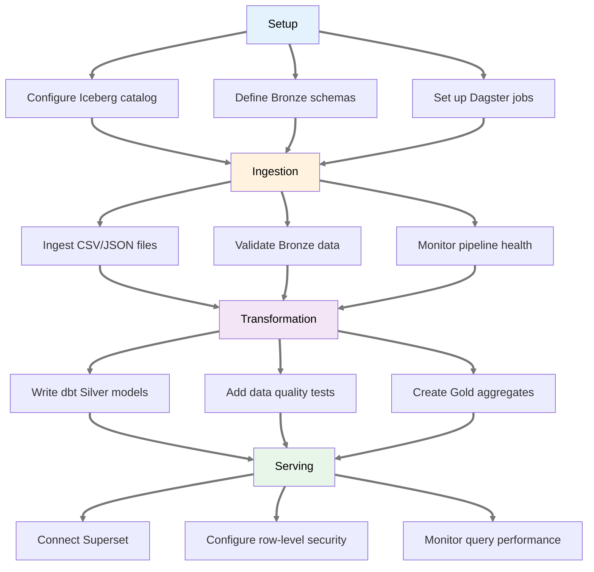
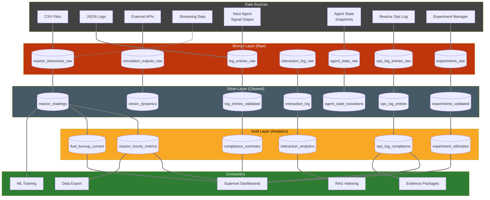
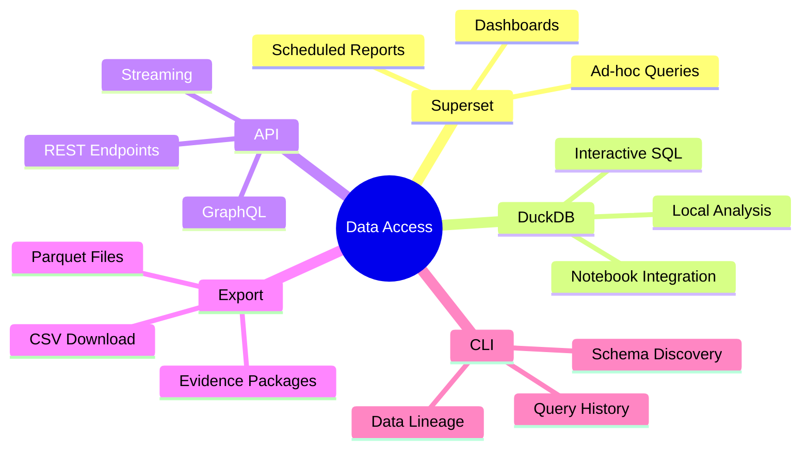

# Data Platform PRD

> **Implementation Status: 🔲 Not Started** — This PRD describes planned functionality. Implementation has not started. For the current data architecture design, see [Data Architecture Specification](../tech-specs/spec-data-architecture.md).

**Product:** Neutron OS Data Platform
**Status:** Draft
**Last Updated:** 2026-03-26
**Parent:** [Executive PRD](prd-executive.md)
**Upstream:** [Axiom Data Platform PRD](https://github.com/…/axiom/docs/requirements/prd-data-platform.md) — this PRD is self-contained but extends the domain-agnostic Axiom Data Platform with nuclear-specific schemas, transforms, dashboards, and compliance requirements.
**Related:** [DOE Data Management & Sharing PRD](prd-doe-data-management.md)

---

## Overview

The Neutron OS Data Platform provides a unified data foundation for nuclear research and operations, replacing fragmented CSV/JSON files with a modern lakehouse architecture. It builds on the [Axiom Data Platform](https://github.com/…/axiom/docs/requirements/prd-data-platform.md) for generic infrastructure (Iceberg, DuckDB, Dagster, dbt, Superset, streaming, multi-tenancy) and layers on nuclear-domain schemas, regulatory compliance, and facility-specific data sources.

### DOE Data Management Alignment

The nuclear data platform extends Axiom's federal data management infrastructure with NRC-specific retention tiers, nuclear metadata schemas, and export control integration. Gaps being addressed by [prd-doe-data-management.md](prd-doe-data-management.md): dataset publication lifecycle (Bronze/Silver/Gold datasets lack a "published" state), persistent identifiers (DOIs) on Gold-tier datasets designated for publication, and a DataCite metadata layer for published datasets shared with the broader research community.

---

## User Journey Map

### Data Engineer: Pipeline Development



### Data Flow Architecture



### Query Access Patterns



---

## User Personas

| Persona | Description | Primary Needs |
|---------|-------------|---------------|
| **Reactor Operator** | Monitors reactor state | Real-time dashboards, historical lookback |
| **Researcher** | Analyzes experimental data | Self-service queries, data export |
| **Data Engineer** | Builds pipelines | Reliable ingestion, transformation tools |
| **Regulatory Inspector** | Reviews NRC records | Immutable history, time-travel queries, evidence packages |
| **Facility Manager** | Oversees operations | KPI dashboards, anomaly alerts |
| **Health Physics** | Radiation safety oversight | Compliance dashboards, dose tracking |

---

## Problem Statement

### Current State
- CSV files in various directories
- JSON for logs and metadata
- PostgreSQL/TimescaleDB for some time-series
- No unified query layer
- No data versioning
- Manual data preparation for analysis

### Future State
- Bronze/Silver/Gold data tiers (Iceberg)
- Time-travel queries for any historical state
- Self-service analytics (Superset)
- Automated pipelines (Dagster + dbt)
- Immutable audit trail for all data changes
- NRC-compliant evidence package generation
- Multi-facility isolation with row-level security

---

## Axiom Platform Foundation

The following capabilities are inherited from the Axiom Data Platform and are **not re-specified here**. See the [Axiom Data Platform PRD](https://github.com/…/axiom/docs/requirements/prd-data-platform.md) for full details:

| Axiom Capability | Axiom Epic / Section |
|------------------|---------------------|
| Iceberg + DuckDB lakehouse | Epic: Lakehouse (LH-001 through LH-005) |
| Dagster orchestration | Epic: Orchestration (OR-001 through OR-005) |
| dbt transforms (generic framework) | Epic: Transformations (TR-001 through TR-005) |
| Superset analytics (generic framework) | Epic: Analytics (AN-001 through AN-005) |
| Merkle proof audit trail | Epic: Audit & Compliance (AU-001 through AU-004) |
| Interaction log pipeline | Epic: Interaction Log (IL-001 through IL-005) |
| Agent state ingestion | Epic: Agent State Ingestion (AS-001 through AS-004) |
| Semantic search & knowledge graph | Epic: Semantic Search (RAG-001 through RAG-006) |
| CLI data access (`neut data`) | Epic: CLI Data Access (CD-001 through CD-006) |
| Multi-tenant facility isolation | § Multi-Tenant Data Isolation |
| Streaming vs. batch architecture | § Streaming vs. Batch Architecture |
| Row-level security (OpenFGA) | AU-005, AU-006 |
| Sensor reconciliation framework | TR-006 through TR-008 |
| Binary/blob ingestion | DL-006 |
| Log archival policy | § Data Architecture & Operational Requirements |

This PRD focuses on **nuclear-domain extensions** to the above.

---

## Data Architecture & Operational Requirements

The Data Platform implements the system-wide data architecture and operational requirements defined in technical specifications. Key policies are centralized to ensure consistency:

**See also:**
- [Data Architecture Specification § 9: Backup, Retention & Archive Policy](../tech-specs/spec-data-architecture.md#9-backup-retention--archive-policy)
- [Data Architecture Spec § 9: Backup, Retention & Archive Policy](../tech-specs/spec-data-architecture.md#9-backup-retention--archive-policy)

**Key Operational Policies:**
- **2-year live retention**: Data actively queried and in use via lakehouse (default for all deployments)
- **7-year archive retention**: Data retained in Glacier-tier storage for NRC-regulated facilities (opt-in; configured via `[retention] policy = "regulatory"` in `data-platform.toml`). Non-regulated deployments default to 2-year retention.
- **Log archival**: System logs, audit logs, routing logs, and ops log entries follow the same retention tiers. NRC-regulated facilities archive all logs for 7 years.
- **Multi-tier backup strategy**: Cloud replication (continuous), local daily, monthly Glacier archive, encrypted portable backup
- **Disaster recovery**: RPO <1 minute (regional), <24 hours (data corruption)
- **Immutability enforcement**: Iceberg table snapshots are immutable; all modifications tracked in transaction log

---

## Requirements — Nuclear Domain Extensions

The following requirements extend the Axiom Data Platform with nuclear-specific schemas, transforms, and compliance features.

### Epic: Nuclear Data Lake Foundation

| ID | Requirement | Priority |
|----|-------------|----------|
| NDL-001 | Ingest reactor time-series to Bronze tier (power, temperature, rod position, flux) | P0 |
| NDL-002 | Automated daily ingestion from Box (TRIGA serial data) | P0 |
| NDL-003 | Manual upload capability for legacy reactor data | P1 |
| NDL-004 | Ingest Reactor Ops Log entries to Bronze `ops_log_entries_raw` | P0 |
| NDL-005 | Ingest Experiment Manager records to Bronze `experiments_raw` | P1 |
| NDL-006 | Ingest training/certification records to Bronze `training_records_raw` | P1 |
| NDL-007 | Ingest authorized experiment registry to Bronze `authorized_experiments_raw` | P1 |

### Epic: Nuclear Transforms (dbt)

| ID | Requirement | Priority |
|----|-------------|----------|
| NTR-001 | Bronze → Silver: reactor time-series cleaning (gap detection, outlier removal, unit normalization) | P0 |
| NTR-002 | Bronze → Silver: xenon dynamics derivation from rod height correlation | P1 |
| NTR-003 | Bronze → Silver: ops log entry validation (required fields, signature verification) | P0 |
| NTR-004 | Bronze → Silver: experiment validation (authorization cross-check, dose calculations) | P1 |
| NTR-005 | Bronze → Silver: training record validation (certification expiry, required hours) | P1 |
| NTR-006 | Silver → Gold: reactor hourly metrics aggregation | P0 |
| NTR-007 | Silver → Gold: fuel burnup tracking (per-element, cumulative) | P1 |
| NTR-008 | Silver → Gold: compliance summary (30-min check gaps, training currency, experiment authorizations) | P0 |
| NTR-009 | Silver → Gold: experiment utilization metrics (by facility, PI, type) | P1 |
| NTR-010 | Nuclear sensor reconciliation: ion chambers, RTDs, flux detectors with nuclear-specific thresholds | P1 |
| NTR-011 | Radioactive decay correction transforms for experiment results | P2 |

### Epic: Nuclear Analytics (Superset Dashboards)

| ID | Requirement | Priority |
|----|-------------|----------|
| NAN-001 | Reactor Operations Overview — current power, rod positions, temperature, status | P0 |
| NAN-002 | Ops Log Compliance — 30-min check gap detection, entries by type/operator | P0 |
| NAN-003 | Shift Summary — entry counts by watch type, handoff data | P1 |
| NAN-004 | Fuel Burnup Heatmap — per-element burnup visualization | P1 |
| NAN-005 | Xenon Inventory (Inferred) — Xe-135 tracking via rod height correlation | P2 |
| NAN-006 | Power History — historical power levels, trends | P0 |
| NAN-007 | Experiment Tracking — sample status, beam time usage, utilization | P1 |
| NAN-008 | Facility Usage — which facilities are most utilized | P1 |
| NAN-009 | Model vs. Measurement — DT prediction validation | P1 |
| NAN-010 | Model Performance — ROM execution times, convergence | P2 |
| NAN-011 | Sensor Conflict Monitoring — nuclear sensor disagreement tracking | P2 |
| NAN-012 | Data Quality — pipeline health, ingestion latency, dbt test pass rates | P1 |
| NAN-013 | Training Currency — operator certification status, upcoming expirations | P1 |

### Epic: NRC Compliance & Evidence

| ID | Requirement | Priority |
|----|-------------|----------|
| NCE-001 | Evidence package generation in NRC-accepted formats (PDF, plain text) | P0 |
| NCE-002 | Tamper-evident ops log storage with HMAC-chain verification | P0 |
| NCE-003 | Chain-of-custody attribution: every ops log entry linked to authenticated operator | P0 |
| NCE-004 | Export-controlled schema tagging: tables/columns tagged `export_controlled` where applicable | P1 |
| NCE-005 | EC-tagged data gated by Security PRD authorization checks (FR-EC-*) | P1 |
| NCE-006 | 30-min check gap alerting: automatic notification when ops log check interval exceeds threshold | P1 |
| NCE-007 | Compliance scoring Gold table: percentage of checks completed, training hours, experiments authorized | P0 |

### Epic: ROM Training Provenance

| ID | Requirement | Priority |
|----|-------------|----------|
| RTP-001 | `rom_training_datasets` Silver table linking ROM IDs to training data query snapshots and Iceberg snapshot IDs | P1 |
| RTP-002 | Immutable training data snapshots via Iceberg time-travel (ROM version → exact data state) | P1 |
| RTP-003 | dbt tests for training data integrity: no gaps, no duplicates, correct time ranges | P1 |
| RTP-004 | Physics code output schemas for VERA, MCNP, SAM, SCALE in Bronze tier | P2 |
| RTP-005 | Model Corral integration: ROM artifact metadata references Data Platform table versions | P1 |

---

## Nuclear Bronze Table Inventory

| Table | Source PRD | Description | Partitioning |
|-------|-----------|-------------|--------------|
| `reactor_timeseries_raw` | This PRD (NDL-001) | Power, temperature, rod position, flux readings | `facility`, `date` |
| `ops_log_entries_raw` | [Reactor Ops Log](prd-reactor-ops-log.md) | Operator log entries with HMAC chain | `facility`, `date` |
| `experiments_raw` | [Experiment Manager](prd-experiment-manager.md) | Sample metadata, irradiation parameters | `facility`, `date` |
| `irradiation_events_raw` | [Experiment Manager](prd-experiment-manager.md) | Insertion/removal times, dose rates | `facility`, `date` |
| `training_records_raw` | [Compliance Tracking](prd-compliance-tracking.md) | Certifications, hours, expirations | `facility` |
| `authorized_experiments_raw` | [Compliance Tracking](prd-compliance-tracking.md) | ROC-approved experiment templates | `facility` |
| `experiment_authorizations_raw` | [Compliance Tracking](prd-compliance-tracking.md) | Per-experiment approval trail | `facility`, `date` |
| `dt_runs_raw` | [Digital Twin Hosting](prd-digital-twin-hosting.md) | Run metadata from orchestrator | `facility`, `run_date` |
| `rom_predictions_raw` | [Digital Twin Hosting](prd-digital-twin-hosting.md) | ROM inference outputs (streaming) | `facility`, `timestamp` |
| `shadow_outputs_raw` | [Digital Twin Hosting](prd-digital-twin-hosting.md) | Shadow simulation results | `facility`, `run_date` |
| `physics_outputs_raw` | [Digital Twin Hosting](prd-digital-twin-hosting.md) | VERA/MCNP/SAM/SCALE results | `facility`, `run_date` |
| `interaction_log_raw` | [RAG PRD](prd-rag.md) | RAG completion records | `facility`, `date` |
| `agent_state_raw` | [Agent State Mgmt](prd-agent-state-management.md) | Agent state transition snapshots | `facility`, `date` |

---

## Nuclear Silver Table Inventory

| Table | Key Transforms | Source Bronze |
|-------|---------------|--------------|
| `reactor_readings` | Gap detection, outlier removal, unit normalization | `reactor_timeseries_raw` |
| `xenon_dynamics` | Rod height → Xe-135 inventory correlation | `reactor_timeseries_raw` |
| `ops_log_entries` | Required field validation, signature verification, HMAC chain check | `ops_log_entries_raw` |
| `experiments_validated` | Authorization cross-check, dose calculation | `experiments_raw` |
| `irradiation_events` | Time alignment with reactor readings, dose rate validation | `irradiation_events_raw` |
| `training_records` | Expiry calculation, required-hours validation | `training_records_raw` |
| `authorized_experiments` | Schema enforcement, ROC approval verification | `authorized_experiments_raw` |
| `rom_training_datasets` | ROM ID → training data snapshot linkage | `physics_outputs_raw`, `reactor_timeseries_raw` |
| `dt_runs` | Schema enforcement, FK validation | `dt_runs_raw` |
| `dt_run_states` | Reactor state interpolation, gap detection | `dt_runs_raw`, `reactor_timeseries_raw` |
| `rom_predictions_validated` | Outlier removal, uncertainty bounds | `rom_predictions_raw` |
| `predicted_vs_measured` | Timestamp alignment, sensor mapping | `rom_predictions_raw`, `reactor_timeseries_raw` |

---

## Nuclear Gold Table Inventory

This is the complete inventory of Gold tables required by downstream PRDs.

| Table | Consumer Dashboard(s) | Aggregation | Source Silver |
|-------|----------------------|-------------|--------------|
| `reactor_hourly_metrics` | NAN-001, NAN-006 | Hourly avg/min/max power, temp, rod position | `reactor_readings` |
| `fuel_burnup_current` | NAN-004 | Per-element cumulative burnup | `reactor_readings` |
| `compliance_summary` | NAN-002, NAN-013 | 30-min check gaps, training currency %, experiment auth % | `ops_log_entries`, `training_records`, `authorized_experiments` |
| `ops_log_compliance` | NAN-002 | Gaps in 30-min checks, entries by type/operator | `ops_log_entries` |
| `shift_summary` | NAN-003 | Entry counts by watch type, handoff data | `ops_log_entries` |
| `experiment_utilization` | NAN-007, NAN-008 | Samples by facility, PI, type; beam time usage | `experiments_validated`, `irradiation_events` |
| `power_history` | NAN-006 | Historical power levels, trends | `reactor_readings` |
| `prediction_accuracy_daily` | NAN-009 | RMSE, bias, max error by day per ROM tier | `predicted_vs_measured` |
| `model_drift_weekly` | NAN-009 | Rolling comparison, confidence intervals | `predicted_vs_measured` |
| `rom_performance_summary` | NAN-010 | Latency p50/p95/p99, throughput | `dt_runs` |
| `shadow_comparison_summary` | NAN-009 | Deviations by state variable | `dt_run_states` |
| `interaction_analytics` | (RAG PRD) | Queries/day, topic distribution, latency | `interaction_log` |
| `data_quality_metrics` | NAN-012 | Pipeline health, ingestion latency, dbt test pass rates | Dagster metadata |

---

## Cross-PRD Linkage

The following table maps Data Platform schemas to the PRDs that produce or consume them.

| PRD | Produces (→ Bronze) | Consumes (← Gold/Silver) |
|-----|---------------------|--------------------------|
| [Reactor Ops Log](prd-reactor-ops-log.md) | `ops_log_entries_raw` | `ops_log_compliance`, `compliance_summary` |
| [Experiment Manager](prd-experiment-manager.md) | `experiments_raw`, `irradiation_events_raw` | `experiment_utilization`, `reactor_readings` (for correlation) |
| [Compliance Tracking](prd-compliance-tracking.md) | `training_records_raw`, `authorized_experiments_raw`, `experiment_authorizations_raw` | `compliance_summary`, `ops_log_compliance` |
| [Digital Twin Hosting](prd-digital-twin-hosting.md) | `dt_runs_raw`, `rom_predictions_raw`, `shadow_outputs_raw`, `physics_outputs_raw` | `prediction_accuracy_daily`, `model_drift_weekly` |
| [Model Corral](prd-model-corral.md) | (via DT Hosting) | `rom_training_datasets`, `rom_performance_summary` |
| [Analytics Dashboards](prd-analytics-dashboards.md) | — | All Gold tables |
| [RAG](prd-rag.md) | `interaction_log_raw` | `interaction_analytics`, Silver/Gold tables (for indexing) |
| [Agent State Mgmt](prd-agent-state-management.md) | `agent_state_raw` | `agent_state_transitions` |
| [Logging](prd-logging.md) | `log_entries_raw` (system logs) | — |
| [Security](prd-security.md) | — | Row-level security enforcement on all tables |
| [Neut CLI](prd-neut-cli.md) | — | All tables (via `neut data` commands) |
| [Scheduling System](prd-scheduling-system.md) | (scheduling data via Experiment Manager) | `experiment_utilization` |
| [Media Library](prd-media-library.md) | Metadata records → Bronze (future) | — |

---

## Test-Driven Approach

Superset scenarios drive data model design:
1. Define Superset dashboard requirements
2. Derive Gold table schemas
3. Write dbt tests (must pass)
4. Implement Bronze → Silver → Gold pipeline
5. Build dashboard, export JSON to Git
6. Stakeholder review and approval

See: [Superset Scenarios](../tech-specs/superset-scenarios/)

---

## Success Metrics

| Metric | Target |
|--------|--------|
| Dashboard load time (7-day view) | < 3 seconds |
| Dashboard load time (30-day view) | < 10 seconds |
| Ingestion latency — batch | < 1 hour |
| Ingestion latency — streaming | < 1 second |
| dbt test pass rate | 100% |
| Time-travel query support | Any point in 7-year window (NRC-regulated) |
| Row-level security coverage | 100% of tables with `facility_id` |
| 30-min check gap detection | < 5 minutes from missed check |

---

## Data Sources

| Source | Location | Format | Refresh |
|--------|----------|--------|---------|
| Reactor time-series | `serial_data/*.csv` | CSV | Daily |
| Core configurations | `static/core/*.csv` | CSV | Event-driven |
| Xenon dynamics | `Xe_burnup_2025.csv` | CSV | Simulation |
| Rod calibration | `CRH_*.csv`, `rho_vs_T.csv` | CSV | Event-driven |
| Log entries | Log service | JSON/API | Real-time |
| **Reactor Ops Log** | Ops Log system (HMAC-chain entries) | JSON/API | Real-time |
| **Experiment Records** | Experiment Manager | JSON/API | Event-driven |
| **Training Records** | Compliance Tracking system | JSON/API | Event-driven |
| **Neut Signal Output** | Neut agent (sensing role: Media Library, extractors) | JSON/API | Real-time |
| **Agent State** | Agent State Management system | JSON/API | Event-driven |
| **Interaction Log** | RAG completions (Neut agent) | JSON | Per-completion |
| **Cherenkov camera** | Pool camera system | Video stream / JPEG frames | Real-time |

---

## Technical Dependencies

- Apache Iceberg (table format)
- DuckDB (embedded query)
- Apache Superset (BI)
- dbt-core (transforms)
- Dagster (orchestration)
- SeaweedFS (S3-compatible object storage)
- Redpanda (streaming) + Flink (stream processing) — see [ADR-007](adr-007-streaming-first-architecture.md)
- pgvector (semantic search / embeddings)
- OpenFGA (authorization / row-level security)
- Ory Kratos (identity / user context)
- **Neut agent integration** (Signal extraction and Bronze ingestion via Neut's sensing role — see [Intelligence Amplification Research](../research/intelligence-amplification.md))
- **Digital Twin integration** (ROM predictions, Shadow outputs, run tracking — see [Digital Twin Hosting PRD](prd-digital-twin-hosting.md))

---

## Open Questions

1. ~~Where will the data lake be hosted?~~ **Resolved:** SeaweedFS on-premise (TACC); cloud S3 for managed deployments.
2. What time resolution for Gold tables? (hourly, daily) — Currently hourly for reactor metrics; daily for compliance/utilization.
3. How much historical data to backfill? — Facility-specific decision at deployment time.
4. ~~Should MPACT shadow predictions be included in dashboards?~~ **Resolved:** Yes — see NAN-009 (Model vs. Measurement).
5. ~~How should Neut's signal outputs flow into Bronze tables?~~ **Resolved:** Direct ingestion via event bus; see Axiom § Agent State Ingestion pattern.
6. ~~Should Agent State snapshots be persisted as Bronze/Silver tables?~~ **Resolved:** Yes — see Axiom Epic: Agent State Ingestion.
7. ~~What is the boundary between real-time and batch?~~ **Resolved:** See Axiom § Streaming vs. Batch Architecture.
8. How should Cherenkov video frames be stored long-term? (Object storage with metadata pointers in Bronze, or inline in Iceberg?)
9. Should experiment decay corrections be computed at query time (UDF) or materialized in Silver?

---

## Digital Twin Integration

This section defines how Digital Twin Hosting data flows into the Data Platform.

### DT Data Sources

| Source | Format | Refresh | Layer |
|--------|--------|---------|-------|
| **ROM Predictions** | JSON (via Redpanda) | Real-time (ROM-1: 10 Hz) | Bronze |
| **Shadow Runs** | HDF5/Parquet | Nightly batch | Bronze |
| **Physics Code Outputs** | HDF5/Parquet | On completion | Bronze |
| **Run Metadata** | PostgreSQL | Event-driven | Silver |
| **Validation Results** | JSON | Per-run | Silver |

### DT Data Quality Tests (dbt)

```yaml
# models/silver/dt_runs.yml
tests:
  - unique:
      column_name: run_id
  - accepted_values:
      column_name: run_type
      values: ['physics', 'shadow', 'rom_training', 'rom_inference', 'calibration']
  - relationships:
      to: ref('model_registry')
      field: model_id
  - not_null:
      columns: [run_id, run_type, model_id, reactor_type, facility, status]
```

### DT Streaming Integration

ROM-1 predictions at 10 Hz flow through the streaming pipeline:

```
ROM-1 Inference → Redpanda (rom.predictions.v1)
                     → Flink (timestamp alignment)
                         → Bronze (rom_predictions_raw)
                             → Real-time comparison (Flink)
                                 → WebSocket (control room)
```

Shadow and physics code outputs use batch ingestion after job completion.

### See Also

- [Digital Twin Hosting PRD](prd-digital-twin-hosting.md) — Full run tracking schema
- [Model Corral PRD](prd-model-corral.md) — Model registry integration
- [ADR-007: Streaming Architecture](adr-007-streaming-first-architecture.md) — Real-time data flow

---

## NEUP Research Addendum

This section identifies NEUP 2026 proposals that directly support, extend, or depend on the Data Platform capabilities.

### Supporting PRD Sections for NEUP Initiatives

| NEUP Proposal | Supporting Requirement | How It Helps |
|---------------|----------------------|--------------|
| All DT proposals | NDL-001, Axiom LH-001 | Bronze/Silver/Gold tiers provide training data for ML models |
| All DT proposals | Axiom LH-002 (Time-travel) | Enables reproducible experiments on historical data states |
| Cherenkov Power Monitoring | NTR-001, NTR-006 | Transform pipeline ready for new sensor types |
| Resolving Sensor Data Conflicts | Axiom TR-006–TR-008, NTR-010 | Quality tests can validate reconciliation logic |
| KANs/PINNs/ML Neutronics | NAN-001, NAN-009 | Superset dashboards visualize model predictions |

### NEUP Proposal: Resolving Sensor Data Conflicts

**Proposal:** Methods for reconciling conflicting readings from redundant sensors in nuclear facilities.

**Gap Addressed:** Current PRD assumes sensor data arrives clean; no specification for multi-sensor fusion or conflict detection.

**Implementation:** Uses the generic Axiom sensor reconciliation framework (TR-006 through TR-008) with nuclear-specific thresholds and algorithms defined in NTR-010.

#### Nuclear-Specific Reconciliation

| Sensor Type | Typical Redundancy | Threshold | Preferred Strategy |
|-------------|-------------------|-----------|-------------------|
| Ion chambers | 2–4 per channel | 2% | Weighted average (calibration-date weighting) |
| RTDs (temperature) | 2–3 per location | 1°C | Voting (majority rules) |
| Flux detectors | 3+ per quadrant | 5% | Kalman filter (known drift model) |

#### New Dashboard: Sensor Conflict Monitoring (NAN-011)

| Metric | Visualization |
|--------|---------------|
| Active conflicts by sensor group | Real-time alert panel |
| Historical conflict frequency | Time-series chart |
| Sensor agreement matrix | Heatmap |
| Root cause patterns | Anomaly clustering |

---

### NEUP Proposal: Cherenkov Power Monitoring

**Proposal:** Using Cherenkov radiation camera images to provide independent power measurements.

**Gap Addressed:** Current PRD only handles structured sensor data (CSV, JSON); no image/video ingestion pipeline.

#### New Data Source

| Source | Location | Format | Refresh |
|--------|----------|--------|----------|
| **Cherenkov camera** | Pool camera system | Video stream / JPEG frames | Real-time |

#### New Requirements: Image/Video Ingestion

| ID | Requirement | Priority |
|----|-------------|----------|
| NCH-001 | Ingest video frames with timestamps to Bronze tier (via Axiom DL-006) | P2 |
| NCH-002 | Image processing transform for Cherenkov intensity extraction | P2 |
| NCH-003 | Cross-calibration with ion chamber readings in Silver layer | P2 |

#### Bronze → Silver Pipeline (Cherenkov)

```
Video Source → Frame Extraction → Bronze (raw frames)
                                      ↓
                              Blue Channel Intensity
                                      ↓
                              Calibration Curve
                                      ↓
                              Silver (power_cherenkov_derived)
                                      ↓
                              Gold (power_comparison_metrics)
```

**Integration Point:** Cherenkov-derived power serves as:
- Independent validation of detector readings
- Backup power estimate during detector maintenance
- Additional data source for DT prediction validation

---

### Research Contact Points

| Proposal | Data Platform Integration | Primary Concern |
|----------|--------------------------|------------------|
| Sensor Data Conflicts | Bronze→Silver transforms | Reconciliation algorithm selection |
| Cherenkov Monitoring | New ingestion pipeline | Video storage and processing infrastructure |
| All ML/DT proposals | Training data access | Data versioning, reproducibility |

*This addendum should be reviewed when NEUP proposal decisions are announced.*
