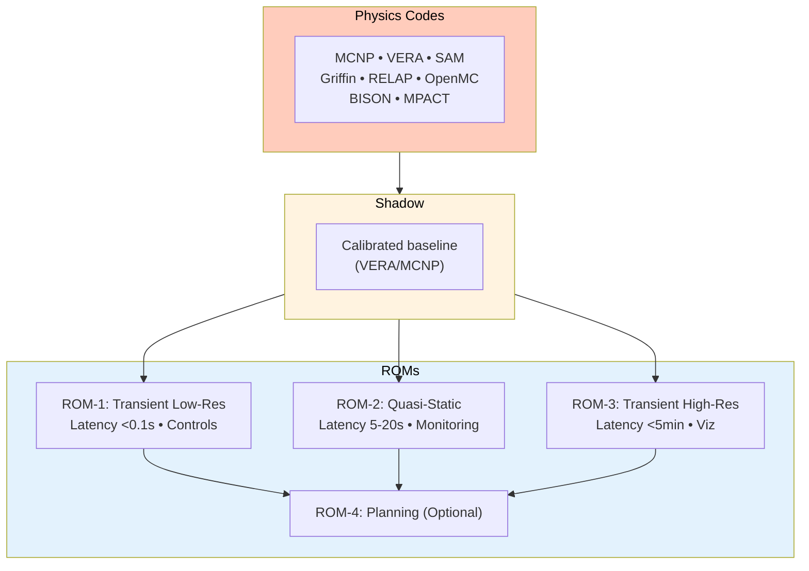
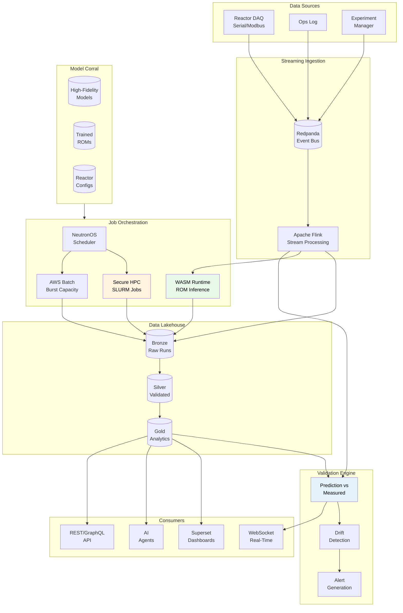
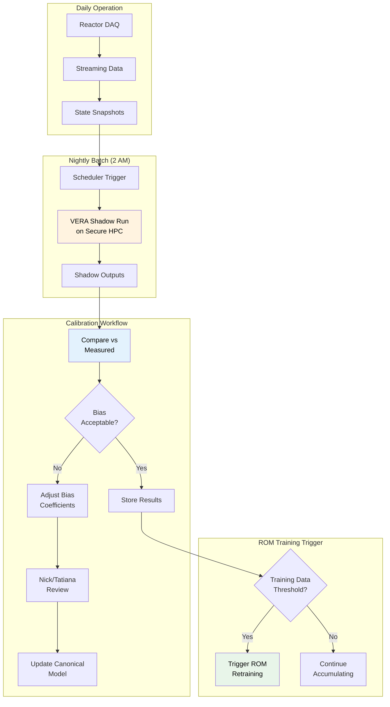
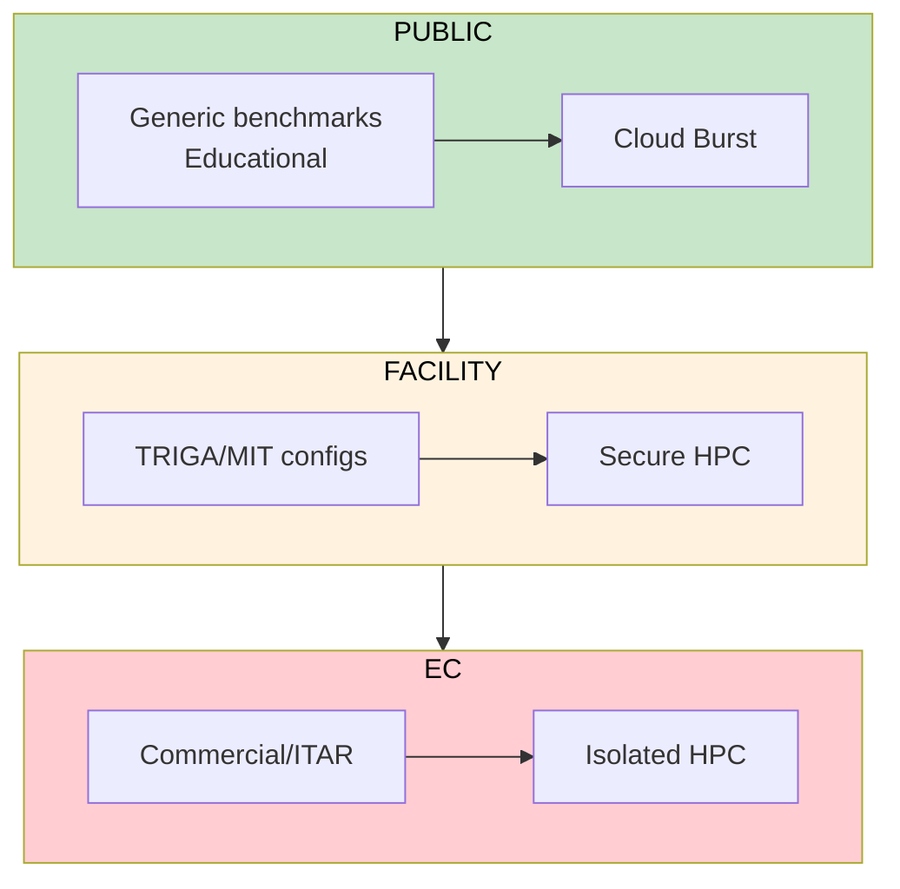

# Digital Twin Hosting PRD

> **Implementation Status: 🔲 Not Started** — This PRD describes planned functionality.

**Product:** NeutronOS Digital Twin Hosting Platform  
**Status:** Draft  
**Last Updated:** 2026-03-18  
**Owner:** Ben Booth  
**Technical Lead:** Dr. Kevin Clarno  
**Parent:** [Executive PRD](prd-executive.md)  
**Related:** [Model Corral PRD](prd-model-corral.md), [Data Platform PRD](prd-data-platform.md), [Streaming Architecture ADR](adr-007-streaming-first-architecture.md), [Agent Architecture Spec](../tech-specs/spec-agent-architecture.md)

---

## Overview

Digital Twin Hosting is NeutronOS's infrastructure for executing, monitoring, and managing computational models of nuclear reactors — both **high-fidelity physics simulations** (MCNP, VERA, SAM, Griffin, RELAP, OpenMC, BISON) and **Reduced Order Models (ROMs)**. It provides the execution environment, run tracking, validation, and integration that transforms static models into operational digital twins.

### Scope Clarification

This PRD covers **hosting** — the runtime infrastructure that:
- Executes physics codes on HPC clusters (secure HPC, cloud burst)
- Runs ROM inference at varying latencies (10 Hz → on-demand)
- Tracks all simulation runs with full provenance
- Compares predictions against measured reactor data
- Feeds results into dashboards, agents, and downstream systems

**Model Corral** (companion PRD) handles the registry/versioning of model inputs. This PRD assumes models are already in Model Corral and focuses on execution.

**Execution Runtime:** All ROMs deploy to WebAssembly (WASM), providing a uniform execution layer with sandboxed isolation and portability across edge, cloud, and HPC environments. See [ROM Tiers Specification](#rom-tiers-specification) for details.

**HPC Terminology:** Throughout this document, "Secure HPC" refers to any protected computing environment suitable for export-controlled or sensitive workloads. TACC (Texas Advanced Computing Center) is used in examples as UT's current secure HPC provider, but the architecture is designed for any SLURM-based HPC system (ORNL Summit, INL Sawtooth, LLNL Sierra, etc.).

---

## Problem Statement

### Current State

1. **Local Execution Only** — Physics codes run on individual workstations; no central orchestration
2. **TRIGA-Specific Run Tracking** — Shadowcaster pioneered the workflow (VERA simulations → PostgreSQL → prediction emails), but its schema is TRIGA-specific and doesn't generalize to other reactor types without significant refactoring
3. **ROM Accuracy Gap** — Existing ROMs (e.g., John Ross demo) show limited predictive capability
4. **No Real-Time Path** — No infrastructure for ROM predictions at control-room latencies
5. **Limited Validation Self-Service** — Jay's TRIGA Digital charts compare predictions to measurements effectively, but adding new comparisons requires developer involvement rather than user configuration
6. **Single-Reactor Focus** — Current tools built for TRIGA only; no path to multi-reactor

### Consequences

| Problem | Impact |
|---------|--------|
| No orchestration | Engineers wait for HPC access; jobs run in isolation |
| TRIGA-specific tracking | Shadowcaster tracks runs for TRIGA, but adding new reactor types requires significant refactoring |
| ROM accuracy | Cannot trust predictions for operational decisions |
| No real-time | Control room gets sensor data only, no predictions |
| Custom validation tooling | Adding new comparisons requires developer time; no self-service |

### Data Quality Prerequisites

Before ROMs can add operational value, the input data must be validated. Per Dr. Clarno, ROMs can only predict **physics-based changes** — they cannot predict or filter noise. If DAQ data has excessive noise, the ROM may appear "accurate" by falling within large measurement error bars, but it cannot provide actionable real-time guidance.

**Validation requirements before ROM deployment:**

| Requirement | Description | Owner |
|-------------|-------------|-------|
| Time synchronization | Rod position, neutron detector power, and Cherenkov power signals must be time-aligned | Max (DAQ) |
| Correlation analysis | Verify that rod movements induce predictable power responses | Sam (Data Cleaning) |
| Noise characterization | Quantify signal-to-noise ratio; determine physics vs. noise contributions | Sam/Jay |
| Measurement uncertainty | Document uncertainty bounds for each sensor type | Ben C. (SQA) |

**Correlation test:** When rods move, there should be a predictable power response. Only when Cherenkov and neutron spikes/dips are correlated can we attribute fluctuations to physics rather than noise.

---

## Vision: Three ROMs + Shadow + Physics

### What is a "Shadow"?

A **Shadow** is a calibrated high-fidelity simulation that runs in parallel with actual reactor operations, typically on a nightly batch schedule. The term captures the concept of a computational model that "shadows" the real reactor — receiving the same inputs (power levels, rod positions, coolant temps) but computing the full physics response that cannot be directly measured.

**Why "Shadow"?** Unlike a simple simulation, a Shadow:
- Is continuously calibrated against measured data
- Runs on actual operational states (not hypothetical scenarios)
- Provides the "ground truth" that ROMs are trained against
- Detects model drift when predictions diverge from measurements

The term originated in the TRIGA digital twin work (Shadowcaster) and NeutronOS formalizes it as a first-class concept in the model hierarchy.

### Model Hierarchy

Per Dr. Kevin Clarno's architectural vision, Digital Twin Hosting supports a tiered model hierarchy:



**Resolution Summary:**
| Tier | Resolution | Latency | Primary Use |
|------|------------|---------|-------------|
| Physics Codes | Maximum | Hours-Days | Analysis/Shadow |
| Shadow | High | Nightly | Ground Truth |
| ROM-1 | Low | <0.1s | Real-time Controls |
| ROM-2 | Medium | 5-20s | Monitoring |
| ROM-3 | High | <5min | Communication/Viz |
| ROM-4 | High | Minutes | Planning (Optional) |

---

## Use Cases

Dr. Clarno identified six primary use cases:

### UC-1: Real-Time Display

**Description:** Compare ROM predictions to live sensor data in the control room

| Attribute | Value |
|-----------|-------|
| ROM Tier | ROM-1 (Transient, Low-Res) |
| Latency | <100ms |
| Update Rate | 10 Hz |
| Display | Control room monitor alongside sensor readings |
| Purpose | Build operator confidence in prediction accuracy |

**Workflow:**
1. Streaming sensor data arrives via Redpanda
2. ROM-1 inference runs at 10 Hz
3. Prediction + measured values pushed to WebSocket
4. Control room dashboard shows real-time comparison
5. Divergence alerts if prediction/actual gap exceeds threshold

---

### UC-2: Live Activation Tracking

**Description:** Track experiment activation (e.g., NAA samples) in real-time

| Attribute | Value |
|-----------|-------|
| ROM Tier | ROM-2 (Quasi-Static) |
| Latency | 5-20 seconds |
| Display | Experimenter dashboard |
| Purpose | Monitor sample activation during irradiation |

**Workflow:**
1. Experiment registered in Experiment Manager
2. ROM-2 calculates activation based on current flux distribution
3. Dashboard shows real-time accumulated dose
4. Alerts when target activation reached
5. Historical log stored for sample provenance

---

### UC-3: Communication/Visualization

**Description:** High-resolution visualizations for visitors and presentations

| Attribute | Value |
|-----------|-------|
| ROM Tier | ROM-3 (Transient, High-Res) |
| Latency | <5 minutes |
| Display | Public displays, visitor presentations |
| Purpose | Show dramatic transients (e.g., pulse) with full spatial resolution |

**Workflow:**
1. Pulse or transient operation completed
2. ROM-3 generates high-resolution 3D visualization
3. Render stored as video/interactive display
4. Available for visitor center, publications, presentations

---

### UC-4: Experimental Planning

**Description:** Optimize experiment parameters before execution

| Attribute | Value |
|-----------|-------|
| ROM Tier | ROM-2 (Quasi-Static) |
| Input | Target isotope, sample location, desired activity |
| Output | Optimal locations, irradiation times, power levels |
| Purpose | Pre-plan experiments for maximum efficiency |

**Workflow:**
1. Experimenter specifies target outcome
2. ROM-2 explores parameter space
3. Optimization suggests best configuration
4. Results reviewed and converted to operational plan
5. Plan submitted to Scheduling System

---

### UC-5: Operational Planning

**Description:** Suggest rod positions and constraints for desired power profiles

| Attribute | Value |
|-----------|-------|
| ROM Tier | ROM-1 + ROM-2 |
| Input | Desired power profile, constraints |
| Output | Suggested rod positions, operational sequence |
| Purpose | Assist operators in planning maneuvers |

**Workflow:**
1. Operator specifies desired power trajectory
2. ROM-1/ROM-2 calculates required rod movements
3. System presents suggested sequence with safety margins
4. Operator reviews and modifies as needed
5. (Future) Semi-autonomous execution with operator oversight

---

### UC-6: Analysis — Yesterday's Comparison

**Description:** Compare yesterday's operations against Shadow predictions

| Attribute | Value |
|-----------|-------|
| Model | Shadow (VERA/MCNP calibrated) |
| Latency | Nightly batch |
| Display | Analysis dashboard |
| Purpose | Validate predictions, detect drift, improve models |

**Workflow:**
1. Nightly batch: Shadow runs on yesterday's reactor states
2. Shadow predictions compared against measured data
3. Deviations flagged and categorized
4. Trends analyzed for model drift
5. Calibration adjustments triggered if needed

---

## Architecture

### System Overview



---

### Run Tracking Schema

Building on Shadowcaster's proven TRIGA workflow, we define a facility-agnostic RDBMS schema that can track runs across multiple reactor types:

```sql
-- Core run table
CREATE TABLE dt_runs (
    run_id UUID PRIMARY KEY DEFAULT gen_random_uuid(),
    run_type TEXT NOT NULL,  -- 'physics' | 'shadow' | 'rom_training' | 'rom_inference' | 'calibration'
    
    -- Model reference (from Model Corral)
    model_id TEXT NOT NULL,  -- FK to model registry
    model_version TEXT NOT NULL,
    
    -- Reactor context
    reactor_type TEXT NOT NULL,  -- TRIGA | MSR | PWR | BWR | HTGR
    facility TEXT NOT NULL,  -- NETL | MIT | commercial-id
    
    -- Physics code (for high-fidelity runs)
    physics_code TEXT,  -- MCNP | VERA | SAM | Griffin | RELAP | OpenMC | BISON | null for ROM
    physics_code_version TEXT,
    
    -- ROM tier (for ROM runs)
    rom_tier TEXT,  -- ROM-1 | ROM-2 | ROM-3 | ROM-4 | null for physics
    
    -- Lifecycle
    status TEXT NOT NULL DEFAULT 'queued',  -- queued | running | completed | failed | cancelled
    queued_at TIMESTAMPTZ DEFAULT NOW(),
    started_at TIMESTAMPTZ,
    completed_at TIMESTAMPTZ,
    
    -- Compute target
    compute_target TEXT NOT NULL,  -- secure-hpc | aws-batch | local | wasm
    job_id TEXT,  -- SLURM job ID, AWS Batch job ID, etc.
    
    -- Provenance
    triggered_by TEXT NOT NULL,  -- user EID | 'scheduler' | 'agent'
    parent_run_id UUID,  -- For chained runs (e.g., Shadow → ROM training)
    
    -- Results
    output_path TEXT,  -- Path to results in object storage
    result_summary JSONB,  -- Key metrics for quick access
    
    -- Export control
    export_control_tier TEXT NOT NULL,  -- public | facility | export_controlled
    
    CONSTRAINT valid_run_type CHECK (
        (run_type IN ('physics', 'shadow', 'calibration') AND physics_code IS NOT NULL AND rom_tier IS NULL) OR
        (run_type IN ('rom_training', 'rom_inference') AND rom_tier IS NOT NULL)
    )
);

-- Reactor state snapshots during run
CREATE TABLE dt_run_states (
    state_id UUID PRIMARY KEY DEFAULT gen_random_uuid(),
    run_id UUID REFERENCES dt_runs(run_id),
    
    timestamp_utc TIMESTAMPTZ NOT NULL,
    state_type TEXT NOT NULL,  -- 'initial' | 'checkpoint' | 'final'
    
    -- Core state variables (JSONB for flexibility across reactor types)
    reactor_state JSONB NOT NULL,
    -- Example for TRIGA:
    -- {
    --   "power_mw": 0.95,
    --   "reg_rod_position_cm": 15.2,
    --   "shim_rod_position_cm": 25.0,
    --   "safety_rod_position_cm": 38.0,
    --   "coolant_inlet_temp_c": 22.5,
    --   "coolant_outlet_temp_c": 28.3,
    --   "pool_level_m": 7.2,
    --   "xenon_concentration_atoms_cm3": 1.2e14
    -- }
    
    predicted_state JSONB,  -- ROM/Shadow prediction at this point
    measured_state JSONB,   -- Actual measured values (if available)
    
    INDEX idx_run_states_run_id (run_id),
    INDEX idx_run_states_timestamp (timestamp_utc)
);

-- Validation results
CREATE TABLE dt_run_validations (
    validation_id UUID PRIMARY KEY DEFAULT gen_random_uuid(),
    run_id UUID REFERENCES dt_runs(run_id),
    
    validation_time TIMESTAMPTZ DEFAULT NOW(),
    validation_dataset TEXT,  -- Reference to validation dataset
    
    -- Metrics
    metrics JSONB NOT NULL,
    -- Example:
    -- {
    --   "power_rmse": 0.023,
    --   "temp_max_error_c": 2.1,
    --   "reactivity_bias_pcm": -15,
    --   "timing_offset_ms": 120
    -- }
    
    passed BOOLEAN NOT NULL,
    failure_reasons TEXT[],
    
    validated_by TEXT  -- user EID or 'automated'
);
```

---

### ROM Infrastructure

#### ROM Tiers Specification

| Tier | Resolution | Latency | Update Rate | Training Source | Deployment |
|------|------------|---------|-------------|-----------------|------------|
| **ROM-1** | Low spatial, transient temporal | <100ms | 10 Hz | VERA transient runs | WASM/ONNX |
| **ROM-2** | Low spatial, high energy groups, quasi-static | 5-20s | On-demand | VERA quasi-static | WASM/ONNX |
| **ROM-3** | High spatial, transient temporal | <5 min | On-demand | MCNP/VERA detailed | WASM/ONNX |
| **ROM-4** | High spatial, quasi-static | Minutes | On-demand | MCNP detailed | WASM/ONNX |

#### WASM Surrogate Runtime

**All ROM tiers deploy to WASM** — providing a uniform execution layer regardless of model complexity. WASM offers sandboxing, portability, and eliminates Python dependency issues on HPC nodes.

Leveraging NeutronOS's WASM spike for ROM inference:

```wit
// From spikes/wasm-surrogate-runtime/wit/surrogate.wit

interface surrogate {
    record metadata {
        model-id: string,
        version: string,
        rom-tier: string,           // ROM-1 | ROM-2 | ROM-3 | ROM-4
        training-hash: string,
        input-dim: u32,
        output-dim: u32,
        valid-ranges: list<tuple<float64, float64>>,
        description: string,
    }

    record input {
        values: list<float64>,
        timestamp-ms: u64,
    }

    record output {
        values: list<float64>,
        uncertainty: list<float64>,
        inference-time-ms: u32,
    }

    record validation-result {
        valid: bool,
        out-of-range-inputs: list<u32>,
        message: string,
    }

    get-metadata: func() -> metadata;
    validate: func(input: input) -> validation-result;
    predict: func(input: input) -> output;
}
```

**Performance Targets:**
- ROM-1 warm inference: <10ms
- ROM-1 cold start: <50ms
- ROM-1 throughput: >1000 inferences/sec
- ROM-2 inference: <500ms

---

### Shadow Integration

Shadow runs provide the calibrated ground truth for all comparisons:



**Shadow Types:**
| Shadow | Physics Code | Owner | Status |
|--------|--------------|-------|--------|
| VERA quasi-static | VERA | Nick | Active |
| VERA quasi-static calibrated | VERA | Nick/Tatiana | Active |
| VERA transient | VERA | TBD (Cole?) | Needed |
| MCNP transient | MCNP | TBD (Cole?) | Needed |

---

### Multi-Reactor Architecture

Digital Twin Hosting supports multiple reactor types through abstraction:

```python
from abc import ABC, abstractmethod
from typing import Dict, Any

class ReactorProvider(ABC):
    """Abstract interface for reactor-specific implementations"""
    
    @property
    @abstractmethod
    def reactor_type(self) -> str:
        """Return reactor type identifier (TRIGA, MSR, PWR, etc.)"""
        pass
    
    @abstractmethod
    def get_state_schema(self) -> Dict[str, Any]:
        """Return JSON Schema for reactor state variables"""
        pass
    
    @abstractmethod
    def parse_sensor_data(self, raw_data: bytes) -> Dict[str, float]:
        """Parse raw DAQ data into state variables"""
        pass
    
    @abstractmethod
    def get_physics_codes(self) -> list[str]:
        """Return supported physics codes for this reactor"""
        pass
    
    @abstractmethod
    def get_validation_metrics(self) -> list[str]:
        """Return metric names for prediction validation"""
        pass


class TRIGAProvider(ReactorProvider):
    """TRIGA-specific implementation"""
    
    @property
    def reactor_type(self) -> str:
        return "TRIGA"
    
    def get_state_schema(self) -> Dict[str, Any]:
        return {
            "type": "object",
            "properties": {
                "power_mw": {"type": "number", "minimum": 0, "maximum": 1.5},
                "reg_rod_position_cm": {"type": "number", "minimum": 0, "maximum": 38},
                "shim_rod_position_cm": {"type": "number", "minimum": 0, "maximum": 38},
                "safety_rod_position_cm": {"type": "number", "minimum": 0, "maximum": 38},
                "coolant_inlet_temp_c": {"type": "number"},
                "coolant_outlet_temp_c": {"type": "number"},
                "xenon_concentration_atoms_cm3": {"type": "number"},
            },
            "required": ["power_mw"]
        }
    
    def get_physics_codes(self) -> list[str]:
        return ["MCNP", "VERA", "MPACT", "OpenMC"]


class MSRProvider(ReactorProvider):
    """MSR-specific implementation (MSRE, generic MSR)"""
    
    @property
    def reactor_type(self) -> str:
        return "MSR"
    
    def get_state_schema(self) -> Dict[str, Any]:
        return {
            "type": "object",
            "properties": {
                "thermal_power_mw": {"type": "number"},
                "fuel_salt_flow_kg_s": {"type": "number"},
                "fuel_salt_inlet_temp_c": {"type": "number"},
                "fuel_salt_outlet_temp_c": {"type": "number"},
                "fission_product_inventory": {"type": "object"},
            }
        }
    
    def get_physics_codes(self) -> list[str]:
        return ["SAM", "Griffin", "BISON"]
```

**Supported Reactor Types:**
| Type | Status | Physics Codes | Facilities |
|------|--------|---------------|------------|
| TRIGA | Production | MCNP, VERA, MPACT, OpenMC | NETL, MIT |
| MSR | Development | SAM, Griffin, BISON | MSRE (historical) |
| PWR | Planned | VERA, RELAP, MPACT | Generic, AP1000 |
| BWR | Planned | VERA, RELAP | Generic |
| HTGR | Planned | Griffin, BISON | Generic |
| SFR | Future | SAM, Griffin | Generic |

---

### Export Control Architecture



**Access Control Summary:**
| Tier | Network | Authentication | Data Types |
|------|---------|----------------|------------|
| Public | Internet | None | Generic benchmarks, educational |
| Facility | VPN | Institution credentials | Facility-specific configs |
| EC | VPN | Security clearance | Commercial designs, ITAR |

**Compute Target Routing:**
```python
def route_job(run_request: RunRequest) -> ComputeTarget:
    """Route job to appropriate compute target based on access tier"""
    
    model = get_model(run_request.model_id)
    
    if model.access_tier == "restricted":
        if not user_has_clearance(run_request.user_id):
            raise PermissionError("Clearance required")
        return ComputeTarget.SECURE_HPC_ISOLATED
    
    elif model.access_tier == "facility":
        if not user_has_facility_access(run_request.user_id, model.facility):
            raise PermissionError("Facility access required")
        return ComputeTarget.SECURE_HPC
    
    else:  # public
        # Route based on job size and availability
        if run_request.estimated_core_hours > 1000:
            return ComputeTarget.SECURE_HPC
        else:
            return ComputeTarget.CLOUD_BURST
```

---

## NeutronOS Integration

### User Access

Digital Twin Hosting provides two equivalent access methods:

| Capability | CLI (`neut twin`) | Web Interface |
|------------|-------------------|---------------|
| Submit runs | `neut twin run` | Run wizard, parameter forms |
| Monitor runs | `neut twin status` | Real-time dashboard, logs |
| View history | `neut twin list` | Run history table, filters |
| Shadow analysis | `neut twin shadow` | Date picker, batch configuration |
| ROM training | `neut twin rom-train` | Training wizard, hyperparameter UI |
| Real-time display | `neut twin infer --stream` | Live dashboard with charts |
| Comparison | `neut twin compare` | Visual overlay, metrics table |
| Drift analysis | `neut twin drift` | Time-series plots, alerts |
| Reports | `neut twin report` | PDF export, scheduled reports |

**Design Principle:** Every operation available in CLI is also available in web UI. The CLI is the primary interface for automation, CI/CD, and scripting. The web interface enables real-time monitoring, visual comparison, and control room displays.

### CLI Commands (`neut twin`)

```bash
# Run management
neut twin run --model=triga-netl-vera-shadow-v4 --type=shadow
neut twin run --model=triga-netl-rom2 --type=inference --input=state.json
neut twin status run-2026-03-17-001
neut twin cancel run-2026-03-17-001
neut twin list --reactor=triga --status=running

# Shadow operations
neut twin shadow --facility=netl --date=2026-03-16
neut twin shadow --facility=netl --range=2026-03-01:2026-03-16
neut twin calibrate --model=triga-netl-vera-shadow-v4

# ROM operations
neut twin rom-train --source=triga-netl-vera-shadow-v4 --tier=ROM-2
neut twin rom-deploy --model=triga-netl-rom2-v3 --target=wasm
neut twin rom-validate --model=triga-netl-rom2-v3 --dataset=benchmark-2026

# Real-time inference
neut twin infer --model=triga-netl-rom1 --stream  # Connect to live stream
neut twin infer --model=triga-netl-rom2 --input=state.json  # One-shot

# Analysis
neut twin compare --run=run-2026-03-17-001 --against=measured
neut twin drift --model=triga-netl-rom2 --since=2026-01-01
neut twin report --facility=netl --month=2026-03
```

### Web Interface

> **Building on TRIGA Digital Web:** Jay's Flask-based TRIGA Digital website demonstrates effective patterns for reactor visualization—Plotly charts comparing predicted vs measured rod heights, bias-corrected overlays, and rod worth shadowing comparisons. The NeutronOS web interface generalizes these proven patterns to support multiple reactor types while preserving the interactive comparison workflows that operators find valuable.

The Digital Twin web interface is a React application integrated into the NeutronOS portal:

**Key Views:**

| View | Description |
|------|-------------|
| **Real-Time Dashboard** | Live ROM predictions vs measured (UC-1), WebSocket updates |
| **Run Manager** | Submit, monitor, cancel runs; view logs; resource usage |
| **Shadow Console** | Configure nightly Shadow; view calibration history |
| **ROM Training Studio** | Configure training; monitor progress; compare versions |
| **Comparison Viewer** | Overlay predicted vs measured; statistical metrics |
| **Drift Monitor** | Time-series accuracy trends; automated alerts |
| **Control Room Mode** | Full-screen display optimized for operators |

**Control Room Integration:**
- Large-format display mode for reactor console monitors
- Configurable alert thresholds with visual/audio notifications
- Read-only mode for display-only terminals

### Extension Configuration (`neut-extension.toml`)

```toml
[extension]
name = "twin"
kind = "tool"
version = "0.1.0"
description = "Digital Twin hosting and execution"

[[cli.commands]]
noun = "twin"
module = "neutron_os.extensions.builtins.twin.cli"

[[providers]]
name = "triga"
module = "neutron_os.extensions.builtins.twin.providers.triga"

[[providers]]
name = "msr"
module = "neutron_os.extensions.builtins.twin.providers.msr"

[[connections]]
name = "tacc-slurm"
kind = "api"
credential_env_var = "TACC_API_TOKEN"
category = "compute"

[[connections]]
name = "aws-batch"
kind = "api"
credential_env_var = "AWS_BATCH_ROLE"
category = "compute"
```

### dbt Integration

New dbt models for run tracking:

| Layer | Table | Description |
|-------|-------|-------------|
| Bronze | `dt_runs_raw` | Raw run submissions and status updates |
| Bronze | `dt_states_raw` | Raw state snapshots |
| Silver | `dt_runs_validated` | Validated run records with enriched metadata |
| Silver | `dt_states_clean` | Cleaned state snapshots with outlier handling |
| Gold | `dt_run_metrics` | Aggregated run statistics |
| Gold | `dt_prediction_accuracy` | Prediction vs measured comparison metrics |
| Gold | `dt_model_drift` | Time-series drift analysis |

### Streaming Integration (ADR-007)

```yaml
# Redpanda topics for Digital Twin
topics:
  - name: dt.sensor.raw
    description: Raw sensor data from DAQ
    partitions: 6
    retention_ms: 86400000  # 24 hours
    
  - name: dt.state.snapshots
    description: Reactor state snapshots
    partitions: 3
    retention_ms: 604800000  # 7 days
    
  - name: dt.rom.predictions
    description: ROM predictions (10 Hz for ROM-1)
    partitions: 6
    retention_ms: 86400000
    
  - name: dt.validation.results
    description: Prediction vs measured comparisons
    partitions: 3
    retention_ms: 2592000000  # 30 days
    
  - name: dt.alerts
    description: Divergence and drift alerts
    partitions: 1
    retention_ms: 2592000000
```

### Agent Tools

```python
TWIN_TOOLS = [
    {
        "name": "twin_submit_run",
        "description": "Submit a physics code or ROM run",
        "parameters": {
            "model_id": "string - model identifier from Model Corral",
            "run_type": "string - physics | shadow | rom_inference",
            "input_state": "object - reactor state for inference (optional)"
        },
        "category": ActionCategory.WRITE
    },
    {
        "name": "twin_get_run_status",
        "description": "Check status of a submitted run",
        "parameters": {
            "run_id": "string - run identifier"
        },
        "category": ActionCategory.READ
    },
    {
        "name": "twin_get_latest_prediction",
        "description": "Get most recent ROM prediction for a facility",
        "parameters": {
            "facility": "string - facility identifier",
            "rom_tier": "string - ROM-1 | ROM-2 | ROM-3"
        },
        "category": ActionCategory.READ
    },
    {
        "name": "twin_compare_prediction",
        "description": "Compare prediction against measured values",
        "parameters": {
            "run_id": "string - run to compare",
            "time_range": "object - start and end timestamps"
        },
        "category": ActionCategory.READ
    },
    {
        "name": "twin_trigger_shadow",
        "description": "Trigger a Shadow run for analysis",
        "parameters": {
            "facility": "string",
            "date": "string - ISO date for Shadow calculation"
        },
        "category": ActionCategory.WRITE
    }
]
```

### Superset Dashboards

| Dashboard | Purpose | Key Visualizations |
|-----------|---------|-------------------|
| **Real-Time Comparison** | Control room display | ROM-1 vs measured time series, divergence indicator |
| **Shadow Analysis** | Daily review | Yesterday's Shadow vs measured, bias trends |
| **Prediction Accuracy** | Model health | RMSE trends, error distributions, drift detection |
| **Run History** | Operations | Run timeline, success rates, compute usage |
| **Multi-Reactor Overview** | Fleet view | Status across TRIGA, MSR, future reactors |

---

## AI Agents for Automation

Per Dr. Clarno's vision for autonomous workflows:

### DAQ → Shadow Agent

**Purpose:** Automate data flow from acquisition to Shadow runs

```python
class DAQShadowAgent:
    """Monitors DAQ quality and triggers Shadow runs"""
    
    async def daily_workflow(self, facility: str):
        # 1. Check data quality for yesterday
        quality = await self.assess_data_quality(facility, date=yesterday())
        
        if quality.score < 0.95:
            await self.alert_data_team(quality.issues)
            return
        
        # 2. Prepare state snapshots
        states = await self.prepare_shadow_input(facility, date=yesterday())
        
        # 3. Submit Shadow run
        run_id = await self.submit_shadow_run(
            facility=facility,
            states=states,
            model_id=self.get_canonical_shadow_model(facility)
        )
        
        # 4. Monitor completion
        await self.monitor_and_notify(run_id)
```

### ROM Training Agent

**Purpose:** Automate ROM retraining when sufficient new data accumulates

```python
class ROMTrainingAgent:
    """Monitors training data and triggers retraining"""
    
    async def check_retraining_needed(self, rom_id: str) -> bool:
        # Check if enough new Shadow runs accumulated
        new_runs = await self.count_new_training_data(rom_id)
        threshold = self.get_retraining_threshold(rom_id)
        
        if new_runs >= threshold:
            # Also check if drift detected
            drift = await self.measure_drift(rom_id)
            return drift.significant or new_runs >= threshold * 2
        
        return False
    
    async def trigger_retraining(self, rom_id: str):
        # 1. Assemble training dataset
        dataset = await self.prepare_training_data(rom_id)
        
        # 2. Submit training job
        job_id = await self.submit_training_job(rom_id, dataset)
        
        # 3. On completion, validate new ROM
        new_rom = await self.wait_for_training(job_id)
        validation = await self.validate_new_rom(new_rom)
        
        # 4. If improved, propose deployment
        if validation.improved:
            await self.propose_rom_update(new_rom, validation)
```

### Bias Update Agent

**Purpose:** Autonomously propose bias corrections based on measured deviations

```python
class BiasUpdateAgent:
    """Monitors prediction accuracy and proposes bias updates"""
    
    async def analyze_systematic_bias(self, facility: str):
        # Analyze last 30 days of Shadow vs measured
        deviations = await self.get_deviations(facility, days=30)
        
        # Detect systematic patterns
        bias_analysis = self.analyze_bias_patterns(deviations)
        
        if bias_analysis.systematic_bias_detected:
            # Propose correction
            correction = self.calculate_correction(bias_analysis)
            
            # Create proposal for human review
            await self.create_bias_proposal(
                facility=facility,
                correction=correction,
                justification=bias_analysis.report,
                reviewer="nick@utexas.edu"  # Shadow operator
            )
```

---

## Success Metrics

| Category | Metric | Target |
|----------|--------|--------|
| **ROM-1 Performance** | Inference latency | <100ms at 10 Hz |
| **ROM-1 Performance** | Cold start | <50ms |
| **ROM-2 Performance** | Update latency | <20 seconds |
| **Shadow** | Nightly completion | 100% by 6 AM |
| **Accuracy** | ROM-2 vs measured RMSE | Track and improve quarterly |
| **Availability** | Real-time stream uptime | >99.5% |
| **Provenance** | Run tracking completeness | 100% of runs tracked |
| **Multi-Reactor** | Reactor types supported | 3+ by EOY 2026 |

---

## Implementation Phases

### Phase 1: Foundation (Q2 2026)

- [ ] Define run tracking schema (PostgreSQL)
- [ ] Implement CLI scaffolding (`neut twin run/status`)
- [ ] Create Bronze dbt models for run tracking
- [ ] Establish secure HPC job submission integration (SLURM)
- [ ] Shadow run automation for TRIGA NETL

### Phase 2: ROM-2 Infrastructure (Q3 2026)

- [ ] WASM surrogate runtime completion (from spike)
- [ ] ROM-2 training pipeline
- [ ] ROM-2 inference integration
- [ ] Prediction vs measured comparison engine
- [ ] Basic Superset dashboards

### Phase 3: ROM-1 Real-Time (Q4 2026)

- [ ] Streaming integration (Redpanda → ROM-1)
- [ ] WebSocket endpoint for real-time predictions
- [ ] Control room display integration
- [ ] Alert generation for divergence

### Phase 4: Multi-Reactor Expansion (Q1 2027)

- [ ] MSR provider implementation
- [ ] Generic PWR provider
- [ ] Cross-reactor analytics dashboards
- [ ] Export control enforcement

### Phase 5: AI Agents (Q2-Q3 2027)

- [ ] DAQ → Shadow Agent
- [ ] ROM Training Agent
- [ ] Bias Update Agent
- [ ] Operator Learning Agent

### Phase 6: Semi-Autonomous Operations (Q4 2027+)

- [ ] Operational planning integration
- [ ] Rod position suggestions
- [ ] Semi-autonomous execution (with operator oversight)
- [ ] Autonomy Level progression proofs (see below)

---

## Autonomy Levels: A Progression Framework

Closed-loop reactor control is uncharted regulatory territory. Rather than assuming specific requirements, NeutronOS adopts a **progression proof** approach — demonstrating increasing levels of validated autonomy, analogous to SAE Levels 0-5 for self-driving vehicles.

### Nuclear Autonomy Levels (NAL)

| Level | Name | Description | Human Role | Progression Proof |
|-------|------|-------------|------------|-------------------|
| **NAL-0** | No Automation | Manual operation only | Full control | Baseline |
| **NAL-1** | Information | DT displays predictions alongside sensor data | Monitoring, all decisions | Prediction accuracy within bounds for N hours |
| **NAL-2** | Advisory | DT suggests actions (rod positions, power changes) | Reviews and executes all actions | Suggestions match expert decisions M% of time |
| **NAL-3** | Conditional Assist | DT executes routine actions with operator approval | Approves each action, can override | Zero safety violations in K automated actions |
| **NAL-4** | High Automation | DT handles normal operations autonomously | Supervises, handles exceptions | Demonstrated safe operation for T hours |
| **NAL-5** | Full Automation | DT handles all operations including transients | Available for emergencies | (Long-term research goal) |

### Progression Proof Requirements

Each level requires demonstrating specific capabilities before advancing:

**NAL-0 → NAL-1 (Display):**
- ROM predictions within ±X% of measured values for 1000+ hours
- No false alarms that would mislead operators
- Clear uncertainty quantification on all predictions

**NAL-1 → NAL-2 (Advisory):**
- Suggested actions match licensed operator decisions >95% of time
- All suggestions explainable (not black-box)
- Demonstrated on historical data before live deployment

**NAL-2 → NAL-3 (Conditional Assist):**
- Zero safety limit violations in 10,000+ simulated scenarios
- Operator can cancel any action within T seconds
- Full audit trail of every automated action
- Independent V&V of control algorithms

**NAL-3 → NAL-4 (High Automation):**
- Extended operation (1000+ hours) at NAL-3 with zero incidents
- Demonstrated graceful degradation on sensor failures
- Regulatory engagement and approval (process TBD)

### Current Target: NAL-2

NeutronOS is targeting **NAL-2 (Advisory)** for initial deployment:
- Display predictions (NAL-1) is achievable with current ROM capabilities
- Suggesting rod positions and power changes (NAL-2) is the next logical step
- Progression to NAL-3+ requires regulatory engagement and extensive validation

### Analogy: Self-Driving Vehicles

This framework mirrors the automotive industry's approach:

| SAE Level | Automotive | NAL Equivalent |
|-----------|------------|----------------|
| 0 | No automation | NAL-0: Manual operation |
| 1 | Driver assistance (cruise control) | NAL-1: Information display |
| 2 | Partial automation (lane keeping + ACC) | NAL-2: Advisory |
| 3 | Conditional automation (highway pilot) | NAL-3: Conditional assist |
| 4 | High automation (geo-fenced) | NAL-4: High automation |
| 5 | Full automation | NAL-5: Full automation |

Just as automotive autonomy progressed through demonstrated safety at each level, nuclear autonomy will advance through validated progression proofs.

---

## Resolved Questions (Dr. Clarno, 2026-03)

These questions were posed to Dr. Kevin Clarno and his responses inform the architecture:

### 1. Autonomy Progression Metrics

**Question:** What specific metrics constitute sufficient proof at each NAL level?

**Resolution:** Before defining progression metrics, we must first validate data quality. The prerequisite is demonstrating that DAQ data is useful:

- **Time synchronization** — Rod position, neutron detector power, and Cherenkov power must be time-synchronized
- **Correlation validation** — When rods move, we should see a predictable power response; only correlated spikes/dips in Cherenkov and neutron signals indicate real physics (vs. noise)
- **Noise characterization** — If data has massive noise, we can display measurement uncertainty and the DT will appear "accurate" by being within error bars — but it can't add real-time operational value

> "Our ROM can only predict physics-based changes — not noise. If they have too much noise in the data we give them, it's hard for us to do much with it."

Progression metrics should be defined *after* data quality validation demonstrates the ROM can distinguish signal from noise.

### 2. John Ross Replacement

**Question:** Who takes ownership of transient ROM development? What's the transition plan?

**Resolution:** No immediate replacement required. If the current ROM is within measured uncertainty most of the time (likely), we may not need to "improve" it for a while. This becomes a **maintenance and SQA management issue** rather than a development priority.

The John Ross ROM disposition (marked "Replace" in this PRD) should be updated to "Maintain/SQA" pending validation results. New development deferred until validation shows the current approach is insufficient.

### 3. VERA Capability & Veracity Scope

**Question:** What's Veracity's involvement scope? License availability for continuous Shadow runs?

**Resolution:** **We have a VERA license and are actively using it:**

| Capability | Status |
|------------|--------|
| VERA license | ✅ Active |
| Shadow nightly runs | ✅ Operational — sends daily email to operators with predicted initial critical rod height |
| Veracity contract | ✅ Open contract for NETL and MSR multi-physics DT needs |
| Feedback loop | ✅ Regular meetings, issue reporting, pulling modified builds on TACC |

No license or availability blockers for continuous Shadow operation.

### 4. Cross-Facility Shadow

**Question:** Can one canonical Shadow serve multiple TRIGA facilities?

**Resolution:** **VERA can serve as the high-fidelity code for multiple reactors**, but each requires its own calibration because:

- Reactor design inputs vary significantly between TRIGAs
- Operational history is unique to each facility
- Calibration parameters are facility-specific

**Calibration targets** (what we adjust to match measurements):

| Target | Description | Notes |
|--------|-------------|-------|
| Nuclear data cross sections | Distributed with estimated uncertainties/covariances | Key: recoverable energy per fission, U-238 capture at 6.7 eV resonance |
| Initial fuel isotopes | At some arbitrary reference date (e.g., 5 cycles ago) | Establishes baseline for depletion tracking |
| Geometry | Material dimensions may not be precisely known | Accounts for manufacturing tolerances |

> "If you get [recoverable energy per fission and U-238 capture at 6.7 eV resonance] right, most everything else works out."

### 5. Commercial Reactor Pathway

**Question:** What's the pathway to onboarding a commercial reactor customer?

**Resolution:** The pathway depends dramatically on reactor type:

| Market | Viability | Rationale |
|--------|-----------|----------|
| **Existing commercial reactors** | ❌ Not realistic | Don't collect right data; instrumentation is old and won't change; processes written in stone. "They are a cash cow making $1-2M/day, which means you don't mess with anything — just keep milking it." |
| **Advanced reactors** | ⚠️ Early engagement required | Must work with us from design beginning to understand instrumentation needs. Must translate capability to revenue, savings, or innovation speed — or they won't buy. |
| **Research and test reactors** | ✅ Obvious fit | Natural candidates, but R&D budgets are first to be cut when projects go over budget. |

**Strategic guidance:**

> "Find the people that are certain they're going to build a suite of reactors and understand they want to really understand the importance of the first few, and you'll find your industry partner."

### 6. Failure Mode Handling

**Question:** How should we handle ROM prediction failures gracefully?

**Resolution:** Failure handling depends on **what failed** and **which use case**:

#### Failure Type Clarification

| Failure Type | Description |
|--------------|-------------|
| ROM failure | The ROM code itself crashes or returns invalid output |
| Application failure | The system using ROM output (dashboard, control loop) fails |
| Accuracy failure | ROM runs but predictions don't match measurements |

#### Failure Mode Matrix by Use Case

| Use Case | ROM Tier | Failure Consequence | Handling |
|----------|----------|---------------------|----------|
| **Semi-autonomous operation** | ROM-1 | Bad answer could tell central thimble rod to do wrong thing | **True control rods are still in place and can scram** to keep reactor safe. Take ROM offline and investigate. |
| **Transient data display** | ROM-1/2 | No operational consequence | Catastrophic: ROM goes dark or shows ugly projections, operators ignore. Minor: Flag disagreement for later analysis. |
| **Planning/analysis** | ROM-3/4 | Decisions based on wrong predictions | More robust — time-averaged data offsets bad data impact. Flag outliers for investigation. |

#### Failure Investigation Checklist

When ROM and measurement disagree, investigate both sides:

**Model side:**
- Input data to ROM
- ROM code execution
- Output interpretation

**Measurement side:**
- Instrumentation
- Control system data path
- Data cleaning/preprocessing

> "It may not have an easy answer."

---

## Stakeholders

| Role | Person | Responsibility |
|------|--------|----------------|
| Operational Approver | Dr. Charlton | Operations decisions, safety boundaries |
| Computational Approver | Dr. Clarno | Technical direction, architecture |
| Calibration & Shadow PM | Nick | VERA/MCNP shadow, calibration workflows |
| ROM Generation PM | Ben | ROM training, generation, validation |
| Integration PM | Ben B. | User-facing integration, dashboards |
| DAQ & Semi-autonomous | Max | Data acquisition, semi-autonomous ops |
| Data Cleaning | Sam | Pre-processing, quality assurance |
| Data Analysis | Jay | Dissemination, analytics |
| SQA | Ben C. | ROM quality assurance, testing |

---

## Appendix: Relationship to Existing Work

| Existing Asset | Disposition |
|----------------|-------------|
| `spec-digital-twin-architecture.md` | **Major revision** — Good foundation but pre-requirements; needs ROM tiers, Shadow detail |
| Model Corral (this PRD's companion) | **Integrate** — Provides model registry; DT Hosting consumes |
| Shadowcaster | **Generalize** — Keep working TRIGA workflow, extract reactor-agnostic abstractions for new reactor types |
| DeepLynx | **Complement** — Ontology/relationships; NeutronOS handles operational execution |
| John Ross ROM code | **Maintain/SQA** — Per Clarno, if within measured uncertainty, becomes maintenance/SQA issue rather than replacement |
| WASM Surrogate Spike | **Complete** — Finish spike, deploy for ROM-1/ROM-2 inference |
| Streaming ADR-007 | **Leverage** — Use Redpanda for real-time data flow |
