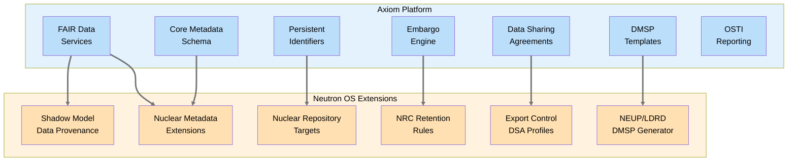

# Product Requirements Document: DOE Research Data Management — Nuclear Facility Extensions

> **Implementation Status: 🔲 Not Started** — This PRD describes planned functionality derived from U.S. DOE requirements for digital research data management, specialized for nuclear facility deployments.

**Product:** Neutron OS DOE Data Management Compliance
**Status:** Draft
**Last Updated:** 2026-04-01
**Parent:** [Executive PRD](prd-executive.md)
**Upstream:** [Axiom Research Data Management PRD](https://github.com/…/axiom/docs/requirements/prd-doe-data-management.md) — Axiom provides jurisdiction-agnostic FAIR infrastructure, DMP framework, and pluggable Jurisdiction Providers. This PRD defines nuclear-specific extensions.
**Addendum:** [U.S. DOE Jurisdiction Provider Mapping](addendum-us-doe-jurisdiction-mapping.md) — concrete provider configurations for U.S. DOE/NRC deployments
**Related:** [Data Platform](prd-data-platform.md), [Compliance Tracking](prd-compliance-tracking.md), [RAG](prd-rag.md), [Model Corral](prd-model-corral.md)
**Source Requirements:**
- [DOE Requirements for Digital Research Data Management](https://www.energy.gov/datamanagement/doe-requirements-and-guidance-digital-research-data-management) (effective Oct 1, 2025)
- [OSTP Desirable Characteristics of Data Repositories for Federally Funded Research](https://repository.si.edu/items/0fe77b19-f2d9-400c-8886-757d4487d907) (April 2022)

---

## Executive Summary

Neutron OS deployments at DOE-funded nuclear facilities must comply with federal requirements for research data management and sharing. The Axiom framework provides the domain-agnostic infrastructure (FAIR data services, persistent identifiers, DMSP lifecycle, federal reporting, embargo management). This PRD defines what Neutron OS layers on top for nuclear facility contexts:

1. **Nuclear-specific metadata schemas** (reactor type, core position, isotope, flux, burnup)
2. **NRC/DOE regulatory retention alignment** (10 CFR 50.71 records, safety basis documents)
3. **Export control integration** with DMSP sharing limitations
4. **Nuclear data repository targeting** (NNDC, NDDC, ESS-DIVE, Materials Data Facility)
5. **Classified and export-controlled data handling** within DMSP frameworks
6. **NEUP/LDRD proposal support** (auto-generated DMSP sections for grant applications)

**Key Principle:** Axiom handles the "what" of federal data management. Neutron OS handles the "how" for nuclear facilities — translating generic FAIR requirements into NRC-aware, export-control-compliant, nuclear-domain-specific implementations.

---

## Relationship to Axiom Federal Data Management

---

## Requirements

### 1. Nuclear Metadata Extensions

Axiom defines a core metadata schema (title, creator, date, license, PID, funding_source). Neutron OS extends it with nuclear-domain fields.

| ID | Requirement | Priority |
|----|-------------|----------|
| NMETA-001 | Datasets from reactor instrumentation MUST include: `reactor_type`, `reactor_id`, `facility_id`, `measurement_type`, `measurement_units`, `sensor_id` | P0 |
| NMETA-002 | Irradiation experiment datasets MUST include: `core_position`, `neutron_flux_range`, `irradiation_duration`, `target_isotope`, `sample_id` | P0 |
| NMETA-003 | Burnup and fuel performance datasets MUST include: `burnup_mwd_t`, `enrichment_percent`, `fuel_type`, `assembly_id` | P1 |
| NMETA-004 | All nuclear metadata fields MUST be registered as a domain extension to the Axiom core schema (META-003 extensibility) | P0 |
| NMETA-005 | Nuclear metadata MUST map to established nuclear data standards where they exist (ENDF, EXFOR, GND formats for cross-section data; OECD/NEA schemas for benchmark data) | P1 |

---

### 2. NRC/DOE Regulatory Retention Alignment

Axiom provides configurable retention tiers. Neutron OS pre-configures them for NRC compliance.

| ID | Requirement | Priority |
|----|-------------|----------|
| RET-001 | Operational records (console logs, surveillance test results) MUST use the 2-year warm tier minimum (NRC inspection window) | P0 |
| RET-002 | Licensing and safety basis documents MUST use the permanent/indefinite archive tier | P0 |
| RET-003 | Training and qualification records MUST use 5-year retention for initial qualification, 3-year for recurring | P0 |
| RET-004 | Records required by 10 CFR 50.71 MUST use 7-year cold tier minimum | P0 |
| RET-005 | The compliance tracking system MUST validate that retention tier assignments meet NRC minimums and flag under-assigned datasets | P1 |
| RET-006 | Retention policies MUST be exportable as part of NRC inspection evidence packages | P1 |

---

### 3. Export Control and Classified Data within DMSP

Nuclear facilities routinely produce data that falls under sharing limitations. This section defines how Neutron OS maps export control tiers to DMSP sharing limitation categories.

| ID | Requirement | Priority |
|----|-------------|----------|
| EC-DMSP-001 | The platform MUST map the three-tier access model (public / restricted / export_controlled) to DOE DMSP sharing limitation categories: unrestricted, IP-protected, security-classified, export-controlled (EAR/ITAR) | P0 |
| EC-DMSP-002 | Datasets classified as `export_controlled` MUST automatically populate the DMSP sharing limitations section with the applicable authority (10 CFR 810, EAR, ITAR) and justification | P0 |
| EC-DMSP-003 | The DMSP compliance dashboard MUST show the ratio of unrestricted-to-restricted datasets and flag if the restricted fraction exceeds a configurable threshold (default: 80%) — indicating potential over-classification | P1 |
| EC-DMSP-004 | For restricted datasets that cannot be publicly shared, the platform MUST document alternative validation methods (e.g., "available to qualified researchers via DSA upon request") per DOE DMSP Pillar 1 | P1 |
| EC-DMSP-005 | The 8-layer export control defense (security PRD) MUST integrate with DSA acceptance gates — restricted data retrieval requires both authorization AND DSA acceptance | P0 |

---

### 4. Nuclear Data Repository Targeting

Axiom provides a repository registry. Neutron OS pre-populates it with nuclear-relevant repositories.

| ID | Requirement | Priority |
|----|-------------|----------|
| NREPO-001 | The repository registry MUST be pre-configured with DOE-approved repositories relevant to nuclear data: NNDC (Brookhaven), ESS-DIVE (LBNL), Materials Data Facility (ANL/UChicago), OSTI DOE Data Explorer | P1 |
| NREPO-002 | For reactor operational data, the platform SHOULD support deposit to OECD/NEA databases where applicable | P2 |
| NREPO-003 | For computational model validation data (benchmarks), the platform SHOULD support deposit to ICSBEP/IRPhEP databases | P2 |
| NREPO-004 | Repository selection guidance MUST be included in the NEUP DMSP template (§5) with rationale for nuclear-specific repository choices | P1 |

---

### 5. NEUP/LDRD DMSP Generation

DOE NEUP and LDRD proposals require a DMSP. Neutron OS should auto-generate compliant drafts.

| ID | Requirement | Priority |
|----|-------------|----------|
| NEUP-001 | The platform MUST provide a `neut dmsp generate` CLI command that produces a DOE-compliant DMSP draft for a given project, pre-populated with facility configuration, repository selections, retention policies, and sharing limitation profiles | P1 |
| NEUP-002 | Generated DMSPs MUST address all five DOE mandatory components with nuclear-specific language | P1 |
| NEUP-003 | The generated DMSP MUST include a resource allocation section referencing the facility's storage and compute infrastructure (from platform metering data if available) | P2 |
| NEUP-004 | The platform MUST support DMSP export in DOE-required formats (PDF, Word) via the publisher extension | P1 |

---

### 6. Model and Digital Twin Data Provenance

Physics models and digital twin runs produce data that falls under DOE data management requirements.

| ID | Requirement | Priority |
|----|-------------|----------|
| MPROV-001 | Every Model Corral entry MUST carry Axiom core metadata (PID, license, funding_source) in addition to nuclear-specific model metadata | P0 |
| MPROV-002 | ROM training provenance MUST be DMSP-compliant: training data sources linked by PID, physics code version recorded, validation dataset identified | P1 |
| MPROV-003 | Digital twin run results MUST be assignable to a DMSP project and included in DMSP compliance reporting | P1 |
| MPROV-004 | Shadow model calibration datasets (measured vs. predicted) MUST be publishable with PIDs when not export-controlled | P1 |
| MPROV-005 | Cross-facility model validation campaigns (federation) MUST generate a shared validation report with PIDs for all contributing datasets | P2 |

---

### 7. Data Quality Standards for Nuclear Measurements

| ID | Requirement | Priority |
|----|-------------|----------|
| DQ-001 | The platform MUST support data quality SLO definitions per measurement type (e.g., temperature ±1°C, rod position ±0.1 inch, power level ±2%) | P1 |
| DQ-002 | Quality SLOs MUST be documented in the dataset's data dictionary (Axiom META-005) | P1 |
| DQ-003 | Automated data quality tests (dbt) MUST flag measurements outside SLO bounds and record violations in the audit trail | P1 |
| DQ-004 | Quality metrics MUST be included in DMSP compliance reports as evidence of data integrity | P2 |

---

## Assumptions Requiring Validation

1. **NRC Position on Digital Records:** NRC acceptance of digital-only records (replacing paper) is assumed for operational logs. Some facilities may still require paper originals — platform should support both workflows.
2. **Export Control Classification Automation:** Automated classification (keyword + SLM) is a best-effort aid. Final classification authority remains with the facility's Export Control Officer (ECO). The platform must not claim automated classification is authoritative.
3. **NEUP DMSP Template Stability:** DOE NEUP DMSP requirements are assumed stable post-October 2025. Template updates may be needed if DOE issues revised guidance.
4. **Nuclear Repository API Availability:** NNDC and ICSBEP deposit APIs are limited or manual. Initial integration may be metadata-only with manual artifact upload.
5. **Cross-Facility Data Sharing:** Federation-based model validation campaigns assume participating facilities have compatible export control classifications and bilateral DSAs in place.

---

## Conflicting Assumptions and Required Resolutions

The following assumptions in existing Neutron OS PRDs conflict with or must be revisited in light of DOE DMSP requirements:

### Resolution Required

| # | Existing Assumption | Conflict | Resolution Needed |
|---|---------------------|----------|-------------------|
| 1 | **Data platform has no *dataset* publication lifecycle** (prd-data-platform lacks embargo/DOI workflow for structured research data) | DOE requires timely public access to federally funded research data | The PRT agent already provides document publishing with a pluggable StorageProvider pattern, draft/published state tracking, and access_tier gating. Extend this infrastructure with: (a) a dataset-level publication lifecycle (draft → embargoed → published → archived → tombstone), (b) repository deposit providers (NNDC, ESS-DIVE, OSTI) as new StorageProvider implementations, (c) PID minting hook at the `published` transition. This builds on existing PRT architecture rather than creating a parallel system. |
| 2 | **No persistent identifiers anywhere in the stack** (all PRDs) | DOE requires PIDs (DOIs) for all shared datasets | Adopt Axiom PID infrastructure. PID subsystem uses Factory/Provider pattern with providers for DataCite DOI, ARK, and Handle — all three are first-class. Deployments configure which to activate. |
| 3 | **RAG community corpus treated as internal knowledge sharing** (prd-rag) | If community corpus content derives from funded research, it may require DMSP reporting | Define policy: community corpus publications that contain funded research outputs trigger DMSP reporting. Non-research operational knowledge is exempt. |
| 4 | **Model Corral has no licensing metadata** (prd-model-corral) | DOE requires clear reuse licenses on all shared outputs | Add license field to model.yaml manifest. Default: facility-specific (not shared) unless explicitly licensed. |
| 5 | **Compliance tracking only covers NRC regulatory domains** (prd-compliance-tracking) | DOE DMSP compliance is a distinct domain with different rules and timelines | Add DMSP as a new compliance domain alongside NRC operations, training, and safety. |
| 6 | **No metadata standards beyond internal schemas** (spec-data-architecture) | DOE requires metadata conforming to community standards (DataCite, Dublin Core) | Adopt Axiom core metadata schema with nuclear extensions. Existing Iceberg schemas continue for operational data; DataCite metadata layer added for published datasets. |

### Assumptions Validated (No Conflict)

- **7-year retention tiers** — exceed DOE minimum; no change needed
- **Immutable audit trails (HMAC-chained)** — satisfy DOE provenance requirements
- **Three-tier access model (public/restricted/export_controlled)** — maps directly to DOE sharing limitation categories
- **Offline-first architecture** — accommodates classified facility deployments where external API access is intermittent
- **OpenFGA authorization** — satisfies DOE access control requirements
- **Export control 8-layer defense** — exceeds DOE security expectations for controlled data

---

## Phasing

### Phase 1 — Foundation (aligns with Neutron OS v0.8.x)
- Nuclear metadata extension registration on Axiom core schema
- NRC retention tier pre-configuration
- Export control → DMSP sharing limitation mapping
- License field added to Model Corral manifest
- DMSP compliance domain added to compliance tracking

### Phase 2 — Reporting & Publication (aligns with Neutron OS v0.9.x)
- NEUP DMSP generator (`neut dmsp generate`)
- Nuclear repository registry pre-population
- Model and digital twin DMSP provenance
- Data quality SLO framework

### Phase 3 — Federation & External Deposit (aligns with Neutron OS v1.0.x)
- Automated deposit to nuclear repositories (NNDC, ESS-DIVE, MDF)
- Cross-facility model validation report generation
- DMSP compliance dashboard with nuclear-specific metrics
