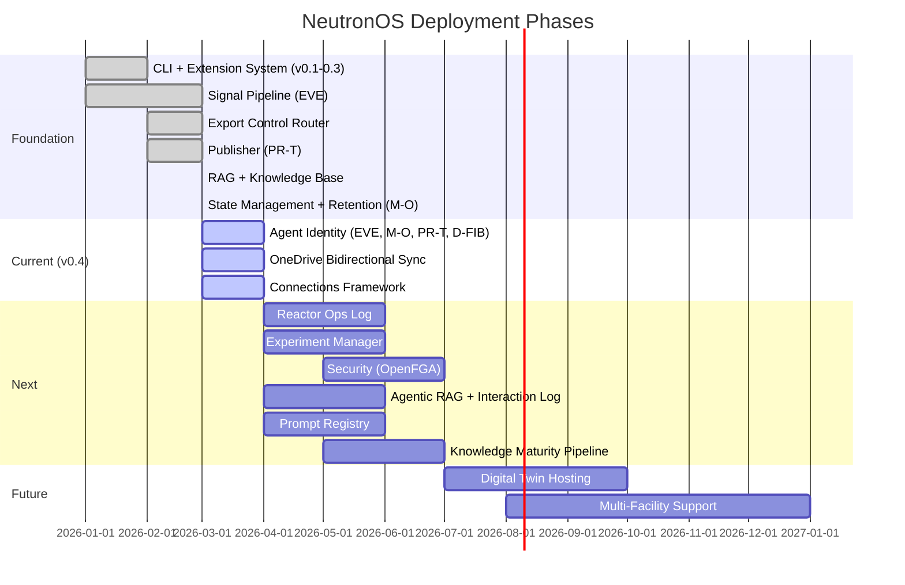

# Neutron OS — Executive Product Requirements

**Nuclear Energy Unified Technology for Research, Operations & Networks**

| Property | Value |
|----------|-------|
| Version | 2.0 |
| Last Updated | 2026-03-20 |
| Status | Active Development (v0.4.0) |
| Product Owner | Ben Booth |

---

## The Story So Far

For decades, nuclear facilities have run on paper logs, spreadsheets, phone calls, and siloed software systems. Reactor operators track 30-minute surveillance checks on clipboards. Researchers schedule beam time via email chains. Meeting decisions evaporate into forgotten transcripts. Experiment data lives on individual hard drives. Compliance evidence is assembled by hand, days before an NRC inspection.

This worked when nuclear energy was a mature, slow-moving industry. It doesn't work now.

Nuclear energy is entering its most consequential decade — advanced reactors, medical isotope production at scale, AI-augmented operations, digital twins, and a global push to triple nuclear capacity by 2050. The facilities that thrive will be the ones that digitize intelligently, connecting their data, their people, and their decision-making into a coherent system.

NeutronOS is that system.

Built at the University of Texas at Austin's Nuclear Engineering Teaching Laboratory (NETL), NeutronOS draws on six decades of reactor operations experience and the latest advances in AI, data engineering, and software architecture. It stands on the shoulders of the researchers, operators, and engineers who built the nuclear infrastructure we have today — and extends their work into the digital age.

---

## What NeutronOS Does

NeutronOS is a **modular digital platform for nuclear facilities**. It replaces fragmented workflows with integrated digital tools, organized as independently deployable modules:

### Core Platform

| Module | Purpose | Details |
|--------|---------|---------|
| [Data Platform](prd-data-platform.md) | Lakehouse architecture, time-series ingestion, analytics | Bronze → Silver → Gold medallion pattern |
| [Scheduling System](prd-scheduling-system.md) | Cross-cutting time management, resource allocation | Unified scheduling across all modules |
| [Compliance Tracking](prd-compliance-tracking.md) | Regulatory monitoring, evidence generation | 30-minute check enforcement, NRC audit support |

### Operations

| Module | Purpose | Details |
|--------|---------|---------|
| [Reactor Ops Log](prd-reactor-ops-log.md) | Console checks, shift handoffs, maintenance tracking | Tamper-proof audit trail, digital shift summaries |
| [Experiment Manager](prd-experiment-manager.md) | Sample lifecycle, metadata, chain of custody | ROC authorization, results correlation |
| [Analytics Dashboards](prd-analytics-dashboards.md) | Superset visualizations, KPIs, trending | Reactor utilization, fuel burnup, data quality |
| [Medical Isotope Production](prd-medical-isotope.md) | Customer orders, production batching, QA/QC, shipping | End-to-end isotope lifecycle |

### Computational

| Module | Purpose | Details |
|--------|---------|---------|
| [Model Corral](prd-model-corral.md) | Physics model registry, ROM versioning, validation datasets | [Tech spec](../tech-specs/spec-model-corral.md) |
| [Digital Twin Hosting](prd-digital-twin-hosting.md) | ROM execution, shadow runs, prediction validation | [Tech spec](../tech-specs/spec-digital-twin-architecture.md) |

### Intelligence Platform

| Capability | Agent | Details |
|------------|-------|---------|
| [Signal Processing](../tech-specs/spec-agent-architecture.md) | **EVE** (Event Evaluator) | Ingests voice memos, meetings, code, chat → structured intelligence |
| [Document Lifecycle](../tech-specs/spec-publisher.md) | **PR-T** (Purty) | .md → .docx → OneDrive/Box with bidirectional sync |
| [Resource Stewardship](prd-agent-state-management.md) | **M-O** (Micro-Obliterator) | Data retention, system hygiene, scratch management |
| [Diagnostics](../tech-specs/spec-executive.md) | **D-FIB** (Defib) | System health, security scans, configuration audit |
| [Export Control Routing](../tech-specs/spec-model-routing.md) | **Neut** (Orchestrator) | Two-tier LLM routing, sensitivity classification |
| [Knowledge Infrastructure](prd-rag.md) | RAG | Domain packs · three-store (public/restricted/EC) · knowledge maturity pipeline |
| [Prompt Registry](../tech-specs/spec-prompt-registry.md) | Platform | Versioned prompt templates, caching hints, audit trail |
| [External Connections](../tech-specs/spec-connections.md) | Connections | Unified auth for OneDrive, Box, GitHub, GitLab, Teams |

### Security & Access Control

| Capability | Details |
|------------|---------|
| [Export Control](../tech-specs/spec-model-routing.md) | Keyword + SLM classification, VPN-gated private endpoints |
| [Security & Access Control](prd-security.md) | OpenFGA (ReBAC/RBAC/ABAC), prompt injection defense |
| [TACC Integration](../tech-specs/spec-model-routing.md#9-deployment-options-for-the-private-endpoint) | Data locality for export-controlled simulation codes |

---

## How It's Built

Everything in NeutronOS is an **extension**. Web apps, agents, tools, utilities — all extensions, discovered via TOML manifests, deployed independently. The core provides infrastructure; domain functionality ships as modules.

| Principle | Implementation |
|-----------|---------------|
| **Everything is an extension** | 3-tier discovery: project → user → builtin |
| **Reactor-agnostic core** | Reactor-specific features via external extension repos |
| **Offline-first** | Queue locally, sync on restore — nuclear facilities lose network |
| **Human-in-the-loop** | Agents inform, humans approve — especially for safety-adjacent actions |
| **Model-agnostic** | Cloud LLMs for general use, private endpoints for export-controlled data |

For technical architecture, see the [Executive Tech Spec](../tech-specs/spec-executive.md).

---

## The Agent Team

NeutronOS agents are named after robots from Pixar's WALL-E — a film about a world made uninhabitable by environmental neglect. The irony is intentional: NeutronOS helps build the cleanest large-scale energy source available, exactly the technology that could prevent the future WALL-E depicts.

| Agent | Character | Role | CLI |
|-------|-----------|------|-----|
| **Neut** | The Axiom | Orchestrator — routes commands, delegates, maintains context | `neut chat` |
| **EVE** | Probe droid | Event Evaluator — signal detection and intelligence extraction | `neut signal` |
| **M-O** | Cleaning robot | Micro-Obliterator — resource stewardship and system hygiene | `neut mo` |
| **PR-T** | Beauty bot | Purty — document lifecycle, .md → polished .docx → publish | `neut pub` |
| **D-FIB** | Medical bot | Defib — diagnostics, security health, configuration audit | `neut doctor` |

---

## Where We Are

**1,600+ automated tests. 46 documents. 17 builtin extensions. 5 agents.** All open source.

---

## Document Family

This executive PRD is the entry point. Each capability has its own detailed PRD and technical specification:

### Product Requirements

| PRD | Status |
|-----|--------|
| [Agent State Management](prd-agent-state-management.md) | ✅ Shipped |
| [Agents Platform](prd-agents.md) | 🟡 Partial |
| [Analytics Dashboards](prd-analytics-dashboards.md) | 🔲 Planned |
| [Compliance Tracking](prd-compliance-tracking.md) | 🔲 Planned |
| [Connections](prd-connections.md) | 📋 Spec'd |
| [Data Platform](prd-data-platform.md) | 🔲 Planned |
| [Experiment Manager](prd-experiment-manager.md) | 🔲 Planned |
| [Intelligence Amplification](prd-intelligence-amplification.md) | 📋 Designed |
| [Media Library](prd-media-library.md) | 🔲 Planned |
| [Medical Isotope Production](prd-medical-isotope.md) | 🔲 Planned |
| [Neut CLI](prd-neut-cli.md) | 🟡 Partial |
| [Publisher](prd-publisher.md) | ✅ Shipped |
| [Reactor Ops Log](prd-reactor-ops-log.md) | 🔲 Planned |
| [Scheduling System](prd-scheduling-system.md) | 🔲 Planned |
| [Security & Access Control](prd-security.md) | 📋 Spec'd |

### Technical Specifications

| Spec | Focus |
|------|-------|
| [Executive Tech Spec](../tech-specs/spec-executive.md) | Architecture overview, implementation status |
| [Agent Architecture](../tech-specs/spec-agent-architecture.md) | Signal pipeline, extractors, correlator, synthesizer |
| [Model Routing](../tech-specs/spec-model-routing.md) | Export control classification, two-tier LLM routing |
| [RAG Architecture](../tech-specs/spec-rag-architecture.md) | Three-tier corpus, EC-compliant embeddings |
| [Connections](../tech-specs/spec-connections.md) | Unified auth, credential resolution, endpoint watcher |
| [State Management](../tech-specs/spec-agent-state-management.md) | Hybrid file/PostgreSQL backend, retention policies |
| [Publisher](../tech-specs/spec-publisher.md) | Document lifecycle, format-endpoint compatibility |
| [Data Architecture](../tech-specs/spec-data-architecture.md) | Medallion pattern, Iceberg, schemas |
| [Digital Twin](../tech-specs/spec-digital-twin-architecture.md) | Surrogate models, WASM runtime |
| [Glossary System](../tech-specs/spec-glossary-system.md) | glossary.toml format, roll-up, `neut glossary` CLI |
| [Prompt Registry](../tech-specs/spec-prompt-registry.md) | Versioned templates, composition model, caching |
| [RAG Knowledge Maturity](../tech-specs/spec-rag-knowledge-maturity.md) | Layers 0-5, interaction log, crystallization, M-O sweep |
| [Observability](../tech-specs/spec-observability.md) | Metrics taxonomy, alerting, distributed traces |

### Architecture Decisions

| ADR | Decision |
|-----|----------|
| [ADR-001](adr-001-polyglot-monorepo-bazel.md) | Monorepo (Python, not Bazel) |
| [ADR-002](adr-002-hyperledger-fabric-multi-facility.md) | Hyperledger for tamper-proof audit |
| [ADR-003](adr-003-lakehouse-iceberg-duckdb-superset.md) | Iceberg + DuckDB lakehouse |
| [ADR-004](adr-004-infrastructure-terraform-k8s-helm.md) | Terraform + K8S + Helm |
| [ADR-006](adr-006-mcp-agentic-access.md) | MCP + CLI as agentic interfaces |
| [ADR-010](adr-010-cli-architecture.md) | CLI as agentic terminal |

### Research

| Document | Topic |
|----------|-------|
| [State Backend Whitepaper](../research/whitepaper-state-backend-comparison.md) | Flat file vs PostgreSQL: benchmarks, token efficiency |
| [Platform Comparison](../research/platform-comparison-databricks.md) | NeutronOS vs Databricks |
| [DeepLynx Assessment](../research/deeplynx-assessment.md) | INL DeepLynx peer-platform analysis |

---

## Research Foundations

NeutronOS is developed at UT Austin's Department of Mechanical Engineering, Nuclear & Radiation Engineering Program, with research alignment to active NEUP proposals:

| Research Area | NeutronOS Alignment |
|---------------|--------------------|
| Operator LLM Safety | Export control routing, prompt injection defense |
| Cyber-Nuclear Security | Security architecture, EC leakage detection |
| Digital Twin Framework | Model Corral, Digital Twin Hosting, surrogate validation |
| AI Cross-Section Tuning | RAG-indexed nuclear data, model-agnostic gateway |

---

*For technical architecture, see the [Executive Tech Spec](../tech-specs/spec-executive.md). For terminology, see the [Glossary](../glossary.md) (human-readable) or run `neut glossary <term>` (machine-queryable, sourced from `docs/glossary-axiom.toml` + `docs/glossary-neutronos.toml`). For the CLI, run `neut --help`.*
