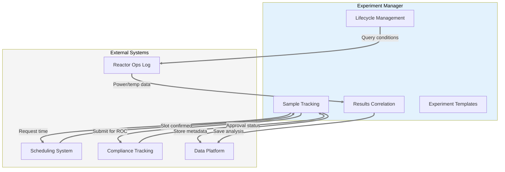
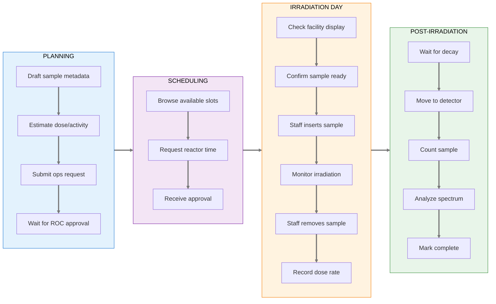
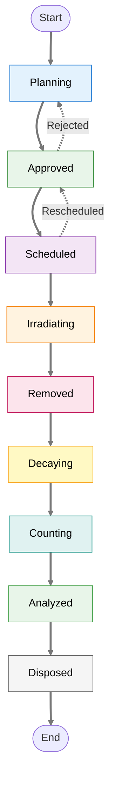
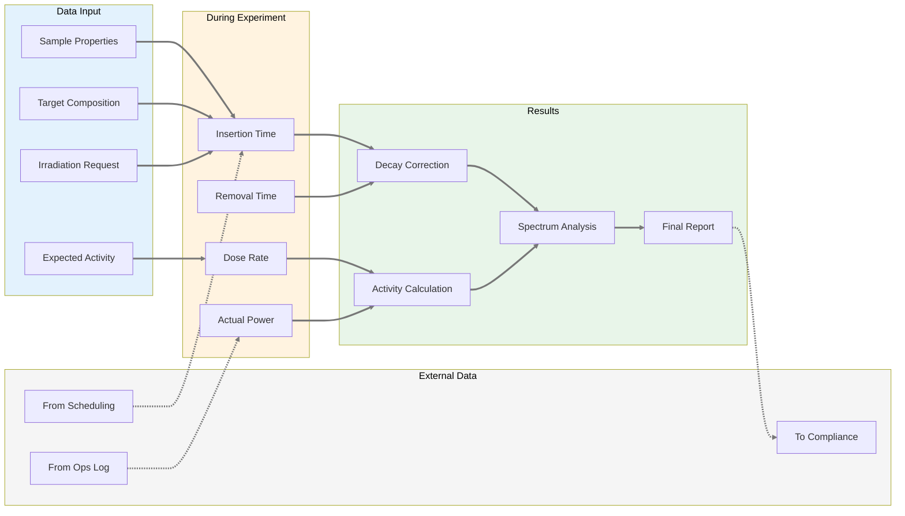
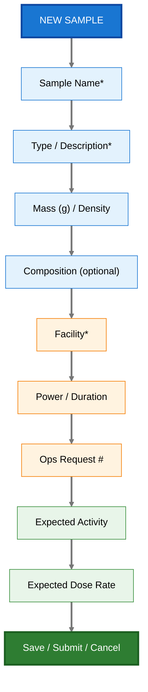
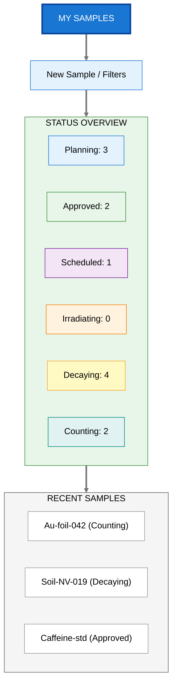

# Product Requirements Document: Experiment Manager

> **Implementation Status: 🔲 Not Started** — This PRD describes planned functionality. Implementation has not started.

**Module:** Experiment & Sample Tracking + Scheduling
**Status:** Draft
**Last Updated:** January 22, 2026
**Stakeholder Input:** Khiloni Shah, Nick Luciano (Jan 2026)  
**Related Module:** [Medical Isotope Production](prd-medical-isotope.md) (shared backend, separate workflow)  
**Parent:** [Executive PRD](prd-executive.md)

---

## Executive Summary

The Experiment Manager provides digital tracking of samples from preparation through irradiation, decay, counting, and analysis. It **focuses exclusively on experiment lifecycle management** — sample metadata, state tracking, chain of custody, and result correlation. The module integrates with the [Scheduling System](prd-scheduling-system.md) for reactor time allocation and the [Compliance Tracking System](prd-compliance-tracking.md) for regulatory requirements, but does not own these cross-cutting concerns.

**Design Philosophy:**
- **Minimize data entry** through smart defaults, inference from past experiments, and AI assistance
- **Focus on experiment data** — sample properties, irradiation parameters, results, chain of custody
- **Delegate cross-cutting concerns** — scheduling, compliance, and notifications handled by dedicated systems
- **Multi-facility configurable** — core system works for any research reactor; facility-specific dropdowns are configuration

---

## System Boundaries

### What Experiment Manager OWNS

| Responsibility | Description |
|---------------|-------------|
| **Sample Metadata** | Physical properties, composition, mass, geometry |
| **Experiment Lifecycle** | State transitions from planning through disposal |
| **Chain of Custody** | Who handled what, when, where |
| **Results Correlation** | Link irradiation conditions to analysis outcomes |
| **Experiment Templates** | Reusable configurations for common experiments |
| **ROC Authorization Tracking** | Which experiments are covered by which authorizations |

### What Experiment Manager USES (Not Owns)

| External System | Integration | Purpose |
|-----------------|-------------|----------|
| **[Scheduling System](prd-scheduling-system.md)** | Request time slots, receive confirmations | Reactor time, facility bookings |
| **[Compliance Tracking](prd-compliance-tracking.md)** | Provide experiment records, receive alerts | ROC approvals, retention requirements |
| **[Reactor Ops Log](prd-reactor-ops-log.md)** | Query reactor conditions during irradiation | Power levels, console checks |
| **[Data Platform](prd-data-platform.md)** | Store sample data, query time-series | Bronze/Silver/Gold layers |
| **[Analytics Dashboards](prd-analytics-dashboards.md)** | Provide metrics for visualization | Utilization, success rates |

### Integration Architecture



---

## User Journey Map

### Researcher: Planning to Analysis



### Sample State Machine



### Experiment Data Flow



---

## Stakeholder Insights

### Current State (from Khiloni Shah)

> "It's a combination of things. Some information – sample type, sample mass, maximum reactor power you might need, irradiation time, facility, in-core/ex-core, etc. are recorded in reactor operations requests. However, depending on the irradiation you're doing, typically you include a variety of things you might do with that ops request so that it can follow cover more than one type of experiment."

> "If you're using an ops request for multiple experiments, you're likely keeping track of the experiment details on your own – this can vary widely from person to person – spreadsheet, handwritten, etc."

> "During irradiations, each facility location has a binder that allows you to write in some information – date, time, researcher doing experiment, reactor power level, facility, dose rate."

> "For post-processing data analysis, this is also researcher dependent and experiment dependent... The way the data is analyzed depends on the researcher, but the most common is probably some type of spreadsheet."

### Key Insight from Jim (Reactor Operations)

> "We have a schedule of Authorized Experiments. These experiments are authorized by the ROC (Reactor Oversight Committee) after review through NETL Staff (Reactor Manager/HP/Director - Then ROC chair). Routine Experiments are performed as they are covered under an Authorized Experiment."

> "We attempted this a while back using MS Access. Again, I believe it would be useful to have a modeler/designer come to the NETL and investigate and review our current system. Then begin."

### Experiment Authorization Workflow (from Jim)

**Two Authorization Paths:**

| Path | Approval Chain | Typical Use Case |
|------|----------------|------------------|
| **Authorized Experiment** | Researcher → RM → HP → Director → ROC Chair → ROC | New experiment type requiring full safety review |
| **Routine Experiment** | Researcher → RM (or SSRO) | Experiment covered under existing Authorized Experiment |

**Request to Operate (RTO) Process:**
1. Researcher submits RTO form with experiment details
2. For Routine Experiments: RM/SSRO reviews against Authorized Experiment list
3. For new experiments: Full ROC review (monthly meeting cycle)
4. System tracks which Authorized Experiment covers each Routine Experiment
5. RTO number (4-digit) links scheduling and ops log entries

**Design Implication:** The system must maintain a registry of Authorized Experiments and validate that Routine Experiments reference a valid authorization.

---

## User Stories

### Primary Users

| User | Need |
|------|------|
| **Researcher/Experimenter** | Track my samples through the full lifecycle without switching between paper and spreadsheets |
| **Reactor Staff** | Know what samples are being irradiated, expected dose rates, and safety parameters |
| **Scheduler/Reactor Manager** | See all pending requests, approve/reject, manage facility conflicts |
| **Facility Worker (Entering Building)** | Glance at a display showing today's schedule as I walk in |
| **Principal Investigator** | See status of all experiments under my projects, usage statistics |
| **Compliance Officer** | Generate audit trail of experiments for regulatory inspection |

### User Stories: Sample Tracking

1. **As a researcher**, I want to log sample metadata before irradiation so that I don't have to re-enter information for each step.

2. **As a researcher**, I want pre-populated dropdowns for facilities so that I use consistent naming.

3. **As a reactor operator**, I want to see expected sample activities/dose rates so that I can prepare appropriate handling procedures.

4. **As a PI**, I want to track beam time usage across my students/projects so that I can report to sponsors.

5. **As a compliance officer**, I want immutable records of what was irradiated, when, and by whom.

6. **As a compliance officer**, I want to generate NRC evidence packages covering 2 years of experiment records with consistent formatting.

### User Stories: Integration with Scheduling

6. **As a researcher**, I want to request reactor time directly from my sample entry so that my experiment data is linked to the scheduled slot.

7. **As a researcher**, I want the system to show me my approved time slots from the Scheduling System when I'm ready to irradiate.

8. **As a researcher**, I want my experiment to automatically transition to "Scheduled" state when the Scheduling System confirms my slot.

*Note: Full scheduling capabilities (viewing calendars, managing conflicts, facility displays) are handled by the [Scheduling System](prd-scheduling-system.md).*

### User Stories: Integration with Compliance

9. **As a researcher**, I want the system to verify my experiment has valid ROC authorization before allowing irradiation.

10. **As a compliance officer**, I want to query all experiments performed under a specific Authorized Experiment number.

11. **As an auditor**, I want to see the complete chain of custody for any sample including all state transitions and who performed them.

*Note: Full compliance tracking (ROC approvals, evidence packages, audit reports) is handled by the [Compliance Tracking System](prd-compliance-tracking.md).*

---

## Sample Metadata Schema

Based on Nick Luciano's initial list, refined with Khiloni's feedback:

### Required Fields

| Field | Type | Description | Notes |
|-------|------|-------------|-------|
| `sample_id` | UUID | System-assigned unique identifier | Auto-generated |
| `sample_name` | string | User-provided name (must be unique per project) | Required |
| `sample_description` | string | Physical description | Khiloni: "solid, liquid, gas" - composition may be unknown |
| `mass_g` | decimal | Sample mass in grams | Required for dose calculations |
| `irradiation_facility` | enum | Facility used | Pre-populated dropdown |
| `irradiation_datetime_start` | timestamp | When sample was inserted | |
| `irradiation_datetime_end` | timestamp | When sample was removed | |
| `reactor_power_kw` | decimal | Power level during irradiation | Correlated from reactor data |

### Optional Fields

| Field | Type | Description | Notes |
|-------|------|-------------|-------|
| `chemical_composition` | string | Molecular formula (e.g., C8H10N4O2) | Khiloni: "might not always be available - some of the work we do is unknown NAA samples" |
| `isotopic_composition` | json | Isotope breakdown | For enriched samples |
| `density_g_cm3` | decimal | Sample density | |
| `decay_time_seconds` | integer | Time between removal and counting | Khiloni: "Most users subtract irradiation end date from count start date... I'm not sure I understand what you mean by total integrated time" |
| `count_datetime` | timestamp | When counting occurred | |
| `count_live_time_seconds` | integer | Detector live time | |
| `total_counts` | integer | Integrated counts | |
| `total_activity_bq` | decimal | Total measured activity | |
| `activity_by_isotope` | json | Activity breakdown by isotope | |
| `dose_rate_at_removal_mrem_hr` | decimal | Dose rate from yellow frisker | |
| `spectra_file_id` | UUID | Reference to raw spectrum file | |

### Facility Dropdown Values

From Khiloni's comprehensive list:

**Ex-core:**
- `BP1` - Beam Port 1
- `BP2` - Beam Port 2
- `BP3` - Beam Port 3
- `BP4` - Beam Port 4
- `BP5` - Beam Port 5

**In-core:**
- `TPNT` - Thermal Pneumatic Facility
- `EPNT` - Epithermal Pneumatic Facility
- `RSR` - Rotary Specimen Rack
- `CT` - Central Thimble
- `F3EL` - Fast 3-Element Facility
- `3EL_Cd` - Cd-lined 3-Element Facility
- `3EL_Pb` - Pb-lined 3-Element Facility

> **Note:** Khiloni advises: "you'll probably want someone on the reactor staff to look this over. They'll know better than me."

---

## Workflow Stages

Based on Khiloni's description of typical workflow:

```mermaid
flowchart LR
    subgraph PRE["📄 PRE-IRRADIATION"]
        direction LR
        PLAN["PLANNING Draft sample metadata"]
        APPR["✅ APPROVED Ops request approved"]
        SCHED["📅 SCHEDULED Calendar confirmed"]
        PLAN --> APPR --> SCHED
    end
    
    subgraph ACTIVE["⢠️ ACTIVE"]
        IRR["⚛️ IRRADIATING In reactor"]
        REM["📤 REMOVED Out of rx Dose logged"]
        IRR --> REM
    end
    
    subgraph POST["POST-IRRADIATION"]
        direction LR
        DEC["⏱️ DECAYING Waiting for activity ↓"]
        COUNT["COUNTING On detector"]
        ANAL["✔️ ANALYZED Data processed"]
        DEC --> COUNT --> ANAL
    end
    
    DISP["🗑️ DISPOSED Or archived"]
    
    SCHED --> IRR
    REM --> DEC
    ANAL --> DISP
    
    style PRE fill:#e3f2fd,stroke:#1976d2,color:#000000
    style ACTIVE fill:#fff3e0,stroke:#f57c00,color:#000000
    style POST fill:#e8f5e9,stroke:#388e3c,color:#000000
    style DISP fill:#f5f5f5,stroke:#616161,color:#000000
    linkStyle default stroke:#777777,stroke-width:3px
```



### Stage Transitions

| From | To | Trigger | Data Captured |
|------|-----|---------|---------------|
| Planning | Approved | Ops request number assigned | 4-digit ops request ID |
| Approved | Scheduled | Calendar invite accepted | Scheduled datetime |
| Scheduled | Irradiating | Sample inserted | Actual start time |
| Irradiating | Removed | Sample removed | End time, dose rate |
| Removed | Decaying | Automatic (time-based) | Decay time tracking |
| Decaying | Counting | Sample placed on detector | Count start time |
| Counting | Analyzed | Spectrum saved | Count data, file reference |
| Analyzed | Disposed | Staff disposal action | Disposal date, method |

---

## Integration Points

### Calendar & Scheduling (Core Feature)

From Khiloni:
> "The way we schedule reactor time right now is send a calendar request to NETL-Reactor with our name, desired power level, estimated irradiation time, facility, and any details that might be important to the staff."

> "I don't think it actually matters to any of us experimenters what the schedule says – we typically write down what happens on the day of for our own purposes."

**Design Decision:** Calendar shows *intent*; Experiment Manager tracks *what actually happened*. Both are important. The system maintains:

1. **Scheduled Time** — When the experiment was planned to occur
2. **Actual Time** — When it actually occurred (may differ due to delays, reactor trips, etc.)

This enables analysis like: "How often do experiments run on schedule?" and "What's our average delay?"

**Calendar Integration Options:**

| Integration | Benefit | Implementation |
|-------------|---------|----------------|
| **Native scheduling UI** | Full control, unified UX | Primary approach |
| **Google Calendar sync** | Researchers see in their calendar | Optional outbound sync |
| **Outlook/Exchange sync** | Same | Optional outbound sync |
| **iCal feed** | Universal calendar subscription | Read-only export |

**Conflict Detection:**
- Warn if same facility requested at overlapping times
- Warn if total requested power exceeds license limit
- Suggest alternative times if conflicts exist

### Reactor Time-Series

Automatically correlate sample irradiation windows with:
- Actual power levels during irradiation
- Control rod positions
- Temperature readings

This enables post-hoc analysis: "What were the actual reactor conditions during my irradiation?"

### Operations Log

Cross-reference Ops Log entries with experiment IDs for complete audit trail.

---

## UI Mockup Concepts

### Sample Entry Form



### Sample Status Dashboard



### Schedule Views

#### Week View (Reactor Manager)

| Facility | Mon 20 | Tue 21 | Wed 22 | Thu 23 | Fri 24 |
|----------|--------|--------|--------|--------|--------|
| **TPNT** | Au-foil (████) | NAA-042 (██) | — | NAA-051 (████) | NAA-052 (██) |
| **CT** | — | Booth-DT (████) | Booth-DT (████) | — | — |
| **RSR** | Long-irrad samples (░░░░░░░) ongoing |  |  |  |  |
| **BP1** | — | — | Imaging (████) | Imaging (████) | — |

**Pending Requests (3):** Shah, K. (EPNT, Jan 27 10:00-12:00) | Chen, M. (CT, Jan 28 08:00-16:00) | Lee, J. (BP3, Jan 29 14:00-17:00)

---

#### Facility Entrance Display (Large Screen, Read-Only)

| Time | Activity |
|------|----------|
| **NOW (10:15)** | NAA-042 (TPNT) — K. Shah — Est. complete 11:30 |
| **NEXT (11:30)** | Booth Digital Twin Validation (CT) — B. Booth |
| **LATER (14:00)** | Sample removal from RSR — Long-irradiation batch |
| **LATER (15:30)** | Medical Isotope pickup — MedPhys courier |

**Reactor Status:** Operating at 950 kW

---

#### Console View (Operator, Next 4 Hours)

| Time | Status | Experiment | Details |
|------|--------|------------|---------|
| 10:15 | IN PROGRESS | NAA-042 (TPNT) | K. Shah — Gold foil activation. Est. removal: 11:30. Expect 120 mrem/hr |
| 11:30 | SCHEDULED | DT-validation (CT) | B. Booth — Al calibration sample. Duration: 4 hr. Expect 50 mrem/hr |
| 14:00 | SCHEDULED | RSR removal | Long-irrad batch. Staff action — Multiple samples |

---

## MVP Scope (Phase 1)

### In Scope
- Sample metadata entry with pre-populated dropdowns
- Basic status tracking (manual state transitions)
- **Request scheduling** — submit time requests, view pending/approved
- **Schedule visualization** — day/week/month views
- **Facility entrance display** — today's schedule on lobby screen
- Correlation with reactor time-series (read-only)
- Export to CSV/Excel for researchers' existing workflows

### Phase 2
- External calendar sync (Google, Outlook, iCal)
- Recurring experiment scheduling
- Automated dose calculations (with model integration)
- AI-assisted sample entry (see Forward-Thinking Design)

### Out of Scope (For Now)
- Spectrum analysis tools (use existing software)
- Web calculators for all detector types (too much scope; Khiloni's concern valid)

---

## Data Freshness & Real-Time Architecture

> **Design Decision:** Streaming-first architecture. Real-time is the default; batch for aggregations and fallback.
>
> See [ADR 007](adr-007-streaming-first-architecture.md)

### Experiment Manager Latency Targets

| Feature | Target Latency | Implementation | Priority |
|---------|---------------|----------------|----------|
| **Facility entrance display** | <2s | Real-time event push | 🔴 High |
| **Sample status updates** | <1s | Live status via WebSocket | 🔴 High |
| **Position availability** | <5s | Event-driven "Position now available" | 🟡 Medium |
| **Schedule changes** | <2s | Instant calendar update via WebSocket | 🟡 Medium |
| **Approval notifications** | <30s | In-app toast + email | 🟡 Medium |
| **Historical reporting** | Minutes | Batch job (Dagster) | 🟢 Low |

### UI Freshness Pattern

Live is the default. Warnings appear only when streaming is degraded:

| Status | Display |
|--------|---------|
| **Live** | Green indicator — Updated < 1 min ago [Full Screen] |
| **Current** | NAA-042 — Gold foil activation (K. Shah). Est. removal: 11:30 |
| **Next Up** | DT-validation — Al calibration (B. Booth) @ 11:30 |

**Freshness Indicators:**
- 🟢 Green (< 1 min): Live data
- 🟡 Yellow (1-15 min): Near-real-time
- 🟠 Orange (15 min - 1 hr): May be stale
- 🔴 Red (> 1 hr): Likely stale — manual refresh recommended

### Streaming-Enabled User Stories (Phase 2+)

15. **As a researcher**, I want to receive an in-app notification when my time request is approved, so I can immediately confirm my availability.

16. **As a facility manager**, I want the entrance display to update in real-time when experiments start/complete, so staff always see accurate status.

17. **As a researcher**, I want to see "Position now available" push notifications when a slot opens up, so I can quickly claim cancelled time.

18. **As an operator**, I want to see live sample status on my console, so I know when researchers expect their samples without checking a separate system.

---

## Forward-Thinking Design

### The Problem with Backwards-Looking Requirements

Stakeholder feedback reflects *current* workflows constrained by *current* tools. Khiloni tracks experiments in spreadsheets because that's what's available. But if we only digitize existing workflows, we miss transformative opportunities.

**Question we must ask:** "If these capabilities existed today, what would users actually want?"

### Minimizing Data Entry

**Principle:** Every field the user has to type is friction. Reduce friction through:

| Strategy | Implementation | Example |
|----------|----------------|---------|
| **Smart defaults** | Pre-fill based on context | If user selects "NAA", default facility to TPNT |
| **Inference from history** | Learn from past experiments | "Last 5 Au-foil samples used 0.125g mass" |
| **One-click templates** | Save experiment configurations | "Standard NAA" pre-fills 8 fields |
| **Batch operations** | Apply same metadata to multiple samples | "Create 10 soil samples with same parameters" |
| **Voice entry** | Dictate notes hands-free | "Add note: dose rate higher than expected" |

### Overridable Assumptions

Every smart default should be easily overridden:

| Field | Input | Suggestion |
|-------|-------|-----------|
| Facility* | [Central Thimble (CT) selected] | Based on "gold foil" + "30 min irradiation", TPNT is typically used. [Use TPNT instead] |

User can accept suggestion with one click, or ignore and keep their selection.

### AI/LLM Integration (Phase 3+)

**Vision:** A small, nuclear-domain-tuned LLM integrated into Neutron OS that:

1. **Understands nuclear terminology** — "Put my Au-foil in the rabbit" → recognizes "rabbit" = pneumatic transfer system

2. **Has facility context via RAG** — Continuously updated with:
   - This facility's SOPs and safety procedures
   - Historical experiments at this facility
   - ROC-authorized experiment types
   - Current core configuration and flux maps

3. **Assists with entry** — User types natural language, system extracts structured fields:
   ```
   User: "I need to irradiate 0.1g of gold foil for NAA, 30 minutes 
          at 950 kW, probably next Tuesday"
   
   System extracts:
   - Sample: gold foil
   - Mass: 0.1g
   - Irradiation time: 30 min
   - Power: 950 kW
   - Suggested date: Tue Jan 28
   - Inferred facility: TPNT (NAA standard)
   - Inferred purpose: Neutron Activation Analysis
   
   [Review & Submit] [Edit fields manually]
   ```

4. **Answers questions** — "What's the expected activity for this sample?" → LLM queries models, returns estimate

5. **Suggests safety considerations** — "This sample mass + irradiation time will produce ~500 mrem/hr dose rate. Ensure hot cell is available."

**Why a domain-specific LLM, not GPT-4?**
- Can run on-premise (no sensitive data leaving facility)
- Faster response times (smaller model)
- Tuned for nuclear vocabulary and facility-specific jargon
- RAG keeps it current without retraining

---

## Operational Requirements Integration

Experiment Manager operates within the broader Neutron OS operational framework. Critical operational requirements are defined at the system level rather than per-module to ensure consistency across all systems.

**See also:** [Master Tech Spec § 9: Operational Requirements & Continuity](../tech-specs/spec-executive.md#9-operational-requirements--continuity)

### Relevant Operational Concerns

| Operational Area | Applies to Experiment Manager | Reference |
|------------------|-------------------------------|-----------|
| **Multi-Facility Configuration** | Sample tracking, facility-specific workflows, approval routing | [Master § 9.3](../tech-specs/spec-executive.md#93-multi-facility-configuration) |
| **Testing Phase Procedures** | Dual logging during initial deployment, daily reconciliation | [Master § 9.5](../tech-specs/spec-executive.md#95-testing-phase-procedures) |
| **Offline-First Capability** | Local access to experiment records during cloud outages | [Master § 9.6](../tech-specs/spec-executive.md#96-system-resilience--offline-first-pattern) |
| **Data Retention** | Sample records retained per regulatory requirements | [Master § 9.2 & Data Architecture § 9](../tech-specs/spec-data-architecture.md#9-backup--retention-policy) |

**Key Integration Points:**
- **Facility configuration** is centrally managed; Experiment Manager queries facility master data for dropdowns and workflows
- **Testing procedures** include running parallel experiments (hand-logged + electronic) with daily reconciliation
- **Offline-first design** ensures researchers can query experiment records and create new entries even during cloud outages
- **Data retention** is enforced at the data layer; Experiment Manager submits records to the backup/retention system

---

## Multi-Facility Configurability

**Design Principle:** Core system is reactor-agnostic. Facility-specific aspects are configuration.

| Aspect | Configurable? | How |
|--------|---------------|-----|
| **Facility names** | Yes | Admin-editable dropdown (TPNT, EPNT, etc. are NETL-specific) |
| **Facility types** | Yes | In-core, ex-core, beam port, pool-side |
| **License limits** | Yes | Max power, max sample activity |
| **Approval workflow** | Yes | Single-approval vs. ROC review (depends on experiment type) |
| **Operating hours** | Yes | When reactor is typically available |
| **Sample status stages** | Partially | Core stages fixed; facility can add custom stages |
| **Required fields** | Yes | Which fields are mandatory at each stage |
| **Notification templates** | Yes | Email/SMS text for approvals, reminders |

**Example: Another TRIGA Facility**

If INL's NRAD adopted Neutron OS:
- Facility dropdowns: Different (their pneumatic system has different name)
- License limit: Different (different power rating)
- Approval workflow: Different (different organizational structure)
- Core tracking logic: **Same** (sample lifecycle is universal)

**Example: Non-TRIGA Research Reactor**

MIT Reactor or university pool-type reactor:
- Facility types: Mostly similar (beam ports, in-core positions)
- Sample tracking: **Same**
- Scheduling: **Same**
- Regulatory requirements: Similar (all under NRC)

---

## Open Questions

1. **Spectrum file storage:** Where should raw spectrum files be stored? Local filesystem? Object storage?

2. **Access control:** Should all researchers see all samples, or only their own?

3. **Historical data migration:** Is there value in digitizing past experiment records from binders?

4. **Detector integration:** Khiloni mentions multiple detector types—should we integrate with detector software or keep that separate?

5. **LLM hosting:** On-premise GPU server? Edge device? Cloud with data anonymization?

6. **RAG update frequency:** How often should the knowledge base refresh? Real-time vs. nightly?

---

## Success Metrics

### Sample Tracking

| Metric | Target | Measurement |
|--------|--------|-------------|
| Adoption rate | 80% of new experiments tracked digitally within 6 months | Count of digital vs paper records |
| Data completeness | 90% of required fields populated | Schema validation |
| Time savings | Reduce post-experiment data entry by 50% | User survey |
| Correlation queries | Researchers can query "what were reactor conditions during my experiment" | Feature usage |

### Scheduling

| Metric | Target | Measurement |
|--------|--------|-------------|
| Self-service scheduling | 90% of time requests via system (not email/phone) | Request source tracking |
| Schedule accuracy | >90% of experiments run within 1 hour of scheduled time | Scheduled vs actual timestamps |
| Approval turnaround | <24 hours from request to approval/rejection | Timestamp delta |
| Conflict rate | <5% of requests have scheduling conflicts | Conflict detection events |
| Facility entrance display uptime | 99.9% | Monitoring |

### AI/Smart Features (Phase 2+)

| Metric | Target | Measurement |
|--------|--------|-------------|
| Smart default acceptance | >70% of AI suggestions accepted | Click tracking |
| Data entry time reduction | 50% fewer keystrokes vs manual entry | Input analytics |
| Template usage | >40% of new samples use templates | Template selection tracking |

---

## Appendix: Full Workflow Example (from Khiloni)

> "1. Create an operations request
>    a. Run models (usually analytical or SCALE) to estimate the sample activities – go for conservative estimates...
>    b. Convert activities to dose rates – the reactor staff don't usually care about activity, they want to know how much beta and gamma dose they will receive...
>    c. If you already have an operations request (noted with a 4-digit number), then you can reference that in your calendar request.
> 
> 2. Create a calendar request – include name, power level, facility, 4-digit ops request, sample, irradiation time. The staff will review and approve.
> 
> 3. On irradiation day – the staff will insert the appropriate facilities as needed... experimenters will note down anything significant... They also record the dose of the sample when it is finished being irradiated using a yellow frisker.
> 
> 4. After irradiation, samples are pulled – when they are pulled depends on how hot they are and when they need to be analyzed/sent off.
> 
> 5. Analysis is heavily experimenter dependent... once you are ready to count your sample you will set it up on a detector and count it. You will do the respective energy and efficiency calibrations for your detectors as well.
> 
> 6. Analysis is done in a variety of ways – whatever software you prefer for reading spectra.
> 
> 7. Disposal is done at the behest of the staff – usually when storage locations get too full."

---

*Document Status: Ready for technical review and implementation planning*
