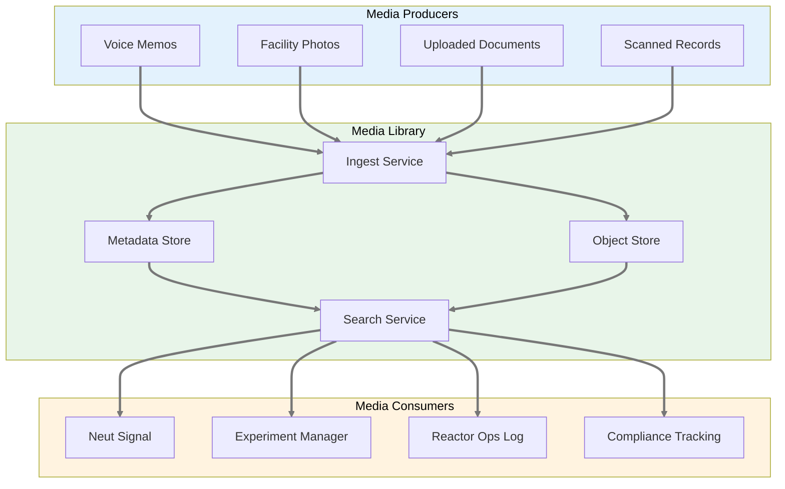
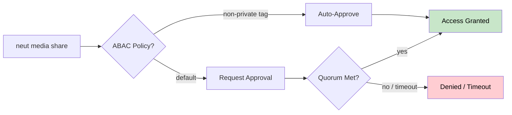
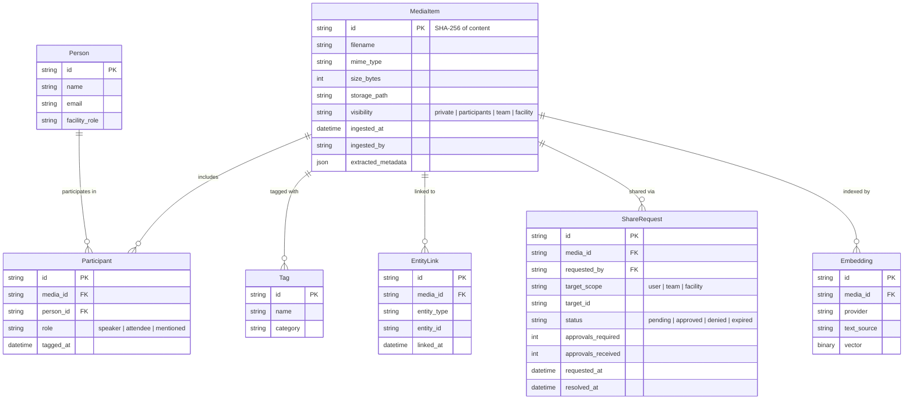

# Product Requirements Document: Media Library

> **Implementation Status: 🔲 Not Started** — This PRD describes planned functionality. Implementation has not started.

**Module:** Cross-Cutting Media Management
**Status:** Draft
**Last Updated:** February 26, 2026
**Related Modules:** [Reactor Ops Log](prd-reactor-ops-log.md), [Experiment Manager](prd-experiment-manager.md), [Compliance Tracking](prd-compliance-tracking.md)
**Parent:** [Executive PRD](prd-executive.md)
**ADR:** [ADR-009: Promote Media to Top-Level Noun](adr-009-promote-media-internalize-db.md)

---

## Executive Summary

The Media Library is a **cross-cutting platform service** that manages recordings, photographs, documents, and other binary artifacts across all Neutron OS modules. It provides ingest, metadata tagging, semantic search, and access-controlled retrieval.

Rather than each module implementing its own file storage, the Media Library provides a shared service that any module can produce to or consume from. Neut Signal indexes media for signal extraction. The Experiment Manager attaches photos to samples. The Ops Log links inspection recordings to shift entries. Compliance exports evidence packages.

**Key Principle:** Media is about **storage, metadata, and retrieval** of binary artifacts. It does not interpret content — that is the job of the consuming module (Neut Signal extracts signals, compliance validates evidence, experiments correlate results).

---

## System Architecture



---

## User Journeys

### Reactor Operator: Logging an Inspection Photo

> "I took a photo of the pool clarity during my walkdown. I want to attach it to today's ops log entry so the next shift can see it."

1. Operator takes photo on facility tablet
2. `neut media ingest photo.jpg --tag pool-clarity --link ops:2026-02-26-shift-A`
3. Photo is stored, thumbnailed, and linked to the shift entry
4. Next shift operator sees the photo inline in the ops log

### Researcher: Attaching Experiment Data

> "I have microscopy images from sample UT-TRIGA-042. I want them associated with the experiment so anyone reviewing results can see the raw images."

1. Researcher uploads images: `neut media ingest *.tif --tag microscopy --link experiment:UT-TRIGA-042`
2. Images are stored with experiment metadata
3. Experiment Manager shows thumbnails in the sample detail view
4. Compliance can export the images as part of an evidence package

### Program Manager: Finding a Recording

> "Someone mentioned a decision about the beam port schedule in last Tuesday's meeting. I need to find that recording."

1. Manager searches: `neut media search "beam port schedule" --type audio --after 2026-02-18`
2. Media Library returns matching recordings ranked by relevance
3. If Neut Signal has processed the recording, the transcript snippet is shown alongside

### Compliance Officer: Evidence Export

> "NRC wants all inspection photos and related recordings from the last quarter."

1. Officer runs: `neut media export --tag inspection --after 2025-12-01 --format zip`
2. Media Library collects matching artifacts with metadata manifests
3. Output is a portable archive with chain-of-custody metadata

---

## CLI Commands

Media follows the `neut` noun-verb pattern:

```
neut media ingest <file...>        Ingest files into the library
neut media list                    Browse the library (filterable)
neut media search <query>          Semantic + metadata search
neut media tag <id> <tags...>      Add metadata tags
neut media link <id> <entity>      Associate with experiment, log, etc.
neut media share <id> <user|group> Request shared access (with approval flow)
neut media export <id|query>       Export for sharing or compliance
neut media info <id>               Show metadata for an item
neut media delete <id>             Remove (with confirmation)
```

### Flags Common to Most Commands

| Flag | Purpose |
|------|---------|
| `--type` | Filter by media type (audio, image, document, video) |
| `--tag` | Filter or assign tags |
| `--after` / `--before` | Date range |
| `--link` | Associate with an entity (`experiment:ID`, `ops:ID`, `compliance:ID`) |
| `--format` | Output format for export (zip, tar, json-manifest) |
| `--participants` | Tag people present in a recording or conversation |
| `--visibility` | Access level: `private`, `participants`, `team`, `facility` |

---

## Scope: Key Capabilities (MVP)

### Phase 1 — Local File Store

1. **Ingest** — Accept files from CLI, compute SHA-256, extract basic metadata (EXIF, duration, MIME type), store in local object store
2. **Metadata tagging** — User-defined tags, auto-extracted metadata, entity links
3. **List and filter** — By type, tag, date range, linked entity
4. **Search** — Keyword search over filenames, tags, and metadata fields
5. **Export** — Single file or bulk export with metadata manifest

### Phase 2 — Semantic Search

6. **Embedding index** — Generate embeddings for text content (transcripts, OCR, document text) using the same provider pattern as Neut Signal (OpenAI, local sentence-transformers, keyword fallback)
7. **Semantic search** — `neut media search` uses vector similarity when embeddings are available, falls back to keyword
8. **Transcript linking** — When Neut Signal processes a recording, the transcript is linked back to the media item

### Phase 3 — Shared Storage & Sync

9. **S3-compatible backend** — SeaweedFS or cloud S3 for multi-user environments
10. **Access control** — RBAC/ReBAC/ABAC unified policy engine (see Conversation Boundaries section)
11. **Sync** — Offline-first: local buffer with background sync to shared service on network restore
12. **Storage management** — Configurable retention policies, LRU eviction for local cache, quota alerts

---

## Conversation Boundaries & Access Control

Recorded media — especially audio, video, and chat logs — carries implicit confidentiality expectations. The Media Library enforces **conversation boundaries** as a first-class concept, not an afterthought.

### Principles

1. **Participants are automatic viewers.** Anyone tagged as present in a recording is automatically granted `viewer` access and notified when the media is ingested into the system.
2. **Default visibility is `participants`.** Unless overridden by a tag or policy, only people who were in the conversation can access the recording.
3. **Speaker attribution matters.** Neut Signal tags *who said what* during transcription. This enables per-speaker search, accountability, and selective PII stripping.
4. **PII is stripped from shared content.** When a transcript or summary is shared beyond the participant group, personally identifying information is redacted. The original unredacted content remains available only to participants and authorized roles.
5. **Sharing requires group approval by default.** `neut media share` sends an approval request to all participants. The share completes when all (or a quorum, configurable) approve. Access control policies can preempt this — e.g., recordings tagged `non-private` in a `public-meetings` channel skip the approval flow.

### Access Control Model

The Media Library integrates RBAC, ReBAC, and ABAC into a unified policy engine:

| Layer | Controls | Example |
|-------|----------|---------|
| **RBAC** (Role-Based) | Facility-wide permissions by role | Compliance officers can export any media tagged `inspection` |
| **ReBAC** (Relationship-Based) | Access derived from participation | Meeting attendees see the recording; non-attendees do not |
| **ABAC** (Attribute-Based) | Policy rules on tags and metadata | Media tagged `non-private` + `standup` is auto-visible to the team |

Policy evaluation order: **ABAC override → ReBAC participant check → RBAC role fallback**. The most specific policy wins.

### Visibility Levels

| Level | Who Can Access | When to Use |
|-------|---------------|-------------|
| `private` | Ingesting user only | Personal voice memos, drafts |
| `participants` | Tagged conversation participants (default) | Meeting recordings, discussions |
| `team` | All members of the linked team/project | Non-private standups, project reviews |
| `facility` | All authenticated facility users | Safety briefings, all-hands |

### Share Flow



### People Tagging & Speaker Attribution

Recordings and conversations are linked to **Person** entities. During ingest, participants can be tagged manually (`--participants alice,bob`) or detected automatically by Neut Signal during transcription (speaker diarization). Each transcript segment is attributed to a speaker, enabling:

- Per-speaker search: *"What did Alice say about the beam port?"*
- Selective PII redaction: strip names and identifiers when sharing beyond the participant group
- Accountability: who approved what decision in a recorded meeting
- Notification: participants are alerted when their conversations are processed

---

## Data Model



---

## Storage Architecture

### Phase 1: Local Flat Files (No Database Required)

```
tools/media/
  store/                    # Object storage root
    ab/cd/abcdef1234...     # Content-addressed files (SHA-256 prefix dirs)
  index.json                # Media item metadata (JSON lines)
  tags.json                 # Tag assignments
  links.json                # Entity link mappings
  participants.json         # Person ↔ media associations
  pending_sync/             # Queued uploads for when shared service is available
```

This mirrors Neut Signal's offline-first design: everything works with
flat JSON files. No PostgreSQL, no external services.

### Local Buffer & Sync Strategy

The Media Library always works locally first. When a shared storage backend
(SeaweedFS, S3) becomes available, local media syncs automatically:

1. **Ingest always succeeds locally** — files land in the content-addressed store immediately, never blocked by network
2. **Sync queue** — `pending_sync/` tracks items that need upload; processed FIFO on network restore
3. **Storage budget** — Configurable local quota (default: 10 GB). When exceeded, oldest synced items are evicted from local cache (metadata preserved; content re-fetched on demand)
4. **Conflict resolution** — Content-addressed (SHA-256) means identical files never conflict. Metadata conflicts resolved by last-writer-wins with full version history
5. **Status visibility** — `neut media list --sync-status` shows pending/synced/local-only state

This ensures a single-user laptop deployment and a multi-user facility deployment
use the same CLI — only the storage backend configuration changes.

### Phase 2+: PostgreSQL + Object Storage

When a database is available, the flat-file index migrates to PostgreSQL with
pgvector for embedding search. Object storage migrates to SeaweedFS/S3. The CLI
interface is identical — only the backend changes.

---

## Non-Functional Requirements

| Requirement | Target |
|-------------|--------|
| **Ingest latency** | < 2s for files under 100 MB |
| **Search latency** | < 500ms for keyword, < 2s for semantic |
| **Offline support** | Full ingest, search, and export without network |
| **Max file size** | 2 GB (configurable) |
| **Deduplication** | Content-addressed (SHA-256); duplicate ingest is a no-op |
| **Platforms** | macOS, Linux (Windows future) |

---

## Relationship to Neut Signal

Neut Signal is a **consumer** of the Media Library, not its owner:

| Concern | Owner | How |
|---------|-------|-----|
| Store a recording | **Media Library** | `neut media ingest recording.m4a` |
| Extract signals from a recording | **Neut Signal** | Neut Signal reads from Media Library, writes signals |
| Link transcript to recording | **Media Library** | Neut Signal calls `media.link(recording_id, transcript_id)` |
| Search recordings by content | **Media Library** | Uses embeddings generated by Neut Signal or its own providers |

This separation means:
- Media works without Neut Signal (just a file library with metadata)
- Neut Signal works without Media (processes files directly from inbox)
- When both are active, they enrich each other

---

## Migration from Neut Signal

Per [ADR-009](adr-009-promote-media-internalize-db.md), the following code
moves from `signal_agent/` to a future `media/` extension:

| Current Location | New Location |
|-----------------|--------------|
| `signal_agent/media_library.py` | `media/library.py` |
| `signal_agent/pgvector_store.py` | `media/store.py` |
| `signal_agent/db_models.py` (Media, Participant) | `media/models.py` |

Re-exports from the old paths will emit deprecation warnings during the
transition period.

---

## Risks and Open Questions

| Risk / Question | Mitigation / Status |
|-----------------|-------------------|
| Large files bloat git history | Object store is gitignored; only metadata index is committed |
| Embedding provider availability | Three-tier fallback: OpenAI > local transformers > keyword |
| Access control complexity | RBAC/ReBAC/ABAC policy engine; Phase 1 defaults to `participants` visibility |
| EXIF/metadata extraction reliability | Use established libraries (Pillow, mutagen, python-magic) |
| How to handle media in plugin repos? | Media store path is configurable per facility in `facility.toml` |
| Speaker diarization accuracy | Multiple provider fallback; human correction via `neut media tag` |
| PII stripping completeness | Named entity recognition + configurable deny-lists; human review for sensitive shares |
| Local storage budget on laptops | Configurable quota with LRU eviction of synced content; metadata always preserved |
| Share approval UX for large groups | Configurable quorum (e.g., majority vs. unanimous); timeout with auto-deny |
| Conversation boundary detection for chat vs. audio | Chat has explicit participant lists; audio requires diarization or manual `--participants` |

---

## Contacts & Links

- **Product lead:** Ben
- **Parent PRD:** [Executive PRD](prd-executive.md)
- **Architecture decision:** [ADR-009](adr-009-promote-media-internalize-db.md)
- **CLI design:** [neut CLI PRD](prd-neut-cli.md)
- **Related spec:** *(future — media-library-spec.md)*
