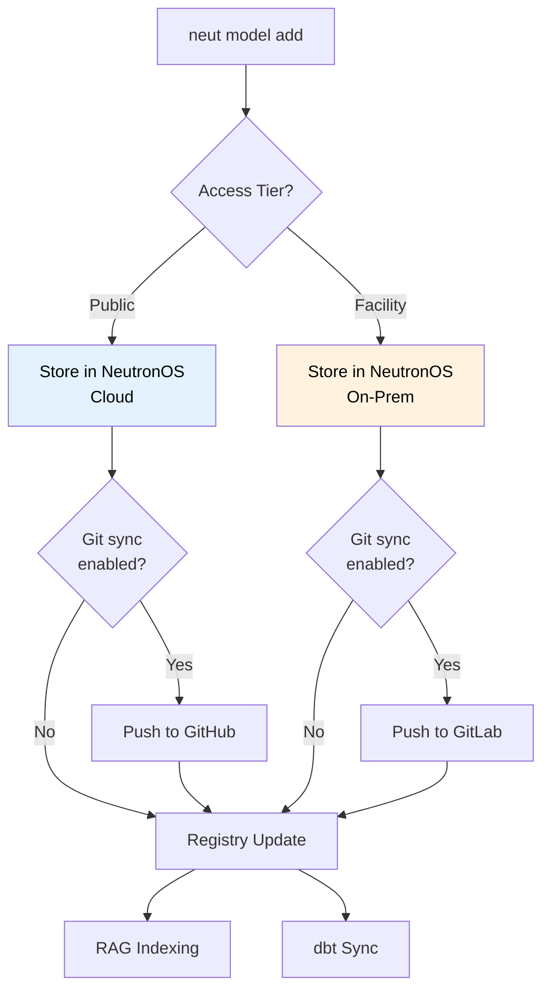
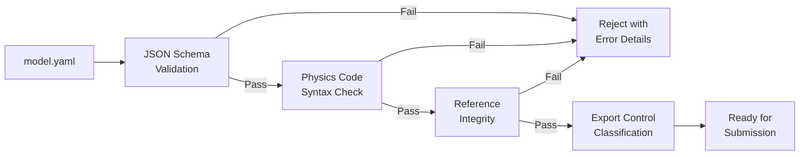

# Model Corral PRD

> **Implementation Status: 🔲 Not Started** — This PRD describes planned functionality.

**Product:** NeutronOS Model Corral  
**Status:** Draft  
**Last Updated:** 2026-03-20  
**Parent:** [Executive PRD](prd-executive.md)  
**Related:** [Digital Twin Hosting PRD](prd-digital-twin-hosting.md), [Data Platform PRD](prd-data-platform.md), [DOE Data Management & Sharing PRD](prd-doe-data-management.md)

---

## Overview

Model Corral is NeutronOS's unified registry for **physics simulation models** — both high-fidelity input decks (MCNP, MPACT, SAM, Griffin, RELAP, OpenMC) and trained Reduced Order Models (ROMs). It provides discovery, versioning, validation, and provenance tracking for the computational artifacts that power digital twins.

### Why "Model Corral"?

The name reflects the reality of nuclear simulation: models wander across institutions, get forked without tracking, and accumulate ad-hoc modifications. Model Corral brings them into a managed space where they can be cataloged, validated, and traced from creation through deployment.

---

## Problem Statement

### Current Pain Points

1. **Ad-hoc Model Sharing** — Input decks passed via email, Slack, and USB drives with verbal descriptions of modifications
2. **No Provenance** — "This MCNP deck came from someone at Oak Ridge in 2019" is typical documentation
3. **Version Chaos** — Multiple engineers hold different versions of "the same" model with incompatible changes
4. **Discovery Friction** — Finding the right model for a reactor/physics-code/purpose requires tribal knowledge
5. **No Validation Pipeline** — Models enter production without systematic verification against reference data
6. **ROM Training Disconnect** — ROMs are trained from high-fidelity outputs but the linkage is lost

### Consequences

| Problem | Impact |
|---------|--------|
| Untracked modifications | Safety analysis uses wrong model assumptions |
| No discovery mechanism | Engineers recreate existing models from scratch |
| Missing provenance | Regulatory questions cannot be answered |
| Disconnected ROMs | Model drift goes undetected; ROMs diverge from physics |

---

## Solution Overview

Model Corral provides:

1. **NeutronOS-Primary Storage** — Models managed by NeutronOS with optional Git synchronization
2. **Unified Schema** — Standard `model.yaml` manifest for all model types
3. **Multi-Reactor Support** — TRIGA, MSR, PWR, BWR, HTGR, and commercial reactor types
4. **Code-Agnostic** — Supports any physics code with pluggable validators
5. **Tiered Access** — Deployment-based access control (public → facility-only)
6. **ROM Lineage** — Explicit linkage from ROMs to training data and physics models
7. **Git-Aware Versioning** — When Git is available, NeutronOS versions align with Git commits/tags
8. **Dual Access** — Full-featured CLI (`neut model`) and web interface with equivalent capabilities
9. **NeutronOS Integration** — RAG indexing, dbt tables, agent tools

> **First Deliverable:** Before building advanced features, Phase 1 will **ingest, catalogue, and make available all known model inputs** across the program (TRIGA, MSR, MIT Loop, bubble loop, etc.). Immediate value through consolidation; tooling follows.

---

## Storage Architecture

### NeutronOS-Primary, Git-Aware

Model Corral uses NeutronOS as the **primary system of record**, with Git as an optional (but well-integrated) backing store:

```
┌─────────────────────────────────────────────────────────────────────────────┐
│                    Model Corral Storage Architecture                         │
├─────────────────────────────────────────────────────────────────────────────┤
│                                                                              │
│   USER ACCESS (CLI + Web — equivalent capabilities)                        │
│   ─────────────────────────────────────────────                              │
│                                                                              │
│   ┌───────────────────────────────┐     ┌───────────────────────────────┐   │
│   │       neut model (CLI)       │     │      Web Interface (React)    │   │
│   │                               │     │                               │   │
│   │ • add, search, pull, validate │     │ • Browse, search, download    │   │
│   │ • Scriptable, CI/CD friendly  │     │ • Drag-drop upload            │   │
│   │ • Power users, automation     │     │ • Visual diff, lineage graph  │   │
│   └───────────────┬───────────────┘     └───────────────┬───────────────┘   │
│                   │                               │                           │
│                   └───────────────┬───────────────┘                           │
│                                   │                                         │
│                                   ▼                                         │
│   ┌─────────────────────────────────────────────────────────────────────┐   │
│   │                     NeutronOS Model Registry                         │   │
│   │                                                                      │   │
│   │  • PostgreSQL metadata (model.yaml contents)                        │   │
│   │  • Object storage for model files (S3/SeaweedFS)                        │   │
│   │  • Version history managed by NeutronOS                             │   │
│   │  • Search, validation, provenance — all NeutronOS                   │   │
│   └─────────────────────────────────────────────────────────────────────┘   │
│                                    │                                         │
│                    ┌───────────────┴───────────────┐                        │
│                    │                               │                        │
│                    ▼                               ▼                        │
│   ┌─────────────────────────┐     ┌─────────────────────────┐              │
│   │   Git Sync (Optional)   │     │   No Git (Standalone)   │              │
│   │                         │     │                         │              │
│   │ • Push to GitHub/GitLab │     │ • NeutronOS-only        │              │
│   │ • Version = Git tag     │     │ • Version = NeutronOS   │              │
│   │ • Pull from upstream    │     │   sequence number       │              │
│   │ • Bidirectional sync    │     │ • Users who don't       │              │
│   │                         │     │   know/want Git         │              │
│   └─────────────────────────┘     └─────────────────────────┘              │
│                                                                              │
└─────────────────────────────────────────────────────────────────────────────┘
```

### Why NeutronOS-Primary?

| Concern | Git-Primary Approach | NeutronOS-Primary Approach |
|---------|---------------------|---------------------------|
| **Non-Git users** | Must learn Git | Works immediately via CLI or web |
| **Validation** | Separate CI pipeline | Built into NeutronOS |
| **Search/Discovery** | Requires external index | Native RAG integration |
| **Provenance** | Parse Git history | First-class metadata |
| **ROM artifacts** | Large binary = Git LFS pain | Object storage native |
| **Offline/air-gapped** | Requires Git server | Works standalone |

### Git Integration Modes

```yaml
# model.yaml - Git integration configuration
git_integration:
  mode: "sync"  # none | sync | mirror
  
  # sync: NeutronOS is primary, pushes to Git
  # mirror: Git is upstream, NeutronOS pulls
  # none: No Git integration
  
  remote: "github.com/UT-Computational-NE/triga-models"
  branch: "main"
  auto_push: true  # Push on every NeutronOS version
```

**Mode Behaviors:**

| Mode | Primary | Direction | Use Case |
|------|---------|-----------|----------|
| `none` | NeutronOS | — | Export-controlled, proprietary, or non-Git users |
| `sync` | NeutronOS | NeutronOS → Git | Default: NeutronOS manages, Git for sharing/backup |
| `mirror` | Git | Git → NeutronOS | Import existing Git repos into NeutronOS |

### Version Alignment

When Git is enabled, NeutronOS versions map to Git:

```
NeutronOS Version          Git Reference
─────────────────          ─────────────
v1.0.0                     tag: v1.0.0
v1.0.1                     tag: v1.0.1  
v1.1.0-draft.3             branch: draft/v1.1.0, commit: abc123
v2.0.0-rc.1                tag: v2.0.0-rc.1
```

**Version Rules:**
- Releasing a version in NeutronOS creates a Git tag (if sync enabled)
- Draft versions map to branches, not tags
- Git commits without NeutronOS versions are accessible but not "released"
- NeutronOS can have versions that don't exist in Git (export-controlled)

---

## User Roles and Personas

Model Corral serves six distinct user roles, each mapped to NeutronOS canonical personas:

### Role 1: Model Contributor

**NeutronOS Persona:** [Nuclear Engineering Researcher](../research/user-personas.md#persona-2-nuclear-engineering-researcher)

| Attribute | Value |
|-----------|-------|
| **Description** | Graduate students, researchers, code developers adding new model inputs or variants |
| **Frequency** | Weekly during active development; burst during thesis/paper preparation |
| **Technical Level** | High — comfortable with physics codes, HDF5; Git optional |
| **Root Motivation** | Scientific credibility — "My model needs to be trusted and citable" |

**Surface Tasks:**
- Create new model folders with minimal friction
- Add reactor/design variants to existing model families
- Provide enough metadata for discoverability without excessive burden
- Track relationship to parent models (forks, parameterizations)

**User Stories:**
- **US-MC-001**: As a grad student, I want to add my MCNP deck for the TRIGA transient rod experiment so others can reproduce my thesis results.
- **US-MC-002**: As a researcher, I want to fork an existing MSR model and document my modifications so I can cite the original while claiming my improvements.
- **US-MC-003**: As a developer, I want CoreForge-generated inputs to optionally populate the registry so I don't manually duplicate metadata (CoreForge not required).

**Success Criteria:**
- Model submission takes <5 minutes including metadata
- Full version history preserved in NeutronOS (Git sync optional)
- Automatic validation catches obvious errors before submission

---

### Role 2: Model Consumer

**NeutronOS Personas:** [Nuclear Engineering Researcher](../research/user-personas.md#persona-2-nuclear-engineering-researcher), [MPACT Code Developer](../research/user-personas.md#persona-5-mpact-code-developer)

| Attribute | Value |
|-----------|-------|
| **Description** | Analysts and code users who need input decks for simulations |
| **Frequency** | On-demand, project-driven |
| **Technical Level** | Medium-High — knows what they need but may not know where to find it |
| **Root Motivation** | Efficiency — "I need the right model without reinventing the wheel" |

**Surface Tasks:**
- Browse models by reactor type, design variant, physics code
- Search by phenomena (xenon, thermal-hydraulics, burnup)
- Download complete input deck packages
- Understand model applicability and limitations

**User Stories:**
- **US-MC-010**: As an analyst, I want to search for "TRIGA pulse MCNP" and get relevant models ranked by quality and relevance.
- **US-MC-011**: As a code developer, I want to download a PWR benchmark model with documented validation data for V&V.
- **US-MC-012**: As a researcher, I want to filter models by publication status so I only use peer-reviewed inputs.

**Success Criteria:**
- Search returns relevant results in <2 seconds
- Model downloads include all dependencies and documentation
- Clear indicators of model maturity and validation status

---

### Role 3: Reviewer / Maintainer

**NeutronOS Personas:** [Facility Manager](../research/user-personas.md#persona-4-facility-manager), Senior Reactor Operator

| Attribute | Value |
|-----------|-------|
| **Description** | Senior engineers ensuring structure, metadata, and quality consistency |
| **Frequency** | Weekly reviews, inspection preparation |
| **Technical Level** | Expert — deep domain knowledge, quality assurance focus |
| **Root Motivation** | Institutional integrity — "Our models must be defensible under scrutiny" |

**Surface Tasks:**
- Ensure metadata completeness and accuracy
- Validate model structure against schemas
- Approve models for production use
- Maintain canonical reference models

**User Stories:**
- **US-MC-020**: As a reviewer, I want automated schema validation to catch metadata errors before human review.
- **US-MC-021**: As a maintainer, I want to mark models as "canonical" vs "experimental" so users know which to trust.
- **US-MC-022**: As a senior engineer, I want audit logs of all model changes for regulatory compliance.

**Success Criteria:**
- 100% of production models pass schema validation
- Review queue with clear status indicators
- Complete audit trail exportable for NRC inspections

---

### Role 4: ROM Developer

**NeutronOS Persona:** [Nuclear Engineering Researcher](../research/user-personas.md#persona-2-nuclear-engineering-researcher) — ML Specialization

| Attribute | Value |
|-----------|-------|
| **Description** | ML engineers building reduced-order models from high-fidelity simulations |
| **Frequency** | Continuous during ROM development cycles |
| **Technical Level** | Expert — ML frameworks, HDF5, physics-informed learning |
| **Root Motivation** | Reproducibility — "I need to trace my ROM back to exact training conditions" |

**Surface Tasks:**
- Find high-fidelity model outputs suitable for ROM training
- Trace ROM versions back to source physics models
- Version ROM artifacts alongside training metadata
- Compare ROM predictions against source model outputs

**User Stories:**
- **US-MC-030**: As a ROM developer, I want to query "all VERA runs for TRIGA steady-state" to assemble training datasets.
- **US-MC-031**: As an ML engineer, I want my trained ROM automatically linked to its training data hashes for reproducibility.
- **US-MC-032**: As a researcher, I want to compare ROM v2 accuracy against v1 using the same validation set.

**Success Criteria:**
- Training data provenance captured automatically
- ROM versions linked to exact physics model versions
- Validation datasets versioned and immutable

---

### Role 5: Shadow Operator

**NeutronOS Personas:** [Reactor Operator](../research/user-personas.md#persona-1-reactor-operator), [Nuclear Engineering Researcher](../research/user-personas.md#persona-2-nuclear-engineering-researcher) (hybrid)

| Attribute | Value |
|-----------|-------|
| **Description** | Specialists running Shadow (VERA/MCNP) calibration and reference calculations |
| **Frequency** | Nightly batch runs, on-demand calibration |
| **Technical Level** | Expert — physics codes, HPC job submission |
| **Root Motivation** | Accuracy — "The Shadow must be the ground truth for all comparisons" |

**Surface Tasks:**
- Reference canonical models for calibration runs
- Track bias corrections applied to models
- Compare Shadow outputs against reactor measurements
- Update models based on calibration results

**User Stories:**
- **US-MC-040**: As Shadow operator Nick, I want to pull the canonical TRIGA VERA model with documented bias corrections.
- **US-MC-041**: As Tatiana, I want to record calibration coefficients as model metadata, not scattered notes.
- **US-MC-042**: As a Shadow operator, I want to see validation metrics (VERA vs measured) for the current canonical model.

**Success Criteria:**
- Canonical models clearly marked and locked
- Bias corrections versioned with justification
- Calibration history queryable

---

### Role 6: Integrator

**NeutronOS Persona:** System Administrator / Automation Engineer (implicit)

| Attribute | Value |
|-----------|-------|
| **Description** | Automation systems that consume the registry for NeutronOS synchronization |
| **Frequency** | Continuous (webhooks, scheduled syncs) |
| **Technical Level** | API-first — JSON schemas, webhooks, CLI |
| **Root Motivation** | Reliability — "The data pipeline must never break silently" |

**Surface Tasks:**
- Consume `index.json` for database synchronization
- Trigger dbt refreshes on model updates
- Index model documentation into RAG corpus
- Propagate model metadata to downstream systems

**User Stories:**
- **US-MC-050**: As an integrator, I want a stable JSON schema for `index.json` so my pipelines don't break on updates.
- **US-MC-051**: As automation, I want webhooks on model changes to trigger downstream workflows.
- **US-MC-052**: As NeutronOS, I want model README files indexed into RAG for natural language search.

**Success Criteria:**
- API backward compatibility maintained
- Webhook delivery with retry/confirmation
- Sub-minute sync latency for critical updates

---

## Data Model

### Model Manifest Schema (`model.yaml`)

Every model directory contains a `model.yaml` manifest:

```yaml
# Model identification
model_id: "triga-netl-mcnp-transient-v3"
name: "TRIGA NETL Transient MCNP Model"
version: "3.2.1"
status: "production"  # draft | review | production | deprecated | archived

# Classification
reactor_type: "TRIGA"  # TRIGA | MSR | PWR | BWR | HTGR | VHTR | SFR | custom
facility: "NETL"       # NETL | MIT | generic | commercial-redacted
physics_domain:
  - neutronics
  - thermal_hydraulics
  - xenon_dynamics

# Physics code
physics_code: "MCNP"   # MCNP | MPACT | VERA | SAM | Griffin | RELAP | OpenMC | BISON | custom
code_version: "6.2"
input_files:
  - path: "input.i"
    type: "main_input"
  - path: "materials.dat"
    type: "material_library"
  - path: "geometry.xml"
    type: "geometry_definition"

# ROM classification (if applicable)
rom_tier: null  # ROM-1 | ROM-2 | ROM-3 | ROM-4 | null for high-fidelity
training_source: null  # model_id of physics model used for training

# Provenance
created_by: "jsmith@utexas.edu"
created_at: "2026-01-15T10:30:00Z"
parent_model: "triga-netl-mcnp-transient-v2"  # Fork source
coreforge_config: "configs/triga-transient.json"  # Optional: only if generated by CoreForge

# Access tier (deployment-based, not export control — input models don't require EC per Nick)
access_tier: "facility"  # public | facility

# Validation
validation_status: "validated"  # unvalidated | in_progress | validated | failed
validation_dataset: "datasets/triga-2025-benchmark"
validation_metrics:
  rmse_power: 0.023
  max_error_temp: 2.1

# Documentation
description: |
  MCNP model for TRIGA transient analysis including xenon dynamics
  and control rod worth calculations. Validated against 2025 benchmark.
publications:
  - doi: "10.1016/j.nucengdes.2026.001234"
    title: "Transient Analysis of TRIGA Reactor Using MCNP6.2"
tags:
  - transient
  - xenon
  - control_rod_worth
  - benchmark
```

**DOE DMSP manifest extensions:** The `model.yaml` manifest will be extended with: `license` (required — SPDX identifier), `funding_source` (optional — DOE award number when applicable), and `doi` (assigned on publication to a public repository). ROM training provenance must link training data sources by PID when those sources have been published with DOIs. See [prd-doe-data-management.md](prd-doe-data-management.md).

### ROM Extension Schema

For trained ROMs, additional fields:

```yaml
# ROM-specific fields
rom_tier: "ROM-2"
model_type: "surrogate"  # surrogate | physics_informed_nn | gaussian_process

# Training provenance
training:
  source_model: "triga-netl-vera-shadow-v4"
  training_runs:
    - run_id: "run-2026-03-01-001"
    - run_id: "run-2026-03-01-002"
    - run_id: "run-2026-03-02-001"
  training_hash: "sha256:abc123..."
  training_date: "2026-03-05T00:00:00Z"
  framework: "pytorch"
  framework_version: "2.1.0"

# Deployment
deployment:
  format: "onnx"  # onnx | wasm | pytorch | tensorflow
  wasm_module: "rom_triga_v2.wasm"
  input_schema: "schemas/rom2_input.json"
  output_schema: "schemas/rom2_output.json"

# Performance
performance:
  inference_latency_ms: 15
  cold_start_ms: 45
  throughput_per_sec: 800
  valid_input_ranges:
    power_mw: [0.001, 1.5]
    rod_position_cm: [0, 38]
    coolant_temp_c: [20, 80]
```

### Federated Model Artifacts

The INL federated learning LDRD produces models trained across multiple
facilities using Flower AI. Model Corral is the **registered home for these
LDRD deliverables** — the open-source federated LSTM, GPR, and Isolation
Forest models targeting TRIGA reactor operations. These federated artifacts
must be registered and versioned alongside single-facility ROMs, with
versioning tracking both model version and federation round.

#### Federation Fields (`model.yaml`)

```yaml
federation:
  enabled: true
  framework: "flower-ai"            # federated learning framework
  federation_round: 12              # which FL aggregation round produced this model
  participating_facilities:
    - "ut-austin-netl"
    - "osu-triga"
    - "inl-nrad"
  aggregation_method: "fedavg"      # federated averaging
  differential_privacy: true
  privacy_budget: 1.0               # epsilon value for DP guarantee
```

These fields are optional (null for single-facility models) and extend the
base `model.yaml` schema without breaking existing entries.

#### What Federated Model Registration Enables

| Capability | Description |
|------------|-------------|
| **Catalog differentiation** | Federated models appear as a distinct model type in search and browse, separate from single-facility ROMs |
| **Round-level versioning** | Each federation round that produces a new aggregate model gets its own Model Corral entry; `federation_round` tracks which round each version came from |
| **Facility audit trail** | `participating_facilities` records which facilities contributed to a given aggregate model, satisfying LDRD reporting requirements |
| **Performance comparison** | Federated vs. single-facility model performance can be compared using the same validation datasets — this is the LDRD's key research question |

#### LDRD Model Inventory

The following federated models are the primary LDRD deliverables; all will
be registered in Model Corral:

| Model | Architecture | Target application |
|-------|--------------|--------------------|
| Federated LSTM | Long Short-Term Memory | Reactor transient time-series prediction |
| Federated GPR | Gaussian Process Regression | Steady-state parameter estimation with uncertainty |
| Federated Isolation Forest | Ensemble anomaly detector | Operational anomaly detection across TRIGA facilities |

All three models target TRIGA reactor operations and will be validated against
the UT-Austin NETL, OSU TRIGA, and INL NRAD datasets produced by the LDRD.

---

## Logical Structure

Model Corral organizes models hierarchically within NeutronOS:

```
NeutronOS Model Registry (PostgreSQL + Object Storage)
│
├── Schemas
│   ├── model.schema.json         # JSON Schema for model.yaml
│   └── rom.schema.json           # ROM extension schema
│
├── Models (logical hierarchy, stored in DB + object storage)
│   │
│   ├── reactor_type: TRIGA
│   │   ├── facility: NETL
│   │   │   ├── physics_code: MCNP
│   │   │   │   ├── triga-netl-mcnp-transient-v3
│   │   │   │   │   ├── model.yaml (metadata in PostgreSQL)
│   │   │   │   │   ├── input.i (files in object storage)
│   │   │   │   │   ├── README.md
│   │   │   │   │   └── validation/
│   │   │   │   └── triga-netl-mcnp-steady-v2
│   │   │   ├── physics_code: VERA
│   │   │   │   ├── triga-netl-vera-shadow-canonical
│   │   │   │   └── triga-netl-vera-shadow-calibrated
│   │   │   └── physics_code: OpenMC
│   │   └── facility: MIT
│   │       └── ...
│   │
│   ├── reactor_type: MSR
│   │   ├── facility: MSRE
│   │   │   ├── physics_code: SAM
│   │   │   └── physics_code: Griffin
│   │   └── facility: generic
│   │
│   ├── pwr/
│   │   ├── westinghouse-ap1000/
│   │   └── generic-17x17/
│   │
│   └── htgr/
│       └── ...
│
├── roms/
│   ├── triga/
│   │   └── netl/
│   │       ├── rom-1-transient/
│   │       │   ├── model.yaml
│   │       │   ├── rom_triga_rom1.wasm
│   │       │   └── training_manifest.json
│   │       ├── rom-2-quasistatic/
│   │       └── rom-3-highres/
│   └── msr/
│       └── ...
│
├── coreforge-configs/
│   ├── triga/
│   │   └── netl-standard.json
│   └── msr/
│       └── msre-baseline.json
│
└── datasets/
    ├── triga-2025-benchmark/
    │   ├── manifest.yaml
    │   ├── measurements.hdf5
    │   └── README.md
    └── msr-safety-benchmark/
```

---

## Access Control Architecture

> **Note:** Per Nick Luciano, physics code input models (MCNP decks, VERA inputs, SAM configs, etc.) do not require export control. The tiered access below is for **deployment/visibility management**, not regulatory compliance.

### Tiered Access Model

```
┌─────────────────────────────────────────────────────────────────┐
│                        Access Tiers                              │
├─────────────────────────────────────────────────────────────────┤
│                                                                  │
│   ┌─────────────────────────────┐  ┌─────────────────────────┐  │
│   │           PUBLIC            │  │        FACILITY         │  │
│   │                             │  │                         │  │
│   │ • Generic PWR benchmarks    │  │ • TRIGA NETL configs    │  │
│   │ • Textbook examples         │  │ • MIT Loop models       │  │
│   │ • Educational/demo models   │  │ • MSRE facility-specific│  │
│   │ • Open-source community     │  │ • Calibration data      │  │
│   │                             │  │ • Pre-publication work  │  │
│   └──────────────┬──────────────┘  └────────────┬────────────┘  │
│                  │                              │               │
│        NeutronOS (cloud) +            NeutronOS (on-prem) +     │
│        GitHub sync (opt)              GitLab sync (opt)         │
│                                                                  │
└─────────────────────────────────────────────────────────────────┘
```

### Access Enforcement

| Tier | Primary Storage | Git Sync | Authentication | Network |
|------|-----------------|----------|----------------|---------|
| `public` | NeutronOS (cloud) | GitHub optional | NeutronOS account | Public internet |
| `facility` | NeutronOS (on-prem) | UT GitLab optional | UT EID | Campus/VPN |

### Submission Workflow



---

## NeutronOS Integration

### User Access

Model Corral provides two equivalent access methods:

| Capability | CLI (`neut model`) | Web Interface |
|------------|---------------------|---------------|
| Search models | `neut model search` | Search bar, faceted filters |
| Browse catalog | `neut model list` | Card/table view, pagination |
| View details | `neut model show` | Model detail page |
| Add models | `neut model add` | Drag-drop upload wizard |
| Download | `neut model pull` | Download button, ZIP export |
| Compare versions | `neut model diff` | Visual side-by-side diff |
| View lineage | `neut model lineage` | Interactive graph visualization |
| Validate | `neut model validate` | Real-time validation feedback |
| Git sync | `neut model sync` | Settings panel, sync status |

> **Note:** "Model Corral" is the brand name for this module. The CLI noun is `model` — consistent with the NeutronOS convention of using generic nouns (`log`, `twin`, `data`) rather than brand names.

**Design Principle:** Every operation available in CLI is also available in web UI. The CLI is the primary interface for automation, CI/CD, and power users. The web interface enables discovery-oriented browsing, visual comparisons, and accessibility for non-CLI users.

### CLI Commands (`neut model`)

```bash
# Discovery
neut model search "TRIGA transient MCNP"
neut model list --reactor=triga --facility=netl
neut model show triga-netl-mcnp-transient-v3

# Contribution
neut model init ./my-model --reactor=msr --code=sam
neut model validate ./my-model
neut model add ./my-model --message="Initial MSR thermal model"

# Download
neut model pull triga-netl-mcnp-transient-v3 ./workspace/
neut model export triga-netl-mcnp-transient-v3 --format=zip

# Version comparison
neut model diff triga-netl-mcnp-transient-v3 triga-netl-mcnp-transient-v2
neut model lineage triga-netl-rom2-v3  # Show ROM → physics model chain

# ROM operations
neut model rom-link ./my-rom --training-source=triga-netl-vera-shadow-v4
neut model rom-validate ./my-rom --against=datasets/triga-2025-benchmark

# Git integration
neut model sync --push   # Push to Git remote (if enabled)
neut model sync --pull   # Pull from Git remote (mirror mode)

# Administration
neut model audit --since=2026-01-01
```

### Web Interface

The Model Corral web interface is a React application integrated into the NeutronOS portal:

**Key Views:**

| View | Description |
|------|-------------|
| **Catalog Browser** | Hierarchical navigation by reactor → facility → code; card grid with previews |
| **Search Results** | Full-text + faceted search; filter by reactor, code, status, validation |
| **Model Detail** | Metadata display, file browser, README rendering, validation status |
| **Version History** | Timeline of versions, diff viewer, rollback capability |
| **Lineage Graph** | D3 visualization: physics model → Shadow runs → ROM training → ROM versions |
| **Upload Wizard** | Step-by-step: select files → edit metadata → validate → submit |
| **Admin Dashboard** | Validation queue, sync status, storage metrics, audit logs |

**Accessibility:**
- Non-Git users can browse, search, and download without any Git knowledge
- Drag-drop upload for model files and metadata
- Real-time validation feedback during upload
- Visual diff for comparing model versions

### Extension Configuration (`neut-extension.toml`)

```toml
[extension]
name = "model-corral"
kind = "tool"
version = "0.1.0"
description = "Model registry for physics codes and ROMs"

[[cli.commands]]
noun = "model"
module = "neutron_os.extensions.builtins.model_corral.cli"

[[connections]]
name = "github-models"
kind = "api"
credential_env_var = "GITHUB_TOKEN"
category = "model_registry"

[[connections]]
name = "gitlab-tacc"
kind = "api"
credential_env_var = "GITLAB_TACC_TOKEN"
category = "model_registry"
```

### RAG Integration

Model documentation is indexed into a dedicated `rag-models` corpus:

```python
# Automatic indexing on model submission
from neutron_os.rag import ingest_file, RAGStore

store = RAGStore()
ingest_file(
    path="reactors/triga/netl/mcnp/transient-v3/README.md",
    store=store,
    corpus="rag-models",
    metadata={
        "model_id": "triga-netl-mcnp-transient-v3",
        "reactor_type": "TRIGA",
        "physics_code": "MCNP"
    }
)
```

### dbt Integration

New dbt models for Model Corral:

| Layer | Table | Description |
|-------|-------|-------------|
| Bronze | `model_registry_raw` | Raw `model.yaml` contents, JSON |
| Silver | `model_registry_validated` | Schema-validated, enriched with Git metadata |
| Gold | `model_catalog` | Searchable catalog with computed fields |
| Gold | `model_lineage` | Parent-child relationships, ROM → physics model |
| Gold | `model_validation_metrics` | Aggregated validation statistics |

### Agent Tools

```python
CORRAL_TOOLS = [
    {
        "name": "model_search",
        "description": "Search for models by reactor, code, or physics domain",
        "parameters": {
            "query": "string - natural language search query",
            "reactor_type": "string - optional filter",
            "physics_code": "string - optional filter"
        },
        "category": ActionCategory.READ
    },
    {
        "name": "model_get_model",
        "description": "Retrieve model metadata and file paths",
        "parameters": {
            "model_id": "string - model identifier"
        },
        "category": ActionCategory.READ
    },
    {
        "name": "model_validate",
        "description": "Validate a model directory against schema",
        "parameters": {
            "path": "string - path to model directory"
        },
        "category": ActionCategory.READ
    },
    {
        "name": "model_compare_versions",
        "description": "Compare two model versions",
        "parameters": {
            "model_id_a": "string",
            "model_id_b": "string"
        },
        "category": ActionCategory.READ
    }
]
```

---

## CoreForge Integration

> **Design Principle:** Model Corral supports CoreForge integration by design, but has **no dependency** on CoreForge. Models can be created manually, via CoreForge, or via any other tool.

### Integration Approach

Cole's CoreForge is a geometry-to-input-deck generation tool. Model Corral integrates with it as follows:

| Aspect | Approach |
|--------|----------|
| **Dependency** | None — CoreForge is optional |
| **Data flow** | One-way: CoreForge → Model Corral (CoreForge outputs become Model Corral inputs) |
| **Metadata** | CoreForge can populate `model.yaml` fields; Model Corral accepts but doesn't require them |
| **Provenance** | `coreforge_config` field links to source config when applicable |
| **Storage** | CoreForge configs can live in Model Corral but don't have to |

### How It Works

1. **Without CoreForge:** User creates model manually, runs `neut model init`, fills in `model.yaml`
2. **With CoreForge:** CoreForge generates input deck + `model.yaml` stub → user runs `neut model add`
3. **Hybrid:** User creates model manually but references CoreForge config for geometry provenance

### CLI Support

```bash
# Import from CoreForge output directory (if CoreForge is used)
neut model add ./coreforge-output/ --from-coreforge

# Manual creation (CoreForge not involved)
neut model init ./my-model --reactor=triga --code=mcnp
neut model add ./my-model
```

The `--from-coreforge` flag tells Model Corral to look for CoreForge-specific metadata files, but the command works without them.

### Future Consideration

If CoreForge adoption grows, Model Corral could add:
- Direct CoreForge invocation (`neut model generate --coreforge ...`)
- CoreForge config validation
- Geometry preview rendering

These would remain **optional features**, not core requirements.

---

## Validation Pipeline

### Schema Validation



### Physics Code Validators

Pluggable validators for each physics code:

| Code | Validator | Checks |
|------|-----------|--------|
| MCNP | `mcnp_validator.py` | Input syntax, material cards, geometry closure |
| MPACT | `mpact_validator.py` | XML schema, mesh definition, boundary conditions |
| SAM | `sam_validator.py` | Component connectivity, time stepping, convergence params |
| OpenMC | `openmc_validator.py` | Python syntax, geometry export, tally definitions |
| VERA | `vera_validator.py` | VERA-CS schema, assembly layouts, depletion chains |

### Validation Metrics

For models claiming "validated" status:

```yaml
validation:
  status: "validated"
  method: "comparison_to_measurement"
  dataset: "datasets/triga-2025-benchmark"
  date: "2026-02-15"
  validator: "jsmith@utexas.edu"
  metrics:
    power_rmse: 0.023
    temp_max_error: 2.1
    reactivity_bias: -0.0015
  report: "validation/report.pdf"
```

---

## Intelligent Ingestion

### ML-Powered Model Recognition (EVE)

To accelerate the Phase 1 inventory, EVE (NeutronOS AI assistant) will include an **intelligent directory scanner** that recognizes physics code input files:

```bash
# Point EVE at any directory
neut model scan ./legacy-models/

# EVE analyzes files and reports:
#   Found 47 potential model inputs:
#   - 12 MCNP decks (high confidence)
#   - 8 VERA inputs (medium confidence)
#   - 15 SAM configs (high confidence)
#   - 12 unknown (need manual review)
```

**How it works:**

1. **File signature detection** — Recognize MCNP comment blocks, VERA XML schemas, SAM YAML structures
2. **ML classification** — Trained on known good inputs to identify physics code type and reactor class
3. **Metadata extraction** — Pull reactor name, author comments, creation dates from file headers
4. **Confidence scoring** — High/medium/low confidence with human review queue for uncertain cases

### Standardization Recommendations

Leveraging Cole's CoreForge work, EVE suggests revisions that gradually ratchet toward canonical input formats:

```
neut model lint ./my-mcnp-deck.i

# Output:
#   ⚠️  Non-standard material card ordering (CoreForge recommends: isotopic → density → temp)
#   ⚠️  Missing standard header block (author, date, reactor, purpose)
#   ✓  Geometry structure follows canonical pattern
#   
#   Run `neut model fmt ./my-mcnp-deck.i` to auto-fix where possible
```

**Standardization Philosophy:**

| Principle | Approach |
|-----------|----------|
| **No breaking changes** | Standardization is advisory, not mandatory |
| **Gradual adoption** | Accept any valid input; suggest improvements over time |
| **CoreForge alignment** | Recommendations follow CoreForge conventions where they exist |
| **Community-driven** | Canonical patterns emerge from what works, not top-down mandates |

### Canonical Input Types

Over time, Model Corral will establish "canonical" versions of common model types:

| Canonical Type | Description | Status |
|----------------|-------------|--------|
| `mcnp-triga-standard` | TRIGA research reactor, pulse/steady-state | Draft |
| `vera-pwr-assembly` | PWR assembly depletion | Draft |
| `sam-msr-loop` | Molten salt loop thermal-hydraulics | Draft |
| `openmc-benchmark` | OpenMC V&V benchmark structure | Planned |

These aren't rigid schemas — they're documented patterns that make models easier to share, compare, and validate.

---

## Success Metrics

| Metric | Target | Measurement |
|--------|--------|-------------|
| Model submission time | <5 minutes | CLI telemetry |
| Search latency | <2 seconds | API metrics |
| Schema validation coverage | 100% | CI enforcement |
| Provenance completeness | >95% of fields populated | dbt audit |
| ROM lineage tracking | 100% of ROMs linked | Index analysis |
| Access tier enforcement | Zero unauthorized access | Audit logs |

---

## Implementation Phases

### Phase 1: Foundation (Q2 2026)

**Key Deliverable:** Ingest, catalogue, and make available **all known model inputs** across the program. This is the first feature we deliver — immediate value before building advanced tooling.

- [ ] **Build EVE directory scanner** — ML-powered recognition of MCNP, VERA, SAM, OpenMC inputs
- [ ] **Inventory and ingest all existing models** — TRIGA (NETL), MSR, MIT Loop, bubble loop, etc.
- [ ] Define `model.yaml` JSON Schema
- [ ] Implement CLI scaffolding (`neut model init/validate/add/list/scan/lint`)
- [ ] Implement `neut model lint` with CoreForge-aligned recommendations
- [ ] Create Bronze dbt model for registry sync
- [ ] Establish repository structure
- [ ] Populate initial catalog with all known inputs (even if metadata is incomplete)

### Phase 2: Discovery (Q2-Q3 2026)

- [ ] Implement search with RAG integration
- [ ] Build Silver/Gold dbt models
- [ ] Add physics code validators (MCNP, MPACT)
- [ ] Launch CLI `neut model search/show/pull`

### Phase 3: ROM Integration (Q3 2026)

- [ ] Extend schema for ROM metadata
- [ ] Implement `neut model rom-link`
- [ ] Build lineage tracking tables
- [ ] Integrate with Digital Twin Hosting PRD

### Phase 4: Production (Q4 2026)

- [ ] Access tier enforcement
- [ ] Full validation pipeline
- [ ] Agent tool integration
- [ ] Superset dashboards for model catalog

---

## Open Questions

1. **Canonical model locking** — How do we prevent accidental modification of production-canonical models?
2. ~~**CoreForge bidirectional sync**~~ — **Resolved:** One-way flow (CoreForge → Model Corral). No dependency on CoreForge; integration by design. See [CoreForge Integration](#coreforge-integration).
3. **Cross-institution sharing** — How do we handle models from ORNL, INL, ANL with different institutional access policies? *Partially resolved for INL: federated model artifacts from the LDRD partnership use the `federation` schema block and Flower AI transport; access tier follows the least-restrictive participating facility's policy for public aggregated models.*
4. **Model retirement** — What's the deprecation/archival workflow for outdated models?

---

## Appendix: Mapping to Nick's ModelForge Roles

This PRD extends Nick Luciano's original ModelForge concept. Here's the explicit mapping:

| ModelForge Role | Model Corral Role | NeutronOS Persona |
|-----------------|-------------------|-------------------|
| Model Contributor | Model Contributor | [Researcher (Persona 2)](../research/user-personas.md#persona-2-nuclear-engineering-researcher) |
| Model Consumer | Model Consumer | [Researcher](../research/user-personas.md#persona-2-nuclear-engineering-researcher), [Code Developer (Persona 5)](../research/user-personas.md#persona-5-mpact-code-developer) |
| Reviewer / Maintainer | Reviewer / Maintainer | [Facility Manager (Persona 4)](../research/user-personas.md#persona-4-facility-manager) |
| ROM Developer | ROM Developer | Researcher — ML Specialization |
| Shadow Operator | Shadow Operator | [Reactor Operator (Persona 1)](../research/user-personas.md#persona-1-reactor-operator) + Researcher hybrid |
| Integrator | Integrator | System Administrator (implicit persona) |
