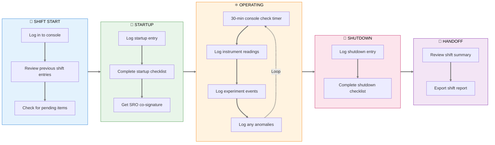
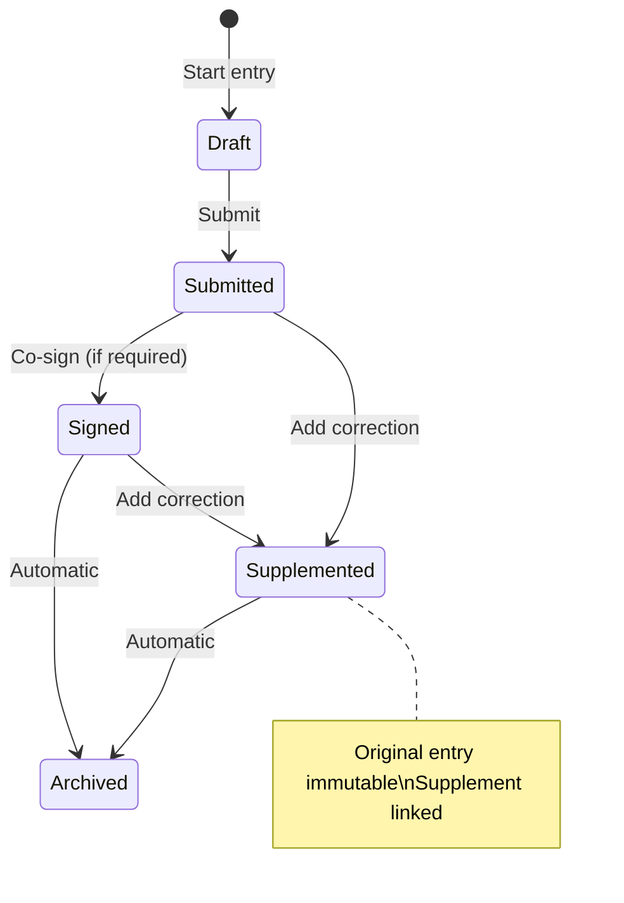
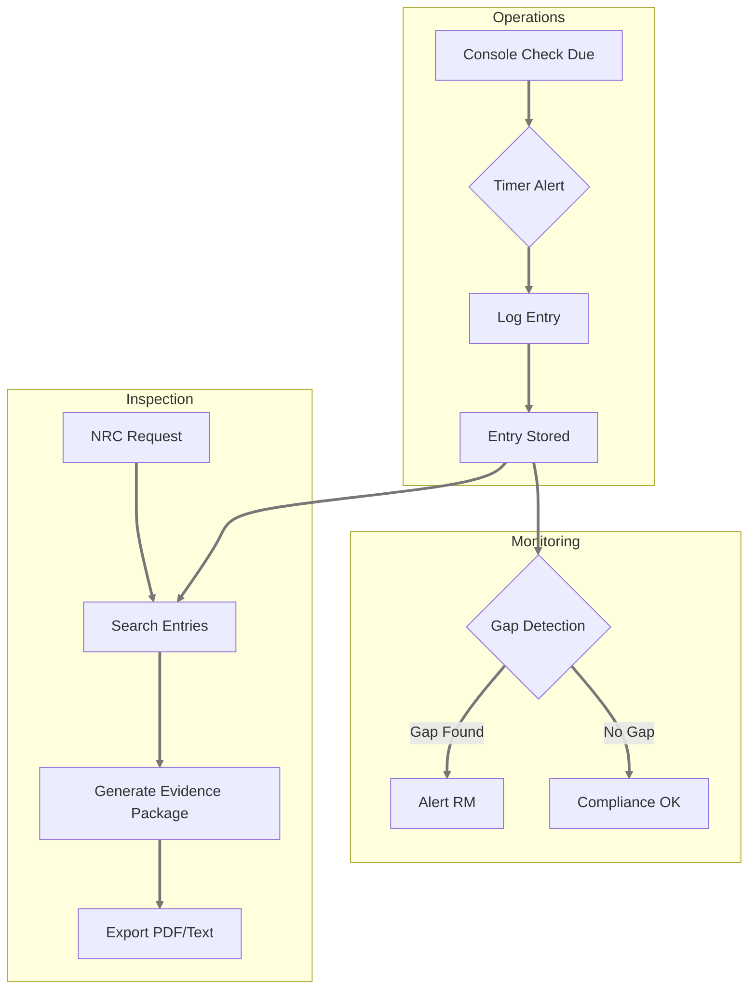
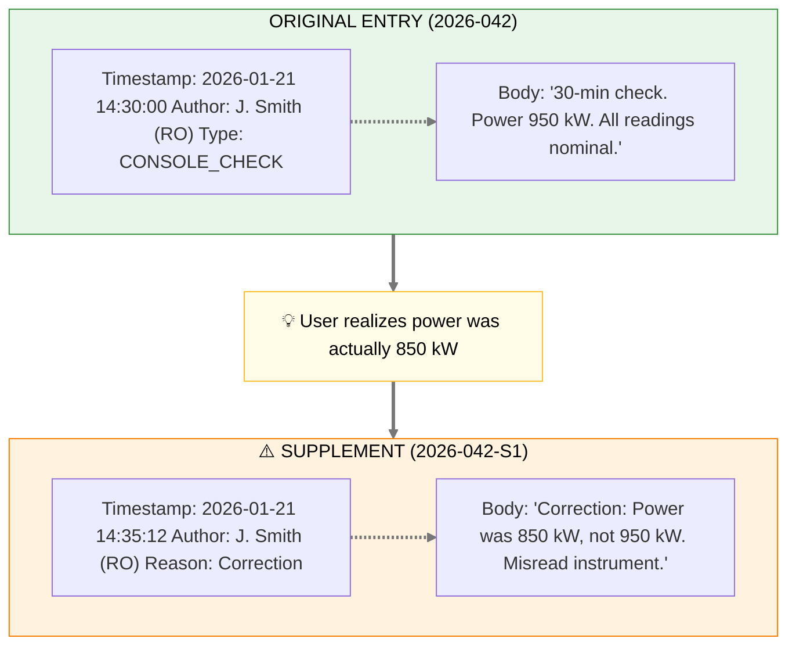
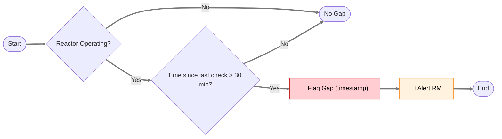
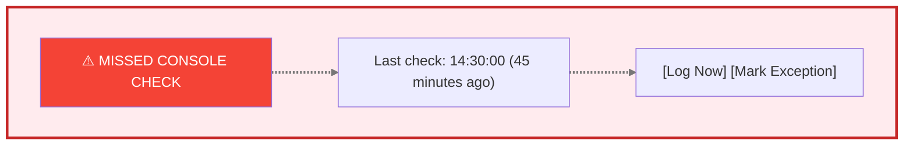
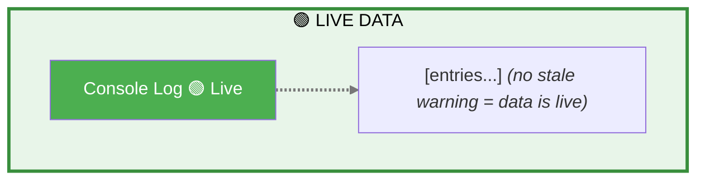

# Product Requirements Document: Reactor Ops Log

> **Implementation Status: 🔲 Not Started** — This PRD describes planned functionality. Implementation has not started.

**Module:** Reactor Ops Log
**Status:** Draft
**Last Updated:** March 5, 2026
**Stakeholder Input:** Jim (TJ), Nick Luciano (Jan 2026), Jay Torres (eLogger prototype)  
**Parent:** [Executive PRD](prd-executive.md)  
**Historical Reference:** Previously referred to as "elog" in some contexts  
**Prior Art:** Jay Torres' NETL eLogger prototype ([triga_dt_website/routes/operation_log_routes.py](../../TRIGA_Digital_Twin/triga_dt_website/routes/operation_log_routes.py))

---

## Executive Summary

The Reactor Ops Log captures reactor operations events, mandatory safety checks, and operational notes in a tamper-evident format that satisfies NRC regulatory requirements. It replaces the current paper-based console logbook with a digital system that maintains 10 CFR 50.9 compliance while enabling searchability, correlation with time-series data, and export for inspection.

---

## Ops Log vs. Experiment Log: A Unified System

### Background

Historically at NETL, Jim maintains **two separate physical logbooks**:
1. **Reactor Ops Log** — Console operations, 30-minute checks, startups/shutdowns, anomalies
2. **Reactor Experiment Log** — Experiment activities, sample insertions/removals, research notes

This separation exists due to **physical logistics** (different binders at different locations), not regulatory mandate. NRC cares about completeness and tamper-evidence, not which binder an entry lives in.

### Our Approach: Unified System, Separate Views

Neutron OS combines both logs into a **single system** with:
- **Entry type classification**: Each entry is tagged as `OPS` or `EXPERIMENT` (or both)
- **Filtered views**: Users can view Ops-only, Experiment-only, or combined chronological
- **Seamless navigation**: One-click toggle between views; cross-references visible in both
- **Single search**: Find any entry regardless of type
- **Unified audit trail**: All entries share the same tamper-evident infrastructure

### Why Combine?

| Benefit | Description |
|---------|-------------|
| **Correlation** | Ops events and experiment activities are often related—see both in context |
| **Single source of truth** | No confusion about which log to check |
| **Simpler compliance** | One export for NRC, filterable as needed |
| **Reduced duplication** | Operators don't log the same event in two places |
| **Training efficiency** | One system to learn, one interface |

### User Stories (Unified System)

- **As a reactor operator**, I want to quickly toggle between Ops view and All Entries view so I can focus on console operations but still see experiment context when needed.

- **As a researcher**, I want to filter to Experiment entries for my samples while still seeing relevant Ops entries (startups, power changes) that affected my irradiation.

- **As an NRC inspector**, I want to export all entries for a date range and filter by type as needed during review.

### Entry Type Examples

| Entry | Type | Notes |
|-------|------|-------|
| 30-minute console check | `OPS` | Mandatory operational |
| Reactor startup | `OPS` | Operational milestone |
| Sample insertion (NAA-042) | `EXPERIMENT` | Researcher activity |
| Sample removal with dose rate | `OPS` + `EXPERIMENT` | Both (ops performed, experiment record) |
| Power change for experiment | `OPS` | Operational, but linked to experiment |
| Anomaly during irradiation | `OPS` + `EXPERIMENT` | Safety-relevant to both |

---

## User Journey Map

### Reactor Operator: Daily Shift



### Entry Lifecycle



### Compliance Flow



---

## Stakeholder Insights

### Current State and Challenges (from Jim)

> "We have attempted to use the elog software as a training exercise to familiarize ourselves with digital/electronic elog software. We found that it is a steep learning curve for the 'older' ops staff. I believe it would be useful to have a modeler/designer come to the NETL and investigate and review our current system. Perhaps we could have a designer come to the NETL while operating and then design/massage the elog software according to our users' needs."

*Note: "elog" here refers to third-party electronic logbook software Jim evaluated, not Neutron OS.*

### Mandatory Checks Gap

> "A gap would mean that the :30 minute check was not performed when operating. When operating at the NETL, we are required to perform a console 'walkdown' every 30 minutes. During this check, we take readings from various instruments and log them in the elog."

*Note: "elog" here refers to the reactor operations logbook, now the Reactor Ops Log in Neutron OS.*

### Regulatory Context

> "NRC inspects documents yearly... they normally only look at half of the records, and we don't have to go back past the 2 years of operation in many cases. They prefer electronic documents."

**Key Compliance Numbers (from Jim):**
- **Inspection periodicity**: NRC inspects half of records each year (effectively 2-year coverage)
- **Evidence package scope**: 2 years of operational records
- **Preferred format**: Electronic (PDF + plain text archive)
- **Operator requalification**: 4 hours/quarter minimum console time required

### Tamper-Proof Requirements

> "Supplemental comments. The only way to 'edit' an entry should be a supplement. No deleting an entry—you should simply be able to add a supplement which identifies and corrects the mistake."

### Experiment Categories

> "We have a schedule of Authorized Experiments. These experiments are authorized by the ROC (Reactor Oversight Committee) after review through NETL Staff (Reactor Manager/HP/Director - Then ROC chair). Routine Experiments are performed as they are covered under an Authorized Experiment."

---

## User Stories

### Primary Users

| User | Need |
|------|------|
| **Reactor Operator (RO)** | Log events quickly without disrupting console attention |
| **Senior Reactor Operator (SRO)** | Review and co-sign entries, see shift summary |
| **Reactor Manager (RM)** | Review logs, authorize routine experiments, generate reports |
| **NRC Inspector** | Search and export records for compliance verification |
| **Health Physics (HP)** | Access radiation survey entries, correlate with dosimetry |

### User Stories

1. **As a reactor operator**, I want to log the 30-minute console check with minimal clicks so that I can return attention to the console quickly.

2. **As a reactor operator**, I want a timer/reminder for mandatory checks so that I don't miss the 30-minute window.

3. **As a SRO**, I want to see all entries from my shift in chronological order so that I can review before sign-off.

4. **As a RM**, I want to be alerted if mandatory checks are missed so that I can follow up.

5. **As an NRC inspector**, I want to search entries by date range, category, and operator so that I can efficiently review records.

6. **As any user**, I want to add supplemental comments to correct errors without modifying the original entry so that the audit trail is preserved.

7. **As a reactor manager**, I want to track each operator's console hours per quarter so that I can ensure they meet the 4-hour/quarter minimum for requalification.

8. **As a reactor manager**, I want to generate NRC evidence packages covering the most recent 2 years of records so that I can efficiently prepare for inspections.

---

## Entry Types and Categories

Based on stakeholder feedback:

### Mandatory Entry Types

| Type | Trigger | Required Fields | Interval |
|------|---------|-----------------|----------|
| `CONSOLE_CHECK` | Timer / Manual / **Auto-sense (TBD)** | Instrument readings, operator initials | Every 30 min while operating |
| `STARTUP` | Manual | Startup checklist items, authorization | Per startup |
| `SHUTDOWN` | Manual | Shutdown reason, checklist | Per shutdown |
| `SCRAM` | Manual (or auto-triggered) | Cause, rod positions, recovery actions | Per event |
| `RADIATION_SURVEY` | Manual | Location, reading, instrument | Per survey |

### Optional Entry Types

| Type | Use Case |
|------|----------|
| `EXPERIMENT_LOG` | Experiment start/stop, sample insertion/removal |
| `MAINTENANCE` | Equipment issues, repairs, calibrations |
| `VISITOR` | Visitor log entries |
| `GENERAL_NOTE` | Anything not fitting other categories |
| `SUPPLEMENT` | Correction/addition to existing entry |
| `EXCESS_REACTIVITY` | Burnup measurement via excess reactivity after long shutdown |
| `DOSE_RATE` | Radiation survey results, dose rate measurements |

### Experiment Authorization Categories

From Jim:

| Category | Approval Level | Description |
|----------|----------------|-------------|
| **Authorized Experiment** | ROC (Reactor Oversight Committee) | Full safety review through RM/HP/Director chain |
| **Routine Experiment** | RM or SSRO | Covered under existing Authorized Experiment |

### Entry Tags (User-Assignable)

From Jim: Categories help with searchability and NRC inspection preparation.

| Tag | Use Case | Example |
|-----|----------|--------|
| `pnt-sample` | Pneumatic transfer operations | Sample insertion/removal via TPNT/EPNT |
| `excess-reactivity` | Core performance tracking | Post-shutdown reactivity measurement (~-49 cents) |
| `dose-rate` | Radiation protection | Frisker readings, survey results |
| `startup` | Reactor mode change | Criticality approach, power ascension |
| `shutdown` | Reactor mode change | Planned or unplanned shutdown |
| `maintenance` | Equipment-related | Calibrations, repairs, replacements |
| `visitor` | Personnel tracking | Tours, inspections, vendor visits |

---

## Run Number Tracking

Each operating day is assigned a sequential **Run Number** that groups all entries for that operational period. Run numbers provide shift-level granularity for reporting and export.

| Field | Description | Example |
|-------|-------------|--------|
| **Run Number** | Sequential identifier within calendar year | `2026-047` |
| **Run Date** | Calendar date of operating day | `2026-03-05` |
| **Shift(s)** | Shifts covered by this run | Day, Night, or both |

**Run Number Behavior:**
- Run numbers are unique and sequential within a calendar year
- A run begins when the reactor transitions from shutdown to operating
- A run ends when the reactor returns to shutdown (or at shift boundary)
- Entries are grouped by run number for shift-level views and exports
- Run number appears on all exports (PDF, plain text, NRC package)

**User Story:** *"As a reactor manager, I want to pull all log entries for Run 2026-047 so I can review that operating day's activities in context."*

---

## Keyboard Shortcuts

**Design Origin:** Adapted from Jay Torres' NETL eLogger prototype, which demonstrated significant efficiency gains from keyboard shortcuts for common operational phrases.

Operators log the same phrases repeatedly during operations. Keyboard shortcuts eliminate repetitive typing and reduce entry time.

### Standard Shortcuts (Facility-Configurable)

| Shortcut | Default Phrase | Entry Type | Customizable |
|----------|---------------|------------|---------------|
| `Ctrl+Shift+1` | "Commence reactor startup checks" | `STARTUP` | Yes |
| `Ctrl+Shift+2` | "Reactor startup checks complete" | `STARTUP` | Yes |
| `Ctrl+Shift+3` | "Commence reactor startup" | `STARTUP` | Yes |
| `Ctrl+Shift+4` | "Increasing reactor power" | `POWER_CHANGE` | Yes |
| `Ctrl+Shift+5` | "Reactor at power" | `STEADY_STATE` | Yes |
| `Ctrl+Shift+6` | "Decreasing reactor power" | `POWER_CHANGE` | Yes |
| `Ctrl+Shift+7` | "Commence reactor shutdown" | `SHUTDOWN` | Yes |
| `Ctrl+Shift+8` | "Reactor shutdown" | `SHUTDOWN` | Yes |
| `Ctrl+Shift+9` | "Commence reactor shutdown checks" | `SHUTDOWN` | Yes |
| `Ctrl+Shift+0` | "Reactor shutdown checks complete" | `SHUTDOWN` | Yes |

### Voice Equivalents

Voice shortcuts provide the same efficiency for hands-free operation (see [Agent Capabilities PRD](prd-agents.md) GOAL_PLT_001):

| Voice Command | Action |
|---------------|--------|
| "Log: Commence startup checks" | Creates STARTUP entry with phrase |
| "Log: Reactor at power" | Creates STEADY_STATE entry |
| "Log: Console check complete" | Creates CONSOLE_CHECK entry |

### Facility Customization

Shortcuts are defined in `config/keyboard_shortcuts.yaml`:

```yaml
keyboard_shortcuts:
  ctrl_shift_1:
    phrase: "Commence reactor startup checks"
    entry_type: STARTUP
    voice_trigger: "commence startup checks"
    
  ctrl_shift_5:
    phrase: "Reactor at power"
    entry_type: STEADY_STATE
    voice_trigger: "reactor at power"
    
  # Facility-specific additions
  ctrl_shift_q:
    phrase: "Pneumatic sample inserted"
    entry_type: EXPERIMENT_LOG
    voice_trigger: "sample inserted"
```

---

## Auto-Save Behavior

The Ops Log supports low-friction data entry inspired by paper logbook workflows, where operators write continuously without explicit "save" actions.

### Entry States

| State | Description | Audit Status |
|-------|-------------|-------------|
| **Draft** | Entry being composed; auto-saved on blur/keystroke | Not in audit trail |
| **Submitted** | Entry explicitly submitted; timestamp + hash assigned | In audit trail |
| **Closed** | Entry from closed shift; read-only | Immutable |

### Auto-Save Rules

1. **Drafts auto-save** on:
   - Every 5 seconds while typing (debounced)
   - Focus blur (operator clicks away)
   - Enter key (if not submitting)
   
2. **Explicit submit required** for official entry:
   - Submit button or `Ctrl+Enter`
   - Assigns immutable timestamp + cryptographic hash
   - Entry enters audit trail

3. **Inline editing** (contenteditable cells) permitted for drafts:
   - Once submitted, editing is disabled
   - Corrections via supplement only

**User Story:** *"As a reactor operator, I want my log entries to save automatically as I type so I don't lose work if I'm interrupted."*

---

## Data Schema

### Entry Schema

```yaml
entry:
  id: uuid (system-generated)
  entry_number: integer (sequential within year, e.g., 2026-001)
  timestamp: datetime (system clock, immutable)
  entry_type: enum (see types above)
  author_id: uuid (logged-in operator)
  author_name: string (display name)
  co_signer_id: uuid (optional, for dual-sign entries)
  
  # Content
  title: string (brief summary)
  body: text (detailed entry)
  
  # Structured data (type-dependent)
  instrument_readings: json (for CONSOLE_CHECK)
  checklist_items: json (for STARTUP/SHUTDOWN)
  
  # Metadata
  reactor_mode: enum (shutdown, startup, steady-state, power-change)
  reactor_power_kw: decimal (auto-populated from time-series)
  
  # Supplements
  supplements: array of supplement objects
  
  # Audit
  created_at: datetime
  ip_address: string (for audit trail)
  signature_hash: string (cryptographic verification)
```

### Supplement Schema

```yaml
supplement:
  id: uuid
  parent_entry_id: uuid
  timestamp: datetime
  author_id: uuid
  author_name: string
  reason: enum (correction, clarification, addition)
  body: text
  signature_hash: string
```

---

## Tamper-Evidence Implementation

Per Jim's requirement ("No deleting an entry—you should simply be able to add a supplement"):

### Design Principles

1. **Append-only storage**: Entries are INSERT-only. No UPDATE or DELETE operations on entry content.

2. **Cryptographic signatures**: Each entry is hashed with the previous entry's hash (HMAC-SHA256 chain), making retroactive modification detectable. Implementation: `TamperEvidentChain` in `neutron_os.infra.state` — the same class used by the System Audit Log. Key source: `NEUT_OPS_LOG_HMAC_KEY` (separate from the audit log key). See [Logging Tech Spec §7](../tech-specs/spec-logging.md#7-hmac-chain) for the shared algorithm.

3. **Supplements for corrections**: Any modification is captured as a linked supplement with its own timestamp and author.

4. **Audit log**: All access (read/write) is logged with user ID, timestamp, and IP address.

### Example: Correcting an Error



---

## Mandatory Check Timer

### Requirements

- Visual countdown timer showing time until next mandatory check
- Audible alert at 25 minutes (5-minute warning) and 30 minutes (deadline)
- Entry form pre-populated when timer triggers
- Dashboard indicator showing "missed checks" count per shift

### Gap Detection

From Jim: "A gap would mean that the :30 minute check was not performed when operating."

**Detection logic:**



**Dashboard alert:**



---

## Export Requirements

From Jim: "Export to PDF would work, but a simple text file for archive and future proof would also work."

### Export Formats

| Format | Use Case | Contents |
|--------|----------|----------|
| **PDF** | NRC inspection, official records | Formatted, includes signatures, page numbers |
| **Plain Text** | Archive, future-proofing | Human-readable, no proprietary format dependencies |
| **CSV** | Analysis, data mining | Structured, importable to spreadsheets |
| **JSON** | API integration, backups | Machine-readable, includes all metadata |

**Archive Integrity (from Jim):**
> "Concerned about software failure/migration. Text archives could be modified."

**Design Response:**
- PDF exports include cryptographic signatures (verifiable)
- Plain text archives include SHA-256 checksums
- Both formats exported together for redundancy
- Checksums stored in tamper-evident audit trail (Hyperledger)
- Regular automated export to long-term storage (prevents software dependency)

### Export Filters

- Date range
- Entry type(s)
- Author(s)
- Keyword search
- Include/exclude supplements

---

## UI Mockup Concepts

### Console View (Primary Interface During Operations)

*Note: UI header and entry buttons are facility-configurable. Example shows research reactor profile.*

```
┌─────────────────────────────────────────────────────────────────────┐
│  {FACILITY_NAME} OPERATIONS LOG         [2026-01-21]  [Shift: Day] │
│  Operator: J. Smith (RO)        ┌────────────────────────────────┐ │
│  Power: 950 kW                  │  NEXT CHECK IN: 12:45          │ │
│  Status: OPERATING              │  ████████████░░░░░░░░░  [Log]  │ │
│  Run #: 2026-047                └────────────────────────────────┘ │
├─────────────────────────────────────────────────────────────────────┤
│                                                                     │
│  [+ New Entry ▼]  [Console Check]  [Experiment]  [General Note]    │
│                                                                     │
│  ═══════════════════════════════════════════════════════════════   │
│  RECENT ENTRIES                                                     │
│  ═══════════════════════════════════════════════════════════════   │
│                                                                     │
│  14:30 │ CONSOLE_CHECK │ 30-min check. All readings nominal.       │
│        │ J. Smith      │                                  [Detail] │
│  ─────────────────────────────────────────────────────────────────  │
│  14:15 │ EXPERIMENT    │ Sample Au-foil-042 inserted in TPNT.      │
│        │ J. Smith      │ Ops Request 4521.               [Detail] │
│  ─────────────────────────────────────────────────────────────────  │
│  14:00 │ CONSOLE_CHECK │ 30-min check. Power raised to 950 kW.     │
│        │ J. Smith      │                                  [Detail] │
│  ─────────────────────────────────────────────────────────────────  │
│  13:30 │ STARTUP       │ Startup complete. Reaching 500 kW.        │
│        │ J. Smith      │ Co-signed: M. Jones (SRO)        [Detail] │
│                                                                     │
└─────────────────────────────────────────────────────────────────────┘
```

### Quick Console Check Entry

```
┌─────────────────────────────────────────────────────────────────────┐
│  30-MINUTE CONSOLE CHECK                               [Cancel] [X]│
├─────────────────────────────────────────────────────────────────────┤
│                                                                     │
│  Time: 15:00:00 (auto)          Power: 950 kW (auto from DCS)      │
│                                                                     │
│  ┌─────────────────────────────────────────────────────────────┐   │
│  │ INSTRUMENT READINGS (auto-populated where available)        │   │
│  ├─────────────────────────────────────────────────────────────┤   │
│  │ Channel A: [___] %    Channel B: [___] %                    │   │
│  │ Pool Temp: [___] °F   Coolant Temp: [___] °F               │   │
│  │ Rod A: [___] %        Rod B: [___] %                        │   │
│  └─────────────────────────────────────────────────────────────┘   │
│                                                                     │
│  Notes: [All readings nominal____________________________]          │
│                                                                     │
│  ☑ I have performed a physical console walkdown                    │
│                                                                     │
│                                                       [Submit]      │
└─────────────────────────────────────────────────────────────────────┘
```

### Entry Detail View (with Supplement)

```
┌─────────────────────────────────────────────────────────────────────┐
│  ENTRY 2026-042                                        [Back] [PDF]│
├─────────────────────────────────────────────────────────────────────┤
│                                                                     │
│  Type: CONSOLE_CHECK                                                │
│  Timestamp: 2026-01-21 14:30:00                                     │
│  Author: J. Smith (RO)                                              │
│  Reactor Power: 950 kW                                              │
│                                                                     │
│  ───────────────────────────────────────────────────────────────    │
│  CONTENT                                                            │
│  ───────────────────────────────────────────────────────────────    │
│  30-minute console check. Power 950 kW. All readings nominal.       │
│  Channel A: 48%, Channel B: 47%                                     │
│                                                                     │
│  ───────────────────────────────────────────────────────────────    │
│  ⚠️ SUPPLEMENT (2026-01-21 14:35:12)                                │
│  ───────────────────────────────────────────────────────────────    │
│  Author: J. Smith (RO)                                              │
│  Reason: Correction                                                 │
│                                                                     │
│  Correction: Power was 850 kW, not 950 kW. Misread instrument.     │
│                                                                     │
│  ───────────────────────────────────────────────────────────────    │
│                                              [Add Supplement]       │
│                                                                     │
│  Signature Hash: a3f8c2...d91e (verified ✓)                        │
└─────────────────────────────────────────────────────────────────────┘
```

---

## Technical Requirements

### Data Freshness & Real-Time Architecture

> **Design Decision:** Streaming-first architecture. Real-time is the default; batch for aggregations and fallback.
>
> See [ADR 007](adr-007-streaming-first-architecture.md)

**Reactor Ops Log Latency Targets:**

| Feature | Target Latency | Implementation | Priority |
|---------|---------------|----------------|----------|
| **Entry sync across consoles** | <500ms | WebSocket push | 🔴 High |
| **30-minute check timer** | <100ms | Real-time shared countdown | 🔴 High |
| **Concurrent editing awareness** | <200ms | Live "Nick is typing..." via WebSocket | 🔴 High |
| **Search results** | <2s | Near-real-time indexed | 🟡 Medium |
| **Compliance gap alerts** | <30s | Streaming alert push | 🟡 Medium |
| **Historical aggregations** | Minutes | Batch job (Dagster) | 🟢 Low |

**UI Pattern:** Live is the default. Warnings appear only when streaming is degraded:



### Performance

- Entry submission < 1 second (operators cannot wait during operations)
- Search results < 3 seconds for 2-year date range
- Export PDF < 10 seconds for 1-month range

### Reliability

- Offline-capable: Must function if network is temporarily unavailable
- Local cache syncs when connectivity restored
- No data loss scenario acceptable

### Security

- Authentication required (linked to facility badge/credentials)
- Role-based access: RO can create entries; RM can view all and generate reports
- All access logged for audit

---

## Operational Procedures and Continuity

All operational requirements are defined system-wide in the master technical specification. This section provides Ops Log-specific clarifications and applies those cross-cutting requirements to reactor operations logging.

**See:** [Master Tech Spec § 9: Operational Requirements & Continuity](../tech-specs/spec-executive.md#9-operational-requirements--continuity)

This includes:
- **Day-End Close-Out** (§9.1): Entry immutability, supplement allowance, shift boundaries
- **Backup & Archive** (§9.2): Cloud, local drive, printed archives, retention policy
- **Multi-Facility Configuration** (§9.3): Customizable forms, facility-specific dropdowns
- **Deployment Topology** (§9.4): Phased control room deployment, network architecture
- **Testing Phase & Operator Confidence** (§9.5): Dual-logging procedures, transition plan
- **System Resilience & Downtime** (§9.6): Offline-first, local cache, hand-log fallbacks

---

### Day-End Close-Out (Ops Log Clarifications)

> **Requirement:** Operators want the log to be "closed out" at the end of the day.

**Clarification Needed:** Define "closed out" and its implications:

| Concept | Status | Definition |
|---------|--------|-----------|
| **Read-Only Period** | Proposed | After shift ends, entries from that shift become read-only (no further edits allowed) |
| **Supplements Still Allowed** | Proposed | Supplements can be added even to closed shifts (for corrections discovered later) |
| **Immutability Boundary** | To Define | When does the log become permanently immutable? 24 hours? 1 week? Per regulatory requirement? |
| **Shift Manager Sign-Off** | To Define | Does a shift manager need to formally "close" the log, or is it automatic at end-of-shift time? |

**Design Options:**

1. **Automatic Close (Recommended)**: Log entries automatically become read-only at end-of-shift timestamp (e.g., 16:00 for day shift). Supplements still allowed.
2. **Manual Close**: SRO/Shift Manager explicitly clicks "Close Shift" button; log becomes read-only.
3. **Time-Locked Close**: Entries older than 24 hours become read-only; recent entries remain editable.

**Implementation Consideration:** Supplement-only model (no deletes, no edits) already enforces immutability if we lock the entry itself post-close.

### Backup and Archive Requirements

> **Requirement:** Operators want one or more hard and soft backups for the elog. Initially, this could be printing out hard copies (weekly, monthly) or a hard-drive backup.

**Backup Strategy:**

| Backup Type | Frequency | Storage | Purpose |
|-------------|-----------|---------|---------|
| **Automated Cloud Backup** | Continuous | Off-site storage (AWS/GCP) | Primary disaster recovery |
| **Encrypted Local Backup** | Daily | Facility network drive | Fast recovery, no internet dependency |
| **Printed Hard Copy Archives** | Weekly/Monthly | Physical filing cabinet | Regulatory audit trail, offline reference |
| **Portable Hard Drive** | Monthly | Lockable storage | Secure offline archive, facility-controlled |
| **Plain-Text Archive Export** | Weekly | Multiple media | Future-proof (readable without software) |

**Operator Interaction:**
- Weekly manual export to PDF + plain text for facility records (operators print/file)
- System automatically syncs to encrypted local drive
- Cloud backup is transparent (automatic daily)
- Operators can request on-demand export anytime

**Retention Policy (to be finalized):**
- Live system: 2 years (NRC inspection window)
- Offline archive: 7+ years (regulatory requirement, facility-specific)

### Data Entry Forms and Customization

> **Requirement:** Operators want to enter data in the format they are accustomed to. They need specific data forms.

**Current Facility-Specific Forms:**

| Entry Type | Current Format | Data Fields | Customization |
|------------|-------|---|---|
| **CONSOLE_CHECK** | Handwritten checklist | Time, power, pool temp, rod position, channels A/B, operator initials | Fixed (federally required) |
| **STARTUP** | Startup checklist | Procedure steps, authorization, sign-offs | Facility-configurable |
| **SHUTDOWN** | Shutdown log | Reason (planned/emergency), steps completed | Facility-configurable |
| **EXPERIMENT_LOG** | Experiment notebook | Sample ID, irradiation params, dose rate, handler notes | Researcher-driven; facility templates available |

**Design Approach:**
- Core console check form is standardized (meets NRC requirements)
- Other entry types allow facility-specific fields via configuration
- Dropdown menus for common values (experiment types, shutdown reasons)
- Pre-fill templates for routine entries
- Ability to save custom templates for "standard NAA irradiation," "standard INAA," etc.

### Server Location (Control Room Deployment)

> **Requirement:** Operators need the elog server to be (eventually) located in the control room.

**Phased Deployment:**

| Phase | Location | Network | Redundancy | Target |
|-------|----------|---------|------------|--------|
| **Phase 1 (MVP)** | Off-site (TACC/Cloud) | Fiber to facility | Internet-dependent | Q2 2026 |
| **Phase 1.5** | Facility network (back office) | Fiber from control room | Local failover ready | Q3 2026 |
| **Phase 2** | Control room console | Direct network | Mirrored local + cloud | 2027 |

**Control Room Deployment Considerations:**
- **Environment**: Control room has strict physical security, temperature control, limited physical space
- **Network**: Must tie into facility network without compromising reactor control systems
- **Redundancy**: Dual network paths (primary + backup) to prevent single-point-of-failure
- **UPS/Power**: Must survive facility power loss for ≥15 minutes (allow graceful shutdown or hand-off to backup system)
- **Operator Interface**: Console-accessible display (monitor arm, touchscreen, or hardened tablet)

**Interim Solution (Phase 1):** Cloud-based system with local fiber connection to control room. Operators access via facility workstation in control room annex (5 feet from console).

### Testing Phase Procedures

> **Requirement:** Operators need to define their procedures for logging while the elog is in testing phase. Initially, they will likely perform double duty during testing, recording both a hand-log and an electronic log. Once they gain confidence in the elog, they will rely on the elog exclusively.

**Testing Phase Plan:**

| Phase | Duration | Logging Method | Operator Role | Success Metrics |
|-------|----------|---|---|---|
| **Phase 0: Dry Run** | 1-2 weeks | Hand-log only + Parallel training | Ops staff learn system off-shift | No errors in system familiarization |
| **Phase 1: Parallel (Dual Logging)** | 4-6 weeks | Hand-log + Electronic log | Both logged each shift; hand-log is "source of truth" | >95% data consistency between logs |
| **Phase 2: Trust-Building** | 4 weeks | Hand-log + Electronic log (reduced) | Electronic log primary; hand-log for cross-check | Operators gain confidence; >99% agreement |
| **Phase 3: Cutover** | Ongoing | Electronic log only | Full reliance; hand-log only for emergency | NRC-approved transition; no data loss |

**Dual-Logging Workflow (Phase 1):**
- Operators make entry in hand-log (as usual)
- Same operators (or cross-shift buddy) enter data into electronic log within 1 hour
- Daily reconciliation: Compare hand-log and electronic log entries for gaps/discrepancies
- Facility manager reviews reconciliation report
- Any discrepancies resolved before shift closes

**Confidence Checkpoints:**
- Week 2: No missed entries between logs
- Week 4: Operators comfortable with system (no support needed)
- Week 8: Formal sign-off by facility manager and ops staff to proceed with Phase 3

**Training Requirements:**
- System orientation (1 hour on-shift)
- Hands-on practice (1 shift of parallel logging with support staff present)
- Q&A session post-training
- Written acknowledgment that operator understands system

### System Unavailability / Downtime Procedures

> **Requirement:** Operators need to define their procedure for what to do when the elog is inaccessible (revert to hand logs? Send a time-stamped email to somewhere? Have a local elog instance capture the data?).

**Availability Tiers and Fallback:**

| Scenario | Duration | Fallback Method | Data Recovery |
|----------|----------|---|---|
| **Network Latency** | <5 seconds | Queue entries locally; sync when restored | Automatic sync, no data loss |
| **Temporary Outage** | 5 min – 1 hour | Use local cache; hand-log backup entries | Sync on reconnect + manual reconciliation |
| **Extended Outage** | 1 hour – shift | Switch to hand-log; email entries to ops email | Manual re-entry post-recovery |
| **Complete System Failure** | Shift+ | Full hand-log; timestamp each entry; print/archive | Scheduled re-entry during next business day |

**Detailed Fallback Procedures:**

1. **Latency/Brief Outage (Local Cache Mode)**
   - System detects network issue
   - Operator receives on-screen notification: "Network latency detected. Entries are queuing locally and will sync when connection restored."
   - Operators continue logging normally (UI is responsive, data is cached)
   - No action required; automatic sync happens

2. **Extended Outage (Hand-Log Fallback)**
   - System unavailable for >1 hour
   - Operator reverts to **printed hand-log form** (stored at console)
   - Each entry includes: Time, operator initials, entry type, content
   - At end of shift, operator takes photos/scans of hand-log pages
   - Email scans to: **elog-backup@facility.edu** with subject: "Backup Entries [Shift Date]"
   - Include filename: `elog-backup-2026-01-21-dayshift.pdf`

3. **Data Recovery Post-Outage**
   - Facility IT restores system from backup
   - Facility manager (or designee) manually re-enters hand-log entries into system
   - Timestamp used: Original entry time (from hand-log)
   - Note added to each entry: "Re-entered from hand-log backup due to [outage date/reason]"
   - Appendix added to shift summary: "XXX entries re-entered from backup on [date]"

**Local elog Instance (Future Option)**
> "Have a local elog instance capture the data?"

Design consideration for Phase 2:
- Ruggedized local server in facility server room (redundant to cloud)
- Runs on facility network only; syncs to cloud when connectivity restored
- Adds complexity and cost; defer to Phase 2 if needed

**Preferred: Hybrid Approach (Recommended)**
- Hand-log forms + email capture (low cost, reliable, operator-familiar)
- Local network backup drive for sync (added security; no cloud dependency during outage)
- Invest in local elog server only if hand-log procedure proves insufficient

### Hand-Log Form Design

> **Goal:** Design a printed form that operators fill during outages, then rapidly OCR + import back into the system post-recovery.

**Design Principles for OCR Readiness:**

1. **High contrast**: Black text/checkboxes on white background; avoid grays or light colors
2. **Structured layout**: Fixed field positions (same location on every form for machine recognition)
3. **Clear boundaries**: Visible boxes/lines defining each field
4. **Block letter encouragement**: Printed text is more OCR-friendly than cursive
5. **Avoid free-form**: Use dropdowns, checkboxes, and fill-in-blanks instead of open narrative where possible
6. **Sequential numbering**: Entry number printed for tracking and verification
7. **Barcode/QR**: Optional metadata (date, shift, page number) for fast sorting post-scan

**Hand-Log Form Layout:**

*Note: Header is facility-configurable.*

```
┌──────────────────────────────────────────────────────────────────────┐
│                   {FACILITY_NAME} REACTOR OPS LOG                    │
│                     EMERGENCY BACKUP ENTRY FORM                      │
├──────────────────────────────────────────────────────────────────────┤
│                                                                      │
│  ENTRY #: __________    DATE: __/__/____  SHIFT: □ Day □ Night     │
│                                                 □ Owl                │
│                                                                      │
│  ┌──────────────────────────────────────────────────────────────┐   │
│  │ TIME:  __:__ AM/PM   OPERATOR NAME: _____________________    │   │
│  └──────────────────────────────────────────────────────────────┘   │
│                                                                      │
│  ┌──────────────────────────────────────────────────────────────┐   │
│  │ ENTRY TYPE (CHECK ONE):                                      │   │
│  │ □ Console Check     □ Startup      □ Shutdown              │   │
│  │ □ Experiment Log    □ Scram        □ General Note           │   │
│  │ □ Maintenance       □ Radiation Survey    □ Other: ____    │   │
│  └──────────────────────────────────────────────────────────────┘   │
│                                                                      │
│  ┌──────────────────────────────────────────────────────────────┐   │
│  │ REACTOR STATUS:                                              │   │
│  │ Power: __________ kW    Mode: □ Shutdown  □ Operating      │   │
│  │ Pool Temp: __________ °F    Coolant Temp: __________ °F   │   │
│  └──────────────────────────────────────────────────────────────┘   │
│                                                                      │
│  ┌──────────────────────────────────────────────────────────────┐   │
│  │ ENTRY DETAILS:                                               │   │
│  │ ________________________________________________________________ │   │
│  │ ________________________________________________________________ │   │
│  │ ________________________________________________________________ │   │
│  │ ________________________________________________________________ │   │
│  │ ________________________________________________________________ │   │
│  └──────────────────────────────────────────────────────────────┘   │
│                                                                      │
│  ┌──────────────────────────────────────────────────────────────┐   │
│  │ TAGS (IF APPLICABLE):                                        │   │
│  │ □ pnt-sample    □ dose-rate     □ excess-reactivity        │   │
│  │ □ maintenance   □ startup       □ shutdown                  │   │
│  └──────────────────────────────────────────────────────────────┘   │
│                                                                      │
│  ┌──────────────────────────────────────────────────────────────┐   │
│  │ SIGNATURE SECTION:                                           │   │
│  │ Co-Signature Required? □ Yes  □ No                          │   │
│  │ Operator Initials: ___   Signature: __________________      │   │
│  │ SRO Name (if req'd): _________________ Signature: _______  │   │
│  └──────────────────────────────────────────────────────────────┘   │
│                                                                      │
└──────────────────────────────────────────────────────────────────────┘
```

**Form Specifications for OCR:**

| Field | Type | OCR Optimization | Notes |
|-------|------|------------------|-------|
| **ENTRY #** | Text | Printed sequential number | System-assigned post-recovery |
| **DATE** | Date field | MM/DD/YYYY format; fixed boxes | Machine-readable date |
| **SHIFT** | Checkbox | Clear, large boxes | □ preferred over other symbols |
| **TIME** | Time field | HH:MM with AM/PM boxes | 24-hr time; fixed field width |
| **OPERATOR NAME** | Handwritten | Printed block letters encouraged | Post-OCR validation required |
| **ENTRY TYPE** | Checkbox | Clear boxes; one selected | OCR recognizes checked state |
| **POWER/TEMP fields** | Numeric | Right-aligned, fixed width | OCR handles numeric well |
| **ENTRY DETAILS** | Handwritten | Large box; line-spaced | OCR will flag for manual review |
| **TAGS** | Checkbox | Predefined checkboxes only | No free-form tags on paper |
| **SIGNATURES** | Handwritten | Signature boxes; space for initials | Initials more OCR-friendly |

**OCR Workflow (Post-Outage Recovery):**

```
1. SCAN
   └─ Operator scans hand-log pages at end of shift
      (High-res B&W scan, 300 dpi minimum)

2. OCR CONVERSION
   └─ Batch process forms through OCR engine (e.g., Tesseract, AWS Textract)
      Result: Structured data (JSON/CSV)

3. VALIDATION
   └─ Facility manager (or operator) reviews OCR output
      Checks:
      - Handwritten fields flagged for manual correction
      - Numeric fields verified (power, temperature)
      - Checkboxes correctly interpreted
      - Operator names matched to facility directory

4. IMPORT
   └─ Validated data → System import script
      Generates entries with:
      - timestamp = original entry time from hand-log
      - source = "hand-log-backup (outage 2026-01-21)"
      - status = "verified" or "requires_review"

5. AUDIT
   └─ Facility manager spot-checks 10% of imported entries
      Compares hand-log original vs. system entry
      Flags any discrepancies for manual correction
```

**Quality Assurance for OCR:**

| Field Type | Confidence Level | Action if < Threshold |
|------------|------------------|----------------------|
| **Structured fields** (date, time, power) | >95% | Reject, require manual re-entry |
| **Checkboxes** (entry type, tags) | >90% | Reject if ambiguous |
| **Handwritten names** | >75% | Flag for manual verification |
| **Free-form text** (entry details) | >80% | Flag for human review before import |

**Estimated Re-Entry Time (with OCR):**

| Method | Processing Time | Accuracy | Notes |
|--------|-----------------|----------|-------|
| **Manual re-entry** | 3-5 min per entry | 99% | Operator reads hand-log, types into system |
| **OCR + validation** | 1-2 min per entry (scanned batch) | 95-98% | Scan → OCR → spot-check |
| **OCR + minimal review** | 30 sec per entry | 90-95% | Fast but higher error rate; use for lower-priority entries |

**Recommended Approach:** Use OCR for high-volume catch-up (100+ entries) with sampled manual validation. Operators can review OCR results while facility manager imports validated batches.

---

## Reactor-Agnostic Configuration

The Ops Log is designed to work for **any commercial reactor type** — not just research reactors like TRIGA. Facility-specific configuration adapts the system to different reactor types, regulatory frameworks, and operational procedures.

### Supported Reactor Types

| Reactor Type | Examples | Configuration Profile |
|--------------|----------|----------------------|
| **Research Reactor** | TRIGA, PULSTAR, MIT NRL | `profile: research` |
| **Pressurized Water Reactor (PWR)** | Westinghouse AP1000, Vogtle | `profile: pwr` |
| **Boiling Water Reactor (BWR)** | GE ABWR, Peach Bottom | `profile: bwr` |
| **Small Modular Reactor (SMR)** | NuScale, BWRX-300 | `profile: smr` |
| **Advanced Reactor** | Xe-100, Natrium, Kairos | `profile: advanced` |
| **Molten Salt Reactor (MSR)** | MSRE heritage, Terrestrial | `profile: msr` |

### Configuration Profiles

Each reactor profile defines:

| Configuration | Research | PWR/BWR | SMR | Advanced |
|--------------|----------|---------|-----|----------|
| **Console check interval** | 30 min | 2 hours | 1 hour | Configurable |
| **Mandatory entry types** | CONSOLE_CHECK, STARTUP, SHUTDOWN, SCRAM | + TURBINE_TRIP, TECH_SPEC_ENTRY | + PASSIVE_SAFETY_CHECK | + FUEL_SALT_STATUS |
| **Operating modes** | Shutdown, Startup, Steady-State | + Hot Standby, Hot Shutdown, Cold Shutdown | + Passive Cooling | + Drain Tank |
| **Instrument readings** | Power, Pool Temp, Rods | RCS Temp/Pressure, SG Levels, Containment | Module-specific | Salt Temp, Flow, Chem |
| **Regulatory framework** | 10 CFR 50 (non-power) | 10 CFR 50 (power) | 10 CFR 50/52 | 10 CFR 50/52 |
| **Shift structure** | Day/Night | 12-hour rotating | Varies | Varies |

### Facility Configuration File

```yaml
# config/facility.yaml
facility:
  name: "Example Nuclear Station Unit 1"
  reactor_type: pwr
  profile: pwr
  regulatory_basis: "10 CFR 50"
  
  # Override defaults
  console_check_interval_minutes: 120
  shifts:
    - name: "A Shift"
      start: "07:00"
      end: "19:00"
    - name: "B Shift"
      start: "19:00"
      end: "07:00"
      
  # Operating modes for this facility
  operating_modes:
    - id: MODE_1
      name: "Power Operation"
      power_range: ">5% RTP"
    - id: MODE_2
      name: "Startup"
      power_range: "≤5% RTP, Keff ≥ 0.99"
    - id: MODE_3
      name: "Hot Standby"
      power_range: "Keff < 0.99, Tavg ≥ 350°F"
    - id: MODE_4
      name: "Hot Shutdown"
      power_range: "Keff < 0.99, 200°F ≤ Tavg < 350°F"
    - id: MODE_5
      name: "Cold Shutdown"
      power_range: "Keff < 0.99, Tavg < 200°F"
    - id: MODE_6
      name: "Refueling"
      power_range: "Keff < 0.95, ≥23 ft water above vessel flange"
      
  # Instrument readings for console checks
  instrument_readings:
    - id: rcs_tavg
      name: "RCS Tavg"
      unit: "°F"
      display_order: 1
    - id: rcs_pressure
      name: "RCS Pressure"
      unit: "psig"
      display_order: 2
    - id: przr_level
      name: "Pressurizer Level"
      unit: "%"
      display_order: 3
    # ... additional instruments
```

### Entry Type Extensions

Facilities can define custom entry types beyond the core set:

```yaml
# config/entry_types.yaml
entry_types:
  # Core types (always available)
  core:
    - CONSOLE_CHECK
    - STARTUP
    - SHUTDOWN
    - SCRAM
    - GENERAL_NOTE
    - SUPPLEMENT
    
  # Profile-specific types
  pwr:
    - TECH_SPEC_ENTRY      # LCO entry/exit
    - TURBINE_TRIP
    - LOAD_CHANGE
    - BORATION
    - DILUTION
    - MODE_CHANGE
    - CONTAINMENT_ENTRY
    
  research:
    - EXPERIMENT_LOG
    - RADIATION_SURVEY
    - EXCESS_REACTIVITY
    - DOSE_RATE
    - VISITOR
    
  # Facility-specific custom types
  custom:
    - id: FUEL_HANDLING
      name: "Fuel Handling Activity"
      requires_cosign: true
      fields:
        - assembly_id
        - from_location
        - to_location
```

### Keyboard Shortcut Profiles

Shortcuts are profile-aware:

| Profile | Ctrl+Shift+1 | Ctrl+Shift+5 | Ctrl+Shift+7 |
|---------|--------------|--------------|---------------|
| **Research** | "Commence startup checks" | "Reactor at power" | "Commence shutdown" |
| **PWR** | "Entering Mode 2" | "Reactor at 100% power" | "Commencing plant shutdown" |
| **BWR** | "Reactor startup initiated" | "Generator synchronized" | "Initiating normal shutdown" |

### Multi-Unit Support

For multi-unit sites, the Ops Log supports unit-aware logging:

```yaml
site:
  name: "Example Nuclear Station"
  units:
    - id: unit_1
      name: "Unit 1"
      reactor_type: pwr
    - id: unit_2
      name: "Unit 2"
      reactor_type: pwr
      
  # Shared entries (site-wide events)
  shared_entry_types:
    - SITE_EMERGENCY
    - GRID_EVENT
    - WEATHER_CONDITION
```

---

## Export Format: OPER-2 and Facility Procedures

**Design Origin:** Jay Torres' NETL eLogger exports PDFs matching the OPER-2 procedure format. This approach generalizes to any facility's operational procedures.

### PDF Export Template

Export PDFs match facility procedure formatting:

| Element | Location | Content |
|---------|----------|--------|
| **Header** | Top center | Procedure number/revision (e.g., "OPER-2 chg 4") |
| **Title** | Below header | Procedure title (e.g., "Reactor Startup and Shutdown") |
| **Date/Run** | Top right | Date and Run Number |
| **Table** | Body | Time \| Comments (or custom columns) |
| **Footer** | Bottom center | Page X / Y |

### Export Configuration

```yaml
# config/export_templates.yaml
export_templates:
  netl_oper2:
    header_line_1: "Number-Rev: OPER-2 chg 4"
    header_line_2: "Procedure Title: Reactor Startup and Shutdown"
    columns:
      - time
      - comments
    filename_pattern: "oper2_log_{date}_{run_number}.pdf"
    
  pwr_control_room_log:
    header_line_1: "Control Room Narrative Log"
    header_line_2: "Unit 1 - {date}"
    columns:
      - time
      - mode
      - power_level
      - entry_type
      - comments
      - operator
    filename_pattern: "cr_log_U1_{date}.pdf"
```

---

## MVP Scope (Phase 1)

### In Scope
- Basic entry creation (CONSOLE_CHECK, STARTUP, SHUTDOWN, GENERAL_NOTE)
- Supplement addition (no edit/delete of originals)
- 30-minute timer with alerts (configurable interval)
- Keyboard shortcuts for common phrases (10 default shortcuts)
- Run number tracking
- Auto-save drafts
- Export to PDF (facility template) and plain text
- Search by date, type, author, run number
- Reactor-agnostic configuration (research profile first)

### Out of Scope (Future)
- Auto-population from DCS instruments
- Offline mode with sync
- Digital signature (cryptographic)
- Integration with experiment manager
- Mobile interface
- PWR/BWR/SMR profiles (Phase 2)

---

## Implementation Recommendation

From Jim:

> "Perhaps we could have a designer come to the NETL while operating and then design/massage the elog software according to our users' needs."

**Proposed approach:**
1. Deploy minimal prototype (console check only)
2. Designer/developer spends 2-3 operating days at NETL console
3. Iterate based on real-world usage
4. Expand to other entry types after validation

---

## Open Questions

1. **Instrument readings**: Which specific instruments are read during console checks? Can any be auto-populated from DCS?

2. **Dual signatures**: Which entry types require SRO co-signature?

3. **Existing records**: Should historical paper logs be digitized, or start fresh?

4. **Badge integration**: Can we authenticate via existing facility badge system?

5. **Offline behavior**: How long can the console be offline before operations must pause?

6. **Automatic console check sensing** (TBD - Design exploration needed):
   - The legacy 1990s console view in the operations room is driven by data we can access
   - **Question**: Can we automatically sense when console checks occur (via data tap) and auto-populate the Ops Log instead of requiring manual entry?
   - **Rationale**: Eliminates dual-entry requirement (console data + ops log entry)
   - **Scope**: Determine feasibility with console software status, data interface availability, and validation requirements
   - **Next step**: Explore UI/UX workflows for auto-sensed vs. manual vs. hybrid entry modes
   - **Design Document**: See [Console Check UI/UX Mockups](../design/spec-console-check-ui-mockups.md) for 4 proposed workflow alternatives and recommendations

---

## Success Metrics

| Metric | Target | Measurement |
|--------|--------|-------------|
| Missed check alerts | 0 gaps per month | System gap detection |
| Entry time | < 30 seconds for console check | Timing analytics |
| NRC inspection prep time | Reduced by 75% | Staff survey |
| Adoption | 100% of operating shifts using digital log within 3 months | Usage tracking |

---

## Appendix: 10 CFR 50.9 Compliance Notes

The Operations Log must satisfy NRC requirements for:

1. **Completeness**: All required operating data recorded
2. **Accuracy**: Information is correct; corrections are traceable
3. **Availability**: Records accessible for inspection (2+ year retention)
4. **Authenticity**: Can verify entries were made by authorized personnel at stated times

The supplement-based correction model and cryptographic chaining specifically address the "no modification without trace" requirement.

---

## NEUP Research Addendum

### NEUP Proposal: Semi-Autonomous Controls

**Proposal:** Developing semi-autonomous reactor control systems with human oversight.

**Supporting PRD Sections:**
- Entry type schema (extensible to new event types)
- Audit trail infrastructure
- SRO signature requirements

**Gap Addressed:** Current PRD assumes fully manual operations; no specification for autonomy modes or automated actions.

#### Autonomy Level Specification

| Level | Name | Description | Human Role | Ops Log Requirement |
|-------|------|-------------|------------|---------------------|
| 0 | Manual | DT provides information only | Full control | Standard entries |
| 1 | Advisory | DT suggests actions | Approval required | Log recommendations |
| 2 | Semi-Auto (Bounded) | DT executes within pre-approved envelope | Monitoring + override | Log autonomous actions |
| 3 | Semi-Auto (Extended) | DT handles routine operations | Exception handling | Continuous audit |

#### New Entry Types for Autonomy

| Entry Type | Description | Signature Required |
|------------|-------------|-------------------|
| `AUTONOMY_MODE_CHANGE` | Transition between autonomy levels | SRO |
| `AUTONOMOUS_ACTION` | Action taken by DT without human initiation | System + SRO review |
| `OPERATOR_OVERRIDE` | Human overrode DT recommendation | Operator |
| `AUTONOMY_FAULT` | System reverted to lower autonomy level | System + SRO review |

---

### NEUP Proposal: Operator LLM Safety

**Proposal:** Safety constraints for LLM interactions with reactor operators.

**Supporting PRD Sections:**
- Audit trail (captures all system interactions)
- User role distinctions (SRO vs Operator permissions)

**Gap Addressed:** Future AI integration needs ops log entries for LLM interactions.

#### New Entry Types for LLM Interactions

| Entry Type | Description | Fields |
|------------|-------------|--------|
| `LLM_QUERY` | Operator asked LLM a question | query_text, context |
| `LLM_RESPONSE` | System response to operator | response_text, sources_cited, confidence |
| `LLM_ACTION_DECLINED` | LLM refused to provide operational recommendation | query_text, decline_reason |

*These entry types enable audit trail for AI-assisted operations while maintaining regulatory compliance.*

---

*Document Status: Ready for on-site validation and technical review*
