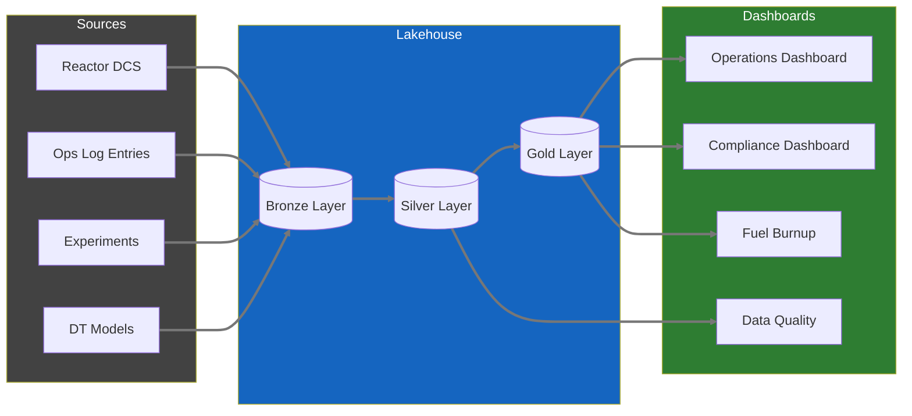
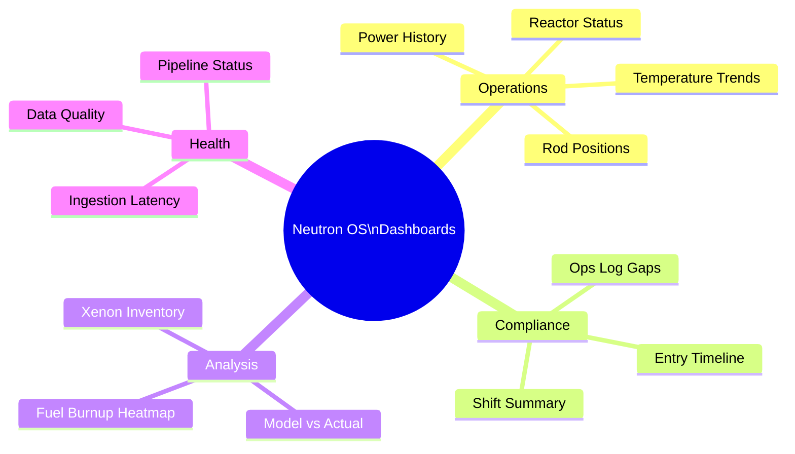

# Product Requirements Document: Analytics Dashboards

**Module:** Superset Analytics Dashboards  
**Status:** Draft  
**Last Updated:** January 21, 2026  
**Stakeholder Input:** Jim (TJ), Nick Luciano (Jan 2026)  
**Parent:** [Executive PRD](neutron-os-executive-prd.md)

---

## Executive Summary

Analytics Dashboards provide visual insights into reactor operations, experiment tracking, fuel performance, and system health. Built on Apache Superset, dashboards enable both real-time monitoring (for operations staff) and historical analysis (for researchers and management). The goal is to transform raw reactor data into actionable information.

---

## User Journey Map

### Dashboard User Journeys by Role

```mermaid
flowchart TB
    subgraph RO["👨‍💼 REACTOR OPERATOR"]
        direction LR
        RO1[Check power status]
        RO2[View upcoming experiments]
        RO3[Monitor temperatures]
        RO1 --> RO2 --> RO3
    end
    
    subgraph RM["👩‍💼 REACTOR MANAGER"]
        direction LR
        RM1[Review compliance gaps]
        RM2[Check facility utilization]
        RM3[View burnup heatmap]
        RM4[Export weekly report]
        RM1 --> RM2 --> RM3 --> RM4
    end
    
    subgraph RES["🔬 RESEARCHER"]
        direction LR
        RE1[Query historical data]
        RE2[Correlate experiment with conditions]
        RE3[Export data for analysis]
        RE1 --> RE2 --> RE3
    end
    
    subgraph NRC["NRC INSPECTOR"]
        direction LR
        NR1[Search date range]
        NR2[Review compliance metrics]
        NR3[Export evidence package]
        NR1 --> NR2 --> NR3
    end
    
    style RO fill:#e3f2fd,stroke:#1976d2,color:#000000
    style RM fill:#f3e5f5,stroke:#7b1fa2,color:#000000
    style RES fill:#e8f5e9,stroke:#388e3c,color:#000000
    style NRC fill:#fff3e0,stroke:#f57c00,color:#000000
linkStyle default stroke:#777777,stroke-width:3px
```



### Data Flow to Dashboards



### Dashboard Hierarchy



---

## Stakeholder Insights

### Key Feedback from Nick Luciano

#### On Live Streaming
> "We'd ideally get live streaming, but currently we just upload the data after-hours due to cost."

**Design Implication:** Dashboard architecture is streaming-first with batch fallbacks. Real-time is the default; batch processing handles historical aggregations and disaster recovery. See [ADR 007](../adr/007-streaming-first-architecture.md).

#### On Security Concerns
> "The public should generally not know when the reactor is at power. More specifically, we don't want live updates on the reactor status available online. A Superset login that is well protected is sufficient."

**Design Implication:** Dashboards require authentication. No public-facing real-time power status. Day-after data is acceptable for broader access.

#### On Calendar vs. Reality
> "The calendar is used to schedule time. It is not a reflection of what actually happened."

**Design Implication:** Dashboard should show actual reactor data, not scheduled data. Calendar integration is low priority.

#### On Xenon Tracking
> "This [xenon] cannot be measured directly, but can be correlated with critical rod heights."

**Design Implication:** Xenon dashboard should use inferred/calculated values, not direct measurement. Show correlation methodology.

#### On Fuel Burnup
> "This [fuel burnup heatmap] would be great. Ultimately, a product of the code would be burnup values for individual fuel elements. I could see a time series of burnup being displayed."

**Design Implication:** Fuel burnup heatmap is high-value. Requires model integration for per-element calculations.

### Key Feedback from Jim (TJ)

#### On Operational Insights
> "We can ascertain a baseline fuel 'burn up' amount when starting up from a long period of shut down. During operation, fuel 'burn up' amounts can be tracked as well."

**Design Implication:** Burnup tracking should show both baseline (post-shutdown) and operational (during run) values.

#### On Log Entry Counts
> "I am not sure what insight could be achieved by counting the number of log entries. We could however add a 'watch type' to all entries and then gather what operations we normally perform at what hour."

**Design Implication:** Simple entry counts are not useful. But tagging entries by type (watch type, category) enables meaningful analysis—e.g., "What operations happen at 2 AM vs 2 PM?"

#### On Compliance Gaps
> "A gap would mean that this :30 minute check was not performed when operating."

**Design Implication:** Gaps in mandatory checks should be visually prominent—this is a compliance indicator.

#### On Export Requirements
> "Export to PDF would work, but a simple text file for archive and future proof would also work."

**Design Implication:** Support multiple export formats. Plain text for archival longevity.

---

## Dashboard Inventory

Based on stakeholder feedback, prioritized:

### Priority 1: Operations Dashboards

| Dashboard | Primary Users | Key Insight | Stakeholder Quote |
|-----------|---------------|-------------|-------------------|
| **Reactor Operations Overview** | Operators, RM | Real-time (or near-real-time) reactor status | Nick: "We'd ideally get live streaming" |
| **Operations Log Compliance** | RM, NRC | Gaps in mandatory checks | Jim: "A gap would mean... check was not performed" |
| **Shift Summary** | SRO, RM | Entries by watch/shift, handover report | Jim: "add a 'watch type' to all entries" |

### Priority 2: Analysis Dashboards

| Dashboard | Primary Users | Key Insight | Stakeholder Quote |
|-----------|---------------|-------------|-------------------|
| **Fuel Burnup Heatmap** | RM, Analysts | Per-element burnup visualization | Nick: "This would be great" |
| **Xenon Inventory (Inferred)** | Operators, Analysts | Xe-135 tracking via rod height correlation | Nick: "cannot be measured directly, but can be correlated" |
| **Power History** | Researchers | Historical power levels, trends | Standard operational need |

### Priority 3: Experiment Dashboards

| Dashboard | Primary Users | Key Insight | Stakeholder Quote |
|-----------|---------------|-------------|-------------------|
| **Experiment Tracking** | Researchers, PIs | Sample status, beam time usage | Khiloni: correlate with reactor conditions |
| **Facility Usage** | RM, PIs | Which facilities are most used | Operational planning |

### Priority 4: Digital Twin Dashboards

| Dashboard | Primary Users | Key Insight | Stakeholder Quote |
|-----------|---------------|-------------|-------------------|
| **Model vs. Measurement** | Analysts | Validation of DT predictions | Foundational DT metric |
| **Model Performance** | Developers | Execution times, convergence | Technical health |

---

## Dashboard Specifications

### 1. Reactor Operations Overview

**Purpose:** Real-time (or near-real-time) view of reactor status for console monitoring.

**Security Note:** Requires authentication. Not public-facing per Nick's security concern.

**Panels:**
- **Current Power Level** (big number with trend sparkline)
- **Control Rod Positions** (bar chart or rod diagram)
- **Pool Temperature** (gauge with alarm thresholds)
- **Coolant Flow Rate** (if measured)
- **Status Indicator** (Shutdown / Startup / Operating / Scram)
- **Time Since Last Ops Log Entry** (compliance indicator)

**Data Refresh & Freshness:**

> **Design Decision:** Streaming-first with batch fallbacks. See [ADR 007](../adr/007-streaming-first-architecture.md)

| Data Type | Target Latency | Implementation |
|-----------|---------------|----------------|
| Ops Log entries | <500ms | WebSocket push |
| 30-min rule timer | <100ms | Real-time sync |
| Reactor status | <2s | Event-driven update |
| Historical aggregations | Minutes | Batch job (Dagster) |

**Freshness Indicator:** Live is the default — users assume data is current. Warnings appear only when streaming is degraded:
- 🟢 **Live** — default state, no indicator needed
- ⚠️ **Degraded** — streaming delayed, showing last known values
- 🔴 **Stale** — connection lost or >5 min behind

**Mockup:**
```
┌────────────────────────────────────────────────────────────────┐
│  REACTOR OPERATIONS OVERVIEW                                   │
│  🟡 Last Updated: 5 min ago              [⟳ Refresh] [Settings]│
├────────────────────────────────────────────────────────────────┤
│                                                                │
│  ┌──────────────┐  ┌──────────────┐  ┌──────────────┐         │
│  │   POWER      │  │   STATUS     │  │  POOL TEMP   │         │
│  │   950 kW     │  │  OPERATING   │  │   85°F       │         │
│  │   ▲ +50kW    │  │   ● ● ● ●    │  │   ───────    │         │
│  └──────────────┘  └──────────────┘  └──────────────┘         │
│                                                                │
│  ┌────────────────────────────────────────────────────────┐   │
│  │  CONTROL RODS                                          │   │
│  │  ████████░░ A: 72%  ████████░░ B: 68%  ████░░░░░ C: 41%│   │
│  └────────────────────────────────────────────────────────┘   │
│                                                                │
│  ┌────────────────────────────────────────────────────────┐   │
│  │  POWER HISTORY (Last 24h)                               │   │
│  │  1000 ─┬─────────────────────────────────────────────  │   │
│  │        │                     ████████████████████████  │   │
│  │   500 ─┼───────────█████████                           │   │
│  │        │    ███████                                     │   │
│  │     0 ─┴─────────────────────────────────────────────  │   │
│  │        00:00        06:00        12:00        18:00     │   │
│  └────────────────────────────────────────────────────────┘   │
│                                                                │
└────────────────────────────────────────────────────────────────┘
```

---

### 2. Operations Log Compliance

**Purpose:** Ensure mandatory 30-minute checks are being performed; surface gaps for RM review.

**Panels:**
- **Gap Indicator** (big red/green: "X gaps this shift")
- **Timeline of Entries** (dots on timeline, gaps highlighted)
- **Entries by Type** (pie chart)
- **Entries by Operator** (bar chart)
- **Entries by Watch Type** (per Jim's suggestion)

**Key Metric:** 
- Gap = Operating period > 30 min without CONSOLE_CHECK entry

**Mockup:**
```
┌────────────────────────────────────────────────────────────────┐
│  OPS LOG COMPLIANCE DASHBOARD                [Shift: Day]      │
├────────────────────────────────────────────────────────────────┤
│                                                                │
│  ┌──────────────┐  ┌──────────────────────────────────────┐   │
│  │   GAPS       │  │  ENTRY TIMELINE (Today)              │   │
│  │              │  │                                      │   │
│  │    0  ✓      │  │  ●───●───●───●───●───●───●───●───●  │   │
│  │              │  │  08  09  10  11  12  13  14  15  16  │   │
│  │  This Shift  │  │                                      │   │
│  └──────────────┘  └──────────────────────────────────────┘   │
│                                                                │
│  ┌──────────────────────┐  ┌─────────────────────────────┐    │
│  │  ENTRIES BY TYPE     │  │  ENTRIES BY OPERATOR        │    │
│  │                      │  │                             │    │
│  │  Console Check: 12   │  │  J. Smith: 8                │    │
│  │  Experiment: 3       │  │  M. Jones: 4                │    │
│  │  General Note: 2     │  │  K. Lee: 5                  │    │
│  │  Maintenance: 1      │  │                             │    │
│  └──────────────────────┘  └─────────────────────────────┘    │
│                                                                │
│  ┌────────────────────────────────────────────────────────┐   │
│  │  ⚠️ GAPS IN LAST 30 DAYS                               │   │
│  │                                                        │   │
│  │  2026-01-15 14:30-15:15 (45 min gap) - Shift: Night   │   │
│  │  2026-01-08 02:00-02:45 (45 min gap) - Shift: Night   │   │
│  └────────────────────────────────────────────────────────┘   │
│                                                                │
└────────────────────────────────────────────────────────────────┘
```

---

### 3. Fuel Burnup Heatmap

**Purpose:** Visualize per-element fuel burnup for operational planning and regulatory reporting.

**Data Source:** Model output (not direct measurement). Per Nick: "a product of the code would be burnup values for individual fuel elements."

**Panels:**
- **Core Map Heatmap** (top-down view, colored by burnup)
- **Burnup by Element** (sortable table)
- **Burnup Trend** (time series for selected element)
- **Baseline vs Current** (per Jim: "baseline fuel 'burn up' amount when starting up from a long period of shut down")

**Mockup:**
```
┌────────────────────────────────────────────────────────────────┐
│  FUEL BURNUP VISUALIZATION                    [As of: 2026-01]│
├────────────────────────────────────────────────────────────────┤
│                                                                │
│  ┌──────────────────────────────┐  ┌────────────────────────┐ │
│  │  CORE MAP (Top-Down)         │  │  BURNUP SCALE          │ │
│  │                              │  │                        │ │
│  │      ░░░███░░░               │  │  ████ High (>50 MWd)   │ │
│  │    ░░████████░░              │  │  ▓▓▓▓ Med  (25-50)     │ │
│  │   ░███▓▓▓▓▓▓███░             │  │  ░░░░ Low  (<25 MWd)   │ │
│  │   ░██▓▓▓▓▓▓▓▓██░             │  │                        │ │
│  │   ░███▓▓▓▓▓▓███░             │  │  Click element for     │ │
│  │    ░░████████░░              │  │  detail view           │ │
│  │      ░░░███░░░               │  │                        │ │
│  │                              │  │                        │ │
│  └──────────────────────────────┘  └────────────────────────┘ │
│                                                                │
│  ┌────────────────────────────────────────────────────────┐   │
│  │  BURNUP HISTORY (Selected: Element B-4)                │   │
│  │                                                        │   │
│  │  60 MWd ─┬─────────────────────────────────────█████  │   │
│  │          │                              ███████       │   │
│  │  30 MWd ─┼────────────────███████████████            │   │
│  │          │   ██████████████                           │   │
│  │   0 MWd ─┴─────────────────────────────────────────   │   │
│  │          2022        2023        2024        2025     │   │
│  └────────────────────────────────────────────────────────┘   │
│                                                                │
└────────────────────────────────────────────────────────────────┘
```

---

### 4. Xenon Inventory (Inferred)

**Purpose:** Track Xe-135 buildup/decay for operational planning (startup timing, power maneuvers).

**Data Source:** Inferred from critical rod heights, per Nick: "cannot be measured directly, but can be correlated with critical rod heights."

**Panels:**
- **Estimated Xe-135 Inventory** (time series)
- **Critical Rod Height Correlation** (scatter plot showing relationship)
- **Methodology Note** (explain inference approach)

**Important Caveat:** Display prominently that this is *inferred* data, not direct measurement.

---

### 5. Shift Summary / Handover Report

**Purpose:** Generate end-of-shift summary for handover to incoming crew.

**Content:**
- Power level changes during shift
- All Ops Log entries (with supplements)
- Experiments conducted
- Equipment issues noted
- Pending items for next shift

**Export:** PDF and plain text per Jim's requirement.

---

## Security Requirements

From Nick:
> "The public should generally not know when the reactor is at power."

### Access Tiers

| Tier | Access Level | Example Users |
|------|--------------|---------------|
| **Public** | None (no public dashboards) | N/A |
| **Delayed** | Data from >24 hours ago | External researchers (future) |
| **Real-time** | Current data | Operators, RM, HP |
| **Admin** | Full access + configuration | System administrators |

### Implementation

- All dashboards behind Superset authentication
- No embedding of live dashboards in public websites
- Day-after exports acceptable for external sharing

---

## Data Refresh Patterns

| Pattern | Latency | Use Case |
|---------|---------|----------|
| **Nightly Batch** | ~12 hours | Current implementation; sufficient for historical analysis |
| **Near-Real-Time** | ~5 min | Future; needed for operations dashboard |
| **Real-Time** | <1 min | Future; needed for console monitoring |

**Nick's note:** "We'd ideally get live streaming, but currently we just upload the data after-hours due to cost."

**Design Decision:** Streaming-first architecture. Real-time is the default; batch for historical aggregations and fallback. See [ADR 007](../adr/007-streaming-first-architecture.md).

---

## Export Requirements

Per Jim: "Export to PDF would work, but a simple text file for archive and future proof would also work."

### Supported Formats

| Format | Notes |
|--------|-------|
| **PDF** | Charts rendered as images; professional formatting |
| **PNG/SVG** | Individual chart export |
| **CSV** | Underlying data for any chart |
| **Plain Text** | For compliance reports and archival |

---

## Integration Points

### From Reactor Ops Log
- Entry counts by type/time
- Gap detection alerts
- Watch-type tagging

### From Experiment Manager
- Sample status aggregations
- Facility utilization

### From Time-Series (Iceberg)
- Power levels, temperatures, rod positions
- Historical queries for trends

### From Models
- Burnup calculations
- Xenon inferred values
- Model vs measurement comparisons

---

## MVP Scope (Phase 1)

### In Scope
- Reactor Operations Overview (with nightly batch data)
- Operations Log Compliance (gap detection)
- Power History (simple time-series charts)
- Basic authentication

### Out of Scope (Future)
- Real-time streaming
- Fuel Burnup Heatmap (requires model integration)
- Xenon Inference (requires model)
- External/delayed access tier

---

## Open Questions

1. **Real-time priority:** How important is real-time vs cost savings of nightly batch?

2. **Historical depth:** How far back should dashboards query? (2 years per NRC, or full history?)

3. **Alert routing:** Should compliance gaps trigger email/SMS to RM?

4. **Model integration:** What's the timeline for burnup model output integration?

5. **Watch types:** What are the standard watch types to tag entries with?

---

## Success Metrics

| Metric | Target | Measurement |
|--------|--------|-------------|
| Dashboard adoption | 80% of operators check daily | Login analytics |
| Gap detection accuracy | 100% of gaps surfaced | Audit comparison to paper logs |
| Export usage | NRC inspection prep uses exports | Staff survey |
| Insight generation | RM identifies 1+ operational improvement per quarter | Qualitative feedback |

---

## Appendix: Stakeholder Quotes Reference

**Nick Luciano:**
- "We'd ideally get live streaming, but currently we just upload the data after-hours due to cost."
- "The public should generally not know when the reactor is at power."
- "The calendar is used to schedule time. It is not a reflection of what actually happened."
- "[Xenon] cannot be measured directly, but can be correlated with critical rod heights."
- "[Fuel burnup heatmap] would be great."

**Jim (TJ):**
- "We can ascertain a baseline fuel 'burn up' amount when starting up from a long period of shut down."
- "I am not sure what insight could be achieved by counting the number of log entries."
- "Add a 'watch type' to all entries and then gather what operations we normally perform at what hour."
- "A gap would mean that this :30 minute check was not performed when operating."
- "Export to PDF would work, but a simple text file for archive and future proof would also work."

---

*Document Status: Ready for technical review and Superset implementation planning*
