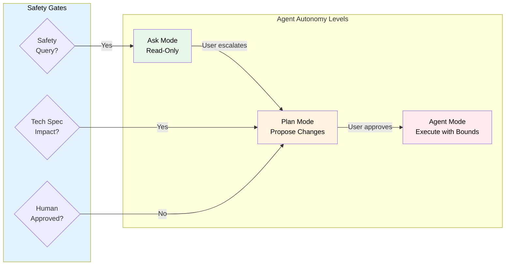
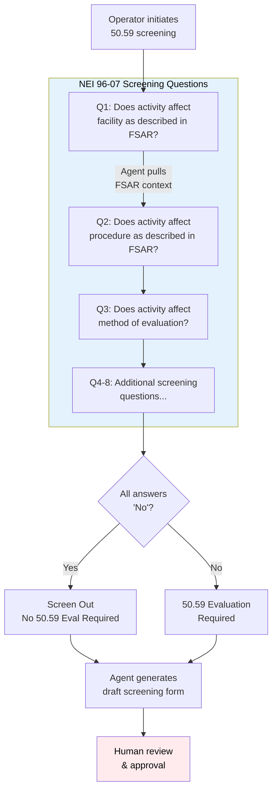
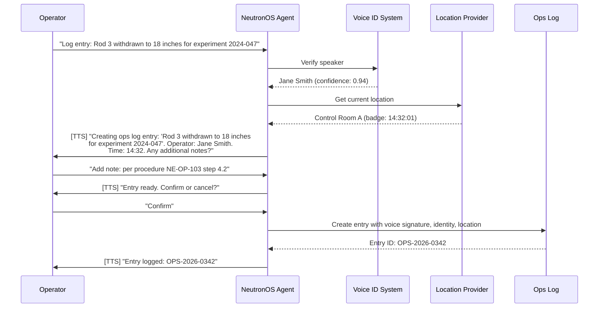

# NeutronOS Agent Capabilities PRD

*Agentic Runtime for Safer, More Cost-Efficient Nuclear Operations*

**Status:** Draft  
**Owner:** Ben Booth  
**Created:** 2026-02-24  
**Last Updated:** 2026-03-05

---

## Executive Summary

NeutronOS provides a comprehensive **agentic runtime** purpose-built for nuclear facility operations—the only platform combining AI agent capabilities with deep regulatory awareness, safety-constrained guardrails, and human-in-the-loop workflows required for commercial nuclear environments.

This PRD defines **26 agent capabilities** across six tiers:

| Tier | Capabilities | Primary Personas |
|------|--------------|------------------|
| **Autonomy & Safety** | Three-tier autonomy model, nuclear safety guardrails | All users |
| **Regulatory Intelligence** | 50.59 Screening, Regulatory RAG, Licensing Search | SRO, Compliance |
| **Operational Workflow** | Shift Turnover, Procedure Writer/Walkthrough, LER, Surveillance | RO, SRO, Ops Staff |
| **Configuration/Quality** | CAP, OpE, Config Mgmt, Outage Planning, NQA-1 | Engineering, QA |
| **Research** | Experiment Design, Literature, Data Analysis, Results Correlation | Faculty, Researchers |
| **Training/Qualification** | Curriculum, Qual Tracker, Reactor Tutor, Assessment Prep | Trainees, Training Coordinator |
| **Interaction Layer** | Voice-First Ops, Status Check Mode, Multi-Channel Presence, Identity/Location Framework | All users |

### Why NeutronOS Agents Are Different

| General AI Assistants | NeutronOS Agents |
|----------------------|------------------|
| No regulatory awareness | RAG over Tech Specs, FSAR, 10 CFR |
| Suggest any action | Safety guardrails prevent Tech Spec violations |
| Single autonomy level | Three-tier: Ask → Plan → Agent with explicit escalation |
| Cloud-dependent | Offline-first for air-gapped facilities |
| Generic chat interface | Voice-first with identity + location verification |
| No compliance tracking | Integrated with 30-min checks, surveillance, training currency |

### State Management Foundation

NeutronOS agents accumulate valuable state across 15+ filesystem locations—transcripts, corrections, session history, configuration, document registries, and learned preferences. This state currently exists only on individual developer machines, creating risks around data loss, device theft, team collaboration, forensic analysis, and IP retention. This PRD also defines requirements for a comprehensive state management system that enables backup, encryption, migration, and eventually enterprise-grade collaboration while maintaining the offline-first, human-in-the-loop principles core to NeutronOS.

---

## Problem Statement

### Current State Distribution

Agent state is spread across the filesystem with no unified management:

| Category | Locations | Git Status | Risk |
|----------|-----------|------------|------|
| **Runtime** | `inbox/raw/`, `inbox/processed/`, `inbox/state/`, `sessions/` | Gitignored | Lost on device failure |
| **Configuration** | `config/people.md`, `config/initiatives.md`, `.doc-workflow.yaml` | Gitignored | Facility-specific, must migrate |
| **Document Lifecycle** | `.doc-registry.json`, `.doc-state.json`, `drafts/`, `approved/` | Gitignored | Published doc mappings lost |
| **Corrections** | `inbox/corrections/review_state.json`, `user_glossary.json` | Gitignored | Learned preferences lost |
| **Secrets** | `.env`, API keys in workflow configs | Gitignored | Security-sensitive |

### Business Risks Addressed

1. **Filesystem Corruption**: No backup mechanism; state loss requires manual reconstruction
2. **Device Theft**: Sensitive meeting transcripts, strategic documents exposed in plaintext
3. **Device Migration**: New laptop requires manual state reconstruction; no "clone my setup"
4. **Security Forensics**: Cannot replay historical system state to diagnose attacks
5. **IP Retention**: When team members leave, valuable institutional knowledge (corrections, preferences, document history) may be lost with their device

### User Pain Points

- "I got a new laptop and lost all my correction preferences"
- "My disk crashed and I lost 6 months of meeting transcripts"
- "Someone left the team and we lost access to their document mappings"
- "I can't tell what changed in the system over the last month"

---

## Goals & Non-Goals

### Goals

1. **Inventory**: Provide complete visibility into all agent state locations
2. **Backup/Restore**: Enable point-in-time backup and restoration of agent state
3. **Encryption**: Protect sensitive state at rest (device theft scenario)
4. **Migration**: Enable state transfer between devices
5. **Audit Trail**: Track state changes over time for forensics/compliance
6. **Team Sync** (Phase 2+): Enable collaborative state sharing with access control
7. **Document Sync Integration**: Include published document state in management scope

### Non-Goals

- Replacing Git for code version control
- Real-time collaborative editing (use external tools)
- Managing secrets rotation (defer to Vault/SOPS)
- Backing up raw audio/video files (large media excluded by default)

---

## User Stories

### Phase 0: Single Developer (MVP)

**US-001**: As a developer, I want to see a complete inventory of my agent state so I understand what exists on my machine.

**US-002**: As a developer, I want to backup my agent state to an encrypted archive so I can restore after device failure.

**US-003**: As a developer, I want to restore agent state from a backup so I can recover from data loss or migrate to a new device.

**US-004**: As a developer, I want my backups encrypted so device theft doesn't expose sensitive transcripts.

**US-005**: As a developer, I want to export my state in a portable format so I can migrate between machines.

### Phase 1: Git-Backed State

**US-010**: As a developer, I want selective state tracked in Git (encrypted) so I have version history and cloud backup.

**US-011**: As a developer, I want to decrypt state only on authorized machines so git-tracked state remains secure.

### Phase 2: Team Sync

**US-020**: As a team lead, I want shared configuration (people, initiatives) synced across team members so everyone has current context.

**US-021**: As an admin, I want access control on shared state so sensitive data is restricted appropriately.

**US-022**: As a compliance officer, I want audit logs of state access so we can demonstrate data governance.

### Phase 3: Enterprise

**US-030**: As an enterprise admin, I want RBAC for state management so I can enforce organizational policies.

**US-031**: As a security team member, I want to replay historical state snapshots so I can investigate incidents.

**US-032**: As legal counsel, I want to export a departing employee's state so the organization retains IP rights.

### Phase 4: Retention & Compliance

**US-040**: As a developer, I want raw inbox data automatically cleaned up after processing so my disk doesn't fill up.

**US-041**: As an admin, I want configurable retention policies per data category so I can balance storage costs with compliance needs.

**US-042**: As a compliance officer, I want retention policies enforced automatically so we don't retain data longer than permitted.

**US-043**: As an auditor, I want a log of what was deleted and when so I can verify policy compliance.

---

## Data Retention & Lifecycle Management

Agent state has varying retention requirements based on sensitivity, storage cost, and compliance needs. This section defines the retention lifecycle and automation requirements.

### Retention Policy Framework

| Data Category | Default Retention | Rationale | Configurable |
|---------------|-------------------|-----------|--------------|
| **Raw voice memos** (`inbox/raw/voice/`) | 7 days after processing | Large files, transcript is derived artifact | Yes |
| **Raw signal sources** (`inbox/raw/{gitlab,teams,teams_chat}/`) | 30 days | Source of truth for processed signals | Yes |
| **Processed transcripts** (`inbox/processed/`) | 90 days | Reference for corrections, briefings | Yes |
| **Sessions** (`sessions/`) | 30 days | Chat history, can regenerate context | Yes |
| **Corrections/glossary** (`corrections/`) | Indefinite | Valuable learned preferences, small | No |
| **Configuration** (`config/`) | Indefinite | Critical operational data | No |
| **State backups** (`~/.neut-backups/`) | 30 days (keep last 5) | Balance recovery vs. disk usage | Yes |
| **Draft outputs** (`drafts/`) | 14 days | Regeneratable, ephemeral | Yes |
| **Echo suppression cache** | 7 days (auto-expires) | Already has expiration built-in | No |

### State Lifecycle Stages

```
┌──────────────┐    ┌──────────────┐    ┌──────────────┐    ┌──────────────┐
│   Ingested   │───▶│  Processed   │───▶│   Archived   │───▶│   Purged     │
│              │    │              │    │  (optional)  │    │              │
└──────────────┘    └──────────────┘    └──────────────┘    └──────────────┘
     │                    │                   │                   │
     ▼                    ▼                   ▼                   ▼
 inbox/raw/         inbox/processed/    encrypted backup      deleted
 voice/, teams/     transcripts,        (retained per         (logged)
                    signals             policy)
```

### Existing Retention Mechanisms

Current implementations that need unification:

| Component | Location | Current Behavior |
|-----------|----------|------------------|
| **Audio clips** | `correction_review_guided.py` | `CLIP_RETENTION_DAYS = 7` |
| **Echo suppression** | `echo_suppression.py` | `expires_at` field, `cleanup_expired()` |
| **DocFlow sync cache** | `docflow_providers/` | `expires_at` in cache records |

### Retention Policy Configuration

Retention policies should be configurable via `config/retention.yaml`:

```yaml
# tools/agents/config/retention.yaml
retention:
  # Raw input data
  raw_voice:
    days: 7
    after: processed  # Retain N days after processed flag set
    
  raw_signals:
    days: 30
    after: ingested
    
  # Processed data
  transcripts:
    days: 90
    after: created
    archive_before_delete: true  # Backup to archive before purge
    
  sessions:
    days: 30
    after: last_accessed
    
  # Outputs
  drafts:
    days: 14
    after: created
    
  # Backups
  state_backups:
    keep_count: 5
    max_age_days: 30

# Compliance overrides (e.g., legal hold)
legal_hold:
  enabled: false
  # When enabled, no deletion occurs
  
# Audit logging
audit:
  log_deletions: true
  log_path: logs/retention_audit.jsonl
```

### Retention Functional Requirements

**FR-010: Retention Status Command**

```bash
neut state retention [--status] [--dry-run]
```

Shows retention status across all data categories:
- Files approaching retention cutoff
- Space recoverable by cleanup
- Policy compliance status

**FR-011: Retention Cleanup Command**

```bash
neut state cleanup [--dry-run] [--category <cat>] [--force]
```

Executes retention policy:
- Dry-run shows what would be deleted
- Category filter for selective cleanup
- Logs all deletions to audit trail

**FR-012: Automated Retention Daemon**

Background process or cron job that:
- Runs daily (configurable)
- Applies retention policies
- Logs all actions
- Respects legal hold flags

**FR-013: Retention Audit Log**

All retention actions logged in JSONL format:
```json
{"timestamp": "2026-02-24T14:30:00Z", "action": "delete", "path": "inbox/raw/voice/memo_123.m4a", "reason": "retention_policy", "policy": "raw_voice", "age_days": 8}
```

### Compliance Considerations (Phase 4)

| Requirement | Implementation |
|-------------|----------------|
| **GDPR Right to Erasure** | `neut state purge --user <email>` command |
| **Legal Hold** | `legal_hold.enabled` flag suspends all deletion |
| **Audit Trail** | JSONL retention log with immutable append |
| **Data Minimization** | Default policies favor shorter retention |
| **Cross-border** | Archive encryption before any cloud backup |

### Example Cleanup Workflow

```bash
# Check what would be cleaned up
$ neut state cleanup --dry-run

Retention Cleanup Preview
═════════════════════════
Category: raw_voice (7 days after processed)
  • inbox/raw/voice/memo_2026-02-15.m4a (9 days old) → DELETE
  • inbox/raw/voice/memo_2026-02-16.m4a (8 days old) → DELETE
  Space recoverable: 45 MB

Category: sessions (30 days after last_accessed)
  • sessions/abc123.json (45 days) → DELETE
  Space recoverable: 2 MB

Total: 47 MB recoverable

# Execute cleanup
$ neut state cleanup
  ✓ Deleted 2 voice memos (45 MB)
  ✓ Deleted 1 session (2 MB)
  ✓ Audit log updated: logs/retention_audit.jsonl
```

---

## State Taxonomy

### Category 1: Runtime State

Ephemeral data from agent operations:

| Location | Contents | Sensitivity | Backup Priority |
|----------|----------|-------------|-----------------|
| `inbox/raw/voice/` | Voice memo `.m4a` files | Medium | Optional (large) |
| `inbox/raw/gitlab/` | GitLab export JSON | Low | High |
| `inbox/raw/teams/` | Teams transcript JSON | High | High |
| `inbox/processed/` | Transcripts, signals, corrections | High | **Critical** |
| `inbox/state/` | Briefing state, sync timestamps | Medium | High |
| `sessions/` | Chat session JSON (UUID.json) | High | High |

### Category 2: Configuration State

Facility-specific settings:

| Location | Contents | Sensitivity | Backup Priority |
|----------|----------|-------------|-----------------|
| `config/people.md` | Team roster with aliases | Medium | **Critical** |
| `config/initiatives.md` | Active projects | Low | **Critical** |
| `config/models.yaml` | LLM endpoints | Low | High |
| `.doc-workflow.yaml` | DocFlow provider config | Medium | High |

### Category 3: Document Lifecycle State

Published document mappings and drafts:

| Location | Contents | Sensitivity | Backup Priority |
|----------|----------|-------------|-----------------|
| `.doc-registry.json` | Doc ID → URL mappings | Medium | **Critical** |
| `.doc-state.json` | Document lifecycle state | Medium | **Critical** |
| `drafts/` | Generated changelogs | Low | Medium |
| `approved/` | Human-approved outputs | Medium | High |

### Category 4: Learning State

User preferences and corrections:

| Location | Contents | Sensitivity | Backup Priority |
|----------|----------|-------------|-----------------|
| `corrections/review_state.json` | Correction review progress | Low | High |
| `corrections/user_glossary.json` | Learned transcription fixes | Low | **Critical** |
| `corrections/propagation_queue.json` | Pending corrections | Low | High |

### Category 5: Secrets (Special Handling)

| Location | Contents | Sensitivity | Backup Priority |
|----------|----------|-------------|-----------------|
| `.env` | API keys, tokens | **Critical** | Exclude (re-provision) |
| Provider credentials in configs | OAuth tokens | **Critical** | Exclude (re-provision) |

---

## Functional Requirements

### FR-001: State Inventory Command

```bash
neut state inventory [--verbose] [--json]
```

Lists all state locations with:
- Path and existence status
- File count and total size
- Last modified timestamp
- Git tracking status
- Sensitivity classification

### FR-002: State Backup Command

```bash
neut state backup [--output <path>] [--encrypt] [--include-media]
```

Creates point-in-time backup:
- Default output: `~/.neut-backups/neut-state-{timestamp}.tar.gz`
- Encryption via age (modern, audited crypto)
- Excludes `.env` and large media by default
- Includes manifest with checksums

### FR-003: State Restore Command

```bash
neut state restore <backup-path> [--decrypt] [--dry-run]
```

Restores from backup:
- Validates manifest checksums
- Dry-run mode shows what would change
- Prompts before overwriting existing state
- Logs restoration actions

### FR-004: State Export Command

```bash
neut state export <category> --output <path>
```

Exports specific state category for sharing:
- Categories: `config`, `corrections`, `documents`, `sessions`
- Portable JSON format with schema version
- Redacts secrets automatically

### FR-005: State Encryption

- At-rest encryption using age with passphrase or key file
- Optional git-crypt integration for selective Git tracking
- Key stored in macOS Keychain / Linux secret-service / Windows Credential Manager

### FR-006: Document Sync State Integration

Published document state (`.doc-registry.json`, `.doc-state.json`) included in:
- State inventory
- Backup scope
- Export capabilities

Cross-reference: See [docflow-spec.md](../specs/docflow-spec.md) for bidirectional sync patterns.

---

## Git Integration Model

Agent state management is designed to be **Git-aware but Git-optional**. Git provides powerful primitives (version history, distributed sync, branch-based workflows) that complement state management without being a hard dependency.

### Why Git Matters for State

| Git Capability | State Management Benefit |
|----------------|-------------------------|
| **Version history** | Roll back to previous state, audit changes over time |
| **Distributed sync** | Clone state to new machines via `git clone` |
| **Branch isolation** | Experiment with state changes without affecting main |
| **Remote backup** | Push encrypted state to GitHub/GitLab for cloud backup |
| **Access control** | Leverage existing Git permissions for state access |
| **Diff/merge** | See what changed between state versions |

### The Three-Tier Model

```
┌─────────────────────────────────────────────────────────────────────┐
│                     State Storage Tiers                             │
├─────────────────────────────────────────────────────────────────────┤
│                                                                     │
│  Tier 1: Git-Tracked (Encrypted)          Tier 2: Git-Ignored      │
│  ─────────────────────────────            ──────────────────       │
│  • config/people.md                       • inbox/raw/voice/       │
│  • config/initiatives.md                  • inbox/processed/       │
│  • .doc-registry.json                     • sessions/              │
│  • corrections/user_glossary.json         • .env (secrets)         │
│                                                                     │
│  → Encrypted via git-crypt                → Backed up separately   │
│  → Version history available              → May be large/sensitive │
│  → Syncs with git push/pull               → Local-only by default  │
│                                                                     │
├─────────────────────────────────────────────────────────────────────┤
│                                                                     │
│  Tier 3: External Sync (Phase 2+)                                   │
│  ────────────────────────────────                                   │
│  • PostgreSQL for team state                                        │
│  • S3/GCS for large media backup                                    │
│  • Enterprise state service                                         │
│                                                                     │
└─────────────────────────────────────────────────────────────────────┘
```

### Git-Crypt for Transparent Encryption

[git-crypt](https://github.com/AGWA/git-crypt) enables transparent encryption of files in Git:

- Files appear encrypted in the repository (on GitHub, in `git log`, etc.)
- Files are automatically decrypted on authorized machines
- Non-authorized users see encrypted blobs
- Works with existing Git workflows (`commit`, `push`, `pull`)

**Configuration via `.gitattributes`:**
```gitattributes
# Encrypted state files (decrypted only on authorized machines)
tools/agents/config/people.md filter=git-crypt diff=git-crypt
tools/agents/config/initiatives.md filter=git-crypt diff=git-crypt
.doc-registry.json filter=git-crypt diff=git-crypt
.doc-state.json filter=git-crypt diff=git-crypt
tools/agents/inbox/corrections/user_glossary.json filter=git-crypt diff=git-crypt
```

**Authorization model:**
- GPG key-based: Each team member's GPG key is added to `.git-crypt/keys/`
- Symmetric key: Export key file for sharing (less secure, simpler)

### Git Policy by State Location

| Location | Git Policy | Rationale |
|----------|------------|-----------|
| `config/people.md` | **Encrypted** | Team roster benefits from version history |
| `config/initiatives.md` | **Encrypted** | Project list shared across team |
| `.doc-registry.json` | **Encrypted** | Document URLs valuable for continuity |
| `.doc-state.json` | **Encrypted** | Document lifecycle state |
| `user_glossary.json` | **Encrypted** | Learned corrections are valuable |
| `inbox/processed/` | Ignored | Too large, use backup instead |
| `inbox/raw/voice/` | Ignored | Binary media, too large |
| `sessions/` | Ignored | Sensitive chat history |
| `drafts/` | Ignored | Regenerated, not critical |
| `.env` | Ignored | Secrets, never commit |

### Git-Aware Commands

State management commands are Git-aware when running in a Git repository:

```bash
# Inventory shows Git tracking status
neut state inventory
  config/people.md           1.2 KB  [CRITICAL] git:encrypted
  inbox/processed/           1.1 MB  [CRITICAL] git:ignored
  sessions/                  296 KB  [HIGH]     git:untracked ⚠️

# Backup can commit and push
neut state backup --git-commit --git-push
  Creating backup...
  ✓ Committed: "state backup 2026-02-24T14:30"
  ✓ Pushed to origin/main

# Sync pulls latest state from Git
neut state sync
  Pulling latest from origin/main...
  ✓ config/people.md updated (3 new team members)
  ✓ user_glossary.json merged (12 new corrections)
```

### When to Use Git vs. External Backup

| Scenario | Recommendation |
|----------|----------------|
| Single developer, small team | Git-crypt for config, `neut state backup` for runtime |
| Team sharing config | Git-crypt with shared GPG keys |
| Large transcripts/media | External backup (S3, local NAS) |
| Compliance/audit requirements | Git for audit trail + PostgreSQL for access logs |
| Departing employee | `neut state export` + Git history preservation |

### Relationship to Code vs. State

NeutronOS treats code and state differently:

| Aspect | Code | Agent State |
|--------|------|-------------|
| **Source of truth** | Git repository | Filesystem (optionally Git-backed) |
| **Versioning** | Always tracked | Optionally tracked |
| **Sharing** | Public/team repo | Encrypted, access-controlled |
| **Merge conflicts** | Manual resolution | Schema-aware auto-merge |
| **Backup frequency** | On commit | On change or scheduled |

The key insight: **State is runtime data that evolves differently than code.** Some state (config, corrections) benefits from Git's versioning. Other state (transcripts, sessions) is better suited to backup/restore workflows.

---

## Phased Implementation

### Phase 0: Local Backup (MVP) — Target: 1 week

**Deliverables:**
- `neut state inventory` command
- `neut state backup` with age encryption
- `neut state restore` with validation
- State location constants in `tools/agents/state/locations.py`

**Success Criteria:**
- Developer can backup and restore all critical state
- Backup is encrypted by default
- Restore works on fresh machine

### Phase 1: Git-Backed State — Target: 2 weeks

**Deliverables:**
- git-crypt integration for selective encryption
- `.gitattributes` patterns for encrypted state
- `neut state sync` for push/pull
- Documentation for team onboarding

**Success Criteria:**
- Selected state tracked in Git (encrypted)
- Only authorized machines can decrypt
- Version history available

### Phase 2: Team Sync — Target: 4 weeks

**Deliverables:**
- PostgreSQL schema for state storage
- `neut state share` command
- Access control (owner, editor, viewer)
- Conflict resolution for concurrent edits

**Success Criteria:**
- Team can share configuration state
- Access control enforced
- Audit log captures access

### Phase 3: Enterprise — Target: 8 weeks

**Deliverables:**
- RBAC integration (LDAP/SAML)
- State snapshot API for forensics
- Compliance export (departing employee)
- Multi-tenant isolation

**Success Criteria:**
- Organization can enforce state policies
- Historical state replay possible
- IP retention on employee departure

### Phase 4: Retention & Compliance — Target: 2 weeks (can parallelize with Phase 1)

**Deliverables:**
- `neut state retention` status command
- `neut state cleanup` with dry-run and audit logging
- `config/retention.yaml` configuration file
- Retention audit log in JSONL format
- Unify existing retention mechanisms (audio clips, echo cache)

**Success Criteria:**
- Automated cleanup respects configured policies
- All deletions logged for audit
- Disk usage stays bounded over time
- Legal hold flag prevents all deletion

---

## Security Considerations

### Encryption

- **Algorithm**: age (X25519 + ChaCha20-Poly1305)
- **Key Management**: Platform keychain integration
- **Passphrase**: PBKDF2 with high iteration count

### Access Control (Phase 2+)

- **Authentication**: Delegated to Git/SSO provider
- **Authorization**: Per-category permissions
- **Audit**: All state access logged with timestamp, user, action

### Secrets Handling

- Secrets excluded from backup by default
- `.env` files require re-provisioning
- OAuth tokens require re-authentication

---

## Success Metrics

| Metric | Phase 0 Target | Phase 2 Target | Phase 4 Target |
|--------|----------------|----------------|----------------|
| Backup creation time | < 30 seconds | < 30 seconds | < 30 seconds |
| Restore success rate | 100% | 100% | 100% |
| State inventory accuracy | 100% coverage | 100% coverage | 100% coverage |
| Encryption coverage | All sensitive state | All sensitive state | All sensitive state |
| Audit log retention | N/A | 90 days | 90 days |
| Retention policy compliance | N/A | N/A | 100% of categories |
| Disk usage growth | Unbounded | Unbounded | < 10% monthly |
| Cleanup audit coverage | N/A | N/A | 100% logged |

---

## Dependencies

- **age**: Encryption tool (Go implementation)
- **git-crypt**: Transparent Git encryption (Phase 1)
- **PostgreSQL**: Team state storage (Phase 2)
- **Platform keychain APIs**: Secure key storage

---

## Open Questions

1. Should raw voice memos be included in backup by default? (Currently excluded due to size)
2. ~~What's the retention policy for state backups?~~ → Addressed in Data Retention section
3. How do we handle state schema migrations between NeutronOS versions?
4. Should we support S3/GCS as backup targets in Phase 1?
5. Should retention cleanup require explicit opt-in, or run automatically after initial setup?
6. How do we handle retention for data that spans multiple categories (e.g., a transcript with embedded corrections)?
7. What's the notification UX when cleanup deletes significant data (e.g., "Freed 500MB")?

---

## Autonomy Model & Nuclear Safety Guardrails

NeutronOS agents operate within a **three-tier autonomy model** with nuclear-specific safety guardrails that ensure AI assistance never compromises operational safety.

### Three-Tier Autonomy Model



| Mode | Permissions | Use Cases |
|------|-------------|-----------|
| **Ask** | Read-only queries, no state changes | Parameter lookups, procedure questions, training Q&A |
| **Plan** | Propose changes, generate drafts | 50.59 screenings, procedure drafts, log entry previews |
| **Agent** | Execute bounded writes with audit | Approved log entries, document publishing, issue creation |

### Nuclear Safety Guardrails

| Guardrail ID | Name | Description | Enforcement |
|--------------|------|-------------|-------------|
| **NSG-001** | Tech Spec LCO Awareness | Agent queries indexed LCOs before suggesting operational changes | RAG + pre-response filter |
| **NSG-002** | Safety Limit Boundaries | Agent refuses suggestions that approach safety limits | Hard-coded parameter thresholds |
| **NSG-003** | USQ Detection | Agent flags changes that may require 50.59 evaluation | Pattern matching + LLM assessment |
| **NSG-004** | Mode Auto-Demotion | Safety-adjacent queries auto-demote to Ask mode | Context classifier |
| **NSG-005** | Human-in-the-Loop Mandate | All safety-related actions require explicit approval | No exceptions, audit logged |
| **NSG-006** | Regulatory Citation Required | Safety-related answers must cite TS, FSAR, or 10 CFR | Response validation |

### Guardrail Implementation

```python
# Pseudocode for safety guardrail middleware
class NuclearSafetyGuardrail:
    def pre_response(self, query: str, proposed_response: str) -> Response:
        # NSG-004: Auto-demote safety queries to Ask mode
        if self.is_safety_adjacent(query):
            self.demote_to_ask_mode()
        
        # NSG-001: Check Tech Spec LCOs
        if self.references_operational_parameter(query):
            lco_context = self.rag.query_tech_specs(query)
            if self.would_violate_lco(proposed_response, lco_context):
                return self.refuse_with_lco_citation(lco_context)
        
        # NSG-003: Flag potential USQs
        if self.may_require_50_59(query):
            proposed_response = self.add_usq_warning(proposed_response)
        
        # NSG-006: Ensure citations for safety content
        if self.is_safety_related(proposed_response):
            proposed_response = self.ensure_regulatory_citations(proposed_response)
        
        return proposed_response
```

---

## Regulatory Intelligence Agent Capabilities

### GOAL_NUC_001: Regulatory Knowledge RAG

**Purpose:** Provide agents with facility-specific regulatory context grounded in the licensing basis.

**Indexed Sources:**
- Facility Technical Specifications (TS)
- Final Safety Analysis Report (FSAR) / Safety Analysis Report (SAR)
- 10 CFR Part 50, 52, 55 (as applicable)
- NRC Generic Letters, Information Notices
- Facility procedures referenced in TS

**Citation Format:**
- `[TS 3.1.4.a]` — Technical Specification reference
- `[FSAR 15.2.1]` — Safety Analysis Report section
- `[10 CFR 50.59(c)(2)(i)]` — Code of Federal Regulations
- `[GL 89-13]` — Generic Letter

**Requirements:**
| Req ID | Requirement | Priority |
|--------|-------------|----------|
| REQ_NUC_001_1 | Index facility TS in searchable vector store | P0 |
| REQ_NUC_001_2 | Index FSAR chapters with section-level granularity | P0 |
| REQ_NUC_001_3 | Cache full regulatory index locally for offline operation | P0 |
| REQ_NUC_001_4 | Update index when TS amendments are issued | P1 |
| REQ_NUC_001_5 | Provide citation with every regulatory answer | P0 |

**User Story:** *"As an SRO, I want to ask about operating limits and receive answers grounded in our Tech Specs so I can trust the agent's guidance."*

---

### GOAL_NUC_002: 50.59 Screening Agent

**Purpose:** Guide operators through 10 CFR 50.59 change evaluations with FSAR-informed context.

**Workflow:**



**Requirements:**
| Req ID | Requirement | Priority |
|--------|-------------|----------|
| REQ_NUC_002_1 | Guide user through 8 NEI 96-07 screening questions | P0 |
| REQ_NUC_002_2 | Pull relevant FSAR sections for each question via RAG | P0 |
| REQ_NUC_002_3 | Generate draft screening form with citations | P0 |
| REQ_NUC_002_4 | Hard guardrail: Agent cannot approve screenings | P0 |
| REQ_NUC_002_5 | Track screening through RSC/PORC approval workflow | P1 |
| REQ_NUC_002_6 | Support USQ terminology for non-power reactors | P1 |

**User Story:** *"As an SRO, I want to screen a procedure change against 50.59 requirements so I can determine if RSC approval is needed before implementation."*

---

### GOAL_NUC_003: Licensing Basis Search

**Purpose:** Natural language search across all licensing documents.

**Example Interactions:**
```
User: "What's our licensed maximum core inlet temperature?"
Agent: "Per TS 2.1.1, the core inlet temperature Safety Limit is 130°F. 
        The LCO in TS 3.4.1 requires maintaining inlet temperature below 120°F 
        during power operation. [TS 2.1.1, TS 3.4.1]"

User: "Can we operate with one containment isolation valve inoperable?"
Agent: "Per TS 3.6.3, Action A: With one containment isolation valve inoperable,
        isolate the affected penetration flow path within 4 hours by use of a 
        closed manual valve, blind flange, or check valve. [TS 3.6.3.A]"
```

**Requirements:**
| Req ID | Requirement | Priority |
|--------|-------------|----------|
| REQ_NUC_003_1 | Semantic search across TS, FSAR, DBDs | P0 |
| REQ_NUC_003_2 | Return relevant sections with page/section references | P0 |
| REQ_NUC_003_3 | Distinguish between Safety Limits, LCOs, and administrative requirements | P1 |

---

## Operational Workflow Agent Capabilities

### GOAL_NUC_004: Shift Turnover Agent

**Purpose:** Automate shift turnover report generation from Reactor Ops Log.

**Generated Content:**
- Summary of last 12 hours of operations
- LCO entries and exits with time remaining
- Abnormal conditions and operator actions
- Pending surveillances with due times
- Ongoing experiments and status
- Equipment out of service

**Requirements:**
| Req ID | Requirement | Priority |
|--------|-------------|----------|
| REQ_NUC_004_1 | Synthesize Ops Log entries from past 12 hours | P0 |
| REQ_NUC_004_2 | Highlight LCO status changes with required action times | P0 |
| REQ_NUC_004_3 | Generate draft in facility turnover template format | P1 |
| REQ_NUC_004_4 | Support voice readback of turnover brief | P1 |

**Cross-Reference:** Integrates with [Reactor Ops Log PRD](prd_reactor-ops-log.md)

---

### GOAL_NUC_005: Procedure Writer Agent

**Purpose:** Assist in drafting nuclear procedures with regulatory awareness.

**Capabilities:**
- Draft procedures from high-level intent using facility template
- Check for required elements: purpose, prerequisites, precautions, steps, verification points
- Insert Independent Verification Hold (IVH) points where required
- Cross-reference against Tech Specs and FSAR
- Apply human factors principles (step complexity, conditional logic clarity)

**Requirements:**
| Req ID | Requirement | Priority |
|--------|-------------|----------|
| REQ_NUC_005_1 | Generate procedure drafts in facility template format | P0 |
| REQ_NUC_005_2 | Include verification steps per industry standards | P0 |
| REQ_NUC_005_3 | Flag steps that may require IVH | P1 |
| REQ_NUC_005_4 | Integrate with DocFlow for review/approval workflow | P1 |

---

### GOAL_NUC_006: LER/Event Report Agent

**Purpose:** Assist in drafting NRC Licensee Event Reports.

**Workflow:**
1. Agent extracts event details from Ops Log entries tagged as reportable
2. Generates draft LER in NRC 10 CFR 50.73 format
3. Pulls relevant TS/FSAR sections for root cause analysis
4. Tracks 30-day/60-day reporting deadlines
5. Human reviews, edits, and submits

**Requirements:**
| Req ID | Requirement | Priority |
|--------|-------------|----------|
| REQ_NUC_006_1 | Extract event details from tagged Ops Log entries | P0 |
| REQ_NUC_006_2 | Generate draft LER in NRC-required format | P0 |
| REQ_NUC_006_3 | Track reporting deadlines with escalating reminders | P0 |
| REQ_NUC_006_4 | Hard guardrail: cannot submit to NRC—draft only | P0 |

---

### GOAL_NUC_007: Surveillance Scheduling Agent

**Purpose:** Track and optimize required surveillance scheduling.

**Tracked Surveillances:**
- Daily channel checks
- Weekly/monthly calibrations
- Quarterly functional tests
- Refueling interval inspections
- Special test requirements

**Requirements:**
| Req ID | Requirement | Priority |
|--------|-------------|----------|
| REQ_NUC_007_1 | Track all required surveillances by frequency | P0 |
| REQ_NUC_007_2 | Alert on upcoming due dates with grace period awareness | P0 |
| REQ_NUC_007_3 | Suggest optimal scheduling to minimize ops impact | P1 |
| REQ_NUC_007_4 | Integrate with compliance tracking module | P0 |

**Cross-Reference:** Integrates with [Compliance Tracking PRD](prd_compliance-tracking.md)

---

### GOAL_NUC_013: Procedure Walkthrough Agent

**Purpose:** Provide step-by-step guidance through procedures with real-time position tracking.

**Key Features:**
- **"Why" explanations:** Agent explains purpose and safety basis for each step
- **Facility-specific context:** References TS, FSAR sections relevant to each action
- **Caution/warning emphasis:** Highlights safety-critical steps with regulatory citations
- **Voice-enabled:** Operator can ask questions hands-free during execution
- **Position tracking:** Agent knows current step, can resume after interruption

**Example Interaction:**
```
Agent: "Step 4.2: Verify control rod position indicator shows ROD 3 at 18 inches. 
        This verification ensures rod position matches the manipulation performed 
        in step 4.1 and confirms proper indication per TS SR 3.1.4.2. 
        Ready to verify?"

Operator: "Why do we need to verify this?"

Agent: "Rod position verification is required because mispositioned rods can 
        affect local power distribution and potentially challenge thermal limits. 
        Tech Spec SR 3.1.4.2 requires verification within 1 hour of any rod 
        movement. [TS SR 3.1.4.2, FSAR 4.3.2]"

Operator: "Verified, rod 3 at 18 inches."

Agent: "Step 4.2 complete. Proceeding to step 4.3..."
```

**Requirements:**
| Req ID | Requirement | Priority |
|--------|-------------|----------|
| REQ_NUC_013_1 | Parse facility procedures into walkthrough-ready format | P0 |
| REQ_NUC_013_2 | Provide "why" explanations grounded in TS/FSAR | P0 |
| REQ_NUC_013_3 | Support voice interaction during procedure execution | P0 |
| REQ_NUC_013_4 | Track completion for competency assessment | P1 |

---

## Configuration & Quality Agent Capabilities

### GOAL_NUC_008: CAP Integration Agent

**Purpose:** Assist with Corrective Action Program condition report writing and tracking.

**Capabilities:**
- Draft condition reports from Ops Log entries
- Suggest significance levels based on regulatory thresholds
- Track CAP items to closure; alert on overdue actions
- RAG includes CAP history for trending and precursor analysis
- Adapter pattern supports multiple CAP systems

**Supported CAP Systems:**
- Passport
- Corrective Action Tracking
- Custom facility systems (via adapter)

**Requirements:**
| Req ID | Requirement | Priority |
|--------|-------------|----------|
| REQ_NUC_008_1 | Draft condition reports from ops log entries | P1 |
| REQ_NUC_008_2 | Suggest significance levels per regulatory thresholds | P1 |
| REQ_NUC_008_3 | Track items to closure with overdue alerts | P0 |
| REQ_NUC_008_4 | Search CAP history for similar issues | P0 |

**User Story:** *"As an engineer, I want to search for similar past issues so I can identify trends and prevent recurrence."*

---

### GOAL_NUC_009: Operating Experience (OpE) Agent

**Purpose:** Proactively surface relevant industry operating experience.

**Ingested Sources:**
- NRC Information Notices (INs)
- NRC Generic Letters (GLs)
- INPO Significant Operating Experience Reports (SOERs)
- INPO Significant Event Reports (SERs)
- Facility-specific event history

**Proactive Alerting:**
```
[Operator logs: "Starting RCP pump swap"]

Agent: "Relevant Operating Experience: INPO SER 2024-3 identified a similar 
        RCP swap event at Facility X where inadequate venting led to pump 
        damage. Key lessons: verify vent valve position per step 3.4 before 
        starting. Would you like more details?"
```

**Requirements:**
| Req ID | Requirement | Priority |
|--------|-------------|----------|
| REQ_NUC_009_1 | Index NRC INs, GLs, INPO SOERs/SERs | P1 |
| REQ_NUC_009_2 | Proactively alert on relevant OpE when similar activities logged | P0 |
| REQ_NUC_009_3 | Generate weekly OpE digest for stakeholders | P2 |

---

### GOAL_NUC_010: Configuration Management Agent

**Purpose:** Track design basis and detect configuration drift.

**Capabilities:**
- Track design basis changes across TS, FSAR, DBDs
- Flag operational changes conflicting with documented design basis
- Integrate with 50.59 Screening Agent for change control
- Maintain configuration baseline with version control

**Requirements:**
| Req ID | Requirement | Priority |
|--------|-------------|----------|
| REQ_NUC_010_1 | Track design basis document versions | P1 |
| REQ_NUC_010_2 | Flag conflicts between operations and design basis | P1 |
| REQ_NUC_010_3 | Link to 50.59 screening for proposed changes | P1 |

---

### GOAL_NUC_011: Outage Planning Agent

**Purpose:** Support refueling and maintenance outage planning.

**Capabilities:**
- Assist work order sequencing with ALARA optimization
- Flag schedule conflicts with Tech Spec required actions
- Track critical path activities and alert on schedule risk
- Integrate with CAP for deferred maintenance items

**Requirements:**
| Req ID | Requirement | Priority |
|--------|-------------|----------|
| REQ_NUC_011_1 | Import and parse outage work order lists | P2 |
| REQ_NUC_011_2 | Flag TS conflicts in proposed schedule | P1 |
| REQ_NUC_011_3 | Track critical path with risk alerts | P2 |

---

### GOAL_NUC_012: NQA-1 Document Agent

**Purpose:** Generate quality assurance artifacts compliant with 10 CFR 50 Appendix B / NQA-1.

**Generated Artifacts:**
- Verification & Validation (V&V) documents
- Design review packages
- Test plans and procedures
- Traceability matrices (requirements → design → test → verification)

**Requirements:**
| Req ID | Requirement | Priority |
|--------|-------------|----------|
| REQ_NUC_012_1 | Generate V&V documents with required sections | P2 |
| REQ_NUC_012_2 | Maintain traceability matrices | P2 |
| REQ_NUC_012_3 | Mark all outputs "DRAFT - REQUIRES QA REVIEW" | P0 |

---

## Research Agent Capabilities

### GOAL_NUC_014: Experiment Design Agent

**Purpose:** Assist researchers in designing experiments informed by facility history.

**Capabilities:**
- RAG over prior experiments at the facility
- Suggest parameters based on similar past experiments
- Flag conflicts with scheduled operations or other experiments
- Generate draft Authorized Experiment request with required sections
- Track experiment through ROC approval workflow

**Requirements:**
| Req ID | Requirement | Priority |
|--------|-------------|----------|
| REQ_NUC_014_1 | Search prior experiments by type, parameters, outcomes | P0 |
| REQ_NUC_014_2 | Suggest parameters based on similar successful experiments | P1 |
| REQ_NUC_014_3 | Flag scheduling conflicts with operations | P0 |
| REQ_NUC_014_4 | Generate draft Authorized Experiment request | P1 |

**Cross-Reference:** Integrates with [Experiment Manager PRD](prd_experiment-manager.md)

**User Story:** *"As a researcher, I want to design an irradiation experiment informed by similar past work so I optimize parameters and avoid repeating mistakes."*

---

### GOAL_NUC_015: Literature & Citation Agent

**Purpose:** Support research with literature search and citation management.

**Capabilities:**
- Semantic search across facility publications, theses, internal reports
- Fetch and summarize relevant external papers (with appropriate access)
- Generate bibliographies in facility-preferred format
- Suggest related work during experiment planning

**Requirements:**
| Req ID | Requirement | Priority |
|--------|-------------|----------|
| REQ_NUC_015_1 | Index facility publications and theses | P1 |
| REQ_NUC_015_2 | Generate bibliographies in standard formats | P1 |
| REQ_NUC_015_3 | Suggest related work during experiment design | P2 |

---

### GOAL_NUC_016: Data Analysis Agent

**Purpose:** Guide researchers through analysis workflows with nuclear-specific expertise.

**Capabilities:**
- Guided analysis workflows for common experiment types
- Anomaly detection: flag unexpected results vs. historical data
- Generate publication-ready figures from raw data
- Explain statistical methods appropriate for nuclear data
- Uncertainty quantification assistance

**Requirements:**
| Req ID | Requirement | Priority |
|--------|-------------|----------|
| REQ_NUC_016_1 | Provide guided analysis workflows by experiment type | P1 |
| REQ_NUC_016_2 | Detect anomalies against historical baselines | P1 |
| REQ_NUC_016_3 | Generate publication-ready figures | P2 |

---

### GOAL_NUC_017: Results Correlation Agent

**Purpose:** Correlate experiment results with reactor operating conditions.

**Capabilities:**
- Link experiment results to Ops Log entries during irradiation period
- Generate experiment-to-ops timeline visualization
- Flag environmental factors that may explain anomalies
- Support reproducibility documentation

**Requirements:**
| Req ID | Requirement | Priority |
|--------|-------------|----------|
| REQ_NUC_017_1 | Correlate results with reactor conditions during experiment | P0 |
| REQ_NUC_017_2 | Generate timeline visualization | P1 |
| REQ_NUC_017_3 | Flag environmental factors affecting results | P1 |

---

## Training & Qualification Agent Capabilities

### GOAL_NUC_018: Training Curriculum Agent

**Purpose:** Provide personalized learning paths and progress tracking for operator qualification.

**Capabilities:**
- Personalized learning paths based on role (RO, SRO, HP, researcher)
- Track completion of modules, assessments, practical exercises
- Identify knowledge gaps from assessment performance
- Suggest next modules based on qualification requirements
- Map to 10 CFR 55 requirements for licensed operators

**Requirements:**
| Req ID | Requirement | Priority |
|--------|-------------|----------|
| REQ_NUC_018_1 | Define learning paths by role | P0 |
| REQ_NUC_018_2 | Track module completion and assessment scores | P0 |
| REQ_NUC_018_3 | Identify knowledge gaps from performance | P1 |
| REQ_NUC_018_4 | Map to 10 CFR 55 requirements | P1 |

**User Story:** *"As a trainee, I want to see my progress toward RO qualification so I know what topics to focus on next."*

---

### GOAL_NUC_019: Qualification Tracker Agent

**Purpose:** Track all qualification requirements and alert on expirations.

**Tracked Requirements:**
| Category | Requirements |
|----------|--------------|
| **Console Hours** | Supervised hours, solo hours, reactivity manipulations |
| **Certifications** | Initial qualification, requalification cycles |
| **Medical** | Medical exam currency, restrictions |
| **Training** | Requalification hours, required topics |
| **Competencies** | Required signatures, practical demonstrations |

**Alerting Schedule:**
- 60 days before expiration: Informational alert
- 30 days before expiration: Action required alert
- 14 days before expiration: Escalation to supervisor
- 7 days before expiration: Block from schedule assignment

**Requirements:**
| Req ID | Requirement | Priority |
|--------|-------------|----------|
| REQ_NUC_019_1 | Track all qualification requirements per role | P0 |
| REQ_NUC_019_2 | Alert on upcoming expirations (60/30/14/7 day tiers) | P0 |
| REQ_NUC_019_3 | Generate qualification status reports for audits | P0 |
| REQ_NUC_019_4 | Integrate with facility LMS if present | P1 |

**Cross-Reference:** Integrates with [Compliance Tracking PRD](prd_compliance-tracking.md) training currency section

**User Story:** *"As a training coordinator, I want to see which operators have quals expiring in the next 90 days so I can schedule retraining."*

---

### GOAL_NUC_020: Reactor Tutor Agent

**Purpose:** Provide Q&A about reactor physics, systems, and procedures grounded in facility documentation.

**Capabilities:**
- Answer questions about reactor physics, systems, procedures
- Ground answers in facility-specific documentation (TS, FSAR, procedures)
- Adjust explanation level for trainee vs. senior operator
- Generate practice problems with facility-relevant scenarios
- Link explanations to actual facility parameters when appropriate

**Example Interaction:**
```
Trainee: "Explain why we have a minimum period for startups."

Agent: "The minimum period limit (typically 10-30 seconds depending on facility) 
        exists to ensure operators can maintain control during reactivity additions. 
        
        At our facility, per TS 3.1.2, the minimum period during startup is 
        [X seconds]. This is derived from FSAR Chapter 4 analysis showing that 
        at shorter periods, the rate of power increase could exceed the operator's 
        ability to respond, potentially leading to a power excursion.
        
        The scram setpoint for period is set at [Y seconds] per TS 2.2.1, 
        providing margin to the safety limit.
        
        Would you like me to explain how period relates to reactivity, or 
        generate a practice problem on this topic? [TS 3.1.2, FSAR 4.5.3]"
```

**Requirements:**
| Req ID | Requirement | Priority |
|--------|-------------|----------|
| REQ_NUC_020_1 | Answer reactor physics questions with facility context | P0 |
| REQ_NUC_020_2 | Adjust explanation complexity to user level | P1 |
| REQ_NUC_020_3 | Generate practice problems with facility scenarios | P1 |
| REQ_NUC_020_4 | Never provide actual exam questions (integrity guardrail) | P0 |

---

### GOAL_NUC_021: Assessment Preparation Agent

**Purpose:** Help trainees prepare for NRC licensing exams and facility assessments.

**Capabilities:**
- Generate practice questions for NRC licensing exams
- Facility-specific written exam prep (covers facility systems, procedures)
- Oral board simulation with follow-up questions
- Track weak areas and focus review accordingly

**Integrity Guardrail:** Agent does NOT have access to actual exam questions. All practice material is generated, not retrieved from exam banks.

**Requirements:**
| Req ID | Requirement | Priority |
|--------|-------------|----------|
| REQ_NUC_021_1 | Generate practice written exam questions | P1 |
| REQ_NUC_021_2 | Simulate oral board with follow-up questions | P2 |
| REQ_NUC_021_3 | Track weak areas across practice sessions | P1 |
| REQ_NUC_021_4 | Hard guardrail: no access to actual exam content | P0 |

---

## Interaction Layer Capabilities

### GOAL_PLT_001: Voice-First Operational Interface

**Purpose:** Provide voice as a primary interaction mode for control room operations with identity and location verification.

**Core Components:**

| Component | Description |
|-----------|-------------|
| **Voice ID** | Enrollment-based speaker identification; ties to `neut sense` speaker diarization |
| **Location Provider** | Pluggable adapter: badge tap, beacon, self-declaration, camera—configured per facility |
| **Log Entry Flow** | Voice command → identity verified → location confirmed → preview (TTS) → voice notes → confirmation |
| **Typed Fallback** | Agent asks minimum questions to complete entry if voice unavailable |

**Voice Log Entry Workflow:**



**Requirements:**
| Req ID | Requirement | Priority |
|--------|-------------|----------|
| REQ_PLT_001_1 | Enrollment-based voice identification | P0 |
| REQ_PLT_001_2 | Configurable location provider framework | P0 |
| REQ_PLT_001_3 | TTS preview before confirmation | P0 |
| REQ_PLT_001_4 | Voice signature stored with log entry | P0 |
| REQ_PLT_001_5 | Typed interaction fallback with minimum questions | P1 |

---

### GOAL_PLT_002: Interactive Status Check Mode

**Purpose:** Agent-guided operational status checks with data pull and confirmation.

**Supported Check Types:**

| Check Type | Description |
|------------|-------------|
| **30-Minute Console Checks** | Guided parameter readback; agent prompts each parameter, operator confirms, agent logs |
| **Shift Rounds** | Area-by-area equipment status; agent tracks position, logs findings, flags anomalies |
| **Surveillance Completion** | Step-through surveillance procedures; data entry via voice; validates against acceptance criteria |
| **Custom Checklists** | Facility-defined sequences; agent trained on specific data sources |

**Example: 30-Minute Console Check**
```
Agent: "Beginning 30-minute console check. Current time: 14:30.
        First parameter: Reactor power. Current reading?"

Operator: "Reactor power 2.1 megawatts."

Agent: "Confirmed: 2.1 MW, within normal band. 
        Next: Pool temperature. Current reading?"

Operator: "Pool temp 78 degrees."

Agent: "Confirmed: 78°F, within normal band.
        Next: Pool level..."

[...continues through all required parameters...]

Agent: "Console check complete. All parameters within normal bands.
        Logged as entry OPS-2026-0343 at 14:32."
```

**Requirements:**
| Req ID | Requirement | Priority |
|--------|-------------|----------|
| REQ_PLT_002_1 | Define check sequences per facility requirements | P0 |
| REQ_PLT_002_2 | Pull data from plant systems (read-only) where available | P1 |
| REQ_PLT_002_3 | Validate readings against acceptance criteria | P0 |
| REQ_PLT_002_4 | Flag out-of-spec conditions immediately | P0 |
| REQ_PLT_002_5 | Log completion with identity and timestamp | P0 |

---

### GOAL_PLT_003: Multi-Channel Presence

**Purpose:** Maintain configurable NeutronOS presence across communication channels.

**Supported Channels:**

| Channel | Presence Mode | Activation | Priority |
|---------|---------------|------------|----------|
| **Control Room Voice** | Always listening | Wake word or push-to-talk | P0 |
| **CLI** | On-demand | `neut chat` | P0 |
| **Teams** | Mention-activated | `@NeutronOS` | P0 |
| **Slack** | Mention-activated | `@NeutronOS` or `/neut` | P1 |
| **Web Dashboard** | Embedded chat | Click to activate | P1 |
| **Email** | Async response | Send to configured address | P2 |

**Channel Configuration:**
```yaml
# config/channels.yaml
channels:
  voice:
    enabled: true
    wake_word: "Hey Neutron"
    push_to_talk_key: "F12"
    location_provider: badge_reader
    voice_id_required: true
    
  teams:
    enabled: true
    tenant_id: ${TEAMS_TENANT_ID}
    presence: mention  # 'mention' or 'proactive'
    allowed_channels:
      - "Operations"
      - "Engineering"
    
  slack:
    enabled: false
    
  cli:
    enabled: true
    default: true
    
  web:
    enabled: true
    require_auth: true
```

**Unified Conversation State:**
- Conversation context preserved across channels
- User can start in CLI, continue in Teams
- Channel-appropriate formatting (rich cards in Teams, markdown in CLI)
- All channels share same safety guardrails

**Requirements:**
| Req ID | Requirement | Priority |
|--------|-------------|----------|
| REQ_PLT_003_1 | Support Teams channel with mention activation | P0 |
| REQ_PLT_003_2 | Support Slack channel with mention activation | P1 |
| REQ_PLT_003_3 | Unified conversation state across channels | P1 |
| REQ_PLT_003_4 | Channel-appropriate response formatting | P1 |

---

### GOAL_PLT_004: Identity & Location Provider Framework

**Purpose:** Pluggable framework for facility-specific identity and location verification.

**Identity Providers:**

| Provider | Use Case | Configuration |
|----------|----------|---------------|
| **Voice Enrollment** | Primary for voice interactions | Enroll voice profile, verify on each interaction |
| **Badge/RFID** | Physical presence confirmation | Integrate with facility access control |
| **SSO/LDAP** | Enterprise authentication | Standard OAuth/SAML integration |
| **PIN + Voice** | High-security operations | Spoken or typed PIN plus voice verification |

**Location Providers:**

| Provider | Use Case | Configuration |
|----------|----------|---------------|
| **Badge Reader Zones** | Control room presence | Zone definitions from access control system |
| **BLE Beacons** | Fine-grained location | Beacon placement map |
| **Self-Declaration** | Fallback/simple facilities | Operator states location, logged for audit |
| **Camera/Biometric** | High-security facilities | Integration with facility security system |

**Provider Interface:**
```python
class IdentityProvider(Protocol):
    def verify_identity(self, context: InteractionContext) -> IdentityResult:
        """Verify user identity. Returns confidence score and user info."""
        ...

class LocationProvider(Protocol):
    def get_location(self, user: User) -> LocationResult:
        """Get user's current location. Returns zone and confidence."""
        ...
```

**Requirements:**
| Req ID | Requirement | Priority |
|--------|-------------|----------|
| REQ_PLT_004_1 | Pluggable identity provider interface | P0 |
| REQ_PLT_004_2 | Pluggable location provider interface | P0 |
| REQ_PLT_004_3 | Support voice enrollment as primary identity | P0 |
| REQ_PLT_004_4 | Support badge reader integration | P1 |
| REQ_PLT_004_5 | Audit log all identity/location verifications | P0 |

---

### GOAL_PLT_005: One-Liner Installer

**Purpose:** Simple installation for rapid deployment.

**Installation:**
```bash
curl -fsSL https://neutronos.io/install | sh
```

**Capabilities:**
- Detect OS (macOS, Linux, Windows via WSL)
- Install required dependencies
- Configure reasonable defaults
- Guided first-run setup wizard
- Offline bundle option for air-gapped facilities

**First-Run Setup:**
1. Channel configuration (which channels to enable)
2. Identity provider setup (voice enrollment, SSO connection)
3. Location provider configuration
4. Regulatory index setup (TS, FSAR upload or API connection)
5. Test voice interaction

**Requirements:**
| Req ID | Requirement | Priority |
|--------|-------------|----------|
| REQ_PLT_005_1 | One-liner installation script | P0 |
| REQ_PLT_005_2 | Offline installation bundle | P0 |
| REQ_PLT_005_3 | Guided first-run configuration | P1 |
| REQ_PLT_005_4 | Detect and install dependencies | P1 |

---

## Cost & Safety Value Proposition

### Efficiency Gains

| Capability | Traditional Effort | With NeutronOS Agent | Time Savings |
|------------|-------------------|----------------------|--------------|
| 50.59 Screening | 2-4 hours | 30 min review | 75% |
| Shift Turnover Brief | 45 min | 10 min review | 78% |
| LER Draft | 4-8 hours | 1 hour review | 80% |
| Procedure Draft | 2-4 hours | 30 min review | 75% |
| Training Progress Review | Manual spreadsheet | Real-time dashboard | 90% |
| Qualification Audit | 4+ hours compiling | One-click report | 95% |
| OpE Search | Manual/missed | Automatic surfacing | ∞ (proactive) |
| Console Check Logging | Manual entry | Voice-logged | 50% |

### Safety Improvements

| Improvement | Mechanism |
|-------------|-----------|
| **Reduced human error** | Tech Spec LCO awareness prevents violations before they occur |
| **Proactive OpE surfacing** | Industry events highlighted when similar work begins |
| **Consistent 50.59 quality** | Guided screening ensures no questions missed |
| **No missed surveillances** | Automated tracking with escalating alerts |
| **Training gap identification** | Knowledge gaps detected before they cause incidents |
| **Procedure compliance** | Walkthrough agent ensures step-by-step execution |

### Compliance Cost Reduction

| Activity | Traditional Approach | NeutronOS Approach |
|----------|---------------------|-------------------|
| NRC inspection prep | 2-4 weeks of evidence gathering | One-click evidence package |
| Training records audit | Manual compilation | Automated report generation |
| Procedure revision tracking | Spreadsheet management | Version-controlled with audit trail |
| OpE applicability review | Manual IN/GL review | Automated relevance surfacing |

---

## Tier 0: Model Routing & Export Control

*Added: 2026-03-12 | Status: Phase 1 in development*

### Why This Exists

Neutron OS serves nuclear engineering programs that handle **export-controlled technical
data** — reactor codes (MCNP, SCALE, RELAP), enrichment calculations, and facility-specific
design parameters regulated under 10 CFR 810 and the Export Administration Regulations (EAR).
Sending such content to cloud-hosted LLMs (even reputable ones) may constitute an unauthorized
export or disclosure.

At the same time, the majority of daily interactions — literature questions, status checks,
document drafting, code review — are entirely safe for cloud models and benefit from the
latest, highest-capability frontier models.

**The goal:** give users the best model for every query, automatically and conservatively.

---

### Capability: Export Control Router (GOAL_PLT_006)

**ID:** GOAL_PLT_006
**Priority:** P0
**Tier:** Interaction Layer / Infrastructure

#### Requirements

| ID | Requirement |
|----|-------------|
| PLT-006-1 | Every LLM call MUST be classified before dispatch: `public` or `export_controlled` |
| PLT-006-2 | Classification must run **locally** — no cloud call may be made to decide if content is sensitive |
| PLT-006-3 | Export-controlled queries MUST route to a VPN-gated model (e.g., `qwen-tacc` on rascal) |
| PLT-006-4 | Public queries route to the configured cloud provider (Anthropic, OpenAI, etc.) |
| PLT-006-5 | When the VPN model is unreachable, the system MUST warn the user and refuse to route sensitive content to cloud |
| PLT-006-6 | The keyword list driving classification MUST be user-configurable (`export_control_terms.txt`) |
| PLT-006-7 | Users MUST be able to declare a session as export-controlled (`neut chat --mode export-controlled`) |
| PLT-006-8 | Classification results MUST be visible to the user (routing notice on flagged queries) |

#### Phase 1: Rule-Based Classifier
A zero-dependency, offline keyword classifier in `src/neutron_os/infra/router.py`.
Matches against a configurable term list including EAR-controlled code names, reactor
design terminology, and facility-specific scrub terms.

**Built-in trigger terms (non-exhaustive):**
Nuclear codes: MCNP, SCALE, RELAP, ORIGEN, PARCS, TRACE, TRITON, SIMULATE, CASMO
Reactor design: `critical assembly`, `weapons-usable`, `weapon-grade`, `enrichment level`
Regulatory: `10 CFR 810`, `EAR controlled`, `ITAR`, `export controlled`

#### Phase 2: SLM-Assisted Classification (future)
A small local model (via Ollama) provides semantic classification for ambiguous prompts
that don't trigger keyword matching. Falls back gracefully to rule-based if Ollama unavailable.

---

### Capability: Model Routing Tiers (GOAL_PLT_007)

**ID:** GOAL_PLT_007
**Priority:** P0
**Tier:** Infrastructure

#### Provider Tiers

| Tier | Use Case | Example Provider | Network Requirement |
|------|----------|------------------|---------------------|
| `public` | General queries, safe for cloud | Anthropic Claude, OpenAI GPT | Internet only |
| `export_controlled` | Sensitive nuclear content | qwen-tacc (TACC rascal) | UT VPN required |

Providers declare their tier in `models.toml` via `routing_tier` and `requires_vpn` fields.
The gateway respects these fields when selecting a provider for each request.

---

### Capability: Settings System (GOAL_PLT_008)

**ID:** GOAL_PLT_008
**Priority:** P0
**Tier:** Interaction Layer

NeutronOS provides a Claude Code-style settings system so users — especially those
familiar with Claude Code — immediately know how to configure the tool.

#### Settings Levels

| Level | Location | Scope |
|-------|----------|-------|
| Global | `~/.neut/settings.toml` | User-wide defaults |
| Project | `runtime/config/settings.toml` | Facility/instance overrides (gitignored) |

#### Key Settings

```toml
[routing]
default_mode = "auto"          # auto | public | export_controlled
cloud_provider = "anthropic"   # provider name from models.toml
vpn_provider = "qwen-tacc"     # provider name for export_controlled tier
on_vpn_unavailable = "warn"    # warn | queue | fail

[interface]
stream = true
theme = "dark"                 # dark | light | none
```

#### CLI

```
neut settings                              # show all active settings
neut settings get routing.default_mode    # read a value
neut settings set routing.default_mode export_controlled
neut settings --global set cloud_provider openai
```

---

### Capability Summary Additions

| ID | Capability | Tier | Priority |
|----|------------|------|----------|
| GOAL_PLT_006 | Export Control Router | Infrastructure | P0 |
| GOAL_PLT_007 | Model Routing Tiers | Infrastructure | P0 |
| GOAL_PLT_008 | Settings System | Interaction | P0 |

---

## Appendix A: State Location Reference

Complete inventory of all agent state locations:

```
Neutron_OS/
├── .doc-registry.json          # Published doc URL mappings
├── .doc-state.json             # Document lifecycle state
├── .doc-workflow.yaml          # DocFlow provider config
├── .neut/                      # CLI setup state
│   └── setup-state.json
├── tools/agents/
│   ├── config/                 # Facility-specific config
│   │   ├── people.md           # Team roster with voice enrollment IDs
│   │   ├── initiatives.md      # Active projects
│   │   ├── models.yaml         # LLM endpoints
│   │   ├── channels.yaml       # Multi-channel presence config
│   │   ├── retention.yaml      # Data retention policies
│   │   ├── regulatory_index/   # Indexed licensing basis (NEW)
│   │   │   ├── tech_specs/     # Facility Technical Specifications
│   │   │   ├── fsar/           # Final Safety Analysis Report
│   │   │   └── procedures/     # TS-referenced procedures
│   │   ├── ope_index/          # Operating experience cache (NEW)
│   │   │   ├── nrc_ins/        # NRC Information Notices
│   │   │   ├── nrc_gls/        # NRC Generic Letters
│   │   │   └── inpo/           # INPO SOERs/SERs
│   │   └── training/           # Training curriculum config (NEW)
│   │       ├── curricula/      # Role-based learning paths
│   │       └── assessments/    # Assessment definitions
│   ├── inbox/
│   │   ├── raw/
│   │   │   ├── voice/          # Voice memo files
│   │   │   ├── gitlab/         # GitLab exports
│   │   │   └── teams/          # Teams transcripts
│   │   ├── processed/          # Transcripts, signals, corrections
│   │   ├── state/              # Briefing state, sync state
│   │   │   ├── briefing_state.json
│   │   │   └── docflow_sync.json
│   │   └── corrections/        # Review state, glossary
│   │       ├── review_state.json
│   │       ├── user_glossary.json
│   │       ├── cap_mapping.json    # Learned CAP categorization (NEW)
│   │       └── propagation_queue.json
│   ├── drafts/                 # Generated changelogs
│   ├── approved/               # Human-approved outputs
│   ├── sessions/               # Chat session JSON
│   ├── voice/                  # Voice interaction state (NEW)
│   │   ├── enrollments/        # Voice ID enrollment profiles
│   │   └── signatures/         # Voice signatures for log entries
│   └── training/               # Training progress state (NEW)
│       ├── progress/           # Per-user completion tracking
│       └── assessments/        # Assessment results
└── .env                        # Secrets (excluded from backup)
```

---

## Agent Configuration Standard

Each NeutronOS agent is configured via a standardized set of markdown and YAML files within its own extension subdirectory. This structure supports agent identity, behavior, memory, capabilities, tool integrations, and safety constraints.

### Naming Convention

Agent-type extensions **must** use the `*_agent` folder suffix to distinguish them from other extension types (tools, plugins, integrations):

```
{name}_agent/     # Agent extensions
{name}_tool/      # Tool extensions
{name}_plugin/    # Plugin extensions
```

### Directory Structure

```
Neutron_OS/
└── agents/
    ├── _template_agent/          # Template for new agents
    │   ├── IDENTITY.md           # Who the agent is
    │   ├── ROUTINES.md           # Continuous operational loops
    │   ├── MEMORY.md             # Persistent context schema
    │   ├── SKILLS.md             # Capabilities and competencies
    │   ├── TOOLS.md              # Available tool integrations
    │   ├── GUARDRAILS.md         # Safety constraints, boundaries
    │   └── config.yaml           # Runtime configuration
    │
    ├── neut_core_agent/          # Core orchestration agent
    ├── neut_ops_agent/           # Reactor operations agent
    ├── neut_comply_agent/        # Compliance & regulatory agent
    ├── neut_research_agent/      # Research support agent
    └── neut_train_agent/         # Training & qualification agent
```

### Configuration Files

| File | Purpose | Key Sections |
|------|---------|--------------|
| **IDENTITY.md** | Agent identity & personality | Name, role, values hierarchy, communication style, escalation triggers, boundaries |
| **ROUTINES.md** | Continuous operational loops | Health checks, scheduled tasks, background jobs, presence heartbeat, self-monitoring |
| **MEMORY.md** | Persistent context schema | User preferences, facility context, conversation history, learned behaviors, corrections log |
| **SKILLS.md** | Capabilities & competencies | What the agent can do, proficiency levels, dependencies, training data sources |
| **TOOLS.md** | Tool integrations | MCP servers, APIs, databases, external systems the agent can invoke |
| **GUARDRAILS.md** | Safety constraints | Hard limits, soft warnings, escalation rules, forbidden actions, audit requirements |
| **config.yaml** | Runtime configuration | Model, temperature, token limits, channel bindings, feature flags |

### Agent Roster

| Agent | Role | Primary Capabilities |
|-------|------|---------------------|
| **neut_core_agent** | Core orchestration & routing | Multi-channel presence, intent routing, agent coordination, status checks |
| **neut_ops_agent** | Reactor operations support | Shift turnover, procedure walkthrough, ops log, console checks, LER drafting |
| **neut_comply_agent** | Compliance & regulatory | 50.59 screening, Tech Spec RAG, licensing search, surveillance scheduling |
| **neut_research_agent** | Research support | Experiment design, literature search, data analysis, results correlation |
| **neut_train_agent** | Training & qualification | Curriculum guidance, qualification tracking, reactor tutoring, assessment prep |

### Agent Dependencies

Agents declare dependencies on other agents via `config.yaml`. This enables delegation, orchestration, and explicit capability routing.

```yaml
# config.yaml (neut_ops_agent)
orchestrated_by: neut_core_agent    # Which agent can invoke this one

delegates_to:
  - agent: neut_comply_agent
    capabilities:
      - regulatory_lookup
      - tech_spec_search
      - 50_59_screening
    conditions:
      - query_contains: ["Tech Spec", "10 CFR", "FSAR", "50.59"]
      
  - agent: neut_train_agent
    capabilities:
      - qualification_check
    conditions:
      - task_type: operator_validation
```

### Tool Dependencies

TOOLS.md specifies required vs optional tools and graceful degradation behavior:

```yaml
# TOOLS.md - Tool Dependencies section
tool_dependencies:
  regulatory-rag:
    required: true
    fallback: BLOCK
    message: "Regulatory lookup unavailable. Cannot proceed with compliance queries."
    min_version: "1.2.0"
    health_check: "GET /health"
    
  plant-data:
    required: false
    fallback: WARN
    message: "Plant data connection lost. Showing values from {last_update}."
    use_cached: true
    max_staleness: 5m
    
  ops-log-api:
    required: true
    fallback: DEGRADE
    message: "Ops log API unavailable. Entries saved locally for sync."
    local_queue: true
```

**Fallback Behaviors:**
| Fallback | Description |
|----------|-------------|
| `BLOCK` | Agent cannot perform actions requiring this tool |
| `WARN` | Continue with warning; use cached/stale data if available |
| `DEGRADE` | Continue with reduced functionality; queue for later sync |

### Agentic Standards Compatibility

NeutronOS agent configuration aligns with emerging agentic standards:

| Standard | NeutronOS Equivalent | Notes |
|----------|---------------------|-------|
| OpenClaw SOUL.md | IDENTITY.md | Agent identity, values, personality |
| OpenClaw HEARTBEAT.md | ROUTINES.md | Operational loops, health checks |
| OpenClaw Memory | MEMORY.md | Persistent context, learned behaviors |
| MCP Tools | TOOLS.md | Tool integrations via MCP protocol |
| System Prompts | IDENTITY.md + GUARDRAILS.md | Combined into structured files |
| Agent Skills | SKILLS.md | Explicit capability declarations |

---

## Appendix B: Related Documents

### PRDs (Cross-Referenced)
- [NeutronOS Executive PRD](prd_neutron-os-executive.md) — Platform vision and modules
- [Reactor Ops Log PRD](prd_reactor-ops-log.md) — Integrates with Voice-First Ops, Shift Turnover
- [Compliance Tracking PRD](prd_compliance-tracking.md) — Integrates with Regulatory Intelligence, Surveillance
- [Experiment Manager PRD](prd_experiment-manager.md) — Integrates with Experiment Design Agent
- [Neut CLI PRD](prd_neut-cli.md) — CLI nouns including `neut agent`, `neut voice`

### Specifications
- [Agent Architecture Spec](../specs/neutron-os-agent-architecture.md)
- [DocFlow Specification](../specs/docflow-spec.md) — Document lifecycle and sync
- [Data Architecture Specification](../specs/data-architecture-spec.md)
- [Sense & Synthesis MVP Spec](../specs/sense-synthesis-mvp-spec.md)

### External References
- NEI 96-07: Guidelines for 10 CFR 50.59 Implementation
- 10 CFR 50.59: Changes, Tests, and Experiments
- 10 CFR 50.73: Licensee Event Report System
- 10 CFR 55: Operators' Licenses
- NQA-1: Quality Assurance Requirements for Nuclear Facility Applications

## Appendix C: Capability Summary

| ID | Capability | Tier | Priority |
|----|------------|------|----------|
| NSG-001–006 | Nuclear Safety Guardrails | Autonomy | P0 |
| GOAL_NUC_001 | Regulatory Knowledge RAG | Regulatory | P0 |
| GOAL_NUC_002 | 50.59 Screening Agent | Regulatory | P0 |
| GOAL_NUC_003 | Licensing Basis Search | Regulatory | P0 |
| GOAL_NUC_004 | Shift Turnover Agent | Operational | P0 |
| GOAL_NUC_005 | Procedure Writer Agent | Operational | P1 |
| GOAL_NUC_006 | LER/Event Report Agent | Operational | P0 |
| GOAL_NUC_007 | Surveillance Scheduling Agent | Operational | P0 |
| GOAL_NUC_008 | CAP Integration Agent | Quality | P1 |
| GOAL_NUC_009 | OpE Intelligence Agent | Quality | P0 |
| GOAL_NUC_010 | Configuration Management Agent | Quality | P1 |
| GOAL_NUC_011 | Outage Planning Agent | Quality | P2 |
| GOAL_NUC_012 | NQA-1 Document Agent | Quality | P2 |
| GOAL_NUC_013 | Procedure Walkthrough Agent | Operational | P0 |
| GOAL_NUC_014 | Experiment Design Agent | Research | P0 |
| GOAL_NUC_015 | Literature & Citation Agent | Research | P1 |
| GOAL_NUC_016 | Data Analysis Agent | Research | P1 |
| GOAL_NUC_017 | Results Correlation Agent | Research | P0 |
| GOAL_NUC_018 | Training Curriculum Agent | Training | P0 |
| GOAL_NUC_019 | Qualification Tracker Agent | Training | P0 |
| GOAL_NUC_020 | Reactor Tutor Agent | Training | P0 |
| GOAL_NUC_021 | Assessment Preparation Agent | Training | P1 |
| GOAL_PLT_001 | Voice-First Operational Interface | Interaction | P0 |
| GOAL_PLT_002 | Interactive Status Check Mode | Interaction | P0 |
| GOAL_PLT_003 | Multi-Channel Presence | Interaction | P0 |
| GOAL_PLT_004 | Identity & Location Provider Framework | Interaction | P0 |
| GOAL_PLT_005 | One-Liner Installer | Interaction | P0 |
| GOAL_PLT_006 | Export Control Router | Infrastructure | P0 |
| GOAL_PLT_007 | Model Routing Tiers | Infrastructure | P0 |
| GOAL_PLT_008 | Settings System | Interaction | P0 |
