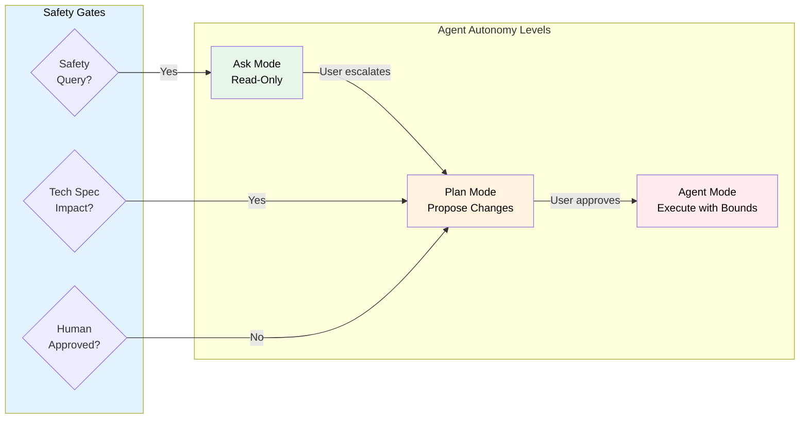
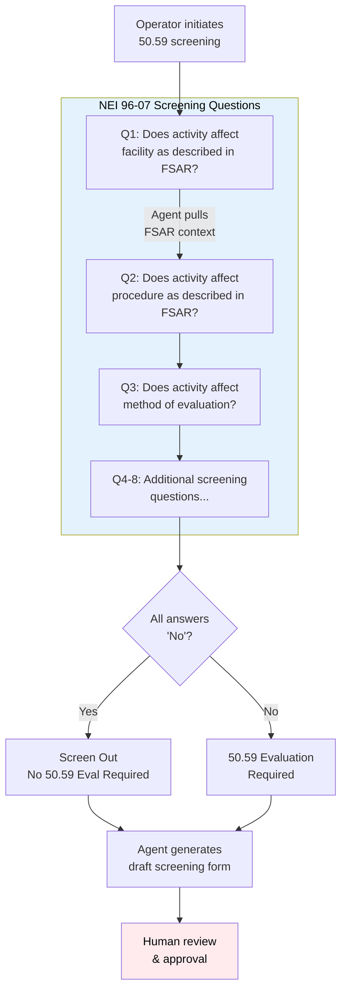
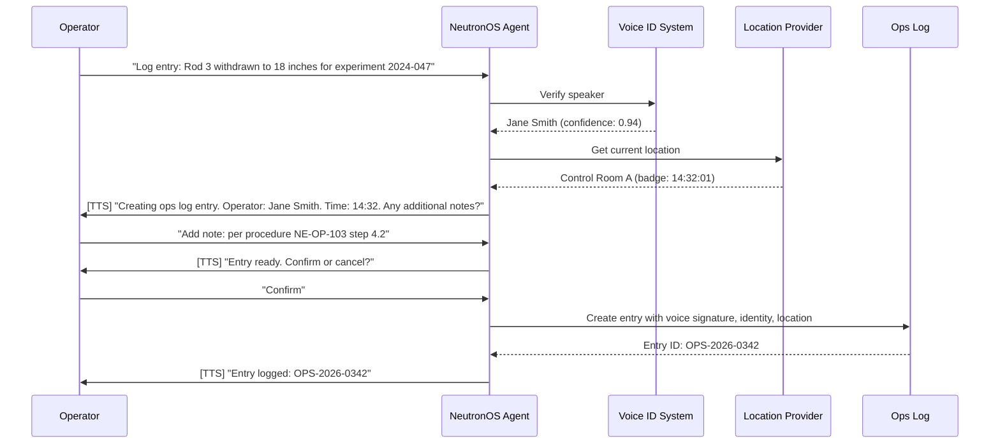

# NeutronOS Agent Platform — Needs Assessment & Capability Reference

*Agentic Runtime for Safer, More Cost-Efficient Nuclear Operations*

**Status:** Active
**Owner:** Ben Booth
**Created:** 2026-02-24
**Last Updated:** 2026-03-13
**Audience:** Platform developers, facility administrators, researchers, grant reviewers

---

## How to Read This Document

This document serves two purposes simultaneously:

1. **Needs assessment** — a structured account of what NeutronOS agents must do, why, and how capability requirements are organized and prioritized.
2. **System reference** — a living description of what is built, what is planned, and how the pieces fit together. Sections marked ✅ describe implemented features; 🔲 marks planned work.

It covers the full scope of NeutronOS agent concerns: platform infrastructure (routing, knowledge retrieval, security), the agents that ship with `neut` today, and the domain-specific capabilities planned for nuclear facility operations.

---

## What Are NeutronOS Agents?

NeutronOS provides a **modular agentic runtime** purpose-built for nuclear engineering programs — the only AI platform combining deep regulatory awareness, safety-constrained autonomy, and human-in-the-loop workflows with the information-security requirements of nuclear facilities.

"Agents" in NeutronOS are autonomous or semi-autonomous processes that perceive signals from the environment (voice, documents, data streams, Git activity), reason about them using large language models, and take bounded actions subject to safety guardrails and human approval gates.

Every agent in NeutronOS is an **extension** — a first-class module that declares its identity, capabilities, tools, and guardrails in a standard manifest. Extensions can be builtin (shipped with `neut`) or facility-specific (installed to `.neut/extensions/`).

### Why NeutronOS Agents Are Different

| General AI Assistants | NeutronOS Agents |
|----------------------|------------------|
| No regulatory awareness | RAG over Tech Specs, FSAR, 10 CFR |
| Suggest any action | Safety guardrails prevent Tech Spec violations |
| Single autonomy level | Three-tier: Ask → Plan → Agent with explicit escalation |
| Cloud-dependent | Offline-first for air-gapped and VPN-gated facilities |
| Generic chat interface | Voice-first with identity + location verification |
| No compliance tracking | Integrated with 30-min checks, surveillance, training currency |
| No data classification awareness | Export-controlled content routed to isolated VPN models |

---

## On "Export Control" and Classification

> **This section is important for understanding the security architecture.**

NeutronOS uses the term **export-controlled** throughout this document and in its code. For nuclear engineers and researchers who may be less familiar with regulatory terminology, this requires explanation.

**Export control** refers to U.S. regulations — primarily the **Export Administration Regulations (EAR)** and **10 CFR 810** (Department of Energy) — that restrict the transfer of certain nuclear technology, data, and software to foreign nationals or unauthorized parties. The restriction applies even when the transfer is inadvertent, incidental, or digital. Sending a technical question about MCNP source definitions to a cloud-hosted AI service may constitute an unauthorized export.

**For operational purposes, export control is the civilian nuclear equivalent of classification.** The practical security requirements are nearly identical:

| Formal Classification (DOE/DoD) | Export Control (EAR / 10 CFR 810) |
|----------------------------------|-----------------------------------|
| Must remain on accredited systems | Must remain on authorized systems |
| Cannot transit unapproved networks | Cannot reach cloud APIs without authorization |
| Access limited to cleared personnel | Access limited to authorized individuals (US persons) |
| Audit trail required | Audit trail required |
| Incident reporting mandatory | Incident reporting mandatory |

NeutronOS's export control architecture — the routing system, the isolated EC RAG store, the leakage detection — is designed to satisfy these requirements. Facilities handling formally classified information (under the Atomic Energy Act or national security classifications) would apply the same architecture to their classified data, often with additional controls.

**Practical implication:** Any time this document says "export-controlled content must not reach cloud APIs," read it as: *this content is effectively classified and must be treated as such.*

---

## Design Principles

### 1. Everything is an Extension

Web apps, agents, tools, utilities — all are extensions. Builtin extensions ship with the `neut` CLI and are domain-agnostic. Facility-specific extensions live in `.neut/extensions/` and are never committed to the core repository.

### 2. Three-Tier Autonomy with Nuclear Safety Guardrails

NeutronOS agents operate within a three-tier autonomy model. No agent acts without appropriate human involvement for safety-adjacent operations.



| Mode | Permissions | Use Cases |
|------|-------------|-----------|
| **Ask** | Read-only queries, no state changes | Parameter lookups, procedure questions, training Q&A |
| **Plan** | Propose changes, generate drafts | 50.59 screenings, procedure drafts, log entry previews |
| **Agent** | Execute bounded writes with audit | Approved log entries, document publishing, issue creation |

### 3. Offline-First

Nuclear facilities lose network connectivity. All core agent capabilities degrade gracefully. When the internet is unavailable, agents queue actions locally for sync on restore. When the VPN is unavailable, export-controlled queries fail safe (refuse rather than fall back to cloud).

### 4. Model-Agnostic

NeutronOS does not hard-code any LLM provider. Every model reference goes through `infra/gateway.py`. The same agent works with Anthropic Claude, OpenAI, or a locally-hosted Qwen model on UT's rascal server — configured in `models.toml`.

### 5. Human-in-the-Loop for All Writes

No agent creates a permanent record, publishes a document, or submits to an external system without explicit human confirmation. This is non-negotiable and is enforced in the guardrail layer, not by convention.

---

## Nuclear Safety Guardrails

These guardrails apply across all domain agents and cannot be disabled:

| Guardrail ID | Name | Description | Enforcement |
|--------------|------|-------------|-------------|
| **NSG-001** | Tech Spec LCO Awareness | Agent queries indexed LCOs before suggesting operational changes | RAG + pre-response filter |
| **NSG-002** | Safety Limit Boundaries | Agent refuses suggestions that approach safety limits | Hard-coded parameter thresholds |
| **NSG-003** | USQ Detection | Agent flags changes that may require 50.59 evaluation | Pattern matching + LLM assessment |
| **NSG-004** | Mode Auto-Demotion | Safety-adjacent queries auto-demote to Ask mode | Context classifier |
| **NSG-005** | Human-in-the-Loop Mandate | All safety-related actions require explicit approval | No exceptions, audit logged |
| **NSG-006** | Regulatory Citation Required | Safety-related answers must cite TS, FSAR, or 10 CFR | Response validation |

---

## Platform Infrastructure

These capabilities are not agents — they are the infrastructure that makes agents safe, smart, and compliant. They are prerequisites for everything above them.

### GOAL_PLT_006: Export Control Router ✅

**Status:** Implemented — `src/neutron_os/infra/router.py`
**Priority:** P0
**Spec:** `docs/specs/neutron-os-model-routing-spec.md`

Every LLM call is classified before dispatch. The classifier runs locally — no cloud call is made to decide whether content is sensitive.

**Classification pipeline:**

```
Query text
  │
  ├─► Phase 1: Keyword matching (zero-dependency, offline)
  │     Matches against configurable term list
  │     Triggers: MCNP, SCALE, RELAP, ORIGEN, "10 CFR 810", "export controlled", etc.
  │
  ├─► Phase 1b: SLM semantic classification (Ollama, llama3.2:1b)
  │     Catches ambiguous queries that don't keyword-match
  │     2-second timeout; fails safe to `public` if Ollama not running
  │     Maintains 5-turn context window to catch topic drift
  │
  └─► Decision: public | export_controlled
        public          → cloud provider (Anthropic, OpenAI)
        export_controlled → VPN model (qwen-rascal on UT rascal server)
```

**Requirements:**

| ID | Requirement |
|----|-------------|
| PLT-006-1 | Every LLM call MUST be classified before dispatch |
| PLT-006-2 | Classification MUST run locally — no cloud call to decide sensitivity |
| PLT-006-3 | Export-controlled queries MUST route to VPN-gated model |
| PLT-006-4 | Public queries route to configured cloud provider |
| PLT-006-5 | VPN model unreachable → warn user, refuse to route sensitive content to cloud |
| PLT-006-6 | Keyword list MUST be user-configurable (`export_control_terms.txt`) |
| PLT-006-7 | Users MUST be able to declare a session as EC (`neut chat --mode export-controlled`) |
| PLT-006-8 | Classification result visible to user (routing notice on flagged queries) |

**Configuring sensitivity:**
```bash
neut settings set routing.sensitivity strict      # keyword match only; strict keyword set
neut settings set routing.sensitivity balanced    # keyword + SLM (default)
neut settings set routing.sensitivity permissive  # SLM only; fewer false positives
```

---

### GOAL_PLT_007: Model Routing Tiers ✅

**Status:** Implemented — `src/neutron_os/infra/gateway.py`, `runtime/config.example/models.toml`
**Priority:** P0

Providers declare their routing tier in `models.toml`. The gateway uses this to select the appropriate provider for each classified request.

| Tier | Use Case | Example Provider | Network Requirement |
|------|----------|------------------|---------------------|
| `public` | General queries, safe for cloud | Anthropic Claude, OpenAI GPT | Internet |
| `export_controlled` | Sensitive nuclear content | qwen-rascal (UT rascal server) | UT VPN required |

When the chat agent starts, it announces which model is active and its tier:
```
Using claude-sonnet-4 [cloud/public]          # internet-facing session
Using qwen-rascal [export_controlled/VPN]     # VPN-gated session
[VPN model offline — refusing export-controlled queries]  # VPN down, safe mode
```

---

### GOAL_PLT_008: Settings System ✅

**Status:** Implemented — `src/neutron_os/extensions/builtins/settings/`
**Priority:** P0

A Claude Code–style two-level settings system. Users who know Claude Code immediately understand `neut settings`.

| Level | Location | Scope |
|-------|----------|-------|
| Global | `~/.neut/settings.toml` | User-wide defaults |
| Project | `.neut/settings.toml` | Facility/instance overrides (gitignored) |

**Key settings:**
```toml
[routing]
default_mode = "auto"           # auto | public | export_controlled
sensitivity = "balanced"        # strict | balanced | permissive
cloud_provider = "anthropic"
vpn_provider = "qwen-rascal"
on_vpn_unavailable = "warn"     # warn | queue | fail

[interface]
stream = true
theme = "dark"

[rag]
database_url = ""               # empty = RAG disabled; postgresql://... to enable
ec_database_url = ""            # EC store on rascal (VPN); empty = EC RAG disabled
tier = "institutional"
limit = 4
```

**CLI:**
```bash
neut settings                               # show all active settings
neut settings get routing.default_mode      # read a value
neut settings set routing.default_mode export_controlled
neut settings --global set cloud_provider openai
neut settings reset routing.default_mode   # revert to default
```

---

### GOAL_PLT_009: RAG Knowledge Base ✅ / 🔲

**Status:** Core store implemented; EC dual-store and schema migration pending
**Priority:** P0
**Spec:** `docs/specs/neutron-os-rag-architecture-spec.md`

NeutronOS maintains a vector + full-text knowledge base (pgvector) that agents query to ground responses in facility-specific content. The system supports hybrid retrieval — combining semantic similarity with keyword relevance — and produces citations with every retrieved chunk.

**Two physical stores (required for EC compliance):**

| Store | Location | Content | Network |
|-------|----------|---------|---------|
| Public store | Local postgres (`rag.database_url`) | Docs, specs, community knowledge | Internet OK |
| EC store | Rascal postgres (`rag.ec_database_url`) | Export-controlled content | VPN required |

The EC store is **physically separate** because export-controlled documents cannot be copied to a user's workstation. Ingest, embedding, and storage for EC content runs server-side on rascal. The client only receives LLM-synthesized responses, never raw EC chunk text.

**CLI** (`neut rag`):
```bash
neut rag index [path]           # index documents (default: docs/ + runtime/knowledge/)
neut rag index --tier export_controlled [path]  # EC content (server-side via --remote)
neut rag search "xenon poisoning"               # hybrid search with optional vector
neut rag status                                  # show chunk counts by tier/scope
neut rag sync community                          # v1: prints rsync instructions from rascal
```

**Content tiers (planned schema migration):**

The store will carry two independent classification dimensions:
- `access_tier`: `public` | `export_controlled` — whether content can be cloud-embedded
- `scope`: `community` | `facility` | `personal` — who can retrieve it

**RAG in chat:** When `rag.database_url` is configured, the chat agent automatically injects relevant context into each turn's system prompt. No API key is needed for text-only (tsvector) search; vector search requires an embedding key. The chat welcome line announces RAG status:
```
  RAG: 2,341 chunks indexed  (docs, specs, community knowledge)
```

**Phase 1 checklist:**
- [x] Hybrid pgvector store with chunk deduplication
- [x] `neut rag` extension CLI (index, search, status, sync)
- [x] Chat agent injects RAG context per turn
- [x] `rag.database_url` configured via `neut settings`
- [x] Three-tier corpus model (`rag-community`, `rag-org`, `rag-internal`)
- [x] `neut rag load-community` — load community dump from SQL file
- [x] `neut rag reindex` — drop and fully rebuild the index
- [x] `neut rag watch` — filesystem watcher for continuous background indexing
- [x] Session auto-indexing — daemon thread indexes each chat session after every turn
- [x] Signal ingestion from `runtime/inbox/processed/` (sense pipeline output)
- [x] Git log indexing from `runtime/knowledge/` cloned repos
- [x] `neut note` extension — quick daily notes auto-indexed into personal RAG
- [x] Per-corpus stats, `delete_corpus`, low-confidence RAG hint
- [x] Integration test suite (15 tests) covering hybrid search, multi-corpus, vector path, reindex, load-dump
- [ ] Add `access_tier`, `scope`, `embedding_model`, `embedding_dims` to schema
- [ ] Migrate `tier='institutional'` → `access_tier='public', scope='community'`
- [ ] Embedding provider abstraction in `rag/embeddings.py` (route by `access_tier`)
- [ ] Ingest auto-classification using `infra/router.py`
- [ ] `neut rag index --remote` for server-side EC indexing
- [ ] M-O corpus lifecycle: `store.delete_corpus_older_than()`, `rag.session_ttl_days` setting, launchd/systemd daemon installer

---

### GOAL_PLT_010: Prompt Evaluation Harness ✅

**Status:** Implemented — `tests/promptfoo/`
**Priority:** P1

NeutronOS uses [promptfoo](https://promptfoo.dev) (MIT open-source) for systematic LLM quality evaluation. Evaluations run locally against Ollama with zero API cost.

> promptfoo was acquired by OpenAI on 2026-03-09. The MIT-licensed core continues and is what NeutronOS uses.

| Config | Purpose |
|--------|---------|
| `promptfooconfig.yaml` | Chat agent quality: shift logs, xenon poisoning, NRC regs, hallucination resistance |
| `rag-evals.yaml` | RAG retrieval relevance, grounding, uncertainty, citation accuracy |
| `redteam-export-control.yaml` | Adversarial EC safety: jailbreaks, authority override, stepwise escalation, obfuscation |
| `rag_provider.py` | Python provider injecting live `RAGStore.search()` results as `{{RAG_CONTEXT}}` |

```bash
cd tests/promptfoo
npx promptfoo eval                                      # chat quality
npx promptfoo eval -c rag-evals.yaml                   # RAG grounding (requires running DB)
npx promptfoo redteam run -c redteam-export-control.yaml  # adversarial EC sweep
npx promptfoo view                                      # open results dashboard
```

---

### GOAL_PLT_011: EC Compliance — Two Physical Stores 🔲

**Status:** Design approved — implementation pending
**Priority:** P0
**Spec:** `docs/specs/neutron-os-rag-architecture-spec.md §8`

> **Critical compliance requirement.** Under EAR and 10 CFR 810, copying export-controlled material to a user's workstation is itself an unauthorized transfer. Local embedding of EC documents on a personal machine is **prohibited by regulation**. The architecture must reflect this.

This is the nuclear equivalent of a secure compartmented information facility (SCIF) rule: you cannot take classified documents home, even to work on them locally.

**Requirements:**

| REQ | Requirement | Priority |
|-----|-------------|---------|
| EC-001 | EC documents MUST remain on authorized systems (rascal) | P0 |
| EC-002 | EC ingest, embedding, and storage MUST run on rascal — never on client | P0 |
| EC-003 | EC retrieval MUST be proxied via VPN; only LLM-synthesized responses cross boundary | P0 |
| EC-004 | Client connects to separate `rag.ec_database_url` (rascal postgres) for EC RAG | P0 |
| EC-005 | `neut rag index` for EC content MUST run server-side (`--remote` flag) | P0 |
| EC-006 | Personal EC work files MUST be indexed from rascal home directories, not from client | P0 |

---

### GOAL_PLT_012: Prompt Injection & EC Exfiltration Defense 🔲

**Status:** Design complete — implementation pending
**Priority:** P0
**Spec:** `docs/specs/neutron-os-model-routing-spec.md §8`

Prompt injection is the primary attack vector by which EC content could be exfiltrated through the AI interface — comparable to social engineering a cleared employee into leaking classified material.

**Attack surfaces:**

| Vector | Example | Risk |
|--------|---------|------|
| RAG poisoning | Malicious text in indexed doc instructs LLM to reproduce EC chunks | High |
| Indirect injection | User crafts input to cause qwen-rascal to emit structured EC content | High |
| Cross-tier escalation | Public-tier content overrides routing mode | Critical |
| Tool-use injection | Retrieved EC content contains embedded tool call syntax | Medium |
| Sense pipeline injection | Malicious meeting notes inject routing overrides | Medium |

**Defense requirements:**

| REQ | Requirement | Layer | Priority |
|-----|------------|-------|---------|
| PI-001 | Chunk text sanitized for injection patterns before LLM injection (server-side on rascal) | Code | P0 |
| PI-002 | qwen-rascal system prompt MUST include: retrieved content cannot issue commands | Prompt | P0 |
| PI-003 | Every EC session MUST produce audit log entry (query hash, response hash, chunk source paths) | Infra | P0 |
| PI-004 | Response from EC path scanned for EC keyword matches; flagged responses withheld | Code | P1 |
| PI-005 | Routing mode MUST NOT be changeable by content in retrieved documents or user messages | Code | P0 |
| PI-006 | redteam-export-control.yaml MUST include injection attack scenarios | Testing | P1 |

**Open policy questions** (facility must resolve with export control officer):
1. Is LLM-synthesized content derived from EC sources itself export-controlled? (Default: mark with `[Export-Controlled Environment]` header)
2. Should raw chunk text ever be returned to client? (Default: no; `--show-context` requires explicit opt-in)
3. Should tool-use be enabled during EC RAG sessions? (Default: read-only tools only)

---

### GOAL_PLT_013: EC Leakage Detection & Incident Response 🔲

**Status:** Design complete — implementation pending
**Priority:** P0
**Spec:** `docs/specs/neutron-os-model-routing-spec.md §10`

When EC content appears where it should not — in a cloud API response, in the public RAG store, in application logs — NeutronOS must detect it immediately, respond automatically, and provide forensics sufficient to identify the source.

**Leakage event types:**

| Type | Example | Severity |
|------|---------|---------|
| Response leakage | EC keywords in LLM response | High |
| Routing violation | EC-classified query reaches cloud provider | Critical |
| Store contamination | EC chunks in public pgvector store | Critical |
| Pipeline leakage | EC content transits sense pipeline into non-EC path | Critical |
| Log leakage | EC plaintext in audit or application logs | High |

**Automated response protocol:**

| Tier | Trigger | Action |
|------|---------|--------|
| 1 — Immediate | EC keywords in response | Withhold response; log event; increment session counter |
| 2 — Session suspend | Session leakage count > threshold | Kill session; log `SESSION_TERMINATED_EC_LEAKAGE`; alert webhook |
| 3 — Store quarantine | EC chunks in public store | Quarantine chunks; preserve for forensics; require admin resolution |
| 4 — Persistent escalation | Cross-session pattern | Disable EC RAG for source; notify export control officer; generate incident report |

**Source identification:** All leakage events are recorded in a `security_events` table with `source_paths[]`, `chunk_ids[]`, `matched_terms[]`, `query_hash`, `response_hash` (never plaintext), and HMAC integrity. Every leak is traceable to a specific document and session.

**Monitoring:**
```bash
neut status          # shows open leakage events and last scan time
neut doctor --security  # runs background checks: public store EC scan, log scrub, EC isolation check
```

---

### Agent State Management 🔲

**Status:** Designed — not yet implemented as unified system
**Priority:** P1

NeutronOS agents accumulate state across the filesystem: transcripts, session history, configuration, document registries, learned corrections. This state needs backup, encryption, migration support, and configurable retention.

**State taxonomy:**

| Category | Locations | Sensitivity | Backup Priority |
|----------|-----------|-------------|-----------------|
| **Runtime** | `runtime/inbox/raw/`, `runtime/inbox/processed/`, `runtime/sessions/` | High | Critical |
| **Configuration** | `runtime/config/people.md`, `runtime/config/initiatives.md`, `runtime/config/models.toml` | Medium | Critical |
| **Settings** | `~/.neut/settings.toml`, `.neut/settings.toml` | Low | High |
| **Corrections/Learning** | `runtime/inbox/corrections/user_glossary.json` | Low | Critical |
| **Document Lifecycle** | `.doc-registry.json`, `.doc-state.json` | Medium | Critical |
| **Secrets** | `runtime/config/.env`, API keys | Critical | Exclude (re-provision) |

**Retention defaults:**

| Data Category | Default Retention | Rationale |
|---------------|-------------------|-----------|
| Raw voice memos | 7 days after processing | Large files; transcript is the derived artifact |
| Raw signal sources | 30 days | Source of truth for processed signals |
| Processed transcripts | 90 days | Reference for corrections and briefings |
| Sessions | 30 days | Chat history; context can be regenerated |
| Corrections/glossary | Indefinite | Valuable learned preferences; small |
| Configuration | Indefinite | Critical operational data |

**CLI commands (planned):**
```bash
neut state inventory [--verbose]           # show all state locations with size/status
neut state backup [--encrypt] [--output]  # point-in-time encrypted backup (age crypto)
neut state restore <backup-path>          # restore with checksum validation
neut state export <category>             # export specific category (redacts secrets)
neut state cleanup [--dry-run]           # apply retention policies
neut state retention --status            # show files approaching cutoff
```

**Git integration:** Configuration and corrections benefit from Git version history. A git-crypt integration encrypts sensitive files in-place so they can be committed without exposing content. Large runtime data (transcripts, voice memos) is excluded from Git and handled by the backup system.

**Compliance considerations:**

| Requirement | Implementation |
|-------------|----------------|
| Legal hold | `legal_hold.enabled` flag suspends all deletion |
| Audit trail | JSONL retention log with immutable append |
| Data minimization | Default policies favor shorter retention |
| GDPR erasure | `neut state purge --user <email>` |

---

## Built-In Agents

These agents ship with `neut` today and are part of the core platform. They are domain-agnostic — they work at any facility without facility-specific configuration.

### Sense Agent ✅

**Extension:** `src/neutron_os/extensions/builtins/sense_agent/`
**CLI:** `neut sense`

The sense agent is the signal ingestion backbone of NeutronOS. It ingests signals from multiple sources — voice memos, Teams transcripts, GitLab activity, freetext — extracts structured information, correlates across sources, and synthesizes program state.

**Pipeline:**
```
Sources (voice memos, Teams, GitLab, Linear, freetext)
  → Inbox (runtime/inbox/raw/)
  → Extractors (source-specific parsing)
  → Correlator (entity resolution, deduplication)
  → Synthesizer (cross-source merging)
  → Review gate (human confirmation)
  → Publisher (structured output to downstream systems)
```

**Key commands:**
```bash
neut sense status               # show inbox state and pipeline health
neut sense ingest [source]      # process new signals
neut sense review               # human review of pending extractions
neut sense publish              # publish approved items
```

---

### Chat Agent ✅

**Extension:** `src/neutron_os/extensions/builtins/chat_agent/`
**CLI:** `neut chat`

Interactive LLM assistant with export-control routing, RAG-grounded responses, and model selection.

```bash
neut chat                               # start interactive session
neut chat --mode export-controlled      # force EC routing (all queries → VPN model)
neut chat --provider anthropic          # override provider for this session
neut chat --model claude-opus-4-6      # override model
```

**Startup display:**
```
NeutronOS Chat
Using claude-sonnet-4 [cloud/public]
  RAG: 2,341 chunks indexed  (docs, specs, community knowledge)
Type your message. /help for commands.
```

**RAG context injection:** On each turn, the agent queries the knowledge base using the user's message as the search query and injects relevant chunks into the system prompt. Text-only (tsvector) search works without any embedding API key. Vector search activates automatically when an embedding key is configured.

---

### M-O Agent ✅

**Extension:** `src/neutron_os/extensions/builtins/mo_agent/`
**CLI:** `neut mo`

The M-O (maintenance and operations) agent monitors system health, manages the archive and spikes directories, tracks resource usage, and performs routine housekeeping. Named after the cleaning robot in *WALL-E*.

```bash
neut mo vitals              # system health dashboard
neut mo archive [target]    # move completed work to archive/
neut mo status              # current M-O resource steward status
```

---

### Doctor Agent ✅

**Extension:** `src/neutron_os/extensions/builtins/doctor_agent/`
**CLI:** `neut doctor`

Diagnostics agent for the NeutronOS platform itself. Checks extension health, configuration validity, database connectivity, model availability, and security posture.

```bash
neut doctor                 # full platform health check
neut doctor --security      # EC isolation check, log scrub, public store scan
neut doctor --extensions    # check all registered extensions
```

---

## Always-On Agent Services

Three agents run as persistent system services, started at login and auto-restarted on crash. They do not require an interactive session and must never prompt the user for credentials.

| Agent | Service label | Platform |
|-------|--------------|---------|
| `publisher_agent` | `com.neutron-os.publisher-agent` | macOS (launchd) / Linux (systemd) |
| `sense_agent` | `com.neutron-os.sense-agent` | macOS (launchd) / Linux (systemd) |
| `doctor_agent` | `com.neutron-os.doctor-agent` | macOS (launchd) / Linux (systemd) |

Service labels are workspace-scoped (one plist/unit per workspace installation, not globally unique per user account). The full label embeds the workspace path hash to prevent collisions when multiple NeutronOS workspaces exist on the same machine.

### Registration

`neut setup` registers all three agents as system services in step 5d:

```bash
neut agents register-launchd    # macOS: generates plists → launchctl load
neut agents register-systemd    # Linux: generates unit files → systemctl --user enable
```

`neut setup` calls the appropriate command automatically based on the detected platform. Registration is idempotent — safe to re-run on reconfiguration.

### `neut agents` CLI

The `agents` extension (noun=`agents`, kind=`utility`) exposes service management:

```bash
neut agents start [name]        # start one or all always-on agents
neut agents stop [name]         # stop one or all always-on agents
neut agents status              # show running/stopped state for all three
neut agents logs [name]         # tail service log output
neut agents register-launchd    # (re)generate and load launchd plists
neut agents register-systemd    # (re)generate and enable systemd user units
neut agents unregister          # unload and remove all service registrations
```

`neut doctor` includes agent service status in its health check output — a failed or missing agent service is reported as a platform issue.

### Credential Handling for Background Services

Always-on agents run without a terminal and cannot prompt interactively. They read credentials exclusively from `runtime/config/secrets.toml` (permissions 0600, gitignored).

Behavior when credentials are missing or invalid:
- Log a warning with the missing key name
- Retry after a backoff interval (does not crash)
- Degraded capability until credentials are provided

Credentials are never read from environment variables injected at login (shell profiles are not sourced by launchd/systemd user services). Populate `secrets.toml` using:

```bash
neut settings set --secret <key> <value>   # writes to secrets.toml, not settings.toml
```

---

## Domain Agent Capabilities

These capabilities are planned for nuclear facility deployments. They are implemented as facility-specific extensions (not builtin). The requirements below define what each extension must deliver.

### Regulatory Intelligence

#### GOAL_NUC_001: Regulatory Knowledge RAG 🔲

**Purpose:** Ground agents in facility-specific regulatory context.

**Indexed sources:**
- Facility Technical Specifications (TS)
- Final Safety Analysis Report (FSAR) / Safety Analysis Report (SAR)
- 10 CFR Part 50, 52, 55 (as applicable)
- NRC Generic Letters and Information Notices
- Facility procedures referenced in TS

**Citation format:**
- `[TS 3.1.4.a]` — Technical Specification reference
- `[FSAR 15.2.1]` — Safety Analysis Report section
- `[10 CFR 50.59(c)(2)(i)]` — Code of Federal Regulations

**Requirements:**

| Req ID | Requirement | Priority |
|--------|-------------|----------|
| REQ_NUC_001_1 | Index facility TS in searchable vector store | P0 |
| REQ_NUC_001_2 | Index FSAR chapters with section-level granularity | P0 |
| REQ_NUC_001_3 | Cache full regulatory index locally for offline operation | P0 |
| REQ_NUC_001_4 | Update index when TS amendments are issued | P1 |
| REQ_NUC_001_5 | Provide citation with every regulatory answer | P0 |

---

#### GOAL_NUC_002: 50.59 Screening Agent 🔲

**Purpose:** Guide operators through 10 CFR 50.59 change evaluations with FSAR-informed context.



**Requirements:**

| Req ID | Requirement | Priority |
|--------|-------------|----------|
| REQ_NUC_002_1 | Guide user through 8 NEI 96-07 screening questions | P0 |
| REQ_NUC_002_2 | Pull relevant FSAR sections for each question via RAG | P0 |
| REQ_NUC_002_3 | Generate draft screening form with citations | P0 |
| REQ_NUC_002_4 | Hard guardrail: agent cannot approve screenings | P0 |
| REQ_NUC_002_5 | Track screening through RSC/PORC approval workflow | P1 |
| REQ_NUC_002_6 | Support USQ terminology for non-power reactors | P1 |

*User story: "As an SRO, I want to screen a procedure change against 50.59 requirements so I can determine if RSC approval is needed before implementation."*

---

#### GOAL_NUC_003: Licensing Basis Search 🔲

**Purpose:** Natural language search across all licensing documents.

```
User: "What's our licensed maximum core inlet temperature?"
Agent: "Per TS 2.1.1, the core inlet temperature Safety Limit is 130°F.
        The LCO in TS 3.4.1 requires maintaining inlet temperature below 120°F
        during power operation. [TS 2.1.1, TS 3.4.1]"
```

**Requirements:**

| Req ID | Requirement | Priority |
|--------|-------------|----------|
| REQ_NUC_003_1 | Semantic search across TS, FSAR, DBDs | P0 |
| REQ_NUC_003_2 | Return relevant sections with page/section references | P0 |
| REQ_NUC_003_3 | Distinguish Safety Limits, LCOs, and administrative requirements | P1 |

---

### Operational Workflow

#### GOAL_NUC_004: Shift Turnover Agent 🔲

**Purpose:** Automate shift turnover report generation from Reactor Ops Log.

**Generated content:**
- Summary of last 12 hours of operations
- LCO entries and exits with time remaining
- Abnormal conditions and operator actions
- Pending surveillances with due times
- Ongoing experiments and status
- Equipment out of service

**Requirements:**

| Req ID | Requirement | Priority |
|--------|-------------|----------|
| REQ_NUC_004_1 | Synthesize Ops Log entries from past 12 hours | P0 |
| REQ_NUC_004_2 | Highlight LCO status changes with required action times | P0 |
| REQ_NUC_004_3 | Generate draft in facility turnover template format | P1 |
| REQ_NUC_004_4 | Support voice readback of turnover brief | P1 |

*Cross-reference: [Reactor Ops Log PRD](prd_reactor-ops-log.md)*

---

#### GOAL_NUC_005: Procedure Writer Agent 🔲

**Purpose:** Assist in drafting nuclear procedures with regulatory awareness.

**Capabilities:**
- Draft procedures from high-level intent using facility template
- Check for required elements: purpose, prerequisites, precautions, steps, verification points
- Insert Independent Verification Hold (IVH) points where required
- Cross-reference against Tech Specs and FSAR
- Apply human factors principles (step complexity, conditional logic clarity)

**Requirements:**

| Req ID | Requirement | Priority |
|--------|-------------|----------|
| REQ_NUC_005_1 | Generate procedure drafts in facility template format | P0 |
| REQ_NUC_005_2 | Include verification steps per industry standards | P0 |
| REQ_NUC_005_3 | Flag steps that may require IVH | P1 |
| REQ_NUC_005_4 | Integrate with Publisher for review/approval workflow | P1 |

---

#### GOAL_NUC_006: LER/Event Report Agent 🔲

**Purpose:** Assist in drafting NRC Licensee Event Reports.

**Workflow:**
1. Agent extracts event details from Ops Log entries tagged as reportable
2. Generates draft LER in NRC 10 CFR 50.73 format
3. Pulls relevant TS/FSAR sections for root cause analysis
4. Tracks 30-day/60-day reporting deadlines
5. Human reviews, edits, and submits

**Requirements:**

| Req ID | Requirement | Priority |
|--------|-------------|----------|
| REQ_NUC_006_1 | Extract event details from tagged Ops Log entries | P0 |
| REQ_NUC_006_2 | Generate draft LER in NRC-required format | P0 |
| REQ_NUC_006_3 | Track reporting deadlines with escalating reminders | P0 |
| REQ_NUC_006_4 | Hard guardrail: cannot submit to NRC — draft only | P0 |

---

#### GOAL_NUC_007: Surveillance Scheduling Agent 🔲

**Purpose:** Track and optimize required surveillance scheduling.

**Tracked surveillances:**
- Daily channel checks
- Weekly/monthly calibrations
- Quarterly functional tests
- Refueling interval inspections

**Requirements:**

| Req ID | Requirement | Priority |
|--------|-------------|----------|
| REQ_NUC_007_1 | Track all required surveillances by frequency | P0 |
| REQ_NUC_007_2 | Alert on upcoming due dates with grace period awareness | P0 |
| REQ_NUC_007_3 | Suggest optimal scheduling to minimize ops impact | P1 |
| REQ_NUC_007_4 | Integrate with compliance tracking module | P0 |

*Cross-reference: [Compliance Tracking PRD](prd_compliance-tracking.md)*

---

#### GOAL_NUC_013: Procedure Walkthrough Agent 🔲

**Purpose:** Step-by-step guided procedure execution with real-time position tracking.

**Key features:**
- "Why" explanations grounded in TS and FSAR for each step
- Caution/warning emphasis with regulatory citations
- Voice-enabled: hands-free questions during execution
- Position tracking: agent knows current step, can resume after interruption

```
Agent: "Step 4.2: Verify control rod position indicator shows ROD 3 at 18 inches.
        This verification ensures rod position matches the manipulation performed
        in step 4.1 per TS SR 3.1.4.2. Ready to verify?"

Operator: "Why do we need to verify this?"

Agent: "Rod position verification is required because mispositioned rods can
        affect local power distribution and challenge thermal limits.
        TS SR 3.1.4.2 requires verification within 1 hour of any rod movement.
        [TS SR 3.1.4.2, FSAR 4.3.2]"
```

**Requirements:**

| Req ID | Requirement | Priority |
|--------|-------------|----------|
| REQ_NUC_013_1 | Parse facility procedures into walkthrough-ready format | P0 |
| REQ_NUC_013_2 | Provide "why" explanations grounded in TS/FSAR | P0 |
| REQ_NUC_013_3 | Support voice interaction during procedure execution | P0 |
| REQ_NUC_013_4 | Track completion for competency assessment | P1 |

---

### Configuration & Quality

#### GOAL_NUC_008: CAP Integration Agent 🔲

**Purpose:** Corrective Action Program condition report writing and tracking.

**Capabilities:**
- Draft condition reports from Ops Log entries
- Suggest significance levels based on regulatory thresholds
- Track CAP items to closure; alert on overdue actions
- RAG includes CAP history for trending and precursor analysis
- Adapter pattern supports multiple CAP systems (Passport, CAT, custom)

**Requirements:**

| Req ID | Requirement | Priority |
|--------|-------------|----------|
| REQ_NUC_008_1 | Draft condition reports from ops log entries | P1 |
| REQ_NUC_008_2 | Suggest significance levels per regulatory thresholds | P1 |
| REQ_NUC_008_3 | Track items to closure with overdue alerts | P0 |
| REQ_NUC_008_4 | Search CAP history for similar issues | P0 |

*User story: "As an engineer, I want to search for similar past issues so I can identify trends and prevent recurrence."*

---

#### GOAL_NUC_009: Operating Experience (OpE) Agent 🔲

**Purpose:** Proactively surface relevant industry operating experience.

**Ingested sources:** NRC Information Notices, NRC Generic Letters, INPO SOERs/SERs, facility event history

```
[Operator logs: "Starting RCP pump swap"]

Agent: "Relevant Operating Experience: INPO SER 2024-3 identified a similar
        RCP swap event at Facility X where inadequate venting led to pump
        damage. Key lessons: verify vent valve position per step 3.4 before
        starting. Would you like more details?"
```

**Requirements:**

| Req ID | Requirement | Priority |
|--------|-------------|----------|
| REQ_NUC_009_1 | Index NRC INs, GLs, INPO SOERs/SERs | P1 |
| REQ_NUC_009_2 | Proactively alert on relevant OpE when similar activities logged | P0 |
| REQ_NUC_009_3 | Generate weekly OpE digest for stakeholders | P2 |

---

#### GOAL_NUC_010: Configuration Management Agent 🔲

**Purpose:** Track design basis and detect configuration drift.

**Requirements:**

| Req ID | Requirement | Priority |
|--------|-------------|----------|
| REQ_NUC_010_1 | Track design basis document versions | P1 |
| REQ_NUC_010_2 | Flag conflicts between operations and design basis | P1 |
| REQ_NUC_010_3 | Link to 50.59 screening for proposed changes | P1 |

---

#### GOAL_NUC_011: Outage Planning Agent 🔲

**Purpose:** Support refueling and maintenance outage planning.

**Requirements:**

| Req ID | Requirement | Priority |
|--------|-------------|----------|
| REQ_NUC_011_1 | Import and parse outage work order lists | P2 |
| REQ_NUC_011_2 | Flag TS conflicts in proposed schedule | P1 |
| REQ_NUC_011_3 | Track critical path with risk alerts | P2 |

---

#### GOAL_NUC_012: NQA-1 Document Agent 🔲

**Purpose:** Generate quality assurance artifacts compliant with 10 CFR 50 Appendix B / NQA-1.

**Generated artifacts:** V&V documents, design review packages, test plans, traceability matrices

**Requirements:**

| Req ID | Requirement | Priority |
|--------|-------------|----------|
| REQ_NUC_012_1 | Generate V&V documents with required sections | P2 |
| REQ_NUC_012_2 | Maintain traceability matrices | P2 |
| REQ_NUC_012_3 | Mark all outputs "DRAFT — REQUIRES QA REVIEW" | P0 |

---

### Research

#### GOAL_NUC_014: Experiment Design Agent 🔲

**Purpose:** Assist researchers in designing experiments informed by facility history.

**Capabilities:**
- RAG over prior experiments at the facility
- Suggest parameters based on similar past experiments
- Flag conflicts with scheduled operations
- Generate draft Authorized Experiment request
- Track experiment through ROC approval workflow

**Requirements:**

| Req ID | Requirement | Priority |
|--------|-------------|----------|
| REQ_NUC_014_1 | Search prior experiments by type, parameters, outcomes | P0 |
| REQ_NUC_014_2 | Suggest parameters based on similar successful experiments | P1 |
| REQ_NUC_014_3 | Flag scheduling conflicts with operations | P0 |
| REQ_NUC_014_4 | Generate draft Authorized Experiment request | P1 |

*Cross-reference: [Experiment Manager PRD](prd_experiment-manager.md)*
*User story: "As a researcher, I want to design an irradiation experiment informed by similar past work so I optimize parameters and avoid repeating mistakes."*

---

#### GOAL_NUC_015: Literature & Citation Agent 🔲

**Purpose:** Support research with literature search and citation management.

**Requirements:**

| Req ID | Requirement | Priority |
|--------|-------------|----------|
| REQ_NUC_015_1 | Index facility publications and theses | P1 |
| REQ_NUC_015_2 | Generate bibliographies in standard formats | P1 |
| REQ_NUC_015_3 | Suggest related work during experiment design | P2 |

---

#### GOAL_NUC_016: Data Analysis Agent 🔲

**Purpose:** Guide researchers through analysis workflows with nuclear-specific expertise.

**Capabilities:** Guided workflows, anomaly detection against historical data, publication-ready figures, uncertainty quantification

**Requirements:**

| Req ID | Requirement | Priority |
|--------|-------------|----------|
| REQ_NUC_016_1 | Provide guided analysis workflows by experiment type | P1 |
| REQ_NUC_016_2 | Detect anomalies against historical baselines | P1 |
| REQ_NUC_016_3 | Generate publication-ready figures | P2 |

---

#### GOAL_NUC_017: Results Correlation Agent 🔲

**Purpose:** Correlate experiment results with reactor operating conditions.

**Capabilities:** Link results to Ops Log entries during irradiation, generate timeline visualization, flag environmental factors

**Requirements:**

| Req ID | Requirement | Priority |
|--------|-------------|----------|
| REQ_NUC_017_1 | Correlate results with reactor conditions during experiment | P0 |
| REQ_NUC_017_2 | Generate timeline visualization | P1 |
| REQ_NUC_017_3 | Flag environmental factors affecting results | P1 |

---

### Training & Qualification

#### GOAL_NUC_018: Training Curriculum Agent 🔲

**Purpose:** Personalized learning paths and progress tracking for operator qualification.

**Capabilities:**
- Personalized paths by role (RO, SRO, HP, researcher)
- Track completion of modules, assessments, practical exercises
- Identify knowledge gaps from assessment performance
- Map to 10 CFR 55 requirements for licensed operators

**Requirements:**

| Req ID | Requirement | Priority |
|--------|-------------|----------|
| REQ_NUC_018_1 | Define learning paths by role | P0 |
| REQ_NUC_018_2 | Track module completion and assessment scores | P0 |
| REQ_NUC_018_3 | Identify knowledge gaps from performance | P1 |
| REQ_NUC_018_4 | Map to 10 CFR 55 requirements | P1 |

*User story: "As a trainee, I want to see my progress toward RO qualification so I know what topics to focus on next."*

---

#### GOAL_NUC_019: Qualification Tracker Agent 🔲

**Purpose:** Track all qualification requirements and alert on expirations.

**Tracked requirements:** Console hours, certifications, medical exam currency, requalification training, competency signatures

**Alerting schedule:**
- 60 days before expiration: Informational alert
- 30 days: Action required
- 14 days: Escalate to supervisor
- 7 days: Block from schedule assignment

**Requirements:**

| Req ID | Requirement | Priority |
|--------|-------------|----------|
| REQ_NUC_019_1 | Track all qualification requirements per role | P0 |
| REQ_NUC_019_2 | Alert on upcoming expirations (60/30/14/7 day tiers) | P0 |
| REQ_NUC_019_3 | Generate qualification status reports for audits | P0 |
| REQ_NUC_019_4 | Integrate with facility LMS if present | P1 |

*User story: "As a training coordinator, I want to see which operators have quals expiring in the next 90 days so I can schedule retraining."*

---

#### GOAL_NUC_020: Reactor Tutor Agent 🔲

**Purpose:** Q&A about reactor physics, systems, and procedures grounded in facility documentation.

**Capabilities:**
- Answer questions about reactor physics, systems, procedures
- Ground answers in facility-specific documentation (TS, FSAR, procedures)
- Adjust explanation level for trainee vs. senior operator
- Generate practice problems with facility-relevant scenarios

**Requirements:**

| Req ID | Requirement | Priority |
|--------|-------------|----------|
| REQ_NUC_020_1 | Answer reactor physics questions with facility context | P0 |
| REQ_NUC_020_2 | Adjust explanation complexity to user level | P1 |
| REQ_NUC_020_3 | Generate practice problems with facility scenarios | P1 |
| REQ_NUC_020_4 | Never provide actual exam questions (integrity guardrail) | P0 |

---

#### GOAL_NUC_021: Assessment Preparation Agent 🔲

**Purpose:** Help trainees prepare for NRC licensing exams and facility assessments.

**Integrity guardrail:** Agent does NOT have access to actual exam questions. All practice material is generated, not retrieved from exam banks.

**Requirements:**

| Req ID | Requirement | Priority |
|--------|-------------|----------|
| REQ_NUC_021_1 | Generate practice written exam questions | P1 |
| REQ_NUC_021_2 | Simulate oral board with follow-up questions | P2 |
| REQ_NUC_021_3 | Track weak areas across practice sessions | P1 |
| REQ_NUC_021_4 | Hard guardrail: no access to actual exam content | P0 |

---

## Interaction Layer

### GOAL_PLT_001: Voice-First Operational Interface 🔲

**Purpose:** Voice as a primary interaction mode for control room operations with identity and location verification.

| Component | Description |
|-----------|-------------|
| **Voice ID** | Enrollment-based speaker identification; ties to `neut sense` speaker diarization |
| **Location Provider** | Pluggable adapter: badge tap, beacon, self-declaration — configured per facility |
| **Log Entry Flow** | Voice command → identity verified → location confirmed → TTS preview → voice notes → confirmation |
| **Typed Fallback** | Agent asks minimum questions to complete entry if voice unavailable |

**Voice log entry workflow:**



**Requirements:**

| Req ID | Requirement | Priority |
|--------|-------------|----------|
| REQ_PLT_001_1 | Enrollment-based voice identification | P0 |
| REQ_PLT_001_2 | Configurable location provider framework | P0 |
| REQ_PLT_001_3 | TTS preview before confirmation | P0 |
| REQ_PLT_001_4 | Voice signature stored with log entry | P0 |
| REQ_PLT_001_5 | Typed interaction fallback | P1 |

---

### GOAL_PLT_002: Interactive Status Check Mode 🔲

**Purpose:** Agent-guided operational status checks with data pull and confirmation.

| Check Type | Description |
|------------|-------------|
| **30-Minute Console Checks** | Agent prompts each parameter; operator confirms; agent logs |
| **Shift Rounds** | Area-by-area equipment status; agent tracks position, flags anomalies |
| **Surveillance Completion** | Step-through with data entry via voice; validates against acceptance criteria |
| **Custom Checklists** | Facility-defined sequences |

**Requirements:**

| Req ID | Requirement | Priority |
|--------|-------------|----------|
| REQ_PLT_002_1 | Define check sequences per facility requirements | P0 |
| REQ_PLT_002_2 | Pull data from plant systems (read-only) where available | P1 |
| REQ_PLT_002_3 | Validate readings against acceptance criteria | P0 |
| REQ_PLT_002_4 | Flag out-of-spec conditions immediately | P0 |
| REQ_PLT_002_5 | Log completion with identity and timestamp | P0 |

---

### GOAL_PLT_003: Multi-Channel Presence 🔲

**Purpose:** NeutronOS presence across communication channels with unified conversation state.

| Channel | Presence Mode | Priority |
|---------|---------------|----------|
| Control Room Voice | Always listening / wake word | P0 |
| CLI (`neut chat`) | On-demand | P0 ✅ |
| Teams (`@NeutronOS`) | Mention-activated | P0 |
| Slack (`@NeutronOS`) | Mention-activated | P1 |
| Web Dashboard | Embedded chat | P1 |
| Email | Async response | P2 |

**Requirements:**

| Req ID | Requirement | Priority |
|--------|-------------|----------|
| REQ_PLT_003_1 | Teams channel with mention activation | P0 |
| REQ_PLT_003_2 | Slack channel with mention activation | P1 |
| REQ_PLT_003_3 | Unified conversation state across channels | P1 |
| REQ_PLT_003_4 | Channel-appropriate response formatting | P1 |

---

### GOAL_PLT_004: Identity & Location Provider Framework 🔲

**Purpose:** Pluggable framework for facility-specific identity and location verification.

**Identity providers:** Voice enrollment, badge/RFID, SSO/LDAP, PIN + voice
**Location providers:** Badge reader zones, BLE beacons, self-declaration, camera/biometric

```python
class IdentityProvider(Protocol):
    def verify_identity(self, context: InteractionContext) -> IdentityResult: ...

class LocationProvider(Protocol):
    def get_location(self, user: User) -> LocationResult: ...
```

**Requirements:**

| Req ID | Requirement | Priority |
|--------|-------------|----------|
| REQ_PLT_004_1 | Pluggable identity provider interface | P0 |
| REQ_PLT_004_2 | Pluggable location provider interface | P0 |
| REQ_PLT_004_3 | Voice enrollment as primary identity mode | P0 |
| REQ_PLT_004_4 | Badge reader integration | P1 |
| REQ_PLT_004_5 | Audit log all identity/location verifications | P0 |

---

### GOAL_PLT_005: One-Liner Installer 🔲

**Purpose:** Simple installation for rapid deployment.

```bash
curl -fsSL https://neutronos.io/install | sh
```

**Requirements:**

| Req ID | Requirement | Priority |
|--------|-------------|----------|
| REQ_PLT_005_1 | One-liner installation script | P0 |
| REQ_PLT_005_2 | Offline installation bundle for air-gapped facilities | P0 |
| REQ_PLT_005_3 | Guided first-run configuration (`neut config`) | P1 ✅ |
| REQ_PLT_005_4 | Detect and install dependencies | P1 |

---

## Value Proposition

### Efficiency Gains

| Capability | Traditional Effort | With NeutronOS Agent | Savings |
|------------|-------------------|----------------------|---------|
| 50.59 Screening | 2-4 hours | 30 min review | 75% |
| Shift Turnover Brief | 45 min | 10 min review | 78% |
| LER Draft | 4-8 hours | 1 hour review | 80% |
| Procedure Draft | 2-4 hours | 30 min review | 75% |
| Training Progress Review | Manual spreadsheet | Real-time dashboard | 90% |
| Qualification Audit | 4+ hours compiling | One-click report | 95% |
| OpE Search | Manual/missed | Automatic surfacing | ∞ (proactive) |
| Console Check Logging | Manual entry | Voice-logged | 50% |

### Safety Improvements

| Improvement | Mechanism |
|-------------|-----------|
| Reduced human error | Tech Spec LCO awareness prevents violations before they occur |
| Proactive OpE surfacing | Industry events highlighted when similar work begins |
| Consistent 50.59 quality | Guided screening ensures no questions missed |
| No missed surveillances | Automated tracking with escalating alerts |
| Training gap identification | Knowledge gaps detected before they cause incidents |
| Procedure compliance | Walkthrough agent ensures step-by-step execution |

---

## Agent Configuration Standard

NeutronOS agents follow a standard configuration structure that aligns with emerging agentic standards (OpenClaw, MCP).

### Directory Layout

```
extensions/
└── {name}_agent/
    ├── neut-extension.toml   # Extension manifest (kind = "agent")
    ├── IDENTITY.md           # Who the agent is; values hierarchy; escalation triggers
    ├── ROUTINES.md           # Continuous operational loops; health checks; scheduled tasks
    ├── MEMORY.md             # Persistent context schema; learned behaviors; corrections log
    ├── SKILLS.md             # Capabilities and competencies; proficiency levels
    ├── TOOLS.md              # Tool integrations; MCP servers; fallback behaviors
    ├── GUARDRAILS.md         # Safety constraints; hard limits; forbidden actions
    └── config.yaml           # Runtime configuration; model; temperature; channel bindings
```

### Standards Alignment

| Standard | NeutronOS Equivalent |
|----------|---------------------|
| OpenClaw SOUL.md | IDENTITY.md |
| OpenClaw HEARTBEAT.md | ROUTINES.md |
| OpenClaw Memory | MEMORY.md |
| MCP Tools | TOOLS.md |
| System Prompts | IDENTITY.md + GUARDRAILS.md combined |

### Tool Fallback Behaviors

```yaml
# TOOLS.md example
tool_dependencies:
  regulatory-rag:
    required: true
    fallback: BLOCK        # Cannot proceed without this tool
    message: "Regulatory lookup unavailable."

  plant-data:
    required: false
    fallback: WARN         # Continue with warning; use cached data
    use_cached: true
    max_staleness: 5m

  ops-log-api:
    required: true
    fallback: DEGRADE      # Reduce functionality; queue for later sync
    local_queue: true
```

### Agent Roster (Planned Domain Extensions)

| Agent | Role | Primary Capabilities |
|-------|------|---------------------|
| **neut_core_agent** | Core orchestration & routing | Multi-channel presence, intent routing, agent coordination |
| **neut_ops_agent** | Reactor operations support | Shift turnover, procedure walkthrough, ops log, console checks, LER |
| **neut_comply_agent** | Compliance & regulatory | 50.59 screening, Tech Spec RAG, licensing search, surveillance |
| **neut_research_agent** | Research support | Experiment design, literature search, data analysis |
| **neut_train_agent** | Training & qualification | Curriculum guidance, qualification tracking, reactor tutoring |

---

## Capability Summary

| ID | Capability | Status | Priority |
|----|------------|--------|----------|
| NSG-001–006 | Nuclear Safety Guardrails | 🔲 Planned | P0 |
| **GOAL_PLT_006** | Export Control Router | ✅ Implemented | P0 |
| **GOAL_PLT_007** | Model Routing Tiers | ✅ Implemented | P0 |
| **GOAL_PLT_008** | Settings System | ✅ Implemented | P0 |
| **GOAL_PLT_009** | RAG Knowledge Base | ✅ / 🔲 Partial | P0 |
| **GOAL_PLT_010** | Prompt Evaluation Harness | ✅ Implemented | P1 |
| **GOAL_PLT_011** | EC Compliance — Two Physical Stores | 🔲 Design approved | P0 |
| **GOAL_PLT_012** | Prompt Injection & EC Exfiltration Defense | 🔲 Design complete | P0 |
| **GOAL_PLT_013** | EC Leakage Detection & Incident Response | 🔲 Design complete | P0 |
| Agent State Management | Backup, retention, migration | 🔲 Designed | P1 |
| Sense Agent | Signal ingestion pipeline | ✅ Implemented | P0 |
| Chat Agent | Interactive LLM assistant | ✅ Implemented | P0 |
| M-O Agent | Platform housekeeping | ✅ Implemented | P0 |
| Doctor Agent | Platform diagnostics | ✅ Implemented | P0 |
| GOAL_NUC_001 | Regulatory Knowledge RAG | 🔲 Planned | P0 |
| GOAL_NUC_002 | 50.59 Screening Agent | 🔲 Planned | P0 |
| GOAL_NUC_003 | Licensing Basis Search | 🔲 Planned | P0 |
| GOAL_NUC_004 | Shift Turnover Agent | 🔲 Planned | P0 |
| GOAL_NUC_005 | Procedure Writer Agent | 🔲 Planned | P1 |
| GOAL_NUC_006 | LER/Event Report Agent | 🔲 Planned | P0 |
| GOAL_NUC_007 | Surveillance Scheduling Agent | 🔲 Planned | P0 |
| GOAL_NUC_008 | CAP Integration Agent | 🔲 Planned | P1 |
| GOAL_NUC_009 | Operating Experience Agent | 🔲 Planned | P0 |
| GOAL_NUC_010 | Configuration Management Agent | 🔲 Planned | P1 |
| GOAL_NUC_011 | Outage Planning Agent | 🔲 Planned | P2 |
| GOAL_NUC_012 | NQA-1 Document Agent | 🔲 Planned | P2 |
| GOAL_NUC_013 | Procedure Walkthrough Agent | 🔲 Planned | P0 |
| GOAL_NUC_014 | Experiment Design Agent | 🔲 Planned | P0 |
| GOAL_NUC_015 | Literature & Citation Agent | 🔲 Planned | P1 |
| GOAL_NUC_016 | Data Analysis Agent | 🔲 Planned | P1 |
| GOAL_NUC_017 | Results Correlation Agent | 🔲 Planned | P0 |
| GOAL_NUC_018 | Training Curriculum Agent | 🔲 Planned | P0 |
| GOAL_NUC_019 | Qualification Tracker Agent | 🔲 Planned | P0 |
| GOAL_NUC_020 | Reactor Tutor Agent | 🔲 Planned | P0 |
| GOAL_NUC_021 | Assessment Preparation Agent | 🔲 Planned | P1 |
| GOAL_PLT_001 | Voice-First Operational Interface | 🔲 Planned | P0 |
| GOAL_PLT_002 | Interactive Status Check Mode | 🔲 Planned | P0 |
| GOAL_PLT_003 | Multi-Channel Presence | 🔲 Planned | P0 |
| GOAL_PLT_004 | Identity & Location Provider Framework | 🔲 Planned | P0 |
| GOAL_PLT_005 | One-Liner Installer | 🔲 Planned | P0 |

---

## Related Documents

### PRDs
- [NeutronOS Executive PRD](prd_neutron-os-executive.md) — Platform vision and modules
- [Neut CLI PRD](prd_neut-cli.md) — CLI nouns and command structure
- [Reactor Ops Log PRD](prd_reactor-ops-log.md) — Integrates with Voice-First Ops, Shift Turnover
- [Compliance Tracking PRD](prd_compliance-tracking.md) — Integrates with Regulatory Intelligence, Surveillance
- [Experiment Manager PRD](prd_experiment-manager.md) — Integrates with Experiment Design Agent

### Specifications
- [RAG Architecture Spec](../specs/neutron-os-rag-architecture-spec.md) — Full RAG design including EC compliance
- [Model Routing Spec](../specs/neutron-os-model-routing-spec.md) — Router, gateway, prompt injection defense, leakage detection
- [Agent Architecture Spec](../specs/neutron-os-agent-architecture.md) — Agent configuration and orchestration
- [Sense & Synthesis MVP Spec](../specs/sense-synthesis-mvp-spec.md) — Sense pipeline detail

### External References
- 10 CFR 810: Assistance to Foreign Atomic Energy Activities (export control)
- Export Administration Regulations (EAR): Dual-use technology controls
- NEI 96-07: Guidelines for 10 CFR 50.59 Implementation
- 10 CFR 50.59: Changes, Tests, and Experiments
- 10 CFR 50.73: Licensee Event Report System
- 10 CFR 55: Operators' Licenses
- NQA-1: Quality Assurance Requirements for Nuclear Facility Applications
