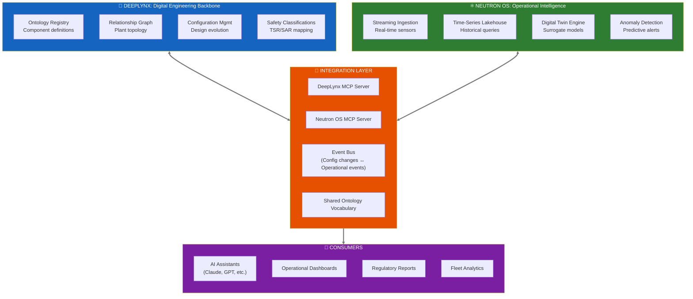

# The Nuclear Data Infrastructure Challenge
## Why DeepLynx + Neutron OS Together Can Do What Neither Can Alone

**Vision Document | January 2026**

---

## The Industry Problem We're Solving Together

Nuclear energy is at an inflection point. The U.S. has 94 operating reactors. Over the next 20 years, industry forecasts suggest **200-500+ new units** (SMRs, microreactors, advanced designs) may be constructed and operated. This represents a data infrastructure challenge the industry has never faced:

| Challenge | Current State | Commercial Scale (2035+) |
|-----------|---------------|--------------------------|
| **Plant configurations** | Manually tracked | 500+ unique designs, continuous updates |
| **Operational time-series** | GB/day per plant | Petabytes/day across fleet |
| **Digital twins** | R&D projects | Production safety systems |
| **Regulatory compliance** | Per-plant reporting | Fleet-wide automation |
| **AI/ML integration** | Experiments | Operational requirements |

**The question isn't whether we need data infrastructure. It's whether we build one coherent architecture or 500 incompatible silos.**

---

## Why "Just Use DeepLynx" Isn't the Answer (And Neither Is "Just Use Neutron OS")

Both systems are excellent—at different things. Trying to make one system do everything leads to architectural compromises that hurt both use cases.

### DeepLynx: The Digital Engineering Backbone

DeepLynx excels at **structural data**—the things that define what a reactor *is*:

| Strength | Why It Matters |
|----------|----------------|
| **Ontology management** | Defines components, relationships, safety classifications |
| **Relationship graphs** | "Control rod A connects to drive mechanism B with parameters C" |
| **Configuration tracking** | Design evolution, as-built vs. as-designed |
| **GraphQL for structure** | Query: "What are all safety-related components in Reactor X?" |
| **Multi-project coordination** | Proven on MARVEL, NRIC, complex construction projects |

**DeepLynx knows what things are and how they relate.**

### Neutron OS: The Operational Intelligence Layer

Neutron OS excels at **temporal data**—the things that define what a reactor *does*:

| Strength | Why It Matters |
|----------|----------------|
| **Streaming-first architecture** | Sub-second latency for real-time operations |
| **Time-series lakehouse** | Petabyte-scale sensor history with time-travel queries |
| **ML/surrogate pipelines** | Train, validate, deploy physics-informed models |
| **Uncertainty quantification** | Know how much to trust predictions |
| **Agentic AI integration** | MCP servers for AI assistants to query operational context |

**Neutron OS knows what's happening and what will happen next.**

### The Gap Neither Fills Alone

| Capability | DeepLynx Alone | Neutron OS Alone | Together |
|------------|----------------|------------------|----------|
| "What components exist?" | ✅ Excellent | ❌ Not its job | ✅ |
| "What are sensor readings now?" | ⚠️ Possible but not optimized | ✅ Excellent | ✅ |
| "Predict power in 10ms" | ❌ Not its job | ✅ Excellent | ✅ |
| "Which safety components are degrading?" | ⚠️ Knows components | ⚠️ Knows trends | ✅ **Combined insight** |
| "AI: explain this anomaly in context" | ⚠️ Structure only | ⚠️ Time-series only | ✅ **Full picture** |

---

## The Integrated Architecture Vision

### Integration Mechanisms

| Mechanism | Purpose | Example |
|-----------|---------|---------|
| **Shared Ontology Vocabulary** | Same names for same things | Both systems call it `NETL_RX_POWER_KW`, not "power" vs "reactor_power" |
| **MCP Servers (Both Sides)** | AI agents query either system | "Claude, what's the safety classification of the component showing anomalous readings?" |
| **Event Bus** | Real-time sync | DeepLynx publishes config changes → Neutron OS updates ML model context |
| **Data Contracts** | Schema guarantees | Time-series data includes `component_id` that references DeepLynx ontology |

---

## What This Enables at Commercial Scale

### Scenario: Fleet-Wide Anomaly Detection (2035)

An operator manages 47 SMRs across 12 sites. A subtle pump vibration pattern appears at Site 3.

| Step | System | Action |
|------|--------|--------|
| 1 | **Neutron OS** | Streaming anomaly detection flags deviation from baseline |
| 2 | **Neutron OS** | Queries historical data: "Has this pattern appeared elsewhere?" |
| 3 | **Neutron OS → DeepLynx** | "What component is this sensor monitoring?" |
| 4 | **DeepLynx** | Returns: Primary coolant pump, Model X, installed 2031, safety-related |
| 5 | **DeepLynx** | "What other sites have Model X pumps?" → Sites 3, 7, 12, 29 |
| 6 | **Neutron OS** | Queries time-series from Sites 7, 12, 29: "Similar patterns?" |
| 7 | **AI Assistant** | Synthesizes: "Emerging wear pattern in Model X pumps after 4 years. Recommend inspection at all sites." |
| 8 | **Regulatory** | Automatic Part 21 notification drafted with supporting data |

**Neither system could do this alone.** DeepLynx knows the fleet topology. Neutron OS knows the operational patterns. Together: predictive fleet maintenance.

### Scenario: AI-Assisted Regulatory Query

NRC asks: "For all TRIGAs operating above 900 kW in Q3 2034, show xenon poisoning events correlated with fuel age."

| Query Component | System | Response |
|-----------------|--------|----------|
| "All TRIGAs" | **DeepLynx** | 23 facilities in registry |
| "Operating above 900 kW in Q3 2034" | **Neutron OS** | Time-series filter → 18 facilities |
| "Xenon poisoning events" | **Neutron OS** | Pattern detection in power history |
| "Correlated with fuel age" | **DeepLynx** | Fuel element installation dates |
| **Synthesis** | **AI Agent (MCP to both)** | "Xenon events 3.2x more frequent in fuel >15 years. Trend significant at p<0.01." |

---

## The Path Forward: Collaboration, Not Competition

### Phase 1: Ontology Alignment (Now - Q2 2026)

| Deliverable | Owner | Benefit |
|-------------|-------|---------|
| Shared TRIGA vocabulary | Joint | Same component names across systems |
| Cross-reference schema | Joint | Neutron OS data links to DeepLynx entities |
| Documentation | Joint | Published standard others can adopt |

### Phase 2: MCP Integration (Q3-Q4 2026)

| Deliverable | Owner | Benefit |
|-------------|-------|---------|
| DeepLynx MCP Server | INL | AI agents query plant structure |
| Neutron OS MCP Server | UT | AI agents query operational data |
| Cross-system agent demo | Joint | "First nuclear AI assistant with full context" |

### Phase 3: Event Integration (2027)

| Deliverable | Owner | Benefit |
|-------------|-------|---------|
| Config change events | INL → UT | Neutron OS models stay current |
| Operational event feed | UT → INL | DeepLynx knows what's actually happening |
| Shared data lake access | Joint | Cross-query without data duplication |

### Phase 4: Fleet Deployment (2028+)

| Deliverable | Owner | Benefit |
|-------------|-------|---------|
| Reference architecture | Joint | "How to deploy DT infrastructure for new reactors" |
| NEUP/ARPA-E proposals | Joint | Funding for advanced capabilities |
| Commercial partnerships | Joint | Vendor adoption of the integrated stack |

---

## Why This Matters for INL

| Strategic Interest | How This Collaboration Advances It |
|--------------------|-----------------------------------|
| **DeepLynx adoption** | Neutron OS becomes a pathway, not a competitor—"use DeepLynx for structure, add Neutron OS for operations" |
| **NRIC mission** | Reference architecture for digital infrastructure at new reactor demos |
| **NE-5 leadership** | DOE's nuclear data strategy includes both structural and operational data |
| **Industry influence** | Integrated stack becomes the standard, not a fragmented landscape |

---

## Why This Matters for UT

| Strategic Interest | How This Collaboration Advances It |
|--------------------|-----------------------------------|
| **Research credibility** | Partnership with INL's production system validates approach |
| **Student placement** | Graduates know both systems = more employable |
| **Funding** | Joint proposals stronger than solo |
| **Impact** | Technology reaches production, not just publications |

---

## The Ask

We're not asking INL to adopt Neutron OS, and we're not asking to replace DeepLynx. We're proposing that **both systems become more valuable by working together**.

**Immediate next steps:**
1. Technical deep-dive: Map DeepLynx and Neutron OS data models for integration points
2. MCP exploration: Could DeepLynx expose an MCP server for AI agent queries?
3. Pilot scope: Define a small cross-system demo (e.g., TRIGA component + time-series query)

**The opportunity:** Define the data architecture for nuclear's commercial future—together.

---

## Contact

**Ben Booth**  
UT Austin Computational Nuclear Engineering  
ben.booth@utexas.edu

**Kevin Clarno**  
UT Austin, Cockrell Chair  
kevin.clarno@utexas.edu

---

*Vision document for INL collaboration discussion. January 2026.*

