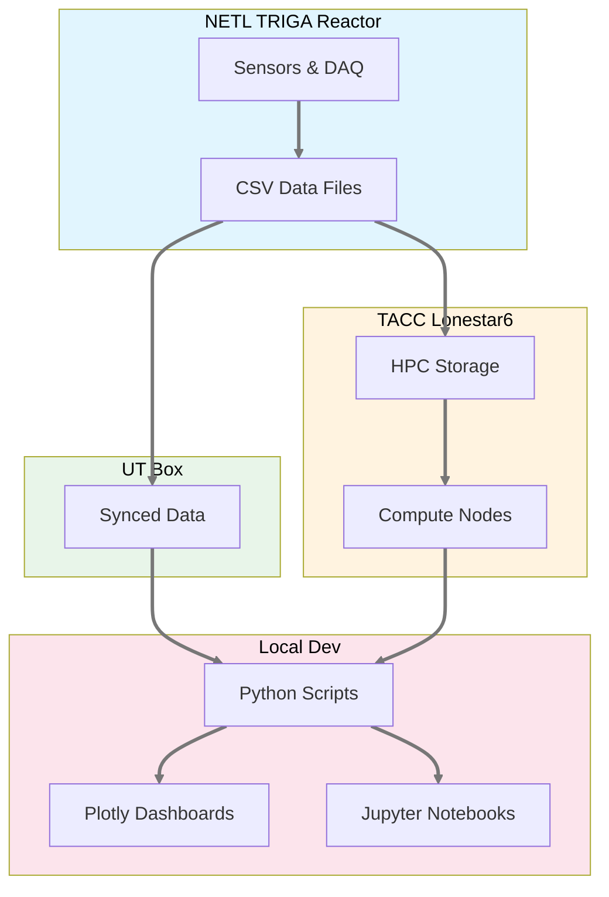
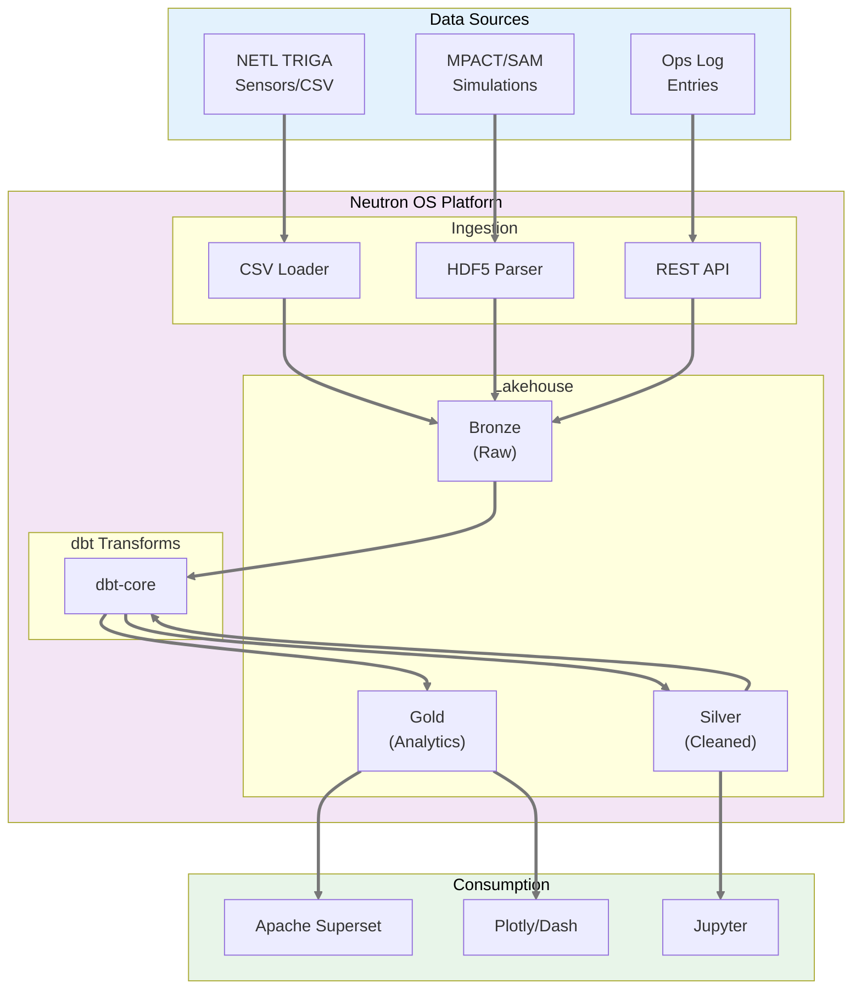
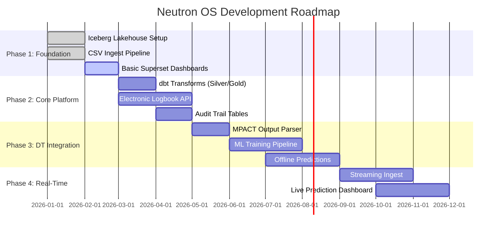
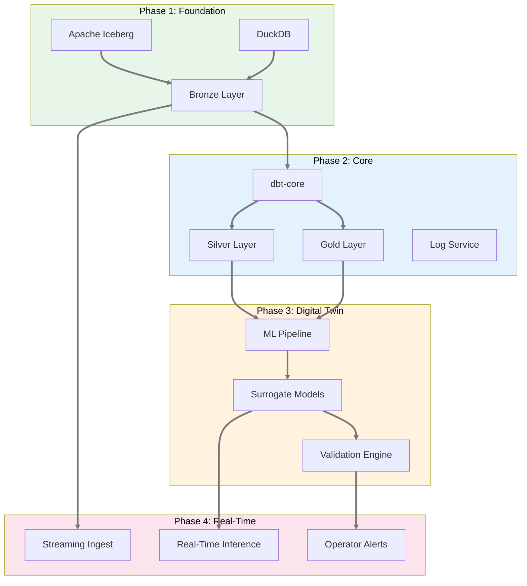
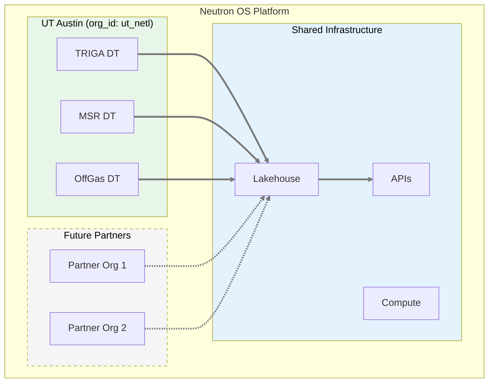

# Neutron OS Diagrams - Mermaid Format

These diagrams render in GitHub, GitLab, and VS Code (with Mermaid extension).

---

## 1. Current System (As-Built)



---

## 2. MVP Target Architecture



---

## 3. Data Flow: Measured vs Modeled

```mermaid
flowchart LR
    subgraph Measured["Measured Data"]
        sensor["Sensor Reading<br/>source='measured'"]
    end
    
    subgraph Modeled["Modeled Data"]  
        sim["DT Prediction<br/>source='modeled'"]
    end
    
    subgraph Silver["Silver Layer"]
        readings["reactor_readings<br/>(unified)"]
    end
    
    subgraph Dashboard["Dashboard"]
        viz["Side-by-side<br/>Comparison"]
    end
    
    sensor --> readings
    sim --> readings
    readings --> viz
    
    style Measured fill:#c8e6c9,color:#000000
    style Modeled fill:#ffecb3,color:#000000
linkStyle default stroke:#777777,stroke-width:3px
```

---

## 4. Development Phases



---

## 5. Component Dependencies



---

## 6. Multi-Tenant Architecture



---

## 7. Prediction Uncertainty Over Time

```mermaid
xychart-beta
    title "Prediction Confidence Between Sensor Readings"
    x-axis [0ms, 25ms, 50ms, 75ms, 100ms]
    y-axis "Confidence %" 0 --> 100
    line "Confidence" [100, 85, 70, 60, 100]
    linkStyle default stroke:#777777,stroke-width:3px
```

---

## Usage Notes

### Rendering
- **GitHub/GitLab**: Renders automatically in markdown preview
- **VS Code**: Install "Markdown Preview Mermaid Support" extension
- **Export to PNG/SVG**: Use mermaid CLI (`mmdc`) or online editor at mermaid.live

### Editing
- Live editor: https://mermaid.live
- Syntax docs: https://mermaid.js.org/syntax/flowchart.html

### Converting to Images for Word
```bash
# Install mermaid CLI
npm install -g @mermaid-js/mermaid-cli

# Convert to PNG
mmdc -i diagram.mmd -o diagram.png -b transparent

# Convert to SVG (better for scaling)
mmdc -i diagram.mmd -o diagram.svg
```
