# DeepLynx + Neutron OS: Integrated Architecture Assessment

**Technical Analysis of Complementary Capabilities**

---

> **Document Status:** Technical Reference  
> **Date:** January 21, 2026 (Updated)  
> **Lead Author:** Ben Booth, UT Computational NE  
> **Classification:** Internal Planning Document

---

## 1. Executive Summary

### The Core Insight

DeepLynx and Neutron OS are **complementary systems optimized for different operational domains**. If integrated via plugin architecture, Neutron OS would provide the extensible platform with well-defined extension points, while DeepLynx would supply optional backend plugins for reactor configuration, component relationships, and safety metadata. Neutron OS would govern *what's happening in real-time and what will happen next* (operational intelligence and autonomous control), while DeepLynx plugins would govern *what things are and how they relate* (engineering backbone). This would not be competition—it would be modular specialization toward a shared goal: autonomous, safe reactor operation.

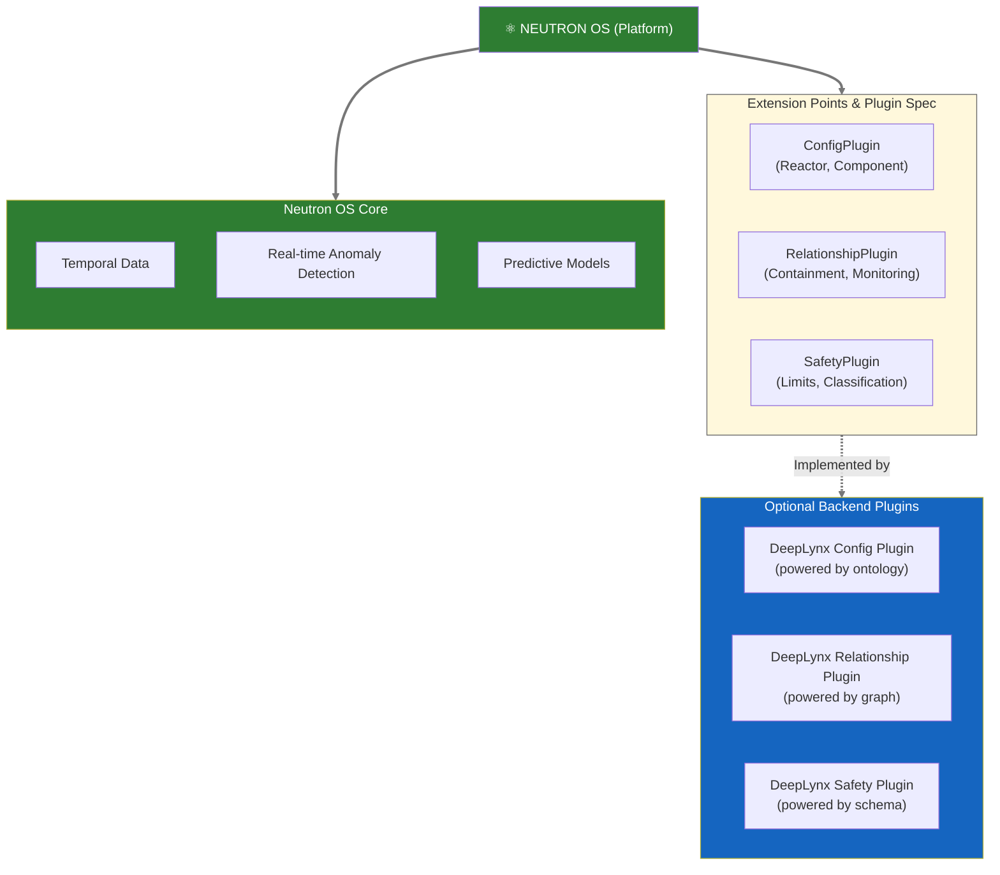

### 1.1 What Each System Does Best

| Capability | DeepLynx | Neutron OS |
|------------|----------|------------|
| **Ontology management** | ✅ Excellent | ❌ Not its job |
| **Relationship graphs** | ✅ Excellent | ❌ Not its job |
| **Configuration tracking** | ✅ Excellent | ⚠️ Basic |
| **Streaming time-series** | ⚠️ Batch-oriented | ✅ Sub-second |
| **Historical analytics** | ⚠️ File-based queries | ✅ Iceberg lakehouse |
| **ML/surrogate training** | ⚠️ Not optimized | ✅ Native workflows |
| **Uncertainty quantification** | ❌ Not its job | ✅ Core capability |
| **Real-time streaming** | ⚠️ Batch-oriented | ✅ Streaming-first (ADR-007) |
| **Semi-autonomous operation** | ❌ Not its job | ✅ Designed for (via ML agents) |
| **Agentic AI integration** | ✅ MCP Server | ✅ MCP Server |

### 1.2 The Integration Opportunity

**Scenario:** An operator asks: "Which safety-related components are showing anomalous trends?"

| Step | System | Action |
|------|--------|--------|
| 1 | **Neutron OS** | Streaming anomaly detection flags 3 sensors |
| 2 | **Neutron OS → DeepLynx** | "What components are these sensors monitoring?" |
| 3 | **DeepLynx** | Returns: Pump A (safety-related), Valve B (not safety), Detector C (safety-related) |
| 4 | **DeepLynx** | "What are the safety limits for Pump A and Detector C?" |
| 5 | **Neutron OS** | Queries time-series: "How close to limits?" |
| 6 | **AI Assistant** | Synthesizes full picture for operator |

**Neither system could answer this alone.** DeepLynx knows structure and safety classification. Neutron OS knows trends and predictions.

### 1.3 Technical Property Comparison

| Property | DeepLynx Nexus (v2) | Neutron OS |
|----------|---------------------|------------|
| **Primary Focus** | Digital engineering backbone | Real-time operational intelligence & autonomous control |
| **Data Model** | Graph (ontology-driven) | Lakehouse (Iceberg tables) + Real-time streams |
| **Tech Stack** | C# + React + PostgreSQL | Python + dbt + Kafka + ML models |
| **Query Language** | GraphQL + DataFusion SQL | SQL (DuckDB/Trino) + ML inference |
| **Time-Series** | File-based, batch queries | Streaming-first (sub-second latency) |
| **AI Integration** | MCP Server (C#) | MCP Server (Python) |
| **License** | MIT | MIT (proposed) |

### 1.4 What We Could Adopt From DeepLynx (If Integration Proceeds)

| Pattern | Implementation | Approach if Adopted |
|---------|---------------|--------|
| **Ledger table pattern** | Denormalized historical snapshots for audit | Would implement |
| **Ontology vocabulary** | DIAMOND class names, properties, relationships | Would align |
| **MCP architecture** | AI agents query both systems via MCP | Would develop |
| **Limits schema** | Safety importance, voting logic, TSR references | Would implement |

### 1.5 Why Two Systems Instead of One?

**The question:** "Why not just use DeepLynx for everything?"

**The answer:** Different data patterns need different architectures.

| Pattern | DeepLynx Optimized | Neutron OS Optimized |
|---------|-------------------|---------------------|
| "What components exist in Reactor X?" | ✅ Graph traversal | ❌ Would need to JOIN many tables |
| "Show power readings for last 6 months" | ❌ File scan, batch job | ✅ Partition pruning, milliseconds |
| "Train ML model on sensor history" | ❌ Export to files first | ✅ Native DataFrame access |
| "What's the safety classification?" | ✅ Single GraphQL query | ❌ Would need DeepLynx anyway |
| "Predict state at t+10ms" | ❌ Not its job | ✅ Surrogate model inference |

**Trying to make one system do both leads to architectural compromise.** The integrated approach lets each system excel at what it's designed for.

### 1.6 Path to Semi-Autonomous Operation

Neutron OS is not "just an analytics platform." It's designed as a **real-time digital twin engine** that will eventually enable **semi-autonomous reactor operation**.

**Current State (2025-2026):** Operator-centric with AI assistants
- Humans observe dashboards powered by Neutron OS
- AI agents query both systems to contextualize anomalies
- Operators make all decisions and control actions

**Near-Term (2026-2027):** Operator-in-loop autonomy
- Digital twin would reach steady state via continuous ML retraining
- AI agents would recommend control actions (e.g., "pump flow should decrease 5%")
- Operators would approve/reject recommendations in real-time
- Neutron OS's streaming-first architecture would provide sub-second feedback loops

**Future (2027+):** Semi-autonomous operation
- ML models would achieve required accuracy and uncertainty bounds
- Autonomous agents would make low-risk decisions without operator approval
- Humans would retain override capability and continuous oversight
- Critical decisions (e.g., scram) would remain human-controlled via DeepLynx safety classifications
- Fleet-wide coordination would occur via anomaly correlation across multiple units

**Why This Requires Streaming-First Architecture (ADR-007):**
- Batch-oriented systems cannot support real-time feedback loops for autonomous agents
- Safety margins require <1 second response times to state changes
- Commercial reactor fleet management requires coordinated decisions across dozens of units
- Predictive maintenance requires live sensor streams to detect degradation signatures

---

## 2. DeepLynx Technical Deep Dive

### 2.1 Architecture Overview

```mermaid
flowchart LR
    EXT["🔗 External Systems<br/>(P6, Revit, APIs)"]
    
    SRC["📥 Data Sources<br/>(HTTP, Files)"]
    
    ETL["🔄 ETL & Mapping<br/>→ Ontology Classes"]
    
    STORAGE["🗄️ PostgreSQL<br/>records | edges | ledger"]
    
    API["🔍 Query APIs<br/>GraphQL | REST | Events"]
    
    APP["✨ Applications<br/>React UI | MCP Server"]
    
    EXT --> SRC --> ETL --> STORAGE --> API --> APP

    style EXT fill:#7b1fa2,color:#fff,font-size:10px
    style SRC fill:#1565c0,color:#fff,font-size:10px
    style ETL fill:#e65100,color:#fff,font-size:10px
    style STORAGE fill:#424242,color:#fff,font-size:10px
    style API fill:#2e7d32,color:#fff,font-size:10px
    style APP fill:#c62828,color:#fff,font-size:10px
    linkStyle default stroke:#777777,stroke-width:3px
```

### 2.2 Core Technical Components

| Component | Technology | Purpose |
|-----------|------------|---------|
| **Backend** | C# (.NET 10) | API server, business logic |
| **Frontend** | React + TypeScript | Admin UI, data exploration |
| **Database** | PostgreSQL | Graph storage (records/edges) |
| **ORM** | Entity Framework | Database migrations, CRUD |
| **API** | REST + GraphQL | Data access |
| **Docs** | Next.js (MDX) | Documentation site |
| **Auth** | OAuth2 + API Keys | Multi-tenant access |
| **Deploy** | Kubernetes + Docker | Container orchestration |
| **AI** | MCP Server (C#) | LLM tool integration |

### 2.3 Data Model Philosophy

DeepLynx would use an **ontology-driven graph model**: schema layer defines structure, instance layer contains actual data.

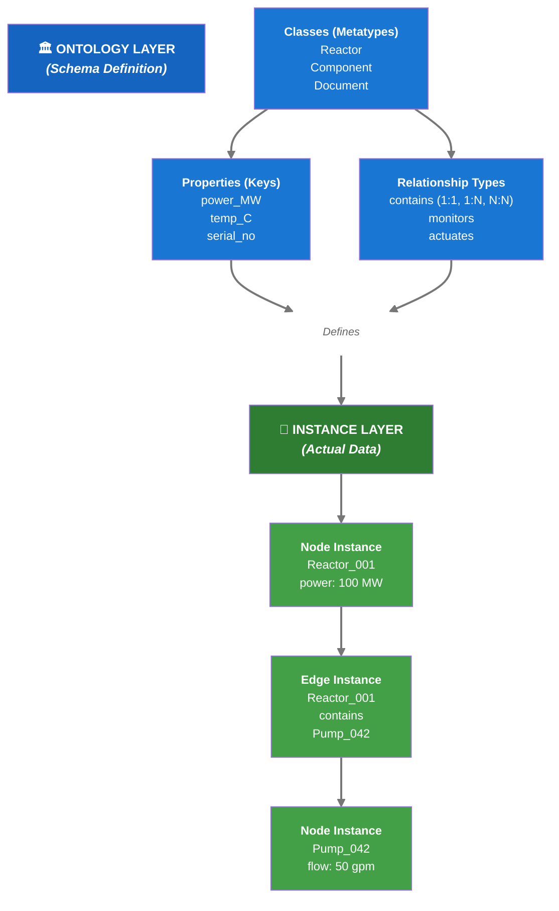

**Two-Layer Model:**
- **Ontology Layer** (top): Defines what kinds of things exist and how they relate (reusable schema)
- **Instance Layer** (bottom): Contains actual reactor data and relationships (concrete examples)

### 2.4 Key Features

| Feature | Description | Maturity |
|---------|-------------|----------|
| **Ontology Import** | Import .owl files (DIAMOND ontology) | Mature |
| **Ontology Versioning** | Track schema changes over time | Mature |
| **Ontology Inheritance** | Classes can inherit properties | Mature |
| **Type Mapping** | Map JSON→Classes automatically | Mature |
| **GraphQL Queries** | Client-defined queries | Mature |
| **Event System** | Pub/sub for data changes | Mature |
| **Data Targets** | Export to external systems | Mature |
| **Timeseries Data** | Tabular data alongside graph | Mature |
| **Ledger Tables** | ADR-001: Historical snapshots | New (v2) |
| **MCP Server** | AI tool integration | New (v2) |

### 2.5 Ledger Table Pattern (ADR-001)

This is **highly relevant** to Neutron OS's audit requirements:

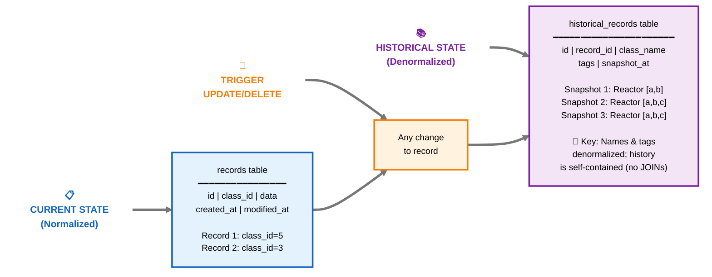

**Why This Matters:**
- If a class is renamed/deleted, historical records remain accurate (names are denormalized)
- No JOINs needed to query history (fully self-contained snapshots)
- Audit trail is independent of current schema evolution

### 2.6 MCP (Model Context Protocol) Integration

DeepLynx has an early MCP server implementation:

```
deeplynx.mcp/
├── tools/
│   ├── ProjectTools.cs    # List/search projects
│   └── RecordTools.cs     # Query/create records
├── helpers/
│   └── ...
├── Program.cs             # MCP server entry point
└── .env_sample
```

This would allow AI agents to:
- Query project data
- Search records
- Create/update data programmatically

---

## 3. Architecture Comparison

### 3.1 Side-by-Side Comparison

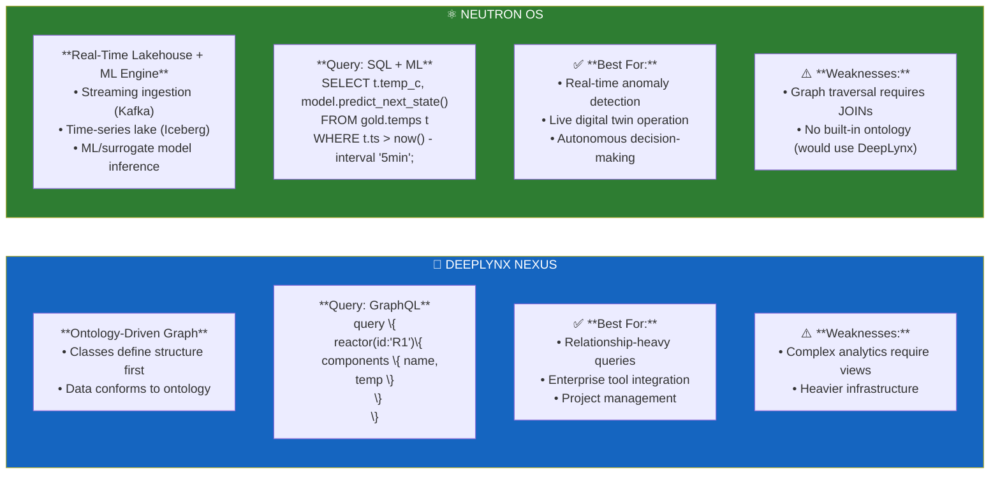

### 3.2 Feature Matrix

| Feature | DeepLynx | Neutron OS | Notes |
|---------|----------|-----------|-------|
| **Data Storage** |
| Time-travel queries | ⚠️ Via ledger | ✅ Native Iceberg | Iceberg is purpose-built |
| Schema versioning | ✅ Ontology versions | ✅ Schema evolution | Both good |
| ACID transactions | ✅ PostgreSQL | ✅ Iceberg | Both good |
| Columnar storage | ❌ Row-based | ✅ Parquet | Neutron faster for analytics |
| **Query Capabilities** |
| SQL analytics | ⚠️ Requires views | ✅ Native | Neutron wins |
| Graph traversal | ✅ Native | ⚠️ Via JOINs | DeepLynx wins |
| GraphQL | ✅ Built-in | ❌ Not planned | Different philosophy |
| **Integrations** |
| Enterprise tools | ✅ Many | ❌ Not focus | DeepLynx wins |
| ML/AI workflows | ⚠️ Basic MCP | ✅ Designed for | Neutron wins |
| BI dashboards | ⚠️ Custom needed | ✅ Superset native | Neutron wins |
| **Operations** |
| Local development | ✅ Docker Compose | ✅ K3D + Docker | Both good |
| Kubernetes ready | ✅ Helm charts | ✅ Terraform + Helm | Both good |
| Multi-tenant | ✅ Containers | ⚠️ Planned | DeepLynx ahead |
| **Audit/Compliance** |
| Immutable audit log | ✅ Ledger tables | ✅ Hyperledger | Different approaches |
| Change tracking | ✅ Per-record | ✅ Per-table | DeepLynx more granular |
| Regulatory compliance | ✅ Designed for | ⚠️ In progress | DeepLynx more mature |

---

## 4. What's Valuable for Neutron OS

### 4.1 Highly Valuable: Ledger Table Pattern

**If integrated with DeepLynx, we would adopt this pattern** for log entries, reactor data, and simulation outputs.

```python
# Proposed implementation for Neutron OS
# dbt model: models/audit/log_entries_historical.sql

{{
  config(
    materialized='incremental',
    unique_key='snapshot_id'
  )
}}

WITH snapshots AS (
  SELECT
    {{ dbt_utils.generate_surrogate_key(['log_id', 'snapshot_ts']) }} AS snapshot_id,
    log_id,
    -- Denormalized fields (self-contained history)
    author_name,        -- Not author_id (avoids JOIN)
    facility_name,      -- Not facility_id
    tag_names,          -- Array of strings, not IDs
    -- Full content at snapshot time
    entry_content,
    attachments,
    -- Metadata
    snapshot_ts,
    change_type         -- 'created', 'updated', 'archived'
  FROM {{ ref('log_entries_bronze') }}
)

SELECT * FROM snapshots

WHERE snapshot_ts > (SELECT MAX(snapshot_ts) FROM {{ this }})

```

### 4.2 Valuable: Ontology Concepts

Consider adopting **lightweight ontology support** without the full graph overhead:

```yaml
# neutron_os/schemas/ontology/reactor.yaml
classes:
  Reactor:
    description: "Nuclear reactor system"
    properties:
      - name: thermal_power_mw
        type: float
        unit: MW
        required: true
      - name: coolant_type
        type: enum
        values: [water, sodium, helium, salt]
    relationships:
      - type: contains
        target: ReactorComponent
        cardinality: one_to_many

  ReactorComponent:
    description: "Component within a reactor"
    parent: PhysicalAsset  # Inheritance
    properties:
      - name: serial_number
        type: string
        required: true
      - name: install_date
        type: date
```

This YAML-based ontology can:
1. Generate Pydantic validators
2. Generate dbt schema tests
3. Provide LLM context for semantic queries
4. Document the domain model

### 4.3 Valuable: MCP Server Pattern

DeepLynx's MCP implementation shows the path for Neutron OS:

```python
# Proposed: neutron_os/mcp/tools/reactor_tools.py
from mcp.server import Server
from mcp.types import Tool, TextContent

server = Server("neutron-os")

@server.tool()
async def query_reactor_timeseries(
    reactor_id: str,
    metric: str,
    start_time: str,
    end_time: str
) -> list[TextContent]:
    """Query reactor time-series data via DuckDB"""
    sql = f"""
    SELECT timestamp, {metric}
    FROM gold.reactor_metrics
    WHERE reactor_id = '{reactor_id}'
      AND timestamp BETWEEN '{start_time}' AND '{end_time}'
    """
    result = duckdb_conn.execute(sql).fetchdf()
    return [TextContent(type="text", text=result.to_markdown())]

@server.tool()
async def search_log_entries(
    query: str,
    facility: str | None = None,
    entry_type: str | None = None,  # 'ops' or 'dt'
    limit: int = 10
) -> list[TextContent]:
    """Semantic search over log entries using pgvector"""
    # ... vector search implementation
```

### 4.4 Moderately Valuable: Event System

DeepLynx's event system for real-time data propagation could inform Dagster sensors:

```python
# Instead of WebSockets (DeepLynx), use Dagster sensors
@sensor(job=process_new_reactor_data)
def reactor_data_sensor(context):
    """Trigger pipeline when new data arrives"""
    new_files = list_new_iceberg_files(
        table="bronze.reactor_timeseries",
        since=context.last_tick_time
    )
    if new_files:
        yield RunRequest(run_key=new_files[0].snapshot_id)
```

---

## 5. Query Interface Integration

### 5.1 GraphQL + SQL: Best of Both Worlds

**DeepLynx's GraphQL Strength:** According to their documentation, DeepLynx "**dynamically generates a schema** each time you interact with the GraphQL endpoint for a given container... the generated schema's types map 1:1 to a Class in the container you are querying." This auto-reflection from ontology to API is genuinely elegant—when you add a new Class (e.g., "Detector"), a corresponding GraphQL type becomes immediately available without code changes.

**Neutron OS's SQL Strength:** Time-series analytics and ML workflows are SQL-native. LLMs are highly capable at generating SQL from natural language.

**Integration Strategy:** Use both query interfaces with intelligent routing

```mermaid
graph TB
    USER1["👤 User (2015-2020)<br/>I want reactor data with components"]
    DEV["🛠️ Developer<br/>Writes GraphQL query"]
    GQL["GraphQL Query<br/>query &#123;<br/>  reactor(id: R1) &#123;<br/>    thermalPower<br/>    components &#123; name, serialNumber &#125;<br/>  &#125;<br/>&#125;"]
    
    USER2["👤 User (2024+)<br/>Show me reactor R1's power and all its components"]
    LLM["🤖 LLM<br/>Generates SQL directly"]
    SQL["SQL Query<br/>SELECT r.thermal_power, c.name, c.serial_number<br/>FROM gold.reactors r<br/>JOIN gold.components c ON r.id = c.reactor_id<br/>WHERE r.id = 'R1';"]
    
    ADVANTAGE["✅ Natural Language Era<br/>No schema memorization required"]
    
    USER1 --> DEV --> GQL
    USER2 --> LLM --> SQL
    SQL --> ADVANTAGE
    
    style USER1 fill:#e3f2fd,color:#000000
    style USER2 fill:#e3f2fd,color:#000000
    style DEV fill:#fff3e0,color:#000000
    style LLM fill:#f3e5f5,color:#000000
    style GQL fill:#e0f2f1,color:#000000
    style SQL fill:#e0f2f1,color:#000000
    style ADVANTAGE fill:#c8e6c9,color:#000000
    linkStyle default stroke:#777777,stroke-width:3px
```

### 5.2 Schema Management Approaches

**DeepLynx Approach:** Manual JSON→Ontology mapping rules provide explicit control over data modeling.

**Neutron OS Approach:** LLM-assisted schema inference for rapid iteration

```python
# Old way (DeepLynx type mapping)
# Manually configure: JSON field "T_inlet" → Class "Sensor" → Property "temperature"

# New way (LLM-assisted)
async def infer_schema(sample_data: dict) -> OntologyMapping:
    """Use Claude to infer schema from sample data"""
    prompt = f"""
    Analyze this reactor data sample and suggest ontology mappings:
    {json.dumps(sample_data, indent=2)}
    
    Map to our domain classes: Reactor, Sensor, Component, Measurement
    """
    response = await claude.complete(prompt)
    return OntologyMapping.parse(response)
```

### 5.3 Different Integration Ecosystems

**DeepLynx's Ecosystem:** Enterprise engineering tools (P6, Revit, DOORS, AssetSuite)—critical for large construction projects like MARVEL and NRIC.

**Neutron OS's Ecosystem:** Scientific computing tools (Python/Jupyter, Git, HPC workflows)—critical for research and ML development.

**Integration Opportunity:** Projects may need both ecosystems. The integrated architecture would allow data to flow between them.

### 5.4 Complementary Data Models

**Graph-First (DeepLynx):** Optimized for structural queries—"What components does Reactor X contain? What safety limits apply to Detector Y?"

**SQL-First (Neutron OS):** Optimized for analytical queries—"What was the average power last month? Train a model on this sensor history."

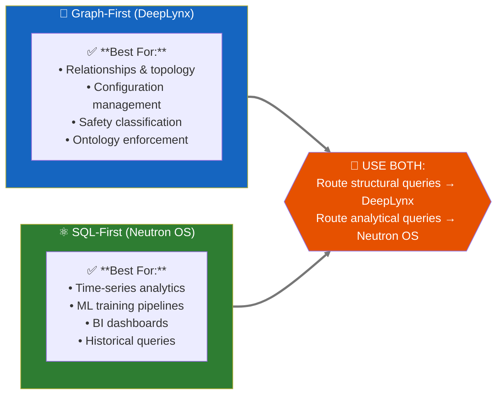

### 5.5 Technology Stack Alignment

**DeepLynx Stack:** C#/.NET + React—aligned with enterprise engineering teams and INL's broader infrastructure.

**Neutron OS Stack:** Python-first (dbt, Dagster, FastAPI)—aligned with research teams and ML workflows.

**No need to unify stacks.** MCP servers provide a common interface for AI agents to access both systems regardless of underlying technology.

---

## 6. Integrated Architecture Vision

### 6.1 The Complete Picture

DeepLynx and Neutron OS together provide a complete digital twin infrastructure:

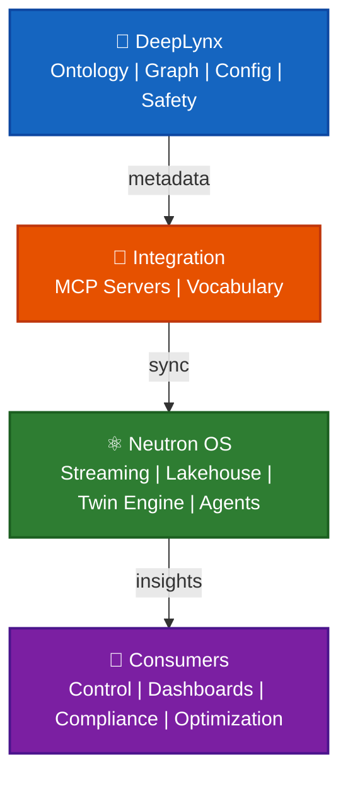

**Streaming-First Architecture (ADR-007):** Real-time would be the default; batch processing would exist as fallback. This would enable sub-second data propagation across all layers—critical for autonomous operation.

| **Layer** | **Component** | **Function** |
|-----------|---------------|------------|
| **DEEPLYNX** | Ontology Registry | Component class definitions, properties, metadata |
| | Relationship Graph | Plant topology, component connections, hierarchy |
| | Config Mgmt | Design changes, version control, evolution tracking |
| | Safety Classifications | TSR mapping, safety importance, regulatory requirements |
| **INTEGRATION** | MCP Servers | API endpoints for agents to query both systems |
| | Shared Vocabulary | Common ontology, naming conventions, ID mapping |
| **NEUTRON OS** | Streaming Ingest | Real-time sensor data from facility DCS (Kafka) |
| | Time-Series Lake | Multi-year historical data, Iceberg + real-time delta lake |
| | Digital Twin Engine | Surrogate models, live predictions, autonomous recommendations |
| | Autonomous Agents | ML-driven decision-making for control actions |
| **CONSUMERS** | Autonomous Control | Semi-autonomous reactor operation, coordinated load-following |
| | Real-Time Dashboards | Live status, trend analysis, operator-in-loop oversight |
| | Compliance Tracking | Continuous regulatory audit trail (immutable ledger) |
| | Fleet Optimization | Cross-unit anomaly correlation, predictive maintenance |
| | Regulatory Reports | NRC packages, audit trails, inspection prep |
| | Fleet Analytics | Cross-facility insights, peer comparison |

### 6.2 Plugin Architecture Approach (If Adopted)

Neutron OS would provide the extensible platform with well-defined extension points. DeepLynx would implement optional backend plugins without requiring tight coupling.

#### 6.2.1 Plugin Extension Points

| Extension Point | Purpose | DeepLynx Plugin Could Provide |
|----------|---------|----------|
| **ConfigurationSource** | Retrieve reactor/component metadata | Ontology Registry + GraphQL queries |
| **RelationshipSource** | Query component relationships & hierarchy | Graph traversal (contains, monitors, etc.) |
| **SafetyMetadataProvider** | Fetch limits, classifications, TSRs | Ontology schema + safety properties |
| **ComponentResolver** | Map sensor IDs → component metadata | ID registry + ontology lookup |
| **AuditablePropertyStore** | Denormalized audit trail for changes | Ledger table pattern from DeepLynx |

#### 6.2.2 Plugin Interface Example (Neutron OS Specification)

```python
# neutron_os/plugins/interfaces.py
from abc import ABC, abstractmethod
from typing import Any

class ConfigurationPlugin(ABC):
    """Provides reactor and component configuration data"""
    
    @abstractmethod
    async def get_component(self, component_id: str) -> ComponentMetadata:
        """Fetch component details: name, type, safety classification"""
        pass
    
    @abstractmethod
    async def list_components(self, filter: dict) -> list[ComponentMetadata]:
        """List components matching filter criteria"""
        pass

class RelationshipPlugin(ABC):
    """Provides graph structure and relationships"""
    
    @abstractmethod
    async def get_relationships(self, source_id: str, rel_type: str) -> list[Relationship]:
        """Get relationships of type from source component"""
        pass
    
    @abstractmethod
    async def get_containment_tree(self, root_id: str) -> dict:
        """Get full hierarchy starting from root"""
        pass

class SafetyPlugin(ABC):
    """Provides safety metadata and constraints"""
    
    @abstractmethod
    async def get_safety_limits(self, component_id: str) -> SafetyLimits:
        """Fetch limits for anomaly detection"""
        pass
    
    @abstractmethod
    async def get_safety_classification(self, component_id: str) -> str:
        """Return: 'safety-related', 'non-safety', 'critical'"""
        pass
```

#### 6.2.3 DeepLynx Plugin Implementation

| Component | Implementation | Notes |
|-----------|---|---|
| **Config Plugin** | Ontology classes via GraphQL → ComponentMetadata DTO | Schemas: `Reactor`, `Component`, `Sensor` |
| **Relationship Plugin** | Graph queries via DataFusion → Relationship list | Edges: `contains`, `monitors`, `actuates` |
| **Safety Plugin** | Ontology properties → SafetyLimits/Classification | Properties: `safety_importance`, `upper_limit`, `lower_limit` |
| **Plugin Registry** | Neutron OS plugin manager discovers & loads plugins | Would use Python entry points or dependency injection |

#### 6.2.4 Benefits of Plugin Architecture

- **On-demand queries:** Plugins respond to requests rather than streaming
- **No data duplication:** DeepLynx remains source of truth for structure
- **Loose coupling:** Neutron OS doesn't depend on DeepLynx internals
- **Optional adoption:** Can deploy without DeepLynx, or swap implementations
- **Clear contracts:** Neutron OS defines interfaces, DeepLynx implements them
- **Testable:** Each plugin can be mocked for testing

### 6.3 Plugin Usage Patterns

**Pattern 1: Component Resolution via Plugin**

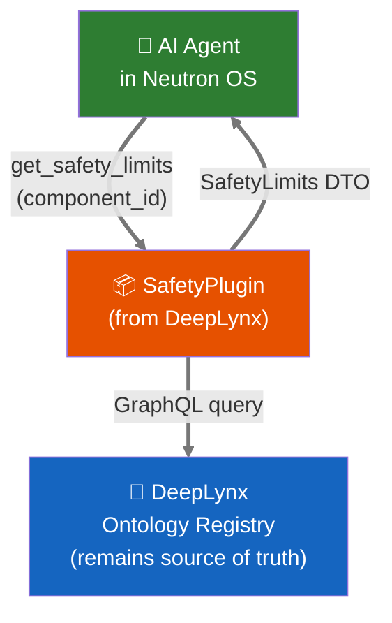

**Plugin advantages:**
- On-demand queries ensure fresh data without duplication
- DeepLynx remains single source of truth for structure
- Plugin can be swapped or mocked for testing
- Operator portal fetches via plugin: "Who is responsible for this component?" → Reactor Responsibility matrix from DeepLynx

**Pattern 2: Reactor Configuration UI Powered by Plugin**

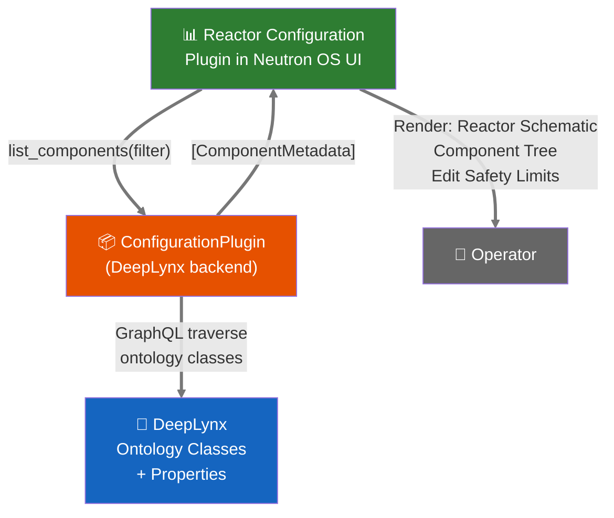

**Pattern 3: Unified AI Agent Access via Plugins**

```mermaid
sequenceDiagram
    participant U as User
    participant AI as AI Agent
    participant NO as Neutron OS
    participant DL as DeepLynx

    U->>AI: "Show safety anomalies"
    activate AI
    AI->>NO: Get anomalies (1h)
    activate NO
    NO-->>AI: [NI_CHAN_1, PUMP_A]
    deactivate NO
    AI->>DL: Get safety class
    activate DL
    DL-->>AI: {NI_CHAN_1: Safety Limit,<br/>PUMP_A: LCO}
    deactivate DL
    AI-->>U: 2 safety components<br/>have anomalies
    deactivate AI
    linkStyle default stroke:#777777,stroke-width:3px
```

### 6.4 DeepLynx Backend Plugin Capabilities (If Integration Proceeds)

When DeepLynx plugins are deployed in Neutron OS, the following capabilities would become available:

| Capability | Powered By | How Accessed |
|---------|------------------------------|--------|
| **Reactor schematic browsing** | DeepLynx ontology (Reactor, Component classes) | ConfigurationPlugin |
| **Component hierarchy navigation** | DeepLynx relationship graph (contains, actuates) | RelationshipPlugin |
| **Safety limits & classifications** | DeepLynx ontology properties (safety_importance, limits) | SafetyPlugin |
| **Component responsibility mapping** | DeepLynx ownership metadata + organizational schema | ConfigurationPlugin extension |
| **Change auditing for configs** | DeepLynx ledger table pattern | Audit event hooks |
| **Cross-facility component comparison** | DeepLynx graph queries across projects | RelationshipPlugin + MCP |

**These capabilities enhance Neutron OS without requiring architectural changes to either system.** The plugin approach allows for independent evolution and optional deployment.

---

## 7. Proposed Plugin Development Roadmap (If DeepLynx Integration is Adopted)

Neutron OS provides the extensible platform. DeepLynx implements optional backend plugins. Integration is modular and non-blocking.

### 7.1 Phase 1: Plugin Interface Specification (Q2 2026)

**Objective:** Define plugin contracts that Neutron OS expects from DeepLynx.

| Deliverable | Owner | Approach |
|-------------|-------|----------|
| **ConfigurationPlugin** interface | UT | Would specify: `get_component()`, `list_components()`, filtering |
| **RelationshipPlugin** interface | UT | Would specify: `get_relationships()`, `get_containment_tree()` |
| **SafetyPlugin** interface | UT | Would specify: `get_safety_limits()`, `get_safety_classification()` |
| **Plugin registry & lifecycle** | UT | Would define: discovery, loading, error handling, versioning |
| **Data transfer objects (DTOs)** | UT | Would define: ComponentMetadata, SafetyLimits, Relationship schemas |

### 7.2 Phase 2: DeepLynx Plugin Implementation (Q3-Q4 2026)

**Objective:** Implement the three core plugins as DeepLynx backend modules.

| Deliverable | Owner | Approach |
|-------------|-------|----------|
| **Configuration Plugin (C#)** | INL | Would query ontology classes via GraphQL, map to ComponentMetadata |
| **Relationship Plugin (C#)** | INL | Would traverse graph edges via DataFusion, return Relationship list |
| **Safety Plugin (C#)** | INL | Would fetch ontology properties, extract limits and classifications |
| **Plugin adapter/wrapper** | INL | Would handle authentication, error recovery, caching strategy |
| **Unit test suite** | INL | Would cover: valid queries, missing data, network failures |

### 7.3 Phase 3: Integration Testing & UI Deployment (2027 Q1-Q2)

**Objective:** Deploy plugins into production and verify Neutron OS UI works with DeepLynx backends.

| Deliverable | Owner | Approach |
|-------------|-------|----------|
| **Deployment guide** | Joint | Would document: plugin registration, configuration, database setup |
| **Reactor Configuration UI** | UT | Would build: component browser, limit editor powered by SafetyPlugin |
| **AI agent integration test** | UT | Would verify: agents can query components, relationships, limits via plugins |
| **Performance benchmarks** | UT | Would measure: plugin query latency, UI responsiveness |
| **Documentation & runbook** | Joint | Would create: plugin API reference, troubleshooting guide |

### 7.4 Phase 4: Extended Plugins & Ecosystem (2028+)

**Objective:** Expand plugin ecosystem beyond DeepLynx.

| Deliverable | Owner | Approach |
|-------------|-------|----------|
| **Alternative Configuration Plugin** | Future | Could implement: SQL-based metadata source, vendor tool integrations |
| **Custom Safety Plugin** | Customer | Could implement: site-specific safety rules, custom limit logic |
| **Audit/Compliance Plugin** | Future | Could implement: regulatory requirement tracking, change auditing |
| **Analytics Plugin** | Future | Could implement: fleet-wide trending, cross-facility insights |

### 7.5 Plugin Architecture Principles

| Principle | Rationale |
|-----------|----------|
| **Neutron OS owns extension points** | Platform defines what plugins can do via interfaces |
| **DeepLynx provides optional implementations** | Not required; can be swapped with other backends |
| **Plugins are on-demand, not streaming** | DeepLynx remains authoritative source |
| **Clear separation of concerns** | Neutron OS doesn't depend on DeepLynx internals |
| **Testability first** | Each plugin interface can be mocked for unit tests |
| **No data duplication** | Plugins query upstream sources; Neutron OS never copies structure |

---

## 8. Appendix: Technical Details

### 8.1 DeepLynx Repository Structure

```
idaholab/DeepLynx/
├── deeplynx.api/           # C# REST API
├── deeplynx.UI/            # React frontend
├── deeplynx.business/      # Business logic
├── deeplynx.datalayer/     # Entity Framework + PostgreSQL
├── deeplynx.models/        # Domain models
├── deeplynx.interfaces/    # Abstractions
├── deeplynx.helpers/       # Utilities
├── deeplynx.tests/         # Test suite
├── deeplynx.mcp/           # MCP server (AI tools) ← INTERESTING
├── deeplynx.docs/          # Next.js documentation
├── documentation/adr/      # Architecture decisions
├── kubernetes/             # K8s manifests
└── Dockerfiles/            # Container builds
```

### 8.2 Key Technical Specifications

| Spec | Value |
|------|-------|
| Runtime | .NET 10 |
| Database | PostgreSQL 14+ |
| Container | Docker + Kubernetes |
| Auth | OAuth2 + API Keys |
| API | REST + GraphQL |
| Frontend | React + TypeScript |
| Docs | Next.js + MDX |
| MCP SDK | C# (custom impl) |

### 8.3 Useful Links

| Resource | URL |
|----------|-----|
| GitHub Repo | https://github.com/idaholab/DeepLynx |
| Product Page | https://inlsoftware.inl.gov/product/deep-lynx |
| Documentation | https://deeplynx.inl.gov/docs |
| Wiki (v1, deprecated) | https://github.com/idaholab/DeepLynx/wiki |
| DIAMOND Ontology | https://github.com/idaholab/DIAMOND |
| Contact | GRP-deeplynx-team@inl.gov |

---

## Document History

| Version | Date | Author | Changes |
|---------|------|--------|---------|
| 0.1 | 2026-01-15 | UT Team | Initial assessment |
| 0.2 | 2026-01-15 | UT Team | **Major revision**: Added timeseries capabilities, INL TRIGA context |
| 0.3 | 2026-01-28 | Ben Booth | **Architectural refactor**: Shifted from tight coupling to plugin architecture |

---

## 9 Collaboration Scenarios

### 9.1 Scenario: Active INL Partnership

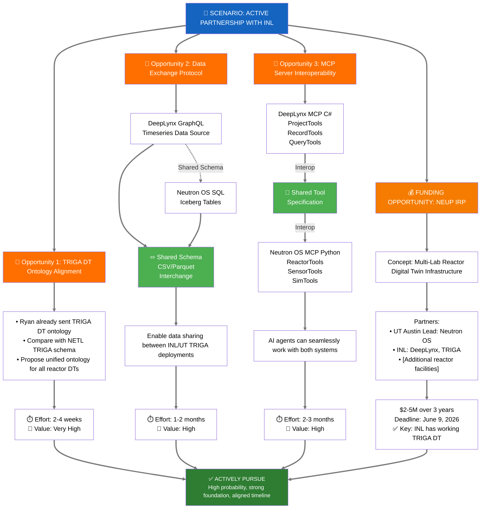

### 9.2 NRAD Ontology Analysis (January 15, 2026 - Evening)

**Source:** `nrad_dt_generic_ontology_v4.txt` shared by Ryan via Nick

#### 9.2.1 Core Classes (10)

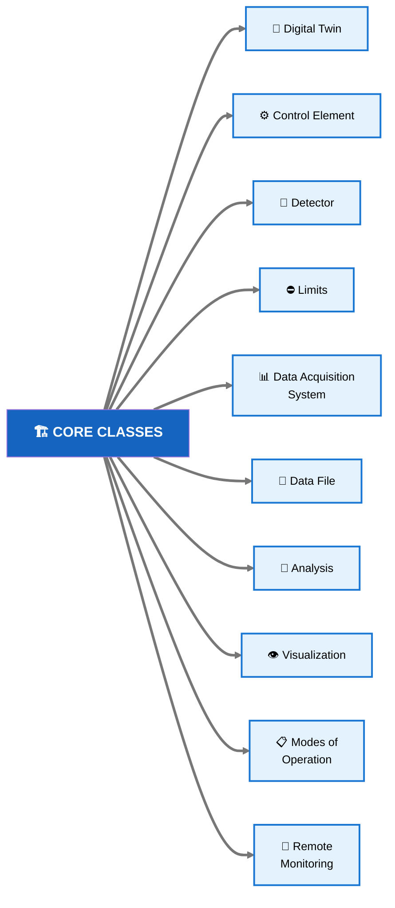

#### 9.2.2 Core Relationships (4)

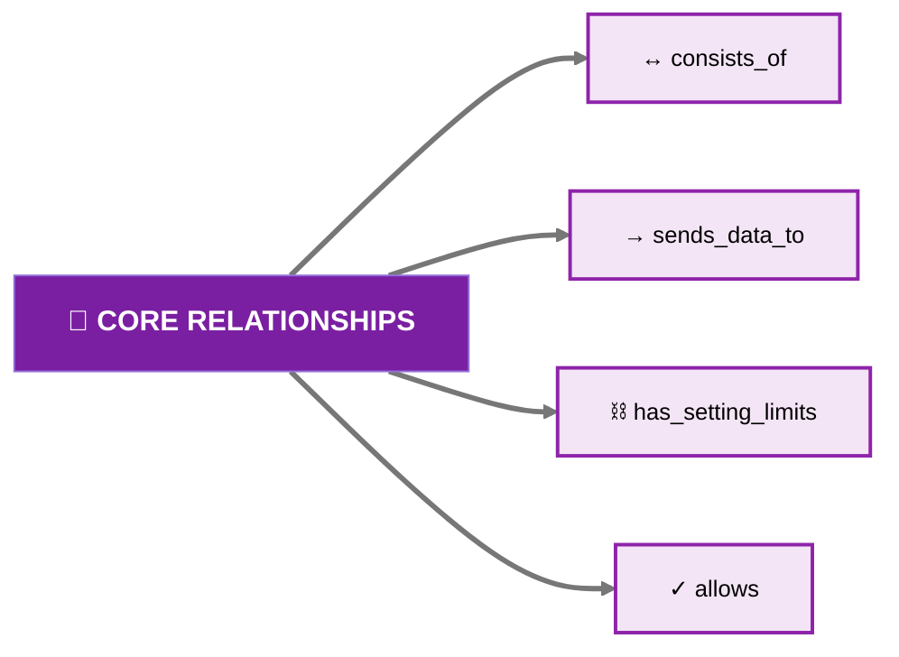

#### 9.2.3 Data Flow Pipeline

```mermaid
graph LR
    TITLE["⚙️ DATA FLOW PIPELINE"]
    DET["🔴 Detectors<br/>(25+ nodes)"]
    DAQ["📊 TINA DAQ<br/>System"]
    FILE["📁 Data File<br/>(CSV)"]
    ANALYSIS["🤖 Analysis<br/>(ML/SM)"]
    UI["👤 User<br/>Interface"]
    
    TITLE --> DET
    DET -->|sends_data_to| DAQ
    DAQ -->|sends_data_to| FILE
    FILE -->|sends_data_to| ANALYSIS
    ANALYSIS -->|visualizes_in| UI
    
    style TITLE fill:#2e7d32,color:#fff,font-size:16px,font-weight:bold
    style DET fill:#ffcdd2,stroke:#c62828,stroke-width:2px,color:#000000,font-size:13px
    style DAQ fill:#fff9c4,stroke:#f57f17,stroke-width:2px,color:#000000,font-size:13px
    style FILE fill:#f0f4c3,stroke:#9ccc65,stroke-width:2px,color:#333,font-size:13px
    style ANALYSIS fill:#c8e6c9,stroke:#388e3c,stroke-width:2px,color:#000000,font-size:13px
    style UI fill:#b3e5fc,stroke:#0288d1,stroke-width:2px,color:#000000,font-size:13px
    linkStyle default stroke:#777777,stroke-width:3px
```

#### 9.2.4 What's Excellent About This Ontology

| Feature | Implementation | Why It Matters |
|---------|---------------|----------------|
| **Limits as first-class** | Separate `Limits` class with structured arrays | LCO/TSR compliance built-in |
| **Safety importance** | `"safety importance": "LCO"/"Safety limit"/"Scram function"` | Regulatory traceability |
| **ML integration** | `Analysis` nodes for LSTM, Gaussian process | Model-aware digital twin |
| **Explicit data flow** | `sends_data_to` relationship chain | Clear data lineage |
| **Reference citations** | `"reference": "SAR-406 pg 3-16"` | Audit trail to safety docs |

### 9.2.5 Sensors in NRAD vs NETL TRIGA

| Category | NRAD Sensors | NETL TRIGA Equivalent |
|----------|--------------|----------------------|
| **Control** | Shim Rod 1, 2 + Regulating Rod | Safety, Shim, Reg rods |
| **Power** | Multi-Range Linear Ch 1-3, Wide-Range Log | NI channels (similar) |
| **Fuel Temp** | Fuel Temperature Detector | IFE thermocouples |
| **Cooling** | HX inlet/outlet, Primary/Secondary flow | Pool temp, flow sensors |
| **Tank** | Water level, Tank temp | Pool level, temp |
| **Radiation** | Room RAM, CAM, gaseous monitors | ARM, CAM |

**Key Finding:** ~80% sensor overlap between NRAD and NETL TRIGA. Ontology is highly transferable.

### 9.2.6 What's Missing (Opportunities for Neutron OS)

| Gap in NRAD Ontology | Neutron OS Could Add |
|---------------------|---------------------|
| No time-series aggregation classes | Trend analysis, anomaly detection |
| No historical state | Iceberg time-travel queries |
| No experiment/sample tracking | `sample_tracking` schema (per Nick's feedback) |
| No log integration | Unified Log System |
| `tag name` fields empty | Tag mapping infrastructure |
| No dashboard/BI concept | Superset integration |

### 9.2.7 Revised Architecture: Complementary Systems

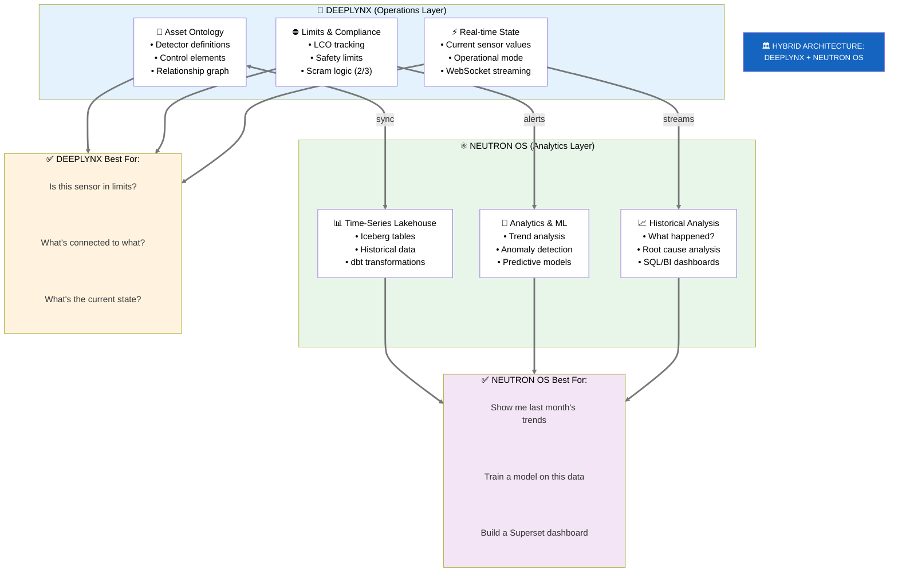

### 9.3 Summary: The Plugin Architecture Vision

**Core Insight:** DeepLynx and Neutron OS are **complementary, not competing**. Integration through plugins provides:

| Aspect | Benefit |
|--------|---------|
| **Platform Design** | Neutron OS owns extensibility; DeepLynx is one optional backend |
| **Technology** | Each system uses tech best suited to its domain (C# for DeepLynx, Python for Neutron OS) |
| **Deployment** | Customers can run Neutron OS standalone or with DeepLynx plugins |
| **Evolution** | Systems can change independently without breaking contracts |
| **Testing** | Plugins are mockable; Neutron OS can be tested without DeepLynx |

**If DeepLynx plugins are deployed**, Neutron OS would provide an enriched operator experience through optional backend services, without losing the ability to operate independently.

### 9.4 What Plugin Integration Would Enable (If Adopted)

| Capability | Without Plugins | With DeepLynx Plugins |
|------------|---------------------|-------------------|
| "Which safety components have anomalies?" | Anomalies detected, but components unknown | ✅ Full context: component name, safety class, limits |
| "Show me the reactor schematic" | Not available | ✅ Dynamically generated from ontology |
| "Who is responsible for this component?" | Not available | ✅ Organizational hierarchy from DeepLynx |
| "Train model with component metadata" | Manual enrichment | ✅ Automatic via ConfigurationPlugin |
| "Check if we're approaching safety limits" | Hardcoded thresholds | ✅ Dynamic limits from SafetyPlugin |
| "AI assistant with full reactor context" | Limited to time-series | ✅ Complete: structure + history + predictions |

**None of these capabilities are lost if DeepLynx is not deployed.** Operators simply use Neutron OS's native capabilities (anomaly detection, time-series analysis, ML models) without the structural context layer.

---

## Addendum: Supporting References

### Data Lakehouse Architecture Patterns

| Topic | Reference | Relevance |
|-------|-----------|----------|
| **Medallion Architecture** | [Databricks: What is a Medallion Architecture?](https://www.databricks.com/glossary/medallion-architecture) | Bronze/Silver/Gold pattern we adopt |
| **Apache Iceberg** | [Iceberg: An Open Table Format](https://iceberg.apache.org/) | Time-travel, schema evolution, open format |
| **Apache Hudi** | [Hudi: Upserts on Data Lakes](https://hudi.apache.org/) | Iceberg predecessor; similar problem space |
| **dbt** | [dbt: Transform Data in Your Warehouse](https://www.getdbt.com/) | SQL-first transformation layer |

### Hyperscale Data Platform Case Studies

| Topic | Reference | Key Insight |
|-------|-----------|-------------|
| **Raw → Modeled Tiering** | [Uber's Big Data Platform: 100+ PB](https://www.uber.com/blog/uber-big-data-platform/) | EL not ETL; separation of ingestion from transformation |
| **Incremental Processing** | [Uber: Hoodie (now Hudi)](https://www.uber.com/blog/hoodie/) | Upserts on immutable storage; incremental reads |
| **Schema Enforcement** | [Uber: Marmaray Ingestion](https://www.uber.com/blog/marmaray-hadoop-ingestion-open-source/) | Generic ingestion platform; schema validation |
| **Query Federation** | [Presto: SQL on Everything](https://prestodb.io/) | Interactive queries across heterogeneous sources |

### DeepLynx Documentation

| Topic | Reference | Notes |
|-------|-----------|-------|
| **DeepLynx Nexus Docs** | [deeplynx.inl.gov/docs](https://deeplynx.inl.gov/docs) | Official v2 documentation |
| **DeepLynx GitHub** | [github.com/idaholab/DeepLynx](https://github.com/idaholab/DeepLynx) | Source code and wiki |
| **Timeseries 2 Feature** | [DeepLynx Wiki: Querying Tabular Data](https://github.com/idaholab/DeepLynx/wiki/Querying-Tabular-Data-in-DeepLynx) | DataFusion-based SQL queries |
| **DIAMOND Ontology** | INL internal | TRIGA digital twin ontology (shared via collaboration) |

### Modern Data Stack Components

| Component | Reference | Our Usage |
|-----------|-----------|----------|
| **DuckDB** | [duckdb.org](https://duckdb.org/) | Embedded analytics (Phase 1-3) |
| **Trino** | [trino.io](https://trino.io/) | Distributed queries (Phase 4+) |
| **Dagster** | [dagster.io](https://dagster.io/) | Pipeline orchestration |
| **Apache Superset** | [superset.apache.org](https://superset.apache.org/) | Self-service dashboards |
| **LangGraph** | [langchain-ai.github.io/langgraph](https://langchain-ai.github.io/langgraph/) | LLM workflow orchestration |

---

*End of Document*
