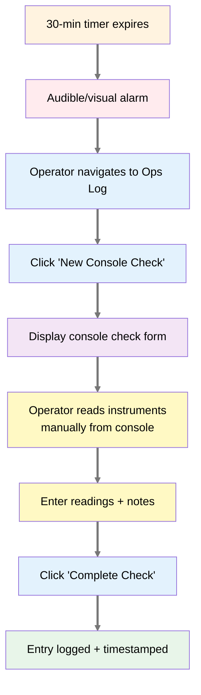
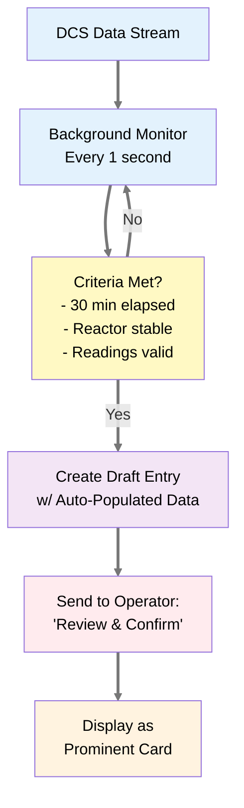
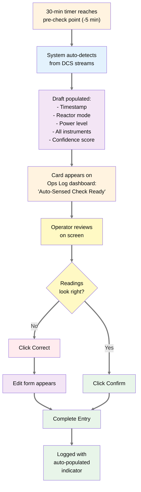
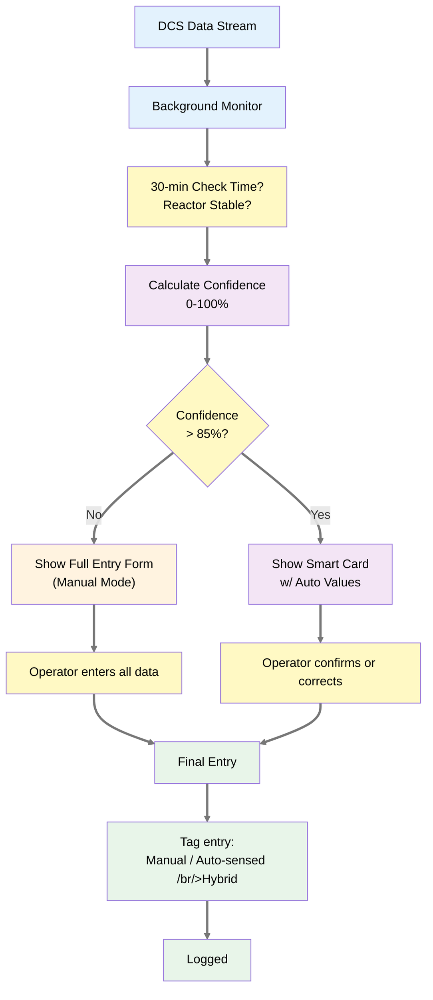
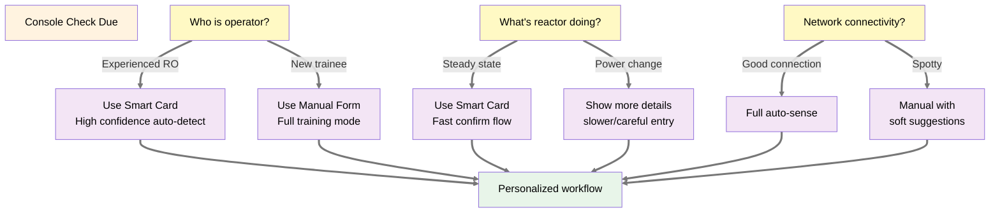

# Design Mockups: Console Check Entry UI/UX

**Status:** Design Exploration  
**Created:** January 22, 2026  
**Purpose:** Evaluate UI/UX workflows for auto-sensed vs. manual console check entry in Reactor Ops Log  
**Target Users:** Reactor operators performing 30-minute console checks  

---

## Overview

This document presents 4 UI/UX mockups exploring how operators would interact with:
1. **Manual Entry** (current baseline)
2. **Auto-Sensed Detection** (DCS data-driven)
3. **Hybrid Workflow** (auto-sense with operator confirmation)
4. **Intelligent Workflow** (contextual decision-making)

---

## Baseline: Manual Entry Workflow

### Current State



### Manual Entry Form Mockup

```
┌─────────────────────────────────────────────────────┐
│ NEW CONSOLE CHECK                           ✕       │
├─────────────────────────────────────────────────────┤
│                                                     │
│ SYSTEM INFO                                         │
│ ├─ Timestamp: 2026-01-22 14:30:00                   │
│ ├─ Author: J. Smith (RO)                            │
│ └─ Reactor Mode: STEADY_STATE (950 kW)              │
│                                                     │
│ INSTRUMENT READINGS (required)                      │
│ ├─ Pool Temperature:     ┌─────────┐ °C             │
│ │                         │ _______ │                │
│ │                         └─────────┘                │
│ │                                                    │
│ ├─ Power Level:         ┌─────────┐ kW              │
│ │                         │ _______ │                │
│ │                         └─────────┘                │
│ │                                                    │
│ ├─ Primary Coolant Flow: ┌─────────┐ gpm            │
│ │                         │ _______ │                │
│ │                         └─────────┘                │
│ │                                                    │
│ └─ Secondary Coolant Temp: ┌──────────┐ °C          │
│                             │ ________ │             │
│                             └──────────┘             │
│                                                     │
│ NOTES (optional)                                    │
│ ┌─────────────────────────────────────────────────┐ │
│ │ ___________________________________                │ │
│ │ ___________________________________                │ │
│ │ ___________________________________                │ │
│ └─────────────────────────────────────────────────┘ │
│                                                     │
│ OPERATOR AUTHORIZATION                             │
│ └─ [ ] I confirm these readings are accurate       │
│    Signature: J. Smith              [Sign] [Cancel] │
│                                                     │
└─────────────────────────────────────────────────────┘
```

### Manual Entry Pros & Cons

**Pros:**
- Simple, straightforward
- Familiar to operators (mirrors paper log)
- Full operator control
- No dependency on DCS connectivity

**Cons:**
- Manual data entry is time-consuming (~2-3 min per check)
- Transcription errors possible
- Dual-entry problem: operator must read console AND enter into log
- No auto-validation of readings

---

## Design 1: Auto-Sensed Detection Workflow

### Auto-Sense Architecture

The system continuously monitors DCS data streams. When it detects conditions matching console check criteria (30-min interval, reactor in steady state, readings stable), it auto-populates an entry draft.



### Auto-Sensed Entry Workflow



### Auto-Sensed Entry Card Mockup (Dashboard)

```
┌─────────────────────────────────────────────────────┐
│ ⭐ AUTO-SENSED CONSOLE CHECK READY                  │
│ Status: Ready for Review                            │
├─────────────────────────────────────────────────────┤
│                                                     │
│ TIMESTAMP: 2026-01-22 14:30:12                      │
│ REACTOR MODE: Steady State                          │
│                                                     │
│ DETECTED READINGS (from DCS)                        │
│ ├─ Pool Temperature:       37.8 °C     ✓ Normal     │
│ ├─ Power Level:           950 kW       ✓ Normal     │
│ ├─ Primary Coolant Flow:  125 gpm      ✓ Normal     │
│ ├─ Secondary Coolant Temp: 32.4 °C     ✓ Normal     │
│                                                     │
│ CONFIDENCE: 98%                                     │
│ └─ All sensors stable, multi-point averages        │
│                                                     │
│ YOUR TASK:                                          │
│ [ ] Review readings match physical console display  │
│ [ ] Verify no manual adjustments since check       │
│                                                     │
│                      [CONFIRM]  [CORRECT]  [SKIP]  │
│                                                     │
└─────────────────────────────────────────────────────┘
```

### If Operator Clicks "CORRECT"

```
┌─────────────────────────────────────────────────────┐
│ ADJUST READINGS                                     │
├─────────────────────────────────────────────────────┤
│                                                     │
│ AUTO-DETECTED vs YOUR READING:                      │
│                                                     │
│ Pool Temperature:                                   │
│   ├─ System detected:  37.8 °C                      │
│   ├─ Your reading:    ┌─────────┐ °C                │
│   │                    │ _______ │                   │
│   │                    └─────────┘                   │
│   └─ Reason: ⬜ Typo  ⬜ Gauge error  ⬜ Sensor lag │
│                                                     │
│ Power Level:                                        │
│   ├─ System detected:  950 kW  ✓ OK                 │
│   └─ [Tap to edit]                                  │
│                                                     │
│ Primary Coolant Flow:                               │
│   ├─ System detected:  125 gpm  ✓ OK                │
│   └─ [Tap to edit]                                  │
│                                                     │
│ Secondary Coolant Temp:                             │
│   ├─ System detected:  32.4 °C  ✓ OK                │
│   └─ [Tap to edit]                                  │
│                                                     │
│ NOTES (optional):                                   │
│ ┌─────────────────────────────────────────────────┐ │
│ │ (e.g., "Thermocouple reads low due to lag")      │ │
│ └─────────────────────────────────────────────────┘ │
│                                                     │
│             [COMPLETE ENTRY]  [CANCEL]              │
│                                                     │
└─────────────────────────────────────────────────────┘
```

### Auto-Sensed Pros & Cons

**Pros:**
- Eliminates manual data entry (~90 second time savings per check)
- Reduces transcription errors
- Uses real data from instrumentation
- No dual-entry problem
- Operator can confirm from console at a glance

**Cons:**
- Requires DCS data stream integration
- Operator might just "click through" without verifying
- Trust issues: Does operator believe the auto-detected values?
- Needs high confidence threshold to avoid "alert fatigue"
- Sensor failures could propagate unchecked data

---

## Design 2: Hybrid Workflow (Recommended)

### Hybrid Approach Philosophy

Combine auto-sense **detection** (which saves time) with **operator verification** (which ensures accuracy). The system auto-detects when to prompt, but the operator makes the final decision.



### Smart Detection Logic

```yaml
AutoSense Decision Tree:
  - Is DCS stream healthy (no gaps, no stale data)?
    - Yes: Continue
    - No: Fall back to manual entry
  
  - Is 30-minute interval confirmed?
    - Yes: Continue
    - No: Remind operator (not time yet)
  
  - Is reactor in steady state (power stable for 5+ min)?
    - Yes: Continue
    - No: Wait for stabilization, notify operator
  
  - Are all 4 key instruments reporting (temp, power, flow, secondary)?
    - Yes: Continue
    - No: Fall back to manual for missing instrument(s)
  
  - Do all instruments have recent readings (< 30 sec old)?
    - Yes: Continue
    - No: Fall back to manual
  
  - Are readings within expected ranges (e.g., power 800-1000 kW)?
    - Yes: HIGH CONFIDENCE (>85%) → SmartCard workflow
    - No: MEDIUM CONFIDENCE (50-85%) → Manual with pre-fill
    
  Result: Assign confidence score and workflow type
```

### Smart Card Mockup (Hybrid Workflow)

```
┌────────────────────────────────────────────────────┐
│  AUTO-SENSED ✓  2026-01-22 14:30                   │
│  CONFIDENCE: 98% (All sensors good)                │
├────────────────────────────────────────────────────┤
│                                                    │
│ READINGS AT CONSOLE (Just verify these):           │
│                                                    │
│  Pool Temperature        37.8°C        ✓ Confirmed │
│  Power Level             950 kW        ✓ Confirmed │
│  Primary Coolant Flow    125 gpm       ✓ Confirmed │
│  Secondary Coolant Temp  32.4°C        ✓ Confirmed │
│                                                    │
│ CHECK: Do these readings match your console       │
│ instrument displays right now?                     │
│                                                    │
│                   [✓ ALL GOOD] [⚠ SOMETHING'S OFF]│
│                                                    │
└────────────────────────────────────────────────────┘
```

If "ALL GOOD":
```
┌────────────────────────────────────────────────────┐
│ ENTRY COMPLETE ✓                                   │
├────────────────────────────────────────────────────┤
│                                                    │
│ Entry Type:  CONSOLE_CHECK                         │
│ Source:      Auto-sensed (98% confidence)          │
│ Operator:    J. Smith (RO)                         │
│ Time:        2026-01-22 14:30:12                   │
│                                                    │
│ I confirm these readings were verified at the      │
│ physical console: [Signature] J. Smith             │
│                                                    │
│             [SIGN & LOG]  [ADD NOTE]  [EDIT]       │
│                                                    │
│ Next check in 30 minutes (14:59)                   │
│                                                    │
└────────────────────────────────────────────────────┘
```

If "SOMETHING'S OFF":
```
┌────────────────────────────────────────────────────┐
│ VERIFY READINGS                                    │
├────────────────────────────────────────────────────┤
│                                                    │
│ What doesn't match?                                │
│                                                    │
│ [ ] Pool Temperature                               │
│     System: 37.8°C  |  You see: _______ °C         │
│                                                    │
│ [ ] Power Level                                    │
│     System: 950 kW  |  You see: _______ kW         │
│                                                    │
│ [ ] Primary Coolant Flow                           │
│     System: 125 gpm  |  You see: _______ gpm       │
│                                                    │
│ [ ] Secondary Coolant Temp                         │
│     System: 32.4°C  |  You see: _______ °C         │
│                                                    │
│ NOTES:                                             │
│ ┌──────────────────────────────────────────────┐   │
│ │                                              │   │
│ └──────────────────────────────────────────────┘   │
│                                                    │
│              [SAVE CORRECTIONS]  [CANCEL]          │
│                                                    │
└────────────────────────────────────────────────────┘
```

### Hybrid Pros & Cons

**Pros:**
- Best of both worlds: speed + accuracy
- Confidence threshold prevents low-quality auto-entries
- Graceful fallback to manual when DCS unreliable
- Builds operator trust (they control the override)
- Reduces dual-entry while protecting data integrity
- Clear metadata (auto vs manual) for audit trail
- Low cognitive burden (simple yes/no confirmation)

**Cons:**
- More complex codebase
- Requires DCS integration & ongoing maintenance
- Needs operator training on when system auto-detects
- Potential for false positives if thresholds poorly tuned

---

## Design 3: Intelligent Workflow (Future)

### Adaptive Based on Context



**Adaptive Features:**
- **Experienced operators**: Show smart card + confidence; assume verification
- **Trainees**: Show full form; explain data sources; tutorial mode
- **During power changes**: Detailed form with more context and validation checks
- **Offline/poor network**: Fallback to manual with local caching
- **Late-night shifts**: Simpler form to reduce cognitive load
- **Emergency scenarios**: Always require explicit full entry (no auto-sense)

---

## Comparison Table: Workflow Options

| Dimension | Manual | Auto-Sensed | Hybrid | Intelligent |
|-----------|--------|-------------|--------|-------------|
| **Entry Time** | 2-3 min | 10-15 sec | 15-30 sec | 10-45 sec (context) |
| **Data Quality** | Operator-dependent | High if DCS reliable | High + verified | High + contextual |
| **Transcription Errors** | Possible | None | Minimal | Minimal |
| **Operator Trust** | High (full control) | Medium (auto might be wrong) | High (verify, then trust) | High (personalized) |
| **Implementation Complexity** | Low | Medium-High | Medium | High |
| **DCS Dependency** | None | Required | Optional | Required |
| **Audit Trail Clarity** | Clear (manual) | Clear (auto) | Very clear (hybrid) | Very clear (tagged) |
| **Training Required** | Minimal | Moderate | Low-Moderate | Moderate-High |
| **Failure Mode** | Delayed entry if operator busy | Inaccurate if DCS fails | Graceful fallback | Context-aware fallback |

---

## Recommendation

**Start with Hybrid Workflow (Design 2)** for initial deployment:

1. **Phase 1 (Months 1-2)**: Implement manual entry baseline (stabilize the system, train operators)

2. **Phase 2 (Months 3-4)**: Add DCS integration + background monitoring, deploy auto-sense detection with conservative 85%+ confidence threshold

3. **Phase 3 (Months 5-6)**: Gather telemetry (how often operators click "confirm" vs "correct"), tune thresholds, add smart card UI

4. **Phase 4 (Months 7+)**: Consider context-aware adaptation (intelligent workflow) if data supports it

**Why hybrid first?**
- Delivers time savings (the original goal)
- Maintains operator control (builds trust)
- Easy fallback to manual if DCS issues occur
- Data-driven approach to future enhancements
- Reduces risk vs. full auto-sense

---

## Questions for Designer Sessions

1. **Visual Design**: Should auto-sensed data be visually distinct (color, icon, layout) from manually entered data, or should they look identical once confirmed?

2. **Confidence Presentation**: How much detail should operators see about confidence scores? Simple % or detailed reasoning?

3. **Failure Messaging**: When auto-sense fails (low confidence, DCS lag, missing sensor), what messaging reduces frustration vs. promotes trust?

4. **Mobile/Tablet**: Should this UI work on a tablet console near the reactor, or desktop only?

5. **Voice/Accessibility**: Can operators confirm checks via voice prompt ("Is this reading correct? Say yes or no")?

6. **Historical Data**: If operator regularly corrects auto-sensed value X, should system learn and adjust future thresholds?

7. **Audit Trail**: How should "source" (auto vs manual) appear in exports for NRC inspection?

---

*Ready for mockup iteration and user testing with operators at NETL*
