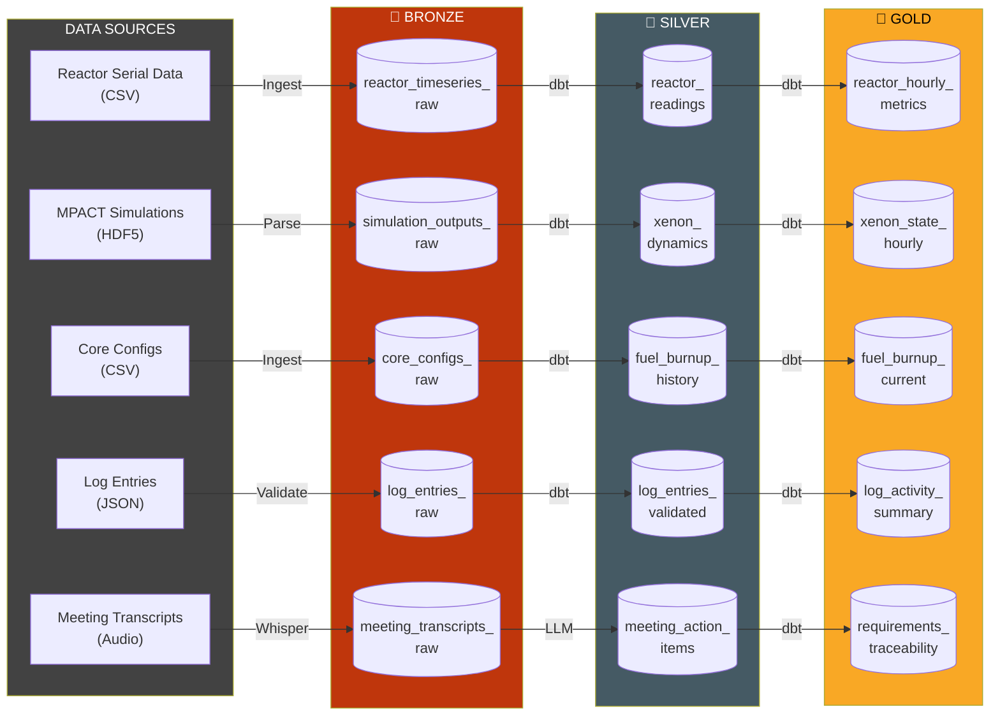
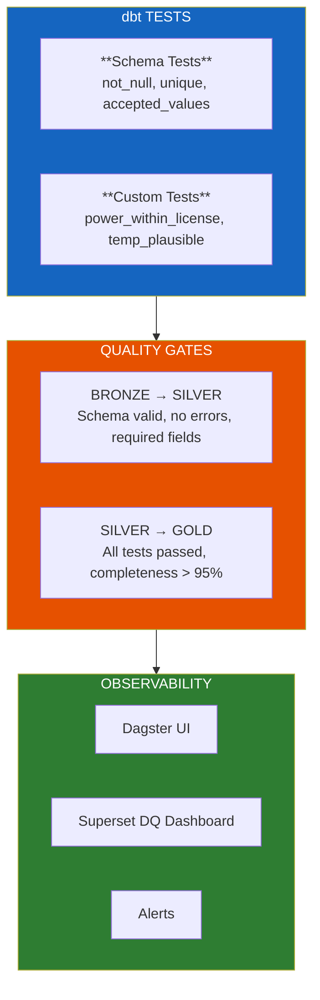

# Data Architecture Specification

**Part of:** [Neutron OS Master Tech Spec](neutron-os-master-tech-spec.md)

---

> **Scope:** This document specifies the Neutron OS data architecture, including the medallion pattern, Apache Iceberg configuration, schema definitions, data quality framework, and streaming readiness.

| Property | Value |
|----------|-------|
| Version | 0.1 |
| Last Updated | 2026-01-27 |
| Status | Draft |
| Related ADRs | [ADR-003: Lakehouse Iceberg DuckDB](../adr/003-lakehouse-iceberg-duckdb.md), [ADR-007: Streaming-First](../adr/007-streaming-first-architecture.md) |

---

## Table of Contents

1. [Overview](#1-overview)
2. [Medallion Architecture](#2-medallion-architecture)
3. [Layer Specifications](#3-layer-specifications)
4. [Gold Layer Schemas](#4-gold-layer-schemas)
5. [Data Quality Framework](#5-data-quality-framework)
6. [Apache Iceberg Configuration](#6-apache-iceberg-configuration)
7. [Platform Comparison](#7-platform-comparison)
8. [Streaming Architecture](#8-streaming-architecture)
9. [Backup & Retention Policy](#9-backup--retention-policy)

---

## 1. Overview

Neutron OS employs a **medallion architecture** (Bronze → Silver → Gold) built on:
- **Apache Iceberg** for time-travel capabilities and schema evolution
- **DuckDB** as the query engine
- **dbt** for transformations
- **Dagster** for orchestration

---

## 2. Medallion Architecture



### Layer Characteristics

| Layer | Characteristics |
|-------|-----------------|
| **🥉 Bronze** | Raw, unprocessed • Schema-on-read • Append-only • Full history |
| **🥈 Silver** | Cleaned, validated • Deduplicated • Typed columns • Standardized |
| **🥇 Gold** | Business-ready • Aggregated metrics • Dashboard-optimized |

---

## 3. Layer Specifications

### 3.1 Bronze Layer

Raw, unprocessed data exactly as received. Append-only to preserve complete history.

| Table Name | Source | Partitioning | Retention |
|------------|--------|--------------|-----------|
| reactor_timeseries_raw | Serial data CSV | org_id, reactor_id, date | Forever |
| simulation_outputs_raw | MPACT/SAM HDF5 | org_id, reactor_id, date | Forever |
| core_configs_raw | Core configuration CSVs | org_id, reactor_id, config_date | Forever |
| log_entries_raw | Log JSON submissions | org_id, reactor_id, date | Forever |
| meeting_transcripts_raw | Whisper transcriptions | org_id, date, meeting_id | Forever |

> **Multi-Tenant:** All tables partitioned by `org_id` and `reactor_id` for tenant isolation.

### 3.2 Silver Layer

Cleaned, validated, and deduplicated data. dbt transformations apply business rules.

| Table Name | Source Bronze | Key Transformations |
|------------|---------------|---------------------|
| reactor_readings | reactor_timeseries_raw | Null handling, unit conversion, add `source='measured'` |
| reactor_predictions | simulation_outputs_raw | Extract DT predictions, add `source='modeled'` |
| xenon_dynamics | simulation_outputs_raw | Extract Xe-135/I-135, calculate equilibrium |
| fuel_burnup_history | core_configs_raw | Calculate delta burnup, join with positions |
| log_entries_validated | log_entries_raw | Schema validation, hash verification |
| meeting_action_items | meeting_transcripts_raw | LLM extraction, assignee resolution |

### 3.3 Gold Layer

Business-ready, aggregated datasets optimized for analytics and dashboards.

| Table Name | Business Purpose | Update Frequency |
|------------|------------------|------------------|
| reactor_hourly_metrics | Aggregated reactor performance | Hourly |
| xenon_state_hourly | Hourly xenon poisoning state (inferred) | Hourly |
| fuel_burnup_current | Current fuel element burnup | Daily |
| rod_positions_hourly | Control rod position history | Hourly |
| log_activity_summary | Unified log metrics | Daily |
| sample_tracking_current | Current sample status | On change |

---

## 4. Gold Layer Schemas

### 4.1 reactor_hourly_metrics

> **Note:** Includes `source` column to distinguish measured vs modeled data.

| Field | Type | Description |
|-------|------|-------------|
| hour_timestamp | timestamp | Hour bucket (UTC) |
| source | enum | `measured` or `modeled` |
| model_version | string | Model version if modeled |
| avg_power_kw | float | Average power in kW |
| max_power_kw | float | Maximum power in hour |
| min_power_kw | float | Minimum power in hour |
| avg_fuel_temp_c | float | Average fuel temperature |
| data_quality_score | float | Quality metric (0-1) |

### 4.2 xenon_state_hourly

> **Important:** Cannot be measured directly; correlated with critical rod heights.

| Field | Type | Description |
|-------|------|-------------|
| hour_timestamp | timestamp | Hour bucket (UTC) |
| xe135_concentration | float | Xe-135 atoms/barn-cm (inferred) |
| reactivity_worth_pcm | float | Xenon reactivity worth |
| source | enum | `model` or `rod_correlation` |
| critical_rod_height_pct | float | Rod height for correlation |

### 4.3 fuel_burnup_current

| Field | Type | Description |
|-------|------|-------------|
| element_id | string | Fuel element identifier |
| ring_position | string | Core ring (B,C,D,E,F,G) |
| u235_burnup_percent | float | U-235 depletion % |
| accumulated_mwd | float | Megawatt-days accumulated |
| baseline_mwd | float | Burnup at last long shutdown |
| delta_since_baseline | float | Burnup since baseline |

### 4.4 log_entries (Unified Log)

Single table with `entry_type` discriminator for all log types.

| Field | Type | Description |
|-------|------|-------------|
| entry_id | uuid | Unique identifier |
| entry_number | string | Sequential (2026-042) |
| entry_type | enum | console_check, startup, shutdown, scram, etc. |
| created_at | timestamp | Entry creation time (UTC, immutable) |
| author_id | string | User who created entry |
| title | string | Entry title/summary |
| content | text | Full entry content |
| reactor_power_kw | decimal | Auto-populated from time-series |
| reactor_mode | enum | shutdown, startup, steady_state |
| signature_hash | string | Cryptographic chain hash |
| supplements | array | Correction supplements (no deletes) |

**Entry Types:**
- `console_check` — Mandatory 30-minute walkdown
- `startup` / `shutdown` / `scram` — Reactor state changes
- `radiation_survey` — HP survey reading
- `experiment_log` — Sample insertion/removal
- `maintenance` — Equipment issues
- `general_note` — Miscellaneous

> **Critical:** Dashboard must flag gaps > 30 min during operating periods.

### 4.5 sample_tracking

| Field | Type | Required |
|-------|------|----------|
| sample_id | uuid | Auto |
| sample_name | string | Yes |
| sample_description | string | Yes |
| mass_g | float | Yes |
| irradiation_facility | enum | Yes |
| datetime_inserted | timestamp | On insert |
| datetime_removed | timestamp | On remove |
| reactor_power_kw | decimal | Auto |
| dose_rate_mrem_hr | decimal | On remove |
| status | enum | Yes |

**Irradiation Facilities:** TPNT, EPNT, RSR, CT, F3EL, 3EL_Cd, 3EL_Pb, BP1-BP5

---

## 5. Data Quality Framework



### Quality Tests

| Category | Tests |
|----------|-------|
| Schema | not_null, unique, accepted_values, relationships |
| Physics | power_within_license_limit, temperature_plausible |
| Consistency | burnup_monotonically_increasing, rod_position_in_range |

---

## 6. Apache Iceberg Configuration

### 6.1 Catalog Configuration

| Property | Development | Production |
|----------|-------------|------------|
| Catalog Type | PostgreSQL (K3D) | AWS Glue or Hive |
| Storage | Local filesystem | S3 |
| Snapshot Retention | 10 snapshots | 100 snapshots |
| Time-travel Window | 7 days | 90 days |

### 6.2 Partitioning Strategy

| Table | Partition Columns | Rationale |
|-------|-------------------|-----------|
| reactor_timeseries_raw | year, month | Time-based queries |
| reactor_hourly_metrics | year, month | Dashboard date filters |
| log_entries_raw | year | Audit queries by year |

### 6.3 Key Capabilities

- **Time-travel queries:** Query data as it existed at any point
- **Schema evolution:** Add/rename/drop columns without rewriting
- **Partition evolution:** Change partitioning without data movement
- **ACID transactions:** Concurrent reads and writes

---

## 7. Platform Comparison

### 7.1 Decision Summary

We chose **open-source** (Iceberg + DuckDB + dbt) over commercial platforms (Databricks, Snowflake).

| Factor | Databricks | Snowflake | Open-Source |
|--------|------------|-----------|-------------|
| **Annual Cost** | $15K-$100K+ | $20K-$150K+ | ~$0 |
| **Data Sovereignty** | ⚠️ Cloud | ⚠️ Cloud | ✅ Full control |
| **Physics Code Integration** | ⚠️ Custom | ⚠️ Limited | ✅ Native |
| **On-Premise** | ⚠️ Limited | ❌ None | ✅ Full |
| **Vendor Lock-in** | ⚠️ Delta Lake | ❌ Proprietary | ✅ Open standards |
| **Research Reproducibility** | ⚠️ Platform-dependent | ⚠️ Platform-dependent | ✅ Auditable |

### 7.2 Decision Rationale

1. **Budget sustainability:** No per-compute costs
2. **Nuclear integration:** Native Python/HDF5 for MCNP, MPACT, SAM
3. **On-premise flexibility:** Partner facilities may require isolated deployments
4. **Research integrity:** Open pipelines can be peer-reviewed
5. **Workforce development:** Students learn industry-standard tools

> **Migration path:** Open formats (Iceberg, Parquet) ensure future migration feasibility.

---

## 8. Streaming Architecture

> **See:** [ADR-007: Streaming-First Architecture](../adr/007-streaming-first-architecture.md)

### 8.1 Design Principle

**Build for streaming; use batch as fallback.**

| Scenario | Implementation |
|----------|----------------|
| Real-time DT | Kafka/Redpanda → Iceberg |
| Batch historical | File drops → Dagster → Iceberg |
| Hybrid | Stream primary, batch backfill |

### 8.2 Event Schema

All events follow a common envelope:

```json
{
  "event_id": "uuid",
  "event_type": "sensor_reading | prediction | log_entry",
  "timestamp": "ISO8601",
  "source": { "facility": "NETL", "reactor": "ut-triga-1" },
  "payload": { ... },
  "metadata": { "schema_version": "1.0" }
}
```

### 8.3 Latency Targets

| Pipeline | Current | Target |
|----------|---------|--------|
| Sensor → Bronze | 5 min (batch) | <10s (streaming) |
| Bronze → Silver | 15 min | <1 min |
| Silver → Gold | 1 hour | <5 min |
| Gold → Dashboard | <1s | <1s |

---

## 9. Backup & Retention Policy

All data in the lakehouse must support regulatory retention requirements and disaster recovery. This section defines the backup strategy and retention tiers.

**See also:** [Master Tech Spec § 9.2: Backup & Archive Strategy](neutron-os-master-tech-spec.md#92-backup--archive-strategy)

### 9.1 Retention Tiers

| Tier | Duration | Storage | Purpose |
|------|----------|---------|---------|
| **Live** | 2 years | Cloud Iceberg | Primary operational use, regulatory window |
| **Archive** | 7+ years | S3 Glacier + encrypted local | Long-term compliance, facility-controlled |
| **Snapshot** | 10 snapshots | Iceberg metadata | Time-travel, rollback capability |

### 9.2 Backup Strategy

| Backup Type | Frequency | Destination | Recovery RPO |
|-------------|-----------|-------------|--------------|
| **Continuous Replication** | Real-time | Multi-region S3 | <1 min data loss |
| **Daily Snapshots** | Daily 00:00 UTC | S3 + local NAS | <24 hours data loss |
| **Monthly Archives** | 1st of month | Glacier + Tape | Long-term, regulatory |
| **Encrypted Local Copy** | Daily | Facility network drive | Immediate local recovery |

### 9.3 Disaster Recovery

| Scenario | RTO | RPO | Process |
|----------|-----|-----|---------|
| **Regional outage** | <1 hour | <1 min | Fail over to alternate region |
| **Data corruption** | <4 hours | <24 hours | Restore from daily snapshot |
| **Extended outage** | <24 hours | <1 day | Restore from Glacier archive |
| **Complete loss** | <7 days | <1 day | Recover from tape archive |

### 9.4 Regulatory Compliance

- **2-year retention minimum**: Live data kept in Iceberg for NRC inspection window
- **7-year archive**: Regulatory requirement for audit trails and critical records
- **Immutability**: All backups are append-only; no modification or deletion allowed
- **Versioning**: Iceberg time-travel enables recovery of any point-in-time data
- **Audit trail**: All backup operations logged in immutable Hyperledger blockchain

### 9.5 Encryption

| Scenario | Standard | Key Management |
|----------|----------|-----------------|
| **In transit** | TLS 1.3 | Certificate pinning |
| **At rest (Cloud)** | AES-256 (AWS KMS) | AWS managed keys |
| **At rest (Local)** | AES-256 | Facility-managed encryption |
| **Archive (Tape)** | AES-256 | Facility-controlled keys |

**Key Rotation:** Quarterly for active encryption keys; archived keys retained indefinitely per regulatory requirement.
