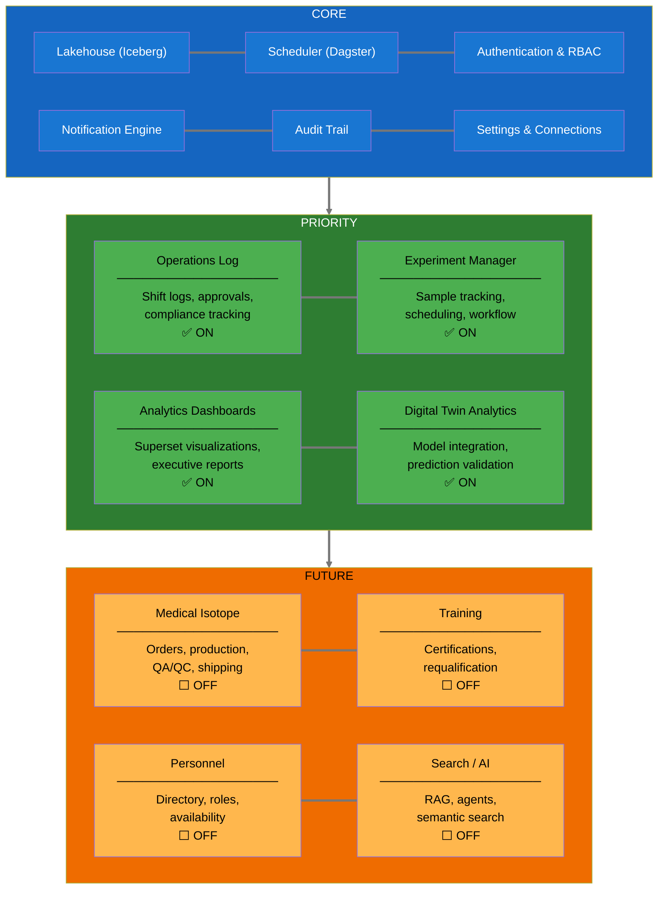
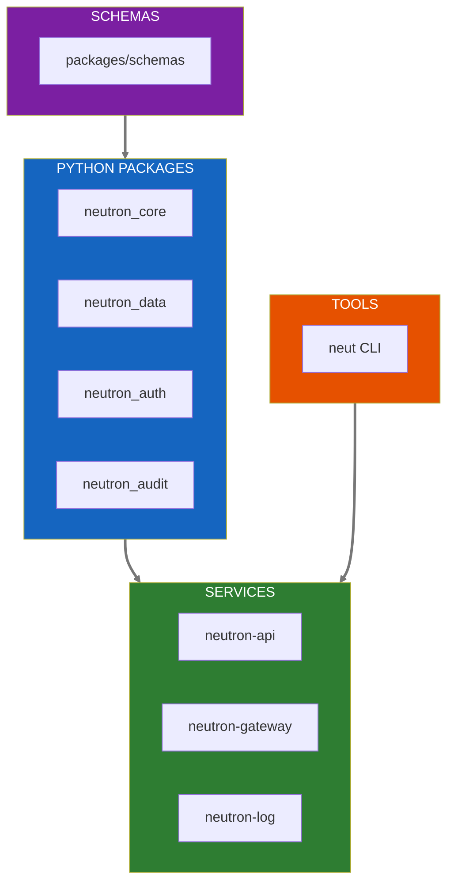
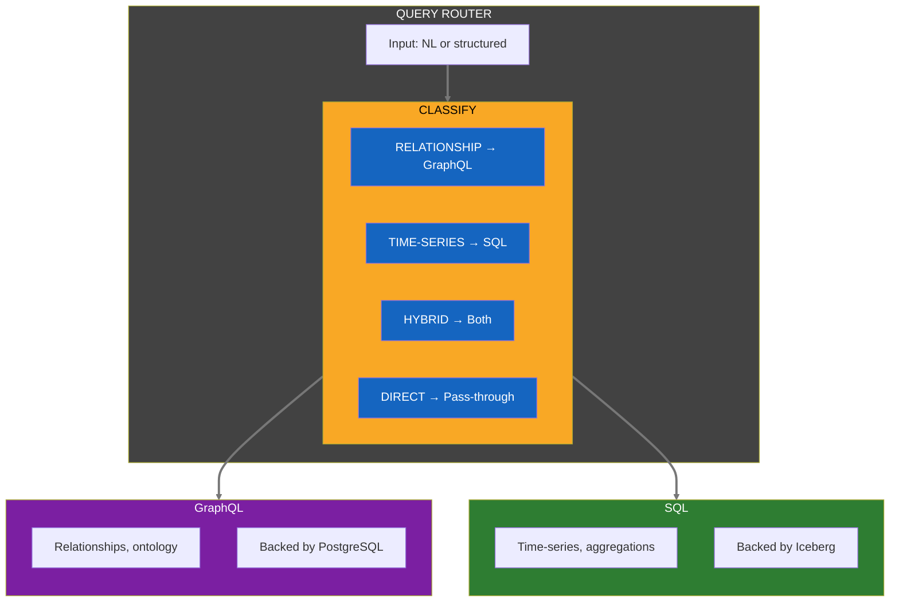
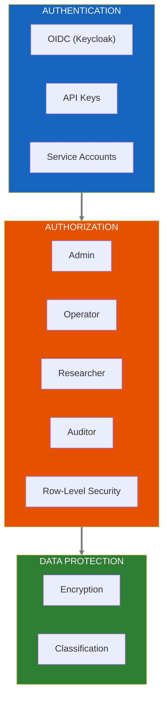
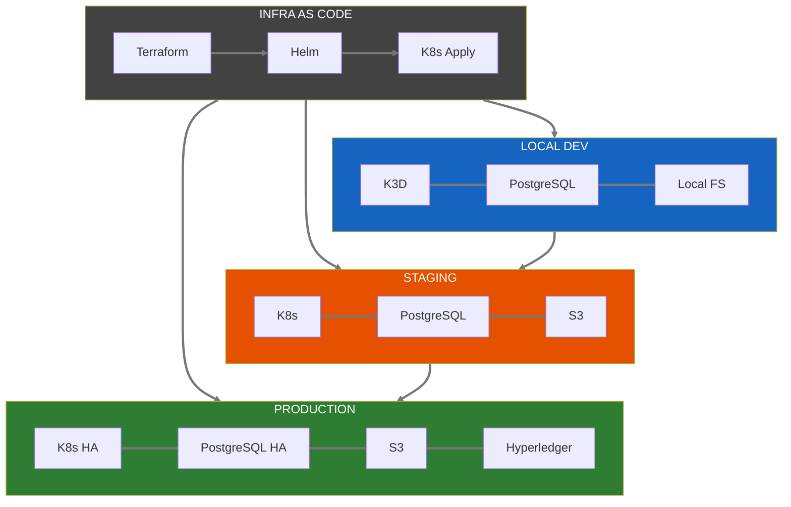
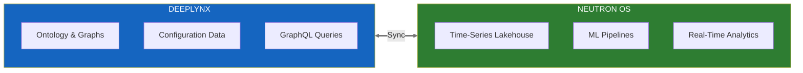
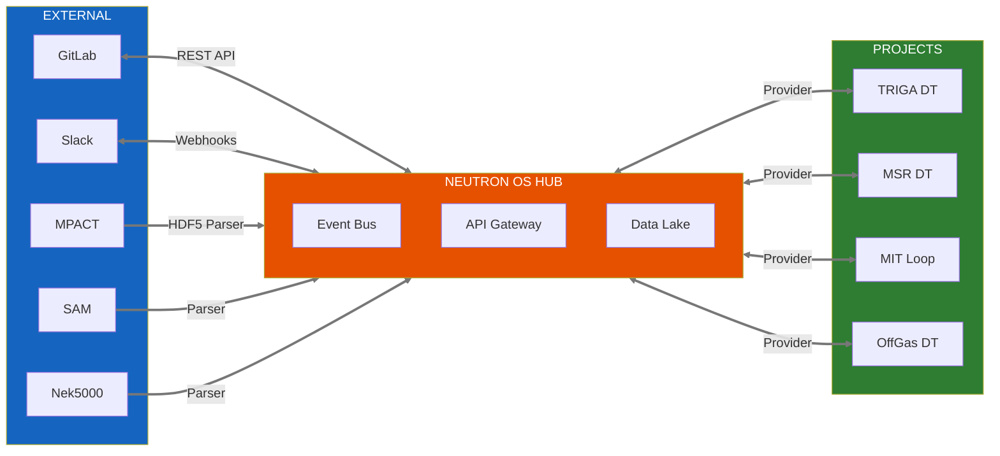

# Neutron OS Master Technical Specification

**The intelligence platform for nuclear power reactors**

---

| Property | Value |
|----------|-------|
| Version | 0.2 |
| Last Updated | 2026-01-27 |
| Status | Active Development |
| Authors | Benjamin Booth, UT Computational NE Team |

---

> **This is the master spec.** It provides architecture decisions and high-level design for technical leads. Detailed implementations live in component specs:
>
> | Spec | Focus |
> |------|-------|
> | [Digital Twin Architecture](digital-twin-architecture-spec.md) | Surrogate models, provider interfaces, WASM runtime |
> | [Data Architecture](data-architecture-spec.md) | Medallion pattern, Iceberg, schemas, streaming |
> | [neut CLI](neut-cli-spec.md) | Command-line interface, auth, WASM validation |
> | [Publisher](neutron-os-publisher-spec.md) | Document lifecycle, format-endpoint compatibility, audience targeting |
>
> For strategic context, see the [Executive Summary](neutron-os-executive-summary.md).

---

## Related Documents

### Architecture Decision Records

| ADR | Decision | Status |
|-----|----------|--------|
| [ADR-001](../adr/001-polyglot-monorepo-bazel.md) | Polyglot monorepo with Bazel | Accepted |
| [ADR-002](../adr/002-hyperledger-fabric-multi-facility.md) | Hyperledger Fabric for audit | Accepted |
| [ADR-003](../adr/003-lakehouse-iceberg-duckdb.md) | Iceberg + DuckDB lakehouse | Accepted |
| [ADR-007](../adr/007-streaming-first-architecture.md) | Streaming-first architecture | Accepted |
| [ADR-008](../adr/008-wasm-extension-runtime.md) | WASM surrogate runtime | Proposed |

### Design Prompts (Implementation Specs)

| Prompt | Phase | Description |
|--------|-------|-------------|
| [Bronze Layer Ingest](design-prompts/prompt-bronze-layer-ingest.md) | 1 | CSV → Iceberg ingestion |
| [dbt Silver Models](design-prompts/prompt-dbt-silver-models.md) | 1-2 | Data transformation |
| [Dagster Orchestration](design-prompts/prompt-dagster-orchestration.md) | 2 | Pipeline scheduling |
| [Superset Dashboards](design-prompts/prompt-superset-dashboards.md) | 2 | Visualization |

### Component Specs

| Spec | Description |
|------|-------------|
| [Agent Architecture](neutron-os-agent-architecture.md) | Sense pipeline, extractors, correlator, synthesizer |
| [Model Routing & Export Control](neutron-os-model-routing-spec.md) | LLM tier routing, export control classifier, `neut settings` |
| [RAG Architecture](neutron-os-rag-architecture-spec.md) | Community/personal/facility scopes, export-controlled embeddings, local embedding pipeline |
| [Agent State Management](agent-state-management-spec.md) | Concurrent state access (LockedJsonFile), M-O retention enforcement, audit logging |

---

## 1. Executive Summary

### 1.1 Vision

**Neutron OS** is a unified data and digital twin platform for nuclear facilities. It transforms how operators, researchers, and regulators interact with reactor data—replacing fragmented spreadsheets, manual logs, and disconnected systems with a single source of truth.

### 1.2 Problem Statement

Nuclear facilities today operate with:
- **Fragmented data**: Sensor readings in one system, operator logs in another, experiment results in spreadsheets
- **Manual compliance**: Hours spent compiling reports that regulators require
- **Reactive operations**: Anomalies detected after they occur, not predicted before
- **Siloed knowledge**: Institutional expertise locked in individuals, not accessible to the team

These problems compound as nuclear energy scales. Research reactors are the proving ground—but the solutions must work for commercial fleets.

### 1.3 Solution Overview

Neutron OS provides:

| Capability | Value Delivered |
|------------|-----------------|
| **Unified Data Platform** | All reactor data—sensors, logs, experiments, simulations—queryable from one place |
| **Digital Twin Analytics** | Physics-informed predictions that anticipate equipment behavior and validate operations |
| **Automated Compliance** | Audit trails and reports generated automatically, not manually compiled |
| **AI-Assisted Operations** | Natural language queries, automated meeting notes, intelligent anomaly alerts |
| **Multi-Facility Ready** | One platform serving multiple reactors with appropriate data isolation |

### 1.4 Target Users

| User | Primary Needs |
|------|---------------|
| **Reactor Operators** | Streamlined shift logs, clear dashboards, predictive alerts |
| **Researchers** | Experiment tracking, data access for analysis, simulation validation |
| **Facility Managers** | Compliance reporting, resource utilization, strategic visibility |
| **Regulators** | Immutable audit trails, standardized reporting, inspection support |

### 1.5 Scope

**This Document Covers:**
- Data architecture (lakehouse design, ingestion, transformation)
- Digital twin integration patterns
- Platform modules and their relationships
- Technical implementation approach

**Deferred to Companion Documents:**
- User interface specifications
- Hyperledger blockchain integration details
- Individual module PRDs (Operations Log, Experiment Manager, etc.)

### 1.6 Application Modules

Neutron OS is designed as a **modular platform**. Facilities enable only the modules relevant to their mission.

| Module | Description | PRD | Default |
|--------|-------------|-----|---------|
| **Core Platform** | Data lakehouse, dashboards, authentication | N/A (always on) | Required |
| **Reactor Ops Log** | Operations logging, experiment log, compliance | [Reactor Ops Log PRD](../prd/reactor-ops-log-prd.md) | On |
| **Experiment Manager** | Sample tracking, scheduling, researcher workflow | [Experiment Manager PRD](../prd/experiment-manager-prd.md) | On |
| **Analytics Dashboards** | Superset visualizations, executive reports | [Analytics PRD](../prd/analytics-dashboards-prd.md) | On |
| **Medical Isotope Production** | Customer orders, production batching, QA/QC, shipping | [Medical Isotope PRD](../prd/medical-isotope-prd.md) | **Off** |
| **Digital Twin Analytics** | Model integration, prediction validation | *(future PRD)* | On |
| **Training** | Personnel onboarding, certification currency, skills development, **operator requalification tracking (4hr/quarter minimum)** | *(future PRD)* | Off |
| **Personnel** | Staff directory with roles, certifications, contact info, availability | *(future PRD)* | Off |
| **Search / AI** | RAG, workflow-enabled agents, tuned LLMs, semantic search | *(future PRD)* | Off |
| **neut CLI + Agents** | `neut chat`, `neut sense`, export-control routing, `neut settings` | [Agent PRD](../requirements/prd_neutron-os-agents.md) | On |
| **Publisher** | `neut pub` — document lifecycle, markdown → publish, multi-endpoint | [Publisher PRD](../requirements/prd_publisher.md) | On |
| **Connections** | Integrations hub for external systems (within Settings) | *(future PRD)* | Off |

**Module Architecture:**



**Multi-Facility Configurability:**

All facility-specific aspects are configuration, not code:

| Aspect | Example (NETL) | Example (NRAD) | Configuration |
|--------|----------------|----------------|---------------|
| Facility names | TPNT, EPNT, CT | PTS, CT, RSR | Admin dropdown editor |
| License limits | 1 MW | 250 kW | Settings page |
| Approval workflow | ROC → RM | Similar | Workflow builder |
| Isotope catalog | I-131, Mo-99 | Different set | Catalog editor |
| Branding | UT Austin | INL | Theme settings |

### 1.6 Development Roadmap

Development follows a **tracer bullet** approach: thin vertical slices that prove the architecture end-to-end, ship usable features fast, and expose integration risks early. Each tracer touches data → query → interface, building confidence before infrastructure investments.

#### Tracer Bullets (Q1-Q2 2026)

| Tracer | User Story | Stack Slice | Ships |
|--------|------------|-------------|-------|
| **T1** | "Show me reactor conditions during my Jan 15 experiment" | `neut data query` → existing Postgres | Feb 2026 |
| **T2** | "Search ops logs for 'fuel temp' mentions" | `neut log query` → full-text search | Feb 2026 |
| **T3** | "What's unusual about today's power profile?" | `neut chat` → simple anomaly detection | Mar 2026 |
| **T4** | "Draft a console check entry" | `neut log entry` → write path + audit | Mar 2026 |
| **T5** | "Predict xenon state in 2 hours" | First surrogate model (Python) | Q2 2026 |

```mermaid
flowchart TB
    subgraph T1["T1: Experiment Conditions"]
        T1CLI[neut data query]
        T1Q[SQL join]
        T1D[(Postgres)]
    end
    
    subgraph T2["T2: Log Search"]
        T2CLI[neut log query]
        T2Q[Full-text]
        T2D[(Postgres)]
    end
    
    subgraph T3["T3: Anomaly Chat"]
        T3CLI[neut chat]
        T3A[Pattern detection]
        T3D[(Postgres)]
    end
    
    subgraph T4["T4: Log Write"]
        T4CLI[neut log entry]
        T4W[Write + audit]
        T4D[(Postgres)]
    end
    
    subgraph T5["T5: First Surrogate"]
        T5CLI[neut twin predict]
        T5M[Python model]
        T5D[(Postgres)]
    end
    
    T1CLI --> T1Q --> T1D
    T2CLI --> T2Q --> T2D
    T3CLI --> T3A --> T3D
    T4CLI --> T4W --> T4D
    T5CLI --> T5M --> T5D
    
    style T1 fill:#1565c0,color:#fff
    style T2 fill:#1565c0,color:#fff
    style T3 fill:#2e7d32,color:#fff
    style T4 fill:#2e7d32,color:#fff
    style T5 fill:#7b1fa2,color:#fff
    linkStyle default stroke:#777777,stroke-width:3px
```



**After T1-T5:** Working `neut` CLI with auth, read/write paths proven, chat mode with real data, first predictive model, users giving feedback.

#### Infrastructure Phases (Q2 2026+)

Once tracers validate the architecture, invest in production infrastructure:

| Phase | Focus | Components | Target |
|-------|-------|------------|--------|
| **I1** | Data Platform | Iceberg lakehouse, Bronze ingest, dbt Silver/Gold | Q2 2026 |
| **I2** | Production Services | FastAPI services, Keycloak auth, audit blockchain | Q3 2026 |
| **I3** | Real-Time | Streaming ingest, WASM surrogates, low-latency inference | Q4 2026 |
| **I4** | Advanced | Multi-agent orchestration, closed-loop (TBD) | 2027+ |

#### Derisking Strategy

| Risk | Mitigation |
|------|------------|
| Iceberg complexity | T1-T5 prove value against existing Postgres; migrate when justified |
| Chat is hard | T3 starts with pattern matching; LLM integration is incremental |
| Auth is complex | T1-T2 use API keys; OIDC added with T4 write path |
| WASM surrogates are research | T5 uses Python model; WASM is performance optimization |
| No CLI adoption | Ship T1-T2 fast; pivot to web-first if adoption is low |

**Current Status (Jan 2026):** NETL TRIGA data flows: Box → TACC Lonestar6 → DMSRI-web PostgreSQL → Plotly. T1-T2 target this existing data; no infrastructure changes required to ship first features.

---

## 2. Technical Summary

This section provides the technical foundation for architects and developers. For strategic context, see [Executive Summary](#1-executive-summary).

### 2.1 Core Architecture Concept

Neutron OS follows a **sensor → lakehouse → prediction → validation** loop:

1. **Ingest**: Sensor data streams into Bronze layer (Iceberg lakehouse, immutable, time-travel enabled)
2. **Transform**: dbt pipelines clean data into Silver/Gold layers
3. **Train**: ML models learn from historical data (physics-informed, with uncertainty quantification)
4. **Predict**: Digital twin surrogates predict state in ~10ms (vs ~100ms sensor latency)
5. **Validate**: Compare predictions to actual readings; retrain when accuracy degrades
6. **Future**: Closed-loop control (predictions drive actuation—requires regulatory approval)

**Why this matters:** The 10x speed advantage enables predictive safety margins (act before anomalies manifest) and tighter operating envelopes.

### 2.2 Digital Twin Use Cases

Digital twins serve **multiple purposes** in reactor operations. The platform enables all five categories below, though implementation phases differ:

| Use Case | Key Capabilities | Development Phase |
|----------|------------------|-------------------|
| **Real-Time State Estimation** | Fill sensor gaps (~10ms predictions vs ~100ms sensors); estimate unmeasurable quantities | Phase 4 (requires streaming) |
| **Fuel Management** | Track burnup, identify hot spots, optimize reload patterns, predict xenon poisoning | Phase 3 (batch analytics) |
| **Predictive Maintenance** | Anticipate component degradation, track thermal cycling stress | Phase 5 (requires history) |
| **Experiment Planning** | Simulate irradiations before execution, predict activation levels, support SAR/TSR | Phase 3 (batch analytics) |
| **Research Validation** | Compare physics codes to operational data, generate ML training datasets | Phase 2 (data foundation)

### 2.3 Key Technical Decisions

| Decision Area | Choice | Rationale |
|--------------|--------|-----------|
| Build System | Bazel | Polyglot support (Python, TS, Go, C, Mojo), hermetic builds |
| Infrastructure | Terraform + K8s + Helm | Production-grade IaC, K3D for local dev |
| Data Lakehouse | Apache Iceberg + DuckDB | Time-travel, schema evolution, fast analytics |
| Transforms | dbt-core + Dagster | SQL-first transforms, observable orchestration |
| Analytics | Apache Superset | Open-source BI, test-driven dashboard development |
| Audit Layer | Hyperledger Fabric | Multi-facility blockchain, regulatory compliance |
| Vector Store | pgvector + RLS | Meeting context, semantic search, access control |
| LLM Routing | `QueryRouter` (keyword + Ollama SLM) | Export control safety — no cloud call decides routing |
| LLM Tiers | `public` (cloud) / `export_controlled` (UT VPN, qwen-rascal) | Sensitive nuclear content never reaches cloud APIs |
| Settings | `neut settings` (global `~/.neut/` + project `.neut/`) | Claude Code-style UX; separate from facility config |
| RAG Store | pgvector, `access_tier` × `scope` two-dimensional model | Single store; isolation enforced at query time, not topology |
| Embeddings | Provider-abstracted via `models.toml` (`use_for = ["embedding"]`) | EC content embedded locally (Ollama); public content via cloud |
| Prompt Evals | promptfoo (MIT open-source) | YAML-based LLM eval + adversarial redteam; Ollama judge for zero API cost |

### 2.4 Multi-Tenancy Architecture

Neutron OS supports **multi-tenant deployments** with strict data isolation. Current focus: UT Austin NETL. Architecture designed for future multi-org collaboration.

**Data Isolation Model:**

| Aspect | Implementation |
|--------|----------------|
| **Row-Level Security** | All tables include `org_id`, `reactor_id` columns |
| **Default Access** | Org can only see their own data |
| **Cross-Org Sharing** | Explicit grants (e.g., shared benchmarking datasets) |
| **Shared Resources** | Ontology schema, tag conventions, model registry |
| **Isolated Resources** | Sensor data, ops log entries, meeting transcripts |

**Deployment Options:**

| Model | Description | Use Case |
|-------|-------------|----------|
| **Shared Cloud** (default) | Single platform, multi-tenant RLS, shared compute | Most orgs |
| **Federated** | Org-local DTs, shared analytics, federated queries | Sensitive data + collaboration |
| **Air-Gapped** | Full local deployment, no external connection | High-security facilities |

---

## 3. System Architecture Overview

The proposed platform would be organized in layers, each with specific responsibilities:

### 2.1 Architecture Layers

> **Design Pattern:** The Bronze/Silver/Gold "medallion" architecture separates raw ingestion from transformation—a pattern proven at organizations handling 100+ petabytes with minute-level latency. It enables fast backfill, reproducible transformations, and clear data quality contracts.

| Layer | Components | Responsibility |
|-------|------------|----------------|
| **External** | NETL TRIGA sensors, MPACT/SAM simulations, GitLab, Slack | Data sources outside Neutron OS boundary |
| **Ingestion** | CSV loaders, HDF5 parsers, LangGraph pipelines | Normalize and route incoming data |
| **Storage (Bronze)** | Iceberg tables: `reactor_timeseries_raw`, `simulation_outputs_raw`, `log_entries_raw` | Raw, immutable data exactly as received (EL, not ETL) |
| **Storage (Silver)** | Iceberg tables: `reactor_readings`, `xenon_dynamics`, `log_entries_validated` | Cleaned, typed, deduplicated data |
| **Storage (Gold)** | Iceberg tables: `reactor_hourly_metrics`, `fuel_burnup_current` | Business-ready aggregates for dashboards |
| **DT Simulation** | ML training pipeline, TRIGA/MSR/MIT Loop/OffGas surrogate models, validation engine | Real-time state prediction (~10ms) |
| **Services** | dbt transforms, Dagster orchestration, DuckDB queries (embedded), Trino (distributed, Phase 4+), pgvector search | Data processing and analytics |
| **Presentation** | Superset dashboards, FastAPI endpoints, React apps | Human and machine interfaces |
| **Infrastructure** | Kubernetes (K3D), Terraform, Helm, Prometheus/Grafana | Deployment, scaling, observability |
| **Audit** | Hyperledger Fabric | Multi-facility blockchain for regulatory compliance |

### 2.2 Data Flow Summary

**Primary data flows:**

1. **Sensor → Analytics:** `Sensors → Bronze (raw) → Silver (cleaned) → Gold (aggregated) → Superset dashboards`
2. **Simulation → Validation:** `MPACT outputs → Bronze → Silver → ML training → Surrogate models → Predictions`
3. **Prediction → Dashboard:** `Surrogate model → Prediction (source='modeled') → Gold → Dashboard overlay vs measured`
4. **Meeting → Requirements:** `Audio → Whisper transcription → LLM extraction → Action items → GitLab issues`

### 2.3 External Integrations

| System | Integration | Data Flow |
|--------|-------------|-----------|
| **NETL TRIGA** | CSV files synced to Box | Sensors → Box → TACC → Bronze |
| **TACC Lonestar6** | HPC storage + compute | Pull from Box, run simulations, store outputs |
| **MPACT/SAM/Nek5000** | HDF5 output parsers | Simulation outputs → Bronze |
| **GitLab** | Issue creation API | Action items → GitLab issues |
| **Plotly/Jupyter** | Direct lakehouse queries | Gold/Silver → Visualization |

---

## 4. Digital Twin Architecture

> **📄 Full specification:** [digital-twin-architecture-spec.md](digital-twin-architecture-spec.md)

Digital twins enable real-time state estimation, fuel management, predictive maintenance, experiment planning, and research validation.

### 4.1 Key Concepts

| Concept | Description |
|---------|-------------|
| **Real-Time Gap** | Sensors: ~100ms latency; Surrogates: ~10ms predictions |
| **Closed-Loop** | Predict → Measure → Validate → Retrain cycle |
| **Uncertainty** | Bounds widen between sensor readings, collapse on validation |
| **Provider Model** | Reactor-specific implementations (TRIGA, MSR, MIT Loop, OffGas) |

### 4.2 Architecture Highlights

- **Surrogate models** trained on MPACT/SAM simulation data
- **WASM runtime** for secure, auditable model execution (see [ADR-008](../adr/008-wasm-extension-runtime.md))
- **Validation engine** compares predictions to actual readings
- **Extension points** for custom physics and ML models

### 4.3 Component Interfaces

```
ReactorProvider (trait)
├── get_state() → ReactorState
├── predict(Δt) → PredictedState + Uncertainty
├── validate(predicted, actual) → ValidationResult
└── retrain(dataset) → UpdatedModel
```

**See [digital-twin-architecture-spec.md](digital-twin-architecture-spec.md) for:**
- Detailed closed-loop architecture diagrams
- Provider interface definitions (Rust traits + Python protocols)
- WASM surrogate runtime specification
- Performance targets and validation criteria

---

## 5. Data Architecture

> **📄 Full specification:** [data-architecture-spec.md](data-architecture-spec.md)

The platform employs a medallion architecture (Bronze → Silver → Gold) built on Apache Iceberg for time-travel capabilities and schema evolution, with DuckDB as the query engine.

### 5.1 Key Concepts

| Layer | Purpose | Example Tables |
|-------|---------|----------------|
| **Bronze** | Raw, immutable data as received | `reactor_timeseries_raw`, `log_entries_raw` |
| **Silver** | Cleaned, typed, deduplicated | `reactor_readings`, `xenon_dynamics` |
| **Gold** | Business-ready aggregates | `reactor_hourly_metrics`, `fuel_burnup_current` |

### 5.2 Technology Stack

| Component | Role | Rationale |
|-----------|------|-----------|
| **Apache Iceberg** | Table format | Time-travel, schema evolution, ACID |
| **DuckDB** | Query engine | Fast analytics, embedded, Arrow-native |
| **dbt-core** | Transforms | SQL-first, testable, lineage |
| **Dagster** | Orchestration | Observable, asset-aware |

### 5.3 Data Quality Framework

- **Row-level validation** via dbt tests
- **Schema contracts** enforced at ingestion
- **Data freshness** monitoring via Dagster sensors
- **Audit trail** via Hyperledger Fabric

**See [data-architecture-spec.md](data-architecture-spec.md) for:**
- Detailed medallion layer specifications
- Gold table schemas (reactor_hourly_metrics, xenon_state, fuel_burnup, etc.)
- Iceberg configuration and partitioning strategies
- Streaming architecture patterns

---

## 6. Component Specifications

### 6.1 Component Overview



### 6.2 Package Specifications

Packages are organized by language. Domain models are defined in Avro/Protobuf and code-generated for each target language.

#### 6.2.1 packages/schemas

| Property | Value |
|----------|-------|
| Location | `packages/schemas/` |
| Format | Avro (`.avsc`) + Protobuf (`.proto`) |
| Purpose | Language-agnostic domain models and API contracts |
| Code-gen | Python (pydantic), TypeScript, Go |
| Status | Planned |

> Some data-layer schemas exist in `data/iceberg/schemas/gold/`.

#### 6.2.2 neutron_core (Python)

| Property | Value |
|----------|-------|
| Location | `packages/python/neutron_core/` |
| Language | Python 3.11+ |
| Purpose | Domain models (Pydantic), configuration, logging |
| Dependencies | pydantic, structlog, python-dotenv |
| Status | Planned |

#### 6.2.3 neutron_data (Python)

| Property | Value |
|----------|-------|
| Location | `packages/python/neutron_data/` |
| Language | Python 3.11+ |
| Purpose | Iceberg/DuckDB utilities, query helpers |
| Dependencies | pyiceberg, duckdb, polars |
| Status | Planned |

#### 6.2.4 neutron_auth (Python)

| Property | Value |
|----------|-------|
| Location | `packages/python/neutron_auth/` |
| Language | Python 3.11+ |
| Purpose | Keycloak client, token management |
| Dependencies | python-keycloak, httpx |
| Status | Planned |

#### 6.2.5 neutron_audit (Python)

| Property | Value |
|----------|-------|
| Location | `packages/python/neutron_audit/` |
| Language | Python 3.11+ |
| Purpose | Audit trail client, Fabric SDK wrapper |
| Dependencies | hyperledger-fabric-sdk |
| Status | Planned |

#### 6.2.6 TypeScript Packages (Future)

| Package | Purpose | Status |
|---------|---------|--------|
| `neutron-sdk` | API client for frontend | Planned |
| `neutron-ui` | Shared React components | Planned |

### 6.3 Service Specifications

| Service | Purpose | Technology | Status |
|---------|---------|------------|--------|
| `neutron-api` | REST API gateway | FastAPI | Planned |
| `neutron-gateway` | BFF for frontend | FastAPI | Planned |
| `neutron-log` | Unified Log service | FastAPI + Fabric | Planned |
| `neutron-auth` | Auth proxy | Keycloak adapter | Planned |

#### 6.3.1 neutron-api

| Property | Value |
|----------|-------|
| Location | `services/neutron-api/` |
| Framework | FastAPI |
| Purpose | Primary REST API for all Neutron OS operations |
| Auth | JWT via Keycloak |
| Status | Planned |

#### 6.3.2 neutron-log

| Property | Value |
|----------|-------|
| Location | `services/neutron-log/` |
| Framework | FastAPI |
| Purpose | Reactor Operations Log service with blockchain audit |
| Spec | [Reactor Ops Log Spec](reactor-ops-log-spec.md) |
| Status | Planned |

### 6.4 Tools

#### 6.4.1 neut CLI

| Property | Value |
|----------|-------|
| Location | `tools/neut/` |
| Spec | [neut CLI Spec](neut-cli-spec.md) |
| PRD | [neut CLI PRD](../prd/neut-cli-prd.md) |
| Status | Planned |

---

## 7. API Specifications

### 7.1 Unified Query Architecture

The proposed architecture would support both **SQL and GraphQL** interfaces, potentially through integration with INL's DeepLynx or a custom-built GraphQL layer, unified through an intelligent query router.



#### 7.1.1 Why Both GraphQL AND SQL?

| Query Pattern | Best Interface | Example | Reason |
|---------------|----------------|---------|--------|
| Asset relationships | **GraphQL** | "What detectors are in the primary loop?" | Graph traversal is native |
| Limit definitions | **GraphQL** | "What limits apply to fuel temp?" | Hierarchical data |
| Time-series trends | **SQL** | "Show power for last 7 days" | Aggregation, window functions |
| ML training data | **SQL** | Extract features for model training | pandas/DuckDB native |
| BI dashboards | **SQL** | Superset queries | SQL-native tool |
| INL interoperability | **GraphQL** | Compatible with DeepLynx API pattern | Ontology alignment |

#### 7.1.2 Dynamic Schema Generation (DeepLynx Pattern)

Like INL's DeepLynx, our GraphQL schema is **dynamically generated** from the ontology:

```python
 Schema auto-reflects ontology changes
 When you add a Detector class → GraphQL type becomes available

query {
    __schema {
        types { name }  # Returns: Detector, ControlElement, Limits, etc.
    }
}

 Query by class (metatype in DeepLynx terminology)
query {
    metatypes {
        Detector(nrad_class: {operator: "eq", value: "Control Element"}) {
            tag_name
            limits { safety_importance, reference }
        }
    }
}
```

### 7.2 REST API Endpoints

| Endpoint | Method | Purpose | Auth |
|----------|--------|---------|------|
| /api/v1/reactor/metrics | GET | Query reactor metrics | API Key |
| /api/v1/log/entries | POST | Submit log entry | JWT + Role |
| /api/v1/log/entries/{id} | GET | Retrieve log entry | JWT |
| /api/v1/audit/verify/{hash} | GET | Verify data integrity | API Key |
| /api/v1/audit/evidence/{id} | GET | Download evidence package | JWT + Auditor |
| /api/v1/meetings/intake | POST | Submit meeting recording | JWT |

### 7.3 GraphQL Endpoint

| Endpoint | Method | Purpose | Auth |
|----------|--------|---------|------|
| /graphql | POST | Ontology queries, relationships, limits | JWT |
| /graphql/introspect | POST | Schema introspection | JWT |

### 7.4 SQL Endpoint

| Endpoint | Method | Purpose | Auth |
|----------|--------|---------|------|
| /sql | POST | Time-series, analytics queries | JWT |
| /sql/explain | POST | Query plan explanation | JWT |

---

## 8. Security Architecture



---

## 9. Operational Requirements & Continuity

Neutron OS operates in mission-critical environments where system downtime, regulatory compliance, and operator confidence are paramount. This section defines cross-cutting operational requirements that apply across all modules and facility deployments.

### 9.1 Day-End Close-Out

All operational logs, records, and critical data entries must support **end-of-shift close-out** to ensure regulatory compliance and prevent post-shift tampering.

**Requirements:**
- Entries become **read-only after shift end** (time-based or explicit sign-off)
- **Supplements remain allowed** for corrections discovered later
- **Automatic close** recommended (immutable after 24 hours; supplements always possible)
- Applies to: Reactor Ops Log, Experiment Log, Compliance records

**Affected PRDs:**
- [Reactor Ops Log](../prd/reactor-ops-log-prd.md#day-end-close-out)
- [Experiment Manager](../prd/experiment-manager-prd.md) (experiments locked post-day)
- [Compliance Tracking](../prd/compliance-tracking-prd.md) (regulatory periods)

### 9.2 Backup & Archive Strategy

Facilities require multiple backup tiers for data protection, regulatory compliance, and recovery from system failure.

**Strategy:**

| Backup Type | Frequency | Storage | Purpose |
|-------------|-----------|---------|---------|
| **Automated Cloud** | Continuous | Off-site (AWS/GCP) | Primary disaster recovery |
| **Encrypted Local** | Daily | Facility network drive | Fast recovery, no internet dependency |
| **Printed Archives** | Weekly/Monthly | Physical filing cabinet | Regulatory audit trail, offline reference |
| **Portable Backup** | Monthly | Lockable external drive | Facility-controlled offline archive |
| **Plain-Text Export** | Weekly | Multiple media | Future-proof, software-independent |

**Retention:** Live system ≥2 years (NRC inspection window); offline archive ≥7 years (regulatory requirement).

**Applies to:** Data Platform, Reactor Ops Log, Experiment Manager, Compliance Tracking

**See:** [Data Architecture - Backup & Retention](data-architecture-spec.md)

### 9.3 Multi-Facility Configuration

Neutron OS supports multiple reactor types and regulatory frameworks via **configuration, not code changes**. One codebase serves diverse facilities.

**Core Platform Capabilities:**
- **Facility-specific dropdowns**: License limits, approval workflows, isotope catalogs, branding
- **Entry type templates**: Customizable console check forms, experiment categories, shutdown procedures
- **Custom field definitions**: Additional fields per facility without schema changes
- **Role mappings**: Facility-specific titles (Reactor Manager vs. Reactor Supervisor) mapped to system roles

**Applies to:** All modules (Ops Log, Experiment Manager, Scheduling, Compliance)

**See:** [Master Spec §1.5 Multi-Facility Support](../specs/neutron-os-master-tech-spec.md#15-multi-facility-deployment)

### 9.4 Deployment Topology

Operational systems must be **location-independent and topology-flexible** to support diverse facility infrastructure.

**Phased Deployment Model:**

| Phase | Location | Network | Target |
|-------|----------|---------|--------|
| **Phase 1** | Off-site (TACC/Cloud) | Fiber to facility | Q2 2026 |
| **Phase 1.5** | Facility server room | Local facility network | Q3 2026 |
| **Phase 2** | Control room | Mirrored local + cloud | 2027 |

**Considerations:**
- Control room deployment requires facility security clearance, physical space, network isolation from reactor control systems
- **Local failover** must be available (local elog server or offline hand-log)
- **UPS/power** for ≥15 minutes (graceful shutdown or hand-off to backup)
- **Redundant network paths** (primary + backup) to prevent single-point-of-failure

**See:** [Reactor Ops Log - Server Location](../prd/reactor-ops-log-prd.md#server-location-control-room-deployment)

### 9.5 Testing Phase & Operator Confidence

New systems must transition from development to production **without losing operator trust or data**. This requires a structured testing phase.

**Phased Transition:**

| Phase | Duration | Method | Success Criteria |
|-------|----------|--------|------------------|
| **Dry Run** | 1-2 weeks | Training off-shift | Operators comfortable with system |
| **Parallel (Dual-Logging)** | 4-6 weeks | Both hand-log + electronic | >95% data consistency; daily reconciliation |
| **Trust-Building** | 4 weeks | Electronic primary; hand-log for cross-check | Operators gain confidence; >99% agreement |
| **Cutover** | Ongoing | Electronic only; hand-log fallback for emergencies | NRC-approved transition |

**Dual-Logging Workflow:**
- Operators create entries in hand-log (traditional)
- Same/buddy operators enter into system within 1 hour
- Daily reconciliation: Compare for gaps/discrepancies
- Facility manager reviews and approves
- Weekly sign-off by ops staff and facility management

**Applies to:** All critical modules (Ops Log, Compliance) during initial deployment and major updates

**See:** [Reactor Ops Log - Testing Phase Procedures](../prd/reactor-ops-log-prd.md#testing-phase-procedures)

### 9.6 System Resilience & Downtime Procedures

Operations cannot halt due to software outages. Systems must degrade gracefully and support manual fallbacks.

**Fallback Tiers:**

| Scenario | Duration | Fallback | Data Recovery |
|----------|----------|----------|---|
| **Network latency** | <5 sec | Local cache; sync on restore | Automatic sync, no data loss |
| **Temporary outage** | <1 hour | Local cache + hand-log for entries | Sync on reconnect + manual reconciliation |
| **Extended outage** | 1+ hours | Full hand-log; email entries | Manual re-entry post-recovery |
| **Complete failure** | Shift+ | Hand-log; timestamp each entry; print/archive | Scheduled re-entry next business day |

**Offline-First Pattern:**
- neut CLI queues entries locally; syncs when restored
- Web UI shows "Network latency detected" banner; remains usable
- No data loss in any scenario
- Hand-log forms stored at console as ultimate fallback

**Applies to:** neut CLI, all web interfaces, APIs

**See:** [neut CLI Spec - Offline Mode](neut-cli-spec.md), [Reactor Ops Log - Downtime Procedures](../prd/reactor-ops-log-prd.md#system-unavailability--downtime-procedures)

---

## 10. Infrastructure & Deployment

### 10.1 Environment Overview



### 10.2 Resource Requirements

| Component | Local Dev | Staging | Production |
|-----------|-----------|---------|------------|
| Kubernetes Nodes | 1 (K3D) | 1-2 | 3+ (HA) |
| CPU (total cores) | 4 | 8 | 32+ |
| Memory (GB) | 8 | 16 | 64+ |
| Storage (GB) | 50 | 200 | 1000+ |
| GPU (Whisper) | Optional | 1x T4 | 2x T4 |

> **[PLACEHOLDER: Terraform Module Documentation]**
> → Document terraform modules for AWS/Azure/GCP deployment

> **[PLACEHOLDER: Helm Chart Documentation]**
> → Document helm charts for each service

---

## 11. Integration Points

### 11.0 Proposed INL Partnership: Complementary Platform Model

> **January 2026:** Neutron OS and DeepLynx are independent platforms. This section outlines optional interoperability for facilities using both.



> **Vision:** INL keeps DeepLynx for ontology management; Neutron OS adds the analytics layer.

#### What We Would Adopt from DeepLynx/NRAD

| Category | Adopted Standards |
|----------|-------------------|
| **Ontology Vocabulary** | Class names (Detector, Control Element, Limits, Analysis), Property names (safety_importance, required_logic), Tag naming `{ORG}_{REACTOR}_*` pattern, Relationship types (consists_of, sends_data_to) |
| **Limits Schema** | Safety importance levels ('Safety limit', 'LCO', 'Scram function'), Voting logic ('2 of 3', '3 of 3'), SAR/TSR references ('TSR-406 pg. 17') |
| **Dynamic GraphQL Schema** | Schema auto-generated from ontology, Introspection for discovery, Tenant-scoped queries by default |

#### Proposed Multi-Tenant Features for INL

| Feature | Capabilities |
|---------|--------------|
| **Tenant Isolation (RLS)** | All queries scoped by org_id automatically, INL sees only INL data by default, Cross-tenant sharing requires explicit grant |
| **Independent Reactor Namespaces** | NRAD, TREAT, ATR each get reactor_id, Separate DT models per reactor, Independent log streams |
| **Shared Resources (Cross-Tenant)** | Ontology registry (read access), Benchmarking datasets (opt-in), Model validation results (opt-in), TRIGA-to-TRIGA comparisons |
| **Org-Specific Customization** | Custom dashboards per org, Org-specific LLM fine-tuning, Integration with existing tools (GitLab, Slack) |

#### Potential Cross-Facility Analytics (Opt-In)

With consent, this integration could enable powerful multi-facility analysis:

- **TRIGA Benchmarking:** Compare NETL vs NRAD xenon dynamics, control rod response, fuel burnup patterns
- **Model Validation:** Test DT models against multiple reactor datasets
- **Anomaly Detection:** Train on combined fleet data for rare event detection
- **Regulatory Harmonization:** Consistent audit formats across facilities

#### Proposed Phased Onboarding for INL

```mermaid
flowchart LR
    subgraph P1["Phase 1"]
        P1A["NRAD DT onboarding"]
        P1B["Tag mapping"]
        P1C["Read-only dashboards"]
    end

    subgraph P2["Phase 2"]
        P2A["Full NRAD pipeline"]
        P2B["INL log integration"]
        P2C["TREAT DT pilot"]
    end

    subgraph P3["Phase 3"]
        P3A["ATR DT integration"]
        P3B["TRIGA benchmarking"]
        P3C["Shared model registry"]
    end

    P1 --> P2 --> P3

    style P1 fill:#1565c0,color:#fff
    style P2 fill:#e65100,color:#fff
    style P3 fill:#2e7d32,color:#fff
    linkStyle default stroke:#777777,stroke-width:3px
```



### 10.1 Internal Integration Architecture



---

## 12. Performance Requirements

### 11.1 Latency Requirements

| Operation | Target Latency | Measurement Point |
|-----------|---------------|-------------------|
| Dashboard page load | < 3 seconds | Browser to rendered charts |
| Simple query (single table) | < 500ms | API request to response |
| Complex query (joins) | < 2 seconds | API request to response |
| Data ingestion | < 5 minutes | Source to Bronze layer |
| Transform pipeline | < 10 minutes | Bronze to Gold refresh |
| Audit hash computation | < 1 second | Per data batch |

### 11.2 Throughput Requirements

| Metric | Target | Notes |
|--------|--------|-------|
| Reactor data ingestion | 1 Hz sustained | Per serial connection |
| Concurrent dashboard users | 50+ | With caching |
| Daily data volume | 1+ GB | All sources combined |
| Meeting transcriptions | 10/day | Whisper processing |

> **[PLACEHOLDER: Performance Testing Plan]**
> → Define load testing scenarios and acceptance criteria

---

## 13. Appendices

 A. Architecture Decision Records

The following ADRs document key technical decisions:

| ADR | Title | Status |
|-----|-------|--------|
| ADR-001 | Build System: Bazel for Polyglot Monorepo | Proposed |
| ADR-002 | Blockchain: Hyperledger Fabric for Multi-Facility Audit | Proposed |
| ADR-003 | Lakehouse: Apache Iceberg + DuckDB | Proposed |
| ADR-004 | Infrastructure: Terraform + K8s + Helm | Proposed |
| ADR-005 | Meeting Intake: LangGraph + pgvector | Proposed |

 B. Glossary

#### Nuclear & Regulatory Terms

| Term | Definition |
|------|------------|
| ATR | Advanced Test Reactor (INL) |
| Control Rod | Neutron-absorbing element used to regulate reactor power |
| DT | Digital Twin - virtual representation synchronized with physical asset |
| Ops Log | Operations Log - digital logbook for operator entries and reactor events (replaces legacy paper and eLOG systems) |
| Flux | Neutron flux - measure of neutron intensity (neutrons/cm²/s) |
| FSAR | Final Safety Analysis Report |
| LCO | Limiting Condition for Operation - safety limit from Technical Specifications |
| NETL | Nuclear Engineering Teaching Laboratory (UT Austin) |
| NRAD | Neutron Radiography Reactor (INL) |
| NRC | Nuclear Regulatory Commission |
| Reactivity | Measure of departure from criticality (ρ or Δk/k) |
| SAR | Safety Analysis Report |
| SCRAM | Emergency reactor shutdown (Safety Control Rod Axe Man) |
| TREAT | Transient Reactor Test Facility (INL) |
| TRIGA | Training, Research, Isotopes, General Atomics - reactor type |
| TSR | Technical Safety Requirements |
| Xenon Dynamics | Transient poisoning effects from Xe-135 buildup/decay |

#### Data Architecture Terms

| Term | Definition |
|------|------------|
| Bronze Layer | Raw, unprocessed data as received from sources |
| Silver Layer | Cleaned, validated, and deduplicated data |
| Gold Layer | Business-ready, aggregated datasets for analytics |
| Iceberg | Open table format for large analytic datasets with time-travel |
| Lakehouse | Architecture combining data lake flexibility with warehouse structure |
| Merkle Root | Cryptographic hash representing data integrity of a dataset |
| Parquet | Columnar storage format optimized for analytics |
| RLS | Row-Level Security - database access control per row |
| Time-travel | Ability to query data as it existed at a past point in time |

#### Architecture & Integration Terms

| Term | Definition |
|------|------------|
| Extension Point | Registration mechanism for external providers |
| Factory | Internal instantiation pattern that creates provider instances |
| GraphQL | Query language for APIs with typed schema |
| Helm | Package manager for Kubernetes applications |
| K3D | Lightweight Kubernetes in Docker for local development |
| MCP | Model Context Protocol - standard for LLM tool integration |
| OPC-UA | Open Platform Communications Unified Architecture - industrial protocol |
| Provider | External implementation conforming to a factory interface |
| SPI | Service Provider Interface - plugin discovery pattern |
| Terraform | Infrastructure as Code tool for cloud provisioning |

#### ML & Analytics Terms

| Term | Definition |
|------|------------|
| Agentic | AI system capable of autonomous reasoning and tool use |
| Embedding | Dense vector representation of text or data for similarity search |
| Fine-tuning | Adapting a pre-trained model to domain-specific data |
| LLM | Large Language Model |
| RAG | Retrieval-Augmented Generation - combining search with LLM |
| Surrogate Model | Fast approximation of expensive physics simulations |
| Vector Store | Database optimized for similarity search on embeddings |

#### Neutron OS-Specific Terms

| Term | Definition |
|------|------------|
| Compliance Module | Automated NRC reporting and audit trail generation |
| DataTransformer | Interface for Bronze→Silver→Gold data transformations |
| Ingest Module | Data acquisition from OPC-UA, Modbus, file uploads |
| Reactor Provider | Configuration bundle defining reactor type characteristics |
| Simulator Module | Physics model execution (SAM, RELAP, PARCS) |
| Surrogate Module | ML-based fast approximations of physics models |

 C. References

- Apache Iceberg: https://iceberg.apache.org/
- DuckDB: https://duckdb.org/
- Apache Superset: https://superset.apache.org/
- Hyperledger Fabric: https://www.hyperledger.org/use/fabric
- LangGraph: https://github.com/langchain-ai/langgraph
- dbt: https://www.getdbt.com/
- Dagster: https://dagster.io/

> **[PLACEHOLDER: Additional Appendices]**
> → Add detailed schemas, API specs, test plans as developed

---

## Appendix D: NEUP Research Integration

This appendix identifies technical integration points for NEUP 2026 proposals.

### D.1 KAN (Kolmogorov-Arnold Network) Interface Extensions

**NEUP Proposal:** KANs for Interpretable Nuclear Reactor Surrogate Modeling

| Interface Point | Current State | Extension Needed |
|-----------------|---------------|------------------|
| `SurrogateModule.predict()` | Black-box output | Include basis function activations |
| Uncertainty quantification | Not specified | KAN native UQ propagation |
| Interpretability API | None | Expose learned symbolic expressions |

#### Proposed Surrogate Interface v2

```python
class KANSurrogate(SurrogateModule):
    def predict(self, inputs: dict) -> SurrogateResult:
        """Returns prediction with KAN-specific interpretability."""
        pass
    
    def explain(self, inputs: dict) -> KANExplanation:
        """Returns symbolic form of learned function."""
        pass
    
    def get_basis_activations(self, inputs: dict) -> dict[str, np.ndarray]:
        """Returns activations of each KAN layer's basis functions."""
        pass
```

### D.2 PINN (Physics-Informed Neural Network) Constraints

**NEUP Proposal:** PINNs for Reactor Digital Twins

| Physics Constraint | Implementation | Validation |
|--------------------|----------------|------------|
| Conservation laws | Soft penalty in loss | Residual monitoring |
| Boundary conditions | Hard constraint via ansatz | Boundary error tracking |
| Initial conditions | Provided from Bronze layer | IC match verification |

#### Physics-Informed Loss Specification

```python
@dataclass
class PINNLossComponents:
    data_loss: float       # MSE against Silver layer measurements
    physics_loss: float    # PDE residual (neutron diffusion, thermal-hydraulics)
    boundary_loss: float   # Boundary condition violation
    
    @property
    def total(self) -> float:
        return self.data_loss + self.physics_params.lambda_physics * self.physics_loss + self.physics_params.lambda_bc * self.boundary_loss
```

### D.3 ROM (Reduced-Order Model) Integration

**NEUP Proposal:** Salt Loop Reduced-Order Models

| Model Type | Use Case | Interface |
|------------|----------|-----------|
| POD-Galerkin | Thermal-hydraulics | `rom.project(full_state) -> reduced_state` |
| DMD | Time-series prediction | `rom.evolve(state, dt) -> future_state` |
| Sparse sampling | Sensor placement | `rom.optimal_sensors(n) -> locations` |

### D.4 Cyber-Physical Security Extensions

**NEUP Proposal:** Cyber-Nuclear Security (Topic 11)

#### Security Layers for Digital Twin

| Layer | Threats | Mitigations |
|-------|---------|-------------|
| Sensor ingestion | Spoofing, replay | Signed readings, time bounds |
| Model execution | Tampering, poisoning | Model checksums, adversarial detection |
| Actuator interface | Command injection | Cryptographic auth, rate limiting |
| State database | Unauthorized access | Encryption at rest, RBAC |

#### Air-Gap Deployment Mode

```yaml
deployment_mode: airgap
network:
  external_access: false
  data_diode: 
    direction: out_only
    format: encrypted_summary
model_updates:
  method: manual_transfer
  verification: checksum + signature
```

---

*Document generated: January 15, 2026*
