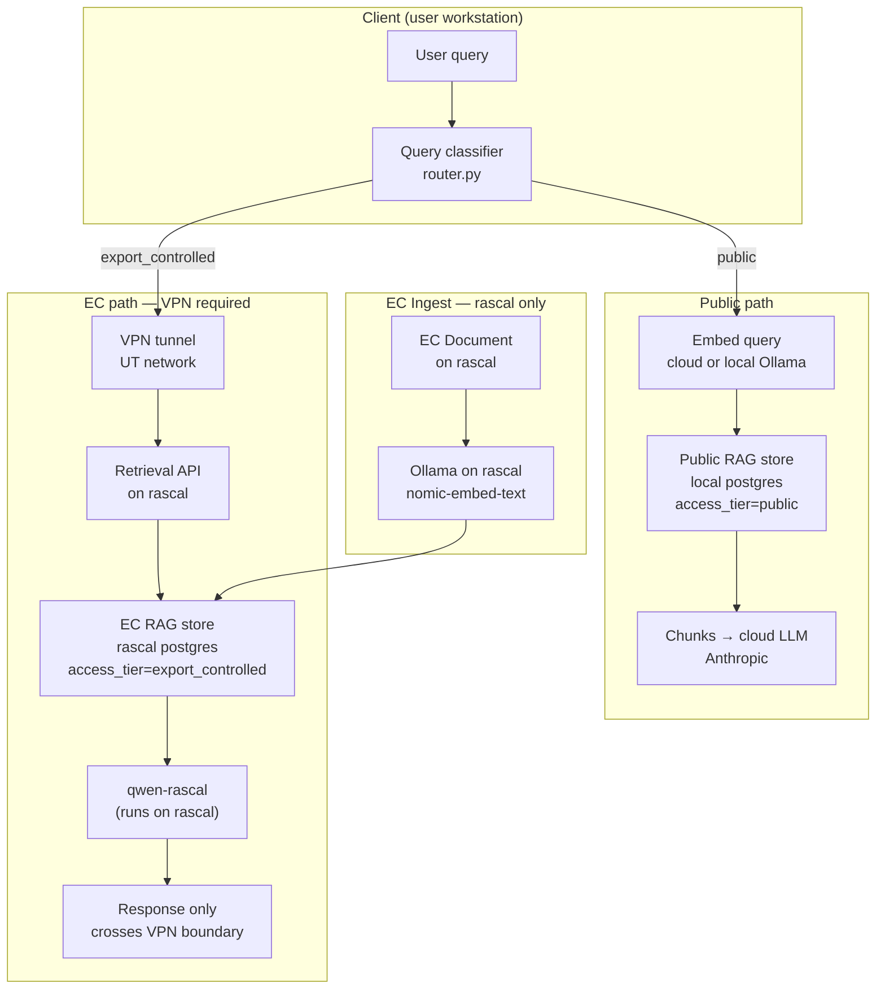

# NeutronOS RAG Architecture Spec

**Status:** Design approved — Phase 1 schema migration pending
**Owner:** Ben Booth
**Created:** 2026-03-12
**Last Updated:** 2026-03-13
**Related:** `neutron-os-model-routing-spec.md`, `prd_neutron-os-agents.md`

---

## 1. Problem Statement

NeutronOS has a working RAG store (`src/neutron_os/rag/`) using pgvector. It has
two unresolved architectural gaps that become critical as the platform grows:

**Gap 1 — Export control violation in the embedding pipeline.**
`embeddings.py` always calls the OpenAI cloud API. Content is transmitted to a
cloud endpoint *before* it ever reaches the retrieval stage. For export-controlled
documents (MCNP inputs, facility-specific procedures, licensed simulation materials),
this constitutes an unauthorized export of the content itself — not just the query.

**Gap 1b — Export-controlled files cannot be copied to a user's local machine.**
Under EAR and 10 CFR 810, the act of copying EC material off an authorized computing
environment is itself a transfer — even if the destination is a personal machine with
no external network access. EC documents must remain on authorized systems (e.g.,
rascal). Users access them via VPN/SSH; the content does not travel to the client.
This invalidates any architecture that proposes "local embedding" of EC files on
a user's workstation. EC ingest, embedding, and storage must all run on rascal.

**Gap 2 — No scope model.**
The store's `tier` column conflates two independent concerns: content sensitivity
(`public | export_controlled`) and content scope (`community | facility | personal`).
Without separating these, it's impossible to build the per-user personalization that
makes Neut irreplaceable in daily use.

---

## 2. Two-Dimensional Content Model

Every document in the RAG store has two independent attributes:

### 2.1 Access Tier (sensitivity axis)

| `access_tier` | Meaning | Embedding pipeline | Store location | Retrieval gate |
|---------------|---------|-------------------|----------------|----------------|
| `public` | Safe for cloud processing | Cloud (OpenAI, Anthropic) or local Ollama | Local postgres or cloud | Any authenticated user |
| `export_controlled` | EAR/10 CFR 810 regulated | Ollama **on rascal only** — never on client | **rascal postgres** (authorized env) | `export_controlled_access` role + VPN |

> **Compliance note:** EC material cannot be copied to a user's workstation under any
> circumstances. All EC ingest, embedding, and storage must execute on an authorized
> system (currently rascal). Retrieval is proxied via VPN; only the LLM-synthesized
> response crosses the boundary (via qwen-rascal, which also runs on rascal).

### 2.2 Scope (visibility axis)

| `scope` | Who can retrieve | Examples |
|---------|----------------|---------|
| `community` | Everyone (within their tier) | NRC regs, published papers, IAEA guides, reactor physics reference, neut docs |
| `facility` | Members of this facility | Facility procedures, local configs, facility meeting history |
| `personal` | Only the document owner | User notes, personal papers, individual session context |

### 2.3 The 2×3 Matrix

|  | `community` | `facility` | `personal` |
|--|------------|-----------|-----------|
| **`public`** | Shipped with Neut, curated nuclear knowledge base | Non-sensitive facility docs | User's public notes and papers |
| **`export_controlled`** | Licensed simulation docs (MCNP manuals, etc.) | EC facility procedures, sim configs | User's EC work files, run outputs |

---

## 2a. Three-Tier Corpus Architecture

The `scope` axis from §2.2 maps to three named corpora, each with a stable `corpus_id` used throughout the codebase and CLI:

| Corpus | `corpus_id` | `scope` | Content | Built when |
|--------|-------------|---------|---------|------------|
| Community | `rag-community` | `community` | Pre-indexed nuclear domain knowledge (~33k chunks); ships bundled with the pip package | `neut setup` step 5a (`neut rag load-community`) |
| Organization | `rag-org` | `facility` | Facility-specific docs; synced from rascal/S3 by admin | `neut rag sync org` |
| Personal | `rag-internal` | `personal` | User's workspace: `docs/`, `runtime/knowledge/`, Python docstrings (via AST) | `neut rag index .` during install + post-push |

All three corpora are queried together on every retrieval call. When the same content exists in multiple corpora, personal results take priority over org, org over community.

### Priority and Conflict Resolution

```
rag-internal  (personal)    → highest priority — user's own workspace
rag-org       (facility)    → overrides community on facility-specific topics
rag-community (community)   → baseline nuclear domain knowledge
```

Priority is implemented at result-merging time: when two chunks have near-identical content (cosine similarity > 0.97) and different `corpus_id` values, the higher-priority corpus's chunk is returned and the lower-priority duplicate is suppressed.

---

## 3. Architecture

Two physically separate stores are required by export control compliance — not just
a logical separation. EC material cannot exist on a user's workstation.



**Key invariants:**

1. **EC text never touches a cloud API** and **never leaves the authorized environment.**
   Under EAR/10 CFR 810, copying EC material to a client workstation is itself an
   unauthorized transfer. All EC ingest, embedding, storage, and retrieval happen on rascal.
2. **Two physical stores, same logical schema.** Both run pgvector with identical
   `access_tier`/`scope` columns. The public store is local; the EC store is on rascal.
   The client connects to each via different connection strings.
3. **Query embedding must match document embedding.** Public queries embed on cloud/local
   and search the local store. EC queries embed on rascal and search the rascal store.
4. **Only the synthesized response crosses the VPN boundary.** qwen-rascal runs on rascal;
   its text output returns to the client. Retrieved EC chunks are consumed server-side.
   Whether chunk text appears in the response is a facility policy decision (redaction scope).
5. **Personal EC content follows the same rule.** A user's EC work files must be indexed
   on rascal, not on their local machine, even if they authored the files.

---

## 4. Schema Evolution

### Current schema (existing)

```sql
-- chunks table has:
tier    TEXT NOT NULL DEFAULT 'institutional'   -- ambiguous; being repurposed
owner   TEXT                                    -- personal scope marker
```

### Target schema

```sql
ALTER TABLE chunks
    ADD COLUMN IF NOT EXISTS access_tier TEXT NOT NULL DEFAULT 'public',
    ADD COLUMN IF NOT EXISTS scope       TEXT NOT NULL DEFAULT 'community';

ALTER TABLE documents
    ADD COLUMN IF NOT EXISTS access_tier TEXT NOT NULL DEFAULT 'public',
    ADD COLUMN IF NOT EXISTS scope       TEXT NOT NULL DEFAULT 'community';

-- Migrate existing 'institutional' tier → 'public' access_tier, 'community' scope
UPDATE chunks SET access_tier = 'public', scope = 'community' WHERE tier = 'institutional';
UPDATE documents SET access_tier = 'public', scope = 'community' WHERE tier = 'institutional';

CREATE INDEX IF NOT EXISTS idx_chunks_access_tier ON chunks (access_tier);
CREATE INDEX IF NOT EXISTS idx_chunks_scope ON chunks (scope);
```

The legacy `tier` column is kept for a transition period, then dropped.

---

## 5. Embedding Provider Abstraction

`src/neutron_os/rag/embeddings.py` evolves from a single cloud function to a
provider-aware interface:

```python
def embed_texts(
    texts: list[str],
    access_tier: str = "public",          # routes to cloud or local
    model: str | None = None,             # override; None = use default for tier
) -> list[list[float]] | None:
    """Embed texts using the appropriate provider for the access tier.

    public           → cloud API (OpenAI text-embedding-3-small)
    export_controlled → local Ollama (nomic-embed-text or configured model)
    """
```

**EC embedding provider (Ollama on rascal):**
- Runs on rascal — the authorized computing environment, not the user's workstation
- Model: `nomic-embed-text` (768 dims) or `mxbai-embed-large` (1024 dims)
- The same Ollama instance used by `OllamaClassifier` for EC query classification
- Ingest pipeline for EC content runs as a server-side job on rascal (not a client CLI command)

**Compliance boundary:**
```
client workstation          UT VPN / rascal (authorized env)
──────────────────          ─────────────────────────────────────────────────
neut chat                   EC document files
query → router              Ollama (nomic-embed-text)
                            pgvector EC store
                  ←VPN←    qwen-rascal
synthesized response        (LLM runs here; response crosses VPN boundary)
```

**Dimension note:** EC store uses 768-dim vectors (Ollama); public store uses 1536-dim (OpenAI)
or 768-dim (local Ollama for public content). Stores are physically separate, so mixed
dimensions across stores are not a problem. Each store's index is internally consistent.

---

## 6. Community Corpus (`rag-community`)

The community corpus is the differentiator that makes onboarding immediately valuable.
It ships pre-indexed as a bundled artifact and is loaded during `neut setup`.

### 6.1 Content (v1 — ~33,000 chunks)

| Category | Documents | `access_tier` |
|----------|-----------|--------------|
| NRC regulations | 10 CFR Parts 50, 830 | `public` |
| DOE standards | DOE-STD-1066, DOE-STD-3009 | `public` |
| IAEA safety reports | Selected series | `public` |
| Simulation codes | MCNP6 user manual, SCALE overview, ORIGEN chain docs | `public` |
| V&V | ASME V&V 10 | `public` |
| Neut documentation | All of `docs/` in this repo | `public` |

No export-controlled content is included in the bundled community corpus. Licensed code manuals (MCNP with LANL license, etc.) are facility-provided and indexed separately into `rag-org`.

### 6.2 Distribution

The community corpus ships as a compressed PostgreSQL dump bundled inside the pip package:

```
src/neutron_os/data/rag/community-v1.pgdump.gz
```

The dump contains the `rag_community` schema with pre-embedded vectors. Loading it does not require re-embedding — the dump restores directly into the local PostgreSQL instance.

```bash
neut rag load-community          # decompress + pg_restore into rag_community schema (~30s)
```

This command is called automatically during `neut setup` step 5a. It is safe to re-run; on re-load the old schema is renamed to `rag_community_prev` before the new load (enabling one-version rollback).

### 6.3 Versioning and Upgrade

The community corpus is versioned with Neut releases. `neut update` checks whether the installed corpus version matches the package version and loads a newer dump if available.

Upgrade path:

```sql
-- Before loading new community dump:
ALTER SCHEMA rag_community RENAME TO rag_community_prev;
-- pg_restore into new rag_community schema
-- After validation:
DROP SCHEMA rag_community_prev CASCADE;   -- manual cleanup after confirming upgrade
```

One previous version is retained to allow rollback. Two-version-old schemas are dropped automatically on the next upgrade.

### 6.4 Deployment Roadmap

The bundled pgdump approach (v1) supersedes the earlier rascal rsync strategy. Future phases add delta sync and CDN delivery but maintain the same `neut rag load-community` interface.

| Phase | Mechanism | Notes |
|-------|-----------|-------|
| **v1 — bundled pgdump** | Ships in pip package; `neut rag load-community` | ~30s restore, no network needed |
| **v2 — rascal snapshot** | Manual `rsync` + `neut rag index` for non-bundled content | VPN required |
| **v3 — S3** | `neut rag sync community` auto-downloads versioned artifact | AWS approval pending |
| **v4 — CDN** | Hosted artifact, delta sync, checksummed | Long-term |

### 6.5 Out-of-Box Experience

First `neut chat` after install:
```
Community knowledge base loaded (33,000 chunks)
   Topics: NRC regs, DOE standards, IAEA reports, MCNP6, SCALE, Neut docs
   Org knowledge: not configured (run: neut rag sync org)
   Personal knowledge: not indexed (run: neut rag index . to add your workspace)
```

---

## 6b. Organization Corpus (`rag-org`)

The org corpus contains facility-specific documents maintained by an admin. It maps to `scope = 'facility'` and is visible to all authenticated members of the facility.

**Content:** Facility procedures, local configurations, licensed code manuals, facility meeting history, site-specific regulatory correspondence.

**Sync sources (roadmap):**

| Phase | Mechanism |
|-------|-----------|
| v1 | Manual: `neut rag sync org --source rascal` — rsync from rascal mountpoint |
| v3 | `neut rag sync org --source s3` — S3 bucket configured by admin |
| v4 | CDN-hosted org snapshot with delta sync |

```bash
neut rag sync org                # pull latest org corpus snapshot (source from config)
neut rag sync org --source rascal:/neut/org-rag/  # explicit source override
```

Admin configures the org sync source in `runtime/config/secrets.toml`:
```toml
[rag.org]
sync_source = "rascal:/neut/org-rag/"   # or s3://bucket/path/
```

The org corpus is indexed into `rag_org` schema in the local PostgreSQL instance for public-access_tier content, and into the rascal PostgreSQL instance for export-controlled facility documents.

---

## 7. Personal RAG (Onboarding Augmentation)

During `neut config` (setup wizard), the user is offered:

```
Would you like Neut to index your documents for personalized retrieval?
Neut will index public documents you specify — your notes, papers, non-sensitive files.

  Public documents (notes, papers, non-sensitive files):
    Indexed locally on this machine. Never sent to cloud APIs.

  Export-controlled documents (MCNP inputs, sim configs, licensed materials):
    Must remain on authorized systems (rascal/VPN environment).
    Indexing runs server-side via `neut rag index --remote`.
    You access them only while connected to UT VPN.

  [Y] Yes, index my public documents now
  [e] Set up EC indexing on rascal (requires VPN)
  [n] Skip for now
```

### 7.1 Compliance Boundary for Personal RAG

EC files created or used by an individual must still stay in the authorized environment.
If a user has MCNP input files on their workstation, they are in violation of handling
requirements — that's a facility policy issue, not a Neut design issue. Neut will not
offer to index files on the local machine as export-controlled. Instead:

```
User: "I have MCNP inputs I want to index"
Neut: "EC files must be indexed from an authorized environment.
       Copy them to rascal first, then run: neut rag index --remote <path>"
```

### 7.2 Ingest Commands

```bash
# Public personal documents (indexed locally)
neut rag index ./my-notes/                          # auto-classify; public only
neut rag index ./facility-procedures/ --scope facility  # facility-wide visibility

# EC documents (indexed on rascal via VPN)
neut rag index --remote rascal:/home/user/mcnp-inputs/  # runs server-side on rascal
neut rag index --remote rascal:/home/user/sim-configs/ --tier export_controlled

neut rag status                                     # show index stats (both stores)
neut rag list                                       # list indexed documents
neut rag remove ./old-notes/                        # remove from public index
```

### 7.2 Auto-Classification During Ingest

When `--tier` is not specified, the export control router classifies each document
before embedding:

```python
# ingest.py
tier = router.classify(content[:2000]).tier.value  # sample first 2000 chars
embeddings = embed_texts(chunks, access_tier=tier)
```

User is shown what was classified and may override before committing.

### 7.3 Personal Corpus Sources (Implemented)

The personal corpus (`rag-internal`) is built automatically from four source types.
All ingest is **fully asynchronous** — no blocking in the prompt/response chain.

| Source | Path | Trigger | `source_type` |
|--------|------|---------|--------------|
| Chat session transcripts | `runtime/sessions/*.json` | After every chat turn (daemon thread) | `session` |
| Processed sense signals | `runtime/inbox/processed/*.json` | `neut rag index` / watch | `signal` |
| Git commit logs | `.git` repos under `runtime/knowledge/` | `neut rag index` / watch | `git-log` |
| Daily notes | `runtime/knowledge/notes/YYYY-MM-DD.md` | `neut note "..."` (immediate, background) | `markdown` |

**Session indexing** — `ChatAgent._schedule_session_index()` spawns a `daemon=True`
thread after each completed turn. Checksum deduplication means unchanged turns cost
nothing on re-runs. Sessions with fewer than 3 turns are skipped as noise.

**Watch mode** — `neut rag watch` runs a `watchdog` filesystem observer across
`docs/`, `runtime/knowledge/`, `runtime/sessions/`, and `runtime/inbox/processed/`.
Events are debounced (2 s window) to handle editor temp-file swaps.

**Notes** — `neut note "thought"` appends a timestamped entry to the daily markdown
file and triggers background re-indexing. `neut note` (bare) opens `$EDITOR`.

**Low-confidence hint** — when the best `combined_score < 0.15`, the system prompt
appends: `[Low RAG confidence — run neut rag index or neut note to add more context]`

**Implementation** — `src/neutron_os/rag/personal.py` contains `ingest_sessions()`,
`ingest_signals()`, `ingest_git_logs()`. `ingest_repo()` calls all three when
`personal=True` (default for `rag-internal`; set `False` for community/org corpora).

### 7.4 Corpus Lifecycle — M-O Stewardship

The personal corpus grows without bound unless actively managed. M-O owns corpus
health as a scheduled stewardship task, analogous to how it manages `archive/` and
`spikes/`.

**M-O responsibilities:**

| Task | Schedule | Command |
|------|----------|---------|
| Nightly incremental index | Daily, off-hours | `neut rag index` (checksum-skipping, fast) |
| Session pruning | Weekly | Delete `sessions/` corpus entries older than N days (configurable `rag.session_ttl_days`) |
| Corpus health check | On `neut status` | Detect source/index drift; report stale document count |
| Watch daemon supervision | On login | Start `neut rag watch`; restart on crash (launchd/systemd) |
| Index size reporting | On `neut status` | Surface chunk counts without requiring `neut rag status` |

**Watch daemon installation** — during `neut config`, M-O generates and installs:
- **macOS**: `~/Library/LaunchAgents/io.neutronos.rag-watch.plist` (launchd)
- **Linux**: `~/.config/systemd/user/neutron-os-rag-watch.service` (systemd user unit)

Both supervise `neut rag watch --quiet` and restart on exit.

**Session TTL** — configurable via:
```bash
neut settings set rag.session_ttl_days 90   # default: 90
```
M-O's weekly sweep calls `store.delete_corpus_older_than(CORPUS_INTERNAL, days=ttl)`
(to be implemented in `rag/store.py`).

*Cross-reference: `neutron-os-agent-architecture.md` §M-O Corpus Stewardship*

### 7.5 What Makes Neut Irreplaceable

The personal RAG compounds over time. After 6 months of use:
- Every meeting the user attended is indexed and retrievable
- Every document they ingested is searchable
- Every chat session is retrospectively searchable
- Community content is always fresh (auto-updated)
- Facility context (procedures, configs) is mixed in automatically

A query like "what's the last time we discussed xenon poisoning in a meeting?" or
"find me the relevant NRC reg for this operating limit" works across all three scopes
simultaneously, filtered by what the user is authorized to see.

---

## 7b. `neut rag` CLI Reference

All RAG operations go through the `neut rag` noun. Commands that write to the database require a configured `rag.database_url`.

```bash
# ─── Corpus loading ───────────────────────────────────────────────
neut rag load-community          # decompress + pg_restore bundled community dump (~30s)
                                 # called automatically by neut setup step 5a

neut rag sync org                # pull org corpus snapshot (source from config)
neut rag sync org --source <url> # explicit source: rascal:/path or s3://bucket/path

# ─── Personal corpus ──────────────────────────────────────────────
neut rag index [path]            # index path into rag-internal; includes sessions,
                                 # signals, git logs, and notes automatically
neut rag index --remote <path>   # server-side index for EC content on rascal
neut rag watch                   # foreground watcher: re-indexes changed files live
                                 # (M-O installs this as a launchd/systemd daemon)

# ─── Notes (personal knowledge capture) ────────────────────────────
neut note "quick thought"        # append timestamped note to today's daily file,
                                 # index in background (zero prompt-chain impact)
neut note                        # open $EDITOR for longer note, then index
neut note --list                 # show recent daily note files

# ─── Search and inspection ────────────────────────────────────────
neut rag search <query>          # hybrid search across all three corpora
neut rag status                  # chunk counts per corpus (rag-community / rag-org / rag-internal)
neut rag list                    # list indexed documents with corpus, scope, tier
neut rag remove <path>           # remove path from rag-internal index

# ─── Maintenance (M-O scheduled) ──────────────────────────────────
neut rag reindex                 # clear corpus and rebuild from all sources
neut rag reindex --corpus rag-internal --model <model>  # re-embed with new model
```

`neut rag status` output example:

```
corpus          scope       chunks   last_updated
rag-community   community   33,241   2026-03-10 (v1.2.0)
rag-org         facility     4,108   2026-03-11
rag-internal    personal     1,834   2026-03-13
```

---

## 8. Export Control Compliance Requirements

> This section captures compliance constraints that MUST be enforced by design.
> These are not aspirational — they are hard architectural requirements.

### 8.1 What the Regulations Require

| Regulation | Requirement | Neut implication |
|------------|-------------|-----------------|
| EAR (15 CFR 730-774) | Controlled technology may not be released to unauthorized persons or locations | EC documents cannot be copied to a user's workstation; cannot transit cloud APIs |
| 10 CFR 810 | Unclassified nuclear technology requires DOE authorization for transfer | Same as EAR for nuclear-specific codes (MCNP, ORIGEN, etc.) |
| Facility license | Facility-specific SLAs with LANL/ORNL/etc. for licensed code manuals | Manuals must stay in controlled environment per license terms |

### 8.2 Prohibited Operations (by design)

The following operations MUST be prevented by the architecture — not just policy:

| Operation | Why prohibited | Design control |
|-----------|----------------|----------------|
| `neut rag index ./mcnp-inputs/` (local) | Copies EC file content to local postgres | Router classifies → `--remote` flag required for EC |
| Sending EC chunk text to cloud LLM | Transmits EC content to unauthorized service | EC queries only reach qwen-rascal on VPN |
| Downloading EC chunks to display in terminal | Retrieved EC text on client workstation | Facility policy decision; Neut default: display only LLM-synthesized response |
| EC embedding via OpenAI API | Transmits EC content to cloud | EC embedding runs on rascal Ollama only |

### 8.3 Authorized EC Data Flow

```
1. EC document exists on rascal (authorized env)
2. Ingest job runs on rascal: classify → embed (Ollama on rascal) → store (rascal postgres)
3. User connects via UT VPN
4. User query classified as EC by router.py
5. Query embedding computed on rascal (via retrieval API)
6. Similarity search on rascal postgres
7. Top chunks fed to qwen-rascal (on rascal)
8. qwen-rascal generates response — only response crosses VPN
9. Response displayed to user
```

### 8.4 Open Policy Questions (facility must decide)

These require facility radiation protection / export control officer input:

1. **Are retrieved EC chunk texts considered a controlled transfer?**
   If yes: only synthesized LLM responses may cross the VPN (default Neut behavior).
   If no: raw chunk text may be returned to the client for display (more useful, riskier).

2. **Does the classification of the synthesized response need to be marked?**
   If the LLM synthesizes a response that substantially reproduces EC content, does
   that response inherit an EC classification? Current approach: mark responses from
   the EC retrieval path with `[Export-Controlled Environment]` prefix.

3. **Can researchers index their EC work files from rascal home directories?**
   Yes — they're already in the authorized environment. `neut rag index --remote` triggers
   a server-side job. Authentication is via existing SSH key / rascal credentials.

### 8.5 Prompt Injection Defense

RAG-augmented systems are vulnerable to prompt injection via malicious content in indexed
documents. For EC RAG, this is also an exfiltration vector — a poisoned document on rascal
could instruct the LLM to reproduce controlled content in its response.

Defense layers:
1. **Chunk sanitization** — strip known injection patterns before LLM injection (server-side on rascal)
2. **System prompt hardening** — explicit instructions in qwen-rascal system prompt prohibiting instruction-following from retrieved content
3. **Response scanning** — scan qwen-rascal output for EC keyword matches before returning to client
4. **Audit log** — every EC session logs query hash, response hash, chunk source paths (no plaintext)

Full threat model, attack vectors, and implementation detail:
*Cross-reference: `neutron-os-model-routing-spec.md` §8 (Prompt Injection & EC Exfiltration Defense)*

---

## 9. Retrieval Query Design

The client queries two separate stores depending on routing tier:

```python
# Public store — local postgres, direct connection
public_store = RAGStore(settings.get("rag.database_url"))

# EC store — rascal postgres, VPN required
ec_store = RAGStore(settings.get("rag.ec_database_url"))  # e.g., postgresql://rascal:5432/neutron_os_ec
```

```python
def search(
    query_embedding: list[float] | None,
    query_text: str,
    access_tiers: list[str],          # from user auth: ["public"] or ["public", "export_controlled"]
    scopes: list[str] = ("community", "facility", "personal"),
    owner: str | None = None,         # user ID for personal scope filtering
    limit: int = 10,
) -> list[SearchResult]:
```

The WHERE clause (same SQL, different physical store):
```sql
WHERE access_tier = ANY(%(access_tiers)s)
  AND (
      scope = 'community'
      OR scope = 'facility'
      OR (scope = 'personal' AND owner = %(owner)s)
  )
```

Personal scope chunks are only returned when `owner` matches — no cross-user leakage.

`corpus_id` to `scope` mapping for the three-tier architecture:

| `corpus_id` | `scope` value in WHERE | Writable via |
|-------------|----------------------|--------------|
| `rag-community` | `'community'` | `neut rag load-community` only (read-only at query time) |
| `rag-org` | `'facility'` | `neut rag sync org` (admin) |
| `rag-internal` | `'personal'` | `neut rag index` (user) |

`rag-community` is a read-only corpus at query time. No user-facing `neut rag index` command writes to `scope = 'community'`. Community corpus updates come exclusively from `load-community` (which restores a versioned dump).

Add `rag.ec_database_url` to settings defaults (empty = EC RAG disabled):
```
neut settings set rag.ec_database_url "postgresql://rascal.utexas.edu:5432/neutron_os_ec"
```

---

## 10. Model-Agnostic Embedding

Embedding providers are declared in `models.toml` using the same provider pattern as
chat models, with `use_for = ["embedding"]`. The gateway selects the right provider
by task + routing tier — no code changes needed when switching embedding models.

```toml
[[gateway.providers]]
name         = "openai-embed"
endpoint     = "https://api.openai.com/v1"
model        = "text-embedding-3-small"
api_key_env  = "OPENAI_API_KEY"
use_for      = ["embedding"]
routing_tier = "public"
dims         = 1536

[[gateway.providers]]
name         = "nomic-local"
endpoint     = "http://localhost:11434"   # Ollama
model        = "nomic-embed-text"
use_for      = ["embedding"]
routing_tier = "export_controlled"        # used for EC content only
dims         = 768
```

`embed_texts(texts, access_tier)` calls `gateway._select_provider("embedding", access_tier)`,
so swapping the embedding model is a `models.toml` change — no Python changes needed.

### 9.1 The Dimension Problem

Vector dimensions are fixed at index time. Mixing providers (e.g., 1536-dim public +
768-dim EC) means cross-tier similarity search is not meaningful — which is correct
behavior (EC queries should not retrieve public-embedded chunks with an EC query vector).

**Per-chunk dimension tracking:**

```sql
ALTER TABLE chunks ADD COLUMN embedding_model TEXT;   -- e.g., "text-embedding-3-small"
ALTER TABLE chunks ADD COLUMN embedding_dims  INT;    -- e.g., 1536
```

Query embedding must use the same `embedding_model` as the chunks being searched.
The retrieval layer reads the active embedding provider for the target `access_tier`
and embeds the query with the matching model.

**Re-indexing on model change:**

```bash
neut rag reindex --tier public --model text-embedding-3-large   # upgrade public embeddings
neut rag reindex --tier export_controlled                       # re-embed EC with current model
```

Only the `embedding` column changes; chunk text and metadata are preserved.

---

## 11. Intersection with Auth & Export Control Routing

The RAG access tier, LLM routing tier, and physical store location must all be consistent.
An EC query must use the rascal LLM *and* the rascal RAG store — neither can be substituted
without breaking the compliance boundary.

| User auth state | LLM routing | RAG retrieval | Physical store |
|-----------------|------------|---------------|----------------|
| No `export_controlled` role | `public` providers only | `access_tier = public` only | Local postgres |
| Has role, VPN connected | Both tiers | Both tiers | Local (public) + rascal (EC) |
| Has role, VPN down | Public only + warning | Public only + warning | Local postgres only |

When a query routes to qwen-rascal (EC tier), the RAG retrieval searches `rag.ec_database_url`
(rascal postgres), not the local store. The query embedding is also computed on rascal.
The entire EC retrieval + generation loop stays server-side.

*Cross-reference: `neutron-os-model-routing-spec.md` §7 (Auth intersection).*

---

## 12. Implementation Phases

### Phase 1 — Schema + Embedding Fork (next)

| Item | File | Status |
|------|------|--------|
| Add `access_tier` + `scope` columns to schema | `rag/store.py` | 🔲 |
| Migrate `tier='institutional'` → `access_tier='public', scope='community'` | `rag/store.py` | 🔲 |
| Embed provider abstraction (`access_tier` param) | `rag/embeddings.py` | 🔲 |
| Local embedding via Ollama (nomic-embed-text) | `rag/embeddings.py` | 🔲 |
| Ingest auto-classification using `router.py` | `rag/ingest.py` | 🔲 |
| Retrieval scope + tier filtering | `rag/store.py` | 🔲 |
| `neut rag index` / `neut rag status` CLI | `rag/cli.py` | 🔲 |

### Phase 2 — Community RAG + Onboarding

| Item | Notes |
|------|-------|
| Community knowledge base curation | NRC, DOE, IAEA public docs |
| `neut rag sync community` command | Download + index versioned community content |
| Wizard onboarding integration | Prompt user to index personal docs during `neut config` |
| EC community content | MCNP manuals (facility provides license; we provide ingest) |

### Phase 3 — Personal RAG Compounding

| Item | Notes | Status |
|------|-------|--------|
| Session history auto-indexing | `_schedule_session_index()` daemon thread after each turn | ✅ |
| Sense pipeline integration | `runtime/inbox/processed/` → `rag-internal` via `ingest_signals()` | ✅ |
| Git commit log indexing | Repos under `runtime/knowledge/` via `ingest_git_logs()` | ✅ |
| Daily notes (`neut note`) | Timestamped daily markdown, immediate background index | ✅ |
| Filesystem watch (`neut rag watch`) | `watchdog` observer, 2 s debounce, M-O daemon supervised | ✅ |
| M-O corpus lifecycle stewardship | Nightly index, session pruning, watch daemon install | 🔲 |
| Session TTL pruning | `store.delete_corpus_older_than()` + `rag.session_ttl_days` setting | 🔲 |
| Community RAG promotion pipeline | Personal → community with PII scrubbing + EC gating | 🔲 |
| Cross-scope relevance tuning | Weight community vs facility vs personal results | 🔲 |

---

## 13. promptfoo Eval Harness

NeutronOS uses [promptfoo](https://promptfoo.dev) (MIT open-source) to evaluate RAG quality.
Configs live in `tests/promptfoo/`.

> **Note:** OpenAI acquired promptfoo on 2026-03-09. The MIT-licensed core continues and
> is what we use. Monitor for vendor lock-in; if necessary, fork or migrate.

### 12.1 Files

| File | Purpose |
|------|---------|
| `tests/promptfoo/promptfooconfig.yaml` | Chat agent quality + hallucination tests |
| `tests/promptfoo/rag-evals.yaml` | RAG retrieval relevance + grounding tests |
| `tests/promptfoo/redteam-export-control.yaml` | Adversarial EC safety sweep |
| `tests/promptfoo/rag_provider.py` | Python provider: calls `RAGStore.search()` → injects `{{RAG_CONTEXT}}` |

### 12.2 RAG Python Provider

`rag_provider.py` is a promptfoo Python provider that:
1. Accepts a `query` from test `vars`
2. Calls `RAGStore.search()` with appropriate `tier` and `scope`
3. Returns the retrieved chunks as `{{RAG_CONTEXT}}`
4. The downstream LLM provider uses `{{RAG_CONTEXT}}` in its system prompt

This lets promptfoo evaluate whether the LLM answer is grounded in *actually retrieved* content,
not just parametric knowledge.

### 12.3 Running Evals

```bash
cd tests/promptfoo

# Chat quality tests (uses Ollama judge — no API cost)
npx promptfoo eval -c promptfooconfig.yaml

# RAG retrieval + grounding tests (requires running PostgreSQL + RAG indexed)
npx promptfoo eval -c rag-evals.yaml

# Adversarial EC safety sweep (generates attack variants, tests refusals)
npx promptfoo redteam run -c redteam-export-control.yaml

# View results dashboard
npx promptfoo view
```

### 12.4 CI Integration

Add to the pre-push hook or CI pipeline:
```bash
# Fast chat quality check (Ollama judge, no API cost, ~60s)
npx promptfoo eval -c tests/promptfoo/promptfooconfig.yaml --ci
```

promptfoo returns exit code 1 if any assertions fail — compatible with standard CI gates.
Use `--cache` to avoid re-running identical prompts in repeated CI runs.
