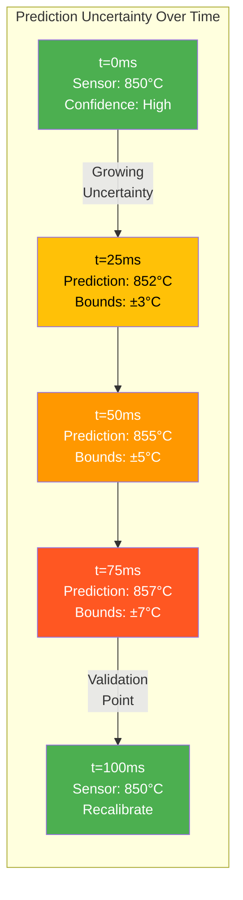
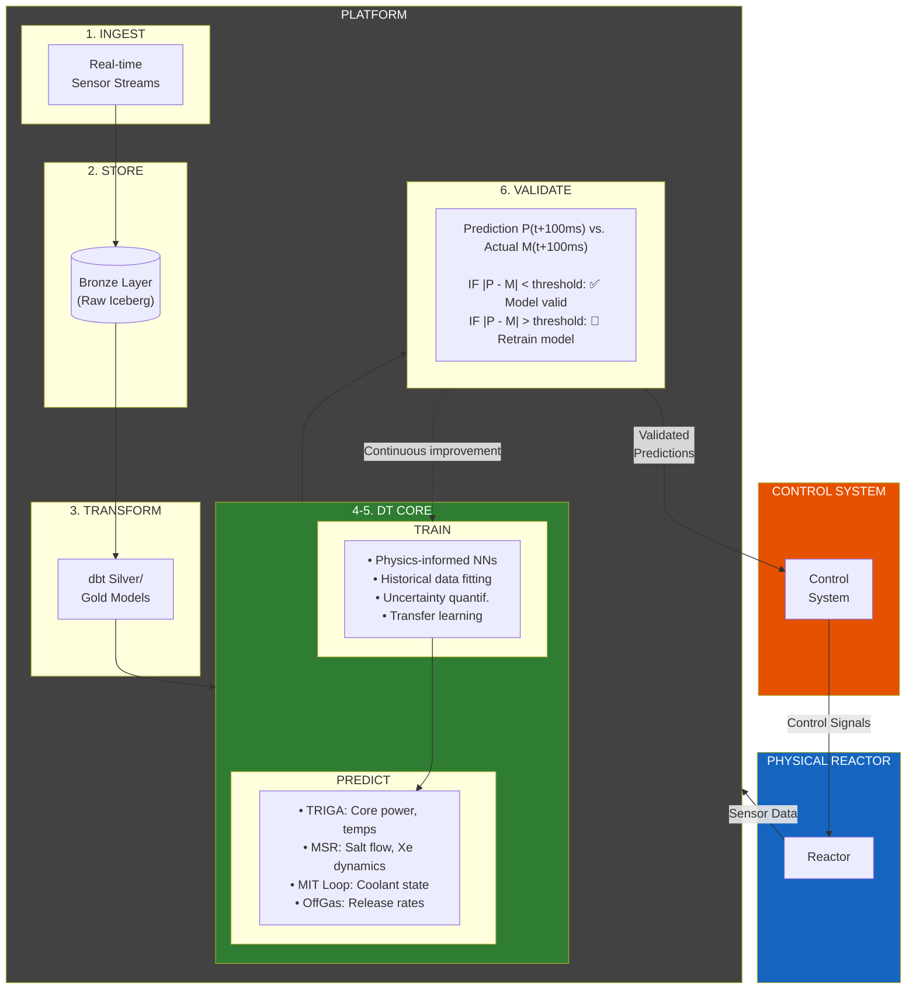
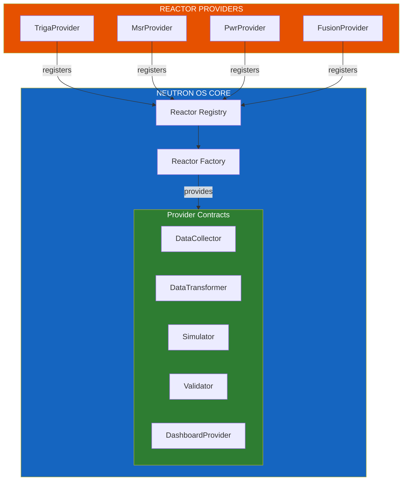

# Digital Twin Architecture Specification

**Part of:** [Neutron OS Master Tech Spec](spec-executive.md)

---

> **Scope:** This document specifies the digital twin simulation architecture, including real-time state estimation, reactor provider interfaces, extension points, and the WASM surrogate runtime.

| Property | Value |
|----------|-------|
| Version | 0.1 |
| Last Updated | 2026-01-27 |
| Status | Draft |
| Related ADRs | [ADR-008: WASM Extension Runtime](../adr/008-wasm-extension-runtime.md) |

---

## Table of Contents

1. [Overview](#1-overview)
2. [Real-Time State Estimation](#2-real-time-state-estimation)
3. [Closed-Loop Architecture](#3-closed-loop-architecture)
4. [Per-Project Specifications](#4-per-project-specifications)
5. [Prediction Limitations](#5-prediction-limitations)
6. [Reactor Provider Interface](#6-reactor-provider-interface)
7. [Reactor Onboarding](#7-reactor-onboarding)
8. [Extension Points](#8-extension-points)
9. [WASM Surrogate Runtime](#9-wasm-surrogate-runtime)

---

## 1. Overview

Digital twins serve **multiple purposes** in Neutron OS:
- Real-time state estimation
- Fuel management
- Predictive maintenance
- Experiment planning
- Research validation

This document focuses on the **real-time simulation architecture**—a technically demanding use case—but the same data infrastructure supports all five categories.

---

## 2. Real-Time State Estimation

### 2.1 The Core Challenge

The fundamental problem is **sensor latency** (~100ms round-trip) versus **transient timescales** (<50ms). Digital twins fill this temporal gap with predictions, enabling tighter operational margins—but with important caveats:

| Aspect | Sensor-Only Operations | DT-Augmented Operations |
|--------|------------------------|-------------------------|
| **State visibility** | Discrete measurements every ~100ms | Continuous estimates every ~10ms |
| **Inter-sample state** | Unknown | Estimated with uncertainty bounds |
| **Safety margins** | Conservative (account for unknowns) | Tighter (bounded uncertainty) |
| **Operational capacity** | Limited by uncertainty | Closer to optimal |
| **Key caveat** | Ground truth | Predictions are *estimates*, not measurements |

**Critical limitations:**
- Surrogate models trade fidelity for speed—they are approximations
- Uncertainty grows between sensor readings
- Novel scenarios outside training data may produce unreliable predictions
- Achieving trustworthy accuracy bounds is an active research area

### 2.2 Uncertainty Growth Between Sensor Readings

Predictions fill the temporal gap between sensor readings, but **uncertainty grows** the further we extrapolate:



**Key Insight:** We trade UNKNOWN state for ESTIMATED state with quantified uncertainty. This is better than nothing, but it's not the same as knowing.

---

## 3. Closed-Loop Architecture



> **Ultimate Vision:** AI-assisted control decisions feed validated predictions back to the reactor control system, enabling tighter operational margins with quantified uncertainty.

### 3.1 Data Flow for Digital Twins

| Data Flow | Source | Destination | Latency Requirement | Purpose |
|-----------|--------|-------------|---------------------|---------|
| **Sensor Ingest** | Physical sensors | Bronze layer | <10ms | Raw state capture |
| **Feature Engineering** | Bronze/Silver | ML Pipeline | <100ms | Model inputs |
| **Model Inference** | Trained models | DT Simulation | <10ms | State prediction |
| **Validation Comparison** | Prediction + Actual | Validation engine | <200ms | Model accuracy check |
| **Dashboard Updates** | Gold layer | Superset | <1s | Human visibility |
| **Control Signals** | Validated predictions | Control system | <50ms | Closed-loop actuation |

---

## 4. Per-Project Specifications

| Digital Twin | Primary Physics | ML Model Type | Prediction Target | Current Status |
|--------------|-----------------|---------------|-------------------|----------------|
| **TRIGA DT** | Point kinetics, thermal hydraulics | Physics-informed NN | Core power, fuel temps | Active development |
| **MSR DT** | Multi-physics neutronics + TH | Surrogate models | Salt temp, Xe-135 conc | Research phase |
| **MIT Loop DT** | Coolant flow, heat transfer | Reduced-order models | Coolant state, HX perf | Active development |
| **OffGas DT** | Noble gas transport | Empirical + ML hybrid | Release rates | Planning phase |

### 4.1 Implementation Roadmap

| Phase | Milestone | Data Requirements | DT Integration | Target |
|-------|-----------|-------------------|----------------|--------|
| **Phase 1** | Historical model training | Bronze/Silver layers populated | Batch training on historical data | Q1 2026 |
| **Phase 2** | Near-real-time prediction | Streaming ingest, <10s latency | Models run on recent data | Q2 2026 |
| **Phase 3** | Real-time prediction | Streaming ingest, <100ms latency | Continuous state estimation | Q4 2026 |
| **Phase 4** | Validated predictions | Automated prediction vs. actual comparison | Confidence-scored outputs | Q2 2027 |
| **Phase 5** | Operator advisory | Dashboard alerts from predictions | Human-in-loop decisions | Q4 2027 |
| **Phase 6** | Closed-loop control | Ultra-low latency, <50ms | Predictions drive actuation | TBD |

> ⚠️ **Note:** Phase 6 (closed-loop control) requires extensive regulatory approval and is a long-term research goal.

---

## 5. Prediction Limitations

### 5.1 Why Surrogates Are Approximate

High-fidelity physics codes (MCNP, MPACT, Nek5000) can take minutes to days per simulation. Real-time prediction requires ~10ms response. We achieve this through surrogate models that approximate the full physics.

| Approach | Runtime | Fidelity | Use Case |
|----------|---------|----------|----------|
| Full Monte Carlo (MCNP) | Hours–days | Highest | Offline analysis, benchmarking |
| Deterministic neutronics (MPACT) | Minutes–hours | High | Design studies, training data generation |
| **Surrogate/ROM** | **~10ms** | **Lower** | **Real-time prediction** |

### 5.2 Uncertainty Quantification

When we say a prediction has "uncertainty bounds," we mean:
- **Point estimate**: "Power is ~850 kW"
- **With UQ**: "Power is 850 kW ± 15 kW (95% confidence)"

The bounds tell operators how much to trust the prediction.

### 5.3 Known Failure Modes

| Scenario | Risk | Mitigation |
|----------|------|------------|
| **Out-of-distribution** | Novel operating conditions not seen in training | Conservative bounds; flag for human review |
| **Model drift** | Physics changes (burnup, aging) invalidate trained model | Continuous validation; scheduled retraining |
| **Transient extrapolation** | Rapid changes exceed model assumptions | Widen bounds during transients |

---

## 6. Reactor Provider Interface

### 6.1 Design Philosophy: Factory/Provider Pattern

Neutron OS uses a **factory/provider pattern** that allows reactor providers to register their implementations at runtime:



**Key Benefits:**
- **Decoupling:** Core platform knows nothing about specific reactor physics
- **Extensibility:** New reactor types added without modifying core code
- **Testing:** Mock implementations for unit testing
- **Versioning:** Multiple versions of same reactor type can coexist

### 6.2 Core Interface Definitions

Each reactor provider must implement these interfaces:

```python
# neutron_core/interfaces.py

class DataCollector(ABC):
    """Interface for collecting reactor data."""
    def get_metadata(self) -> ReactorMetadata: ...
    def get_sensor_manifest(self) -> List[Dict]: ...
    def collect_readings(self) -> List[SensorReading]: ...
    def get_historical_readings(self, start, end, sensors) -> List[SensorReading]: ...

class DataTransformer(ABC):
    """Interface for reactor-specific data transformations."""
    def to_bronze_schema(self, readings) -> Dict: ...
    def to_silver_schema(self, bronze_data) -> Dict: ...
    def to_state_vector(self, silver_data) -> StateVector: ...
    def get_dbt_models(self) -> List[str]: ...

class Simulator(ABC):
    """Interface for digital twin simulation/prediction."""
    def get_model_info(self) -> Dict: ...
    def predict(self, current_state, horizon_ms) -> PredictionResult: ...
    def train(self, training_data, validation_split) -> Dict: ...

class Validator(ABC):
    """Interface for validating predictions against measurements."""
    def validate(self, prediction, actual) -> ValidationResult: ...
    def should_retrain(self) -> bool: ...

class DashboardProvider(ABC):
    """Interface for reactor-specific dashboard components."""
    def get_superset_datasets(self) -> List[Dict]: ...
    def get_superset_charts(self) -> List[Dict]: ...
    def get_superset_dashboards(self) -> List[Dict]: ...
```

> **Full Interface Definitions:** These interfaces are not yet implemented. When built, they will live in `src/neutron_os/infra/` or a dedicated `neutron_core` package.

### 6.3 Touch Points

Every reactor provider must provide:

| Touch Point | Interface | Required |
|-------------|-----------|----------|
| **Data Collection** | `DataCollector` | ✅ Yes |
| **Schema Transforms** | `DataTransformer` | ✅ Yes |
| **State Estimation** | `Simulator` | ⚠️ If DT enabled |
| **Model Validation** | `Validator` | ⚠️ If DT enabled |
| **Dashboards** | `DashboardProvider` | ✅ Yes |
| **Avro Schemas** | Files | ✅ Yes |
| **dbt Models** | SQL files | ✅ Yes |

---

## 7. Reactor Onboarding

### 7.1 Configuration Domains

| Domain | What It Defines | Examples |
|--------|-----------------|----------|
| **Reactor Identity** | Type, facility, license class | TRIGA Mark II, 1.1 MW |
| **Sensor Schema** | Channel names, units, sampling rates | `fuel_temp_1` (°C) |
| **Data Ingest** | Source type, connection params | Serial over TCP, OPC-UA |
| **Physics Models** | Applicable simulators, surrogate paths | RELAP, ONNX surrogate |
| **Alarm Thresholds** | Safety limits, warning bands | Fuel temp < 400°C |
| **Dashboard Templates** | Which visualizations apply | Core map, rod positions |
| **Compliance Rules** | Regulatory regime | NRC Part 50 vs Part 70 |

### 7.2 Configuration Storage

Configuration is stored in layers:

```
defaults/              ← Shipped with Neutron OS
  reactor_types/
    triga.yaml         ← Base TRIGA configuration
    msr.yaml
    pwr.yaml
    
facilities/            ← Facility-specific overrides  
  ut_netl/
    config.yaml
    sensors.yaml
    
instances/             ← Per-reactor-instance config
  netl_triga_001/
    config.yaml
```

---

## 8. Extension Points

### 8.1 Extension Point Catalog

| Factory | Provider Interface | Purpose | Example Providers |
|---------|-------------------|---------|-------------------|
| **ReactorFactory** | `ReactorProvider` | Reactor-type DT logic | TRIGA, MSR, PWR, Fusion |
| **IngestFactory** | `IngestProvider` | Data source adapters | OPC-UA, PI Historian, CSV |
| **SimulatorFactory** | `SimulatorProvider` | Physics code wrappers | RELAP, TRACE, SAM, OpenMC |
| **SurrogateFactory** | `SurrogateProvider` | ML model inference | ONNX, PyTorch, GP |
| **ComplianceFactory** | `ComplianceProvider` | Regulatory reporting | NRC Part 50, IAEA, CNSC |
| **DashboardFactory** | `DashboardProvider` | Visualization adapters | Superset, Grafana, HMI |
| **AuditFactory** | `AuditProvider` | Provenance tracking | Hyperledger, append-only log |

### 8.2 Industry Adoption Scenarios

| Stakeholder | What They Provide | Benefit |
|-------------|-------------------|---------|
| **Reactor vendors** (NuScale, X-energy) | ReactorProvider + SimulatorProvider | DT for their design |
| **Historian vendors** (OSIsoft) | IngestProvider | Data flows to any DT |
| **Regulatory bodies** (NRC, IAEA) | ComplianceProvider | Standard reporting |
| **ML platforms** (Databricks) | SurrogateProvider | Cloud-native ML |

---

## 9. WASM Surrogate Runtime

> **ADR Reference:** [ADR-008: WASM Extension Runtime](../adr/008-wasm-extension-runtime.md)
> **Spike:** `spikes/wasm-surrogate-runtime/`

### 9.1 Why WASM?

| Requirement | Challenge | WASM Solution |
|-------------|-----------|---------------|
| **Auditability** | NRC needs reproducible execution | Deterministic semantics; bit-exact results |
| **Security** | Models shouldn't access unauthorized resources | Capability-based security |
| **Performance** | <10ms inference | Near-native (0.8-1.2x native) |
| **Multi-language** | Teams use C++, Rust, Mojo | Single runtime supports all |

### 9.2 WIT Interface

```wit
package neutron:surrogate@0.1.0;

interface model {
    record input { features: list<float64>, timestamp: option<u64> }
    record output { prediction: list<float64>, uncertainty: option<list<float64>> }
    record metadata { model-id: string, version: string, training-hash: string }
    
    predict: func(input: input) -> result<output, string>;
    validate: func() -> result<bool, string>;
    get-metadata: func() -> metadata;
}

world surrogate { export model; }
```

### 9.3 Security Model

| Capability | Default | Notes |
|------------|---------|-------|
| `wasi:filesystem` | ❌ Denied | Grant only if needed |
| `wasi:clocks` | ✅ Granted | Timing metrics |
| `wasi:random` | ❌ Denied | Stochastic models only |
| Network | ❌ Denied | Never |

### 9.4 Performance Targets

| Metric | Target |
|--------|--------|
| Cold start | <50ms |
| Warm latency | <10ms |
| Throughput | >1000/s |
| Overhead vs native | <20% |
