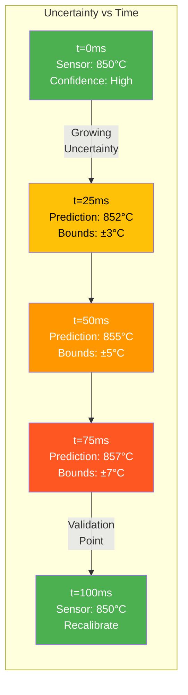
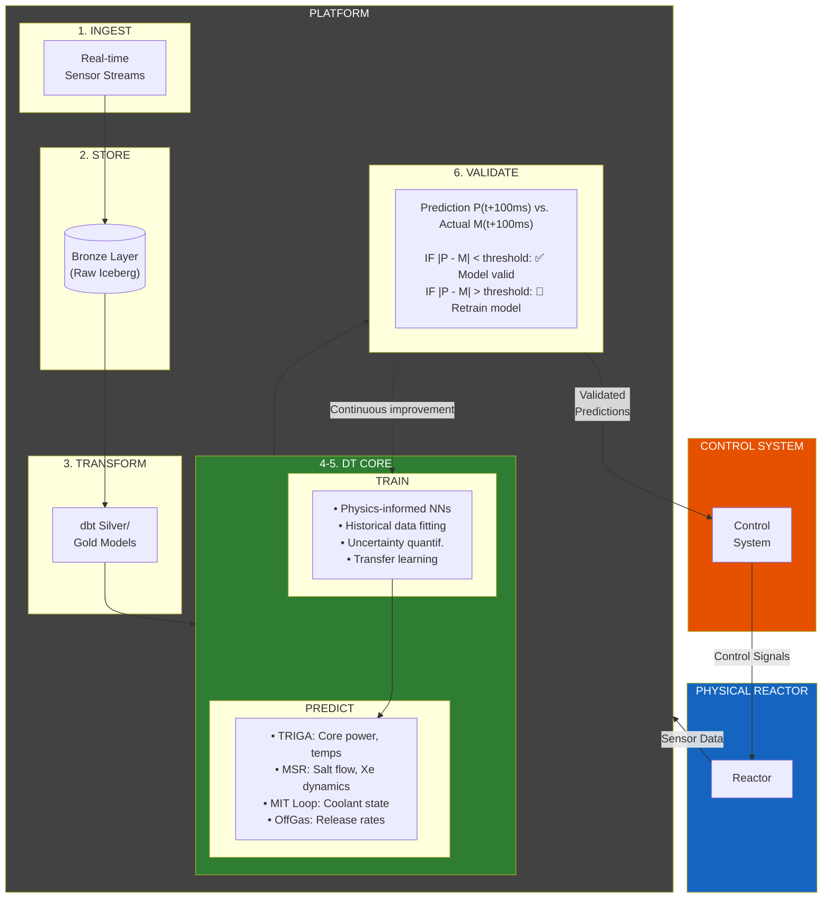
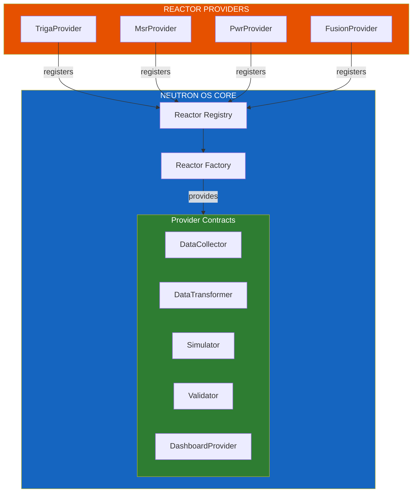

# Digital Twin Hosting Specification

**Part of:** [Neutron OS Master Tech Spec](spec-executive.md)

---

> **Scope:** This document specifies the Digital Twin hosting architecture — NeutronOS's infrastructure for executing physics models and trained ROMs across use cases from real-time state estimation to offline analysis. It defines ROM tiers, Shadow workflows, the WASM surrogate runtime, run tracking, and reactor provider interfaces.

| Property | Value |
|----------|-------|
| Version | 0.2 |
| Last Updated | 2026-03-17 |
| Status | Draft |
| PRD | [Digital Twin Hosting PRD](../requirements/prd-digital-twin-hosting.md) |
| Related | [Model Corral Spec](spec-model-corral.md), [Data Architecture Spec](spec-data-architecture.md) |
| Related ADRs | [ADR-008: WASM Extension Runtime](../adr/008-wasm-extension-runtime.md) |

---

## Table of Contents

1. [Overview](#1-overview)
2. [Use Cases](#2-use-cases)
3. [ROM Tier Specification](#3-rom-tier-specification)
4. [Shadow Architecture](#4-shadow-architecture)
5. [Run Tracking](#5-run-tracking)
6. [Real-Time State Estimation](#6-real-time-state-estimation)
7. [Closed-Loop Architecture](#7-closed-loop-architecture)
8. [Reactor Provider Interface](#8-reactor-provider-interface)
9. [Reactor Onboarding](#9-reactor-onboarding)
10. [Extension Points](#10-extension-points)
11. [WASM Surrogate Runtime](#11-wasm-surrogate-runtime)
12. [CLI Interface](#12-cli-interface)
13. [Web Interface](#13-web-interface)

---

## 1. Overview

Digital Twin Hosting is NeutronOS's infrastructure for executing computational models:

| Component | Description |
|-----------|-------------|
| **Model Registry** | Models stored/versioned in [Model Corral](spec-model-corral.md) |
| **ROM Runtime** | WASM-based execution with tiered latency guarantees |
| **Shadow System** | Calibrated high-fidelity simulations running in parallel |
| **Run Tracking** | Full provenance for every execution |
| **Multi-Reactor** | Provider pattern for reactor-specific physics |

### 1.1 Design Principles

- **Tiered Fidelity**: ROM tiers match latency needs to model complexity
- **Uniform Runtime**: All ROMs compile to WASM for consistent execution
- **Full Provenance**: Every run tracked with inputs, outputs, model versions
- **Model Corral Integration**: Execution tied to registered, validated models

---

## 2. Use Cases

The Digital Twin system supports six primary use cases:

| Use Case | Description | Latency Need | ROM Tier |
|----------|-------------|--------------|----------|
| **Real-time display** | Live dashboard with sub-second state rendering | <100ms | ROM-1 |
| **Live activation** | Embed simulation in safety or control loop | <100ms | ROM-1 |
| **Comms & Viz** | Interactive exploration, VR, decision-support GUIs | 5-20s | ROM-2 |
| **Experiment planning** | Optimize parameters before physical runs | <5 min | ROM-3 |
| **Operational planning** | Shift planning, week-ahead fuel management | Minutes | ROM-4 |
| **Analysis & V&V** | Post-hoc comparison, UQ, benchmarking | Offline | Shadow |

### 2.1 Use Case → Tier Mapping

```
┌─────────────────────────────────────────────────────────────────────────────┐
│                         Use Case → ROM Tier Selection                        │
├─────────────────────────────────────────────────────────────────────────────┤
│                                                                              │
│  ┌─────────────────┐     ┌─────────────────┐                                │
│  │ Real-time       │     │ Live activation │                                │
│  │ display         │     │ (control loop)  │                                │
│  └────────┬────────┘     └────────┬────────┘                                │
│           │                       │                                          │
│           └───────────┬───────────┘                                          │
│                       ▼                                                      │
│                ┌─────────────┐                                               │
│                │   ROM-1     │  <100ms, lowest fidelity                      │
│                │   (10 Hz)   │                                               │
│                └─────────────┘                                               │
│                                                                              │
│  ┌─────────────────┐                                                        │
│  │ Comms & Viz     │                                                        │
│  │ (interactive)   │──────────►┌─────────────┐                              │
│  └─────────────────┘           │   ROM-2     │  5-20s                       │
│                                │             │                               │
│                                └─────────────┘                               │
│                                                                              │
│  ┌─────────────────┐                                                        │
│  │ Experiment      │                                                        │
│  │ planning        │──────────►┌─────────────┐                              │
│  └─────────────────┘           │   ROM-3     │  <5 min                      │
│                                │             │                               │
│                                └─────────────┘                               │
│                                                                              │
│  ┌─────────────────┐                                                        │
│  │ Operational     │                                                        │
│  │ planning        │──────────►┌─────────────┐                              │
│  └─────────────────┘           │   ROM-4     │  Minutes                     │
│                                │             │                               │
│                                └─────────────┘                               │
│                                                                              │
│  ┌─────────────────┐                                                        │
│  │ Analysis & V&V  │──────────►┌─────────────┐                              │
│  └─────────────────┘           │   Shadow    │  Full fidelity, offline      │
│                                │             │                               │
│                                └─────────────┘                               │
│                                                                              │
└─────────────────────────────────────────────────────────────────────────────┘
```

---

## 3. ROM Tier Specification

### 3.1 Tier Definitions

| Tier | Target Latency | Spatial Resolution | Energy Resolution | Typical Training Source |
|------|----------------|-------------------|-------------------|------------------------|
| **ROM-1** | <100ms (10 Hz) | Low (lumped) | Collapsed groups | Point kinetics + TH |
| **ROM-2** | 5-20s | Low (coarse mesh) | High (multi-group) | Neutronics + TH |
| **ROM-3** | <5 min | High (fine mesh) | Transient capable | Coupled multi-physics |
| **ROM-4** | Minutes | High (full detail) | Quasi-static | Full depletion codes |

### 3.2 Tier Characteristics

#### ROM-1: Real-Time (10 Hz)

- **Use**: Dashboard state display, control loop integration
- **Fidelity**: Lowest—lumped thermal capacitance, point kinetics
- **Training**: Fast surrogates from reduced-order physics
- **Format**: WASM mandatory
- **Validation**: Continuously validated against sensor data

#### ROM-2: Interactive (5-20s)

- **Use**: Scenario exploration, VR interfaces, decision support
- **Fidelity**: Moderate—coarse spatial mesh, multi-group energy
- **Training**: Physics-informed neural networks
- **Format**: WASM or ONNX
- **Validation**: Spot-checked against ROM-3/Shadow

#### ROM-3: Planning (<5 min)

- **Use**: Pre-experiment parameter sweeps, optimization
- **Fidelity**: High—fine spatial mesh, transient dynamics
- **Training**: Multi-physics coupled simulations
- **Format**: WASM or ONNX
- **Validation**: Benchmarked against Shadow runs

#### ROM-4: Analysis (Minutes)

- **Use**: Shift planning, fuel management, safety analysis
- **Fidelity**: Highest ROM—near-Shadow capability
- **Training**: Full depletion code snapshots
- **Format**: ONNX or native runtime
- **Validation**: Direct comparison to Shadow

### 3.3 Tier Selection Criteria

```
Decision Matrix:

IF latency < 100ms required:
    → ROM-1 (accept lowest fidelity)

ELSE IF interactive response needed (5-20s):
    → ROM-2 (balance fidelity/speed)

ELSE IF planning horizon = hours:
    → ROM-3 (high fidelity transients)

ELSE IF planning horizon = days/weeks:
    → ROM-4 (quasi-static analysis)

ELSE IF V&V or benchmarking:
    → Shadow (full physics)
```

---

## 4. Shadow Architecture

### 4.1 Shadow Concept

A **Shadow** is a calibrated high-fidelity simulation that runs alongside the physical reactor:

| Aspect | ROM | Shadow |
|--------|-----|--------|
| **Fidelity** | Reduced/approximate | Full physics code |
| **Speed** | Real-time to minutes | Hours to days per case |
| **Purpose** | Operational decisions | Validation, V&V, analysis |
| **Execution** | On-demand, continuous | Scheduled, batch |
| **Calibration** | Uses Shadow as ground truth | Calibrated to experimental data |

### 4.2 Shadow Workflow

```
┌─────────────────────────────────────────────────────────────────────────────┐
│                        Shadow Calibration & Validation                       │
├─────────────────────────────────────────────────────────────────────────────┤
│                                                                              │
│  ┌─────────────────┐                                                        │
│  │ Physical        │                                                        │
│  │ Reactor Data    │                                                        │
│  └────────┬────────┘                                                        │
│           │                                                                  │
│           ▼                                                                  │
│  ┌─────────────────────────────────────────────────────────────────────┐    │
│  │                    Shadow Calibration Pipeline                       │    │
│  │                                                                      │    │
│  │  1. Ingest historical sensor data                                   │    │
│  │  2. Configure physics code with known parameters                    │    │
│  │  3. Run simulation for historical period                            │    │
│  │  4. Compare predicted vs measured                                   │    │
│  │  5. Adjust uncertain parameters (material props, BCs)               │    │
│  │  6. Iterate until validation metrics pass                           │    │
│  │                                                                      │    │
│  └─────────────────────────────────────────────────────────────────────┘    │
│           │                                                                  │
│           ▼                                                                  │
│  ┌─────────────────┐                                                        │
│  │ Calibrated      │                                                        │
│  │ Shadow Model    │◄─────── Stored in Model Corral                         │
│  └────────┬────────┘                                                        │
│           │                                                                  │
│           ├──────────────────────────────────────────┐                      │
│           │                                          │                      │
│           ▼                                          ▼                      │
│  ┌─────────────────┐                       ┌─────────────────┐              │
│  │ ROM Training    │                       │ Validation      │              │
│  │ Data Generation │                       │ Runs            │              │
│  └────────┬────────┘                       └────────┬────────┘              │
│           │                                         │                       │
│           ▼                                         ▼                       │
│  ┌─────────────────┐                       ┌─────────────────┐              │
│  │ Trained ROMs    │                       │ ROM Accuracy    │              │
│  │ (ROM-1..4)      │                       │ Assessment      │              │
│  └─────────────────┘                       └─────────────────┘              │
│                                                                              │
└─────────────────────────────────────────────────────────────────────────────┘
```

### 4.3 Shadow Execution Modes

| Mode | Trigger | Duration | Purpose |
|------|---------|----------|---------|
| **Scheduled** | Cron/daily | Hours | Routine comparison |
| **Event-driven** | Anomaly detected | Hours | Investigate divergence |
| **On-demand** | User request | Variable | Ad-hoc analysis |
| **Batch** | Parameter study | Days | Sensitivity analysis |

### 4.4 Calibration Targets (per Dr. Clarno)

When calibrating a Shadow to match measured reactor data, adjust these parameters:

| Target | Priority | Description | Notes |
|--------|----------|-------------|-------|
| **Nuclear data cross sections** | Critical | Distributed with estimated uncertainties/covariances | Key: recoverable energy per fission, U-238 capture at 6.7 eV resonance |
| **Initial fuel isotopes** | Critical | Isotopic composition at a reference date (e.g., 5 cycles ago) | Establishes baseline for depletion tracking |
| **Geometry** | Important | Material dimensions may not be precisely known | Accounts for manufacturing tolerances |

> "If you get [recoverable energy per fission and U-238 capture at 6.7 eV resonance] right, most everything else works out." — Dr. Clarno

### 4.5 Data Quality Prerequisites

ROMs can only predict **physics-based changes** — they cannot predict or filter noise. Before ROMs can provide operational value:

| Requirement | Validation Method |
|-------------|-------------------|
| **Time synchronization** | Rod position, neutron detector, and Cherenkov signals must be time-aligned |
| **Correlation validation** | Rod movements should induce predictable power responses |
| **Noise characterization** | Only correlated Cherenkov/neutron spikes indicate physics (vs. noise) |

If data has excessive noise, the ROM may appear "accurate" by falling within large measurement error bars, but cannot provide actionable real-time guidance.

### 4.6 VERA Operational Status

| Capability | Status |
|------------|--------|
| VERA license | ✅ Active |
| Shadow nightly runs | ✅ Operational (sends daily initial critical rod height prediction to operators) |
| Veracity contract | ✅ Open for NETL/MSR multi-physics DT needs |

### 4.7 Failure Mode Handling

Failure handling depends on ROM tier and use case:

| Use Case | ROM Tier | Failure Consequence | Handling |
|----------|----------|---------------------|----------|
| **Semi-autonomous operation** | ROM-1 | Bad prediction could command wrong action | True control rods remain in place and can scram. Take ROM offline and investigate. |
| **Transient data display** | ROM-1/2 | No operational consequence | ROM goes dark or shows invalid data; operators ignore. Flag for later analysis. |
| **Planning/analysis** | ROM-3/4 | Decisions based on wrong predictions | More robust with time-averaged data. Flag outliers for investigation. |

**Investigation checklist when ROM/measurement disagree:**
- Model side: input data, ROM execution, output interpretation
- Measurement side: instrumentation, control system data path, data cleaning

---

## 5. Run Tracking

### 5.1 Run Tracking Schema

Every DT execution is tracked with full provenance:

| Table | Description |
|-------|-------------|
| `dt_runs` | Master run record |
| `dt_run_states` | Time-series state snapshots |
| `dt_run_validations` | Comparison against measurements |

### 5.2 dt_runs Table

| Column | Type | Description |
|--------|------|-------------|
| `run_id` | UUID | Primary key |
| `model_id` | FK | Reference to Model Corral |
| `model_version` | string | Semantic version |
| `reactor_id` | string | Target reactor |
| `rom_tier` | enum | ROM-1/2/3/4/Shadow |
| `started_at` | timestamp | Execution start |
| `completed_at` | timestamp | Execution end |
| `status` | enum | pending/running/completed/failed |
| `triggered_by` | string | user/schedule/anomaly |
| `input_hash` | string | SHA256 of inputs |
| `config_snapshot` | JSONB | Frozen configuration |

### 5.3 dt_run_states Table

| Column | Type | Description |
|--------|------|-------------|
| `state_id` | UUID | Primary key |
| `run_id` | FK | Parent run |
| `sim_time` | float | Simulation time |
| `wall_time` | timestamp | Real wall clock |
| `state_vector` | JSONB | Model outputs |
| `uncertainty` | JSONB | UQ bounds (optional) |

### 5.4 dt_run_validations Table

| Column | Type | Description |
|--------|------|-------------|
| `validation_id` | UUID | Primary key |
| `run_id` | FK | Parent run |
| `validated_at` | timestamp | Validation time |
| `measured_state` | JSONB | Sensor readings |
| `predicted_state` | JSONB | Model prediction |
| `metrics` | JSONB | Comparison metrics |
| `passed` | boolean | Within tolerance |

---

## 6. Real-Time State Estimation

### 2.1 The Core Challenge

The fundamental problem is **sensor latency** (~100ms round-trip) versus **transient timescales** (<50ms). Digital twins fill this temporal gap with predictions, enabling tighter operational margins—but with important caveats:

| Aspect | Sensor-Only Operations | DT-Augmented Operations |
|--------|------------------------|-------------------------|
| **State visibility** | Discrete measurements every ~100ms | Continuous estimates every ~10ms |
| **Inter-sample state** | Unknown | Estimated with uncertainty bounds |
| **Safety margins** | Conservative (account for unknowns) | Tighter (bounded uncertainty) |
| **Operational capacity** | Limited by uncertainty | Closer to optimal |
| **Key caveat** | Ground truth | Predictions are *estimates*, not measurements |

**Critical limitations:**
- Surrogate models trade fidelity for speed—they are approximations
- Uncertainty grows between sensor readings
- Novel scenarios outside training data may produce unreliable predictions
- Achieving trustworthy accuracy bounds is an active research area

### 2.2 Uncertainty Growth Between Sensor Readings

Predictions fill the temporal gap between sensor readings, but **uncertainty grows** the further we extrapolate:



**Key Insight:** We trade UNKNOWN state for ESTIMATED state with quantified uncertainty. This is better than nothing, but it's not the same as knowing.

---

## 7. Closed-Loop Architecture



> **Ultimate Vision:** AI-assisted control decisions feed validated predictions back to the reactor control system, enabling tighter operational margins with quantified uncertainty.

### 3.1 Data Flow for Digital Twins

| Data Flow | Source | Destination | Latency Requirement | Purpose |
|-----------|--------|-------------|---------------------|---------|
| **Sensor Ingest** | Physical sensors | Bronze layer | <10ms | Raw state capture |
| **Feature Engineering** | Bronze/Silver | ML Pipeline | <100ms | Model inputs |
| **Model Inference** | Trained models | DT Simulation | <10ms | State prediction |
| **Validation Comparison** | Prediction + Actual | Validation engine | <200ms | Model accuracy check |
| **Dashboard Updates** | Gold layer | Superset | <1s | Human visibility |
| **Control Signals** | Validated predictions | Control system | <50ms | Closed-loop actuation |

---

## 7.2 Per-Project Specifications

| Digital Twin | Primary Physics | ML Model Type | Prediction Target | Current Status |
|--------------|-----------------|---------------|-------------------|----------------|
| **TRIGA DT** | Point kinetics, thermal hydraulics | Physics-informed NN | Core power, fuel temps | Active development |
| **MSR DT** | Multi-physics neutronics + TH | Surrogate models | Salt temp, Xe-135 conc | Research phase |
| **MIT Loop DT** | Coolant flow, heat transfer | Reduced-order models | Coolant state, HX perf | Active development |
| **OffGas DT** | Noble gas transport | Empirical + ML hybrid | Release rates | Planning phase |

### 7.3 Implementation Roadmap

| Phase | Milestone | Data Requirements | DT Integration | Target |
|-------|-----------|-------------------|----------------|--------|
| **Phase 1** | Historical model training | Bronze/Silver layers populated | Batch training on historical data | Q1 2026 |
| **Phase 2** | Near-real-time prediction | Streaming ingest, <10s latency | Models run on recent data | Q2 2026 |
| **Phase 3** | Real-time prediction | Streaming ingest, <100ms latency | Continuous state estimation | Q4 2026 |
| **Phase 4** | Validated predictions | Automated prediction vs. actual comparison | Confidence-scored outputs | Q2 2027 |
| **Phase 5** | Operator advisory | Dashboard alerts from predictions | Human-in-loop decisions | Q4 2027 |
| **Phase 6** | Closed-loop control | Ultra-low latency, <50ms | Predictions drive actuation | TBD |

> ⚠️ **Note:** Phase 6 (closed-loop control) is uncharted regulatory territory. Our approach is to develop **progression proofs** — a series of validated capabilities that demonstrate increasing levels of autonomy, analogous to SAE Levels 0-5 for self-driving vehicles. See [Autonomy Levels](#autonomy-levels) in the PRD and [§15 Autonomy Progression Framework](#15-autonomy-progression-framework) below.

---

## 7.4 Prediction Limitations

### Why Surrogates Are Approximate

High-fidelity physics codes (MCNP, MPACT, Nek5000) can take minutes to days per simulation. Real-time prediction requires ~10ms response. We achieve this through surrogate models that approximate the full physics.

| Approach | Runtime | Fidelity | Use Case |
|----------|---------|----------|----------|
| Full Monte Carlo (MCNP) | Hours–days | Highest | Offline analysis, benchmarking |
| Deterministic neutronics (MPACT) | Minutes–hours | High | Design studies, training data generation |
| **Surrogate/ROM** | **~10ms** | **Lower** | **Real-time prediction** |

### Uncertainty Quantification

When we say a prediction has "uncertainty bounds," we mean:
- **Point estimate**: "Power is ~850 kW"
- **With UQ**: "Power is 850 kW ± 15 kW (95% confidence)"

The bounds tell operators how much to trust the prediction.

### Known Failure Modes

| Scenario | Risk | Mitigation |
|----------|------|------------|
| **Out-of-distribution** | Novel operating conditions not seen in training | Conservative bounds; flag for human review |
| **Model drift** | Physics changes (burnup, aging) invalidate trained model | Continuous validation; scheduled retraining |
| **Transient extrapolation** | Rapid changes exceed model assumptions | Widen bounds during transients |

---

## 8. Reactor Provider Interface

### 8.1 Design Philosophy: Factory/Provider Pattern

Neutron OS uses a **factory/provider pattern** that allows reactor providers to register their implementations at runtime:



**Key Benefits:**
- **Decoupling:** Core platform knows nothing about specific reactor physics
- **Extensibility:** New reactor types added without modifying core code
- **Testing:** Mock implementations for unit testing
- **Versioning:** Multiple versions of same reactor type can coexist

### 8.2 Core Interface Definitions

Each reactor provider must implement these interfaces:

```python
# neutron_core/interfaces.py

class DataCollector(ABC):
    """Interface for collecting reactor data."""
    def get_metadata(self) -> ReactorMetadata: ...
    def get_sensor_manifest(self) -> List[Dict]: ...
    def collect_readings(self) -> List[SensorReading]: ...
    def get_historical_readings(self, start, end, sensors) -> List[SensorReading]: ...

class DataTransformer(ABC):
    """Interface for reactor-specific data transformations."""
    def to_bronze_schema(self, readings) -> Dict: ...
    def to_silver_schema(self, bronze_data) -> Dict: ...
    def to_state_vector(self, silver_data) -> StateVector: ...
    def get_dbt_models(self) -> List[str]: ...

class Simulator(ABC):
    """Interface for digital twin simulation/prediction."""
    def get_model_info(self) -> Dict: ...
    def predict(self, current_state, horizon_ms) -> PredictionResult: ...
    def train(self, training_data, validation_split) -> Dict: ...

class Validator(ABC):
    """Interface for validating predictions against measurements."""
    def validate(self, prediction, actual) -> ValidationResult: ...
    def should_retrain(self) -> bool: ...

class DashboardProvider(ABC):
    """Interface for reactor-specific dashboard components."""
    def get_superset_datasets(self) -> List[Dict]: ...
    def get_superset_charts(self) -> List[Dict]: ...
    def get_superset_dashboards(self) -> List[Dict]: ...
```

> **Full Interface Definitions:** These interfaces are not yet implemented. When built, they will live in `src/neutron_os/infra/` or a dedicated `neutron_core` package.

### 8.3 Touch Points

Every reactor provider must provide:

| Touch Point | Interface | Required |
|-------------|-----------|----------|
| **Data Collection** | `DataCollector` | ✅ Yes |
| **Schema Transforms** | `DataTransformer` | ✅ Yes |
| **State Estimation** | `Simulator` | ⚠️ If DT enabled |
| **Model Validation** | `Validator` | ⚠️ If DT enabled |
| **Dashboards** | `DashboardProvider` | ✅ Yes |
| **Avro Schemas** | Files | ✅ Yes |
| **dbt Models** | SQL files | ✅ Yes |

---

## 9. Reactor Onboarding

### 9.1 Configuration Domains

| Domain | What It Defines | Examples |
|--------|-----------------|----------|
| **Reactor Identity** | Type, facility, license class | TRIGA Mark II, 1.1 MW |
| **Sensor Schema** | Channel names, units, sampling rates | `fuel_temp_1` (°C) |
| **Data Ingest** | Source type, connection params | Serial over TCP, OPC-UA |
| **Physics Models** | Applicable simulators, surrogate paths | RELAP, ONNX surrogate |
| **Alarm Thresholds** | Safety limits, warning bands | Fuel temp < 400°C |
| **Dashboard Templates** | Which visualizations apply | Core map, rod positions |
| **Compliance Rules** | Regulatory regime | NRC Part 50 vs Part 70 |

### 9.2 Configuration Storage

Configuration is stored in layers:

```
defaults/              ← Shipped with Neutron OS
  reactor_types/
    triga.yaml         ← Base TRIGA configuration
    msr.yaml
    pwr.yaml
    
facilities/            ← Facility-specific overrides  
  ut_netl/
    config.yaml
    sensors.yaml
    
instances/             ← Per-reactor-instance config
  netl_triga_001/
    config.yaml
```

---

## 10. Extension Points

### 10.1 Extension Point Catalog

| Factory | Provider Interface | Purpose | Example Providers |
|---------|-------------------|---------|-------------------|
| **ReactorFactory** | `ReactorProvider` | Reactor-type DT logic | TRIGA, MSR, PWR, Fusion |
| **IngestFactory** | `IngestProvider` | Data source adapters | OPC-UA, PI Historian, CSV |
| **SimulatorFactory** | `SimulatorProvider` | Physics code wrappers | RELAP, TRACE, SAM, OpenMC |
| **SurrogateFactory** | `SurrogateProvider` | ML model inference | ONNX, PyTorch, GP |
| **ComplianceFactory** | `ComplianceProvider` | Regulatory reporting | NRC Part 50, IAEA, CNSC |
| **DashboardFactory** | `DashboardProvider` | Visualization adapters | Superset, Grafana, HMI |
| **AuditFactory** | `AuditProvider` | Provenance tracking | Hyperledger, append-only log |

### 10.2 Industry Adoption Scenarios

| Stakeholder | What They Provide | Benefit |
|-------------|-------------------|---------|
| **Reactor vendors** (NuScale, X-energy) | ReactorProvider + SimulatorProvider | DT for their design |
| **Historian vendors** (OSIsoft) | IngestProvider | Data flows to any DT |
| **Regulatory bodies** (NRC, IAEA) | ComplianceProvider | Standard reporting |
| **ML platforms** (Databricks) | SurrogateProvider | Cloud-native ML |

---

## 11. WASM Surrogate Runtime

> **ADR Reference:** [ADR-008: WASM Extension Runtime](../adr/008-wasm-extension-runtime.md)
> **Spike:** `spikes/wasm-surrogate-runtime/`

### 11.1 Why WASM?

| Requirement | Challenge | WASM Solution |
|-------------|-----------|---------------|
| **Auditability** | NRC needs reproducible execution | Deterministic semantics; bit-exact results |
| **Security** | Models shouldn't access unauthorized resources | Capability-based security |
| **Performance** | <10ms inference | Near-native (0.8-1.2x native) |
| **Multi-language** | Teams use C++, Rust, Mojo | Single runtime supports all |

### 11.2 WIT Interface

```wit
package neutron:surrogate@0.1.0;

interface model {
    record input { features: list<float64>, timestamp: option<u64> }
    record output { prediction: list<float64>, uncertainty: option<list<float64>> }
    record metadata { model-id: string, version: string, training-hash: string }
    
    predict: func(input: input) -> result<output, string>;
    validate: func() -> result<bool, string>;
    get-metadata: func() -> metadata;
}

world surrogate { export model; }
```

### 11.3 Security Model

| Capability | Default | Notes |
|------------|---------|-------|
| `wasi:filesystem` | ❌ Denied | Grant only if needed |
| `wasi:clocks` | ✅ Granted | Timing metrics |
| `wasi:random` | ❌ Denied | Stochastic models only |
| Network | ❌ Denied | Never |

### 11.4 Performance Targets

| Metric | Target |
|--------|--------|
| Cold start | <50ms |
| Warm latency | <10ms |
| Throughput | >1000/s |
| Overhead vs native | <20% |

---

## 12. CLI Interface

### 12.1 Command Structure

```
neut twin <verb> [args] [--flags]

Verbs:
  run         Execute a DT model
  shadow      Manage Shadow runs
  rom-train   Train ROM from Shadow data
  infer       Run ROM inference
  compare     Compare ROM vs Shadow
  validate    Validate predictions against measurements
  list        List runs
  show        Show run details
  export      Export run results
```

### 12.2 Key Commands

| Command | Description |
|---------|-------------|
| `neut twin run triga-netl-rom1 --reactor netl-001` | Execute ROM-1 model |
| `neut twin shadow start --model triga-shadow-v3` | Start Shadow run |
| `neut twin rom-train --source shadow-run-123 --tier rom-2` | Train ROM from Shadow |
| `neut twin compare --rom rom-run-456 --shadow shadow-run-123` | Compare ROM accuracy |
| `neut twin list --reactor netl-001 --tier rom-1` | List runs by filter |
| `neut twin show run-789` | Show run details |

### 12.3 Output Formats

| Format | Flag | Use Case |
|--------|------|----------|
| Table | `--format table` (default) | Human reading |
| JSON | `--format json` | Scripting |
| Parquet | `--export parquet` | Analytics |

---

## 13. Web Interface

### 13.1 Views

| View | Description |
|------|-------------|
| **Run Dashboard** | Active/recent runs, status indicators |
| **Run Detail** | Inputs, outputs, logs, validation |
| **Comparison View** | Side-by-side ROM vs Shadow |
| **Model Selector** | Browse Model Corral for execution |
| **Shadow Manager** | Schedule, monitor Shadow runs |
| **Training Pipeline** | Configure ROM training jobs |

### 13.2 Real-Time Features

| Feature | Update Rate | Source |
|---------|-------------|--------|
| Live state display | 10 Hz | ROM-1 predictions |
| Sensor overlay | ~10 Hz | Redpanda stream |
| Validation alerts | On event | Validator service |
| Run progress | 1 Hz | Job tracker |

---

## 14. TRIGA DT Website Integration

The existing [TRIGA Digital Twin Website](../../../TRIGA_Digital_Twin/triga_dt_website/) provides a natural integration point for DT Hosting features.

### 14.1 Current Website Structure

| Route | Feature | Current Capability |
|-------|---------|--------------------|
| `/simulator` | Control panel replica | Rod movement, physics stepping, session state |
| `/shadowcaster` | MPACT predictions | Critical rod height: predicted vs measured |
| `/data_by_date` | Historical data | Sensor data by date with Plotly charts |

### 14.2 Integration Mapping

| DT Hosting Feature | Integration Point | Implementation |
|-------------------|-------------------|----------------|
| **ROM-1 Live Display** | Overlay on `/simulator` | 10Hz predictions alongside manual control |
| **Run Dashboard** | New `/runs` nav item | Active/recent runs, status indicators |
| **Shadow Manager** | Extend `/shadowcaster` | Schedule, monitor, compare Shadow runs |
| **ROM vs Shadow Comparison** | `/shadowcaster/compare` | Side-by-side accuracy visualization |
| **Run Detail View** | `/runs/{run_id}` | Inputs, outputs, validation metrics |
| **Training Pipeline UI** | `/training` | Configure ROM training jobs |

### 14.3 Early Implementation Path

**Phase 1: Extend Shadowcaster** (Low effort)
1. Add "Run History" tab to `/shadowcaster`
2. List Shadow runs from `dt_runs` table
3. Link to run details showing predicted vs measured

**Phase 2: ROM-1 Integration** (Medium effort)
1. Add ROM-1 prediction overlay to `/simulator`
2. Display real-time state estimates alongside sensor data
3. Show uncertainty bounds on predictions

**Phase 3: Full Run Management** (Higher effort)
1. New `/runs` route for run dashboard
2. Run detail pages with full provenance
3. ROM vs Shadow comparison view
4. Training pipeline configuration

### 14.4 Simulator Enhancement

The existing `/simulator` already has:
- Session state management (`simulator_states` dict)
- Physics stepping (`/calculate_step` endpoint)
- Real-time rod position updates

Enhancement for ROM-1 integration:

```python
# routes/simulator_routes.py (conceptual)
@simulator_bp.route('/predict', methods=['POST'])
def rom_predict():
    """Run ROM-1 inference for current state."""
    data = request.get_json()
    session_id = data['session_id']
    state = simulator_states.get(session_id)
    
    # Get ROM-1 model from Model Corral
    rom = get_rom_model('triga-netl-rom1-v2')
    
    # Run inference
    prediction = rom.predict(
        rod_positions=state['rod_positions'],
        temperature=state['watertemp'],
        xenon=state['X'],
        iodine=state['I']
    )
    
    # Track run in dt_runs
    track_inference_run(session_id, rom, prediction)
    
    return jsonify({
        'power_kw': prediction.power,
        'uncertainty': prediction.uncertainty,
        'model_id': rom.model_id
    })
```

### 14.5 UI Consistency

Follow existing website patterns:
- Same CSS (`static/css/style.css`)
- Same nav structure in `base.html`
- Plotly for time-series and comparison charts
- Session-based state (existing pattern in simulator)

---

## 15. Autonomy Progression Framework

Closed-loop reactor control is uncharted regulatory territory. NeutronOS adopts a **progression proof** approach — demonstrating increasing levels of validated autonomy before advancing, analogous to SAE Levels 0-5 for self-driving vehicles.

### 15.1 Nuclear Autonomy Levels (NAL)

| Level | Name | DT Capability | Human Role | Example |
|-------|------|---------------|------------|---------|
| **NAL-0** | No Automation | None | Full manual control | Traditional operation |
| **NAL-1** | Information | Display predictions | Monitoring only | ROM-1 overlay on sensors |
| **NAL-2** | Advisory | Suggest actions | Reviews all suggestions | "Suggest raising Reg rod 2cm" |
| **NAL-3** | Conditional Assist | Execute with approval | Approves each action | "Execute?" → Operator clicks confirm |
| **NAL-4** | High Automation | Autonomous normal ops | Handles exceptions | DT manages steady-state power |
| **NAL-5** | Full Automation | All operations | Emergency standby | (Long-term research goal) |

### 15.2 Progression Proof Requirements

Each level requires demonstrable, auditable proofs before advancing:

```
NAL-0 → NAL-1 (Information):
├─ ROM prediction accuracy within ±X% for 1000+ hours
├─ Uncertainty bounds correctly calibrated
├─ No misleading false alarms
└─ Independent V&V of prediction algorithms

NAL-1 → NAL-2 (Advisory):
├─ Suggestions match licensed operator decisions >95%
├─ All suggestions explainable (not black-box)
├─ Demonstrated on historical data before live
└─ Clear rejection/acceptance logging

NAL-2 → NAL-3 (Conditional Assist):
├─ Zero safety limit violations in 10,000+ scenarios
├─ Operator can cancel any action within T seconds
├─ Full audit trail of every automated action
├─ Independent V&V of control algorithms
└─ Regulatory engagement (process TBD)

NAL-3 → NAL-4 (High Automation):
├─ 1000+ hours at NAL-3 with zero incidents
├─ Graceful degradation on sensor failures
├─ Demonstrated recovery from anomalies
└─ Regulatory approval obtained
```

### 15.3 Current Target: NAL-2

NeutronOS targets **NAL-2 (Advisory)** for initial operational deployment:

| Phase | NAL Level | Capability | Timeline |
|-------|-----------|------------|----------|
| Phase 4 | NAL-1 | Validated predictions with confidence | Q2 2027 |
| Phase 5 | NAL-2 | Operator advisory suggestions | Q4 2027 |
| Phase 6+ | NAL-3+ | Conditional assist and beyond | TBD |

### 15.4 Implementation Proposal

**NAL-1 (Information) Implementation:**

```python
class NAL1Display:
    """Display ROM predictions alongside sensor data."""
    
    def render(self, sensor_data: SensorReading, prediction: ROMPrediction):
        return {
            "measured": {
                "power_kw": sensor_data.power,
                "source": "sensor"
            },
            "predicted": {
                "power_kw": prediction.power,
                "uncertainty_kw": prediction.uncertainty,
                "confidence": prediction.confidence,
                "source": f"rom-1-v{prediction.model_version}"
            },
            "agreement": self._compute_agreement(sensor_data, prediction),
            "alert": prediction.power - sensor_data.power > DIVERGENCE_THRESHOLD
        }
```

**NAL-2 (Advisory) Implementation:**

```python
class NAL2Advisor:
    """Generate operator suggestions without executing."""
    
    def suggest(self, current_state: ReactorState, target: OperationalGoal) -> Suggestion:
        # ROM-2 optimization
        optimal_actions = self.rom2.optimize(current_state, target)
        
        return Suggestion(
            action=optimal_actions[0],
            explanation=self._explain_reasoning(current_state, optimal_actions[0]),
            alternatives=optimal_actions[1:3],
            confidence=self._compute_confidence(optimal_actions[0]),
            requires_approval=True,  # Always True at NAL-2
            audit_id=self._log_suggestion()
        )
```

### 15.5 Metrics Dashboard

Track progression proof metrics in real-time:

| Metric | NAL-1 Threshold | Current | Status |
|--------|-----------------|---------|--------|
| Prediction accuracy (RMSE) | <5% | — | Not started |
| Hours of validated operation | 1000 | — | Not started |
| False alarm rate | <1/week | — | Not started |
| Uncertainty calibration | 95% CI contains true value 95% of time | — | Not started |

### 15.6 Automotive Analogy

This framework mirrors SAE J3016 for autonomous vehicles:

| SAE | Automotive Example | NAL | Nuclear Example |
|-----|-------------------|-----|-----------------|
| L0 | No automation | NAL-0 | Manual operation |
| L1 | Cruise control | NAL-1 | Prediction display |
| L2 | Lane keeping + ACC | NAL-2 | Advisory suggestions |
| L3 | Highway pilot | NAL-3 | Conditional assist |
| L4 | Geo-fenced autonomy | NAL-4 | Supervised automation |
| L5 | Full self-driving | NAL-5 | Full automation |

Just as automotive autonomy advances through demonstrated safety at each level, nuclear autonomy will progress through validated proofs — not assumptions about regulatory requirements.

---

## Related Documents

- [Digital Twin Hosting PRD](../requirements/prd-digital-twin-hosting.md) — User requirements
- [Model Corral Spec](spec-model-corral.md) — Model registry
- [Data Architecture Spec](spec-data-architecture.md) — Lakehouse integration
- [ADR-008: WASM Extension Runtime](../adr/008-wasm-extension-runtime.md) — WASM decision
