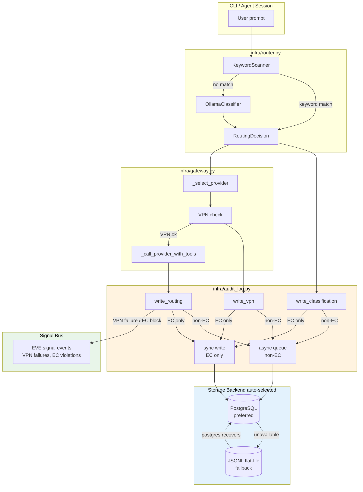

# NeutronOS System Logging Tech Spec

**Status:** Draft
**Owner:** Ben Booth
**Created:** 2026-03-19
**Last Updated:** 2026-03-19
**PRD:** [Logging PRD](../requirements/prd-logging.md)

---

## 0. Two-Layer Logging Architecture

NeutronOS has **two distinct logging layers** with different audiences, backends,
and lifecycles. They coexist at all times — including standard (non-EC) deployments.

### Layer 1 — System Log (always active)

The **System Log** is the operational record of every running component.
It is built on Python's standard `logging` module and is active in every
deployment mode — standard, EC, and full-compliance.

- **Audience:** Operators, M-O, D-FIB, developers
- **Levels:** DEBUG / INFO / WARNING / ERROR / CRITICAL (standard Python levels)
- **Backend:** Rotating flat files (`runtime/logs/system/neut.log`) + console
- **Retention:** M-O rotates and archives; default 90-day hot window (see §9)
- **Use cases:** Startup events, routing decisions (INFO), VPN retries (WARNING),
  HMAC chain breaks (ERROR), unhandled exceptions (CRITICAL), debug traces (DEBUG)

**M-O and D-FIB both read and act on the System Log.** M-O raises the log level
dynamically for post-patch verification. D-FIB subscribes to ERROR and CRITICAL
events to decide whether a component requires intervention (see §10).

### Layer 2 — EC Compliance Audit Log (EC deployments only)

The **EC Audit Log** is the structured, tamper-evident compliance record for
Export-Controlled request routing. It is described by §1–§11 of this spec.

- **Audience:** Compliance officers, security auditors, legal
- **Backend:** PostgreSQL (preferred) or JSONL flat-file fallback
- **EC mode only:** All `AuditLog.write_*` calls are no-ops in standard mode —
  no database connection is opened, no HMAC chain is maintained
- **Use cases:** Routing classification, VPN enforcement, session audit trails

The System Log always captures routing activity at INFO level regardless of mode.
The EC Audit Log adds the structured, cryptographically verifiable layer on top.

---

## 1. Deployment Mode Detection

`AuditLog` (Layer 2) operates in one of two modes, detected at `Gateway._load_config` time:

```python
self._ec_audit_enabled = any(
    p.routing_tier == "export_controlled" for p in self.providers
)
audit.set_mode("ec" if self._ec_audit_enabled else "standard")
```

| Mode | Audit tables | HMAC key required | Write blocks requests | Fails if DB down |
|---|---|---|---|---|
| `standard` | Not used | No | No | No |
| `ec` | Active | Yes (`NEUT_AUDIT_HMAC_KEY`) | EC requests only | EC requests only |

In `standard` mode all `AuditLog.write_*` calls are no-ops. No database
connection is opened for logging purposes. No PostgreSQL dependency exists
for logging in standard mode.

---

## 2. EC Audit Log Write Path & Performance

**The EC Audit Log write path is designed to never become a bottleneck for non-EC traffic.**
The System Log (Layer 1) uses standard Python `logging` handlers and is not subject to
these constraints.

### 2.1 EC Audit Write Modes by Request Type

| Request type | EC Audit write mode | Latency impact |
|---|---|---|
| Non-EC (standard mode) | No-op (EC Audit only — System Log still writes) | Zero audit overhead |
| Non-EC (ec mode) | Async, fire-and-forget via `asyncio.Queue` | ~0 ms (enqueued) |
| EC-tier (flat-file backend) | Synchronous, file-locked append | ~1–3 ms |
| EC-tier (PostgreSQL backend) | Synchronous, single INSERT in transaction | ~2–5 ms |

Non-EC writes are dispatched to a background `asyncio.Task` that drains a
bounded queue (`maxsize=1000`). If the queue is full, the write is dropped
with a warning — never blocking the caller.

EC writes are synchronous and precede the LLM HTTP call (which takes 500ms–
30s). A 2–5ms audit write is not a meaningful bottleneck.

```python
class AuditLog:
    def __init__(self):
        self._queue: asyncio.Queue = asyncio.Queue(maxsize=1000)
        self._worker_task: asyncio.Task | None = None

    def _dispatch(self, record: dict, *, blocking: bool = False):
        if blocking:
            self._backend.write(record)   # synchronous
        else:
            try:
                self._queue.put_nowait(record)
            except asyncio.QueueFull:
                logger.warning("audit queue full, dropping non-EC record")

    async def _drain_worker(self):
        while True:
            record = await self._queue.get()
            try:
                self._backend.write(record)
            except Exception as e:
                logger.warning("audit write failed (non-EC, continuing): %s", e)
            finally:
                self._queue.task_done()
```

SHA-256 hashing (`sha256_hex`) is also non-blocking — it runs in the caller's
thread before dispatch. A typical 2KB prompt hashes in ~10 µs.

### 2.2 Performance Budget

| Operation | Budget | Notes |
|---|---|---|
| SHA-256 hash (2 KB prompt) | < 50 µs | stdlib, no I/O |
| Async queue enqueue (non-EC) | < 10 µs | no I/O |
| EC sync write (flat-file) | < 5 ms | fcntl lock + append |
| EC sync write (PostgreSQL) | < 10 ms | local TCP round-trip |
| LLM HTTP call | 500 ms – 30 s | dominates all timing |

---

## 2.3 System Log Levels

The System Log (Layer 1) uses the five standard Python log levels throughout
all NeutronOS components — including agents, CLI, infrastructure, and extensions.

### Level Definitions

| Level | Value | When to use |
|---|---|---|
| `DEBUG` | 10 | Detailed traces for developer debugging (prompt content, classifier scores, retry loops). Off by default in production. |
| `INFO` | 20 | Normal operational events: startup, routing decisions, signal ingested, session started. |
| `WARNING` | 30 | Recoverable anomalies: VPN unreachable (retrying), PostgreSQL down (using fallback), rate limit hit. |
| `ERROR` | 40 | Non-fatal failures: EC audit write failed, HMAC chain broken, provider timeout after retries. |
| `CRITICAL` | 50 | System-halting failures: authentication key missing, unrecoverable DB corruption, process crash. |

### Configuration

```toml
# runtime/config/logging.toml

[system_log]
level = "INFO"                          # Global minimum level (default)
format = "%(asctime)s %(levelname)-8s %(name)s: %(message)s"
file = "runtime/logs/system/neut.log"
max_bytes = 10_485_760                  # 10 MB per file
backup_count = 7                        # 7 rotated files (7 × 10 MB = 70 MB hot window)

# Per-logger overrides (additive — more specific wins)
[system_log.loggers]
"neutron_os.infra.gateway" = "DEBUG"    # Deep gateway tracing when needed
"neutron_os.extensions.builtins.eve_agent" = "INFO"
"neutron_os.infra.audit_log" = "WARNING"   # Audit layer: warnings and up only
```

**Runtime level adjustment (M-O uses this for post-patch verification):**

```python
import logging
logging.getLogger("neutron_os").setLevel(logging.DEBUG)
# or via CLI:
# neut log level set DEBUG --logger neutron_os.infra.gateway
# neut log level reset                    # back to config default
```

### Level Mapping to Cloud Sinks

When records are fanned out to cloud sinks, NeutronOS levels map to native severities:

| NeutronOS level | GCP Cloud Logging severity | AWS CloudWatch | Syslog severity |
|---|---|---|---|
| `DEBUG` | `DEBUG` | `[DEBUG]` | `7` (debug) |
| `INFO` | `INFO` | `[INFO]` | `6` (informational) |
| `WARNING` | `WARNING` | `[WARN]` | `4` (warning) |
| `ERROR` | `ERROR` | `[ERROR]` | `3` (error) |
| `CRITICAL` | `CRITICAL` | `[FATAL]` | `2` (critical) |

Each cloud sink respects a `minimum_level` in `logging.toml` — for example,
a GCP sink may be set to `WARNING` to reduce ingestion cost while the local
file captures everything at `INFO`.

### M-O and D-FIB Integration

**M-O** monitors the system log for log growth anomalies (see §9) and can:
- Temporarily raise the effective log level after an emergency patch
  (`neut log level set DEBUG --ttl 30m`) to capture post-fix behavior
- Rotate logs early before a planned upgrade
- Alert if the log file has not been written to in > 15 minutes (silent failure indicator)

**D-FIB** subscribes to `ERROR` and `CRITICAL` events via the signal bus (see §10)
and initiates intervention workflows. Specifically:
- `ERROR` from `infra.audit_log` → `logs.audit_write_failed` signal → D-FIB triage
- `CRITICAL` from any component → `system.critical_failure` signal → D-FIB alert + M-O notification
- `WARNING` ×3 from same component within 5 min → `system.repeated_warning` → D-FIB aware

---

## 2.4 Forensic Trace Logging

**This section applies to all deployments, not EC-only.** Any unexpected failure
— a misbehaving agent, a corrupt state file, an infinite retry loop, an
inter-process write collision — needs to be reconstructed after the fact. The
logging layer must support this by default, with no special configuration required.

### 2.4.1 Structured Record Schema

Every log record (System Log and EC Audit Log) must carry a common set of
correlation fields so that forensic queries across files, time ranges, and
components produce a coherent timeline.

```python
# Minimum required fields on every structured log record
{
    "ts":           "2026-03-19T14:23:01.452Z",   # ISO 8601 UTC, millisecond precision
    "level":        "WARNING",                     # standard Python level name
    "logger":       "neutron_os.infra.gateway",   # __name__ of emitting module
    "trace_id":     "7f3a1c...",                   # request-scoped (see §2.4.2)
    "session_id":   "9e2b4d...",                   # CLI/agent session (see §2.4.2)
    "component":    "gateway",                     # short component label
    "msg":          "VPN connection attempt 2 failed, retrying in 5s",

    # Use specific field names — never a bare "provider" (see §19.4).
    # For LLM routing events, use provider.identity (see ADR-012 and §2.4.1a):
    "llm_provider":              "qwen-tacc-ec",   # stable name from config
    "llm_provider_config_hash":  "a3f7b2c1",       # 8-char fingerprint of endpoint+model+tier
    # "llm_provider_instance":  "9e2b4df1a3c7",    # per-load UUID (session records only)
    # For storage events: "storage_provider": "sharepoint"
    # For signal ingestion: "signal_source": "voice_memo"

    # other optional context fields set by call site:
    "error":        "ConnectionRefusedError: [Errno 111]",
    "duration_ms":  42,
}
```

### 2.4.1a Provider Identity in Records

Provider identity follows a three-layer model (see [ADR-012](../requirements/adr-012-provider-identity.md)):

| Field | Stability | Include in |
|---|---|---|
| `provider` (`name`) | Stable across runs (enforced unique in config) | Every log record that involves a provider |
| `provider_config_hash` | Stable while config unchanged; changes on endpoint/model/tier edit | Routing audit records, session start |
| `provider_instance` | Per-load UUID — intentionally not stable across restarts | Session start record only |

Use `provider.identity` on the `LLMProvider` object to get the full dict:
```python
logger.info("Routing decision", extra=provider.identity)
# → {"provider": "qwen-tacc-ec", "provider_config_hash": "a3f7b2c1", "provider_instance": "9e2b4df1"}
```

For high-frequency log records, use the minimal form (`extra={"provider": provider.name}`)
to keep record volume manageable.

Structured records are emitted by a custom `logging.Formatter` subclass
(`StructuredJsonFormatter`) that reads correlation fields from the
`logging.LogRecord` and the active `contextvars` context (see §2.4.2).

### 2.4.2 Trace Context Propagation

A `trace_id` scopes a single logical operation: one LLM request, one `neut signal ingest` run, one M-O retention sweep. It is distinct from `session_id` (which scopes a CLI invocation or agent session).

```python
# neutron_os/infra/trace.py
import contextvars, uuid

_trace_id: contextvars.ContextVar[str] = contextvars.ContextVar("trace_id", default="")
_session_id: contextvars.ContextVar[str] = contextvars.ContextVar("session_id", default="")

def new_trace() -> str:
    tid = uuid.uuid4().hex[:16]
    _trace_id.set(tid)
    return tid

def current_trace() -> str:
    return _trace_id.get() or "no-trace"

def set_session(sid: str) -> None:
    _session_id.set(sid)

def current_session() -> str:
    return _session_id.get() or "anonymous"
```

**Where traces are started:**

| Entry point | When `new_trace()` is called |
|---|---|
| `Gateway.chat()` | Once per LLM request, before any routing |
| `neut signal ingest` | Once per ingestion run |
| `EVE._process_item()` | Once per queue item processed |
| `M-O` task workers | Once per scheduled task |
| Web API request handlers | Once per HTTP request (middleware) |

`StructuredJsonFormatter` reads `current_trace()` and `current_session()` from
context vars — no change needed at individual `logger.warning(...)` call sites.

### 2.4.3 Forensic Ring Buffer

Writing DEBUG logs to disk at all times is expensive (I/O, rotation, storage).
But having no DEBUG record when something goes wrong means incomplete forensics.

The **ring buffer** is a thread-safe in-process circular buffer that holds the
last N log records at DEBUG level, entirely in memory. It costs only RAM — no
I/O until triggered. When an incident occurs, the buffer is flushed to disk as
a named snapshot.

```python
from collections import deque
import threading

class ForensicRingBuffer(logging.Handler):
    """In-memory circular buffer of recent DEBUG+ records. No I/O until flushed."""

    def __init__(self, capacity: int = 2000):
        super().__init__(level=logging.DEBUG)
        self._buf: deque[dict] = deque(maxlen=capacity)
        self._lock = threading.Lock()

    def emit(self, record: logging.LogRecord) -> None:
        with self._lock:
            self._buf.append({
                "ts": record.created,
                "level": record.levelname,
                "logger": record.name,
                "trace_id": getattr(record, "trace_id", ""),
                "msg": self.format(record),
            })

    def flush_snapshot(self, path: Path, *, reason: str) -> Path:
        """Flush buffer to timestamped JSONL file. Returns the path written."""
        path.parent.mkdir(parents=True, exist_ok=True)
        with self._lock:
            records = list(self._buf)
        snapshot_path = path.with_suffix(
            f".{datetime.now(timezone.utc).strftime('%Y%m%dT%H%M%SZ')}.jsonl"
        )
        with open(snapshot_path, "w", encoding="utf-8") as f:
            f.write(json.dumps({"reason": reason, "record_count": len(records)}) + "\n")
            for r in records:
                f.write(json.dumps(r, default=str) + "\n")
        return snapshot_path
```

**Default capacity:** 2000 records ≈ ~2–5 minutes of normal activity at INFO
level, or ~30–60 seconds of DEBUG-heavy code paths. Configurable in `logging.toml`.

### 2.4.4 Automatic Incident Snapshot

When a `CRITICAL` or `ERROR` record is emitted, a handler automatically flushes
the ring buffer to a persistent snapshot file before the process continues.
This captures the "what happened immediately before the failure" context —
without requiring DEBUG logging to be running continuously.

```python
class IncidentSnapshotHandler(logging.Handler):
    """On ERROR/CRITICAL: flush the ring buffer to a dated incident file."""

    def __init__(self, ring: ForensicRingBuffer, snapshot_dir: Path):
        super().__init__(level=logging.ERROR)
        self._ring = ring
        self._snapshot_dir = snapshot_dir
        self._last_snapshot: float = 0.0
        self._cooldown_s: float = 30.0   # at most one snapshot per 30s

    def emit(self, record: logging.LogRecord) -> None:
        now = record.created
        if now - self._last_snapshot < self._cooldown_s:
            return  # rate-limit: avoid snapshot storm on cascading failures
        self._last_snapshot = now
        trace_id = getattr(record, "trace_id", "no-trace")
        reason = f"{record.levelname} in {record.name}: {record.getMessage()[:120]}"
        path = self._snapshot_dir / f"incident-{trace_id}"
        snapshot_path = self._ring.flush_snapshot(path, reason=reason)
        # Log the snapshot location at WARNING so operators find it
        logging.getLogger(__name__).warning(
            "Incident snapshot written: %s", snapshot_path,
            stacklevel=2,
        )
```

**Snapshot file location:** `runtime/logs/forensic/incident-<trace_id>.<timestamp>.jsonl`

M-O includes forensic snapshot files in its weekly size check and monthly
archive sweep (see §9). Snapshots are never auto-deleted by rotation — they
require explicit M-O archival after review.

### 2.4.5 On-Demand Forensic Capture

Operators can trigger ring buffer snapshots manually without waiting for an
incident, and can enable extended DEBUG capture to disk for a bounded time window:

```
neut log snapshot                        # flush ring buffer to incident file now
neut log snapshot --trace <trace_id>     # flush only records matching trace_id
neut log capture --duration 5m           # write DEBUG to disk for 5 min, then stop
neut log capture --duration 5m --logger neutron_os.infra.gateway
neut log trace <trace_id>                # replay all records for a trace_id
```

`neut log trace` queries `runtime/logs/system/neut.log` and any forensic
snapshots, filtering by `trace_id`. Output is a timeline sorted by `ts`:

```
$ neut log trace 7f3a1c8b2e4a9d01
2026-03-19T14:23:01.452Z  INFO  gateway         new_trace started, provider=qwen-ec
2026-03-19T14:23:01.460Z  INFO  router          keyword scan: no match
2026-03-19T14:23:01.531Z  INFO  classifier      ollama score=0.83 → ec_tier
2026-03-19T14:23:01.534Z  WARNING  vpn_checker  attempt 1 failed: timeout
2026-03-19T14:23:06.541Z  WARNING  vpn_checker  attempt 2 failed: ConnectionRefused
2026-03-19T14:23:11.543Z  ERROR  vpn_checker    attempt 3 failed — VPN degraded
2026-03-19T14:23:11.544Z  WARNING  audit_log     Incident snapshot written: forensic/incident-7f3a1c…
2026-03-19T14:23:11.550Z  ERROR  gateway        EC request blocked: VPN unreachable after 3 attempts
```

### 2.4.6 Replay and Mitigation Workflow

A forensic replay is not special tooling — it is the combination of:

1. `neut log trace <trace_id>` → timeline of what happened
2. `neut log snapshot --trace <trace_id>` → full DEBUG context if the ring buffer still has it
3. System Log + EC Audit Log correlation → same `trace_id` appears in both layers
4. Signal history → which signals were emitted during this trace, and what D-FIB did with them

For **mitigation**: M-O can replay a trace to verify a fix without reproducing
the original failure. The trace timeline shows exactly which component failed,
at which step, with what state — replacing guesswork with evidence.

For **remediation design**: the trace log is the input to root cause analysis.
Pattern: repeated `trace_id`s showing the same failure path → systematic bug,
not a one-off. EVE can correlate signal events across traces to surface patterns
the operator might not notice manually.

### 2.4.7 Configuration

```toml
# runtime/config/logging.toml

[forensic]
enabled = true
ring_buffer_capacity = 2000          # records in memory (default ~2-5 min of activity)
snapshot_dir = "runtime/logs/forensic"
incident_snapshot_on_error = true    # auto-snapshot on ERROR
incident_snapshot_on_critical = true # auto-snapshot on CRITICAL
snapshot_cooldown_s = 30             # min seconds between auto-snapshots
capture_max_duration_m = 30          # safety cap on 'neut log capture' duration
```

---

## 3. Storage Backend: Flat-File First, PostgreSQL Preferred

NeutronOS prefers PostgreSQL for all persistent data. However, PostgreSQL is
not always running — especially during initial setup, air-gapped deployments,
or small single-user instances. The audit log uses a **flat-file fallback** that
is always available and promotes to PostgreSQL automatically.

### 3.1 Backend Selection

```
NEUT_AUDIT_BACKEND = "auto" | "postgres" | "jsonl"
```

`"auto"` (default):
1. Try PostgreSQL connection.
2. If available → use PostgreSQL backend.
3. If unavailable → use JSONL flat-file backend; schedule promotion check.

```python
class AuditLog:
    def _select_backend(self):
        if self._mode == "standard":
            return NullBackend()
        if os.getenv("NEUT_AUDIT_BACKEND") == "jsonl":
            return JsonlBackend(self._log_dir)
        try:
            conn = get_db_connection(timeout=2)
            return PostgresBackend(conn)
        except Exception:
            logger.warning(
                "PostgreSQL unavailable — audit log using flat-file fallback. "
                "Run 'neut setup postgres' to configure a permanent connection."
            )
            return JsonlBackend(self._log_dir)
```

### 3.2 JSONL Flat-File Backend

**File location:** `runtime/logs/audit/routing_events.jsonl`

**Multi-process safety:** Uses `portalocker` (cross-platform file locking) so
concurrent CLI processes, agent daemons, and background tasks never corrupt
the file. Each append is atomic: lock → seek-to-end → write line → fsync →
unlock.

```python
import portalocker, json

class JsonlBackend:
    def write(self, record: dict):
        line = json.dumps(record, separators=(",", ":"), sort_keys=True) + "\n"
        with open(self._path, "a", encoding="utf-8") as f:
            portalocker.lock(f, portalocker.LOCK_EX)
            f.write(line)
            f.flush()
            os.fsync(f.fileno())
            portalocker.unlock(f)
```

**HMAC chain in flat-file mode:** Each line includes an `hmac` field chained
from the previous line's hmac. The chain is verified by reading the file
sequentially — same algorithm as PostgreSQL mode.

### 3.3 Automatic Promotion to PostgreSQL

A background promotion task runs periodically when the flat-file backend is
active. When PostgreSQL becomes available, it replays unsynced JSONL records
into the database, then marks the file as promoted:

```python
async def _promotion_worker(self):
    while isinstance(self._backend, JsonlBackend):
        await asyncio.sleep(60)  # check every 60 seconds
        try:
            conn = get_db_connection(timeout=2)
            promoted = self._backend.promote_to(PostgresBackend(conn))
            if promoted > 0:
                logger.info("Promoted %d audit records from flat-file to PostgreSQL", promoted)
                self._backend = PostgresBackend(conn)
        except Exception:
            pass  # PostgreSQL still down, try again next cycle
```

Promoted files are renamed to `routing_events.jsonl.promoted.<timestamp>` and
retained by M-O's log management sweep (see §8).

### 3.4 PostgreSQL Onboarding

**PostgreSQL is the preferred backend for all NeutronOS data** — not just
logging. During `neut setup` and `neut config`, users are guided through
PostgreSQL installation:

```
neut setup postgres          # guided install: brew/apt/docker, create DB, test connection
neut setup postgres --docker # Docker Compose path (zero native install)
neut config --check-db       # verify connection, surface limitations if down
```

On each `neut config` session, if PostgreSQL is not reachable:

```
⚠  PostgreSQL is not connected. NeutronOS is running with reduced capability:
   • Audit log → flat-file fallback (runtime/logs/audit/)
   • RAG store → unavailable
   • Ops Log   → unavailable

   Run 'neut setup postgres' to install and configure PostgreSQL.
   Flat-file audit records will promote automatically when PostgreSQL is connected.
```

This notification is shown once per config session, not on every command.

---

## 4. Architecture Overview



---

## 5. `infra/audit_log.py` Public Interface

```python
from neutron_os.infra.audit_log import AuditLog

audit = AuditLog.get()   # module-level singleton

# Classification event (async for non-EC, sync for EC)
audit.write_classification(
    routing_event_id=uuid,
    prompt_hash=sha256_hex(prompt),
    classifier="keyword" | "ollama" | "fallback",
    keyword_matched=bool,
    keyword_term=str | None,
    ollama_result=str | None,
    sensitivity="standard" | "strict",
    final_tier=str,
    is_ec=bool,           # controls sync vs async dispatch
)

# Routing event
audit.write_routing(
    session_id=str,
    tier_requested=str,
    tier_assigned=str,
    provider_name=str,
    provider_tier=str,
    blocked=bool,
    block_reason=str | None,
    prompt_hash=str,
    response_hash=str | None,
    ec_violation=bool,
    is_ec=bool,
)

# VPN check event
audit.write_vpn(
    routing_event_id=uuid,
    provider_name=str,
    vpn_reachable=bool,
    check_duration_ms=int,
)

# Config load event (always async)
audit.write_config_load(
    config_file=str,
    providers=list[dict],
    ec_providers_count=int,
)

# Chain integrity check
ok, broken_at = audit.verify_chain(table="routing_events", since=datetime | None)

# Backend status (for neut status / neut doctor)
info: BackendInfo = audit.backend_info()
# info.backend = "postgres" | "jsonl" | "null"
# info.pending_promotion = int    # records awaiting PostgreSQL
# info.log_size_bytes = int
```

---

## 6. Signal Integration

### 6.1 Signal is NOT a Log Sink

A `LogSink` is a passive fan-out consumer: it receives every log record at or
above a configured level threshold and streams it to a destination (file, GCP,
CloudWatch, syslog). If Signal were "just another sink," EVE and D-FIB would
receive every WARNING+ record from every component — dozens per minute during
normal VPN retries, rate-limit hits, and retry loops. That is noise, not signal.

**Signals are semantically named, explicitly promoted events.** They are not
filtered by level; they are filtered by *event type identity*. A component
must consciously decide that a specific event deserves reactive attention from
an agent, and declare that at the call site.

### 6.2 The Promotion Gate: `signal_event` Field

A log record becomes signal-eligible by including a `signal_event` key:

```python
# NOT signal-eligible — high-frequency, expected, no agent action needed
logger.warning("VPN connection attempt %d failed, retrying in %ds", attempt, delay)

# Signal-eligible — threshold crossed, agent should know
logger.warning(
    "VPN unreachable after %d attempts — promoting to signal",
    MAX_ATTEMPTS,
    extra={
        "signal_event": "connections.vpn_degraded",
        "signal_payload": {"provider": provider_id, "attempt_count": MAX_ATTEMPTS},
    },
)
```

The `SignalSink` (described in §6.3) filters exclusively on the presence of
`signal_event`. It ignores level entirely. A `DEBUG` record with `signal_event`
set would be promoted. A `CRITICAL` record without it would not — because
`CRITICAL` failures are handled differently (paged directly, not sent to EVE
for synthesis).

### 6.3 SignalSink Implementation

`SignalSink` is a specialized `LogSink` implementation. Unlike other sinks, it
does not fan out all records — it only handles the promotion gate.

```python
class SignalSink:
    """LogSink that promotes explicitly-marked log records to the signal bus."""
    accepts_ec: bool = False  # EC records never go to EVE/D-FIB signal bus

    def write(self, record: dict) -> None:
        signal_event = record.get("signal_event")
        if not signal_event:
            return  # most records: fast no-op
        if not _SIGNAL_REGISTRY.is_registered(signal_event):
            logger.error(
                "Unregistered signal_event '%s' blocked at promotion gate. "
                "Add it to signal_event_registry.toml.", signal_event
            )
            return
        payload = record.get("signal_payload", {})
        payload["_log_ts"] = record.get("ts")
        payload["_log_level"] = record.get("level")
        _emit_signal_async(signal_event, payload)
```

Signal emission is fire-and-forget (`asyncio.create_task`). A signal bus
failure never blocks the log write and never affects the LLM call.

### 6.4 Signal Event Type Registry

To prevent ad-hoc proliferation of signal event types, every promotable event
type must be declared in `runtime/config/signal_event_registry.toml`. The
`SignalSink` rejects any `signal_event` value not present in the registry.

```toml
# runtime/config/signal_event_registry.toml
# Governs which log events may be promoted to the signal bus.
# Adding a new entry requires: event_type, description, handler, and
# justification for why an agent needs reactive awareness (not just a log).

[[events]]
event_type = "connections.vpn_degraded"
description = "VPN unreachable after configured retry threshold"
handler = "D-FIB"
promoted_at_level = "WARNING"       # informational only — promotion is always explicit
threshold = "3 failures / 10 min"
justification = "D-FIB should attempt auto-recovery; operators need paging."

[[events]]
event_type = "connections.provider_unhealthy"
description = "LLM provider returning HTTP 5xx after retry exhaustion"
handler = "D-FIB"
promoted_at_level = "ERROR"
threshold = "3 consecutive 5xx responses"
justification = "Provider may need to be disabled or failover triggered."

[[events]]
event_type = "security.ec_violation"
description = "EC-classified query was routed to a non-EC provider"
handler = "D-FIB"
promoted_at_level = "CRITICAL"
threshold = "every occurrence"
justification = "Potential data exfiltration event. Immediate alert required."

[[events]]
event_type = "ec.provider_missing"
description = "EC-tier request arrived but no EC provider is configured"
handler = "D-FIB"
promoted_at_level = "ERROR"
threshold = "first occurrence per session"
justification = "Configuration gap that blocks EC users. D-FIB surfaces remediation."

[[events]]
event_type = "config.ec_providers_changed"
description = "EC provider list changed on config reload"
handler = "EVE"
promoted_at_level = "INFO"
threshold = "every occurrence"
justification = "EVE maintains awareness of active EC infrastructure."

[[events]]
event_type = "logs.audit_write_failed"
description = "EC audit log write failed (DB or file lock)"
handler = "D-FIB"
promoted_at_level = "ERROR"
threshold = "every occurrence"
justification = "EC audit failure must be investigated. Fail-secure may be blocking requests."

[[events]]
event_type = "logs.hmac_chain_broken"
description = "HMAC chain verification failed — tamper detected or DB corruption"
handler = "D-FIB"
promoted_at_level = "CRITICAL"
threshold = "every occurrence"
justification = "Possible audit log tampering. Requires immediate security review."

[[events]]
event_type = "logs.promotion_stalled"
description = "Flat-file → PostgreSQL promotion has not completed after 24h"
handler = "M-O"
promoted_at_level = "WARNING"
threshold = "24h since last successful promotion"
justification = "M-O should investigate why PostgreSQL is unavailable long-term."

[[events]]
event_type = "system.repeated_warning"
description = "Same component emitted WARNING 3+ times within 5 minutes"
handler = "D-FIB"
promoted_at_level = "WARNING"
threshold = "3 occurrences / 5 min from same logger"
justification = "Repeated warnings often precede failures. D-FIB should be aware."
```

### 6.5 What Does NOT Become a Signal

The registry pattern also serves as documentation of *deliberate exclusions*:

| Log event | Why excluded from signals |
|---|---|
| Routine routing success | Expected, high-frequency. INFO in System Log is sufficient. |
| Non-EC classification result | Telemetry, not actionable. Use `neut log tail` or dashboards. |
| Individual VPN retry (attempt 1, 2) | Expected transient. Only the *threshold* crossing is a signal. |
| Single HTTP 5xx from a provider | Retried automatically. Signal only after retry exhaustion. |
| DEBUG traces (classifier scores, prompt hashes) | Developer diagnostics. Never signal-worthy. |
| Log rotation events | M-O operational detail. Not for EVE's signal synthesis layer. |
| CRITICAL from unhandled exception | Handled by direct crash reporter, not signal bus. |

The general rule: **log events that resolve themselves are not signals**. A
signal implies that an agent must *take an action* — investigate, remediate,
alert a human, or update internal state.

### 6.6 Adding New Signal Event Types

#### When should you promote a log event to a signal?

The test is: **would an agent take a different action if it knew about this event?**
If yes, it's a signal. If the answer is "an operator would notice it in the dashboard
eventually," it's a log entry.

Here are concrete scenarios drawn from NeutronOS extension development:

---

**Scenario A — Extension detects that its data source has gone stale**

An ingestion extension pulls daily export files from a facility data historian.
The log will show `WARNING: historian file not updated in 48h` on each poll.
But an operator won't catch this until they notice signals have dried up days
later. D-FIB can detect this immediately and alert:

```toml
[[events]]
event_type = "ingestion.source_stale"
description = "Data source file has not been updated beyond expected interval"
handler = "D-FIB"
threshold = "48h without new file"
justification = """
Stale sources silently stop producing signals without any visible failure.
D-FIB should alert the operator and optionally suppress downstream synthesis
that would otherwise report on outdated data.
"""
```

```python
if hours_since_update > STALE_THRESHOLD_H:
    logger.warning(
        "Historian file stale: %s (%.0fh since last update)",
        source_name, hours_since_update,
        extra=neut_signal("ingestion.source_stale",
                          source=source_name,
                          hours_stale=hours_since_update),
    )
```

---

**Scenario B — An agent's correction suggestions are being consistently rejected**

EVE's correction system learns from human review. If a particular correction
type is being rejected at a high rate (say, 80% of suggestions for `grammar`
corrections are manually overridden), that's a signal that the model's prompting
for that category is miscalibrated — not just a run of bad luck. EVE should
know so it can adjust confidence thresholds or flag the category for review.

```toml
[[events]]
event_type = "learning.correction_rejection_spike"
description = "Correction type exceeding rejection rate threshold over recent window"
handler = "EVE"
threshold = ">70% rejection rate over last 20 suggestions of same type"
justification = """
High rejection rates on a correction type indicate a systemic prompting or
calibration problem, not individual noise. EVE should lower confidence for
that correction type and surface the pattern for human review — not silently
continue generating low-quality suggestions.
"""
```

---

**Scenario C — A domain-specific extension detects anomalous experiment state**

A reactor experiment tracking extension logs individual readings as they arrive.
But if a scheduled experiment run produces zero readings when readings were
expected, that is operationally significant — a data acquisition system may
have failed silently. M-O should create a checklist item and alert the shift
supervisor:

```toml
[[events]]
event_type = "experiment.expected_data_missing"
description = "Experiment run completed with no data recorded in expected window"
handler = "M-O"
threshold = "run window closed with 0 readings where >0 expected"
justification = """
Zero readings during an active experiment window indicates DAQ failure or
network partition, not a quiet experiment. M-O should create a checklist
item for operator followup and suppress any synthesis that would otherwise
treat the experiment as producing null results.
"""
```

---

**Scenario D — A cost threshold has been crossed**

An extension that performs batch synthesis runs tracks token cost per run. A
single unusually expensive synthesis (e.g., 10× the typical cost due to a
runaway context) is worth alerting on — an operator may want to cancel or
investigate before the next run compounds it:

```toml
[[events]]
event_type = "cost.synthesis_run_expensive"
description = "Single synthesis run exceeded token cost threshold"
handler = "D-FIB"
threshold = ">$2.00 USD equivalent in a single run (configurable)"
justification = """
Runaway context or prompt inflation can silently multiply costs across a
batch. D-FIB should surface the anomaly to the operator immediately with
the run ID so they can inspect the trace before the batch continues.
"""
```

---

**Counter-example — What NOT to promote**

An extension retries a network call and logs each attempt:

```python
logger.warning("Retry %d/3: HTTP 429 from provider %s", attempt, provider)
```

This should **not** be a signal. Retries are expected behavior; the log is
sufficient for forensics. Only the final exhaustion — when retries are spent
and the call is about to fail — warrants a signal, and only if a handler can
do something useful (switch to a fallback, page oncall, disable the provider
temporarily). Ask: "what would D-FIB or EVE actually *do* with this?" If the
answer is "nothing yet, but maybe someday," keep it as a log entry.

---

#### Procedure

To promote a new log event to a signal:

1. **Confirm an agent would act on it** — identify the handler (D-FIB, EVE, M-O)
   and describe the specific action it takes. If there is no action, it is not
   a signal.
2. **Add the entry to `signal_event_registry.toml`** with `handler`, `threshold`,
   and `justification` filled in. The `SignalSink` will reject any unregistered
   event type.
3. **Add `signal_event=` at the specific call site** in the code — not at a
   broad level filter. The goal is one annotated call site per event type, at
   the point where the threshold has been crossed.
4. **Write or extend the handler** in D-FIB, EVE, or M-O. An unhandled signal
   is waste — if nothing acts on it, it should remain a log entry.

Code review checklist:
- [ ] Is this event registered in `signal_event_registry.toml`?
- [ ] Is there a handler for it (D-FIB rule, EVE subscription, or M-O task)?
- [ ] Is the threshold condition correct — does it fire only when action is warranted, not on every occurrence?
- [ ] Could this be handled by a log-level alert in the ops dashboard instead?

---

## 7. HMAC Chain

The System Audit Log and the Reactor Ops Log share the same tamper-evident
chain implementation: `TamperEvidentChain` in `neutron_os.infra.state`.

```python
from neutron_os.infra.state import TamperEvidentChain

chain = TamperEvidentChain(key=os.environ["NEUT_AUDIT_HMAC_KEY"])

# Before inserting a row, stamp it:
stamped = chain.stamp(record, prev_hmac=last_row_hmac)
# Insert stamped (which now has an "hmac" field) into routing_events

# To verify:
ok, broken_at = chain.verify(rows_ordered_by_ts)
```

The chain algorithm:

```
hmac_n = HMAC-SHA256(
    key = HMAC_KEY,
    message = canonical_json(row_without_hmac_field) + hmac_{n-1}
)
```

`canonical_json` sorts keys alphabetically with no whitespace (deterministic
across Python versions). The first row uses `prev_hmac = "GENESIS"`.

**Shared infrastructure, different keys and tables:**

| Consumer | HMAC key env var | PostgreSQL table | Regulatory framework |
|---|---|---|---|
| System Audit Log | `NEUT_AUDIT_HMAC_KEY` | `routing_events` | Internal policy (10 CFR 810 indirect) |
| Reactor Ops Log | `NEUT_OPS_LOG_HMAC_KEY` | `ops_log_entries` | 10 CFR 50.9, ANSI/ANS-15.1 |

Using separate keys ensures that a compromise of the audit log key does not
affect the regulatory Ops Log record, and vice versa.

The HMAC key is **only required in `ec` mode** for the audit log. If ec mode
is active and no key is found, EC-tier requests are blocked:

```
EC audit log is active but NEUT_AUDIT_HMAC_KEY is not set.
Set this variable or run 'neut setup audit-key' to generate one.
Non-EC requests continue normally.
```

---

## 8. Database Schema

### 8.1 `routing_events`

```sql
CREATE TABLE routing_events (
    event_id          UUID PRIMARY KEY DEFAULT gen_random_uuid(),
    session_id        TEXT NOT NULL,
    ts                TIMESTAMPTZ NOT NULL DEFAULT now(),
    classifier        TEXT NOT NULL,
    tier_requested    TEXT NOT NULL,
    tier_assigned     TEXT NOT NULL,
    provider_name     TEXT NOT NULL,
    provider_tier     TEXT NOT NULL,
    blocked           BOOLEAN NOT NULL DEFAULT FALSE,
    block_reason      TEXT,
    ec_violation      BOOLEAN NOT NULL DEFAULT FALSE,
    prompt_hash       TEXT NOT NULL,
    response_hash     TEXT,
    hmac              TEXT NOT NULL
);

CREATE INDEX routing_events_ts_idx ON routing_events (ts);
CREATE INDEX routing_events_ec_violation_idx
    ON routing_events (ec_violation) WHERE ec_violation = TRUE;
```

### 8.2 `classification_events`

```sql
CREATE TABLE classification_events (
    event_id          UUID PRIMARY KEY DEFAULT gen_random_uuid(),
    routing_event_id  UUID REFERENCES routing_events(event_id),
    ts                TIMESTAMPTZ NOT NULL DEFAULT now(),
    keyword_matched   BOOLEAN NOT NULL DEFAULT FALSE,
    keyword_term      TEXT,
    ollama_result     TEXT,
    sensitivity       TEXT NOT NULL DEFAULT 'standard',
    final_tier        TEXT NOT NULL,
    prompt_hash       TEXT NOT NULL
);
```

### 8.3 `vpn_events`

```sql
CREATE TABLE vpn_events (
    event_id          UUID PRIMARY KEY DEFAULT gen_random_uuid(),
    routing_event_id  UUID REFERENCES routing_events(event_id),
    ts                TIMESTAMPTZ NOT NULL DEFAULT now(),
    provider_name     TEXT NOT NULL,
    vpn_reachable     BOOLEAN NOT NULL,
    check_duration_ms INTEGER NOT NULL
);
```

### 8.4 `config_load_events`

```sql
CREATE TABLE config_load_events (
    event_id              UUID PRIMARY KEY DEFAULT gen_random_uuid(),
    ts                    TIMESTAMPTZ NOT NULL DEFAULT now(),
    config_file           TEXT NOT NULL,
    providers_json        JSONB NOT NULL,
    ec_providers_count    INTEGER NOT NULL
);
```

### 8.5 Row-Level Security (Phase 2)

```sql
ALTER TABLE routing_events ENABLE ROW LEVEL SECURITY;
CREATE POLICY routing_events_insert ON routing_events FOR INSERT TO neutron_app WITH CHECK (TRUE);
CREATE POLICY routing_events_select ON routing_events FOR SELECT TO neutron_app USING (TRUE);
CREATE POLICY routing_events_compliance ON routing_events FOR SELECT TO neutron_compliance USING (TRUE);
```

In Phase 1, enforced at application layer (AuditLog never issues UPDATE/DELETE).

---

## 9. M-O Log Stewardship

M-O (the resource steward agent) owns log lifecycle exactly as it owns RAG
corpus and session state lifecycle. This runs on schedule without user involvement.

### 9.1 M-O Log Responsibilities

| Task | Trigger | Implementation |
|---|---|---|
| System log rotation | Daily (off-hours) | `runtime/logs/*.log` — rotate at 50MB, keep 7 days |
| JSONL flat-file size check | Weekly | Alert if any `.jsonl` file > 100MB |
| Promoted file cleanup | Weekly | Delete `*.jsonl.promoted.*` files > 30 days old |
| PostgreSQL audit table size report | Weekly | Surface row counts, disk usage via `neut status` |
| Archive old audit records | Monthly (configurable) | Move rows older than retention policy to archive table or export JSONL |
| Promotion status check | On `neut status` | Report how many flat-file records are awaiting PostgreSQL promotion |

### 9.2 M-O Rotation Implementation

`runtime/logs/` structure:

```
runtime/logs/
  system.log              # structured JSON lines, system events
  system.log.1            # rotated by M-O
  audit/
    routing_events.jsonl              # active flat-file (if PostgreSQL unavailable)
    routing_events.jsonl.promoted.*   # promoted archives
    classification_events.jsonl
```

M-O uses Python `logging.handlers.RotatingFileHandler` semantics for system
logs. Audit JSONL files are rotated by size (not time) to preserve HMAC chain
integrity — a rotated file gets a new chain starting with `GENESIS`.

```python
# mo_agent/log_steward.py
class LogSteward:
    def run_sweep(self):
        self._rotate_system_logs()
        self._check_jsonl_sizes()
        self._cleanup_promoted_files()
        self._report_audit_table_sizes()
        self._check_pending_promotions()
```

M-O emits a `logs.size_warning` signal if any log file exceeds its size
threshold. D-FIB receives this signal and surfaces it in `neut doctor`.

---

## 10. D-FIB Log Health Integration

D-FIB (the diagnostics/self-healing agent) responds to log health events.

### 10.1 D-FIB Log Subscriptions

| Signal | D-FIB Action |
|---|---|
| `logs.hmac_chain_broken` | Alert user with chain position; recommend forensic export; disable EC audit writes until resolved |
| `logs.audit_db_unavailable` | Confirm flat-file fallback is active; run `neut setup postgres` guidance |
| `logs.size_warning` | Surface in `neut doctor` output with cleanup recommendation |
| `logs.promotion_stalled` | Check PostgreSQL connectivity; re-run promotion if fixed |
| `security.ec_violation` | Immediate alert; halt EC provider; emit incident record |

### 10.2 `neut doctor --logs` Output

```
neut doctor --logs

✓ Audit log backend: PostgreSQL (127.0.0.1:5432)
✓ HMAC chain integrity: OK (last verified 2026-03-19 14:23 UTC)
✓ Flat-file fallback: inactive (PostgreSQL healthy)
✓ Log rotation: system.log 2.1 MB / 50 MB limit
⚠ audit/classification_events.jsonl — 87 MB (approaching 100 MB limit)
  → Run 'neut mo log sweep' to rotate and archive

✓ No EC violations detected (last 30 days)
✓ VPN failure rate: 0.3% (2 / 647 checks)
```

`neut log verify` is automatically included in `neut doctor --security`:
- Exit 0 → "HMAC chain intact"
- Exit 1 → "HMAC mismatch at event_id `<uuid>` — possible tampering"
- Exit 2 → "Chain gap detected — possible row deletion"
- Exit 3 → "Database unreachable — cannot verify (flat-file chain: OK)"

---

## 11. Fail-Secure Policy

The fail-secure policy applies **only to EC-tier requests**.

```python
def complete_with_tools(self, messages, routing_tier="any", ...):
    is_ec = routing_tier == "export_controlled"

    try:
        if is_ec and self._ec_audit_enabled:
            audit.write_routing_pre(..., is_ec=True)   # synchronous, raises on failure
    except AuditLogError as e:
        if is_ec:
            return CompletionResponse(
                text="Audit log unavailable. EC request blocked for security.",
                provider="stub",
                success=False,
                error="AUDIT_LOG_UNAVAILABLE",
            )
        logger.warning("Audit log write failed (non-EC, continuing): %s", e)

    response = self._call_provider_with_tools(...)

    # Post-call: sync for EC, async for non-EC
    audit.write_routing_post(response, is_ec=is_ec)
    return response
```

In `standard` mode, `AuditLog.write_*` are no-ops. No requests are ever
blocked by logging infrastructure in standard mode.

---

## 12. `neut log` CLI

```
neut log tail                     # stream recent routing events (Rich live view)
neut log tail --follow            # stay attached, render new events as they arrive
neut log tail --ec                # EC events only
neut log tail --level warn        # filter by severity (debug/info/warn/error)
neut log tail --provider qwen-rascal  # filter by provider name
neut log show <event-id>          # single event detail
neut log verify                   # HMAC chain integrity (all tables)
neut log verify --table routing   # single table
neut log verify --since 7d        # last 7 days
neut log export --since 30d       # JSONL to stdout (pipe to file or SIEM)
neut log stats                    # counts, EC counts, violations, backend status
neut log promote                  # manually trigger flat-file → PostgreSQL promotion
neut log backend                  # show current backend (postgres / jsonl / null)
neut log sinks                    # list active sinks and their status
```

See §13 for real-time rendering details.

---

## 13. Log Sinks — Cloud & External

### 13.1 Sink Architecture

The `AuditLog` backend is extended from a single writer into a **fan-out sink
pipeline**. Every log record is dispatched to all active sinks concurrently
(async for non-EC; sync for EC, same fail-secure rules apply per-sink).

```python
class LogSink(Protocol):
    """Implemented by every log sink (flat-file, postgres, GCP, CloudWatch, syslog)."""
    @property
    def name(self) -> str: ...
    @property
    def accepts_ec(self) -> bool: ...   # ALWAYS False for cloud sinks
    def write(self, record: dict) -> None: ...
    def healthy(self) -> bool: ...
```

`AuditLog` dispatches to all configured sinks that match the record's EC status:

```python
def _dispatch_to_sinks(self, record: dict, *, is_ec: bool, blocking: bool):
    for sink in self._sinks:
        if is_ec and not sink.accepts_ec:
            continue   # EC records NEVER go to cloud sinks
        if blocking:
            sink.write(record)
        else:
            self._queue.put_nowait((sink, record))
```

### 13.2 Available Sinks

| Sink | Class | `accepts_ec` | Dependencies | When to use |
|---|---|---|---|---|
| JSONL flat-file | `JsonlSink` | No | None | Default fallback; always available |
| PostgreSQL | `PostgresSink` | **Yes** | `psycopg2` | Preferred; tamper-evident chain |
| GCP Cloud Logging | `GcpLoggingSink` | **No** | `google-cloud-logging` | GCP deployments; observability |
| AWS CloudWatch | `CloudWatchSink` | **No** | `boto3`, `watchtower` | AWS deployments; observability |
| Syslog | `SyslogSink` | No | stdlib | Self-hosted SIEM (Splunk, Elastic) |
| Null | `NullSink` | No | None | Standard mode (no-op) |

### 13.3 EC Exclusion — Why Cloud Sinks Never Accept EC Records

Sending EC audit records to GCP Cloud Logging or AWS CloudWatch would route
export-controlled metadata (provider names, session IDs, block reasons, prompt
hashes) through a commercial third-party service. Even without plaintext
content, the pattern of EC requests — who is querying, when, how often,
which provider was selected — is itself sensitive operational information.

**This is not a configuration option.** `accepts_ec = False` is hardcoded on
all cloud sinks and enforced in `AuditLog._dispatch_to_sinks`. EC audit records
are always written exclusively to PostgreSQL (or flat-file fallback).

Cloud sinks receive only non-EC system telemetry: provider health, VPN probe
results, routing decisions for public-tier queries, config load events.

### 13.4 GCP Cloud Logging Sink

```python
class GcpLoggingSink:
    accepts_ec = False

    def __init__(self, project_id: str, log_name: str = "neutron-os"):
        from google.cloud import logging as gcp_logging
        client = gcp_logging.Client(project=project_id)
        self._logger = client.logger(log_name)

    def write(self, record: dict) -> None:
        # Structured log entry — appears in GCP Log Explorer with full field indexing
        self._logger.log_struct(
            record,
            severity=_to_gcp_severity(record.get("level", "INFO")),
            labels={
                "neut.provider": record.get("provider_name", ""),
                "neut.tier":     record.get("tier_assigned", ""),
                "neut.blocked":  str(record.get("blocked", False)),
            },
        )

    def healthy(self) -> bool:
        try:
            self._logger.log_text("health-check", severity="DEBUG")
            return True
        except Exception:
            return False
```

**GCP Log Explorer integration:**
- All `neut.*` labels are indexed and filterable
- Query: `labels."neut.blocked"="True"` → all blocked requests
- Query: `labels."neut.tier"="public" AND severity>=WARNING` → public-tier warnings
- Metrics and alerts can be created from log-based metrics in GCP Console
- Log Router can forward to BigQuery for long-term analysis

**Sufficient for NeutronOS use cases?**
For non-EC deployments running on GCP, yes — GCP Cloud Logging provides
retention, search, dashboards, alerting, and SIEM export. For EC-capable
deployments, it handles the non-EC telemetry while PostgreSQL handles the
regulated audit trail.

### 13.5 AWS CloudWatch Sink

```python
class CloudWatchSink:
    accepts_ec = False

    def __init__(self, log_group: str, log_stream: str, region: str = "us-east-1"):
        import watchtower, logging as stdlib_logging
        self._handler = watchtower.CloudWatchLogHandler(
            log_group=log_group,
            stream_name=log_stream,
            boto3_session=boto3.Session(region_name=region),
            use_queues=True,       # async batching — no per-record HTTP call
            send_interval=5,       # flush every 5 seconds
            max_batch_size=1_048_576,
        )
        self._logger = stdlib_logging.getLogger(f"neut.cloudwatch.{log_group}")
        self._logger.addHandler(self._handler)

    def write(self, record: dict) -> None:
        import json
        self._logger.info(json.dumps(record, default=str))

    def healthy(self) -> bool:
        return self._handler.client is not None
```

`watchtower` batches records and sends them to CloudWatch in background threads
— no per-record HTTP round-trip. On AWS, IAM roles are preferred over
explicit credentials (`boto3.Session()` picks up the instance role automatically).

**CloudWatch Insights** queries work natively against JSON-structured log events:
```
fields @timestamp, provider_name, tier_assigned, blocked
| filter blocked = "True"
| stats count() by provider_name
| sort count desc
```

### 13.6 Syslog Sink

For self-hosted SIEM (Splunk Universal Forwarder, Elastic Agent, Fluentd):

```python
class SyslogSink:
    accepts_ec = False

    def __init__(self, host: str = "localhost", port: int = 514,
                 facility: int = logging.handlers.SysLogHandler.LOG_LOCAL0):
        import logging.handlers
        self._handler = logging.handlers.SysLogHandler(
            address=(host, port), facility=facility
        )

    def write(self, record: dict) -> None:
        import json
        # RFC 5424 structured data — Splunk and Elastic parse this natively
        self._handler.emit(
            logging.LogRecord(
                name="neutron-os", level=logging.INFO,
                pathname="", lineno=0, msg=json.dumps(record, default=str),
                args=(), exc_info=None,
            )
        )
```

### 13.7 Sink Configuration (`runtime/config.example/logging.toml`)

```toml
[logging]
# Sinks are additive — all active sinks receive every eligible record.
# EC records are NEVER sent to cloud sinks regardless of configuration.

[[logging.sinks]]
type = "postgres"        # Always active when PostgreSQL is available
# (auto-configured from existing DB connection settings)

# Uncomment to enable GCP Cloud Logging:
# [[logging.sinks]]
# type = "gcp"
# project_id = "my-gcp-project"
# log_name = "neutron-os"

# Uncomment to enable AWS CloudWatch:
# [[logging.sinks]]
# type = "cloudwatch"
# log_group = "/neutron-os/prod"
# log_stream = "routing"
# region = "us-east-1"

# Uncomment to forward to a self-hosted SIEM via syslog:
# [[logging.sinks]]
# type = "syslog"
# host = "splunk-forwarder.internal"
# port = 514
```

`neut log sinks` shows each sink's type, status (healthy/degraded/disabled),
and whether EC records are excluded.

---

## 14. Real-time Log Visualization

### 14.1 CLI — `neut log tail --follow`

Uses [Rich](https://github.com/Textualize/rich) `Live` for an updating
terminal panel. No polling — records are pushed from the `AuditLog` async
queue to a second in-process queue consumed by the Live renderer.

```
┌─ NeutronOS Log Stream ─────────────────────────────── live ─┐
│ 14:23:01  ✓  public          anthropic    classify:ollama    │
│ 14:23:04  ✓  public          anthropic    classify:keyword   │
│ 14:23:11  ✓  any             qwen-rascal  vpn:ok  239ms      │
│ 14:23:19  ✗  export_ctrl     stub         EC_PROVIDER_NOT_   │
│              ━━━━━━━━━━━━━━━━━━━━━━━━━━━━ CONFIGURED         │
│ 14:23:31  ✓  public          anthropic    classify:fallback  │
│                                                              │
│  requests: 5  │  ec_blocks: 1  │  vpn_ok: 1  │  errors: 0   │
└──────────────────────────────────────────────────────────────┘
```

Color coding:
- Green `✓` — successful routing
- Red `✗` — blocked or error
- Yellow — VPN probe or fallback classifier
- Dim — public-tier routine entries (de-emphasized, not hidden)

`--follow` keeps the panel alive until `Ctrl-C`. Without `--follow`, `tail`
shows the last N events (default 50) and exits.

```python
# infra/audit_log.py — live subscriber hook
class AuditLog:
    def __init__(self):
        self._live_subscribers: list[asyncio.Queue] = []

    def subscribe_live(self) -> asyncio.Queue:
        """Return a queue that receives every new record as it is written."""
        q: asyncio.Queue = asyncio.Queue(maxsize=500)
        self._live_subscribers.append(q)
        return q

    def unsubscribe_live(self, q: asyncio.Queue) -> None:
        self._live_subscribers.remove(q)

    def _dispatch_to_sinks(self, record, *, is_ec, blocking):
        # ... sink dispatch ...
        for q in self._live_subscribers:
            try:
                q.put_nowait(record)
            except asyncio.QueueFull:
                pass  # live viewer can't keep up — drop, never block
```

```python
# extensions/builtins/log/tail.py
async def run_live_tail(filters: TailFilters):
    audit = AuditLog.get()
    live_q = audit.subscribe_live()
    try:
        with Live(build_panel([]), refresh_per_second=4) as live:
            while True:
                record = await asyncio.wait_for(live_q.get(), timeout=1.0)
                if filters.match(record):
                    events.append(record)
                live.update(build_panel(events[-50:]))
    except asyncio.CancelledError:
        pass
    finally:
        audit.unsubscribe_live(live_q)
```

### 14.2 Web App — SSE Log Stream

The web API exposes a Server-Sent Events endpoint. The browser connects once;
the server pushes new log records as they arrive. No polling, no WebSocket
handshake.

```
GET /api/logs/stream?level=info&ec=false
Accept: text/event-stream

→ data: {"ts":"14:23:01","tier":"public","provider":"anthropic","blocked":false}\n\n
→ data: {"ts":"14:23:11","tier":"any","provider":"qwen-rascal","blocked":false}\n\n
→ data: {"ts":"14:23:19","tier":"export_controlled","provider":"stub","blocked":true,"reason":"EC_PROVIDER_NOT_CONFIGURED"}\n\n
```

Server-side (added to `web_api/server.py`):

```python
def _handle_log_stream(self):
    """SSE endpoint: streams log records to connected browser clients."""
    self.send_response(200)
    self.send_header("Content-Type", "text/event-stream")
    self.send_header("Cache-Control", "no-cache")
    self.send_header("X-Accel-Buffering", "no")  # disable nginx buffering
    self.end_headers()

    audit = AuditLog.get()
    live_q = audit.subscribe_live()
    try:
        while True:
            try:
                record = asyncio.run(asyncio.wait_for(live_q.get(), timeout=15))
                line = f"data: {json.dumps(record, default=str)}\n\n"
                self.wfile.write(line.encode())
                self.wfile.flush()
            except asyncio.TimeoutError:
                # SSE keepalive — prevents browser/proxy from closing the connection
                self.wfile.write(b": keepalive\n\n")
                self.wfile.flush()
    except (BrokenPipeError, ConnectionResetError):
        pass  # client disconnected
    finally:
        audit.unsubscribe_live(live_q)
```

Client-side (minimal JS, no framework required):

```javascript
const source = new EventSource('/api/logs/stream?level=info');
source.onmessage = (e) => {
    const record = JSON.parse(e.data);
    appendLogRow(record);   // add to a <table> or virtual scroll list
};
source.onerror = () => {
    // auto-reconnect is built into EventSource — no manual retry logic needed
};
```

**What the web log panel shows:**
- Scrollable log table (newest at top)
- Color-coded tier column (public=green, any=blue, export_controlled=orange, blocked=red)
- Provider name + classifier + duration
- VPN status indicator (connected/degraded)
- EC block counter (prominent — zero should be the normal state)
- Filter controls: tier, provider, blocked-only, time range

### 14.3 GCP / AWS Native Dashboards

For cloud deployments using the GCP or CloudWatch sinks, native dashboards
provide richer visualization than the in-app panel:

**GCP Logs Explorer + Monitoring:**
- Log-based metric: `neut_ec_blocks_total` (count of `blocked=True` records)
- Alerting policy: alert if `neut_ec_blocks_total` > 0 (EC block should never happen silently)
- Dashboard: request rate by provider, VPN probe latency (from `check_duration_ms`),
  classifier distribution (keyword vs. ollama vs. fallback)

**AWS CloudWatch Insights + Dashboards:**
- Widget: `filter blocked = "True" | stats count()` → EC block counter
- Alarm: SNS notification if any EC block occurs
- Dashboard: same metrics as GCP, surfaced as CloudWatch widgets

These are complements to, not replacements for, the in-app CLI and web views.
The in-app views work without any cloud dependency; cloud dashboards add
alerting, long-term retention, and team-wide visibility.

---

## 15. Session ID and Trace Context

See §2.4.2 for the full `trace_id` / `session_id` propagation design.

**Session ID** (set once per CLI invocation or agent session):
```python
# neut_cli.py startup
from neutron_os.infra.trace import set_session
import os
from uuid import uuid4
sid = os.environ.get("NEUT_SESSION_ID") or uuid4().hex
os.environ["NEUT_SESSION_ID"] = sid
set_session(sid)
```

**Trace ID** (set once per logical operation, inside the session):
```python
# gateway.py, before routing
from neutron_os.infra.trace import new_trace
trace_id = new_trace()   # sets contextvars; all log calls in this thread inherit it
```

`Gateway.__init__` reads `os.environ.get("NEUT_SESSION_ID", "anonymous")`.
After Phase 3 (Kratos), enriched with `user_id` + `username`. Both IDs appear
in every structured log record and in every EC Audit record for cross-layer
forensic correlation.

---

## 14. SHA-256 Hashing

```python
import hashlib

def sha256_hex(text: str) -> str:
    return hashlib.sha256(text.encode("utf-8")).hexdigest()
```

Hashing runs in the caller's thread before queue dispatch — ~10–50 µs, no I/O.

---

## 15. Integration Points

### 15.1 `QueryRouter.classify()` — `infra/router.py`

```python
def classify(self, prompt: str, sensitivity: str = SENSITIVITY_STANDARD) -> RoutingDecision:
    routing_event_id = uuid4()
    # ... classification logic ...
    is_ec = decision.tier == RoutingTier.EXPORT_CONTROLLED
    audit.write_classification(
        routing_event_id=routing_event_id,
        prompt_hash=sha256_hex(prompt),
        classifier=decision.classifier,
        keyword_matched=(decision.classifier == "keyword"),
        keyword_term=decision.keyword_term,
        ollama_result=raw_ollama_result,
        sensitivity=sensitivity,
        final_tier=decision.tier.value,
        is_ec=is_ec,
    )
    decision.routing_event_id = routing_event_id
    return decision
```

`RoutingDecision` gains: `routing_event_id: UUID | None`, `keyword_term: str | None`.

### 15.2 `Gateway._load_config()` — `infra/gateway.py`

```python
audit.write_config_load(
    config_file=str(config_path),
    providers=[{"name": p.name, "priority": p.priority,
                "routing_tier": p.routing_tier, "requires_vpn": p.requires_vpn,
                "routing_tags": p.routing_tags} for p in self.providers],
    ec_providers_count=sum(1 for p in self.providers if p.routing_tier == "export_controlled"),
)
```

---

## 16. Migration

Single Alembic migration creates all four tables in one transaction.
Applied via `neut db migrate`.

`data/migrations/versions/20260319_add_audit_log_tables.py`

The migration is a no-op if PostgreSQL is unavailable — flat-file backend
requires no schema migration.

---

## 17. Testing

### Unit Tests (`tests/logging/test_audit_log.py`)
- Standard mode: all writes are no-ops, no DB connection opened
- HMAC chain initializes from GENESIS
- HMAC chain contiguous across multiple writes
- Chain verify detects tampered row
- Async queue drops records gracefully when full (no exception)
- JSONL file locking: concurrent writes from two processes produce valid JSONL
- Promotion: JSONL records replay correctly into PostgreSQL
- `write_routing` with `ec_violation=True` raises `ECViolationError`

### Integration Tests (`tests/logging/test_audit_log_integration.py`)
- Requires PostgreSQL
- End-to-end: classify → route → verify HMAC chain
- EC block produces audit record with `blocked=True`
- PostgreSQL unavailable → JSONL fallback → reconnect → auto-promotion

### Smoke Test Hook
`test_provider_routing_smoke.py` asserts that after each `complete_with_tools`
call, `audit.write_routing` was called (via mock), in both blocking and async
code paths.

---

## 19. Extension Developer Logging Guide

This section is written for extension authors. The platform logging system is
designed so that correct behavior is the path of least resistance — trace
context, structured records, ring buffer capture, and sink fan-out all happen
automatically. The only thing requiring an explicit decision is signal promotion.

### 19.1 Quick Start

```python
# Every extension module: replace bare logger calls with this import
from neutron_os.infra.logging import get_logger

logger = get_logger(__name__)
```

`get_logger(__name__)` returns a standard Python `logging.Logger` pre-wired to:
- The system log file handler (INFO and above by default)
- The forensic ring buffer (DEBUG and above — in memory, no I/O)
- The `StructuredJsonFormatter` (trace_id, session_id, component injected automatically)
- The `IncidentSnapshotHandler` (auto-flush on ERROR/CRITICAL)
- The `SignalSink` (promotes records that carry `signal_event` — ignored otherwise)

The extension's log namespace is automatically derived from `__name__`, so a
logger in `neutron_os.extensions.builtins.my_extension.worker` appears in the
log as `my_extension.worker`. Per-extension log levels can be set in
`logging.toml` without touching the extension's code.

### 19.2 Standard Logging Patterns

```python
from neutron_os.infra.logging import get_logger

logger = get_logger(__name__)

# --- INFO: normal operational events ---
logger.info("Signal batch ingested", extra={"count": 42, "source": "voice_memo"})

# --- WARNING: recoverable anomaly ---
logger.warning("Provider response slow", extra={"provider": "qwen-ec", "latency_ms": 8420})

# --- ERROR: non-fatal failure, operation continues ---
logger.error("Failed to write state file", extra={"path": str(state_path)})

# --- CRITICAL: system cannot continue ---
logger.critical("HMAC key not set — refusing to process EC request")

# --- Exception with stack trace (ERROR level + full traceback) ---
try:
    result = do_something_risky()
except Exception:
    logger.exception("Unexpected failure in retention sweep")
    # logger.exception() automatically captures exc_info (see §19.5)
```

`extra={}` fields appear as top-level keys in the structured JSON record
alongside `ts`, `level`, `logger`, `trace_id`, `session_id`. No special
registration is required — just pass them.

### 19.3 Signal-Eligible Events

When a log event requires reactive attention from an agent (D-FIB, EVE, or
M-O), use the `neut_signal()` helper to promote it cleanly:

```python
from neutron_os.infra.logging import get_logger, neut_signal

logger = get_logger(__name__)

# NOT signal-eligible: individual retry — expected, frequent, no action needed
logger.warning("Connection attempt %d failed, retrying", attempt)

# Signal-eligible: threshold crossed — promote to signal bus
logger.warning(
    "Connection degraded after %d attempts",
    MAX_ATTEMPTS,
    extra=neut_signal(
        "connections.provider_unhealthy",   # must be in signal_event_registry.toml
        provider=provider_id,
        attempt_count=MAX_ATTEMPTS,
        last_error=str(last_exc),
    ),
)
```

`neut_signal(event_type, **payload)` returns a dict:
```python
{
    "signal_event": event_type,
    "signal_payload": payload,
}
```

The `SignalSink` picks up `signal_event`, validates it against the registry,
and dispatches async — transparent to the logger. If the event type is not in
the registry, a `logger.error()` is emitted and the signal is dropped (the
original log record is unaffected).

**To add a new signal event type:** add an entry to
`runtime/config/signal_event_registry.toml` (see §6.4) with `event_type`,
`handler`, `threshold`, and `justification`. Code review will verify that a
handler exists before merging.

### 19.4 Structured Extra Fields — Conventions

| Field name | Type | Use for |
|---|---|---|
| `llm_provider` | `str` | LLM provider name (`"qwen-tacc-ec"`, `"anthropic-sonnet-primary"`) — use `provider.identity` shortcut |
| `storage_provider` | `str` | Storage/cloud provider (`"sharepoint"`, `"onedrive"`, `"s3"`) |
| `signal_source` | `str` | Signal ingestion source (`"voice_memo"`, `"teams"`, `"gitlab"`) |
| `log_sink` | `str` | Log sink type when logging sink-level events (`"gcp"`, `"file"`) |
| `service` | `str` | Any other named external service not covered above |
| `extension` | `str` | Extension name if different from logger namespace |
| `path` | `str` | File path involved in the operation |
| `count` | `int` | Number of items processed |
| `duration_ms` | `int` | Elapsed time of the operation |
| `error` | `str` | Short error description (not full traceback — that's `exc_info`) |
| `trace_id` | `str` | Set automatically — do not pass manually |
| `session_id` | `str` | Set automatically — do not pass manually |

**Never use a bare `provider` field** — the word is overloaded across LLM providers,
storage providers, signal sources, and cloud services. Always use the specific
field name that matches what the provider is *doing* in this context.

Do not serialize large objects (full prompts, embeddings, response text) into
`extra`. Log the hash or a truncated summary; the full content belongs in state
files or the signal payload only if genuinely needed by the handler.

### 19.5 Stack Traces and the Forensic Ring Buffer

Stack traces and log traces are complementary — both appear in every incident snapshot:

- **Stack trace** = what the Python call stack looked like at the moment of the exception.
- **Log trace** (`trace_id`) = the sequence of log events across the full operation.

`logger.exception()` captures both automatically. The `StructuredJsonFormatter`
serializes `exc_info` to a structured JSON field (not just human-readable text),
so forensic snapshots are machine-queryable:

```json
{
  "ts": "2026-03-19T14:23:11.543Z",
  "level": "ERROR",
  "logger": "my_extension.worker",
  "trace_id": "7f3a1c8b2e4a9d01",
  "session_id": "9e2b4d...",
  "msg": "Unexpected failure in retention sweep",
  "exc_type": "FileNotFoundError",
  "exc_value": "[Errno 2] No such file or directory: 'runtime/state/index.json'",
  "exc_traceback": [
    {"file": "my_extension/worker.py", "line": 83, "name": "_load_index",
     "text": "return json.loads(self.index_path.read_text())"},
    {"file": "my_extension/worker.py", "line": 61, "name": "run",
     "text": "index = self._load_index()"}
  ]
}
```

`exc_traceback` is a list of frame dicts (file, line, function name, source
line) — not a raw string — so `neut log trace <id>` can render it inline in
the timeline and tooling can link to the source location.

Extension authors do not need to do anything special to get this behavior.
`logger.exception()` is sufficient. The formatter handles serialization.

### 19.6 Unhandled Exceptions and True Crashes

Two additional mechanisms capture failures that bypass `logger.exception()`:

**`sys.excepthook` override** — NeutronOS installs a global hook at startup
that emits a `CRITICAL` log record (with `trace_id`, `session_id`, and
serialized traceback) for any unhandled exception before the process exits.
This triggers an automatic incident snapshot. Extension code does not need to
do anything — but it does mean unhandled exceptions are always in the forensic
record, not just in stderr.

```python
# neutron_os/infra/logging.py — installed at CLI startup
import sys, traceback as _tb

def _neut_excepthook(exc_type, exc_value, exc_tb):
    logger = get_logger("neutron_os.crash")
    logger.critical(
        "Unhandled exception — process will exit",
        exc_info=(exc_type, exc_value, exc_tb),
        extra={"component": "crash_handler"},
    )
    sys.__excepthook__(exc_type, exc_value, exc_tb)   # also print to stderr

sys.excepthook = _neut_excepthook
```

**`faulthandler`** — For true crashes (segfault, `SIGABRT`, memory error)
that terminate the Python interpreter before the excepthook can run,
`faulthandler` writes the C-level stack trace to a file:

```python
import faulthandler
faulthandler.enable(file=open("runtime/logs/forensic/faulthandler.log", "a"))
```

The `faulthandler.log` file is included in M-O's forensic archive sweep.
True crashes are rare in pure Python but can occur in native extensions (C
bindings, BLAS, ONNX runtimes used by the embedding layer).

### 19.7 What NOT to Do

| Don't | Do instead | Why |
|---|---|---|
| `print("something happened")` | `logger.info(...)` | Print bypasses level filtering, ring buffer, sinks, and trace context |
| `logging.getLogger("my_ext")` | `get_logger(__name__)` | Hard-coded name breaks namespace filtering; `__name__` is always correct |
| `logger.error(str(e))` | `logger.exception("...")` | `str(e)` loses the stack trace; `exception()` captures it |
| `extra={"trace_id": ...}` | Nothing — omit it | `trace_id` is injected by the formatter; manual setting is ignored |
| `extra={"signal_event": "my.event"}` without registry entry | Register first in `signal_event_registry.toml` | Unregistered events are logged as errors and dropped at the sink |
| `open(..., "a")` for runtime files | `locked_append_jsonl(path, record)` | Concurrent processes corrupt unprotected JSONL (see [ADR-011](../requirements/adr-011-concurrent-file-writes.md)) |

### 19.8 Testing Your Extension's Logging

The logging infrastructure ships with test helpers:

```python
from neutron_os.infra.logging.testing import capture_logs, assert_signal_emitted

def test_vpn_degraded_signal():
    with capture_logs() as logs:
        my_extension.simulate_vpn_failure(attempts=3)

    # Assert the right log records were emitted
    errors = [r for r in logs if r["level"] == "ERROR"]
    assert len(errors) == 1
    assert errors[0]["logger"].endswith("my_extension.vpn")

    # Assert the signal was promoted
    assert_signal_emitted(logs, "connections.vpn_degraded", provider="qwen-ec")


def test_no_signal_on_first_retry():
    with capture_logs() as logs:
        my_extension.simulate_vpn_failure(attempts=1)

    # Single retry should NOT promote a signal
    signals = [r for r in logs if "signal_event" in r]
    assert len(signals) == 0
```

`capture_logs()` is a context manager that redirects all log output (system
log, ring buffer, signal sink) into an in-memory list for the duration of the
`with` block. It does not affect other handlers. `assert_signal_emitted()`
checks both that `signal_event` was set and that the payload fields match.

---

## 18. Files Created / Modified

| File | Action | Notes |
|---|---|---|
| `src/neutron_os/infra/audit_log.py` | Create | Core module with async queue, backend selection, signal emission |
| `src/neutron_os/infra/router.py` | Modify | `routing_event_id`, `keyword_term` on `RoutingDecision`; call `audit.write_classification` |
| `src/neutron_os/infra/gateway.py` | Modify | Call `audit.write_routing`, `audit.write_vpn`, `audit.write_config_load` |
| `src/neutron_os/extensions/builtins/mo_agent/log_steward.py` | Create | M-O log management sweep |
| `src/neutron_os/extensions/builtins/log/` | Create | `neut log` CLI extension |
| `data/migrations/versions/20260319_add_audit_log_tables.py` | Create | Alembic migration |
| `tests/logging/test_audit_log.py` | Create | Unit tests |
| `tests/logging/test_audit_log_integration.py` | Create | Integration tests |
| `runtime/config.example/logging.toml` | Create | Logging config template |
