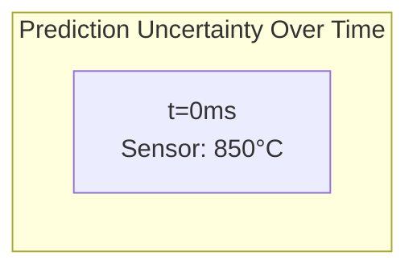

# Mermaid Diagram Best Practices

**Status:** Workspace Standard  
**Date:** January 28, 2026  
**Applies To:** All `.md` files in `/docs` using Mermaid diagram blocks

---

## Problem: Multi-line Titles Overlap with Content

**Issue:** When Mermaid subgraph titles span multiple lines, the bottom line can overlap with nested box content, making diagrams hard to read.

**Root Cause:** Mermaid's automatic box sizing doesn't account for multi-line titles without explicit padding.

## Solution Pattern: Title-First Architecture

Instead of putting titles inside subgraphs, separate them:


**Key Techniques:**

| Technique | Benefit | Specification |
|-----------|---------|---------|
| **Text Color: Dark Gray** | Works on light & dark backgrounds | **Always use `color:#333`** (not light gray, not inherited) |
| **Titles as external nodes** | Eliminates overlap, cleaner layout | `TITLE["Text"] --> NODE1` |
| **LR layout for wide diagrams** | Prevents vertical compression | `flowchart LR` instead of `TB` |
| **Visual separators** | Improves readability without extra padding | `━━━━━━` in node labels |
| **Explicit font sizing** | Ensures legibility across platforms | `font-size:12px` in styles |
| **No border styling** | Keeps titles from clashing visually | `fill:none,stroke:none` |

## Text Color Standard (REQUIRED)

**Problem:** Default gray text (#ccc or similar) is invisible on light backgrounds.

**Solution:** Every node must have explicit text color:

- **Light backgrounds** (white, pastels): Use `color:#333` (dark gray)
- **Dark backgrounds** (deep blue, green): Use `color:#fff` (white)
- **Medium backgrounds** (yellow, orange): Use `color:#333` (dark gray usually works better)

**Examples:**
```mermaid
style NODE1 fill:#e3f2fd,color:#333         # Light blue bg, dark text
style NODE2 fill:#1565c0,color:#fff         # Dark blue bg, white text
style NODE3 fill:#fff3e0,color:#333         # Light yellow bg, dark text
```

## Permanent Pattern for This Workspace (REQUIRED)

When creating Mermaid diagrams:

1. **REQUIRED: Set `color:#333` for all light/white background nodes**
2. **REQUIRED: Set `color:#fff` for all dark background nodes**
3. **Use title nodes** separate from containers (prevents overlap)
4. **Prefer LR (left-right) orientation** for multi-box diagrams  
5. **Add visual separators** (━) between header and content rows
6. **Set explicit font sizes** for consistency

## Technique: Invisible Spacers for Subgraph Titles

**Problem:** When a subgraph has a multi-line title (2+ rows), the first content node often overlaps the bottom row of the title.

**Solution:** Add a minimal spacer node (single dot character) as the first element in the subgraph:

```mermaid
subgraph DL["🔷 LAYER 1: TITLE<br/>(Subtitle)"]
    DL_SPACER["·"]           # Minimal spacer node (single dot)
    DL1["📐 Content 1"]
    DL2["📊 Content 2"]
    DL_SPACER ~~~ DL1 ~~~ DL2 # Connect with invisible edges
end

style DL_SPACER fill:none,stroke:none,color:#999,font-size:2px  # Standard spacing (2px - do not exceed)
```

**Result:** The spacer takes minimal vertical space (just enough to prevent overlap) and is nearly invisible.

**Tuning spacing:** Adjust `font-size` to control spacing:
- `font-size:2px` = STANDARD SPACING (RECOMMENDED - use this as default)
- ❌ **DO NOT use `font-size:3px` or higher** - creates excessive vertical gap

**⚠️ Common Mistake:** Using `font-size:3px` or larger creates too much vertical gap between parent titles and content. Keep to 2px maximum.

---

## Anti-Patterns: NEVER DO THIS

### ❌ Anti-Pattern 1: Long Subgraph Titles in `graph LR`

**Problem:** `graph LR` diagrams with wrapped subgraph titles have boxes that overlap the title text.



**Fix Options:**

1. **Use `flowchart TB` instead** - Top-to-bottom layout doesn't overlap:
   ```mermaid
   flowchart TB
       subgraph "Prediction Uncertainty Over Time"
           T0["t=0ms<br/>Sensor: 850°C"]
       end
   ```

2. **Shorten the title** to fit on one line:
   ```mermaid
   graph LR
       subgraph "Uncertainty vs Time"
           T0["t=0ms<br/>Sensor: 850°C"]
       end
   ```

3. **Add an invisible spacer** (see spacer technique above)

### ❌ Anti-Pattern 2: Multi-line `<br/>` Content in Small Containers

**Problem:** Nodes with multiple `<br/>` line breaks overflow their containers.

**Fix:** Use fewer lines or increase container padding via wrapping in larger subgraphs.

### ❌ Anti-Pattern 3: Missing `color:` in Style Blocks

**Problem:** Text becomes invisible on light or dark backgrounds.

**Fix:** ALWAYS specify `color:#333` or `color:#fff` in every `style` statement.

### ❌ Anti-Pattern 4: Invisible Edges (Missing `linkStyle`)

**Problem:** Mermaid renders edges as thin light-grey lines by default. Inside or between
light-background subgraphs these lines are nearly invisible, especially in rendered markdown
viewers and exported Word docs.

**Fix:** Always declare `linkStyle` for every edge in diagrams that use subgraphs or light
backgrounds. Edges are indexed in the order they are declared in the diagram source (0-based).

```
    A --> B        ← linkStyle 0
    B --> C        ← linkStyle 1
    A -- "label" --> D   ← linkStyle 2
```

```
    linkStyle 0 stroke:#1565c0,stroke-width:2px
    linkStyle 1 stroke:#2e7d32,stroke-width:2px
    linkStyle 2 stroke:#e65100,stroke-width:2.5px,stroke-dasharray:5 5
```

**Color convention:** match the edge color to the source node's fill color for visual clarity.
Use `stroke-dasharray:5 5` for "restricted / partial / future" connections to signal they differ
from primary data flows.

**Minimum stroke-width:** `2px` for internal edges, `2.5px` for cross-subgraph edges.

---

### ❌ Anti-Pattern 5: Nodes Inside Light Subgraphs Inherit Default Styling

**Problem:** Nodes inside a `fill:#e3f2fd` subgraph still render with Mermaid's default
light-grey node fill. The light-on-light combination makes both the node box and its text
hard to read.

**Fix:** Explicitly style every node — not just subgraphs. Use dark fills with white text
for nodes inside light subgraphs so they stand out from the background.

```
    subgraph GroupA["My Group"]
        N1["Node One"]
        N2["Node Two"]
        N1 --> N2
    end

    style GroupA fill:#e3f2fd,color:#000000
    style N1 fill:#1565c0,color:#ffffff      ← dark fill, white text — visible on light bg
    style N2 fill:#1565c0,color:#ffffff
    linkStyle 0 stroke:#1565c0,stroke-width:2px
```

**Color palette for nodes inside subgraphs:**

| Subgraph background | Recommended node fill | Node text |
|---|---|---|
| `#e3f2fd` (light blue) | `#1565c0` (dark blue) | `#ffffff` |
| `#c8e6c9` (light green) | `#2e7d32` (dark green) | `#ffffff` |
| `#fff3e0` (light orange) | `#e65100` (dark orange) | `#ffffff` |
| `#f3e5f5` (light purple) | `#6a1b9a` (dark purple) | `#ffffff` |
| `#fce4ec` (light red) | `#b71c1c` (dark red) | `#ffffff` |

Add this reference implementation to the examples section:
`spec-rag-pack-server.md §2` — multi-subgraph diagram with per-node dark fills + full `linkStyle` declarations.

---

## Automated Enforcement

Run the Mermaid lint script before committing:

```bash
# From repo root
python scripts/lint_mermaid.py docs/

# Or use pre-commit
pre-commit run lint-mermaid --all-files
```

The script checks for:
- `graph LR` with subgraph titles > 25 characters
- Style blocks missing explicit `color:` 
- Subgraphs without spacer nodes when title has `<br/>`

---

## Examples from Neutron_OS Documentation

**Reference implementations** using these standards:

- **Complete Picture Architecture** (`docs/research/deeplynx-assessment.md` §6.1): 4-layer horizontal architecture with invisible spacers in each subgraph
- **Query Evolution Diagram** (`docs/research/deeplynx-assessment.md` §5.1): Dual-path flow with explicit color assignments
- **SCENARIO: Active Partnership** (`docs/research/deeplynx-assessment.md` §9.1): Complex flowchart with 17 styled nodes
- **Pack Server Architecture** (`docs/tech-specs/spec-rag-pack-server.md` §2): Multi-subgraph diagram with per-node dark fills, color-coded `linkStyle` declarations, and dashed edges for restricted flows — canonical example of Anti-Patterns 4 and 5 fixed
