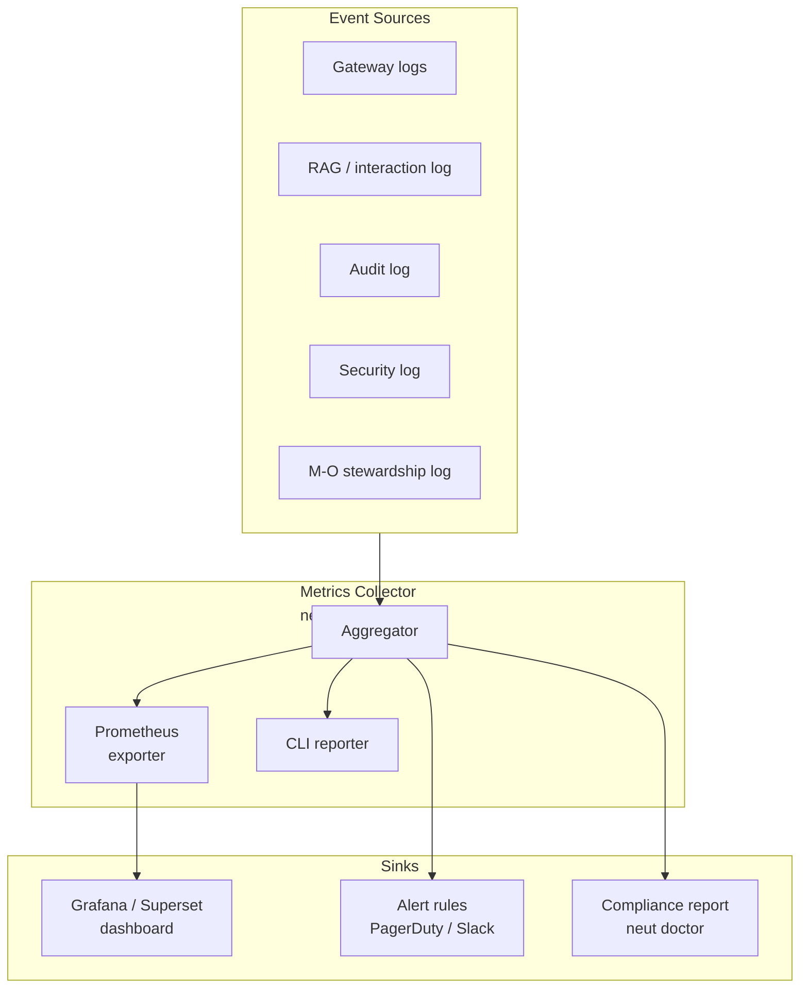

# Axiom Observability Tech Spec

**Status:** Draft
**Owner:** Ben Booth
**Created:** 2026-03-20
**Layer:** Axiom core

> **See also:**
> - [spec-logging.md](spec-logging.md) — Log infrastructure (JSONL streams, EC audit log)
> - [spec-agent-architecture.md](spec-agent-architecture.md) — Signal pipeline and agent design
> - [spec-model-routing.md](spec-model-routing.md) — LLM gateway and EC classification
> - [spec-rag-architecture.md](spec-rag-architecture.md) — RAG store and retrieval
> - [spec-metrics-framework.md](spec-metrics-framework.md) — Product success metrics and business KPIs

---

## 0. Purpose

Observability is the ability to understand system state from external outputs alone — without
attaching a debugger or reading source code. For a platform like Axiom — with async agents,
multiple LLM providers, RAG retrieval, export-control compliance boundaries, and knowledge
maturity pipelines — observability is not optional. It is the mechanism by which operators
trust the system.

Three pillars:

| Pillar | What it answers | Axiom status |
|--------|-----------------|--------------|
| **Logs** | "What happened and when?" | Covered in [spec-logging.md](spec-logging.md) |
| **Metrics** | "Is the system healthy right now?" | Covered in this spec |
| **Traces** | "Why did this specific request behave this way?" | Covered in this spec |

This spec covers metrics and traces. It does not redefine the log infrastructure —
it builds on top of it.

---

## 1. Observability Architecture

Axiom's observability stack has three layers: event sources (the existing JSONL log streams),
a metrics collector (derived aggregations), and sinks (dashboards, alerts, CLI).



### 1.1 Structured Logs (existing)

The foundation. JSONL event streams already in place:

| Log stream | Path | Written by |
|------------|------|------------|
| Audit log | `runtime/logs/audit/audit_events.jsonl` | Gateway, EC routing |
| Security log | `runtime/logs/security/security_events.jsonl` | EVE, D-FIB |
| Interaction log | `runtime/logs/interactions/` | Neut agent, RAG |
| Stewardship log | `runtime/logs/mo/` | M-O agent |
| System log | `runtime/logs/system/neut.log` | All components |

All appends use `locked_append_jsonl` per ADR-011. All records carry a `trace_id`
(see §4).

### 1.2 Metrics

Aggregations derived from structured logs and in-process counters. The taxonomy is defined
in §2. Collection infrastructure is phased (§6):

- **v1:** Log parsing at CLI time. No daemon required. `neut metrics` scans JSONL and
  computes aggregates on demand.
- **v2:** Lightweight in-process counter sidecar. Exposes `/metrics` endpoint for
  Prometheus scrape.
- **v3:** OpenTelemetry export to facility's existing observability stack.

No external APM vendor is required for v1. The design is Prometheus-compatible so v2
adoption is a drop-in.

### 1.3 Traces

Distributed trace context for multi-step agentic operations
(query → classify → retrieve → generate → crystallize).

- **v1:** `trace_id` correlation. All log entries for one user turn share the same
  `trace_id`. Sufficient to reconstruct a timeline from logs.
- **v2:** OpenTelemetry spans. Each step is a span with start/end timestamps, parent
  span pointer, and key attributes. Exported to Jaeger or Tempo.

---

## 2. Metrics Taxonomy

All metric names follow Prometheus conventions: lowercase, underscores, `axiom_` prefix,
labels in `{braces}`.

Types: **counter** (monotonically increasing), **gauge** (current value, can decrease),
**histogram** (distribution; exposes `_bucket`, `_sum`, `_count`).

### 2.1 Gateway / LLM

| Metric | Type | Description | Alert |
|--------|------|-------------|-------|
| `axiom_llm_requests_total{provider,tier,status}` | counter | All LLM calls, labelled by provider name, routing tier, and outcome (`success`/`error`/`timeout`) | — |
| `axiom_llm_latency_seconds{provider,tier}` | histogram | End-to-end gateway latency; track p50, p95, p99 | — |
| `axiom_llm_tokens_total{provider,tier,type}` | counter | Token consumption; `type` is `input`/`output`/`cached` | — |
| `axiom_llm_cache_hit_ratio{provider}` | gauge | Prompt cache hits / total requests for this provider | — |
| `axiom_llm_fallback_total{from_provider,to_provider}` | counter | Provider fallback events | — |
| `axiom_llm_error_rate{provider,error_type}` | gauge | Rolling error rate for this provider | Alert if > 5% over 5m |

`provider` label uses the stable `provider.name` from `ProviderBase` (ADR-012), never
bare technology names.

### 2.2 RAG / Retrieval

| Metric | Type | Description | Alert |
|--------|------|-------------|-------|
| `axiom_rag_retrievals_total{corpus_id,tier,scope}` | counter | All retrieval calls, labelled by corpus, access tier, and scope | — |
| `axiom_rag_retrieval_latency_ms{corpus_id}` | histogram | Retrieval wall-clock time | — |
| `axiom_rag_chunks_returned{corpus_id}` | histogram | Distribution of result set sizes | — |
| `axiom_rag_low_confidence_ratio` | gauge | Fraction of retrievals where `best_score < 0.15` | Alert if > 20% |
| `axiom_rag_corpus_size{corpus_id,tier}` | gauge | Current chunk count in corpus | — |
| `axiom_rag_stale_embeddings{corpus_id}` | gauge | Chunks with `needs_reembed = TRUE` | Alert if > 10% of corpus |

### 2.3 Knowledge Maturity

| Metric | Type | Description | Alert |
|--------|------|-------------|-------|
| `axiom_knowledge_interactions_total{tier,scope}` | counter | All interactions processed by the maturity pipeline | — |
| `axiom_knowledge_crystallized_total` | counter | Facts promoted to crystallized status | — |
| `axiom_knowledge_facts_pending_review` | gauge | Facts in review queue awaiting human approval | Alert if > 50 |
| `axiom_knowledge_facts_approved_total` | counter | Facts approved by a human reviewer | — |
| `axiom_knowledge_sweep_duration_seconds` | histogram | M-O crystallization sweep wall-clock time | — |
| `axiom_knowledge_feedback_signals{signal_type}` | counter | User feedback events; `signal_type` is `positive`/`negative`/`correction` | — |

### 2.4 Security

| Metric | Type | Description | Alert |
|--------|------|-------------|-------|
| `axiom_security_injection_detected_total{corpus_id}` | counter | Prompt injection attempts detected during ingestion | Alert on any increment |
| `axiom_security_ec_leakage_suspected_total` | counter | Suspected EC content in non-EC response | Alert on any increment |
| `axiom_security_response_scan_hits_total{tier}` | counter | Response scanner pattern matches by routing tier | — |
| `axiom_security_hardened_preamble_applied_total` | counter | EC sessions where hardened system preamble was applied | — |

Security alerts are absolute, not threshold-based: any increment in `ec_leakage_suspected_total`
or `injection_detected_total` triggers immediate response.

### 2.5 Agent Activity

| Metric | Type | Description | Alert |
|--------|------|-------------|-------|
| `axiom_agent_runs_total{agent,status}` | counter | Agent invocations; `status` is `success`/`error`/`timeout` | — |
| `axiom_agent_latency_seconds{agent}` | histogram | Agent wall-clock time per run | — |
| `axiom_signal_ingested_total{source_type}` | counter | Signals ingested by EVE; `source_type` matches extractor name | — |
| `axiom_signal_extraction_latency_ms{extractor}` | histogram | Per-extractor processing time | — |

`agent` label values: `neut`, `eve`, `mo`, `prt`, `dfib`.

### 2.6 M-O Stewardship

| Metric | Type | Description | Alert |
|--------|------|-------------|-------|
| `axiom_mo_sweep_total{sweep_type,status}` | counter | M-O sweep runs by type (`archive`/`reembed`/`crystallize`) and outcome | — |
| `axiom_archive_size_bytes` | gauge | Total size of the managed archive | — |
| `axiom_stale_file_candidates` | gauge | Files identified as stale and pending review | — |

### 2.7 Prompt Registry

| Metric | Type | Description | Alert |
|--------|------|-------------|-------|
| `axiom_prompt_template_resolved_total{template_id,version}` | counter | Template resolutions by ID and version | — |
| `axiom_prompt_cache_hint_ratio` | gauge | Fraction of completions using cached template blocks | — |

---

## 3. Alert Rules

Alerts are evaluated against the metrics defined in §2. In v1 these are implemented as
D-FIB diagnostic checks (`neut doctor`). In v2 they are Prometheus alerting rules.

| Alert name | Condition | Severity | Default responder |
|-----------|-----------|----------|-------------------|
| `ECLeakageSuspected` | `ec_leakage_suspected_total` increases | CRITICAL | D-FIB + human escalation |
| `InjectionDetected` | `injection_detected_total` increases | HIGH | EVE re-scan |
| `LLMErrorRateHigh` | `llm_error_rate > 0.10` for 5m | HIGH | Neut (provider fallback) |
| `LLMErrorRateElevated` | `llm_error_rate > 0.05` for 5m | MEDIUM | Neut |
| `LowRAGConfidence` | `rag_low_confidence_ratio > 0.30` for 1h | MEDIUM | M-O (corpus review) |
| `ReviewQueueBackedUp` | `facts_pending_review > 100` | MEDIUM | M-O |
| `ReviewQueueWarning` | `facts_pending_review > 50` | LOW | M-O |
| `StaleEmbeddingsHigh` | `stale_embeddings > 20%` of corpus | LOW | M-O (reembed sweep) |

Severity definitions:
- **CRITICAL** — Compliance or security boundary potentially breached. Requires immediate human review. Stop serving affected tier if necessary.
- **HIGH** — Service degraded, users affected. Automated recovery attempted; human notified if unresolved in 15m.
- **MEDIUM** — Quality degrading. No immediate user impact; ticket created, M-O scheduled.
- **LOW** — Hygiene issue. Batched into next M-O sweep.

---

## 4. Distributed Tracing

### 4.1 Trace Context Model

Every user-initiated operation generates a `trace_id` at gateway entry. The `trace_id`
propagates through all downstream calls and is written into every log record for that
operation.

```
User turn
│
├── trace_id = "t-7f3a9c..."  (UUID4, generated at Gateway._handle_request)
│
├── Classification step      → audit_events.jsonl {trace_id, step="classify", ...}
├── RAG retrieval            → interaction_log   {trace_id, step="retrieve", ...}
├── LLM completion           → audit_events.jsonl {trace_id, step="generate", ...}
├── Response sanitization    → security_events.jsonl {trace_id, step="sanitize", ...}
└── Crystallization check    → mo stewardship log {trace_id, step="crystallize", ...}
```

Reconstructing the full timeline for any turn requires only:
```bash
grep '"trace_id": "t-7f3a9c"' runtime/logs/**/*.jsonl | sort -k1
```

### 4.2 v1 — Correlation ID

Requirements:
- `trace_id` field present in **all** structured log records
- Generated at gateway entry; passed as a parameter through all subsystem calls
- Written to `interaction_log` records so it can be surfaced in `neut metrics --trace <id>`
- Format: `"t-" + UUID4` (the prefix avoids ambiguity when grepping mixed logs)

### 4.3 v2 — OpenTelemetry Spans

Each step in the agentic pipeline becomes an OTel span:

| Span name | Parent | Key attributes |
|-----------|--------|----------------|
| `axiom.gateway.request` | root | `llm_provider`, `routing_tier` |
| `axiom.gateway.classify` | gateway.request | `classification_result`, `latency_ms` |
| `axiom.rag.retrieve` | gateway.request | `corpus_id`, `chunks_returned`, `best_score` |
| `axiom.gateway.generate` | gateway.request | `llm_provider`, `tokens_in`, `tokens_out` |
| `axiom.gateway.sanitize` | gateway.request | `scan_hits`, `tier` |
| `axiom.mo.crystallize` | gateway.request | `facts_extracted`, `facts_pending` |

OTel export target: Jaeger (self-hosted) or Grafana Tempo. The exporter is configured
in `runtime/config/observability.toml` (not in source).

### 4.4 Trace Context Propagation Rules

1. `trace_id` is created once per gateway entry point — never inside a subsystem.
2. Subsystems accept `trace_id` as a parameter; they do not generate their own.
3. If a subsystem calls another subsystem (e.g., M-O calls the LLM gateway for a
   summarization step), the same `trace_id` is forwarded.
4. Background sweeps (M-O archive, reembed) generate their own `trace_id` per sweep
   run, prefixed `"sweep-"`.

---

## 5. CLI Interface

### `neut metrics`

Show current metric snapshot in human-readable format. Derived from log parsing (v1).

```
$ neut metrics

Axiom Metrics Snapshot  (as of 2026-03-20 14:32 UTC)
─────────────────────────────────────────────────────
LLM Gateway
  Requests (24h)    : 1,204   success=1,189  error=15  (1.2% error rate)
  Latency p95       : 4.2s    [qwen-tacc-ec]  2.8s [claude-haiku]
  Tokens (24h)      : 2.1M in / 340K out / 180K cached
  Fallbacks         : 3

RAG
  Retrievals (24h)  : 847
  Low confidence    : 6.2%   (threshold 20%)
  Stale embeddings  : 1.8%   (threshold 10%)
  Corpus size       : 14,320 chunks

Knowledge Maturity
  Interactions (24h): 847
  Facts crystallized: 38
  Pending review    : 12     (threshold 50)
  Feedback signals  : 74 positive / 8 negative / 3 corrections

Security
  Injection attempts: 0
  EC leakage suspect: 0
  Response scan hits: 2

Agents (24h)
  neut runs         : 847  (success=841, error=6)
  mo sweeps         : 4    (success=4, error=0)
  eve signals       : 23
```

### `neut metrics --prometheus`

Output Prometheus text format for scraping or manual inspection.

```
$ neut metrics --prometheus

# HELP axiom_llm_requests_total Total LLM requests
# TYPE axiom_llm_requests_total counter
axiom_llm_requests_total{provider="qwen-tacc-ec",tier="export_controlled",status="success"} 412
axiom_llm_requests_total{provider="claude-haiku",tier="standard",status="success"} 777
...
```

### `neut doctor --metrics`

D-FIB metric health check. Evaluates all alert rules defined in §3 and summarises anomalies.

```
$ neut doctor --metrics

D-FIB Metric Health Check
──────────────────────────
PASS  EC leakage suspected     : 0 events (last 24h)
PASS  Injection detected       : 0 events (last 24h)
PASS  LLM error rate           : 1.2% (threshold 5%)
PASS  RAG low confidence ratio : 6.2% (threshold 20%)
PASS  Review queue             : 12 pending (threshold 50)
PASS  Stale embeddings         : 1.8% (threshold 10%)

All checks passed. System healthy.
```

### `neut metrics --trace <trace_id>`

Reconstruct the timeline for a single operation.

```
$ neut metrics --trace t-7f3a9c44-...

Trace: t-7f3a9c44-...  (2026-03-20 14:31:02 UTC)
──────────────────────────────────────────────────
14:31:02.001  classify     latency=120ms  result=standard
14:31:02.122  retrieve     latency=88ms   corpus=neutron-general chunks=5 best_score=0.82
14:31:02.211  generate     latency=3,840ms provider=claude-haiku tokens_in=2,104 tokens_out=312
14:31:06.051  sanitize     latency=12ms   scan_hits=0
14:31:06.063  crystallize  latency=45ms   facts_extracted=2 facts_pending=14

Total wall-clock: 4,062ms
```

---

## 6. Collection Infrastructure

### Phase 1 — Log-derived metrics (v1, current)

No daemon. `neut metrics` scans JSONL logs and computes aggregates at CLI invocation time.

- Suitable for daily operational use and `neut doctor` checks.
- Latency: seconds (acceptable for manual inspection, not for dashboards).
- Cost: zero infrastructure overhead.

### Phase 2 — Prometheus exporter (v2)

Lightweight in-process counter sidecar. Increments counters in-process as events occur.
Exposes `GET /metrics` in Prometheus text format.

- Scrape interval: 15s (default Prometheus).
- Dashboard: Grafana with dashboard templates committed to `infra/grafana/`.
- Alert rules: `infra/prometheus/alerts.yaml`.

No external APM vendor required. Prometheus and Grafana are self-hosted at the facility.

### Phase 3 — OpenTelemetry (v3)

OTel SDK integrated at gateway and agent layer. Spans exported to Jaeger or Grafana Tempo.

- Configured via `runtime/config/observability.toml` (gitignored, not in source).
- Export target is facility-specific (self-hosted Jaeger, or OTLP endpoint).
- Adds full distributed tracing for multi-hop agentic RAG loops.

### Configuration

```toml
# runtime/config/observability.toml (gitignored)
[metrics]
enabled = true
prometheus_port = 9090           # v2 only

[tracing]
enabled = false                  # true in v2+
exporter = "jaeger"              # "jaeger" | "tempo" | "otlp"
endpoint = "http://jaeger:14268/api/traces"

[alerts]
ec_leakage_notify = "security@facility.example.com"
injection_notify = "ops@facility.example.com"
slack_webhook = ""               # optional
```

---

## 7. Implementation Phases

| Phase | Deliverable | Prerequisite |
|-------|-------------|--------------|
| **Phase 1** | `trace_id` in all log records; `neut metrics` CLI; D-FIB alert checks via `neut doctor --metrics` | spec-logging.md implemented |
| **Phase 2** | Prometheus exporter sidecar; Grafana dashboard templates; alert rules as `alerts.yaml` | Phase 1 complete |
| **Phase 3** | OTel SDK integration; Jaeger/Tempo span export; `neut metrics --trace` backed by OTel | Phase 2 complete; facility has OTel endpoint |

Phase 1 is the minimum viable observability baseline. It provides sufficient signal to
operate the system safely and respond to the CRITICAL/HIGH alerts in §3.

---

## 8. Domain Extension Points

Axiom defines the metric names, types, collection infrastructure, and alert rules in
this spec. NeutronOS and other domain layers extend observability in two ways:

1. **Additional metrics** — Domain extensions may define their own `axiom_*`-prefixed
   metrics (use `domain_*` prefix for domain-specific metrics, e.g.,
   `neutronos_reactor_sim_runs_total`).
2. **Nuclear-specific thresholds** — Alert thresholds for nuclear compliance checks
   (e.g., surveillance check completion rate) belong in the NeutronOS extension config,
   not in Axiom core.

The product-level success metrics (KPIs, business outcomes, nuclear SLAs) are tracked
separately in [spec-metrics-framework.md](spec-metrics-framework.md).
