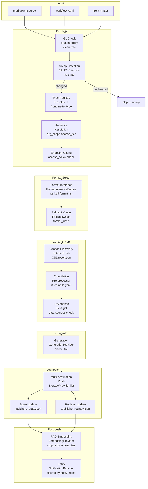

# Publisher Architecture Specification

**Version**: 0.8.0-draft · **Date**: 2026-03-13 · **Status**: Draft

---

## Overview

This specification describes the architecture of the Publisher extension and defines the design of its planned capabilities. It is the engineering counterpart to the Publisher PRD (`prd-publisher.md`), which defines the *what*; this document defines the *how*. Publisher is a domain-agnostic document lifecycle tool — the architecture described here applies equally to nuclear research organizations, pharmaceutical companies, aerospace programs, clinical research teams, and any other context where technical documents carry scientific, regulatory, or operational weight.

The v0.3 Publisher established a working provider model — pluggable generation, storage, feedback, and notification backends — with a linear pipeline from markdown source to published artifact. The v0.4 design extends that model to add format-endpoint compatibility declarations, a format inference engine, a graceful fallback chain, and a machine-readable endpoint catalog. A placeholder section for the future audience system is also included.

The v0.5 design adds six further capabilities: a document type and template registry (§11) that bundles per-type generation defaults and allows `type: journal-paper` in front matter to imply PDF output and citation support; PDF and HTML generation providers (§12) that complete the PLT_PUB_001 generation matrix; a citation and bibliography pipeline (§13) that exposes pandoc's native `--citeproc` support with automatic `.bib` discovery; document compilation (§14) for assembling multi-file documents from an ordered manifest; a draft scaffold generator (§15) that builds structured markdown skeletons from source notes; and data source provenance tracking (§16) that records and monitors declared data dependencies so authors are warned when source data changes after publication.

The v0.6 design adds four further capabilities: interactive web publication (§17) via a three-tier model from standalone HTML to full interactive experience; the complete CLI and slash command architecture (§18) with a full noun/verb reference across all extensions and four publisher slash commands (`/pub`, `/draft`, `/review`, `/compile`); a living worked example using the AWS budget proposal document (§19) that demonstrates every v0.5/v0.6 capability in a real research scenario; and template onboarding (§20) — `neut pub template add` — which makes adding a new document or endpoint template a self-configuring, guided experience rather than a manual multi-file edit.

The v0.7 design adds five further capabilities: multi-destination publishing (§8) allowing the `storage` key to accept a list of providers so a single push delivers to multiple endpoints simultaneously; the publisher agent (§24) — a new `publisher_agent/` extension implementing the scan→propose→approve→push loop for autonomous document stewardship; reverse ingestion (§22) via a `PullProvider` ABC that pulls remote documents into local markdown and records source-of-truth declarations; document drift detection (§23) that compares remote published documents against their declared local source using both SHA-based and LLM-assisted methods; and resolution of all five open questions from v0.4 (§10). The `neut pub publish` verb is renamed to `neut pub push` throughout the CLI for clarity.

The v0.8 design adds dedicated spec sections for PLT_PUB_006 (Feedback/Review — §25), PLT_PUB_007 (Notifications — §26), and PLT_PUB_012 (RAG/Embedding corpus routing — §27); a redrawn v0.7 pipeline diagram in §2 covering all 17 stages from input to notification; full multi-destination failure handling semantics with the `neut pub push --retry` recovery flow (§1.6); and the `neut pub type add` onboarding wizard for registering new document types without manual YAML editing (§6.8).

---

## §1 · Current Architecture

### 1.1 Provider Model

Publisher is organized around four abstract base classes (ABCs), each representing one stage of the publish pipeline:

- **`GenerationProvider`** — Converts a markdown source file to a rendered artifact of a specific format. Current implementation: `PandocDocxProvider` (produces `.docx`).
- **`StorageProvider`** — Uploads a rendered artifact to a destination endpoint and returns a durable URL. Current implementations: `LocalStorageProvider`, `OneDriveStorageProvider`. Planned: `GcsStorageProvider`, `FirebaseHostingStorageProvider`, `VertexAiSearchStorageProvider`.
- **`FeedbackProvider`** — Retrieves an artifact from a storage endpoint and extracts reviewer annotations. Current implementation: `DocxCommentsProvider`.
- **`NotificationProvider`** — Notifies stakeholders after a publish or review event. Current implementations: `TerminalNotificationProvider`, `SmtpNotificationProvider`.

An `EmbeddingProvider` interface is reserved in the configuration schema but has no current implementation.

### 1.2 Factory and Self-Registration

Providers register themselves with `PublisherFactory` at import time using a decorator or class-level `provider_id` attribute. The factory resolves provider names from config strings (e.g., `"pandoc-docx"`) to provider instances without requiring the engine to know about concrete implementations.

### 1.3 State and Registry

Publisher state is backed by PostgreSQL when a database is configured (see §29 for the full multi-agent safety design). In that mode the JSON files described below are export-only outputs of `neut pub export-state`, never the live store.

**When running without a database (single-agent mode):**

`.publisher-state.json` — Per-workspace state file. Tracks each document's last published commit SHA, artifact SHA256, version number, publish timestamp, and current status (draft / published / stale).

`.publisher-registry.json` — Per-workspace registry. Maps `doc_id → published_url` for cross-document link rewriting. Updated on every successful publish.

`.publisher.json` — Per-directory manifest for tracking external SharePoint / OneDrive artifact URLs separate from the registry.

**When running with a database (multi-agent mode):**

All state above is stored in the `publisher` schema PostgreSQL tables: `publisher_documents`, `publisher_destinations`, `publisher_registry`, `publisher_proposals`, `publisher_push_log`. Advisory locks on `doc_id` prevent concurrent push corruption. See §29 for schema, migration path, and concurrency model.

### 1.4 Engine Workflow (v0.7)

The engine executes the following steps for `neut pub push`:

1. **Git check** — Verify branch policy (`publish_branches` / `draft_branches`) and optionally require a clean working tree.
2. **No-op detection** — Compute SHA256 of the markdown source. Compare against the last recorded hash in state. Skip if unchanged.
3. **Type Registry Resolution** — Read the `type:` field from the document's YAML front matter. Resolve it to a `DocumentType` via `DocumentTypeRegistry` (§11). Type defaults (format, citation style, audience hint, fallback policy) are merged into the engine config; explicit CLI flags and `workflow.yaml` values take precedence.
4. **Audience Resolution + Endpoint Gating** — `AudienceResolver.resolve()` determines the effective `DocumentAudience` (§7) from front matter, type hint, and CLI override. `check_endpoint_policy()` immediately validates the target endpoint kind against `access_policy`. If the tier is not allowed for the configured endpoint, the pipeline is aborted before any generation work begins.
5. **Format Inference** — `FormatInferenceEngine.rank()` scores candidate formats against content signals (tables, math, mermaid, citations, length) and the audience declaration (§7.5). Returns a ranked list of `InferenceResult` objects.
6. **Fallback Chain** — `FallbackChain.resolve()` selects the highest-ranked format actually supported by the target endpoint. If `was_fallback = True`, a warning is recorded and will be surfaced in terminal output. Raises `NoCompatibleFormatError` if the chain is exhausted.
7. **Citation Discovery** — `CitationResolver.resolve()` locates the bibliography file (front matter → adjacent `.bib` → `refs.bib` → type default) and CSL style (front matter → type → workspace default). Pandoc citation args are prepared but not yet invoked.
8. **Compilation Pre-processor** — If a `.compile.yaml` manifest is present (or the source path is itself a compiled manifest target), `Compiler.compile()` concatenates ordered source files into a single temporary `.md` file. This combined file is passed to subsequent stages in place of the original source. This step is skipped if no compilation manifest exists.
9. **Provenance Pre-flight** — `DataProvenanceChecker.check()` compares declared `data-sources` against stored records. If any source has changed since the last push: when `provenance.strict = true`, the pipeline is aborted with `ProvenanceError`; otherwise, warnings are emitted and the pipeline continues.
10. **Generation** — Invoke the resolved `GenerationProvider` to render the artifact file. Citation args from step 7 are injected into the pandoc invocation.
11. **Multi-destination Push** — Iterate over the configured `storage` providers list. Each provider receives the same generated artifact and returns a per-destination result (URL, success/failure). Provider failure behavior is governed by the `required` field (see §1.6). All per-destination results are collected regardless of individual success/failure.
12. **State Update** — Write the new commit SHA, artifact SHA256, version, `format_used`, `fallback_occurred`, and the full `destinations` list to `.publisher-state.json`. State is only written after all required providers have succeeded.
13. **Registry Update** — Write the resolved URL for the primary (first) destination to `.publisher-registry.json` for this `doc_id`. Cross-document link rewriting consumers use this registry.
14. **RAG Embedding** — If `EmbeddingProvider` is configured and the document's `access_tier` is not excluded by `embedding.corpus_routing`, call `EmbeddingProvider.embed()` to chunk and embed the markdown source into the appropriate scoped corpus (§27). This step is skipped silently if no `EmbeddingProvider` is configured.
15. **Notify** — Invoke the configured `NotificationProvider`(s) with a `PushSummary` containing the full per-destination results. Recipients are filtered to `audience.notify_roles` contacts (§7.7); if `notify_roles` is empty, the workspace-level `notification.recipients` list is used.

### 1.5 State Schema Reference

The following JSON example shows all fields present in `.publisher-state.json` across versions v0.3 through v0.7:

```json
{
  "doc_id": "q1-summary",
  "source_path": "docs/reports/q1-summary.md",
  "status": "published",
  "version": "v1.2.0",
  "last_push_timestamp": "2026-03-10T14:32:01+00:00",
  "source_commit_sha": "abc123",
  "artifact_sha256": "deadbeef...",
  "format_used": "pdf",
  "fallback_occurred": false,
  "original_format_preference": "pdf",
  "destinations": [
    {
      "provider": "local",
      "url": "docs/_tools/generated/q1-summary.pdf",
      "pushed_at": "2026-03-10T14:32:01+00:00",
      "success": true
    },
    {
      "provider": "onedrive",
      "url": "https://onedrive.live.com/...",
      "pushed_at": "2026-03-10T14:32:03+00:00",
      "success": true
    }
  ],
  "data_sources": [
    {
      "path": "data/q1-results.csv",
      "sha256": "aabbcc...",
      "mtime": 1741600000.0,
      "recorded_at": "2026-03-10T14:32:01+00:00"
    }
  ],
  "source_of_truth_declaration": null
}
```

`source_of_truth_declaration` is non-null only for reverse-ingested documents (PLT_PUB_022). When set, it contains `{authoritative_source_path, declared_by, declared_at}`.

### 1.6 Multi-destination Failure Handling

When storage is configured as a list, each provider is attempted independently. Failure behavior is governed by the `required` field on each provider entry:

- `required: true` (default for the first provider): any failure aborts the pipeline before state or registry are updated. No partial state is written.
- `required: false`: failure is logged as a warning; push continues to remaining providers. State records the failed destination with `success: false`.

The engine never leaves state in a partially-updated condition for required providers. For optional providers, the state file records exactly which destinations succeeded.

Terminal output on partial failure:

```
✓  local            docs/_tools/generated/report.pdf
⚠  github-pages     failed: authentication error (token expired)
   Run: neut pub push --provider github-pages --retry to retry failed destinations
```

`neut pub push --retry` re-attempts only destinations that recorded `success: false` in the most recent push without re-generating the artifact.

---

## §2 · Pipeline Diagram (v0.7)



---

## §3 · Format-Endpoint Compatibility System

### 3.1 Motivation

In v0.3, the engine assumes the configured `StorageProvider` can accept whatever format the `GenerationProvider` produces. This breaks when, for example, a GitLab Pages endpoint receives a `.docx` file it cannot serve, or when a new `PandocPdfProvider` is added but the target OneDrive folder is configured to accept only `.docx`. Compatibility must be declared and enforced.

### 3.2 `FormatCapability` Dataclass

```python
from dataclasses import dataclass

@dataclass
class FormatCapability:
    format_id: str        # e.g. "docx", "pdf", "html", "txt", "latex", "epub"
    mime_type: str        # e.g. "application/vnd.openxmlformats-officedocument..."
    quality_score: float  # 0.0–1.0; endpoint's native fit for this format
    notes: str = ""       # human-readable caveat, e.g. "rendered server-side"
```

`quality_score` represents how well the endpoint serves this format — not whether it is technically capable. For example, a SharePoint endpoint may technically accept HTML (`quality_score: 0.5`) but natively renders DOCX with full fidelity (`quality_score: 1.0`).

**Defined format IDs:**

| `format_id` | MIME type | Description |
|-------------|-----------|-------------|
| `docx` | `application/vnd.openxmlformats-officedocument.wordprocessingml.document` | Microsoft Word |
| `pdf` | `application/pdf` | Portable Document Format |
| `html` | `text/html` | Standalone HTML |
| `md` | `text/markdown` | Markdown source |
| `txt` | `text/plain` | Plain text |
| `latex` | `application/x-latex` | LaTeX source |
| `epub` | `application/epub+zip` | E-book format |
| `pptx` | `application/vnd.openxmlformats-officedocument.presentationml.presentation` | PowerPoint |
| `xlsx` | `application/vnd.openxmlformats-officedocument.spreadsheetml.sheet` | Excel workbook |
| `odt` | `application/vnd.oasis.opendocument.text` | OpenDocument Text |
| `rst` | `text/x-rst` | reStructuredText |
| `ipynb` | `application/x-ipynb+json` | Jupyter notebook |
| `chunks` | `application/x-neut-chunks` | Embedding chunks (RAG endpoints only) |
| `*` | — | **Wildcard**: endpoint accepts any format without enforcement (see §3.5) |

### 3.3 Updated `StorageProvider` ABC

```python
from abc import ABC, abstractmethod
from typing import List

class StorageProvider(ABC):

    @property
    def supported_formats(self) -> List[FormatCapability]:
        """
        Declare which formats this endpoint can accept.
        Default returns ["docx"] for backward compatibility with v0.3 providers.
        Override in subclasses to declare full format support.
        """
        return [FormatCapability(
            format_id="docx",
            mime_type="application/vnd.openxmlformats-officedocument"
                      ".wordprocessingml.document",
            quality_score=1.0,
        )]

    @abstractmethod
    def upload(self, artifact_path: str, doc_id: str, version: str) -> str:
        """Upload artifact and return a durable URL."""
        ...

    @abstractmethod
    def pull(self, doc_id: str, destination: str) -> str:
        """Download the latest artifact for doc_id to destination."""
        ...
```

The default implementation of `supported_formats` returns only `docx`, preserving backward compatibility for any v0.3 `StorageProvider` subclass that does not override it.

### 3.4 Wildcard Format (`"*"`) for Pass-Through Endpoints

Some storage targets are agnostic to file format — they store whatever artifact they receive without serving or transforming it. Examples: S3 / MinIO for archival use, local filesystem, HPC tape stores, Box enterprise storage. For these endpoints it would be both misleading and maintenance-burdening to enumerate every possible format.

When `supported_formats` contains `"*"`, the endpoint declares format-agnosticism:

```python
# CatalogEntry in builtin_catalog.yaml
- name: s3
  supported_formats: ["*"]          # accepts any artifact type
  ...

- name: local
  supported_formats: ["*"]          # filesystem stores whatever it receives
  ...
```

The `FormatCapability` for the wildcard entry has `quality_score: 0.5` by default — it is always compatible but never preferred over an endpoint with an explicit format match. The format inference engine (§4) treats `"*"` as a lowest-priority match: it satisfies format compatibility checking without influencing ranking.

**Effect on the fallback chain (§5):** A `"*"` endpoint is always included as a valid candidate. It is placed at the end of the ranked list so explicit format matches are always preferred.

**Effect on `neut pub endpoints` output:**

```
local        local    *         —    —    Format-agnostic filesystem storage
s3           cloud    *         ✓    —    S3-compatible; accepts any artifact type
```

**When NOT to use `"*"`:** Endpoints that render or transform the artifact (GitHub Pages rendering HTML, Google Docs converting DOCX, GitLab wiki parsing Markdown) should enumerate their actual accepted formats. `"*"` is for byte-passthrough storage, not rendering endpoints.

### 3.5 `FormatCapability` for Wildcard

```python
WILDCARD_FORMAT = FormatCapability(
    format_id="*",
    mime_type="application/octet-stream",
    quality_score=0.5,
    notes="Accepts any format; format validation skipped",
)
```

A provider whose `supported_formats` list contains a `FormatCapability` with `format_id="*"` is recognized by the engine as pass-through. The compatibility check in §5 short-circuits to `compatible=True` without inspecting the format further.

---

## §4 · Format Inference Engine

### 4.1 Purpose

When a user does not specify an explicit format, Publisher should select the best format for the document's content and the target endpoint's capabilities. The `FormatInferenceEngine` encapsulates this logic.

### 4.2 Class Definition

```python
from dataclasses import dataclass, field
from typing import List, Optional, Tuple

@dataclass
class ContentSignals:
    has_tables: bool = False
    has_mermaid: bool = False
    has_math: bool = False          # LaTeX math blocks
    has_citations: bool = False     # pandoc-citeproc / bibliography
    estimated_length: int = 0       # word count estimate
    has_code_blocks: bool = False

@dataclass
class InferenceResult:
    format_id: str
    confidence_score: float         # 0.0–1.0
    reason: str

class FormatInferenceEngine:

    def analyze(self, markdown_source: str) -> ContentSignals:
        """Parse markdown source and return content signals."""
        ...

    def rank(
        self,
        signals: ContentSignals,
        user_preference: Optional[str],
        endpoint_capabilities: List[FormatCapability],
    ) -> List[InferenceResult]:
        """
        Return a ranked list of (format_id, confidence, reason) tuples,
        best match first. Only formats supported by the endpoint are included.
        """
        ...
```

### 4.3 Content Signals → Format Preference

| Signal | Favors | Against |
|--------|--------|---------|
| `has_mermaid = True` | `html` (native rendering) | `pdf`, `docx` (static image fallback) |
| `has_math = True` | `pdf` (LaTeX backend), `latex` | `docx`, `html` |
| `has_citations = True` | `pdf`, `latex` | `html`, `txt` |
| `has_tables = True` | `docx`, `pdf` | `txt` |
| `estimated_length > 10000` | `pdf`, `docx` (paginated) | `html` (single page) |
| `has_code_blocks = True` | `html` (syntax highlighting) | `docx` |

The inference engine scores each format by summing signal weights for the detected content features, then filters the ranked list to only formats supported by the target endpoint. If `user_preference` is set, that format is pinned to rank 0 (highest) regardless of signal scoring, unless the endpoint does not support it — in which case it is moved to the fallback chain.

---

## §5 · Graceful Fallback Chain

### 5.1 Purpose

When the user's preferred format (whether explicit or inferred) is not supported by the target endpoint, Publisher should not fail silently or abort. It should attempt a sequence of alternative formats in priority order, surface what happened, and record the deviation in state.

### 5.2 `FallbackResult` Dataclass

```python
@dataclass
class FallbackResult:
    format_used: str                # format that was actually used
    was_fallback: bool              # True if format_used != original_preference
    original_preference: str        # what the user/inference engine wanted
    reason: str                     # human-readable explanation
    attempted_formats: List[str] = field(default_factory=list)
```

### 5.3 Default Fallback Chain

```
user_preferred → pdf → html → txt
```

The chain is configurable via `workflow.yaml` (see §8). If none of the formats in the chain are supported by the endpoint, Publisher raises a `NoCompatibleFormatError` with the list of attempted formats and a suggestion to consult `neut pub endpoints`.

### 5.4 `FallbackChain` Class

```python
class FallbackChain:

    DEFAULT_CHAIN = ["pdf", "html", "txt"]

    def __init__(
        self,
        user_preference: str,
        endpoint: StorageProvider,
        chain: Optional[List[str]] = None,
    ):
        self.user_preference = user_preference
        self.endpoint = endpoint
        self.chain = chain or self.DEFAULT_CHAIN

    def resolve(self) -> FallbackResult:
        """
        Attempt formats in order. Return a FallbackResult describing
        which format was selected and whether a fallback occurred.
        Raises NoCompatibleFormatError if the chain is exhausted.
        """
        supported = {fc.format_id for fc in self.endpoint.supported_formats}
        candidates = [self.user_preference] + [
            f for f in self.chain if f != self.user_preference
        ]
        attempted = []
        for fmt in candidates:
            attempted.append(fmt)
            if fmt in supported:
                return FallbackResult(
                    format_used=fmt,
                    was_fallback=(fmt != self.user_preference),
                    original_preference=self.user_preference,
                    reason="" if fmt == self.user_preference
                           else f"endpoint does not support '{self.user_preference}'",
                    attempted_formats=attempted,
                )
        raise NoCompatibleFormatError(
            f"No compatible format found after trying: {attempted}"
        )
```

### 5.5 User-Facing Surfacing

When `was_fallback = True`, the `TerminalNotificationProvider` emits a warning block:

```
WARNING  Format fallback occurred
         Requested : pdf
         Used      : html
         Reason    : endpoint 'onedrive' does not support 'pdf'
         Tip       : run `neut pub endpoints` to find endpoints that support pdf
```

The fallback is also recorded in `.publisher-state.json` under the `format_used` and `fallback_occurred` fields for that document.

---

## §6 · Endpoint Catalog

### 6.1 Purpose

A machine-readable catalog allows Publisher to answer questions like "which endpoints can deliver a PDF?" without requiring the user to read documentation. It also enables the engine to suggest alternatives when a format-endpoint mismatch occurs.

### 6.2 `CatalogEntry` Dataclass

```python
@dataclass
class CatalogEntry:
    name: str                       # unique identifier, e.g. "onedrive"
    kind: str                       # "cloud" | "local" | "enterprise" | "hpc"
    supported_formats: List[str]    # list of format_id strings
    requires_auth: bool
    requires_vpn: bool
    description: str
    supports_pull: bool = False     # True if a PullProvider exists (PLT_PUB_022)
    setup_doc_url: str = ""
    embedding_capable: bool = False # True if this endpoint is an embedding target (RAG corpus)
                                    # rather than a file storage target; format_id is "chunks"
```

`supports_pull` indicates whether reverse ingestion (PLT_PUB_022) is supported for this endpoint — i.e., whether a `PullProvider` implementation exists or is planned. Endpoints that support pull are candidates for the publisher agent's drift detection loop.

### 6.3 Built-in Catalog

#### Local and Filesystem

| Name | Kind | Formats | Auth | VPN | Pull | Description |
|------|------|---------|------|-----|------|-------------|
| `local` | local | `*` | No | No | — | Local filesystem — byte-passthrough, accepts any generated artifact |

#### Microsoft Ecosystem

| Name | Kind | Formats | Auth | VPN | Pull | Description |
|------|------|---------|------|-----|------|-------------|
| `onedrive` | cloud | docx, pdf, html | Yes | No | ✓ | Microsoft OneDrive via Graph API; supports pull via Graph API file download |
| `sharepoint` | enterprise | docx, pdf, html | Yes | Yes | ✓ | SharePoint document library via Microsoft Graph; common enterprise review endpoint |
| `ms-teams` | enterprise | docx, pdf | Yes | Yes | — | Microsoft Teams channel files (SharePoint-backed); push delivers to the team's Files tab |
| `azure-blob` | cloud | `*` | Yes | No | — | Azure Blob Storage; byte-passthrough object storage |

#### Google Workspace

| Name | Kind | Formats | Auth | VPN | Pull | Description |
|------|------|---------|------|-----|------|-------------|
| `google-drive` | cloud | docx, pdf, html | Yes | No | ✓ | Google Drive via Drive API v3; file upload (not converted to Docs format) |
| `google-docs` | cloud | docx, pdf | Yes | No | ✓ | Creates or updates a Google Doc via Drive API; source is converted to Google Docs format, enabling native Google Docs comment annotation (PLT_PUB_006) |
| `google-sites` | cloud | html | Yes | No | — | Google Sites web page via Sites API; Tier 1 web publication for Google Workspace organizations |

#### GCP / Google Cloud

| Name | Kind | Formats | Auth | VPN | Pull | Description |
|------|------|---------|------|-----|------|-------------|
| `gcs` | cloud | `*` | Yes | No | — | Google Cloud Storage via Storage JSON API; byte-passthrough object storage; S3-compatible via HMAC interoperability |
| `gcs-static` | cloud | html, txt | Yes | No | — | GCS static website hosting (public bucket + CNAME or Cloud CDN); Tier 1 web publication on GCP |
| `firebase-hosting` | cloud | html, txt | Yes | No | — | Firebase Hosting via `firebase deploy`; CDN-backed, versioned channels; Tier 1 web publication for Firebase projects |
| `vertex-ai-search` | cloud | chunks | Yes | No | ✓ | Vertex AI Search (formerly Enterprise Search) corpus; embedding-capable endpoint for RAG over Google-hosted data; pull queries corpus for drift detection |

`vertex-ai-search` is the GCP equivalent of `rag-internal`/`rag-public`. It accepts chunked content for indexing and supports pull-style corpus queries for the publisher agent's drift detection loop. Set `embedding_capable: true`.

Auth for all GCP endpoints uses Application Default Credentials (ADC): `gcloud auth application-default login` or a service account key path in `workflow.yaml`. No separate per-endpoint token management.

#### AWS

| Name | Kind | Formats | Auth | VPN | Pull | Description |
|------|------|---------|------|-----|------|-------------|
| `s3` | cloud | `*` | Yes | No | — | AWS S3 or S3-compatible (MinIO); byte-passthrough object storage |
| `s3-static` | cloud | html, txt | Yes | No | — | AWS S3 static website hosting; renders HTML — wildcard not appropriate |

#### Git Platforms

| Name | Kind | Formats | Auth | VPN | Pull | Description |
|------|------|---------|------|-----|------|-------------|
| `github-wiki` | cloud | md, html, txt | Yes | No | ✓ | GitHub Wiki via `.wiki.git` push; pull supported for reverse ingestion |
| `github-pages` | cloud | html | Yes | No | — | GitHub Pages via `gh-pages` branch or `/docs` folder; Tier 1–2 web publication |
| `gitlab-wiki` | cloud | md, html, txt | Yes | No | ✓ | GitLab Wiki via REST API or `.wiki.git` push; pull supported — primary target for publisher agent drift detection (Cole's use case) |
| `gitlab-pages` | cloud | html, txt | Yes | No | — | GitLab Pages static site; HTML pushed to a Pages branch |

#### Enterprise Knowledge Platforms

| Name | Kind | Formats | Auth | VPN | Pull | Description |
|------|------|---------|------|-----|------|-------------|
| `confluence` | enterprise | html | Yes | Yes | ✓ | Confluence page via REST API; pull supported for reverse ingestion and drift detection |
| `notion` | cloud | md, html | Yes | No | ✓ | Notion page via Notion API; markdown import supported; block-level comments available for review (PLT_PUB_006) |
| `box` | cloud | `*` | Yes | No | — | Box enterprise cloud storage; byte-passthrough, accepts any artifact |

#### Documentation Platforms

| Name | Kind | Formats | Auth | VPN | Pull | Description |
|------|------|---------|------|-----|------|-------------|
| `readthedocs` | cloud | html | Yes | No | ✓ | Read the Docs; push triggers a webhook that builds from a connected git repo; pull reads the rendered HTML for drift detection |

#### RAG / Vector Store

| Name | Kind | Formats | Auth | VPN | Pull | Description |
|------|------|---------|------|-----|------|-------------|
| `rag-internal` | local | (chunks) | No | No | ✓ | Internal pgvector corpus; push embeds the document post-generation; pull queries for publisher agent drift detection. Scoped to `access_tier` ≠ `public`. |
| `rag-public` | cloud | (chunks) | No | No | ✓ | Public-scoped RAG corpus. Only documents with `audience.access_tier: public` are embedded here. Governed by `access_policy.public` endpoint allowlist. |

RAG endpoints use `"chunks"` as their format identifier — they receive the generated artifact for embedding, not a file format. The `CatalogEntry.supported_formats` list for RAG entries contains `["chunks"]`. The `embedding_capable: bool = False` field on `CatalogEntry` marks these endpoints as embedding targets rather than file storage targets.

`vertex-ai-search` is the GCP-hosted equivalent: it also uses `"chunks"` and sets `embedding_capable: true`. Documents pushed there are indexed in a Vertex AI Search data store rather than a local pgvector corpus. The publisher agent's drift detection loop can query it via `PullProvider` just like `rag-internal`.

#### HPC / Institutional Archive

| Name | Kind | Formats | Auth | VPN | Pull | Description |
|------|------|---------|------|-----|------|-------------|
| `institutional-archive` | hpc | `*` | Yes | Yes | — | Site-specific long-term archive (e.g., HPC tape store); byte-passthrough by default; configure via `catalog_extensions` |

### 6.4 `EndpointCatalog` Class

```python
class EndpointCatalog:

    def __init__(self, entries: Optional[List[CatalogEntry]] = None):
        self._entries: dict[str, CatalogEntry] = {}
        for entry in (entries or self._builtin_entries()):
            self._entries[entry.name] = entry

    def get(self, name: str) -> Optional[CatalogEntry]:
        return self._entries.get(name)

    def find_supporting(self, format_id: str) -> List[CatalogEntry]:
        """Return all catalog entries that support the given format."""
        return [e for e in self._entries.values() if format_id in e.supported_formats]

    def suggest_alternative(
        self, format_id: str, current_endpoint: str
    ) -> Optional[CatalogEntry]:
        """
        Return the first catalog entry (excluding current_endpoint) that
        supports format_id, preferring same kind as current endpoint.
        """
        current = self._entries.get(current_endpoint)
        candidates = [
            e for e in self.find_supporting(format_id)
            if e.name != current_endpoint
        ]
        if current:
            same_kind = [c for c in candidates if c.kind == current.kind]
            return (same_kind or candidates or [None])[0]
        return (candidates or [None])[0]

    @staticmethod
    def _builtin_entries() -> List[CatalogEntry]:
        ...  # returns the built-in catalog defined above
```

### 6.5 `neut pub endpoints` Command

`neut pub endpoints` renders the catalog as a format support matrix in the terminal. The `↓` column indicates pull (reverse ingestion) support:

```
Endpoint              Kind        docx  pdf   html  txt   epub  ↓pull
──────────────────────────────────────────────────────────────────────
local                 local        ✓     ✓     ✓     ✓     ✓     ·
onedrive              cloud        ✓     ✓     ✓     ·     ·     ✓
sharepoint            enterprise   ✓     ✓     ✓     ·     ·     ✓
ms-teams              enterprise   ✓     ✓     ·     ·     ·     ·
azure-blob            cloud        ✓     ✓     ✓     ✓     ✓     ·
google-drive          cloud        ✓     ✓     ✓     ·     ·     ✓
google-docs           cloud        ✓     ✓     ·     ·     ·     ✓
google-sites          cloud        ·     ·     ✓     ·     ·     ·
s3                    cloud        ·     ✓     ✓     ✓     ✓     ·
s3-static             cloud        ·     ·     ✓     ✓     ✓     ·
github-wiki           cloud        ✓     ·     ✓     ✓     ·     ✓
github-pages          cloud        ·     ·     ✓     ·     ·     ·
gitlab-wiki           cloud        ✓     ·     ✓     ✓     ·     ✓
gitlab-pages          cloud        ·     ·     ✓     ✓     ·     ·
confluence            enterprise   ·     ·     ✓     ·     ·     ✓
notion                cloud        ✓     ·     ✓     ·     ·     ✓
box                   cloud        ✓     ✓     ✓     ✓     ✓     ·
readthedocs           cloud        ·     ·     ✓     ·     ·     ✓
institutional-archive hpc          ·     ✓     ·     ✓     ·     ·
```

Optional flags:
- `--format pdf` — filter to endpoints supporting a specific format
- `--kind cloud` — filter by endpoint kind
- `--pull` — show only endpoints that support reverse ingestion
- `--json` — machine-readable output for scripting

### 6.6 Site-Admin Extension

Site admins can add entries to the catalog via a `catalog_extensions` key in `workflow.yaml` (see §8). Extension entries are merged with the built-in catalog at runtime; they can override built-in entries by name.

### 6.7 Adding Endpoints via CLI (`neut pub endpoint add`)

Users can register new storage endpoints without editing config files manually. `neut pub endpoint add` is an interactive wizard that walks through the required fields and writes the result to either the project `workflow.yaml` or the user-global config:

```
$ neut pub endpoint add

Endpoint name (unique identifier): my-lab-portal
Kind [cloud/local/enterprise/hpc]: enterprise
Supported formats (space-separated: docx pdf html txt epub): pdf html
Requires authentication? [Y/n]: Y
Requires VPN? [Y/n]: Y
Description: Lab internal document portal via REST API
Provider module (or Enter to skip — configure manually later):

Add to [1] this project  [2] user-global (~/.neut/): 1

✓ Endpoint 'my-lab-portal' registered in .neut/publisher/workflow.yaml
  To implement a custom StorageProvider for this endpoint, see:
  src/neutron_os/extensions/builtins/prt_agent/providers/storage/
```

This writes a `catalog_extensions` entry in `workflow.yaml` and optionally scaffolds a stub `StorageProvider` implementation file. The `neut pub endpoints` output immediately reflects the new entry.

**GCP auth note:** GCP endpoints (`gcs`, `gcs-static`, `firebase-hosting`, `vertex-ai-search`) authenticate via Application Default Credentials (ADC) — no per-endpoint token is required if the operator has run `gcloud auth application-default login` or is running on GCP infrastructure with a service account. A service account key path can be set via `workflow.yaml`:

```yaml
endpoints:
  gcs:
    bucket: my-neut-artifacts
    gcp_service_account_key: runtime/config/gcp-key.json   # gitignored
  vertex-ai-search:
    project_id: my-gcp-project
    data_store_id: neut-docs
    location: global
```

If neither ADC nor a key file is configured, `neut pub push --provider gcs` fails with a clear message pointing to `gcloud auth application-default login`.

### 6.8 Adding Document Types via CLI (`neut pub type add`)

`neut pub type add` is an interactive wizard that registers a new document type in the project-level `document_types.yaml` without manual YAML editing:

```
$ neut pub type add

Type name (unique identifier): lab-notebook
Description: Electronic lab notebook entry; dated, short, internal.
Base on existing type? [memo/spec/report/other]: memo
Preferred format [docx/pdf/html]: docx
Requires citations? [y/N]: n
Requires abstract? [y/N]: n
Compilation mode? [y/N]: n
Audience hint [internal/partner/public]: internal
Tags (space-separated): internal lab dated

Add to [1] this project  [2] user-global (~/.neut/): 1

✓ Type 'lab-notebook' registered in .neut/publisher/document_types.yaml
  To use: add `type: lab-notebook` to any document's front matter.
  Run `neut pub types` to verify.
```

The wizard reads the specified base type's fields as defaults, then overlays only the fields the user changes. This ensures inheritance: a `lab-notebook` based on `memo` inherits all memo defaults unless explicitly overridden.

---

## §7 · Audience System — v1

> **State**: v1 design — specified and buildable. No implementation yet. Replaces placeholder from v0.4.

### 7.1 Why Audience Matters

A document's audience is not a label — it is a set of decisions. Who receives it determines what format it should be in. Where it needs to go determines which endpoint is permitted. Whether a recipient can annotate it determines whether a DOCX or a PDF is appropriate. Whether content is export-controlled determines which endpoints are categorically forbidden. Encoding these decisions as an explicit `audience:` declaration makes Publisher's behavior reproducible, auditable, and easy to reason about.

Without an audience declaration, Publisher falls back to type-level `audience_hint` defaults (set in `builtin_types.yaml`). With an explicit declaration, the document overrides the type default and gains precise control over the full push pipeline.

### 7.2 `DocumentAudience` Dataclass

```python
# src/neutron_os/extensions/builtins/prt_agent/audience.py

from dataclasses import dataclass, field
from typing import List, Optional


@dataclass
class DocumentAudience:
    """
    Declarative audience metadata for a document.
    Set in YAML front matter under the `audience:` key.
    Drives format selection, endpoint gating, notification routing,
    and access policy enforcement.
    """

    org_scope: str                      # "internal" | "partner" | "public"
    access_tier: str                    # "public" | "internal" | "restricted" | "regulatory"
    roles: List[str] = field(default_factory=list)
                                        # e.g. ["reviewer", "approver", "sponsor"]
    notify_roles: List[str] = field(default_factory=list)
                                        # subset of roles to notify on push; empty = all
    allow_annotation: bool = True       # if True, prefer DOCX for review pushes
    require_signed_pdf: bool = False    # if True, generation provider must support signing
```

### 7.3 Front Matter Declaration

```yaml
---
type: report
title: "Q1 Safety Analysis"
audience:
  org_scope: partner
  access_tier: restricted
  roles: [reviewer, approver]
  notify_roles: [approver]
  allow_annotation: true
---
```

If no `audience:` block is present, the document type's `audience_hint` is used as the `org_scope`. `access_tier` defaults to `internal`. `roles` and `notify_roles` default to empty (notification goes to the workspace-level `notification.recipients` list in `workflow.yaml`).

### 7.4 Precedence Rule

```
CLI --audience flag  >  front matter audience:  >  type.audience_hint  >  workspace default (internal)
```

The audience declaration is read once at the start of the push pipeline and passed to all downstream decisions. It is never inferred from content — only declared.

### 7.5 Audience → Format Decision

| `org_scope` | `access_tier` | `allow_annotation` | Preferred format |
|-------------|--------------|-------------------|-----------------|
| `public` | `public` | any | `html` or `pdf` |
| `partner` | `restricted` | `true` | `docx` (annotation) |
| `partner` | `restricted` | `false` | `pdf` |
| `internal` | `internal` | `true` | `docx` (annotation) |
| `internal` | `internal` | `false` | `pdf` or type default |
| `internal` | `regulatory` | any | `pdf` (no fallback) |

This table is evaluated by the `FormatInferenceEngine` (§4) as a high-priority signal, overriding content-based signals when an audience is declared.

### 7.6 Audience → Endpoint Gating

The `access_policy` block in `workflow.yaml` (§8) maps `access_tier` to `allowed_endpoint_kinds`. The engine enforces this as a hard gate before generation — if the configured storage endpoint's `kind` is not in the allowed list for the document's `access_tier`, the push is rejected with a clear error:

```
ERROR  Audience policy violation
       Document : docs/safety-analysis-q1.md
       Tier     : restricted
       Endpoint : github-pages (kind: cloud)
       Allowed  : [local, enterprise]
       Fix      : use `neut pub push --provider sharepoint` or change audience.access_tier
```

### 7.7 Audience → Notification Routing

When `notify_roles` is set, Publisher filters the notification recipient list to only those contacts mapped to the declared roles. Role-to-contact mapping is configured in `workflow.yaml`:

```yaml
audience_contacts:
  reviewer:
    - sarah.chen@example.org
  approver:
    - david.park@example.org
    - pi@example.org
  sponsor:
    - clarno@utexas.edu
```

When `notify_roles: [approver]`, only `david.park@example.org` and `pi@example.org` receive the push notification. The `reviewer` and `sponsor` contacts are not notified.

### 7.8 `AudienceResolver` Class

```python
# src/neutron_os/extensions/builtins/prt_agent/audience.py (continued)

from typing import Dict


class AudienceResolver:
    """
    Resolves the effective DocumentAudience for a document, applying the
    precedence rule: CLI override > front matter > type hint > workspace default.
    Also enforces access_policy gating before the push pipeline begins.
    """

    def __init__(
        self,
        access_policy: Dict[str, dict],          # from workflow.yaml access_policy
        audience_contacts: Dict[str, List[str]], # from workflow.yaml audience_contacts
        default_org_scope: str = "internal",
        default_access_tier: str = "internal",
    ) -> None:
        self._policy = access_policy
        self._contacts = audience_contacts
        self._defaults = (default_org_scope, default_access_tier)

    def resolve(
        self,
        front_matter: dict,
        document_type: Optional["DocumentType"] = None,
        cli_override: Optional[dict] = None,
    ) -> DocumentAudience:
        """Return the effective DocumentAudience after applying precedence."""
        ...

    def check_endpoint_policy(
        self, audience: DocumentAudience, endpoint: "CatalogEntry"
    ) -> None:
        """
        Raise PolicyViolationError if the endpoint kind is not permitted
        for the document's access_tier under the configured access_policy.
        """
        allowed_kinds = self._policy.get(
            audience.access_tier, {}
        ).get("allowed_endpoint_kinds", None)
        if allowed_kinds is not None and endpoint.kind not in allowed_kinds:
            raise PolicyViolationError(
                tier=audience.access_tier,
                endpoint=endpoint.name,
                endpoint_kind=endpoint.kind,
                allowed_kinds=allowed_kinds,
            )

    def resolve_notification_recipients(
        self, audience: DocumentAudience
    ) -> List[str]:
        """Return the list of email addresses to notify based on notify_roles."""
        if not audience.notify_roles:
            return []   # caller falls back to workflow.yaml notification.recipients
        recipients = []
        for role in audience.notify_roles:
            recipients.extend(self._contacts.get(role, []))
        return list(dict.fromkeys(recipients))  # deduplicate, preserve order
```

### 7.9 `workflow.yaml` Schema Additions

```yaml
# .neut/publisher/workflow.yaml — audience system additions

audience_contacts:
  reviewer: []
  approver: []
  sponsor: []
  # Add roles and contacts as needed; role names are arbitrary strings

# access_policy is defined in §8 — repeated here for reference
access_policy:
  public:
    allowed_endpoint_kinds: [local, cloud, enterprise, hpc]
    allow_fallback: true
  internal:
    allowed_endpoint_kinds: [local, enterprise, cloud]
    allow_fallback: true
  restricted:
    allowed_endpoint_kinds: [local, enterprise]
    allow_fallback: false
  regulatory:
    allowed_endpoint_kinds: [local]
    allow_fallback: false
```

### 7.10 File Locations

| File | Purpose |
|------|---------|
| `src/neutron_os/extensions/builtins/prt_agent/audience.py` | `DocumentAudience`, `AudienceResolver`, `PolicyViolationError` |
| Modify `engine.py` | Call `AudienceResolver.resolve()` at pipeline start; call `check_endpoint_policy()` before generation |
| Modify `config.py` | Add `audience_contacts: Dict[str, List[str]]` to `PublisherConfig` |
| Modify `document_types.py` | Pass `audience_hint` from `DocumentType` to `AudienceResolver.resolve()` |

### 7.11 Tests

**File**: `src/neutron_os/extensions/builtins/prt_agent/tests/test_audience.py`

1. `test_resolve_from_front_matter` — Provide `audience: {org_scope: partner, access_tier: restricted}` in front matter. Assert resolved audience has correct fields.
2. `test_resolve_falls_back_to_type_hint` — No `audience:` in front matter; type has `audience_hint: public`. Assert resolved `org_scope == "public"`.
3. `test_resolve_cli_overrides_front_matter` — Front matter sets `org_scope: internal`; CLI override sets `org_scope: public`. Assert `public` wins.
4. `test_endpoint_policy_regulatory_blocks_cloud` — Audience has `access_tier: regulatory`. Endpoint has `kind: cloud`. Assert `PolicyViolationError` is raised.
5. `test_endpoint_policy_restricted_allows_enterprise` — Audience has `access_tier: restricted`. Endpoint has `kind: enterprise`. Assert no error.
6. `test_notification_routing_by_role` — `notify_roles: [approver]`; `audience_contacts` has reviewer and approver entries. Assert returned recipients list contains only approver contacts.
7. `test_notification_routing_empty_roles` — `notify_roles: []`. Assert `resolve_notification_recipients()` returns empty list (caller uses default recipients).
8. `test_format_inference_annotation_preference` — Audience has `allow_annotation: true`. Assert format inference engine ranks `docx` above `pdf` for a review push.
9. `test_full_pipeline_policy_enforcement` — Integration: configure engine with `access_policy.regulatory.allowed_endpoint_kinds: [local]`, document with `access_tier: regulatory`, endpoint `github-pages` (cloud). Call `engine.push()`. Assert `PolicyViolationError` is raised before any generation work begins.

---

## §8 · Updated Configuration Schema

The following additions are made to `workflow.yaml`. All new keys are optional; their absence preserves v0.3 behavior.

```yaml
# .neut/publisher/workflow.yaml — additions for v0.4

# Format preference (used when --format is not specified on the CLI)
format_preferences:
  default: docx                    # fallback when inference engine has no preference
  infer_from_content: true         # enable content-signal-based inference

# Fallback chain (ordered list of format IDs to try if preferred format
# is not supported by the target endpoint)
fallback_chain:
  enabled: true
  chain: [pdf, html, txt]          # tried in order after user_preferred

# Endpoint catalog extensions (merged with built-in catalog)
endpoint_catalog:
  extensions:
    - name: institutional-archive
      kind: hpc
      supported_formats: [pdf, txt]
      requires_auth: true
      requires_vpn: true
      description: "Site-specific long-term archive (e.g., HPC tape store)"
      setup_doc_url: ""   # set to your institution's documentation URL
```

No changes are required to the `generation`, `feedback`, `notification`, or `embedding` keys introduced in v0.3.

```yaml
# Multi-destination storage (list form — single provider is still valid)
storage:
  - provider: local
    output_path: docs/_tools/generated/
  - provider: github-pages
    base_url: "https://org.github.io/project/"
    trigger: push-final    # optional: skip on --draft pushes
    required: false        # if true, failure aborts the pipeline

# Web publication tier config (for PLT_PUB_019)
web_publication:
  tier: 1              # 1=standalone html, 2=static-site, 3=interactive
  site_name: ""
  base_url: ""
  theme: null          # tier 2: theme name from template registry

# Access policy (for PLT_PUB_009 audience + export control)
access_policy:
  regulatory:
    allowed_endpoint_kinds: [local]
    allow_fallback: false
  restricted:
    allowed_endpoint_kinds: [local, enterprise]
    allow_fallback: false
  partner:
    allowed_endpoint_kinds: [local, enterprise, cloud]
    allow_fallback: true
```

---

## §9 · Migration from v0.3

### 9.1 No Breaking Changes

All changes in this design are additive:

- New `workflow.yaml` keys are optional. Existing configs work without modification.
- The `supported_formats` property on `StorageProvider` has a default implementation that returns `["docx"]`. Existing provider subclasses that do not override it continue to work exactly as before.
- The `FormatInferenceEngine`, `FallbackChain`, and `EndpointCatalog` are only invoked when explicitly enabled or when a format-endpoint mismatch is detected. They are invisible to pipelines that are already working.

### 9.2 Recommended Migration Steps

For teams that want to adopt the new capabilities:

1. Add `format_preferences` and `fallback_chain` to `workflow.yaml`.
2. Override `supported_formats` in any custom `StorageProvider` implementations to accurately declare supported formats.
3. Run `neut pub endpoints` to verify that the built-in catalog reflects your site's available endpoints. Add `catalog_extensions` entries for any site-specific endpoints.
4. Run `neut pub check-links` and `neut pub status` to confirm that existing document state is still valid.

---

## §10 · Resolved Design Decisions

The five open questions from v0.4 are resolved as of v0.7.

**Q1 — Export control routing**: Resolved. Publisher owns document-level policy via `access_policy` in `workflow.yaml`. `access_tier: regulatory` maps to `allowed_endpoint_kinds: [local]` with `allow_fallback: false`. This is enforced as a pre-generation endpoint gating check — if the target endpoint kind is not in the allowed list, Publisher refuses to proceed before any generation work is done. The routing classifier (`infra/router.py`) remains separate — it routes LLM queries, not documents. The connection point is the `audience_hint` on document types, which maps to `access_policy` tiers.

**Q2 — Format preference scope**: Resolved. Per-document format is declared via the `type:` front matter field, which bundles `preferred_format`. Workspace `format_preferences.default` is the last-resort fallback when no type is declared. These two levels are complementary and non-conflicting: type-declared format wins over workspace default; CLI `--format` wins over type-declared format.

**Q3 — Community-maintained catalog**: Resolved (Phase 1). The built-in catalog is now a tracked YAML file (`builtin_catalog.yaml`) rather than a Python dict, making it community-contributable via PRs. Site admins extend it via `catalog_extensions` in `workflow.yaml`. Phase 2 (a formal community PR pipeline with validation CI) is deferred to a future release.

**Q4 — Fallback and regulatory documents**: Resolved. The `regulatory-submission` document type sets `allow_format_fallback: false` as a type-level default. The `access_policy` block in `workflow.yaml` formalizes this at the engine level for all regulatory-tier documents regardless of type — if `access_policy.regulatory.allow_fallback` is `false`, the engine enforces it before format resolution begins.

**Q5 — Embedding and audience**: Resolved (design intent). When PLT_PUB_012 is implemented, the `EmbeddingProvider` receives the document's `access_tier` and routes to a scoped corpus: `public` → public RAG corpus; all others → access-controlled corpus. The `access_policy` tier mapping governs this routing. Full design is deferred to PLT_PUB_012 implementation.

---

## §11 · Document Types and Templates (PLT_PUB_013)

### 11.1 Purpose

Without a type system every document must be configured from scratch. With it, setting `type: journal-paper` in a markdown file's front matter implies a PDF generation provider, IEEE citation style, a required abstract, and no format fallback. Types are universal — they describe document structure and intent, not research domain.

### 11.2 Type Registry — Load Order

The registry loads from three locations in ascending priority (last wins):

1. **Built-in**: `src/neutron_os/extensions/builtins/prt_agent/builtin_types.yaml`
2. **User-global**: `~/.neut/publisher/document_types.yaml`
3. **Project**: `.neut/publisher/document_types.yaml`

Later layers may override any field of any type by name. An entry in the project layer with `name: memo` replaces only the fields it specifies; unset fields fall through from the lower layer.

### 11.3 `DocumentType` Dataclass

```python
# src/neutron_os/extensions/builtins/prt_agent/document_types.py

from __future__ import annotations
from dataclasses import dataclass, field
from typing import List, Optional


@dataclass
class DocumentType:
    name: str
    description: str
    generation_provider: str            # e.g. "pandoc-docx", "pandoc-pdf"
    preferred_format: str               # e.g. "docx", "pdf"
    allow_format_fallback: bool = True
    toc: bool = False
    toc_depth: int = 2
    reference_doc: Optional[str] = None     # path relative to .neut/publisher/templates/
    citation_style: Optional[str] = None    # CSL file name, e.g. "ieee.csl"
    require_citations: bool = False
    require_abstract: bool = False
    audience_hint: Optional[str] = None     # "internal" | "partner" | "public" | null
    compilation_mode: bool = False          # if True, supports neut pub compile
    passthrough: bool = False               # if True, skip all type-level validation
    tags: List[str] = field(default_factory=list)
```

### 11.4 Built-in Types (`builtin_types.yaml`)

```yaml
# src/neutron_os/extensions/builtins/prt_agent/builtin_types.yaml

- name: memo
  description: "Short internal memo; no citations, no TOC."
  generation_provider: pandoc-docx
  preferred_format: docx
  allow_format_fallback: true
  toc: false
  require_citations: false
  audience_hint: internal
  tags: [internal, short]

- name: spec
  description: "Technical specification; TOC depth 3, no citations."
  generation_provider: pandoc-docx
  preferred_format: docx
  allow_format_fallback: true
  toc: true
  toc_depth: 3
  require_citations: false
  audience_hint: internal
  tags: [internal, technical]

- name: report
  description: "Formal technical report; TOC, optional citations."
  generation_provider: pandoc-docx
  preferred_format: docx
  allow_format_fallback: true
  toc: true
  toc_depth: 3
  require_citations: false
  audience_hint: partner
  tags: [formal, technical]

- name: journal-paper
  description: "Peer-reviewed journal article; PDF preferred, citations required, abstract required."
  generation_provider: pandoc-pdf
  preferred_format: pdf
  allow_format_fallback: false
  toc: false
  citation_style: ieee.csl
  require_citations: true
  require_abstract: true
  audience_hint: public
  tags: [academic, publication]

# grant-proposal: for NIH/NSF/DOE grant packages — DOCX default for Word track-changes review cycle
# proposal: for general funding/strategic proposals — PDF default for formal submission + web delivery
# Choose grant-proposal when reviewers will annotate in Word; choose proposal for external submission or web publication
- name: grant-proposal
  description: "Grant proposal package; DOCX with TOC, budget section expected."
  generation_provider: pandoc-docx
  preferred_format: docx
  allow_format_fallback: true
  toc: true
  toc_depth: 2
  require_citations: false
  compilation_mode: true
  audience_hint: partner
  tags: [proposal, funding]

- name: regulatory-submission
  description: "Regulatory submission; PDF only, no fallback, strict mode."
  generation_provider: pandoc-pdf
  preferred_format: pdf
  allow_format_fallback: false
  toc: true
  toc_depth: 3
  require_citations: false
  audience_hint: internal
  tags: [regulatory, strict]

- name: proposal
  description: "Funding or strategic proposal; PDF preferred, TOC, executive summary expected."
  generation_provider: pandoc-pdf
  preferred_format: pdf
  allow_format_fallback: true
  toc: true
  toc_depth: 2
  require_citations: false
  require_abstract: false
  compilation_mode: true
  audience_hint: partner
  tags: [proposal, funding, strategic]

# ── Additional built-in types ──────────────────────────────────────────────

- name: briefing
  description: "Executive briefing or slide deck outline; short, no citations, DOCX or PPTX."
  generation_provider: pandoc-docx
  preferred_format: docx
  allow_format_fallback: true
  toc: false
  require_citations: false
  audience_hint: internal
  tags: [internal, executive, short]

- name: presentation
  description: "Slide deck; PPTX preferred via pandoc-pptx provider."
  generation_provider: pandoc-pptx
  preferred_format: pptx
  allow_format_fallback: true
  toc: false
  require_citations: false
  audience_hint: partner
  tags: [slides, presentation]

- name: procedure
  description: "Standard operating procedure (SOP); numbered sections, no citations, strict PDF."
  generation_provider: pandoc-pdf
  preferred_format: pdf
  allow_format_fallback: false
  toc: true
  toc_depth: 3
  require_citations: false
  audience_hint: internal
  tags: [operational, procedure, sop]

- name: work-instruction
  description: "Step-by-step work instruction; flat structure, DOCX, facility-internal."
  generation_provider: pandoc-docx
  preferred_format: docx
  allow_format_fallback: true
  toc: false
  require_citations: false
  audience_hint: internal
  tags: [operational, instruction]

- name: safety-analysis
  description: "Safety analysis report; PDF only, citations required, strict mode."
  generation_provider: pandoc-pdf
  preferred_format: pdf
  allow_format_fallback: false
  toc: true
  toc_depth: 3
  require_citations: true
  audience_hint: internal
  tags: [safety, regulatory, strict]

- name: conference-paper
  description: "Conference proceedings paper; PDF, citations required, abstract required."
  generation_provider: pandoc-pdf
  preferred_format: pdf
  allow_format_fallback: false
  toc: false
  citation_style: ieee.csl
  require_citations: true
  require_abstract: true
  audience_hint: public
  tags: [academic, publication, conference]

- name: thesis
  description: "Graduate thesis or dissertation; PDF, TOC depth 4, citations required."
  generation_provider: pandoc-pdf
  preferred_format: pdf
  allow_format_fallback: false
  toc: true
  toc_depth: 4
  citation_style: ieee.csl
  require_citations: true
  require_abstract: true
  compilation_mode: true
  audience_hint: public
  tags: [academic, thesis]

- name: data-package
  description: "Data release or technical data package; PDF + CSV data sources tracked."
  generation_provider: pandoc-pdf
  preferred_format: pdf
  allow_format_fallback: true
  toc: true
  toc_depth: 2
  require_citations: false
  audience_hint: partner
  tags: [data, release, archival]

- name: letter
  description: "Formal letter; DOCX, no TOC, no citations, short."
  generation_provider: pandoc-docx
  preferred_format: docx
  allow_format_fallback: true
  toc: false
  require_citations: false
  audience_hint: partner
  tags: [correspondence, short]

- name: meeting-minutes
  description: "Meeting minutes; DOCX or HTML, flat structure, no citations."
  generation_provider: pandoc-docx
  preferred_format: docx
  allow_format_fallback: true
  toc: false
  require_citations: false
  audience_hint: internal
  tags: [internal, meeting, record]

- name: runbook
  description: "Operations runbook; markdown-preferred, HTML for web delivery, code-heavy."
  generation_provider: pandoc-html
  preferred_format: html
  allow_format_fallback: true
  toc: true
  toc_depth: 3
  require_citations: false
  audience_hint: internal
  tags: [operational, runbook, devops]

- name: notebook
  description: "Computational notebook narrative; rendered from .ipynb or annotated markdown; HTML preferred."
  generation_provider: pandoc-html
  preferred_format: html
  allow_format_fallback: true
  toc: true
  toc_depth: 2
  require_citations: false
  audience_hint: partner
  tags: [computational, research, notebook]

- name: newsletter
  description: "Program newsletter or stakeholder update; HTML preferred for email delivery."
  generation_provider: pandoc-html
  preferred_format: html
  allow_format_fallback: true
  toc: false
  require_citations: false
  audience_hint: public
  tags: [communication, newsletter, public]

- name: poster
  description: "Research or conference poster; PDF only, no TOC."
  generation_provider: pandoc-pdf
  preferred_format: pdf
  allow_format_fallback: false
  toc: false
  require_citations: false
  require_abstract: true
  audience_hint: public
  tags: [academic, poster, public]

# ── Escape hatch ───────────────────────────────────────────────────────────
# Use 'passthrough' when the document type is unknown or when the operator
# explicitly wants Publisher to apply no type-level defaults.  All type
# validation (abstract, citations, fallback enforcement) is skipped.
# The engine will still run generation, push, and state tracking.

- name: passthrough
  description: "No-opinion type; all type-level defaults and validation skipped. Use when type is unknown or irrelevant."
  generation_provider: pandoc-docx
  preferred_format: docx
  allow_format_fallback: true
  toc: false
  require_citations: false
  audience_hint: null
  tags: [generic, passthrough]
```

### 11.5 `DocumentTypeRegistry` Class

```python
# src/neutron_os/extensions/builtins/prt_agent/document_types.py (continued)

import logging
from pathlib import Path
from typing import Dict

import yaml

log = logging.getLogger(__name__)

_BUILTIN_TYPES_PATH = Path(__file__).parent / "builtin_types.yaml"
_USER_GLOBAL_PATH = Path.home() / ".neut" / "publisher" / "document_types.yaml"


class DocumentTypeRegistry:
    """
    Loads document type definitions from up to three layers (builtin → user-global →
    project) and merges them. Later layers override earlier ones by type name.
    """

    def __init__(self, project_root: Optional[Path] = None) -> None:
        self._project_root = project_root
        self._types: Dict[str, DocumentType] = {}

    def load(self) -> None:
        """Load all three layers and merge into self._types."""
        self._types = {}
        for layer_path in self._layer_paths():
            if layer_path.exists():
                self._load_layer(layer_path)

    def _layer_paths(self) -> List[Path]:
        paths = [_BUILTIN_TYPES_PATH, _USER_GLOBAL_PATH]
        if self._project_root:
            paths.append(
                self._project_root / ".neut" / "publisher" / "document_types.yaml"
            )
        return paths

    def _load_layer(self, path: Path) -> None:
        with path.open() as f:
            raw: List[dict] = yaml.safe_load(f) or []
        for entry in raw:
            name = entry["name"]
            if name in self._types:
                # Merge: only override fields that are explicitly set in this layer.
                existing = self._types[name]
                for k, v in entry.items():
                    setattr(existing, k, v)
            else:
                self._types[name] = DocumentType(**entry)

    def get(self, name: str) -> Optional[DocumentType]:
        return self._types.get(name)

    def list_all(self) -> List[DocumentType]:
        return list(self._types.values())

    def resolve_for_document(self, source_path: Path) -> Optional[DocumentType]:
        """
        Read the 'type:' field from source_path's front matter.
        Return the matching DocumentType, or None if no type is declared or
        the declared type is not registered (a warning is logged in that case).
        """
        fm = FrontMatterReader.read(source_path)
        type_name = fm.get("type")
        if not type_name:
            return None
        dt = self.get(type_name)
        if dt is None:
            log.warning(
                "Document %s declares type '%s' which is not registered. "
                "Continuing without type defaults.",
                source_path,
                type_name,
            )
        return dt
```

### 11.6 `FrontMatterReader` Helper

```python
# src/neutron_os/extensions/builtins/prt_agent/document_types.py (continued)

import re

_FM_PATTERN = re.compile(r"^---\s*\n(.*?)\n---\s*\n", re.DOTALL)


class FrontMatterReader:
    @staticmethod
    def read(source_path: Path) -> dict:
        """
        Read YAML front matter from a markdown file.
        Returns an empty dict if no front matter is present or if parsing fails.
        Front matter is the YAML block between the first pair of '---' fences at
        the very start of the file.
        """
        try:
            text = source_path.read_text(encoding="utf-8")
        except OSError:
            return {}
        m = _FM_PATTERN.match(text)
        if not m:
            return {}
        try:
            result = yaml.safe_load(m.group(1))
            return result if isinstance(result, dict) else {}
        except yaml.YAMLError:
            return {}
```

### 11.7 Engine Integration

In `engine.py`, the `PublisherEngine.publish()` method calls the registry after loading `workflow.yaml`:

```python
registry = DocumentTypeRegistry(project_root=self.workspace_root)
registry.load()
doc_type = registry.resolve_for_document(source_path)
if doc_type:
    # Merge type defaults into config; explicit workflow.yaml / CLI values take precedence.
    self.config.merge_document_type(doc_type)
```

`PublisherConfig.merge_document_type(doc_type)` applies each field from `DocumentType` only if the corresponding config key has not already been set explicitly. Order of precedence (lowest to highest): built-in default → document type → workflow.yaml → CLI flag.

### 11.8 Template Directory

Reference `.docx` templates are stored in `.neut/publisher/templates/`. The `reference_doc` field in a `DocumentType` entry is a filename relative to that directory (e.g., `ieee-template.docx`). The pandoc-docx provider resolves this to an absolute path and passes it via `--reference-doc`.

### 11.9 `neut pub types` CLI Command

```
neut pub types [--verbose]
```

Lists all registered document types. Default output:

```
Name                   Format    Provider        Description
─────────────────────────────────────────────────────────────────────
memo                   docx      pandoc-docx     Short internal memo; no citations, no TOC.
spec                   docx      pandoc-docx     Technical specification; TOC depth 3, no citations.
report                 docx      pandoc-docx     Formal technical report; TOC, optional citations.
journal-paper          pdf       pandoc-pdf      Peer-reviewed journal article; PDF preferred, ...
grant-proposal         docx      pandoc-docx     Grant proposal package; DOCX with TOC, ...
regulatory-submission  pdf       pandoc-pdf      Regulatory submission; PDF only, no fallback, ...
```

`--verbose` adds columns for `toc`, `toc_depth`, `citation_style`, `require_citations`, `require_abstract`, `allow_format_fallback`, and `tags`.

### 11.10 File Locations

| File | Purpose |
|------|---------|
| `src/neutron_os/extensions/builtins/prt_agent/document_types.py` | `DocumentType`, `DocumentTypeRegistry`, `FrontMatterReader` |
| `src/neutron_os/extensions/builtins/prt_agent/builtin_types.yaml` | Six built-in type definitions |
| `src/neutron_os/extensions/builtins/prt_agent/engine.py` | Call `DocumentTypeRegistry.resolve_for_document()`, merge type config |
| `src/neutron_os/extensions/builtins/prt_agent/config.py` | Add `merge_document_type()` to `PublisherConfig` |
| `src/neutron_os/extensions/builtins/prt_agent/cli.py` | Add `neut pub types` subcommand |

### 11.11 Tests

**File**: `src/neutron_os/extensions/builtins/prt_agent/tests/test_document_types.py`

1. `test_builtin_types_load` — Instantiate `DocumentTypeRegistry()`, call `.load()`, assert `.list_all()` returns exactly 6 entries with names `memo`, `spec`, `report`, `journal-paper`, `grant-proposal`, `regulatory-submission`.

2. `test_front_matter_type_extraction` — Write a temp `.md` file containing `---\ntype: journal-paper\n---\n# Body\n`. Assert `FrontMatterReader.read(path)` returns `{"type": "journal-paper"}`.

3. `test_type_config_merge` — Build a `PublisherConfig` with `generation.provider: pandoc-docx` set explicitly, then call `merge_document_type(journal_paper_type)`. Assert `generation.provider` remains `pandoc-docx` (explicit value wins); assert `require_abstract` is `True` (type default applied because config had no value for it).

4. `test_unknown_type_warns` — Write a temp `.md` with `type: nonexistent` in front matter. Call `registry.resolve_for_document(path)` with a logger capture. Assert return value is `None` and a `WARNING` log message containing `"nonexistent"` was emitted.

5. `test_types_cli_command` — Invoke `neut pub types` via `subprocess.run` (or `CliRunner`). Assert exit code 0 and that all six built-in type names appear in stdout.

---

## §12 · PDF and HTML Generation Providers (PLT_PUB_001 completion)

### 12.1 Purpose

The fallback chain introduced in §5 is useful only if multiple generators exist. PDF is required for academic submissions, regulatory documents, and the default research output format. HTML enables all web publishing endpoints. Both are single pandoc invocations and follow the same pattern as `PandocDocxProvider`.

### 12.2 `PandocPdfProvider`

```python
# src/neutron_os/extensions/builtins/prt_agent/providers/generation/pandoc_pdf.py

from __future__ import annotations
import shutil
import subprocess
from pathlib import Path
from typing import List

from ...base import GenerationProvider


class PandocPdfProvider(GenerationProvider):
    provider_id = "pandoc-pdf"

    def get_output_extension(self) -> str:
        return ".pdf"

    def generate(self, source: Path, output: Path, config: dict) -> None:
        args = self._build_pandoc_args(source, output, config)
        subprocess.run(args, check=True, capture_output=True)

    def _build_pandoc_args(self, source: Path, output: Path, config: dict) -> List[str]:
        engine = config.get("pdf_engine", "xelatex")  # xelatex | pdflatex | weasyprint
        args = ["pandoc", str(source), "-o", str(output), "--pdf-engine", engine]
        if config.get("toc"):
            args += ["--toc", f"--toc-depth={config.get('toc_depth', 3)}"]
        if config.get("template"):
            args += ["--template", str(config["template"])]
        # Citations injected by CitationResolver (see §13)
        return args

    def is_available(self) -> bool:
        """Return True only when both pandoc and the configured pdf_engine are on PATH."""
        if not shutil.which("pandoc"):
            return False
        engine = self._config.get("pdf_engine", "xelatex") if hasattr(self, "_config") else "xelatex"
        if engine == "weasyprint":
            return bool(shutil.which("weasyprint"))
        return bool(shutil.which(engine))
```

### 12.3 `PandocHtmlProvider`

```python
# src/neutron_os/extensions/builtins/prt_agent/providers/generation/pandoc_html.py

from __future__ import annotations
import shutil
import subprocess
from pathlib import Path
from typing import List

from ...base import GenerationProvider


class PandocHtmlProvider(GenerationProvider):
    provider_id = "pandoc-html"

    def get_output_extension(self) -> str:
        return ".html"

    def generate(self, source: Path, output: Path, config: dict) -> None:
        args = self._build_pandoc_args(source, output, config)
        subprocess.run(args, check=True, capture_output=True)

    def _build_pandoc_args(self, source: Path, output: Path, config: dict) -> List[str]:
        args = ["pandoc", str(source), "-o", str(output), "--standalone"]
        if config.get("self_contained", True):
            args += ["--self-contained"]
        if config.get("toc"):
            args += ["--toc", f"--toc-depth={config.get('toc_depth', 3)}"]
        if config.get("css"):
            args += ["--css", str(config["css"])]
        return args

    def is_available(self) -> bool:
        return bool(shutil.which("pandoc"))
```

### 12.4 Provider Registration

Both providers register themselves with `PublisherFactory` at import time using the same pattern as `PandocDocxProvider`:

```python
# at module bottom of pandoc_pdf.py and pandoc_html.py
from ...factory import PublisherFactory
PublisherFactory.register("generation", PandocPdfProvider.provider_id, PandocPdfProvider)
```

`providers/__init__.py` imports both modules so that registration occurs when Publisher is initialized.

### 12.5 `workflow.yaml` Configuration Additions

```yaml
# .neut/publisher/workflow.yaml — generation section additions for v0.5

generation:
  provider: pandoc-pdf          # or pandoc-docx, pandoc-html

  pandoc-pdf:
    pdf_engine: xelatex         # xelatex | pdflatex | weasyprint
    toc: true
    toc_depth: 3
    template: null              # optional: path to a .tex template

  pandoc-html:
    self_contained: true        # embed CSS/JS inline (single-file output)
    toc: true
    toc_depth: 3
    css: null                   # optional: path to a .css file
```

### 12.6 `neut pub generators` Availability Column

`neut pub generators` already lists registered providers. In v0.5 it gains an `Available` column that calls `provider.is_available()` for each `GenerationProvider`:

```
Provider         Category     Available   Notes
──────────────────────────────────────────────────────
pandoc-docx      generation   ✓           pandoc 3.6.1
pandoc-pdf       generation   ✓           xelatex 3.141592
pandoc-html      generation   ✓           pandoc 3.6.1
local            storage      ✓
onedrive         storage      ✓
```

### 12.7 File Locations

| File | Purpose |
|------|---------|
| `src/neutron_os/extensions/builtins/prt_agent/providers/generation/pandoc_pdf.py` | `PandocPdfProvider` |
| `src/neutron_os/extensions/builtins/prt_agent/providers/generation/pandoc_html.py` | `PandocHtmlProvider` |
| Modify `providers/__init__.py` | Import both new modules to trigger registration |

### 12.8 Tests

**File**: `src/neutron_os/extensions/builtins/prt_agent/tests/test_pdf_html_providers.py`

1. `test_pdf_provider_args` — Call `PandocPdfProvider()._build_pandoc_args(src, out, {"pdf_engine": "xelatex", "toc": True, "toc_depth": 2})`. Assert the returned list contains `"--pdf-engine"`, `"xelatex"`, `"--toc"`, `"--toc-depth=2"`. No pandoc binary needed.

2. `test_html_provider_args` — Call `PandocHtmlProvider()._build_pandoc_args(src, out, {"self_contained": True, "toc": False})`. Assert `"--standalone"` and `"--self-contained"` are present; `"--toc"` is absent.

3. `test_pdf_available_check` — Mock `shutil.which` to return `"/usr/bin/pandoc"` for `"pandoc"` and `"/usr/bin/xelatex"` for `"xelatex"`. Assert `PandocPdfProvider().is_available()` returns `True`. Then mock both to return `None`; assert returns `False`.

4. `test_pdf_generate_integration` — `@pytest.mark.integration` `@pytest.mark.skipif(not shutil.which("pandoc") or not shutil.which("xelatex"), reason="pandoc/xelatex not installed")` — Write a minimal `.md` fixture to a temp dir, call `PandocPdfProvider().generate(src, out, {"pdf_engine": "xelatex"})`, assert `out.exists()` and `out.stat().st_size > 0`.

5. `test_html_generate_integration` — Same structure as above for `PandocHtmlProvider`. Skip condition: `not shutil.which("pandoc")`.

6. `test_pdf_registered_in_factory` — After importing `providers`, call `PublisherFactory.available("generation")`. Assert `"pandoc-pdf"` and `"pandoc-html"` are both in the returned list.

---

## §13 · Citation and Bibliography Pipeline (PLT_PUB_014)

### 13.1 Purpose

Pandoc already handles citations natively via `--citeproc`. This section defines how Publisher discovers the bibliography and citation style for a document and injects the appropriate pandoc arguments. No new processing infrastructure is added — this is pure pandoc feature exposure with automatic file discovery.

### 13.2 Bibliography Detection

Run detection in order; the first match wins:

1. `bibliography:` key in the document's YAML front matter (value is a path relative to the source file's directory).
2. A `.bib` file with the same stem as the source `.md` in the same directory (e.g., `paper.md` → `paper.bib`).
3. A file named `refs.bib` in the same directory as the source `.md`.
4. A `bibliography` key in the resolved `DocumentType` definition (from §11), treated as a path relative to the project root.

If none of these match, `bibliography_path` is `None` and `--citeproc` is not added to pandoc args.

### 13.3 CSL (Citation Style Language) Detection

Run detection in order; the first match wins:

1. `csl:` key in the document's YAML front matter (bare name, e.g., `ieee`, resolved to built-in path; or a full path).
2. `citation_style` field from the resolved `DocumentType`.
3. `citations.default_style` from `workflow.yaml`.
4. No `--csl` flag → pandoc uses its built-in Chicago author-date default.

### 13.4 `CitationConfig` and `CitationResolver`

```python
# src/neutron_os/extensions/builtins/prt_agent/citations.py

from __future__ import annotations
from dataclasses import dataclass
from pathlib import Path
from typing import Optional

from .document_types import DocumentType, FrontMatterReader

_BUILTIN_CSL_DIR = Path(__file__).parent / "citation_styles"


@dataclass
class CitationConfig:
    bibliography_path: Optional[Path]   # resolved absolute path to .bib file; None if not found
    csl_path: Optional[Path]            # resolved absolute path to .csl file; None if not found
    found_via: str                      # "front-matter" | "adjacent-bib" | "refs-bib" | "type-default" | "none"


class CitationResolver:

    def __init__(
        self,
        workflow_default_style: Optional[str] = None,
        extra_search_paths: Optional[list[Path]] = None,
    ) -> None:
        self._workflow_default_style = workflow_default_style
        self._extra_search_paths = extra_search_paths or []

    def resolve(
        self,
        source_path: Path,
        doc_type: Optional[DocumentType] = None,
    ) -> CitationConfig:
        """
        Run the detection sequence and return a CitationConfig.
        bibliography_path and csl_path are None when not found.
        """
        bib_path, found_via = self._resolve_bibliography(source_path, doc_type)
        csl_path = self._resolve_csl(source_path, doc_type)
        return CitationConfig(
            bibliography_path=bib_path,
            csl_path=csl_path,
            found_via=found_via,
        )

    def _resolve_bibliography(
        self,
        source_path: Path,
        doc_type: Optional[DocumentType],
    ) -> tuple[Optional[Path], str]:
        fm = FrontMatterReader.read(source_path)
        src_dir = source_path.parent

        # 1. Front matter
        if "bibliography" in fm:
            candidate = (src_dir / fm["bibliography"]).resolve()
            if candidate.exists():
                return candidate, "front-matter"

        # 2. Adjacent .bib (same stem)
        adjacent = src_dir / (source_path.stem + ".bib")
        if adjacent.exists():
            return adjacent, "adjacent-bib"

        # 3. refs.bib in same directory
        refs = src_dir / "refs.bib"
        if refs.exists():
            return refs, "refs-bib"

        # 4. Document type default
        if doc_type and getattr(doc_type, "bibliography", None):
            candidate = Path(doc_type.bibliography).resolve()
            if candidate.exists():
                return candidate, "type-default"

        return None, "none"

    def _resolve_csl(
        self,
        source_path: Path,
        doc_type: Optional[DocumentType],
    ) -> Optional[Path]:
        fm = FrontMatterReader.read(source_path)

        for source in [
            fm.get("csl"),
            doc_type.citation_style if doc_type else None,
            self._workflow_default_style,
        ]:
            if source:
                resolved = self._resolve_csl_name(source)
                if resolved:
                    return resolved
        return None

    def _resolve_csl_name(self, name_or_path: str) -> Optional[Path]:
        """
        Resolve a CSL name or path to an absolute Path.
        Bare names (e.g. 'ieee') are looked up in the built-in citation_styles/ dir.
        Full paths are returned as-is if they exist.
        """
        p = Path(name_or_path)
        if p.is_absolute() and p.exists():
            return p
        # Try bare name without extension
        builtin = _BUILTIN_CSL_DIR / (name_or_path if name_or_path.endswith(".csl") else name_or_path + ".csl")
        if builtin.exists():
            return builtin
        return None
```

### 13.5 Pandoc Args Injection

All three generation providers call `CitationResolver.resolve()` inside `_build_pandoc_args()` and append the citation arguments:

```python
# Inside _build_pandoc_args() for PandocDocxProvider, PandocPdfProvider, PandocHtmlProvider

citation_config = CitationResolver().resolve(source, doc_type=self._resolved_doc_type)
if citation_config.bibliography_path:
    args += [
        "--bibliography", str(citation_config.bibliography_path),
        "--citeproc",
    ]
if citation_config.csl_path:
    args += ["--csl", str(citation_config.csl_path)]
```

`self._resolved_doc_type` is set by the engine before calling `generate()`.

### 13.6 Built-in CSL Files

Ship three CSL styles in `src/neutron_os/extensions/builtins/prt_agent/citation_styles/`:

| File | Style | Use Case |
|------|-------|----------|
| `ieee.csl` | IEEE Transactions | Engineering and applied sciences |
| `apa.csl` | APA 7th Edition | Psychology, social science |
| `chicago-author-date.csl` | Chicago Author-Date | General academic |

Source these from the Citation Style Language project (https://github.com/citation-style-language/styles). Do not modify them — use the upstream versions verbatim.

### 13.7 `workflow.yaml` Configuration Additions

```yaml
# .neut/publisher/workflow.yaml — citations section

citations:
  default_style: ieee           # CSL name or absolute path; null = pandoc default (Chicago)
  search_paths:                 # additional directories to search for .bib files
    - runtime/references/
```

### 13.8 File Locations

| File | Purpose |
|------|---------|
| `src/neutron_os/extensions/builtins/prt_agent/citations.py` | `CitationConfig`, `CitationResolver` |
| `src/neutron_os/extensions/builtins/prt_agent/citation_styles/ieee.csl` | IEEE CSL (upstream verbatim) |
| `src/neutron_os/extensions/builtins/prt_agent/citation_styles/apa.csl` | APA 7th CSL (upstream verbatim) |
| `src/neutron_os/extensions/builtins/prt_agent/citation_styles/chicago-author-date.csl` | Chicago CSL (upstream verbatim) |
| Modify `providers/generation/pandoc_docx.py` | Call `CitationResolver` in `_build_pandoc_args` |
| Modify `providers/generation/pandoc_pdf.py` | Same |
| Modify `providers/generation/pandoc_html.py` | Same |

### 13.9 Tests

**File**: `src/neutron_os/extensions/builtins/prt_agent/tests/test_citations.py`

1. `test_resolve_from_front_matter` — Create a temp dir with `paper.md` (front matter `bibliography: my.bib`) and `my.bib`. Call `CitationResolver().resolve(paper_md)`. Assert `found_via == "front-matter"` and `bibliography_path.name == "my.bib"`.

2. `test_resolve_adjacent_bib` — Create `paper.md` (no front matter) and `paper.bib` in the same temp dir. Assert `found_via == "adjacent-bib"`.

3. `test_resolve_refs_bib` — Create `paper.md` (no front matter) and `refs.bib` in the same temp dir. Assert `found_via == "refs-bib"`.

4. `test_resolve_none` — Create `paper.md` (no front matter) with no `.bib` files present. Assert `bibliography_path is None` and `found_via == "none"`.

5. `test_builtin_csl_ieee_resolves` — Create `paper.md` with front matter `csl: ieee`. Call `CitationResolver().resolve(paper_md)`. Assert `csl_path` is not `None` and `csl_path.exists()` (requires the `.csl` file to be present in the package).

6. `test_citation_args_injected` — Build a `CitationConfig` with a non-None `bibliography_path` pointing to a fixture `.bib` file and `csl_path = None`. Call `PandocDocxProvider()._build_pandoc_args(src, out, {})` with the resolver mocked to return this config. Assert `"--bibliography"` and `"--citeproc"` appear in the returned list; `"--csl"` does not.

7. `test_citation_integration` — `@pytest.mark.integration` `@pytest.mark.skipif(not shutil.which("pandoc"), reason="pandoc not installed")` — Generate a `.docx` from a fixture `.md` file containing `[@smith2020]` with a corresponding `.bib` entry. Assert the output `.docx` exists and its extracted text does not contain the literal string `[@smith2020]` (pandoc resolved the citation).

---

## §14 · Document Compilation (PLT_PUB_018)

### 14.1 Purpose

Many documents are composed from multiple markdown source files — thesis chapters, comprehensive facility reports, proposal packages with appendices. Compilation takes an ordered list of source files and produces a single artifact via the existing generation pipeline. The `Compiler` is a pre-processing step: it concatenates sources into a single temporary markdown file which is then passed to `PublisherEngine.generate()` unchanged.

### 14.2 `CompilationManifest` Dataclass

```python
# src/neutron_os/extensions/builtins/prt_agent/compilation.py

from __future__ import annotations
from dataclasses import dataclass, field
from pathlib import Path
from typing import List, Optional

import yaml


@dataclass
class CompilationManifest:
    output_name: str                        # doc_id for the compiled output
    sources: List[Path]                     # ordered list of source .md files
    doc_type: Optional[str] = None          # document type from §11; overrides per-file types
    title: Optional[str] = None             # injected as front matter title
    author: Optional[str] = None
    section_breaks: bool = True             # insert pandoc HR (---) between sections
    bibliography: Optional[Path] = None     # shared .bib for all sections

    @classmethod
    def from_yaml(cls, manifest_path: Path) -> "CompilationManifest":
        """
        Load a CompilationManifest from a .compile.yaml file.
        Relative source paths are resolved relative to manifest_path's parent directory.
        """
        base_dir = manifest_path.parent
        with manifest_path.open() as f:
            raw: dict = yaml.safe_load(f)
        sources = [
            (base_dir / s).resolve() for s in raw.get("sources", [])
        ]
        bib = raw.get("bibliography")
        return cls(
            output_name=raw["output_name"],
            sources=sources,
            doc_type=raw.get("doc_type"),
            title=raw.get("title"),
            author=raw.get("author"),
            section_breaks=raw.get("section_breaks", True),
            bibliography=(base_dir / bib).resolve() if bib else None,
        )
```

### 14.3 `.compile.yaml` Format

The following example uses a research thesis context. The format applies equally to any multi-part document — a clinical study report, a grant proposal with appendices, a multi-chapter design specification.

```yaml
# docs/thesis/.compile.yaml
output_name: thesis-2026
title: "Xenon Transient Behavior in Research Reactors"
author: "Jay Doe"
doc_type: journal-paper
section_breaks: true
bibliography: refs.bib
sources:
  - abstract.md
  - ch01-introduction.md
  - ch02-methods.md
  - ch03-results.md
  - ch04-discussion.md
  - ch05-conclusion.md
  - appendix-a.md
```

All paths in `sources` and `bibliography` are relative to the directory containing the `.compile.yaml` file.

### 14.4 `Compiler` Class

```python
# src/neutron_os/extensions/builtins/prt_agent/compilation.py (continued)

import re
import tempfile

_FM_STRIP_PATTERN = re.compile(r"^---\s*\n.*?\n---\s*\n", re.DOTALL)


class Compiler:

    def compile(self, manifest: CompilationManifest, output_dir: Path) -> Path:
        """
        Concatenate sources into a single temporary .md file.
        Returns the path to the combined .md file inside output_dir.

        Steps:
        1. Build merged front matter from manifest fields.
        2. For the first source: strip front matter (replaced by manifest's).
           For subsequent sources: strip front matter entirely.
        3. Join sections with '\\n\\n---\\n\\n' if section_breaks else '\\n\\n'.
        4. Prepend merged front matter.
        5. Write to output_dir / (manifest.output_name + '.md').
        """
        sections: List[str] = []
        for i, src in enumerate(manifest.sources):
            text = src.read_text(encoding="utf-8")
            # Strip front matter from all files; manifest provides the canonical front matter.
            text = _FM_STRIP_PATTERN.sub("", text, count=1).strip()
            sections.append(text)

        separator = "\n\n---\n\n" if manifest.section_breaks else "\n\n"
        body = separator.join(sections)

        front_matter_lines = ["---"]
        if manifest.title:
            front_matter_lines.append(f'title: "{manifest.title}"')
        if manifest.author:
            front_matter_lines.append(f'author: "{manifest.author}"')
        if manifest.doc_type:
            front_matter_lines.append(f"type: {manifest.doc_type}")
        if manifest.bibliography:
            front_matter_lines.append(f"bibliography: {manifest.bibliography}")
        front_matter_lines.append("---\n")
        front_matter = "\n".join(front_matter_lines)

        output_path = output_dir / (manifest.output_name + ".md")
        output_path.write_text(front_matter + "\n" + body, encoding="utf-8")
        return output_path
```

### 14.5 Engine Integration — `push` Is the Happy Path

The compilation pre-processor (§1.4 step 8) fires automatically whenever `neut pub push` is given a path that contains a `.compile.yaml`, or is itself a `.compile.yaml`. The user never needs to think about compilation as a separate step:

```bash
neut pub push docs/proposals/aws-budget/          # detects .compile.yaml, compiles, pushes
neut pub push docs/proposals/aws-budget/ --draft  # same, watermarked draft
neut pub push                                      # from inside the directory, same
```

The engine's `_find_compile_manifest(path)` helper searches `path` for a `.compile.yaml` and, if found, substitutes the manifest-assembled temporary file as the generation input. This is fully transparent — the user sees `Compiling 4 sections → aws-budget-proposal.pdf` as a progress line, not a required command.

`cmd_push` is extended accordingly:

```python
def cmd_push(args):
    source = Path(args.path) if args.path else Path.cwd()
    manifest_path = _find_compile_manifest(source)
    if manifest_path:
        manifest = CompilationManifest.from_yaml(manifest_path)
        compiler = Compiler()
        with tempfile.TemporaryDirectory() as tmp:
            source = compiler.compile(manifest, Path(tmp))  # substitute compiled file
    engine = PublisherEngine.from_config(args)
    engine.publish(source, draft=args.draft)
```

### 14.6 `neut pub scan` Enhancement

`cmd_scan` additionally searches for `.compile.yaml` files. For each file found, it adds a "compilable document set" entry to the scan report:

```
Compilable document sets:
  docs/thesis/.compile.yaml    → thesis-2026 (7 sources)
```

### 14.7 `neut pub assemble` — Plumbing Command

For scripting and CI use cases where you want to produce the assembled markdown without immediately pushing, the low-level command is `neut pub assemble`:

```
neut pub assemble [path] [--output <file>]
```

- Assembles sections per `.compile.yaml` into a single temporary `.md` file and writes it to `--output` (or stdout if `-`).
- Does not invoke the engine or push anything.
- Useful for inspection, custom pipelines, or passing to other tools.

This was previously called `neut pub compile`. It is renamed to `assemble` to make clear it is a pre-processing step, not the full publish action. Most users will never need it.

### 14.8 File Locations

| File | Purpose |
|------|---------|
| `src/neutron_os/extensions/builtins/prt_agent/compilation.py` | `CompilationManifest`, `Compiler` |
| Modify `cli.py` | Extend `cmd_push` with `_find_compile_manifest()` auto-detection; add `neut pub assemble` plumbing command |
| Modify `cli.py` `cmd_scan` | Detect `.compile.yaml` files in scan |

### 14.9 Tests

**File**: `src/neutron_os/extensions/builtins/prt_agent/tests/test_compilation.py`

1. `test_compiler_concatenates_sources` — Create 3 fixture `.md` files (no front matter), compile them, read the output. Assert all three body texts appear in the combined file.

2. `test_compiler_strips_subsequent_front_matter` — Create 2 fixture `.md` files, each with YAML front matter. Compile with a manifest that sets `title`. Assert the output file contains only one `---` front matter block at the top and the front matter from the source files does not appear in the body.

3. `test_compiler_section_breaks` — Compile 2 fixture `.md` files with `section_breaks=True`. Assert the separator `\n\n---\n\n` appears between the two sections. Then compile with `section_breaks=False` and assert `\n\n---\n\n` does not appear (separator is `\n\n`).

4. `test_manifest_loads_from_yaml` — Write a `.compile.yaml` fixture to a temp dir alongside the referenced source files. Call `CompilationManifest.from_yaml(path)`. Assert `output_name`, `title`, `doc_type`, and `sources` all match the fixture values.

5. `test_compile_cli_finds_manifest` — Place a `.compile.yaml` in a temp dir. Invoke `neut pub compile` (via `CliRunner` or `subprocess.run`) with cwd set to the temp dir and no explicit manifest path. Assert exit code is not due to "manifest not found."

6. `test_compile_integration` — `@pytest.mark.integration` — Write 2 fixture `.md` files and a `.compile.yaml` in a temp dir. Compile and run through `engine.generate()` (storage skipped). Assert the output `.docx` exists and has non-zero size.

---

## §15 · Draft Scaffold from Source Material (PLT_PUB_015)

### 15.1 Purpose

The biggest friction in starting a new technical document is the blank page. `neut pub draft` generates a structured markdown scaffold: a complete front matter block, ordered section headings matching the document type's structure, and — optionally — extracted notes from a source material directory inserted as HTML comments. An optional LLM-assisted mode (Mode B) replaces the comment placeholders with draft prose.

### 15.2 Modes

**Mode A — File-based (no LLM, works fully offline)**:
Scans a directory for `.md` and `.txt` files, extracts headings and the first sentence of each paragraph as "key sentences," and inserts them as HTML comment blocks under the appropriate section headings in the scaffold.

**Mode B — LLM-assisted (requires `chat_agent`)**:
Same scan, but passes the extracted content to the chat agent's internal API (not a subprocess call) with a focused per-section prompt: `"Given these notes: {notes}, write a draft {section_name} section for a {doc_type}."` The result replaces the `<!-- TODO -->` placeholder with actual draft prose.

### 15.3 `ScaffoldConfig` Dataclass

```python
# src/neutron_os/extensions/builtins/prt_agent/scaffold.py

from __future__ import annotations
from dataclasses import dataclass
from pathlib import Path
from typing import Optional


@dataclass
class ScaffoldConfig:
    title: str
    doc_type: str = "report"                 # document type from §11
    notes_path: Optional[Path] = None        # directory to scan for source material
    llm_assist: bool = False                 # enable Mode B
    output_path: Optional[Path] = None       # where to write the scaffold .md; None → CWD
```

### 15.4 `DocumentScaffolder` Class

```python
# src/neutron_os/extensions/builtins/prt_agent/scaffold.py (continued)

import re
import datetime
from typing import List, Dict

_TYPE_SECTIONS: Dict[str, List[str]] = {
    "memo": ["Background", "Action Items", "Next Steps"],
    "spec": ["Overview", "Requirements", "Design", "Implementation Notes", "Open Questions"],
    "report": ["Abstract", "Introduction", "Methods", "Results", "Discussion", "Conclusion"],
    "journal-paper": [
        "Abstract", "Introduction", "Background", "Methods",
        "Results", "Discussion", "Conclusion", "References",
    ],
    "grant-proposal": [
        "Executive Tech Spec", "Problem Statement", "Approach",
        "Team", "Budget Justification", "Timeline",
    ],
    "regulatory-submission": [
        "Executive Tech Spec", "Scope and Applicability", "Technical Basis",
        "Safety Analysis", "Compliance Matrix", "References",
    ],
}

_DEFAULT_SECTIONS = ["Introduction", "Body", "Conclusion"]


class DocumentScaffolder:

    def scaffold(self, config: ScaffoldConfig) -> Path:
        """
        Generate a structured markdown scaffold.
        Returns the path to the written .md file.
        """
        sections = self._get_type_template(config.doc_type)
        notes = self._extract_notes(config.notes_path) if config.notes_path else []
        return self._render(config, sections, notes)

    def _get_type_template(self, doc_type: str) -> List[str]:
        return _TYPE_SECTIONS.get(doc_type, _DEFAULT_SECTIONS)

    def _extract_notes(self, path: Path) -> List[dict]:
        """
        Scan path for .md and .txt files.
        Returns a list of dicts:
          {source_file: str, headings: List[str], key_sentences: List[str]}
        Key sentences are the first sentence of each paragraph (split on '. ' or '\\n').
        """
        results = []
        for p in sorted(path.rglob("*.md")) + sorted(path.rglob("*.txt")):
            text = p.read_text(encoding="utf-8", errors="replace")
            headings = re.findall(r"^#{1,6}\s+(.+)$", text, re.MULTILINE)
            paragraphs = [b.strip() for b in re.split(r"\n{2,}", text) if b.strip()]
            key_sentences = []
            for para in paragraphs:
                # Strip markdown headings and front matter markers
                if para.startswith("#") or para.startswith("---"):
                    continue
                sentence = re.split(r"(?<=[.!?])\s", para)[0].strip()
                if sentence:
                    key_sentences.append(sentence)
            results.append({
                "source_file": str(p),
                "headings": headings,
                "key_sentences": key_sentences[:5],  # limit to top 5 per file
            })
        return results

    def _render(
        self,
        config: ScaffoldConfig,
        sections: List[str],
        notes: List[dict],
    ) -> Path:
        today = datetime.date.today().isoformat()
        slug = re.sub(r"[^\w]+", "-", config.title.lower()).strip("-")
        lines = [
            "---",
            f'title: "{config.title}"',
            f"type: {config.doc_type}",
            f"date: {today}",
            "draft: true",
            "---",
            "",
        ]

        for section in sections:
            lines.append(f"# {section}")
            lines.append("")
            if notes:
                comment_lines = [f"<!-- Source material from: {n['source_file']} -->"]
                all_points = n["key_sentences"] for n in notes
                flat_points = [s for group in all_points for s in group]
                if flat_points:
                    comment_lines.append("<!-- Key points extracted:")
                    for pt in flat_points[:8]:
                        comment_lines.append(f"  - {pt}")
                    comment_lines.append("-->")
                lines.extend(comment_lines)
            else:
                lines.append(f"<!-- TODO: Write the {section} section -->")
            lines.append("")

        output_path = config.output_path or (Path.cwd() / f"{slug}.md")
        output_path.write_text("\n".join(lines), encoding="utf-8")
        return output_path
```

### 15.5 Generated Scaffold Example (Mode A, `report` type)

```markdown
---
title: "Xenon Transient Analysis"
type: report
date: 2026-03-13
draft: true
---

# Abstract

<!-- Source material from: runtime/inbox/processed/exp-042-notes.md -->
<!-- Key points extracted:
  - Xenon-135 buildup observed at t+4h after shutdown
  - Peak reactivity suppression: -2800 pcm
-->

# Introduction

<!-- TODO: Write the Introduction section -->

# Methods

<!-- TODO: Write the Methods section -->
...
```

### 15.6 `neut pub draft` CLI Command

```
neut pub draft <title> [--type <type>] [--from-notes <path>] [--llm] [--output <file>]
```

| Flag | Description |
|------|-------------|
| `<title>` | Document title (required). Used in front matter and to derive output filename. |
| `--type <type>` | Document type from the registry (default: `report`). |
| `--from-notes <path>` | Directory to scan for source material (.md and .txt files). Also accepts a signal agent session JSON file (`runtime/sessions/<session-id>.json`) — Publisher extracts the synthesized signal summary and action items as scaffold seed content, enabling the signal→draft→push pipeline: a voice memo processed by the signal agent can directly seed a document scaffold without manual note-taking. |
| `--llm` | Enable Mode B (LLM-assisted prose generation). Requires `chat_agent` to be configured. |
| `--output <file>` | Explicit output path for the generated scaffold `.md`. Default: CWD with slugified title. |

### 15.7 File Locations

| File | Purpose |
|------|---------|
| `src/neutron_os/extensions/builtins/prt_agent/scaffold.py` | `ScaffoldConfig`, `DocumentScaffolder`, `_TYPE_SECTIONS` |
| Modify `cli.py` | Add `neut pub draft` subcommand |

### 15.8 Tests

**File**: `src/neutron_os/extensions/builtins/prt_agent/tests/test_scaffold.py`

1. `test_scaffold_report_sections` — Call `DocumentScaffolder().scaffold(ScaffoldConfig(title="Test", doc_type="report"))`. Read the output file. Assert headings `# Abstract`, `# Introduction`, `# Methods`, `# Results`, `# Discussion`, `# Conclusion` all appear.

2. `test_scaffold_journal_paper_sections` — Same for `doc_type="journal-paper"`. Assert `# References` is present.

3. `test_scaffold_note_extraction` — Create a temp `.md` fixture with a heading and two paragraphs. Call `DocumentScaffolder()._extract_notes(tmp_dir)`. Assert the returned list is non-empty and `key_sentences` is non-empty for the fixture file.

4. `test_scaffold_notes_injected` — Call `scaffold()` with a `notes_path` pointing to a temp dir containing one fixture note file. Assert the output scaffold contains `<!-- Source material from:` text.

5. `test_scaffold_front_matter` — Call `scaffold()` and parse the output file's front matter via `FrontMatterReader`. Assert `title`, `type`, `date`, and `draft` keys are present with correct values.

6. `test_scaffold_output_path` — Call `scaffold()` with an explicit `output_path`. Assert the file is written to that exact path. Then call with `output_path=None`; assert the file is written to CWD with a slugified filename derived from the title.

---

## §16 · Data Source Provenance Tracking (PLT_PUB_016)

### 16.1 Purpose

A published document's conclusions derive from specific data files. When those files change after publication, the document may be stale without the author realizing it. Publisher tracks declared data sources by recording SHA256 hashes (files) and modification times (directories) at publish time, and warns the user during `neut pub status` if any source has changed since.

### 16.2 Front Matter Declaration

Authors declare data sources in the document's YAML front matter:

```yaml
---
title: "Xenon Transient Analysis"
type: report
data-sources:
  - data/exp-042/results.csv
  - runtime/sessions/exp-042/
  - data/calibration/detector-response-2026-02.json
---
```

Paths are relative to the repository root. Publisher resolves them to absolute paths at publish time.

### 16.3 `DataSourceRecord` and `ProvenanceWarning` Dataclasses

```python
# src/neutron_os/extensions/builtins/prt_agent/provenance.py

from __future__ import annotations
from dataclasses import dataclass
from typing import Optional


@dataclass
class DataSourceRecord:
    path: str               # as declared in front matter (relative to repo root)
    resolved_path: str      # absolute path at time of publish
    sha256: Optional[str]   # hex digest; None if path is a directory
    mtime: float            # os.stat().st_mtime at time of publish
    published_at: str       # ISO 8601 timestamp of the publish that recorded this


@dataclass
class ProvenanceWarning:
    path: str
    kind: str               # "modified" | "missing" | "directory-changed"
    detail: str             # human-readable explanation
```

### 16.4 `DataProvenanceChecker` Class

```python
# src/neutron_os/extensions/builtins/prt_agent/provenance.py (continued)

import hashlib
import os
import datetime
from pathlib import Path
from typing import List

from .document_types import FrontMatterReader


class DataProvenanceChecker:

    def record(
        self,
        source_path: Path,
        repo_root: Path,
    ) -> List[DataSourceRecord]:
        """
        Read data-sources from source_path's front matter.
        Resolve each path, compute hashes, and return a list of DataSourceRecord.
        Returns an empty list if no data-sources are declared.
        """
        fm = FrontMatterReader.read(source_path)
        declared = fm.get("data-sources", [])
        records: List[DataSourceRecord] = []
        now = datetime.datetime.now(datetime.timezone.utc).isoformat()

        for raw_path in declared:
            resolved = (repo_root / raw_path).resolve()
            if not resolved.exists():
                records.append(DataSourceRecord(
                    path=raw_path,
                    resolved_path=str(resolved),
                    sha256=None,
                    mtime=0.0,
                    published_at=now,
                ))
                continue
            stat = os.stat(resolved)
            if resolved.is_dir():
                records.append(DataSourceRecord(
                    path=raw_path,
                    resolved_path=str(resolved),
                    sha256=None,
                    mtime=stat.st_mtime,
                    published_at=now,
                ))
            else:
                sha = hashlib.sha256(resolved.read_bytes()).hexdigest()
                records.append(DataSourceRecord(
                    path=raw_path,
                    resolved_path=str(resolved),
                    sha256=sha,
                    mtime=stat.st_mtime,
                    published_at=now,
                ))
        return records

    def check(
        self,
        current_records: List[DataSourceRecord],
        repo_root: Path,
    ) -> List[ProvenanceWarning]:
        """
        Compare stored records against current filesystem state.
        Returns a list of ProvenanceWarning for sources that have changed.
        """
        warnings: List[ProvenanceWarning] = []
        for rec in current_records:
            resolved = Path(rec.resolved_path)
            if not resolved.exists():
                warnings.append(ProvenanceWarning(
                    path=rec.path,
                    kind="missing",
                    detail=f"Path no longer exists: {rec.resolved_path}",
                ))
                continue
            stat = os.stat(resolved)
            if resolved.is_dir():
                if stat.st_mtime != rec.mtime:
                    delta = stat.st_mtime - rec.mtime
                    warnings.append(ProvenanceWarning(
                        path=rec.path,
                        kind="directory-changed",
                        detail=f"Directory mtime changed by {delta:.0f}s since last publish",
                    ))
            else:
                sha = hashlib.sha256(resolved.read_bytes()).hexdigest()
                if sha != rec.sha256:
                    warnings.append(ProvenanceWarning(
                        path=rec.path,
                        kind="modified",
                        detail=f"SHA256 changed since last publish ({rec.published_at})",
                    ))
        return warnings
```

### 16.5 `DocumentState` Addition

In `state.py`, add a `data_sources` field to `DocumentState`:

```python
# state.py — add to DocumentState dataclass

from .provenance import DataSourceRecord
from typing import List

@dataclass
class DocumentState:
    # ... existing fields ...
    data_sources: List[DataSourceRecord] = field(default_factory=list)
```

### 16.6 Engine Integration

**In `engine.publish()`** — after artifact generation succeeds:

```python
checker = DataProvenanceChecker()
# Pre-flight check: warn if sources changed since last publish
if doc_state.data_sources:
    warnings = checker.check(doc_state.data_sources, self.workspace_root)
    if warnings:
        if self.config.provenance.strict:
            raise ProvenanceError(
                f"Strict provenance enabled: {len(warnings)} data source(s) changed."
            )
        self._notify_provenance_warnings(warnings)

# Record new provenance after generation
doc_state.data_sources = checker.record(source_path, self.workspace_root)
```

**In `engine.status()`** — call `checker.check()` on stored records and include warnings in the status output.

### 16.7 `ProvenanceError` Exception

```python
# src/neutron_os/extensions/builtins/prt_agent/provenance.py

class ProvenanceError(RuntimeError):
    """Raised when strict provenance mode blocks a publish due to changed data sources."""
```

### 16.8 Terminal Output (`neut pub status`)

```
docs/reports/xenon-transient.md
  Status   : published (v1.2.0)
  Published: 2026-03-10 14:32:01
  ⚠ Data source changes since last publish:
    • data/exp-042/results.csv — modified (SHA256 changed since 2026-03-10T14:32:01+00:00)
    • data/calibration/detector-response-2026-02.json — missing (Path no longer exists)
```

When no data sources are declared or all are unchanged, the `⚠` block is omitted.

### 16.9 `workflow.yaml` Configuration Addition

```yaml
# .neut/publisher/workflow.yaml

provenance:
  enabled: true       # default true; set false to disable all provenance tracking
  strict: false       # if true, block publish when any data source has changed
```

### 16.10 File Locations

| File | Purpose |
|------|---------|
| `src/neutron_os/extensions/builtins/prt_agent/provenance.py` | `DataSourceRecord`, `DataProvenanceChecker`, `ProvenanceWarning`, `ProvenanceError` |
| Modify `state.py` | Add `data_sources: List[DataSourceRecord]` to `DocumentState` |
| Modify `engine.py` | Call `DataProvenanceChecker.record()` on publish; `.check()` on status and publish pre-flight |
| Modify `config.py` | Add `provenance: ProvenanceConfig` section with `enabled` and `strict` fields |

### 16.11 Tests

**File**: `src/neutron_os/extensions/builtins/prt_agent/tests/test_provenance.py`

1. `test_record_file_source` — Create a temp `.md` with `data-sources: [somefile.csv]` and a corresponding `somefile.csv`. Call `DataProvenanceChecker().record(md_path, repo_root)`. Assert the returned record's `sha256` is a 64-character hex string and `mtime > 0`.

2. `test_record_directory_source` — Create a temp `.md` with `data-sources: [sessions/]` and a `sessions/` subdirectory. Assert the record has `sha256 is None` and `mtime > 0`.

3. `test_check_unmodified` — Record a file, pass the returned records to `.check()` immediately without modifying the file. Assert the returned warnings list is empty.

4. `test_check_modified_file` — Record a file, write new content to it, call `.check()`. Assert one `ProvenanceWarning` is returned with `kind == "modified"`.

5. `test_check_missing_file` — Record a file, delete it, call `.check()`. Assert one warning with `kind == "missing"`.

6. `test_status_shows_warnings` — `@pytest.mark.integration` — Publish a document with `data-sources` declared, modify one of the sources, run `neut pub status`. Assert the output contains `⚠` and the modified source path.

7. `test_strict_mode_blocks_publish` — Build an engine with `provenance.strict = True`. Give `DocumentState` a pre-existing record for a file that has since been modified. Call `engine.publish()`. Assert `ProvenanceError` is raised before generation begins.

---

## §17 · PLT_PUB_019 — Interactive Web Publication

### 17.1 Capability Summary

The trajectory of technical documentation is toward the web. A PDF distributed via email has no analytics, no feedback loop, no ability to link to live data, and no upgrade path. A published website can be updated without redistribution, can embed interactive figures, can track engagement, and can be remixed by downstream workflows. This section defines Publisher's path toward web-native document delivery.

### 17.2 Three-Tier Model

Progress toward full interactive web publication is incremental. Publisher defines three tiers:

**Tier 1 — Enhanced HTML** *(nearest term)*
`PandocHtmlProvider` (PLT_PUB_017) produces a standalone, self-contained `.html` file from the same markdown source. Styling is controlled by a CSS reference doc. Published to `local` endpoint or `github-wiki` endpoint (PLT_PUB_005). No build toolchain required.

**Tier 2 — Static Site** *(medium term)*
A `StaticSiteProvider` wraps the pandoc HTML output in a lightweight static site generator (e.g., MkDocs, Quarto, or Jekyll). The provider manages a `site/` directory, builds it from source on demand, and publishes the output to a hosting endpoint (GitHub Pages, S3 static hosting, or any CDN). Multiple documents compose into a single navigable site with search, sidebar navigation, and version history.

**Tier 3 — Full Interactive Experience** *(longer term)*
An `ExperienceProvider` ABC reserved for full interactive publication scenarios: embedded Plotly figures from data sources declared via PLT_PUB_016 provenance tracking, a document-scoped Q&A widget powered by the RAG engine (PLT_PUB_012), inline diff views between published versions, and per-section audience gating. This tier requires a running server-side component (e.g., a Cloudflare Worker or a small FastAPI service).

### 17.3 `ExperienceProvider` ABC (Tier 3 placeholder)

```python
# src/neutron_os/extensions/builtins/prt_agent/providers/generation/experience.py

from abc import ABC, abstractmethod
from pathlib import Path
from typing import Optional


class ExperienceProvider(ABC):
    """
    Reserved ABC for full interactive web publication providers.
    Not yet implemented — defines the interface for Tier 3 providers.
    """

    @property
    @abstractmethod
    def experience_id(self) -> str:
        """Unique provider identifier (e.g., 'quarto', 'mkdocs', 'custom-react')."""

    @abstractmethod
    def build(self, source_dir: Path, output_dir: Path, config: dict) -> Path:
        """
        Build the interactive experience from sources. Returns output_dir.
        """

    @abstractmethod
    def is_available(self) -> bool:
        """Check that the required toolchain is installed and usable."""

    @abstractmethod
    def preview(self, output_dir: Path, port: int = 8000) -> None:
        """Serve the experience locally for preview (non-blocking)."""
```

### 17.4 Budget Proposal Reference

The Dr. Clarno AWS budget proposal website (see §19) is the first concrete target for Tier 1 delivery — a self-contained HTML file generated from the proposal's markdown source and published to GitHub Pages or a local CDN endpoint. It demonstrates that the same source document that produces a formal PDF for sponsor review can produce a polished website for program communication without any additional authoring.

### 17.5 Endpoint Additions

See §6.3 for the complete built-in endpoint catalog including `github-pages` and `s3-static`.

### 17.6 File Locations

| File | Purpose |
|------|---------|
| `src/neutron_os/extensions/builtins/prt_agent/providers/generation/experience.py` | `ExperienceProvider` ABC (Tier 3 placeholder) |
| `src/neutron_os/extensions/builtins/prt_agent/providers/storage/github_pages.py` | Tier 2 GitHub Pages storage provider (future) |
| `src/neutron_os/extensions/builtins/prt_agent/providers/storage/gcs.py` | `GcsStorageProvider` — GCS byte-passthrough via `google-cloud-storage` SDK |
| `src/neutron_os/extensions/builtins/prt_agent/providers/storage/gcs_static.py` | `GcsStaticStorageProvider` — GCS static site hosting |
| `src/neutron_os/extensions/builtins/prt_agent/providers/storage/firebase_hosting.py` | `FirebaseHostingStorageProvider` — Firebase Hosting via Admin SDK or REST API |
| `src/neutron_os/extensions/builtins/prt_agent/providers/storage/vertex_ai_search.py` | `VertexAiSearchStorageProvider` — chunk + index via Vertex AI Search API; also implements `PullProvider` for corpus queries |

---

## §18 · PLT_PUB_020 — Publisher CLI and Slash Commands

The CLI design philosophy, slash command dispatch architecture, and cross-extension command reference live in the CLI spec (`docs/tech-specs/spec-neut-cli.md §Slash Commands`). This section covers only the Publisher's contribution to that framework.

### 18.1 `neut pub` Verb Reference

| Command | Purpose |
|---------|---------|
| `neut pub draft <title> [--type] [--from-notes] [--llm]` | Scaffold a new document |
| `neut pub push [path] [--draft] [--format] [--provider] [--retry]` | Generate and push; auto-detects `.compile.yaml` for multi-section documents |
| `neut pub pull-source <endpoint> [--doc <id>]` | Pull remote document; declare source-of-truth |
| `neut pub generate [path] [--format]` | Render artifact locally without uploading |
| `neut pub pull [doc_id]` | Retrieve published artifact from primary endpoint |
| `neut pub review [doc_id]` | Extract and display reviewer annotations |
| `neut pub status [path]` | Document state, version, provenance warnings |
| `neut pub diff [path]` | Semantic diff against last published version |
| `neut pub overview` | Dashboard of all tracked document states |
| `neut pub scan [path]` | Report tracked, untracked, orphaned, stale documents |
| `neut pub check-links` | Verify cross-document registry links |
| `neut pub onboard <path>` | Register a document in the manifest |
| `neut pub types [--json]` | List registered document types and defaults |
| `neut pub generators [--json]` | List generation providers and availability |
| `neut pub endpoints [--format] [--pull] [--json]` | Show endpoint catalog |
| `neut pub endpoint add` | Interactive wizard to register a new endpoint |
| `neut pub type add` | Interactive wizard to register a new document type |
| `neut pub template add/list/validate` | Manage document templates |
| `neut pub migrate-state` | Migrate JSON state files → PostgreSQL |
| `neut pub export-state [doc_id]` | Export state to JSON for inspection |
| `neut pub agent scan [--endpoint]` | Scan for drift against declared source relationships |
| `neut pub agent propose <doc_id>` | Generate update proposal for a drifted document |
| `neut pub agent start/stop/status` | Control the always-on publisher agent service |
| `neut pub agent warmup [--deep] [--show] [--reset]` | Run or inspect the cold-start warm-up scan |

### 18.2 Publisher Slash Commands

Publisher contributes four slash commands to the chat agent. Each follows the universal pattern defined in the CLI spec (collect context → confirm intent → dispatch `neut pub` command → report result).

#### `/pub [path or title]`

Most common publishing action — push one document to its configured endpoint.

```
User: /pub

Neut: 3 documents have unpublished changes:
      1. docs/reports/q1-summary.md     (report, v1.0.0, 14 days ago)
      2. docs/tech-specs/routing-spec.md     (spec, never published)
      3. docs/proposals/aws-budget.md   (proposal, draft v0.2.0)

      Which? (number or path)

User: 1

Neut: Pushing q1-summary.md  →  report  →  PDF  →  onedrive...
      ✓  v1.1.0  https://onedrive.live.com/...
      Notified: team-leads@utexas.edu
```

Dispatches: `neut pub status --json`, `neut pub push <path>`

#### `/draft <title>`

Scaffold a new document, optionally seeded from existing notes.

```
User: /draft Q2 Program Review

Neut: Document type?
      1. memo  2. spec  3. report  4. proposal  5. journal-paper  6. other

User: 3

Neut: Seed from existing notes? (path or Enter to skip)

User: notes/q2-review-notes.md

Neut: ✓ docs/reports/q2-program-review.md created
      Sections: Executive Tech Spec · Background · Results · Discussion · Conclusions
```

Dispatches: `neut pub draft "Q2 Program Review" --type report --from-notes notes/q2-review-notes.md`

#### `/review [doc_id]`

Surface reviewer annotations from a published artifact.

```
User: /review

Neut: q1-summary.docx — 3 comments (pulled 2026-03-11)

      §3.2  Sarah Chen    "Add confidence interval to Figure 3."
      §4    Sarah Chen    "Conclusion overstates result — rephrase."
      §5    David Park    "Missing reference for the 40% efficiency claim."

      Open source file? [Y/n]
```

Dispatches: `neut pub pull`, `neut pub review --json`

### 18.3 File Locations

| File | Purpose |
|------|---------|
| `src/neutron_os/extensions/builtins/chat_agent/slash_commands/pub.py` | `/pub` handler |
| `src/neutron_os/extensions/builtins/chat_agent/slash_commands/draft.py` | `/draft` handler |
| `src/neutron_os/extensions/builtins/chat_agent/slash_commands/review.py` | `/review` handler |

---

## §19 · Living Example — Budget Proposal Publication

### 19.1 Context

This section is a worked example using a real project: a funding proposal for AWS cloud compute resources prepared for Dr. Clarno's research program. The proposal was originally delivered as a standalone website. In this retroactive reconstruction, we show what the Publisher-native workflow would have looked like — and what it enables going forward as a living, updatable document.

The goal is not to rewrite history but to demonstrate that Publisher's abstractions — document types, compilation, provenance tracking, web publication — map cleanly onto real research communication scenarios.

### 19.2 Repository Layout (proposal as Publisher document)

```
docs/proposals/aws-budget/
  .compile.yaml                  # compilation manifest — the entry point
  00-executive-summary.md        # PLT_PUB_015: scaffolded from notes
  01-technical-approach.md       # workload description, use case breakdown
  02-budget-justification.md     # line-item table with data-sources declared
  03-timeline.md                 # phased rollout schedule
  refs.bib                       # bibliography (if citations needed)
  assets/
    architecture-diagram.svg     # embedded in HTML output
    cost-model.csv               # declared as data-source in §02
  templates/
    proposal-style.docx          # reference .docx for Word output
    proposal.css                 # stylesheet for HTML/web output
```

### 19.3 `.compile.yaml` Manifest

```yaml
# docs/proposals/aws-budget/.compile.yaml

output: aws-budget-proposal
type: proposal
title: "AWS Cloud Compute Resources — Research Program Funding Request"
author: "B. Booth, UT Computational Nuclear Engineering"
date: "2026-02"

sources:
  - 00-executive-summary.md
  - 01-technical-approach.md
  - 02-budget-justification.md
  - 03-timeline.md

bibliography: refs.bib
toc: true
toc_depth: 2

generation:
  provider: pandoc-pdf      # primary: PDF for formal submission
  fallback:
    - pandoc-html           # secondary: web publication
    - pandoc-docx           # tertiary: review / annotation

storage:
  - provider: local
    output_path: docs/_tools/generated/
  - provider: github-pages
    base_url: "https://org.github.io/project/proposals/aws-budget"
    trigger: push-final   # only on `neut pub push`, not --draft

notification:
  provider: smtp
  recipients: [clarno@utexas.edu, bbooth@utexas.edu]
```

### 19.4 Front Matter Example (§02 with provenance)

```markdown
---
type: proposal
section: Budget Justification
draft: false
data-sources:
  - assets/cost-model.csv
  - runtime/sessions/aws-requirements-2026-02.json
---

## 2. Budget Justification

The following table summarizes the annual compute cost estimate...
```

When `cost-model.csv` changes after publication, `neut pub status` will emit:

```
docs/proposals/aws-budget/02-budget-justification.md
  Status   : published (v1.0.0)
  ⚠ Data source changes since last publish:
    • assets/cost-model.csv — modified (SHA256 changed since 2026-03-01T10:00:00+00:00)
```

### 19.5 Publication Workflow (command sequence)

```bash
# 1. Scaffold any missing sections (one-time setup)
neut pub draft "Executive Tech Spec" --type proposal --from-notes notes/aws-kick-off.md

# 2. Check status across all sections
neut pub status docs/proposals/aws-budget/

# 3. Push draft to OneDrive for Dr. Clarno to review
#    Engine detects .compile.yaml, assembles 4 sections, generates PDF automatically
neut pub push docs/proposals/aws-budget/ --draft --provider onedrive

# 4. Pull annotated .docx after review
neut pub pull aws-budget-proposal

# 5. Surface review comments in terminal
neut pub review aws-budget-proposal

# 6. Revise, then push final — PDF to local + HTML to GitHub Pages
neut pub push docs/proposals/aws-budget/

# 7. Check provenance remains intact over time
neut pub status docs/proposals/aws-budget/
```

### 19.6 What This Demonstrates

| Publisher Capability | Role in Budget Proposal |
|---------------------|------------------------|
| PLT_PUB_013 `proposal` type | Bundles PDF default, TOC, compilation mode — no per-document config needed |
| PLT_PUB_015 Draft Scaffold | Sections generated from kick-off notes in minutes, not hours |
| PLT_PUB_016 Provenance | `cost-model.csv` hash tracked — any change before re-publish triggers warning |
| PLT_PUB_018 Compilation | Four contributor sections assembled into one PDF artifact automatically |
| PLT_PUB_017 HTML Provider | Same source produces web-ready HTML for the public-facing proposal site |
| PLT_PUB_019 Tier 1 Web | GitHub Pages storage endpoint publishes the HTML artifact on final publish |
| PLT_PUB_006 Review | Dr. Clarno's Word comments pulled and surfaced without leaving the terminal |
| PLT_PUB_004 Fallback | If LaTeX not available, falls back to HTML — proposal still ships |

### 19.7 Reverse-Engineering the Existing Proposal

The proposal website that was manually built can be reconstructed as a Publisher document by:

1. **Extracting sections** — each page/section of the existing site maps to a numbered `.md` file in the `aws-budget/` directory.
2. **Writing front matter** — each section gets `type: proposal`, `section: <name>`, and `data-sources:` if the content references any CSV or JSON inputs.
3. **Creating the `.compile.yaml`** — lists sections in order; sets `proposal` type, title, author, date.
4. **Running `neut pub status docs/proposals/aws-budget/`** — validates section front matter and reports any missing files or broken data-source references before generating anything.
5. **Running `neut pub push docs/proposals/aws-budget/`** — engine detects the manifest, assembles sections, produces PDF and HTML artifacts automatically.

The result is a document that is now version-controlled, provenance-tracked, reviewable via `neut pub review`, and publishable to any future endpoint without re-authoring.

---

## §20 · PLT_PUB_021 — Template Onboarding

### 20.1 The Problem

Today, adding a new document template to a Publisher workspace requires:
1. Copying the template file to `.neut/publisher/templates/`
2. Editing `workflow.yaml` to reference it
3. Editing the document type in `builtin_types.yaml` (or writing a project override)
4. For site themes: setting up a separate build toolchain config file
5. For endpoint templates: configuring the endpoint's `template_id` in the storage provider config

This is too much friction. Each step is a separate file, no validation between them, and the user must know the schema of each. A single typo silently breaks generation.

### 20.2 Solution: Self-Describing Templates + Auto-Registration

Templates become self-describing by carrying a `.template-meta.yaml` sidecar. The `neut pub template add` command reads the sidecar and writes all necessary config in one transaction.

### 20.3 `.template-meta.yaml` Schema

```yaml
# .template-meta.yaml — sidecar file that travels with a template

name: "UT Department Report"          # display name and registry key
version: "1.0.0"
kind: docx                            # docx | css | site-theme | endpoint

# Which built-in document types this template is compatible with
# (empty = user must declare a custom type or choose interactively)
compatible_types:
  - report
  - proposal

# For 'docx' kind: the .docx reference file is implied (same stem as sidecar)
# For 'css' kind: the .css file is implied
# For 'site-theme' kind: the theme directory is co-located
# For 'endpoint' kind: template_id is the provider-specific template reference
endpoint_template_id: null

# Config keys that must be set before this template is usable
# Publisher will prompt for these during `neut pub template add`
required_config: []
#  - key: storage.onedrive.site_id
#    prompt: "OneDrive site ID for this template's upload destination"
#    secret: false

# Optional: a starter project config file to generate
scaffold:
  project_config: null   # path to a YAML starter to write into workflow.yaml
  type_override: null    # path to a YAML type override to merge into project types
```

### 20.4 `TemplateOnboarder` Class

```python
# src/neutron_os/extensions/builtins/prt_agent/template_onboarder.py

from dataclasses import dataclass, field
from pathlib import Path
from typing import List, Optional
import yaml


@dataclass
class TemplateMeta:
    name: str
    version: str
    kind: str                          # docx | css | site-theme | endpoint
    compatible_types: List[str] = field(default_factory=list)
    endpoint_template_id: Optional[str] = None
    required_config: List[dict] = field(default_factory=list)
    scaffold: dict = field(default_factory=dict)

    @classmethod
    def from_sidecar(cls, sidecar_path: Path) -> "TemplateMeta":
        with open(sidecar_path) as f:
            data = yaml.safe_load(f)
        return cls(**data)

    @classmethod
    def detect(cls, template_path: Path) -> Optional["TemplateMeta"]:
        """
        Find the sidecar for a template file.
        Checks: <stem>.template-meta.yaml, then .template-meta.yaml in same dir.
        Returns None if no sidecar found (interactive onboarding required).
        """
        candidates = [
            template_path.with_suffix("").with_suffix(".template-meta.yaml"),
            template_path.parent / ".template-meta.yaml",
        ]
        for c in candidates:
            if c.exists():
                return cls.from_sidecar(c)
        return None


class TemplateOnboarder:
    """
    Orchestrates the import and auto-configuration of a new template.
    Called by `neut pub template add <path>`.
    """

    def __init__(self, workspace_root: Path) -> None:
        self._workspace_root = workspace_root
        self._templates_dir = workspace_root / ".neut" / "publisher" / "templates"
        self._types_path = workspace_root / ".neut" / "publisher" / "document_types.yaml"
        self._workflow_path = workspace_root / ".neut" / "publisher" / "workflow.yaml"

    def onboard(self, template_path: Path, interactive: bool = True) -> None:
        """
        Full onboarding flow:
        1. Detect or prompt for metadata
        2. Copy template to templates dir
        3. Register with document type registry
        4. Update workflow.yaml if required_config has values
        5. Generate scaffold files if declared
        6. Print confirmation summary
        """
        meta = TemplateMeta.detect(template_path)
        if meta is None and interactive:
            meta = self._prompt_for_meta(template_path)
        elif meta is None:
            raise ValueError(
                f"No .template-meta.yaml found for {template_path}. "
                "Run with --interactive to configure manually, or provide a sidecar."
            )

        self._copy_template(template_path, meta)
        self._register_with_types(meta)
        if meta.required_config:
            self._prompt_and_write_config(meta)
        if meta.scaffold:
            self._write_scaffold_files(meta)
        self._print_summary(meta)

    def validate(self, template_path: Path) -> List[str]:
        """
        Dry-run: check a template and its sidecar for problems without writing anything.
        Returns a list of warning/error strings. Empty = clean.
        """
        issues: List[str] = []
        meta = TemplateMeta.detect(template_path)
        if meta is None:
            issues.append("No .template-meta.yaml sidecar found.")
            return issues
        if meta.kind not in ("docx", "css", "site-theme", "endpoint"):
            issues.append(f"Unknown kind '{meta.kind}'. Expected: docx, css, site-theme, endpoint.")
        for t in meta.compatible_types:
            # check that the type exists in builtin or project registry
            pass  # registry lookup deferred to implementation
        return issues
```

### 20.5 Onboarding Wizard (interactive flow)

When a template has no sidecar, `neut pub template add --interactive` runs a guided wizard:

```
$ neut pub template add templates/ut-report-style.docx

No .template-meta.yaml found. Let's configure this template.

Template name: UT Department Report
Kind detected: docx (from file extension)
Compatible document types (space-separated, or Enter for all): report proposal

Required config? (Enter to skip, or key=prompt pairs):
  > (Enter)

Register and copy? [Y/n]: Y

✓ Template copied to .neut/publisher/templates/ut-report-style.docx
✓ Registered as 'UT Department Report' for types: report, proposal
✓ Sidecar written to templates/ut-report-style.template-meta.yaml (shareable with team)

To use: add `reference_doc: ut-report-style.docx` to a document type or front matter.
```

### 20.6 Endpoint Templates

An endpoint template (e.g., a Confluence page template, a GitHub Pages layout) is onboarded the same way. The sidecar sets `kind: endpoint` and `endpoint_template_id`. During `neut pub template add`, the onboarder writes the `template_id` into the storage provider's config block in `workflow.yaml`:

```yaml
# .neut/publisher/workflow.yaml — after template onboarding

storage:
  provider: confluence
  template_id: "ut-standard-page"   # written by TemplateOnboarder
```

### 20.7 File Locations

| File | Purpose |
|------|---------|
| `src/neutron_os/extensions/builtins/prt_agent/template_onboarder.py` | `TemplateMeta`, `TemplateOnboarder` |
| Modify `cli.py` | Add `template` subcommand: `add`, `list`, `remove`, `validate` |
| `.neut/publisher/templates/` | Template storage directory (per-workspace) |
| `~/.neut/publisher/templates/` | User-global template storage |

### 20.8 Tests

**File**: `src/neutron_os/extensions/builtins/prt_agent/tests/test_template_onboarder.py`

1. `test_detect_sidecar` — Create a temp `.docx` and matching `.template-meta.yaml`. Call `TemplateMeta.detect()`. Assert returns a `TemplateMeta` with correct name and kind.

2. `test_detect_no_sidecar` — Call `TemplateMeta.detect()` on a file with no sidecar. Assert returns `None`.

3. `test_onboard_copies_template` — Call `TemplateOnboarder.onboard()` with a template + sidecar. Assert template file appears in `.neut/publisher/templates/`.

4. `test_onboard_registers_type` — After `onboard()`, call `DocumentTypeRegistry.load()`. Assert the template's compatible type has `reference_doc` set to the new template filename.

5. `test_validate_clean` — Call `TemplateOnboarder.validate()` on a well-formed template + sidecar. Assert empty issues list.

6. `test_validate_unknown_kind` — Sidecar with `kind: unknown`. Assert `validate()` returns a non-empty issues list.

7. `test_template_list_command` — Integration: run `neut pub template list`. Assert output includes builtin templates and any registered project templates.

---

## §21 · Overview, Scan, and Onboard Commands

### 21.1 `neut pub overview`

Reads all `.publisher-state.json` files in the workspace and renders a summary table:

```
Document                              Type        Version   Status      Last Push
────────────────────────────────────────────────────────────────────────────────
docs/reports/q1-summary.md            report      v1.2.0    pushed      2026-03-10
docs/proposals/aws-budget/ (compiled) proposal    v0.3.0    draft       2026-03-01
docs/tech-specs/routing-spec.md            spec        —         untracked   —
docs/wiki-mirror/database-setup.md    (legacy)    —         drifted     2026-01-15 ⚠
```

Status values: `pushed` (successfully delivered to at least one destination), `draft` (last push used `--draft` flag), `stale` (source has changed since the last push), `untracked` (no state entry exists for the file), `drifted` (remote drift detected by PLT_PUB_023).

**Tests** (`test_overview_command.py`):

1. `test_overview_renders_pushed_document` — Create a state entry with `status: published`, run `neut pub overview`. Assert the document path and `pushed` status appear in stdout.

2. `test_overview_renders_untracked_document` — Place a `.md` file in the workspace with no state entry. Assert `untracked` appears in the overview output for that file.

3. `test_overview_renders_stale_document` — Create a state entry with a recorded `source_commit_sha` that differs from the current source hash. Assert `stale` appears.

4. `test_overview_renders_drifted_document` — Create a state entry with a `drift_detected_at` field set. Assert `drifted` and the `⚠` indicator appear.

5. `test_overview_json_flag` — Run `neut pub overview --json`. Assert valid JSON is returned and each document entry has `doc_id`, `status`, and `last_push_timestamp` fields.

### 21.2 `neut pub scan [path]`

Walks a directory tree and classifies each `.md` file:

- **tracked**: has a state entry in `.publisher-state.json`
- **untracked**: no state entry; candidate for `neut pub onboard`
- **orphaned**: state entry exists but source file is missing
- **stale**: state entry exists; source SHA has changed since last push
- **compiled**: a `.compile.yaml` manifest was found in or above the directory

Output is a plain text report or `--json` for machine consumption. `neut pub scan` is the discovery primitive; `neut pub overview` is the dashboard view.

```
docs/reports/q1-summary.md          tracked   (v1.2.0, pushed 2026-03-10)
docs/reports/xenon-transient.md     stale     (source changed since 2026-02-28)
docs/tech-specs/routing-spec.md          untracked
docs/proposals/aws-budget/          compiled  (aws-budget-proposal, 4 sources)
```

**Tests** (`test_scan_command.py`):

1. `test_scan_finds_tracked_document` — Place a `.md` with a matching state entry. Run `neut pub scan`. Assert `tracked` classification appears.

2. `test_scan_finds_untracked_document` — Place a `.md` with no state entry. Assert `untracked` classification.

3. `test_scan_finds_orphaned_entry` — Create a state entry for a path that does not exist on disk. Assert `orphaned` classification.

4. `test_scan_finds_stale_document` — State entry exists with a different source SHA from current file. Assert `stale` classification.

5. `test_scan_detects_compile_manifest` — Place a `.compile.yaml` in a subdirectory. Assert the `compiled` classification appears in the scan output for that directory.

### 21.3 `neut pub onboard <path>`

Registers a markdown file with Publisher. Actions:

1. Injects a front matter block if none exists: `type: <inferred or prompted>`, `draft: true`
2. Creates a state entry in `.publisher-state.json` with `status: untracked`
3. If the file was produced by `neut pub pull-source`, prompts for the source-of-truth declaration and records it

The command is idempotent — running it on an already-tracked document updates the front matter type if changed but does not reset version or state.

**Tests** (`test_onboard_command.py`):

1. `test_onboard_creates_state_entry` — Run `neut pub onboard docs/new-doc.md`. Assert a state entry for `docs/new-doc.md` appears in `.publisher-state.json`.

2. `test_onboard_injects_front_matter` — Run on a `.md` with no front matter. Assert `type:` and `draft: true` appear in the file's front matter after onboarding.

3. `test_onboard_is_idempotent` — Run `neut pub onboard` twice on the same file. Assert the state entry's version is not reset and no duplicate entries are created.

4. `test_onboard_prompts_for_source_declaration` — Run on a file that was previously created by `neut pub pull-source` (has a `pulled_from` marker in state). Assert the interactive prompt for source-of-truth declaration is shown.

5. `test_onboard_records_source_declaration` — Simulate the onboard flow with a provided source path. Assert the `source_of_truth_declaration` field is written to the state entry.

---

## §22 · PLT_PUB_022 — Reverse Ingestion

### 22.1 Purpose

Publisher's `neut pub push` command delivers documents from the local repo to remote endpoints. But many organizations have the inverse problem: documents that already exist remotely (GitLab wiki pages, Confluence pages, GitHub wiki entries) that should be brought under version control and kept in sync with the codebase. Reverse ingestion bridges this gap — it pulls a remote document into local markdown, and — critically — establishes a declared relationship between that document and the local source it should describe. Without bidirectionality, Publisher can only manage documents that were born locally; with it, Publisher can take ownership of any document in any endpoint it can read.

### 22.2 `PullProvider` ABC

```python
from abc import ABC, abstractmethod
from dataclasses import dataclass
from pathlib import Path
from typing import List, Optional
from datetime import datetime

@dataclass
class RemoteDocumentRef:
    doc_id: str
    title: str
    last_modified: datetime
    url: str

@dataclass
class PullResult:
    doc_id: str
    local_path: Path
    word_count: int
    pull_timestamp: datetime
    source_url: str

class PullProvider(ABC):
    @property
    @abstractmethod
    def provider_id(self) -> str: ...

    @abstractmethod
    def list_documents(self) -> List[RemoteDocumentRef]: ...

    @abstractmethod
    def pull(self, doc_id: str, dest_path: Path) -> PullResult: ...

    @abstractmethod
    def is_available(self) -> bool: ...
```

### 22.3 Source-of-Truth Declaration

During `neut pub pull-source`, the user is prompted to declare which local path is the authoritative source for the pulled document. Three modes are supported:

- **Declared**: The author specifies a local repo path (file or directory). The agent gains full drift detection authority — it will enforce that the remote document reflects the local source.
- **Disputed**: No declaration is provided. The agent surfaces disagreements for human resolution and records the outcome. It will never autonomously assert which side is correct.
- **Owned**: The document has no repo equivalent — the wiki page IS the source of truth. The agent tracks it for content changes only and will not compare it against any local path.

The mode and any declared source path are stored in `.publisher-state.json` under `source_of_truth_declaration`.

### 22.4 Terminal Flow

```
$ neut pub pull-source gitlab-wiki --doc database-setup

Pulling 'database-setup' from gitlab-wiki...
✓ Written to docs/wiki-mirror/database-setup.md  (847 words)

Source-of-truth declaration
───────────────────────────
This document was pulled from a remote endpoint. To enable drift detection,
declare which local path it describes.

Options:
  [1] Declare a source path  (enables full drift detection)
  [2] Mark as Disputed       (agent surfaces disagreements, no auto-assertion)
  [3] Mark as Owned          (wiki is source of truth; track changes only)

Choice [1]: 1
Local source path: src/neutron_os/extensions/builtins/prt_agent/

✓ Declaration recorded: docs/wiki-mirror/database-setup.md
  describes: src/neutron_os/extensions/builtins/prt_agent/
  mode: declared
```

### 22.5 `GitLabWikiPullProvider`

The first implementation of `PullProvider`. Uses the GitLab REST API (`/api/v4/projects/:id/wikis/:slug`) to fetch wiki page content. Converts GitLab-flavored markdown to standard CommonMark (stripping GitLab-specific macros). Requires `GITLAB_PAT` or equivalent auth credential configured in the workspace.

File location: `src/neutron_os/extensions/builtins/prt_agent/providers/pull/gitlab_wiki.py`

### 22.6 File Locations

| File | Purpose |
|------|---------|
| `src/neutron_os/extensions/builtins/prt_agent/providers/pull/__init__.py` | Package init |
| `src/neutron_os/extensions/builtins/prt_agent/providers/pull/base.py` | `PullProvider` ABC, `RemoteDocumentRef`, `PullResult` |
| `src/neutron_os/extensions/builtins/prt_agent/providers/pull/gitlab_wiki.py` | `GitLabWikiPullProvider` |
| Modify `cli.py` | Add `neut pub pull-source` subcommand |
| Modify `state.py` | Add `source_of_truth_declaration` field to `DocumentState` |

### 22.7 Tests

**File**: `src/neutron_os/extensions/builtins/prt_agent/tests/test_pull_provider.py`

1. `test_list_documents` — Mock the GitLab REST API response. Assert `GitLabWikiPullProvider.list_documents()` returns a list of `RemoteDocumentRef` with correct `doc_id`, `title`, and `url` fields.

2. `test_pull_creates_file` — Mock the API response with markdown content. Call `GitLabWikiPullProvider.pull("database-setup", dest_path)`. Assert the local file is created at `dest_path` with the expected content.

3. `test_pull_result_has_correct_metadata` — Assert the returned `PullResult` has `word_count > 0`, `pull_timestamp` is recent, and `source_url` matches the API URL.

4. `test_pull_source_interactive_prompt_records_declaration` — Simulate the `neut pub pull-source` interactive flow with choice `[1]` and a source path. Assert `source_of_truth_declaration` in `.publisher-state.json` has `mode: declared` and the correct `authoritative_source_path`.

5. `test_pull_source_with_no_declaration_records_disputed` — Simulate with choice `[2]`. Assert `source_of_truth_declaration.mode == "disputed"`.

6. `test_gitlab_wiki_pull_provider_is_available_checks_api` — Mock the GitLab API health endpoint to return 200. Assert `is_available()` returns `True`. Mock it to raise a connection error; assert returns `False`.

---

## §23 · PLT_PUB_023 — Document Drift Detection

### 23.1 Purpose

A remote document that was once accurate can become stale as the codebase evolves. Drift detection identifies the gap between what a published document claims and what the repo currently contains. Two types of drift exist: **SHA drift** (mechanical — the source has changed since the last push, so the remote document is definitionally stale) and **semantic drift** (LLM-assisted — the document's claims about system behavior, command names, or architecture may no longer match the code even if the source file hasn't been re-pushed). Both modes are needed: SHA drift catches documents that were pushed and then the source evolved; semantic drift catches documents that were authored externally and never had a push-based relationship.

### 23.2 Three-Mode Reliability Model

The reliability of drift detection depends on what relationship has been declared between the remote document and the local source:

- **Publisher-managed** (most reliable): The document was pushed via `neut pub push` and a state record exists. If the source SHA has changed since the last push, the remote document is definitionally stale — no LLM comparison is needed. The system can assert with certainty which side is correct.
- **Declared legacy** (reliable): A human declared the relationship via `neut pub pull-source` with mode `declared`. The agent enforces this relationship: if the declared source has changed, the remote document is treated as stale. LLM-assisted comparison provides additional granularity (which specific claims are wrong).
- **Unknown legacy** (surfacing only): No declaration exists. The agent surfaces disagreements it finds between the pulled document and related repo content, but it never asserts which side is authoritative. This protects against the agent confidently proposing incorrect "corrections."

The system will never autonomously assert source-of-truth for undeclared documents — this is a deliberate design constraint, not a limitation to be worked around.

### 23.3 `DriftFinding` Dataclass

```python
@dataclass
class DriftFinding:
    claim_in_doc: str          # exact quote from the remote document
    current_reality: str       # what the repo currently says
    confidence: float          # 0.0-1.0
    line_ref: Optional[str]    # approximate line/section reference in remote doc
    finding_type: str          # "stale_command" | "stale_fact" | "missing_section" | "contradicts_code"
```

### 23.4 `DriftDetector` Class

```python
# src/neutron_os/extensions/builtins/prt_agent/drift_detector.py

from dataclasses import dataclass
from pathlib import Path
from typing import List, Optional

from .providers.pull.base import PullResult
from .state import DocumentState


class DriftDetector:

    def detect(
        self,
        pulled_path: Path,
        state_entry: DocumentState,
        repo_root: Path,
    ) -> List[DriftFinding]:
        """
        Compare the pulled remote document against its declared source of truth.

        - If state_entry was publisher-managed (has source_commit_sha): perform SHA check first.
          If source unchanged, return []. If changed, mark all findings as sha_drift.
        - If state_entry has a declared source-of-truth path: read that path and perform
          LLM-assisted semantic comparison.
        - If no declaration: perform LLM-assisted comparison against repo_root content
          (best-effort) but set confidence < 0.5 on all findings and do not assert direction.
        """
        ...
```

### 23.5 Terminal Output — `neut pub agent scan`

```
$ neut pub agent scan --endpoint gitlab-wiki

Scanning gitlab-wiki for drift...

docs/wiki-mirror/database-setup.md  [declared → publisher/]
  ⚠ 3 drift findings:
    1. [stale_command, confidence: 0.97]
       Doc says:    "Run neut pub publish to deliver the document."
       Reality:     Command renamed to `neut pub push` in v0.7
       Location:    §3 Usage
    2. [stale_fact, confidence: 0.82]
       Doc says:    "Publisher ships 6 built-in document types."
       Reality:     Publisher ships 7 built-in document types (proposal added in v0.5)
       Location:    §2 Document Types
    3. [missing_section, confidence: 0.71]
       Doc says:    (no mention of reverse ingestion)
       Reality:     PLT_PUB_022 adds neut pub pull-source capability
       Location:    (new section needed)

docs/wiki-mirror/architecture-overview.md  [publisher-managed]
  ✓ No drift (source SHA unchanged since last push 2026-03-10)

Run `neut pub agent propose database-setup` to generate an update.
```

### 23.6 File Locations

| File | Purpose |
|------|---------|
| `src/neutron_os/extensions/builtins/prt_agent/drift_detector.py` | `DriftDetector`, `DriftFinding` |
| Modify `state.py` | Add `drift_detected_at` and `drift_findings` fields to `DocumentState` |

### 23.7 Tests

**File**: `src/neutron_os/extensions/builtins/prt_agent/tests/test_drift_detector.py`

1. `test_no_drift_for_in_sync_document` — Publisher-managed document whose source SHA has not changed since last push. Assert `DriftDetector.detect()` returns an empty list.

2. `test_sha_drift_detected_for_publisher_managed` — Publisher-managed document whose recorded source SHA differs from current. Assert at least one `DriftFinding` is returned with `finding_type` containing `sha_drift` or similar indication.

3. `test_semantic_drift_detected_for_declared_legacy` — Mock LLM to return a semantic disagreement. Assert the returned finding has `confidence > 0.5` and the correct `claim_in_doc`.

4. `test_disputed_mode_surfaces_without_asserting` — Document with mode `disputed`. Assert findings are returned with `confidence < 0.5` and no `current_reality` assertion is present.

5. `test_finding_type_stale_command_caught` — Inject a document containing `neut pub publish` into the pulled path; repo source references `neut pub push`. Assert a finding with `finding_type == "stale_command"` is returned.

6. `test_confidence_threshold_filtering` — Call `detect()` and filter results to `confidence >= 0.7`. Assert the returned list excludes low-confidence findings.

7. `test_integration_scan_to_propose_pipeline` — `@pytest.mark.integration` — Run a full scan and assert the detected findings can be passed to the propose stage without error (end-to-end pipeline smoke test).

---

## §24 · PLT_PUB_024 — Publisher Agent

### 24.1 Architecture

The publisher agent is a new extension (`publisher_agent/`) that lives at `src/neutron_os/extensions/builtins/prt_agent_agent/`. Per the NeutronOS agent naming convention (CLAUDE.md), agent extensions must end with `_agent` in their directory name. This keeps it distinct from the `publisher/` tool extension — the tool provides the engine (generation, storage, state); the agent provides autonomous stewardship (scan, propose, approve, push).

The publisher agent imports and uses the `publisher` tool's engine, `PullProvider` implementations, and `DriftDetector` as its core machinery. It does not duplicate any of this logic — it wraps it in the scan→propose→approve→push loop.

The agent does **not** push updates to any remote endpoint without explicit human approval. Every proposal is presented to the author before any write operation occurs. This is Design Principle 6 (Human-in-the-loop) applied to proactive maintenance.

### 24.2 The Scan→Propose→Approve→Push Loop

**Scan**: `neut pub agent scan [--endpoint <name>]` pulls documents from the specified endpoint (or all configured endpoints), runs `DriftDetector.detect()` on each, and groups findings by document. Documents with no findings are skipped. The scan result is stored in `.publisher-state.json` under `drift_findings`.

**Propose**: `neut pub agent propose <doc_id>` reads the stored drift findings for the specified document, queries the RAG-indexed repo (PLT_PUB_012) for current authoritative content relevant to each finding, and generates a `ProposedUpdate` containing a full updated markdown document and a human-readable diff summary. The proposal is written to `.publisher-proposals/<doc_id>-<timestamp>.json`.

**Approve**: The author reviews the proposal in the terminal. The agent shows the diff summary, offers to open the full updated markdown in an editor, and prompts for approval. The author can approve (`Y`), reject (`n`), or edit the proposal before approving (`edit`). Only approval advances to the push stage.

**Push**: Upon approval, the agent calls `publisher.engine.push(proposed_markdown, doc_id, destination=remote_endpoint)`. The same generation and storage pipeline used by `neut pub push` is invoked — the agent does not bypass any provider logic.

### 24.3 `ProposedUpdate` Dataclass

```python
@dataclass
class ProposedUpdate:
    doc_id: str
    remote_url: str
    findings: List[DriftFinding]
    proposed_markdown: str       # full updated markdown
    diff_summary: str            # human-readable summary of changes
    generated_at: datetime
    approved: bool = False
    approval_notes: str = ""
```

### 24.4 Approval UX

```
$ neut pub agent propose database-setup

Generating update proposal for 'database-setup'...
Querying RAG index for current publisher/ content...
✓ Proposal generated (3 changes)

Proposed changes to docs/wiki-mirror/database-setup.md:
──────────────────────────────────────────────────────
1. Renamed CLI verb: `neut pub publish` → `neut pub push` (3 occurrences in §3 Usage)
2. Updated fact: "6 built-in document types" → "7 built-in document types"
3. Added section: §4 Reverse Ingestion (new in v0.7)

Diff summary: 47 lines changed, 83 lines added, 8 lines removed.

View full diff? [Y/n]: Y
[opens in pager]

Approve and push to gitlab-wiki? [Y/n/edit]: Y

✓ Pushing approved update to gitlab-wiki/database-setup...
✓ Update delivered. Remote page updated.
```

### 24.5 Integration with RAG (PLT_PUB_012)

When generating a proposal, the publisher agent queries the RAG-indexed repository to find current authoritative content for each drift finding. For a `stale_command` finding, it queries for the current command name. For a `stale_fact` finding, it queries for the current value of the claim. For a `missing_section` finding, it queries for documentation of the new capability. This gives PLT_PUB_012 its first concrete, non-trivial use case — the agent's proposal quality is directly proportional to the completeness of the RAG index.

When PLT_PUB_012 is not yet implemented, the agent falls back to direct file reads against the declared source path.

### 24.6 `neut-extension.toml` Manifest

```toml
[extension]
name = "publisher-agent"
version = "0.7.0"
description = "Autonomous document stewardship — scans remote endpoints for drift and proposes updates."
builtin = true
kind = "agent"
module = "platform"

[[cli.commands]]
noun = "pub"
module = "neutron_os.extensions.builtins.publisher_agent.cli"
```

Note: the `pub` noun is shared with the `publisher` tool. The agent registers additional subcommands under `neut pub agent` — it does not take over the `pub` noun.

### 24.7 File Locations

| File | Purpose |
|------|---------|
| `src/neutron_os/extensions/builtins/prt_agent_agent/` | Agent extension root |
| `src/neutron_os/extensions/builtins/prt_agent_agent/neut-extension.toml` | Extension manifest |
| `src/neutron_os/extensions/builtins/prt_agent_agent/agent.py` | `PublisherAgent` class — scan→propose→approve→push loop |
| `src/neutron_os/extensions/builtins/prt_agent_agent/proposals.py` | `ProposedUpdate` dataclass; proposal storage/retrieval |
| `src/neutron_os/extensions/builtins/prt_agent_agent/cli.py` | `neut pub agent scan`, `propose`, `review` subcommands |
| `src/neutron_os/extensions/builtins/prt_agent_agent/tests/` | Agent test suite |
| `.publisher-proposals/` | Proposal storage directory (per-workspace, gitignored) |

### 24.8 Tests

**File**: `src/neutron_os/extensions/builtins/prt_agent_agent/tests/test_publisher_agent.py`

1. `test_scan_finds_no_drift_for_fresh_push` — Publisher-managed document pushed in the same commit. Assert `scan()` returns an empty findings list for that document.

2. `test_scan_finds_drift_for_stale_declared_doc` — Declared-mode document whose source has changed since last push. Assert `scan()` returns at least one `DriftFinding`.

3. `test_propose_generates_proposed_update_with_non_empty_diff` — Run `propose("database-setup")` on a document with stored drift findings. Assert the returned `ProposedUpdate` has non-empty `proposed_markdown` and `diff_summary`.

4. `test_approval_sets_approved_true` — Simulate user input `Y` in the approval flow. Assert `proposed_update.approved == True` after the approval step.

5. `test_rejected_proposal_does_not_push` — Simulate user input `n`. Assert the engine's `push()` method is never called.

6. `test_approved_proposal_calls_engine_push` — Simulate user input `Y`. Assert `engine.push()` is called exactly once with the approved markdown and the correct `doc_id`.

7. `test_integration_full_scan_propose_approve_push` — `@pytest.mark.integration` — End-to-end: set up a mock remote endpoint with a stale document, run scan, propose, approve (auto-yes), and push. Assert the remote endpoint receives the updated content.

---

## §25 · PLT_PUB_006 — Feedback and Review

### 25.1 Purpose

Review is the stage between `neut pub push --draft` and `neut pub push` (final). The draft artifact is delivered to a review endpoint; reviewers annotate it; the author retrieves the annotated artifact and surfaces the annotations in the terminal. The key design requirement: the author never has to leave the terminal to read reviewer feedback.

### 25.2 `FeedbackProvider` ABC

```python
# src/neutron_os/extensions/builtins/prt_agent/providers/feedback/base.py

from abc import ABC, abstractmethod
from dataclasses import dataclass, field
from pathlib import Path
from typing import List, Optional
from datetime import datetime


@dataclass
class ReviewComment:
    author: str
    text: str
    section_ref: Optional[str]      # section heading or page number
    line_ref: Optional[int]         # line number if applicable
    resolved: bool = False
    created_at: Optional[datetime] = None


@dataclass
class ReviewResult:
    doc_id: str
    artifact_path: Path
    comments: List[ReviewComment]
    reviewer_count: int
    pulled_at: datetime


class FeedbackProvider(ABC):
    @property
    @abstractmethod
    def provider_id(self) -> str: ...

    @abstractmethod
    def pull(self, doc_id: str, dest_path: Path) -> ReviewResult:
        """Pull the annotated artifact and extract comments."""

    @abstractmethod
    def is_available(self) -> bool: ...
```

### 25.3 Implemented Provider: `DocxCommentsProvider` (✅ existing)

Pulls a `.docx` file from the configured storage endpoint and extracts Word review comments using `python-docx`. Maps tracked-changes metadata to `ReviewComment` fields. `section_ref` is inferred from the nearest heading above the comment anchor.

### 25.4 Planned Providers

| Provider | Endpoint | Status | Notes |
|----------|----------|--------|-------|
| `docx-comments` | onedrive, sharepoint, local | ✅ | Extracts Word review comments |
| `google-docs-comments` | google-docs | 🔲 | Google Docs API comment.list(); supports resolved/unresolved filter |
| `notion-comments` | notion | 🔲 | Notion API block comments; maps block_id to section heading |
| `gitlab-mr-comments` | gitlab-wiki | 🔲 | Inline MR comments on wiki source markdown |
| `pdf-annotations` | local, s3 | 🔲 | PDF annotation extraction via pdfminer; maps page/position to ReviewComment |

### 25.5 Terminal Output (`neut pub review`)

```
docs/reports/q1-summary.md  (v1.1.0-draft, pulled 2026-03-11)
3 comments from 2 reviewers

─── Sarah Chen ────────────────────────────────────────────────────────────
§3.2 Figure 3
  "Please add confidence interval to Figure 3."

§4 Conclusions
  "This conclusion overstates the result — rephrase."

─── David Park ─────────────────────────────────────────────────────────────
§5 References
  "Missing reference for the 40% efficiency claim."

Run `neut pub review --resolve` to mark comments as addressed.
Run `neut pub push` when revisions are complete.
```

### 25.6 Review Loop for Compiled Documents

When a compiled document (PLT_PUB_018) is reviewed, `neut pub review` additionally maps each comment's `section_ref` back to the source `.md` file that contributed that section, displaying the origin path alongside the comment. This allows authors to edit the correct source file directly.

### 25.7 File Locations

| File | Purpose |
|------|---------|
| `src/neutron_os/extensions/builtins/prt_agent/providers/feedback/base.py` | `ReviewComment`, `ReviewResult`, `FeedbackProvider` ABC |
| `src/neutron_os/extensions/builtins/prt_agent/providers/feedback/docx_comments.py` | Existing `DocxCommentsProvider` |
| `src/neutron_os/extensions/builtins/prt_agent/providers/feedback/google_docs.py` | `GoogleDocsCommentsProvider` (planned) |
| `src/neutron_os/extensions/builtins/prt_agent/providers/feedback/notion.py` | `NotionCommentsProvider` (planned) |

### 25.8 Tests

1. `test_review_comment_dataclass` — Create `ReviewComment` with all fields. Assert `resolved` defaults to `False`.
2. `test_docx_comments_extracts_text` — Write a fixture `.docx` with two programmatic comments via `python-docx`. Call `DocxCommentsProvider.pull()`. Assert 2 `ReviewComment` objects returned with correct `text` and `author`.
3. `test_docx_comments_section_ref` — Comments anchored after a heading. Assert `section_ref` matches the heading text.
4. `test_review_terminal_output` — Mock `FeedbackProvider.pull()` to return 3 comments from 2 reviewers. Run `neut pub review`. Assert output contains author names, section refs, and comment text.
5. `test_review_compiled_document_maps_source` — Review a compiled document; comment is in section 2. Assert terminal output shows the source file path for section 2.

---

## §26 · PLT_PUB_007 — Notifications

### 26.1 Purpose

Notifications fire after every successful push (draft or final) and optionally after review retrieval. They are filtered by `audience.notify_roles` (§7.7): only contacts mapped to the declared roles receive notifications. When no roles are declared, notifications go to the workspace `notification.recipients` list.

### 26.2 `NotificationProvider` ABC (existing — documented interface)

```python
from abc import ABC, abstractmethod
from dataclasses import dataclass
from typing import List


@dataclass
class PushSummary:
    doc_id: str
    version: str
    destinations: List[dict]        # per-destination results from state
    format_used: str
    fallback_occurred: bool
    draft: bool


class NotificationProvider(ABC):
    @property
    @abstractmethod
    def provider_id(self) -> str: ...

    @abstractmethod
    def notify(self, summary: PushSummary, recipients: List[str]) -> None:
        """Send push notification to the recipient list."""

    @abstractmethod
    def is_available(self) -> bool: ...
```

### 26.3 Provider Inventory

| Provider | Status | Transport | Notes |
|----------|--------|-----------|-------|
| `terminal` | ✅ | stdout | Prints formatted summary; always active as last-resort fallback |
| `smtp` | ✅ | Email | Configured via `notification.smtp` in `workflow.yaml`; sends HTML or plaintext |
| `ms-teams` | 🔲 | Webhook | Teams incoming webhook; card format with document title, version, and push URL |
| `slack` | 🔲 | Webhook | Slack incoming webhook; Block Kit message with same fields |
| `ntfy` | 🔲 | HTTP push | Self-hosted push notification server; works over VPN; priority-level support |
| `gitlab-issue` | 🔲 | GitLab API | Creates or updates a GitLab issue comment on push; useful for CI-integrated workflows |

### 26.4 `workflow.yaml` Configuration

```yaml
notification:
  provider: smtp          # primary; terminal is always active as fallback
  smtp:
    host: smtp.example.org
    port: 587
    from: neut@example.org
  teams_webhook: ""       # Teams incoming webhook URL
  slack_webhook: ""       # Slack incoming webhook URL
  ntfy_topic: ""          # ntfy topic name (server configured separately)
  recipients:             # default recipients when no audience.notify_roles set
    - pi@example.org
```

### 26.5 Multi-provider Notifications

Like storage, notifications can target multiple providers. The `notification` key accepts either a single `provider:` string (backward compatible) or a list:

```yaml
notification:
  - provider: smtp
    recipients: [pi@example.org]
  - provider: ms-teams
    teams_webhook: "https://..."
```

### 26.6 File Locations

| File | Purpose |
|------|---------|
| `src/neutron_os/extensions/builtins/prt_agent/providers/notification/base.py` | `PushSummary`, `NotificationProvider` ABC |
| `src/neutron_os/extensions/builtins/prt_agent/providers/notification/terminal.py` | Existing `TerminalNotificationProvider` |
| `src/neutron_os/extensions/builtins/prt_agent/providers/notification/smtp.py` | Existing `SmtpNotificationProvider` |
| `src/neutron_os/extensions/builtins/prt_agent/providers/notification/ms_teams.py` | `MsTeamsNotificationProvider` (planned) |
| `src/neutron_os/extensions/builtins/prt_agent/providers/notification/slack.py` | `SlackNotificationProvider` (planned) |
| `src/neutron_os/extensions/builtins/prt_agent/providers/notification/ntfy.py` | `NtfyNotificationProvider` (planned) |

### 26.7 Tests

1. `test_terminal_notify_prints_summary` — Call `TerminalNotificationProvider.notify()` with a `PushSummary`. Assert stdout contains version, doc_id, and at least one destination URL.
2. `test_notify_filtered_by_roles` — `audience.notify_roles: [approver]`; contacts map has reviewer and approver. Assert `notify()` is only called with approver email addresses.
3. `test_notify_fallback_to_default_recipients` — No `notify_roles` set. Assert `notify()` is called with workspace `notification.recipients` list.
4. `test_multi_provider_notify` — Configure two notification providers. Assert both `notify()` methods are called with the same `PushSummary`.
5. `test_notify_on_draft_push` — `PushSummary.draft = True`. Assert terminal output includes "DRAFT" indicator.

---

## §27 · PLT_PUB_012 — RAG and Embedding Integration

### 27.1 Purpose

Every document pushed through Publisher is a potential knowledge asset. PLT_PUB_012 makes that automatic: after every successful push, the generated artifact is chunked and embedded into a pgvector corpus. The corpus is scoped by `access_tier` so internal documents never contaminate public search results. The publisher agent (PLT_PUB_024) queries this corpus to find current authoritative content when generating drift proposals.

### 27.2 Three-Tier Corpus Architecture

NeutronOS ships with three RAG corpus tiers, each with a different owner, update cadence, and access scope. Together they ensure the agent arrives with meaningful domain knowledge even in a fresh environment — before the user has pushed a single document.

```
┌─────────────────────────────────────────────────────┐
│  rag-community   (ships with Neut install)           │
│  Nuclear engineering domain knowledge — NRC regs,    │
│  DOE standards, code manuals, facility-agnostic SOPs │
│  Owner: Neut team  │  Updated: with each Neut release│
├─────────────────────────────────────────────────────┤
│  rag-org         (facility/org snapshot)             │
│  Organization-specific: lab policies, internal       │
│  procedures, shared specs, prior grant deliverables  │
│  Owner: facility admin  │  Updated: neut rag sync org│
├─────────────────────────────────────────────────────┤
│  rag-personal    (user's own workspace)              │
│  Current repo: docs/, specs/, code docstrings,       │
│  runtime/knowledge/ drops                            │
│  Owner: user  │  Updated: install + warm-up + on push│
└─────────────────────────────────────────────────────┘
```

All three are queried together during warm-up and chat. Community and org corpora answer "what is the standard for X?" — personal answers "what does my repo actually do?"

| Corpus | `corpus_id` | Access | Content | Built when |
|--------|-------------|--------|---------|------------|
| Community | `rag-community` | Read-only, all users | Public nuclear domain knowledge | Ships pre-indexed with Neut release |
| Organization | `rag-org` | Facility-scoped | Lab policies, shared deliverables | `neut rag sync org` (admin) |
| Personal | `rag-internal` | Workspace-scoped | User's repo + dropped PDFs | Install tail + warm-up + post-push |
| Public | `rag-public` | Public | Documents with `access_tier: public` | Post-push automatic |

`rag-internal` and `rag-personal` are the same corpus; the term "personal" describes the content and build moment, not a different data store.

### 27.3 Community Corpus

The community corpus is the most important cold-start asset. It is the difference between an agent that says "I don't know what MCNP is" and one that can immediately discuss Monte Carlo transport, reference NRC inspection procedures, or explain RELAP5 thermal-hydraulic modeling in context.

#### Content (v1)

| Category | Sources | Estimated chunks |
|----------|---------|-----------------|
| Nuclear codes documentation | MCNP6 user manual (public), SCALE overview, ORIGEN chain data docs | ~8,000 |
| NRC regulations | 10 CFR 50, 10 CFR 830, applicable inspection procedures (public) | ~12,000 |
| DOE standards | DOE-STD-1066, DOE-STD-3009, DOE O 414.1D (public) | ~6,000 |
| Digital twin / simulation | Selected IAEA safety reports, ASME V&V 10, public benchmark specs | ~4,000 |
| NeutronOS own docs | All `docs/` from the Neut repo: specs, PRDs, ADRs, proposals | ~3,000 |
| **Total v1** | | **~33,000 chunks** |

Export-controlled content (EAR, ITAR) is explicitly excluded from the community corpus. The community corpus is built only from publicly released documents.

#### Distribution

The community corpus is distributed as a versioned artifact — a compressed pgvector dump (`neut-community-rag-v{N}.pgdump.gz`) — bundled with each Neut release and loaded during install. It is not re-indexed by the user; they receive it pre-built.

```bash
# scripts/bootstrap.sh (called by pip install post-install hook)
neut rag load-community   # decompresses and restores the bundled corpus dump
```

If the user is offline or the dump load fails, the system degrades gracefully: `rag-community` is simply missing, and the agent notes it on first chat. It does not block installation or warm-up.

#### Updates

The community corpus is versioned with Neut releases. `neut update` (the update extension) checks for a newer corpus version and loads it in the background, the same way it checks for code updates.

### 27.4 Organization Corpus

The org corpus is the facility admin's responsibility. It holds documents that are specific to the organization — internal lab procedures, approved calculation templates, prior grant deliverables, safety basis summaries — that should not be in the community corpus but should be available to all users at the facility.

```bash
neut rag sync org                  # pull latest org corpus from configured source
neut rag sync org --source rascal  # explicit source (rascal mountpoint)
neut rag sync org --source s3      # future: S3 artifact store
neut rag status                    # shows chunk counts per corpus tier
```

Org sync sources follow the deployment roadmap from the existing RAG plan:

| Phase | When | Source |
|-------|------|--------|
| v1 now | Immediately | Manual: `neut rag index docs/` + operator drops in `runtime/knowledge/` |
| v2 rascal | Next sprint | `neut rag sync org --source rascal` from nightly snapshot |
| v3 S3 | AWS approved | Versioned artifact store |
| v4 CDN | Long-term | Delta sync with release versioning |

### 27.5 Corpus Routing (updated)

Access tier → corpus mapping:

| `access_tier` | Corpus written to | Read access |
|--------------|-------------------|-------------|
| `public` | `rag-public` | Any RAG client |
| `internal` | `rag-internal` | Workspace-scoped |
| `restricted` | `rag-internal` | Workspace-scoped; `restricted=true` flag for future row-level filter |
| `regulatory` | (not embedded by default) | Opt-in: `embedding.include_regulatory: true` |

All three read corpora are queried together on every search unless the caller specifies `corpus=` explicitly. Priority on conflicting results: personal > org > community (most specific wins).

### 27.6 `EmbeddingProvider` ABC

```python
# src/neutron_os/extensions/builtins/prt_agent/providers/embedding/base.py

from abc import ABC, abstractmethod
from dataclasses import dataclass
from pathlib import Path
from typing import List, Optional


@dataclass
class EmbeddingRecord:
    doc_id: str
    corpus: str                 # "rag-internal" or "rag-public"
    chunk_count: int
    model: str                  # embedding model used
    embedded_at: str            # ISO timestamp


class EmbeddingProvider(ABC):
    @property
    @abstractmethod
    def provider_id(self) -> str: ...

    @abstractmethod
    def embed(
        self,
        artifact_path: Path,
        doc_id: str,
        corpus: str,
        access_tier: str,
    ) -> EmbeddingRecord:
        """Chunk and embed the artifact into the specified corpus."""

    @abstractmethod
    def search(
        self,
        query: str,
        corpus: str,
        limit: int = 8,
    ) -> List[dict]:
        """Query the corpus for relevant chunks. Used by publisher agent."""

    @abstractmethod
    def delete(self, doc_id: str, corpus: str) -> int:
        """Remove all chunks for a doc_id from the corpus. Returns chunk count deleted."""

    @abstractmethod
    def is_available(self) -> bool: ...
```

### 27.7 `PgvectorEmbeddingProvider` (first implementation)

Uses the existing `RAGStore` (`src/neutron_os/rag/store.py`) as the backend. Connection URL from `rag.database_url` in settings (`neut settings set rag.database_url "postgresql://..."`). Chunks markdown source (not the rendered artifact) using paragraph-level splitting with 512-token target chunk size and 64-token overlap. Embedding model: OpenAI `text-embedding-3-small` (cloud) or `nomic-embed-text` via Ollama (local/VPN).

### 27.8 `workflow.yaml` Configuration

```yaml
embedding:
  provider: pgvector              # or null to disable
  corpus_routing:
    public: rag-public
    internal: rag-internal
    restricted: rag-internal
    regulatory: null              # null = do not embed
  include_regulatory: false       # opt-in to embed regulatory documents
  chunk_size: 512
  chunk_overlap: 64
```

### 27.9 Integration Points

- **After push** (§1.4 step 14): If `EmbeddingProvider` is configured and not null, embed the markdown source into the corpus determined by `access_tier`.
- **On delete**: When `neut pub scan` detects an orphaned document (source missing), its chunks should be deleted from the corpus.
- **Publisher agent** (PLT_PUB_024 §24): `DriftDetector.detect()` calls `EmbeddingProvider.search(query, corpus="rag-internal")` to find current authoritative content when generating `DriftFinding` records.

### 27.10 File Locations

| File | Purpose |
|------|---------|
| `src/neutron_os/extensions/builtins/prt_agent/providers/embedding/base.py` | `EmbeddingRecord`, `EmbeddingProvider` ABC |
| `src/neutron_os/extensions/builtins/prt_agent/providers/embedding/pgvector.py` | `PgvectorEmbeddingProvider` |
| Modify `engine.py` | Call `EmbeddingProvider.embed()` after successful multi-destination push |
| Modify `config.py` | Add `embedding: EmbeddingConfig` section |

### 27.11 Tests

1. `test_embed_returns_record` — Mock `PgvectorEmbeddingProvider`. Call `embed()`. Assert `EmbeddingRecord` has correct `doc_id`, `corpus`, and `chunk_count > 0`.
2. `test_corpus_routing_public` — Audience `access_tier: public`. Assert `embed()` called with `corpus="rag-public"`.
3. `test_corpus_routing_internal` — Audience `access_tier: internal`. Assert `corpus="rag-internal"`.
4. `test_regulatory_not_embedded_by_default` — Audience `access_tier: regulatory`, `include_regulatory: false`. Assert `embed()` is NOT called.
5. `test_regulatory_embedded_with_opt_in` — `include_regulatory: true`. Assert `embed()` IS called.
6. `test_search_returns_chunks` — `@pytest.mark.integration` — Index a test document. Call `search("test query", corpus="rag-internal")`. Assert non-empty result list.
7. `test_delete_removes_chunks` — Embed a document, then delete. Call `search()` for that `doc_id`. Assert no results returned.

---

## §28 · Always-on Agent and Proactive Discovery

### 28.1 What the Always-on Agent Does

NeutronOS's agents are designed to be running continuously, not just when invoked. The always-on mode allows agents to surface insights without being asked. For Publisher specifically, the always-on capability means:

| Proactive action | Trigger | Agent |
|-----------------|---------|-------|
| Drift detection scan | Daily or on git push | `publisher_agent` |
| Provenance warnings | On file modification | `publisher` (watches `data-sources`) |
| Stale document alerts | On `neut pub status` | `publisher` (mechanical — no LLM) |
| New-signal draft proposal | On signal agent output | `publisher_agent` (signal→draft pipeline) |
| RAG index staleness | After push | `publisher` (re-embeds automatically) |

### 28.2 Scheduling

The always-on publisher agent runs on a schedule configured in `workflow.yaml`:

```yaml
agent:
  scan_schedule: "0 8 * * *"     # cron: daily at 8am
  scan_on_push: true              # also scan after every neut pub push
  notify_on_drift: true           # send notification when drift found
  auto_propose: false             # if true, create proposal without asking (dangerous; default off)
```

`neut pub agent start` launches the background scheduler. `neut pub agent stop` stops it. `neut pub agent status` shows the last scan time, pending proposals, and next scheduled scan.

### 28.3 How Users Discover Publisher Agent

The publisher agent is introduced in three ways:

1. **`neut doctor`** — If tracked documents have not been pushed in >30 days or if declared data sources have changed, `neut doctor` surfaces this as a recommendation: "3 documents appear stale. Run `neut pub agent scan` to check for drift."

2. **`neut pub overview`** — The overview table shows a `⚠ drifted` status for documents where the publisher agent has detected remote drift. This is visible without any agent interaction.

3. **Jay demo (Acts 8-9)** — The `neut demo --collaborator` scenario walks through the full scan→propose→approve→push loop on the Triga DT wiki as a concrete, relatable example.

### 28.4 Introducing Publisher Agent via Chat

When a user asks the chat agent "why is this wiki out of date?" or "can you update the documentation?", the chat agent recognizes the intent and offers the publisher agent workflow:

```
User: The Triga DT wiki is getting out of date

Neut: I can help with that. The publisher agent can:
      1. Pull the current wiki content
      2. Compare it against the repo source
      3. Generate a targeted update proposal for your review

      To get started:
        neut pub pull-source gitlab-wiki --doc triga-dt-overview

      Or use /pub to start a guided workflow.
```

### 28.5 File Locations

| File | Purpose |
|------|---------|
| `src/neutron_os/extensions/builtins/prt_agent_agent/scheduler.py` | `AgentScheduler` — cron-based scan trigger |
| `src/neutron_os/extensions/builtins/prt_agent_agent/cli.py` | `neut pub agent` subcommands: `start`, `stop`, `status`, `scan`, `propose` |
| Modify `workflow.yaml` schema | Add `agent:` config block |

---

## §29 · PLT_PUB_025 — ACID State Backend (Multi-Agent Safety)

### 29.1 Problem: Split-Brain Risk with JSON State Files

The JSON state files described in §1.3 are safe for a single writer. When multiple agents can act as Publisher simultaneously — the `publisher` CLI tool responding to a user command and the `publisher_agent` running a background drift scan — concurrent writes to the same JSON files create split-brain risk:

- **Last-writer-wins corruption**: Two agents finish at the same time and each overwrites the other's update. The registry entry for a just-pushed document is silently lost.
- **Torn reads**: A scanner reads `.publisher-state.json` mid-write, seeing a partially updated document list, and makes a drift decision against stale data.
- **No history**: JSON files carry no audit trail. If a state transition is wrong, there is no way to determine which agent wrote it or why.

This is not a theoretical concern. `publisher_agent` in always-on mode (§28) wakes on a cron trigger and may be scanning at exactly the moment a user runs `neut pub push`. Without coordination, both will write to `.publisher-state.json`.

### 29.2 Solution: PostgreSQL-Backed State Store

All state that was previously stored in JSON files is stored in PostgreSQL (consistent with the project-wide database rule: PostgreSQL in all environments). The JSON files become outputs of `neut pub export-state` for human inspection and portability — they are never the live store.

The `PublisherStateStore` class is the single source of truth for all Publisher state. Both the `publisher` tool engine and the `publisher_agent` obtain state exclusively through this class, which enforces ACID semantics via PostgreSQL transactions and advisory locks.

```
publisher (CLI)         publisher_agent (background)
       │                        │
       ▼                        ▼
  PublisherStateStore   PublisherStateStore
       │                        │
       └───────────┬────────────┘
                   ▼
            PostgreSQL (shared DB)
            publisher_documents
            publisher_destinations
            publisher_registry
            publisher_proposals
```

### 29.3 Schema

```sql
-- One row per tracked document
CREATE TABLE publisher_documents (
    doc_id              TEXT PRIMARY KEY,
    source_path         TEXT NOT NULL,
    status              TEXT NOT NULL CHECK (status IN ('draft','published','stale','drifted')),
    version             TEXT,
    last_push_at        TIMESTAMPTZ,
    source_commit_sha   TEXT,
    artifact_sha256     TEXT,
    format_used         TEXT,
    fallback_occurred   BOOLEAN DEFAULT FALSE,
    sot_declaration     JSONB,         -- source_of_truth_declaration (§22)
    metadata            JSONB,
    updated_at          TIMESTAMPTZ DEFAULT now()
);

-- One row per push destination per document (replaces the destinations[] array)
CREATE TABLE publisher_destinations (
    id          BIGSERIAL PRIMARY KEY,
    doc_id      TEXT REFERENCES publisher_documents(doc_id) ON DELETE CASCADE,
    provider    TEXT NOT NULL,
    url         TEXT,
    pushed_at   TIMESTAMPTZ,
    success     BOOLEAN NOT NULL,
    error_msg   TEXT
);

-- Cross-document link registry (replaces .publisher-registry.json)
CREATE TABLE publisher_registry (
    doc_id      TEXT PRIMARY KEY REFERENCES publisher_documents(doc_id) ON DELETE CASCADE,
    primary_url TEXT NOT NULL,
    updated_at  TIMESTAMPTZ DEFAULT now()
);

-- Pending drift proposals awaiting human approval (PLT_PUB_024)
CREATE TABLE publisher_proposals (
    id              BIGSERIAL PRIMARY KEY,
    doc_id          TEXT REFERENCES publisher_documents(doc_id) ON DELETE CASCADE,
    proposed_at     TIMESTAMPTZ DEFAULT now(),
    proposed_by     TEXT NOT NULL,   -- "publisher_agent" or user login
    proposed_diff   TEXT NOT NULL,   -- unified diff of proposed markdown changes
    status          TEXT NOT NULL DEFAULT 'pending'
                       CHECK (status IN ('pending','approved','rejected','applied')),
    reviewed_at     TIMESTAMPTZ,
    reviewed_by     TEXT
);

-- Immutable push history (append-only, never updated or deleted)
CREATE TABLE publisher_push_log (
    id          BIGSERIAL PRIMARY KEY,
    doc_id      TEXT NOT NULL,
    pushed_at   TIMESTAMPTZ DEFAULT now(),
    pushed_by   TEXT NOT NULL,   -- "cli:bbooth" or "publisher_agent"
    version     TEXT,
    summary     JSONB           -- PushSummary serialized
);
```

### 29.4 Concurrency Model

#### Advisory Locks for the Push Pipeline

The engine acquires a PostgreSQL advisory lock keyed on `doc_id` before beginning any multi-destination push sequence (step 11 in §1.4). This prevents two agents from simultaneously pushing the same document:

```python
# engine.py — simplified
with state_store.advisory_lock(doc_id):
    # steps 11–15: push, state update, registry update, embed, notify
    ...
```

`pg_try_advisory_lock(hashtext(doc_id))` is non-blocking. If the lock is already held (another agent is mid-push), the engine raises `ConcurrentPushError` with a clear message:

```
✗  Cannot push docs/reports/q1-summary.md — a push is already in progress.
   Run 'neut pub status q1-summary' to check.
```

#### Read-Only Scanning Does Not Lock

The `publisher_agent` drift scanner (§23) reads `publisher_documents` inside a `READ COMMITTED` transaction with no advisory lock. Reads are non-blocking. A scanner seeing a row mid-push will see the pre-push state; the advisory lock ensures the push either fully commits its state update or does not commit it at all.

#### Proposals are Row-Level Operations

Creating a `publisher_proposals` row is a simple INSERT. Multiple agents may propose updates to the same document concurrently without conflict — each proposal gets its own row and its own `id`. The human-in-the-loop step (§24 approve flow) resolves which proposal to apply; only one can transition to `applied`.

### 29.5 `PublisherStateStore` Class

```python
# src/neutron_os/extensions/builtins/prt_agent/state_store.py

from __future__ import annotations
from contextlib import contextmanager
from dataclasses import dataclass
from typing import Iterator
import psycopg

class PublisherStateStore:
    """
    ACID-safe interface to all Publisher state. Both the publisher CLI engine
    and the publisher_agent must obtain state exclusively through this class.
    """

    def __init__(self, database_url: str) -> None:
        self._url = database_url

    @contextmanager
    def advisory_lock(self, doc_id: str) -> Iterator[None]:
        """Acquire an exclusive advisory lock for doc_id's push pipeline."""
        with psycopg.connect(self._url) as conn:
            key = _hash_doc_id(doc_id)
            conn.execute("SELECT pg_advisory_lock(%s)", [key])
            try:
                yield
            finally:
                conn.execute("SELECT pg_advisory_unlock(%s)", [key])

    def get_document(self, doc_id: str) -> DocumentState | None: ...
    def upsert_document(self, state: DocumentState) -> None: ...
    def record_push(self, doc_id: str, destinations: list[DestinationResult],
                    pushed_by: str) -> None: ...
    def get_primary_url(self, doc_id: str) -> str | None: ...
    def set_primary_url(self, doc_id: str, url: str) -> None: ...
    def create_proposal(self, doc_id: str, diff: str, proposed_by: str) -> int: ...
    def approve_proposal(self, proposal_id: int, reviewed_by: str) -> ProposedUpdate: ...
    def list_proposals(self, status: str = "pending") -> list[ProposedUpdate]: ...

    def export_state_json(self, doc_id: str) -> dict:
        """Human-readable export. Not used as live state."""
        ...
```

The `database_url` is read from `neut settings get rag.database_url` (§3 / settings extension) — the same PostgreSQL instance already used for the RAG store. Publisher uses a dedicated schema (`publisher`) to avoid table name collision with RAG tables.

### 29.6 Migration from JSON Files

When `neut pub` first connects to a database that has the Publisher schema but no rows (fresh install or migration), the migration path is:

```bash
neut pub migrate-state   # reads .publisher-state.json + .publisher-registry.json,
                         # imports all rows into PostgreSQL, then renames the JSON files
                         # to .publisher-state.json.migrated (preserved for audit)
```

The engine refuses to start if both live JSON state files and a populated `publisher_documents` table exist, to prevent silent divergence. The user must run `neut pub migrate-state` first.

### 29.7 Degraded Mode (No Database)

If `rag.database_url` is not configured, Publisher falls back to the JSON files with a prominent warning:

```
⚠  Publisher running in single-agent mode (no database configured).
   Concurrent agent access is not safe in this mode.
   To enable multi-agent safety: neut settings set rag.database_url "postgresql://..."
```

Single-agent mode is acceptable for individual researchers who never run `publisher_agent` in the background. The warning is suppressed if `publisher.suppress_db_warning: true` is set in `workflow.yaml`.

### 29.8 Tests

1. `test_advisory_lock_blocks_concurrent_push` — Two threads each acquire `advisory_lock("same-doc-id")`. Assert the second blocks until the first releases. `@pytest.mark.integration`
2. `test_upsert_document_is_idempotent` — Write the same `DocumentState` twice inside separate transactions. Assert one row, correct values.
3. `test_record_push_appends_log` — Call `record_push()` twice for the same doc. Assert `publisher_push_log` has 2 rows; `publisher_documents` has 1 row with updated timestamp.
4. `test_proposal_lifecycle` — `create_proposal()` → `approve_proposal()` → assert status `applied`.
5. `test_migration_from_json` — Write known `.publisher-state.json` fixture. Call `migrate_state()`. Assert `publisher_documents` rows match; JSON file renamed to `.migrated`.
6. `test_degraded_mode_warning` — No `database_url` set. Run engine. Assert warning text appears in terminal output. State written to JSON files.
7. `test_concurrent_proposals_same_doc` — Two background threads each call `create_proposal()` for the same doc. Assert both rows inserted with distinct IDs; no conflict.

### 29.9 File Locations

| File | Purpose |
|------|---------|
| `src/neutron_os/extensions/builtins/prt_agent/state_store.py` | `PublisherStateStore` — ACID state interface |
| `src/neutron_os/extensions/builtins/prt_agent/migrations/001_publisher_schema.sql` | PostgreSQL DDL (documents, destinations, registry, proposals, push_log) |
| `src/neutron_os/extensions/builtins/prt_agent/migrate_state.py` | JSON → PostgreSQL migration helper |
| Modify `engine.py` | Replace direct JSON reads/writes with `PublisherStateStore` calls; wrap push in `advisory_lock` |
| Modify `docs/tech-specs/spec-publisher.md §1.3` | Note JSON files are export-only once DB is configured |

---

## §30 · Publisher Agent Cold Start, Environment Mapping, and First-Contact Experiences

### 30.1 The Problem: A Blank Slate Is the Wrong Welcome

When a user first enters `neut chat`, the default AI assistant experience is a blank prompt waiting for input. The user has to know what to ask. This is the wrong framing for NeutronOS: we already have access to their repo, their git history, their existing documents, and potentially their configured endpoints. The publisher agent can form real opinions about this user's specific situation before they say a single word.

The goal of cold-start warm-up is not to impress the user with a capability list. It is to arrive at the first conversation with something specific and true to say about their work — something they'll recognize and find immediately useful.

**The measure of success:** the user's first thought should be "how did it know that?" not "that's a lot of text."

### 30.2 When Warm-Up Runs

Warm-up is triggered in three situations:

| Trigger | Condition | Behavior |
|---------|-----------|----------|
| `neut pub agent start` | Explicit agent activation | Full discovery scan in foreground; blocks until complete |
| `neut doctor` | First-run setup check | Abbreviated scan (no LLM calls); findings stored for chat handoff |
| First `neut chat` invocation | No warm-up state exists yet | Background scan starts immediately; chat proceeds; findings surface mid-session when ready |

In the third case the user does not wait. The chat agent opens normally and the publisher agent's findings are injected into the conversation as a natural follow-up once they are ready — not as an interruption, but as Neut volunteering something useful after the user has had a moment to settle.

A `publisher_warmup` flag in the session prevents re-scanning on subsequent `neut chat` invocations within the same day. The agent rescans after the configured `scan_schedule` (§28.2) or on `neut pub agent scan --full`.

### 30.3 Discovery Scan Phases

The cold-start scan proceeds in five phases, each independently time-bounded so a slow network cannot stall the whole sequence.

#### Phase 1 — Local Filesystem (< 2s, no network)

Scans the workspace for:

- Markdown files with Publisher front matter (`type:`, `data-sources:`, `compile:` keys)
- `.compile.yaml` manifests
- `builtin_types.yaml` overrides in `.neut/publisher/`
- Existing `.publisher-state.json` or `publisher_documents` DB rows
- `workflow.yaml` — what endpoints and providers are configured
- `runtime/knowledge/` — operator-dropped PDFs for RAG

Output: `LocalDiscovery` — a list of candidate documents, their types, push status, and any data source gaps (TBD values in tracked CSVs, missing bibliography files, etc.).

#### Phase 2 — Git History (< 3s, local)

For each discovered document:

- Last commit touching the source file and its timestamp
- Commit messages in the last 30 days mentioning the document name or section headers
- Author breakdown (who has been editing this doc)
- Whether the source has changed since the last recorded push SHA in state

Output: `GitContext` per document — staleness indicator, days since last push, authorship. This is what powers "your report hasn't been pushed since the branch was cut 18 days ago."

#### Phase 3 — Configured Endpoint Reachability (< 10s, network, parallel)

For each endpoint declared in `workflow.yaml`, attempt a lightweight auth probe:

- **OneDrive / SharePoint**: `GET /me/drive` — validates token, returns display name
- **GitLab / GitHub**: `GET /api/v4/user` or `GET /user` — validates PAT, returns username
- **GCS**: `storage.buckets.get` — validates ADC, returns bucket metadata
- **SMTP**: socket connect to configured relay host
- **RAG (pgvector)**: `SELECT 1` — validates DB connection and schema
- **Vertex AI Search**: list data stores — validates service account

Each probe returns `EndpointProbeResult`: `reachable: bool`, `display_name: str | None`, `error: str | None`. Unreachable endpoints are flagged but do not block subsequent phases. Results are stored in `publisher_warmup.endpoint_map`.

#### Phase 4 — Remote Document Sampling (< 20s, network, parallel, LLM-optional)

For endpoints that are reachable and support pull (§22), sample up to 5 of the most recently modified remote documents:

- **GitLab/GitHub wiki**: list pages, pull the 3 most recently edited
- **Confluence**: list pages in the configured space, pull 3 most recently modified
- **Google Docs**: list files modified in the last 90 days
- **Vertex AI Search**: query corpus for the 5 most recently indexed chunks

For each pulled document, compute a SHA256 and compare against `publisher_documents`. Documents not in state at all are flagged as **untracked remote documents** — content that exists on the endpoint but Publisher has never seen. Documents in state whose remote SHA differs are flagged for drift scanning in Phase 5.

No LLM call happens in Phase 4. This is purely mechanical matching.

#### Phase 5 — Selective Drift Analysis (< 60s, network + LLM, bounded)

For documents flagged in Phase 4 as potentially drifted — and only those — run the `DriftDetector` (§23). The agent picks at most **3 documents** for LLM-assisted drift analysis during cold start, prioritizing by:

1. Most recently edited remote (freshest remote = most likely to have diverged)
2. Highest commit activity on the source repo side in the last 30 days
3. Documents with declared source-of-truth relationships (PLT_PUB_022)

For each, `DriftDetector.detect()` produces `DriftFinding` records. These are stored in `publisher_proposals` with `status: pending` and `proposed_by: publisher_agent/warmup`.

Phase 5 is the only phase that makes LLM calls. If no LLM is configured, Phase 5 is skipped and warm-up completes with mechanical findings only — still useful, just without semantic interpretation.

#### Phase 1b — Semantic Coverage Scan (requires RAG index, no LLM) [deep mode]

The filesystem scan in Phase 1 finds documents Publisher already knows to look for — files with front matter, compile manifests, known naming patterns. It cannot find what it doesn't know to look for.

If `rag-internal` is indexed, the scanner runs a second pass using the RAG store to identify **undocumented work**: repo content that exists in code or inline comments but has no corresponding entry in `publisher_documents`.

The mechanism: cluster the indexed chunks by topic (vector similarity, no LLM) and check each cluster against the known document inventory. Clusters with no matching document and high chunk density (≥ 10 chunks) are flagged as potential undocumented subsystems. This is what powers Experience 3 for codebases where the author never created a markdown file at all.

```python
@dataclass
class CoverageGap:
    topic_label: str               # inferred from most common terms in the cluster
    chunk_count: int
    representative_paths: list[str]   # source files contributing these chunks
    suggested_doc_type: str           # heuristic: step-heavy → "procedure", code-heavy → "spec"
```

#### Phase 2b — Semantic Staleness Filtering (requires RAG index + LLM) [deep mode]

The git-based staleness check in Phase 2 treats all commits as equal. A typo fix and an architecture rewrite both look like "commits since last push."

In deep mode, for each document Phase 2 flags as stale, the scanner checks whether the changes are semantically significant: it embeds the diff of the source file since last push and queries the RAG store for the currently indexed version. If semantic distance exceeds a threshold, staleness is confirmed as substantive. Below threshold (cosmetic change), the flag is downgraded to a note — not a first-contact finding.

This prevents the agent from interrupting a user about a fixed typo from three weeks ago.

#### Phase 4b — Undeclared Source-of-Truth Inference (requires RAG index) [deep mode]

Phase 4 samples remote documents from pull-capable endpoints. Normally, drift detection (Phase 5) only fires for documents with a declared `source_of_truth` relationship (§22). In deep mode, the scanner also infers undeclared relationships.

For each sampled remote document with no declaration, it runs a semantic similarity search against `rag-internal`. If a cluster of repo content scores ≥ 0.85 cosine similarity against the remote document, the agent flags an **inferred correspondence** — not declared, but strong enough to propose:

```
Neut: Your Confluence "Sensor Integration Overview" page looks closely
      related to src/sensors/integration.py and its inline documentation.
      I can track this relationship formally, which would let me detect drift
      automatically going forward.

      To confirm: neut pub pull-source confluence --doc sensor-integration-overview
```

The human-in-the-loop declaration step is preserved. The agent proposes; it does not auto-declare.

#### Deep Mode Summary

| Phase | Standard | Deep (requires RAG index) | Extra time |
|-------|----------|---------------------------|------------|
| 1 → 1b | Filesystem + front matter | + Semantic coverage gap detection | ~1–2s |
| 2 → 2b | SHA-based commit staleness | + Semantic significance filtering | ~2–4s |
| 4 → 4b | SHA comparison on sampled docs | + Undeclared SOT inference | ~3–5s |
| 5 | Drift on declared SOT only | Drift on declared + inferred | LLM calls per finding |

Deep mode activates with `neut pub agent warmup --deep` or `agent.warmup_mode: deep` in `workflow.yaml`. Standard mode is the default — fast, useful, no RAG required. Deep mode substantially expands what the agent can find and say on first contact, and is the intended steady-state for an indexed workspace.

### 30.4 Warm-Up State Schema

```sql
CREATE TABLE publisher_warmup (
    id              BIGSERIAL PRIMARY KEY,
    scanned_at      TIMESTAMPTZ DEFAULT now(),
    workspace_path  TEXT NOT NULL,
    phase_results   JSONB NOT NULL,   -- per-phase structured findings
    briefing_text   TEXT,             -- pre-rendered first-contact message (≤ 3 bullets)
    briefing_used   BOOLEAN DEFAULT FALSE,
    expires_at      TIMESTAMPTZ       -- null = use scan_schedule to determine staleness
);
```

`briefing_text` is generated by the publisher agent at the end of Phase 5 (or Phase 4 if Phase 5 was skipped). It is a short, pre-rendered string ready to be injected into the chat agent's context — not a prompt, not a template, but actual prose that the agent wrote about this specific workspace. The chat agent never regenerates it; it presents it verbatim on first contact.

### 30.5 Chat Agent Handoff Protocol

When the user opens `neut chat`, the chat agent queries `publisher_warmup` for an unexpired, unused briefing. If one exists:

1. The briefing is injected into the system prompt as `publisher_context` — not shown to the user directly yet.
2. The chat agent's first response incorporates the most salient finding naturally, as if Neut has been thinking about it.
3. After the briefing is presented, `briefing_used` is set to `true` — it will not be re-injected in future sessions.

The chat agent does not recite a list. It picks the single most interesting finding and leads with it. If the user responds with interest ("wait, what?"), the agent can elaborate on the full warm-up picture. If the user ignores it and asks something else, the agent answers that instead. The briefing was the opening move, not a mandatory walkthrough.

```python
# chat_agent/context.py

def get_publisher_briefing(workspace: Path) -> str | None:
    """
    Returns the pre-rendered warm-up briefing for this workspace, if fresh and unused.
    Returns None if no warm-up has run, briefing is stale, or it has already been used.
    """
    store = PublisherStateStore(get_database_url())
    row = store.get_fresh_warmup_briefing(workspace)
    return row.briefing_text if row else None
```

The system prompt addition is minimal:

```
[Publisher context, gathered before this session:]
{briefing_text}

Use this context to open with something specific and relevant, but follow the user's lead.
Do not present this as a capability announcement. Treat it as background knowledge.
```

### 30.6 v1 First-Contact Experiences

These are the four scenarios that represent v1 launch targets. Each is **specific, low-friction, and leads somewhere**. None require the user to have done anything special.

---

#### Experience 1 — "Your doc hasn't been pushed since the branch was cut"

**Trigger:** Git context (Phase 2) shows a tracked document whose source file has been modified since the last recorded push. No LLM required.

**What the agent found:** A markdown source with Publisher front matter that was last pushed 14+ days ago, with commits to it since then.

**First contact:**

```
Neut: Your Q2 progress report (docs/reports/q2-progress.md) has 6 new commits
      since it was last pushed to OneDrive 18 days ago. The section on fuel
      performance results looks substantially updated.

      Want me to generate a new draft and push it, or review the changes first?
```

**Why it works:** It's about their actual file. It tells them something true that they may have forgotten. The next action is one word — "review" or "push."

**Design constraints:** Only surfaces if the gap is ≥ 7 days and ≥ 3 commits. Does not fire for documents that have never been pushed (that's Experience 3). Does not fire for documents with `draft: true` in front matter (they know it's a draft).

---

#### Experience 2 — "Your wiki disagrees with your code"

**Trigger:** Drift findings (Phase 5) for a declared wiki endpoint — specifically a `DriftFinding` where `confidence ≥ 0.8` and `finding_type: stale_command` or `stale_value`.

**What the agent found:** The GitLab wiki (or GitHub wiki, Confluence page) contains a factual claim — a command name, a config value, a version number, a process step — that no longer matches the repository source.

**First contact:**

```
Neut: I checked your Triga DT wiki while you were away. It still refers to
      `neut doc publish` (the old command) and lists a 500ms sensor polling
      interval — the code now uses 250ms.

      I've drafted a targeted fix. Two changes, 8 lines. Want to review it?
```

**Why it works:** It found a real, concrete error. It didn't rewrite the wiki — it made a surgical proposal. The human is asked to approve, not to do work. The phrase "while you were away" is intentional: it signals that Neut is running whether or not they're watching.

**Design constraints:** Only surfaces findings where confidence ≥ 0.8. Never proposes a full-page rewrite as a first-contact experience — only targeted corrections. The proposal exists in `publisher_proposals` and is ready to apply with one `/review` command.

---

#### Experience 3 — "You have work worth sharing that no one can see"

**Trigger:** Phase 1 + Phase 2 together: a document with Publisher front matter that has never been pushed (`status` not in `publisher_documents`), authored or modified by the current user, with ≥ 5 commits and ≥ 500 words.

**What the agent found:** Real finished-ish work sitting in the repo that has never been published anywhere.

**First contact:**

```
Neut: You have a technical spec for the digital twin sensor interface
      (docs/tech-specs/dt-sensor-spec.md) — 1,400 words, last updated 3 days ago —
      that's never been published. It looks ready.

      I can push a draft to your OneDrive for review, or generate a PDF for
      the team share. What's the audience?
```

**Why it works:** It noticed invisible work. Researchers write documents that stay in repos forever because publishing feels like an extra step. Neut removes that friction and asks one question that moves it forward.

**Design constraints:** Never fires for files in `docs/_archive/` or `docs/_tools/`. Only fires if the document has `type:` in front matter OR if the filename matches a known type pattern (e.g. `*-spec.md`, `*-report.md`). The "looks ready" assessment is based on commit stability — ≤ 1 commit in the last 5 days — not LLM judgment.

---

#### Experience 4 — "Your proposal has missing data"

**Trigger:** Phase 1 detects a `.compile.yaml` manifest with at least one `data-sources:` entry whose CSV contains `TBD` or empty cost cells. No LLM required.

**What the agent found:** A multi-section proposal with tracked data sources that haven't been filled in yet.

**First contact:**

```
Neut: Your AWS budget proposal is missing cost data. The compute estimates
      in assets/cost-model.csv still show "TBD" for on-demand and spot rates.

      Once you populate those from the AWS pricing console, I can compile
      the full proposal and push a review PDF. I can also open the file now
      if you want to fill it in here.
```

**Why it works:** It found an actionable gap, not a vague warning. It knows what needs to happen next (fill in the CSV) and what happens after that (compile and push). For a researcher about to submit a grant, this is genuinely useful.

**Design constraints:** Only fires if the data source file exists and has TBD/empty cost cells — not just any missing optional field. Does not fire repeatedly (suppressed after first presentation via `briefing_used`).

---

### 30.7 Selection and Prioritization Logic

The agent may find evidence for multiple first-contact experiences simultaneously. It presents **at most one** on first contact. Priority order:

1. **Experience 2** (drift / wiki lies) — highest impact; something is actively wrong
2. **Experience 4** (missing data in a proposal) — time-sensitive; blocks submission
3. **Experience 1** (unpushed work with commits) — relevant but not urgent
4. **Experience 3** (unpublished document) — nice-to-have surface

The agent never combines multiple experiences into a list on first contact. After the first exchange, if the user asks "is there anything else?", the agent can surface the remaining findings naturally.

If no experience triggers (new environment, no tracked documents, no configured endpoints), the chat agent opens with a gentle orientation that does not pretend to have found something:

```
Neut: I haven't indexed any documents in this workspace yet. Want me to scan
      for existing markdown docs and set up your first endpoint, or would you
      rather start by connecting your GitLab?
```

This is honest and useful without being deflating.

### 30.8 What the Agent Does NOT Do on First Contact

These are explicit anti-patterns for the warm-up experience:

| Don't | Why |
|-------|-----|
| List all capabilities | A capability announcement feels like a sales pitch |
| Show the full warm-up report unprompted | Too much; loses the signal in noise |
| Make a proposal without asking | Even when confident, the agent proposes — it does not push without approval |
| Pretend to have found something when it hasn't | Fabricated relevance destroys trust permanently |
| Block `neut chat` startup on a slow Phase 5 scan | The user should never wait; warm-up runs alongside or ahead |
| Fire the same first-contact experience twice | `briefing_used` prevents repetition |
| Open with a question when it has a finding | If it found something, lead with the finding — don't open with "how can I help?" |

### 30.9 `neut pub agent warmup` CLI

The warm-up can be run manually and inspected:

```bash
neut pub agent warmup            # standard mode: Phases 1–5, no RAG required
neut pub agent warmup --deep     # deep mode: adds Phases 1b, 2b, 4b (requires RAG index)
neut pub agent warmup --phase 1  # run only Phase 1 (local scan)
neut pub agent warmup --show     # print stored briefing without re-scanning
neut pub agent warmup --reset    # clear stored briefing (next chat re-triggers warmup)
neut pub agent warmup --json     # machine-readable phase results
```

Terminal output during `neut pub agent warmup`:

```
Publisher Agent — Environment Warm-Up

Phase 1  Local scan          ✓  12 documents found, 3 never pushed
Phase 2  Git history         ✓  2 documents have commits since last push
Phase 3  Endpoint probes     ✓  onedrive (bbooth@utexas.edu)  ✓  gitlab (bbooth)  ✗  gcs (ADC not configured)
Phase 4  Remote sampling     ✓  5 remote docs sampled, 1 potential drift
Phase 5  Drift analysis      ✓  1 finding (confidence 0.91): triga-dt-overview

Briefing ready. Will surface on next `neut chat`.
Run `neut pub agent warmup --show` to preview.
```

### 30.10 Relationship to `neut doctor`

`neut doctor` is the system health check — it verifies that Neut itself is correctly configured. The publisher agent warm-up is about the **user's work**, not the system's health.

The two commands share Phase 3 (endpoint reachability), and `neut doctor` will call the abbreviated warm-up phases (1–3) if the publisher agent is configured. But their outputs are distinct:

- `neut doctor`: "your OneDrive token is expired" (system misconfiguration)
- `neut pub agent warmup`: "your proposal draft hasn't moved in 18 days" (work state)

`neut doctor` is run by admins and first-time setup. Warm-up runs continuously as background context for the publisher agent.

### 30.11 File Locations

| File | Purpose |
|------|---------|
| `src/neutron_os/extensions/builtins/prt_agent_agent/warmup.py` | `WarmupScanner` — orchestrates 5 phases, writes `publisher_warmup` row |
| `src/neutron_os/extensions/builtins/prt_agent_agent/discovery.py` | Phase 1–2 + 1b–2b: `LocalDiscovery`, `GitContext`, `CoverageGap` dataclasses and scanners |
| `src/neutron_os/extensions/builtins/prt_agent_agent/probe.py` | Phase 3: `EndpointProber`, per-endpoint `EndpointProbeResult` |
| `src/neutron_os/extensions/builtins/prt_agent_agent/sampler.py` | Phase 4: `RemoteSampler` — parallel pull + SHA comparison |
| `src/neutron_os/extensions/builtins/prt_agent_agent/briefing.py` | `BriefingGenerator` — selects experience, renders `briefing_text` |
| `src/neutron_os/extensions/builtins/chat_agent/context.py` | `get_publisher_briefing()` — handoff from publisher agent to chat agent |
| Modify `publisher_agent/cli.py` | Add `warmup` subcommand with `--phase`, `--show`, `--reset`, `--json` flags |
| Modify `publisher/state_store.py` | Add `publisher_warmup` table, `get_fresh_warmup_briefing()` method |
| Modify `publisher/migrations/001_publisher_schema.sql` | Add `publisher_warmup` table DDL |

### 30.12 Installation as the Warm-Up Trigger

Warm-up is not a command users run after installing Neut. It is the final act of installation. The `neut setup` wizard ends by handing off to the warm-up pipeline, which runs in the background while the user sees the "ready" prompt.

#### The Install → Index → Warm-Up Pipeline

```
neut setup (wizard)
  │
  ├─ Step 1: credentials          (interactive: API key, GitHub PAT, GitLab token)
  ├─ Step 2: LLM selection        (interactive: choose default model + routing tier)
  ├─ Step 3: database             (interactive or auto: PostgreSQL connection + schema migrate)
  ├─ Step 4: endpoints            (interactive: configure ≥1 storage endpoint)
  │
  └─ Step 5: background init      (non-blocking — user sees "Neut is getting ready...")
       │
       ├─ 5a: load community corpus    neut rag load-community
       │       (~30s, extracts bundled pgdump into postgres)
       │
       ├─ 5b: sync org corpus          neut rag sync org  (if org source configured)
       │       (optional; skipped if not configured)
       │
       ├─ 5c: index personal workspace  neut rag index .  (docs/, runtime/knowledge/)
       │       (~1–5 min depending on repo size; runs in background)
       │
       ├─ 5d: register agents as       neut agents register-launchd  (macOS)
       │       system services          neut agents register-systemd  (Linux)
       │       (~2s)
       │
       └─ 5e: run warm-up              neut pub agent warmup --deep
               (starts immediately; runs in background)
               (briefing ready before user opens neut chat)
```

After Step 4 completes the wizard prints:

```
✓  Neut is set up. Indexing your workspace in the background.

   Your first `neut chat` will be ready in about 2 minutes.
   You can open it now — Neut will tell you when it has something to share.
```

The user does not wait for Step 5 to complete. `neut chat` opens immediately. The warm-up briefing is injected into the session when it becomes available, mid-conversation if necessary — but in practice, for a repo of typical size, it completes before the user has finished their first exchange.

#### Default LLM Selection (Step 2)

The install wizard presents a model selection that is opinionated, not blank:

```
$ neut setup
...
Default LLM:

  [1] claude-sonnet-4-6  (Anthropic, cloud/public)  ← recommended
      Best capability-to-cost ratio; powers all chat, review, and drift analysis.
      Requires: ANTHROPIC_API_KEY

  [2] claude-opus-4-6    (Anthropic, cloud/public)
      Highest capability; use for complex analysis tasks.
      Requires: ANTHROPIC_API_KEY

  [3] qwen-tacc          (TACC VPN, export-controlled tier)
      On-premises; required for export-controlled content.
      Requires: UT VPN + TACC account

  [4] Configure manually later

Choice [1]:
```

The default is `claude-sonnet-4-6`. The wizard does not present a blank field. A researcher who presses Enter three times gets a working, production-quality LLM configuration. The export-controlled routing tier (§ P1.3) is pre-populated with `qwen-tacc` as the VPN model even if not configured yet — it sits idle until the user connects to the VPN.

If the user selects option 1 or 2 and has not yet provided an API key, the wizard prompts for it immediately. The key is stored in `runtime/config/` (gitignored) and also set as the `ANTHROPIC_API_KEY` environment variable in the workspace's `.envrc` so direnv picks it up automatically.

#### Community Corpus Load (Step 5a)

The community corpus artifact is bundled with the Neut pip package under `src/neutron_os/data/rag/`:

```
src/neutron_os/data/rag/
  community-v1.pgdump.gz      (~150 MB compressed, ~33,000 chunks)
  community-v1.manifest.json  checksum, version, content summary
```

`neut rag load-community` decompresses and restores the dump into the `rag_community` schema in PostgreSQL. If the target schema already has data at the same version, it is a no-op. On version upgrade, the old schema is renamed to `rag_community_prev` before the new load — providing one-version rollback.

Terminal output during install:

```
[5a] Loading community corpus (nuclear domain knowledge)...
     v1 — ~33,000 chunks — NRC regs, DOE standards, MCNP docs, NeutronOS specs
     ✓ Done (28s)
```

#### Personal Workspace Indexing (Step 5c)

`neut rag index .` crawls the workspace and indexes:

- `docs/**/*.md` — specs, PRDs, ADRs, proposals
- `runtime/knowledge/**` — operator-dropped PDFs and documents
- `src/**/*.py` docstrings and inline comments (extracted via AST, not raw source)
- `*.md` at workspace root (READMEs, CONTRIBUTING, CLAUDE.md)

Chunking uses a 512-token window with 64-token overlap (matching the existing RAG architecture). Embedding uses the configured LLM provider's embedding API (Anthropic text-embedding-3 or equivalent). If no embedding API is configured, indexing is skipped with a note that deep-mode warm-up will be unavailable.

Progress is shown non-interactively in the terminal with a single updating line:

```
[5c] Indexing workspace...  docs/  [████████░░░░░░░░]  47 files  (running in background)
```

The user can proceed. The indexing process writes chunks to `rag-internal` as it goes; partial indexes are useful — Phase 1b and 4b of warm-up will use whatever is available.

---

## §31 · Always-On Agent Registration (launchd / systemd)

### 31.1 The Problem

`publisher_agent` is designed to run continuously — scanning for drift, watching for new signal output, probing endpoint reachability. `signal_agent` also runs continuously, watching inboxes and processing signals. Running these as foreground processes that die when the terminal closes is not a production pattern.

Nuclear facility staff should not have to remember to start Neut's background agents. The agents should be running when the laptop boots, available when the user opens `neut chat`, and restarting automatically if they crash.

`neut setup` handles this. It registers all always-on agents as system services during installation — using `launchd` on macOS and `systemd` on Linux — so they start on login and run silently in the background.

### 31.2 Agents That Run Always-On

| Agent | Service name | What it does continuously |
|-------|-------------|--------------------------|
| `publisher_agent` | `com.neutron-os.publisher-agent` | Drift scans, warm-up, proposal generation |
| `signal_agent` | `com.neutron-os.signal-agent` | Inbox watching, signal ingestion, draft creation |
| `doctor_agent` | `com.neutron-os.doctor-agent` | System health monitoring, token expiry warnings |

`chat_agent` and `mo_agent` are not registered as always-on services — they are invoked on demand (`neut chat`, `neut mo`). However, `publisher_agent` and `signal_agent` are continuous background processes that make `neut chat` feel alive when the user opens it.

### 31.3 macOS: launchd Plist Generation

`neut agents register-launchd` generates a `.plist` file for each always-on agent and installs it to `~/Library/LaunchAgents/`:

```xml
<!-- ~/Library/LaunchAgents/com.neutron-os.publisher-agent.plist -->
<?xml version="1.0" encoding="UTF-8"?>
<!DOCTYPE plist PUBLIC "-//Apple//DTD PLIST 1.0//EN"
  "http://www.apple.com/DTDs/PropertyList-1.0.dtd">
<plist version="1.0">
<dict>
    <key>Label</key>
    <string>com.neutron-os.publisher-agent</string>

    <key>ProgramArguments</key>
    <array>
        <string>/path/to/.venv/bin/python</string>
        <string>-m</string>
        <string>neutron_os.extensions.builtins.publisher_agent.service</string>
    </array>

    <key>WorkingDirectory</key>
    <string>/path/to/workspace</string>

    <key>EnvironmentVariables</key>
    <dict>
        <key>NEUT_WORKSPACE</key>
        <string>/path/to/workspace</string>
        <!-- DATABASE_URL and API keys read from runtime/config/ at startup -->
    </dict>

    <key>RunAtLoad</key>
    <true/>

    <key>KeepAlive</key>
    <dict>
        <key>SuccessfulExit</key>
        <false/>
    </dict>

    <key>ThrottleInterval</key>
    <integer>30</integer>

    <key>StandardOutPath</key>
    <string>/path/to/workspace/runtime/logs/publisher-agent.log</string>
    <key>StandardErrorPath</key>
    <string>/path/to/workspace/runtime/logs/publisher-agent-err.log</string>
</dict>
</plist>
```

After writing the plist, the command loads it immediately:

```bash
launchctl load ~/Library/LaunchAgents/com.neutron-os.publisher-agent.plist
```

The agent starts running. No reboot required.

**Workspace-scoped plists:** Each workspace gets its own plist with a unique label (`com.neutron-os.publisher-agent.{workspace-hash}`). A researcher with two projects gets two independent publisher agent instances. They do not share state.

### 31.4 Linux: systemd User Unit Generation

`neut agents register-systemd` generates `.service` files in `~/.config/systemd/user/`:

```ini
# ~/.config/systemd/user/neutron-os-publisher-agent.service
[Unit]
Description=NeutronOS Publisher Agent
After=network.target postgresql.service

[Service]
Type=simple
WorkingDirectory=/path/to/workspace
ExecStart=/path/to/.venv/bin/python -m neutron_os.extensions.builtins.publisher_agent.service
Environment=NEUT_WORKSPACE=/path/to/workspace
Restart=on-failure
RestartSec=30s
StandardOutput=append:/path/to/workspace/runtime/logs/publisher-agent.log
StandardError=append:/path/to/workspace/runtime/logs/publisher-agent-err.log

[Install]
WantedBy=default.target
```

After writing the unit file:

```bash
systemctl --user enable neutron-os-publisher-agent
systemctl --user start neutron-os-publisher-agent
```

`--user` means the service runs under the user's session, not as root. It starts at login and does not require sudo.

### 31.5 `neut agents` CLI

```bash
neut agents                           # list all registered agents and their status
neut agents register-launchd         # (re)generate and load launchd plists
neut agents register-systemd         # (re)generate and enable systemd user units
neut agents status                   # show running/stopped status for each agent
neut agents start publisher-agent    # start a specific agent
neut agents stop publisher-agent     # stop without unregistering
neut agents restart publisher-agent  # stop + start
neut agents unregister               # remove all service registrations (does not delete data)
neut agents logs publisher-agent     # tail the agent's log file
neut agents logs publisher-agent -n 50   # last 50 lines
```

`neut agents` output:

```
Agent               Status     PID    Last Active           Log
─────────────────────────────────────────────────────────────────
publisher-agent     running    14821  2026-03-13 09:47:02   runtime/logs/publisher-agent.log
signal-agent         running    14822  2026-03-13 09:42:11   runtime/logs/signal-agent.log
doctor-agent        stopped    —      2026-03-12 23:00:00   runtime/logs/doctor-agent.log
```

### 31.6 Service Entry Point

Each always-on agent exposes a `service.py` module with a `main()` function that the launchd/systemd invocation targets:

```python
# src/neutron_os/extensions/builtins/prt_agent_agent/service.py

import asyncio
import signal
import logging
from pathlib import Path
from neutron_os.extensions.builtins.publisher_agent.scheduler import AgentScheduler

log = logging.getLogger(__name__)

def main() -> None:
    """
    Service entry point for launchd / systemd.
    Runs the publisher agent scheduler indefinitely.
    Handles SIGTERM for graceful shutdown.
    """
    scheduler = AgentScheduler()
    loop = asyncio.new_event_loop()

    def _shutdown(sig, frame):
        log.info("Received %s — shutting down gracefully", sig)
        scheduler.stop()
        loop.stop()

    signal.signal(signal.SIGTERM, _shutdown)
    signal.signal(signal.SIGINT, _shutdown)

    log.info("Publisher agent service starting")
    try:
        loop.run_until_complete(scheduler.run_forever())
    finally:
        loop.close()
        log.info("Publisher agent service stopped")

if __name__ == "__main__":
    main()
```

`AgentScheduler.run_forever()` implements the cron-based loop from §28.2, plus the warm-up trigger on first start.

### 31.7 Credential Handling for Background Services

Background services cannot prompt for credentials. The install wizard ensures all required credentials are stored in `runtime/config/` before registering services:

- `runtime/config/secrets.toml` — API keys, tokens (gitignored, 0600 permissions)
- `runtime/config/settings.toml` — `rag.database_url`, endpoint configs

The service entry point reads these at startup. If a required credential is missing, the agent logs a warning and retries on the next scheduled interval rather than crashing. This surfaces in `neut doctor` as "publisher-agent: missing GitHub token — drift detection paused."

### 31.8 `neut doctor` Integration

`neut doctor` checks service registration as part of its health check:

```
neut doctor

System
  ✓  Python 3.14 (.venv active)
  ✓  PostgreSQL  (5 tables, publisher schema present)
  ✓  Community RAG corpus  (v1, 33,241 chunks)

Agents
  ✓  publisher-agent  running (PID 14821)
  ✓  signal-agent      running (PID 14822)
  ⚠  doctor-agent     stopped — run: neut agents start doctor-agent

Credentials
  ✓  Anthropic API key
  ✓  GitLab token  (bbooth@tacc.utexas.edu)
  ⚠  GitHub token  not configured — neut config --set github_token

Publisher Agent
  ✓  Last warm-up: 2026-03-13 09:45 (18 min ago)
  ✓  Briefing ready for next neut chat
  ✓  1 pending proposal: triga-dt-overview (confidence 0.91)
```

### 31.9 File Locations

| File | Purpose |
|------|---------|
| `src/neutron_os/extensions/builtins/prt_agent_agent/service.py` | Service entry point (`main()`) for launchd/systemd |
| `src/neutron_os/extensions/builtins/signal_agent/service.py` | Sense agent service entry point |
| `src/neutron_os/extensions/builtins/doctor_agent/service.py` | Doctor agent service entry point |
| `src/neutron_os/setup/agent_registration.py` | `register_launchd()`, `register_systemd()` — plist/unit generation and loading |
| `src/neutron_os/extensions/builtins/agents/cli.py` | `neut agents` CLI: list, start, stop, logs, status |
| `src/neutron_os/extensions/builtins/agents/neut-extension.toml` | Manifest: noun=`agents`, kind=`utility` |
| `runtime/logs/` | Agent log output (gitignored) |
| `src/neutron_os/data/rag/community-v1.pgdump.gz` | Bundled community corpus artifact |
| `src/neutron_os/data/rag/community-v1.manifest.json` | Corpus version metadata and checksum |
| `scripts/bootstrap.sh` | Updated: calls `neut rag load-community` after pip install |
