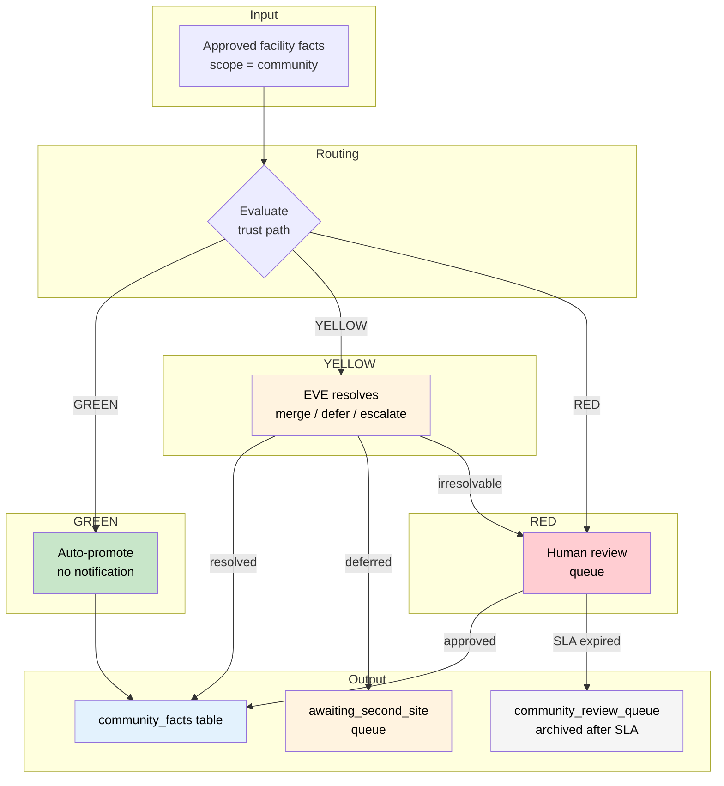
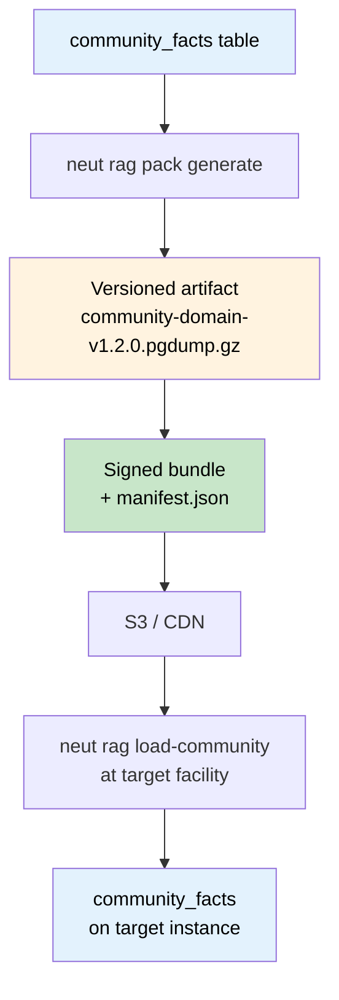

# RAG Community Corpus & Federated Knowledge Aggregation

**Status:** Draft
**Owner:** Ben Booth
**Created:** 2026-03-20
**Layer:** Axiom core
**Related:** `spec-rag-architecture.md`, `spec-rag-knowledge-maturity.md`, `spec-agent-architecture.md`

---

## Terms Used

| Term | Definition | Reference |
|------|-----------|-----------|
| `tier` | Content sensitivity axis: `public · restricted · classified` (Axiom archetypes) | `neut glossary tier` |
| `scope` | Content visibility axis: `community · facility · personal` | `neut glossary scope` |
| `domain_pack` | A versioned, installable bundle of community-scope facts and chunks for a specific domain | `neut glossary domain_pack` |
| `bundle` | A signed artifact containing a domain pack version (pgdump + manifest) | `neut glossary bundle` |
| `community_corpus` | The set of `community_facts` that have been promoted through the federation aggregation pipeline | `neut glossary community_corpus` |
| `knowledge_maturity` | Integer 0–5 representing epistemic depth of a knowledge artifact | `neut glossary knowledge_maturity` |
| `knowledge_fact` | A discrete, validated proposition in the `knowledge_facts` table | `neut glossary knowledge_fact` |
| `promotion_policy` | Configurable thresholds governing layer advancement | `neut glossary promotion_policy` |

All terms resolve via `neut glossary <term>` or `docs/glossary-axiom.toml`.

---

## 1. Purpose

The community corpus is the differentiating asset of any Axiom deployment. It accumulates tacit knowledge — operational patterns, validated procedures, simulation insights — that frontier LLMs have never seen. A freshly deployed instance with a rich community corpus is immediately useful; without it, the system is a general-purpose LLM with a local document store.

This spec answers three questions:

1. **How does validated knowledge grow across a federation of facilities?** Each facility crystallizes facts independently; the aggregation agent merges those facts using the same principles as federated learning.
2. **Who decides what enters the community corpus?** Agentic consensus replaces human committee: independent validation at N≥2 facilities IS the quorum. Human review is reserved for classified content, irresolvable contradictions, and explicit facility policy flags.
3. **How is the corpus distributed?** Versioned domain packs — installable artifacts — carry community knowledge to new deployments.

**Target:** >90% of facts via automated (GREEN) or agentic (YELLOW) path. Human review is the exception, not the norm.

---

## 2. Federated Knowledge Model

### 2.1 Analogy to Federated Learning

The community corpus federation is the knowledge-layer analog of federated model training. The structural parallel is exact:

| Federated Learning | Federated Knowledge Aggregation |
|---|---|
| Each site trains on local data | Each site crystallizes facts from local interactions |
| Share model parameters — not raw data | Share fact propositions — not raw interactions or documents |
| FedAvg aggregates parameters weighted by data volume | Aggregation agent merges facts weighted by `confidence × retrieval_count` |
| Differential privacy protects individual training samples | Knowledge differential privacy protects individual interaction records |
| Quorum = N sites independently produced the same model update | Quorum = N sites independently validated the same fact |

This framing is not metaphor. For deployments participating in a Flower AI federated learning framework (e.g., the INL LDRD), the knowledge sync endpoint and the model sync protocol share infrastructure and apply the same secure aggregation primitives (§6.2).

### 2.2 Invariant: What Crosses Facility Boundaries

Only the following fields are transmitted between facilities. Everything else stays local.

| Crosses the wire | Never crosses the wire |
|---|---|
| Fact `proposition` text | `source_interaction_ids` from other facilities |
| `domain_tags` | Raw chunk text |
| `access_tier` | User identifiers |
| `confidence` | Session contents |
| `retrieval_count` | Facility-internal document identifiers |
| `originating_facility_ids` (names, not internal IDs) | Facility-internal system logs |
| `federation_round` | Classified-tier content of any kind |
| Proposition embedding vector | |

The originating facility name (e.g., `"osu-triga"`) is shared; internal primary keys are not. This is the same privacy boundary as differential privacy in FL: aggregate statistics cross, individual records do not.

---

## 3. Trust Gradient

Every candidate community fact is assigned a trust path — `green`, `yellow`, or `red` — before it enters the aggregation pipeline. The path determines whether the fact auto-promotes, requires EVE agentic resolution, or requires a human reviewer. The system is calibrated so that the green and yellow paths together handle >90% of facts.



### 3.1 GREEN — Fully Automated

All of the following conditions must hold:

- `fact.confidence >= 0.85`
- `fact.access_tier == "public"` — classified facts never auto-promote to community under any circumstances
- `fact.validation_state == "approved"` at the originating facility
- No semantic contradiction detected: cosine similarity < 0.85 with any existing `community_fact` of opposite valence
- If multi-facility deployment: same proposition independently validated at ≥2 facilities (cosine similarity > 0.90 between proposition embeddings)

**Action:** Auto-promote. Write to `community_facts`. Mark provenance. No human notification required.

### 3.2 YELLOW — Agentic Resolution by EVE

Triggered by any of:

- `0.60 <= confidence < 0.85`
- Potential semantic contradiction detected: cosine similarity 0.75–0.90 with an existing `community_fact`
- Novel fact from a single facility with `confidence >= 0.85` — not rejected, but not yet confirmed by a second site
- Fact `domain_tags` match a `sensitive_domains` list configured per deployment (default: empty)

**Action:** EVE examines the fact cluster. EVE reads the candidate proposition, any contradicting or similar community facts, and the supporting context available from the fact's `context` field. EVE resolves via one of four outcomes:

| EVE outcome | Result |
|---|---|
| Contradiction resolved — one proposition supersedes or qualifies the other | Promote merged/qualified fact with `resolution_notes` |
| Near-duplicate propositions from same or different facilities | Merge into single fact, aggregate provenance, promote |
| Novel single-facility fact — no contradiction, not yet confirmed | Set `awaiting_second_site = TRUE`; place in waiting queue, not rejected |
| Irresolvable contradiction — facilities reached genuinely opposite conclusions | Escalate to RED |

EVE's resolution reasoning is written to `community_facts.resolution_notes`. This is auditable.

### 3.3 RED — Human Review Required

Triggered by any of:

- `access_tier == "classified"` — always, unconditionally; no classified fact enters the community corpus without explicit human approval
- `confidence < 0.60`
- EVE flagged an irresolvable contradiction between facilities
- Facility policy: `require_human_review = true` configured for matching `domain_tags`
- Multi-facility conflict: two facilities' local EVEs reached opposite `validation_state` conclusions for the same proposition

**Action:** Write to `community_review_queue`. The assigned reviewer sees the proposition, EVE's conflict summary, and all contributing facility metadata. Reviewer approves, rejects, or edits.

**SLA:** 5 business days (configurable: `federation.review_sla_days`). After SLA expiry without action:

1. EVE re-evaluates with updated reasoning (incorporates any new facts added since initial queue entry).
2. If EVE can now resolve: promote via YELLOW path, note SLA re-evaluation.
3. If still irresolvable: archive the fact. It does not block the pipeline.

---

## 4. Aggregation Agent

The aggregation agent is an EVE capability — not a separate agent. EVE already owns crystallization (see `spec-rag-knowledge-maturity.md §7`); federation aggregation is a second sweep type that EVE executes on a different schedule. This avoids a proliferation of narrow agents and keeps knowledge lifecycle logic in one place.

### 4.1 Trigger

Configured in `rag.toml` under `[federation]`. Default: weekly, scheduled after the local crystallization sweep completes. The ordering matters: local facts must be crystallized and approved before they are nominated for community promotion.

### 4.2 Input Selection

```sql
SELECT * FROM knowledge_facts
WHERE validation_state = 'approved'
  AND scope = 'community'
  AND promoted_to_community = FALSE
  AND access_tier != 'classified'   -- classified requires RED path pre-approval
ORDER BY created_at ASC;
```

Classified-tier facts that have been explicitly approved via the RED path are included with `promoted_to_community = FALSE` and a `trust_path = 'red'` flag.

### 4.3 Algorithm

```
1. Collect approved community-scope facts from local knowledge_facts table.

2. For multi-facility deployments:
   Pull fact candidates from configured peer endpoints (§6).
   Validate response schema; reject malformed payloads.

3. Cluster all candidates (local + remote) by semantic similarity:
   cosine similarity > 0.90 on 768-dim proposition embeddings.

4. For each cluster:
   a. |facilities| >= 2  →  GREEN path (agentic merge, auto-promote).
   b. |facilities| = 1, confidence >= 0.85  →  YELLOW path (EVE evaluates novelty).
   c. |facilities| = 1, confidence < 0.85  →  YELLOW path (await second validation).
   d. Contradiction detected  →  YELLOW (EVE attempts resolution) or RED (escalate).

5. Write merged fact to community_facts with aggregation metadata.

6. UPDATE knowledge_facts SET promoted_to_community = TRUE
   WHERE id = ANY(:promoted_source_ids);

7. Write federation sweep report to stewardship log.
```

### 4.4 Confidence Weighting (FedAvg Analog)

When merging facts from multiple facilities, the merged fact's `community_confidence` is the weighted mean of each contributing fact's `confidence × retrieval_count`, normalized by total retrieval volume:

```
community_confidence =
    Σ (confidence_i × retrieval_count_i)
    ─────────────────────────────────────
         Σ retrieval_count_i
```

Higher-traffic facilities contribute more weight. A facility that has retrieved a fact 200 times outweighs one that has retrieved it 3 times, even if both confidence scores are similar. This mirrors the FedAvg weighting of dataset size.

---

## 5. Schema Extensions

### 5.1 Extensions to `knowledge_facts`

These columns extend the schema defined in `spec-rag-knowledge-maturity.md §5`:

```sql
ALTER TABLE knowledge_facts
    ADD COLUMN IF NOT EXISTS promoted_to_community  BOOLEAN     NOT NULL DEFAULT FALSE,
    ADD COLUMN IF NOT EXISTS promoted_at            TIMESTAMPTZ,
    ADD COLUMN IF NOT EXISTS federation_round       INT,
    ADD COLUMN IF NOT EXISTS originating_facilities TEXT[],
    ADD COLUMN IF NOT EXISTS community_confidence   FLOAT,
    ADD COLUMN IF NOT EXISTS trust_path             TEXT        NOT NULL DEFAULT 'yellow'
                                                    CHECK (trust_path IN ('green', 'yellow', 'red')),
    ADD COLUMN IF NOT EXISTS awaiting_second_site   BOOLEAN     NOT NULL DEFAULT FALSE;

CREATE INDEX ON knowledge_facts (promoted_to_community, scope)
    WHERE NOT promoted_to_community AND scope = 'community';

CREATE INDEX ON knowledge_facts (awaiting_second_site)
    WHERE awaiting_second_site;
```

### 5.2 `community_facts` Table

The canonical community corpus. Facts written here are retrievable by all facilities with appropriate tier access.

```sql
CREATE TABLE community_facts (
    id                       UUID        PRIMARY KEY DEFAULT gen_random_uuid(),
    created_at               TIMESTAMPTZ NOT NULL DEFAULT now(),
    updated_at               TIMESTAMPTZ NOT NULL DEFAULT now(),

    -- Content
    proposition              TEXT        NOT NULL,
    context                  TEXT,                          -- EVE synthesis or supporting summary
    domain_tags              TEXT[],
    access_tier              TEXT        NOT NULL DEFAULT 'public'
                                         CHECK (access_tier IN ('public', 'restricted', 'classified')),

    -- Federation provenance
    federation_round         INT         NOT NULL,
    originating_facilities   TEXT[]      NOT NULL,          -- facility names, not internal IDs
    source_fact_ids          UUID[]      NOT NULL,          -- knowledge_facts.id per contributing facility
    community_confidence     FLOAT       NOT NULL,
    trust_path               TEXT        NOT NULL
                                         CHECK (trust_path IN ('green', 'yellow', 'red')),
    resolution_notes         TEXT,                          -- EVE reasoning (yellow/red paths)

    -- Human review (red path only)
    reviewed_by              TEXT,                          -- user id
    reviewed_at              TIMESTAMPTZ,

    -- Embedding
    embedding                VECTOR(768),
    embedding_model          TEXT,
    needs_reembed            BOOLEAN     NOT NULL DEFAULT FALSE,

    -- Maturity
    maturity_layer           SMALLINT    NOT NULL DEFAULT 2,
    superseded_by            UUID        REFERENCES community_facts(id)
);

CREATE INDEX ON community_facts (access_tier, domain_tags);
CREATE INDEX ON community_facts (federation_round);
CREATE INDEX ON community_facts USING ivfflat (embedding vector_cosine_ops)
    WHERE embedding IS NOT NULL;
```

### 5.3 `community_review_queue` Table

Staging table for RED-path facts awaiting human decision:

```sql
CREATE TABLE community_review_queue (
    id                  UUID        PRIMARY KEY DEFAULT gen_random_uuid(),
    created_at          TIMESTAMPTZ NOT NULL DEFAULT now(),
    sla_deadline        TIMESTAMPTZ NOT NULL,               -- created_at + review_sla_days
    source_fact_ids     UUID[]      NOT NULL,
    proposition         TEXT        NOT NULL,
    conflict_summary    TEXT,                               -- EVE's description of the problem
    eve_analysis        TEXT,                               -- EVE's full reasoning
    trust_path_trigger  TEXT        NOT NULL,               -- why this landed in RED
    assigned_to         TEXT,                               -- user id of Knowledge Steward
    status              TEXT        NOT NULL DEFAULT 'pending'
                                    CHECK (status IN ('pending', 'approved', 'rejected', 'eve_reeval', 'archived')),
    resolved_by         TEXT,
    resolved_at         TIMESTAMPTZ,
    resolution_notes    TEXT
);

CREATE INDEX ON community_review_queue (status, sla_deadline)
    WHERE status = 'pending';
```

---

## 6. Federation Sync Protocol

### 6.1 v1 — Pull Model

Each facility exposes a versioned read-only JSONL endpoint. The aggregation agent pulls from configured peer endpoints during the federation sweep. No new infrastructure is required beyond an HTTPS endpoint and a read-only API token.

Configuration in `rag.toml`:

```toml
[federation]
enabled           = false                # opt-in; default off
facility_id       = "ut-austin-netl"     # this facility's identifier in the federation
peer_endpoints    = [
  "https://neutronos.osu.edu/api/v1/federation/facts",
  "https://neutronos.inl.gov/api/v1/federation/facts",
]
sync_schedule     = "weekly"             # daily | weekly | manual
trust_path_floor  = "yellow"             # minimum trust path to accept from peers
                                         # set "green" to be maximally permissive
review_sla_days   = 5
sensitive_domains = []                   # domain_tags that always route to YELLOW regardless of confidence
```

Each peer facility exposes only the fields listed in §2.2. A well-formed peer response:

```json
{
  "facility_id": "osu-triga",
  "federation_round": 12,
  "exported_at": "2026-03-20T02:00:00Z",
  "facts": [
    {
      "proposition": "Flux wire irradiation at position B-2 saturates within 45 minutes at full power.",
      "domain_tags": ["reactor_operations"],
      "access_tier": "public",
      "confidence": 0.91,
      "retrieval_count": 47,
      "embedding": [0.023, -0.117, ...],
      "embedding_model": "nomic-embed-text"
    }
  ]
}
```

No internal IDs. No user data. No source interactions. No raw chunk text.

The receiving facility validates the embedding model matches its own before clustering. Mismatched embedding models trigger a YELLOW-path re-embedding step using the local model before cosine similarity is computed.

### 6.2 v2 — Flower AI Integration

For deployments participating in a Flower AI federated learning framework, the federation sync optionally replaces the pull model with Flower's secure aggregation protocol. Fact proposition embeddings are aggregated using the same differential privacy mechanisms applied to model parameters. This cryptographically aligns knowledge federation with ML model federation, and both share the same audit infrastructure.

The Flower integration is activated by setting `[federation] flower_enabled = true` in `rag.toml`. When enabled, the aggregation agent registers as a Flower strategy client; fact embeddings are treated as gradient-like tensors and processed through the standard secure aggregation round.

This integration is out of scope for Phase 1–2. It is described here to ensure the schema and protocol do not preclude it.

### 6.3 Embedding Model Compatibility

The federation sync transmits raw embedding vectors. The receiving facility must verify:

```python
if remote_fact.embedding_model != local_config.embedding_model:
    # Re-embed the proposition locally before clustering.
    # Do not cluster cross-model embeddings directly.
    remote_embedding = embed_locally(remote_fact.proposition)
else:
    remote_embedding = remote_fact.embedding
```

Embedding model mismatches are logged with a warning in the federation sweep report. A federation where all facilities run the same embedding model (e.g., `nomic-embed-text`) avoids this overhead entirely; the founding three facilities (UT-Austin, OSU, INL) should standardize on a common model at setup.

---

## 7. Domain Pack Lifecycle

Domain packs are the distribution mechanism for the community corpus. They are versioned, signed snapshots of `community_facts` organized by `domain_tag`, installable on a fresh deployment without requiring live federation access.

### 7.1 Generation

```bash
neut rag pack generate --domain <domain_tag>
```

Selects all `community_facts` where `domain_tags @> ARRAY[<domain_tag>]` and `access_tier = 'public'` (or `restricted` with explicit `--include-restricted` flag). Bundles with embeddings as a compressed pgdump artifact.

### 7.2 Versioning

Semantic versioning (`major.minor.patch`):

| Change type | Version bump |
|---|---|
| Schema change or embedding model change | Major |
| New facts added | Minor |
| Fact corrections or `resolution_notes` updates | Patch |

### 7.3 Distribution Lifecycle



### 7.4 Pack Manifest

Each bundle ships with a `manifest.json`:

```json
{
  "pack_id": "procedures-v1.2.0",
  "domain_tag": "procedures",
  "version": "1.2.0",
  "created_at": "2026-03-20T10:00:00Z",
  "federation_round": 14,
  "fact_count": 312,
  "access_tier": "public",
  "embedding_model": "nomic-embed-text",
  "embedding_dims": 768,
  "sha256": "a3f9...",
  "originating_facilities": ["ut-austin-netl", "osu-triga", "inl-nrad"]
}
```

### 7.5 Founding Domain Packs (NeutronOS Nuclear Domain)

These are the initial domain packs for the NeutronOS nuclear extension layer. They are illustrative of how any domain-specific Axiom deployment would define its packs; the core framework is domain-agnostic.

| Pack | Default `access_tier` | Primary content sources |
|------|---|---|
| `procedures` | `public` / `restricted` | NRC regulations, DOE standards, IAEA safety guides, facility procedures |
| `simulation-codes` | `public` / `classified` | MCNP6, SCALE, OpenMC documentation; classified content via RED path only |
| `nuclear-data` | `public` | ENDF/JEFF cross-section libraries |
| `reduced-order-models` | `public` / `classified` | ROM cards, validation datasets |
| `research` | `public` | Published papers, experiment reports |
| `medical-isotope` | `public` | Radioisotope production procedures, QA/QC |
| `training` | `public` | Training reactor operations, lab procedures |
| `regulation-compliance` | `public` | 10 CFR parts, DOE orders, facility license conditions |

---

## 8. Governance Model

### 8.1 v1 — Single Curator

All RED-path facts route to the NeutronOS team as a single review queue. Acceptable while the federation has 1–2 facilities and review volume is low.

### 8.2 v2 — Federated Governance

Each facility appoints a **Knowledge Steward** — a named person, not a committee.

- RED-path facts originating at a facility are routed to that facility's Knowledge Steward.
- Cross-facility conflicts are routed to all involved stewards; any single steward approval unblocks the fact.
- The review interface shows EVE's full analysis to assist the steward; stewards are not expected to re-derive EVE's reasoning.

### 8.3 Anti-Bureaucracy Invariants

These invariants are enforced by implementation, not policy. They exist precisely because policies erode under pressure.

| # | Invariant |
|---|---|
| 1 | A single person can approve any RED-path fact. No committee quorum. |
| 2 | If the review queue exceeds 20 items, EVE re-evaluates all pending items with updated reasoning. Items it can now resolve are automatically moved to YELLOW path and processed. |
| 3 | Facts that sit in the review queue > 30 days without action are archived, not permanently blocked. They do not clog the pipeline. |
| 4 | Classified-tier facts never enter the community corpus under any circumstances. This is a hard schema constraint (`access_tier` check on `community_facts`), not a policy. |

### 8.4 Founding Federation

The three founding members are UT-Austin NETL, OSU TRIGA, and INL NRAD. Multi-facility GREEN path requires independent validation at ≥2 of the 3. As the federation grows beyond 3 members, the quorum threshold remains ≥2 facilities (configurable: `federation.green_quorum_size`, default 2).

---

## 9. CLI

```bash
# Federation management
neut rag federation status              # federation config, last sync time, pending review counts
neut rag federation sync                # manual federation sweep trigger
neut rag federation sync --dry-run      # show what would be promoted or merged; no writes

# Human review (RED-path queue)
neut rag review                         # list RED-path facts awaiting review (oldest first)
neut rag review approve <fact-id>       # approve; optional --note "..."
neut rag review reject <fact-id>        # reject; optional --reason "..."
neut rag review edit <fact-id>          # open proposition in $EDITOR, re-run optimizer, then approve

# Domain packs
neut rag pack generate --domain <tag>   # generate versioned pack from community_facts
neut rag pack generate --domain <tag> --include-restricted  # include restricted-tier facts
neut rag pack list                      # list available pack versions with fact counts
neut rag pack diff <v1> <v2>            # show fact-level diff between two pack versions
neut rag pack install <pack-id>         # install a pack artifact into local community_facts
neut rag load-community <file>          # low-level: load a .pgdump.gz artifact directly
```

---

## 10. Implementation Phases

| Phase | Description | Depends on |
|---|---|---|
| 1 | `community_facts` table, `community_review_queue` table, `knowledge_facts` schema extensions (§5), `trust_path` assignment logic, GREEN/YELLOW/RED routing | `spec-rag-knowledge-maturity.md` Phase 2 |
| 2 | Federation sync v1 (pull model), bilateral UT ↔ OSU, `neut rag federation` commands, sweep report | Phase 1 |
| 3 | Third-party peer (INL NRAD), v2 governance (Knowledge Stewards), anti-bureaucracy queue guardrails | Phase 2 |
| 4 | Domain pack generation pipeline, versioned artifacts, `neut rag pack` commands | Phase 1 |
| 5 | CDN distribution, delta sync (only new facts since a federation round), signed bundles | Phase 4 |
| 6 | Flower AI integration, differential privacy for fact embeddings | INL LDRD partnership active |

Phase boundaries are hard: federation sync (Phase 2) requires a populated `community_facts` table (Phase 1), which requires approved local facts from the knowledge maturity pipeline (`spec-rag-knowledge-maturity.md` Phase 2). Running the federation sweep against an empty or sparse corpus produces no signal.

---

## 11. Relationship to Federated Learning (INL LDRD)

The INL multi-site LDRD proposal trains ML models (LSTM, GPR, anomaly detection) across UT-Austin TRIGA, OSU TRIGA, and INL NRAD reactors using Flower AI for parameter sharing via the DeepLynx Nexus catalog. NeutronOS community corpus federation is the knowledge-layer complement.

| Dimension | Federated Learning (INL LDRD) | Community Corpus Federation (this spec) |
|---|---|---|
| What is shared | Model parameters | Validated knowledge fact propositions |
| What is not shared | Raw sensor data | Raw interactions, session contents, user identifiers |
| Aggregation mechanism | FedAvg (Flower AI) | Confidence × retrieval_count weighted merge |
| Privacy mechanism | Differential privacy on gradients | Knowledge differential privacy on interaction records |
| Infrastructure | Flower AI + DeepLynx Nexus | NeutronOS federation endpoints (v2: Flower AI) |
| Output | Improved ML models in Model Corral | Richer community corpus for RAG retrieval |

Neither system is subordinate to the other. DeepLynx Nexus handles ontology, model parameter catalog, and digital twin lineage. NeutronOS handles operational intelligence, knowledge maturity, and operator-facing RAG. The two interoperate at the federation sync layer; a fact endorsed by a model trained through the FL pipeline may carry higher initial confidence, but it still enters the same GREEN/YELLOW/RED routing as any other fact.

---

## 12. Invariants

The following invariants must hold at all times. A violation indicates a bug in the aggregation pipeline; the relevant sweep step must abort with an error rather than write inconsistent state.

| Invariant | Description |
|---|---|
| **Classified never auto-promotes** | No fact with `access_tier = 'classified'` may enter `community_facts` via GREEN or YELLOW path. This is enforced by a `CHECK` constraint on the table and by schema-level validation before any insert. |
| **Tier non-downgrade** | `community_facts.access_tier` is always the maximum tier of its `source_fact_ids`. No automated process may lower a community fact's tier. |
| **Proposition-only wire protocol** | The federation sync endpoint must never return `session_id`, `user_id`, internal chunk IDs, or raw chunk text. The endpoint response schema is validated on receipt; responses failing validation are rejected and logged, not partially processed. |
| **Aggregation idempotency** | Running the federation sweep twice with the same input produces at most one `community_facts` row per proposition cluster (duplicate detection via cosine similarity threshold). `promoted_to_community = TRUE` on source facts is the idempotency guard. |
| **EVE reasoning is auditable** | Every YELLOW-path promotion and every RED-path review record must have a non-null `resolution_notes` field containing EVE's reasoning. Silent merges are not permitted. |
| **Single-site novel facts do not expire** | A fact in `awaiting_second_site = TRUE` is not rejected after a timeout. It waits indefinitely for a confirming signal from a second facility, or until an operator explicitly rejects it via `neut rag review reject`. |
| **SLA expiry archives, not rejects** | A RED-path fact that exceeds `review_sla_days` without human action is archived (`status = 'archived'`), not hard-rejected. It may be reinstated via `neut rag review approve <fact-id>` at any time. |
