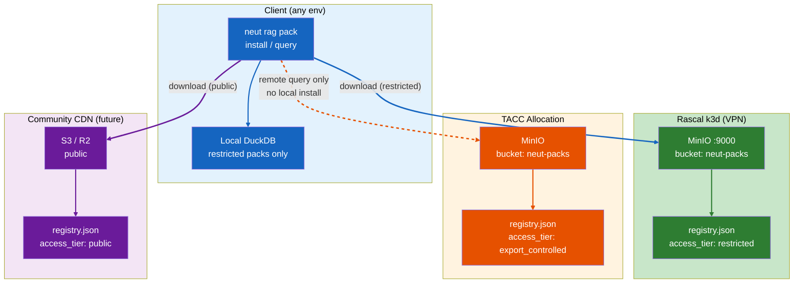

# RAG Pack Server & Generation Pipeline

**Status:** Draft
**Owner:** Ben Booth
**Created:** 2026-03-20
**Layer:** Axiom core
**Related:** `spec-rag-architecture.md`, `spec-rag-community.md`, `spec-rag-knowledge-maturity.md`

---

## Terms Used

| Term | Definition | Reference |
|------|-----------|-----------|
| `.neutpack` | Versioned, gzip-tar artifact: `manifest.json` + `chunks.parquet` + `SHA256SUMS` | `spec-rag-architecture.md §3c` |
| `pack_id` | Stable, lowercase hyphen-separated identifier for a pack (e.g., `netl-triga`) | `neut glossary pack_id` |
| `domain_tag` | Free-form tag linking chunks to a facility domain (e.g., `netl-triga`) | `neut glossary domain_tag` |
| `access_tier` | Sensitivity axis: `public · restricted · export_controlled` | `spec-rag-architecture.md §2` |
| `pack server` | MinIO instance (or compatible S3 endpoint) hosting `.neutpack` files and a registry | `neut glossary pack_server` |
| `rag-org` | The live DuckDB corpus from which packs are generated | `spec-rag-architecture.md §3a` |
| EC pack | A `.neutpack` with `access_tier = "export_controlled"` — never installable locally | `neut glossary ec_pack` |

All terms resolve via `neut glossary <term>` or `docs/glossary-axiom.toml`.

---

## 1. Problem Statement

NeutronOS operates across three distinct trust boundaries:

- **Local workstation** — developer or researcher laptop; no institutional controls on the filesystem
- **Rascal** — facility-managed k3d cluster; VPN-gated, trusted but not export-controlled
- **TACC allocation** — HPC environment with EAR / 10 CFR 810 controls; some data cannot leave

Pre-built RAG context packs need to flow across these environments. Manually copying `.neutpack` files is error-prone, does not enforce access-tier controls, and does not compose with automated deployment (`neut install`). The current spec-rag-architecture.md covers the wire format and local DuckDB store; it does not cover where packs are hosted, how they are generated from a live corpus, or how export-controlled packs are prevented from landing on uncontrolled filesystems.

This spec owns the server-side hosting infrastructure and the generation pipeline.

---

## 2. Pack Server Architecture

### 2.1 Deployment Profiles

Three deployment profiles are defined. Each resolves to a MinIO (or compatible) endpoint registered as a `pack-server` connection.

**Profile A — Rascal (facility, restricted)**

MinIO in k3d, port 9000, VPN-gated. Bucket: `neut-packs`. Packs have `access_tier = "restricted"`. Credentials supplied via `PACK_SERVER_KEY` environment variable. Helm values addition to `values-rascal.yaml` shown in §8.

**Profile B — TACC (export-controlled)**

Identical MinIO deployment inside the TACC allocation. Never reachable from outside the allocation boundary. Packs in this instance carry `access_tier = "export_controlled"`. The `neut rag pack install` command refuses to download EC packs to a local DuckDB — it exits non-zero with a legal constraint message (§7). EC packs are query-time remote only: they are retrieved at query time via the fan-out client (see `spec-rag-architecture.md §3b`) and never persisted outside the TACC boundary.

**Profile C — Community CDN (future)**

S3 or Cloudflare R2, public, governed by `spec-rag-community.md §7`. Out of scope for Phase A/B implementation. Domain packs produced from `community_facts` are distributed via this profile. This spec documents the interface but does not specify CDN configuration.

### 2.2 Architecture Diagram



---

## 3. Pack Registry API

Each pack server exposes a lightweight registry at a well-known path. The registry is regenerated on each `neut rag pack publish` call.

### 3.1 List Registry

```
GET /packs/registry.json
```

No authentication required for listing (MinIO anonymous read on the registry object). Pack download requires credentials.

Response schema:

```json
{
  "server_id": "rascal-facility",
  "access_tier": "restricted",
  "generated_at": "2026-03-20T10:00:00Z",
  "packs": [
    {
      "pack_id": "netl-triga",
      "domain_tag": "netl-triga",
      "latest_version": "1.0.0",
      "versions": ["1.0.0"],
      "access_tier": "restricted",
      "fact_count": 847,
      "size_bytes": 124000000,
      "description": "NETL TRIGA reactor procedures, safety analysis, operational history",
      "download_url": "https://rascal.austin.utexas.edu:9000/neut-packs/netl-triga-v1.0.0.neutpack"
    }
  ]
}
```

`server_id` is set once at MinIO configuration time and persisted in the registry object. `access_tier` at the server level is the minimum tier for all packs hosted; individual packs may be more restrictive but never less.

### 3.2 Download Pack

```
GET /packs/{pack_id}/{version}.neutpack
```

Authenticated download. MinIO presigned URL (time-limited, 1 hour) or direct download with `Authorization: Bearer {PACK_SERVER_KEY}` header, depending on MinIO policy configuration.

### 3.3 Convenience Redirect

```
GET /packs/{pack_id}/latest.neutpack
```

Server-side redirect (HTTP 302) to the latest version object. Implemented as a MinIO lifecycle rule or a thin nginx/Traefik rewrite in the k3d ingress.

---

## 4. Generation Pipeline

### 4.1 `neut rag pack generate`

```
neut rag pack generate --domain <domain_tag> [--corpus rag-org] [--version <semver>] [--output <dir>]
neut rag pack generate --all [--corpus rag-org] [--output <dir>]
```

`--all` enumerates distinct `domain_tags` in the target corpus and runs one generation pass per tag. Run on a host with direct access to the live `rag-org` DuckDB corpus.

Pipeline steps executed in order:

1. **Query chunks** — `SELECT * FROM rag_chunks WHERE corpus = 'rag-org' AND domain_tags @> ARRAY[$domain_tag]`. If `--domain` is omitted, all chunks in the corpus are included.
2. **Export Parquet** — write `chunks.parquet` using `duckdb COPY ... TO ... (FORMAT PARQUET)`. Columns: `chunk_id`, `text`, `embedding`, `domain_tags`, `access_tier`, `source_uri`, `knowledge_maturity`, `created_at`.
3. **Write manifest** — `manifest.json` with fields: `pack_id`, `domain_tag`, `version`, `corpus`, `embedding_model`, `embedding_dim`, `fact_count`, `generated_at`, `generated_by` (hostname), `neutron_os_version`.
4. **Compute checksums** — SHA-256 of `manifest.json` and `chunks.parquet`, written to `SHA256SUMS`.
5. **Archive** — `tar -czf {domain_tag}-v{version}.neutpack manifest.json chunks.parquet SHA256SUMS`.
6. **Print summary** — path, size in MB, fact_count, embedding model.

Wire format is defined by `spec-rag-architecture.md §3c`; this spec owns only the generation tooling that produces conformant files.

### 4.2 `neut rag pack publish`

```
neut rag pack publish <file.neutpack> [--server <server-name>]
```

Steps:

1. Read `manifest.json` from archive to extract `pack_id`, `version`, `access_tier`.
2. Verify SHA256SUMS before uploading.
3. Upload `.neutpack` to `{pack_server_url}/neut-packs/{pack_id}-v{version}.neutpack` using MinIO client (`mc`) or `boto3`.
4. Download current `registry.json` (or create empty), merge new pack entry (upsert by `pack_id` + `version`), re-upload.
5. Print: uploaded URL, updated registry pack count.

`--server` selects a registered `pack-server` connection by name. Defaults to the connection named `pack-server` if exactly one is registered; errors if ambiguous.

---

## 5. Connection Definition

A new connection type is registered in the RAG extension manifest:

**File:** `src/neutron_os/extensions/builtins/rag/neut-extension.toml`

```toml
[[connections]]
name = "pack-server"
display_name = "RAG Pack Server"
kind = "api"
endpoint = ""
credential_env_var = "PACK_SERVER_KEY"
credential_type = "api_key"
health_check = "http_get"
health_endpoint = ""         # resolved at setup time to {endpoint}/packs/registry.json
category = "storage"
capabilities = ["read", "write"]
required = false
post_setup_module = "neutron_os.extensions.builtins.rag.connections"
post_setup_function = "setup_pack_server"
```

`setup_pack_server()` behavior:

1. Prompt for endpoint URL (e.g., `https://rascal.austin.utexas.edu:9000`) and API key.
2. Write to settings: `rag.pack_server_url` and `rag.pack_server_key`.
3. Perform health check GET to `{url}/packs/registry.json`.
4. On success, print the server's `server_id`, `access_tier`, and a table of available packs.
5. On failure, print error and instructions to check VPN connectivity.

Multiple `pack-server` connections may be registered with distinct names (e.g., `pack-server-rascal`, `pack-server-tacc`). The `--server` flag on `generate`, `publish`, `list`, and `install` commands selects by name.

---

## 6. install.toml Integration

### 6.1 New Step Type: `pack_install`

Add `pack_install` to the step type registry in `installer.py`:

```toml
[[environments.steps]]
id          = "pack-install-netl-triga"
type        = "pack_install"
description = "Install NETL TRIGA facility knowledge pack"
pack_id     = "netl-triga"
server      = "pack-server"
depends_on  = "connect-pack-server"
```

The installer executes `neut rag pack install {pack_id} --server {server}` as the step action. The step is skipped if the pack is already installed at the latest version (idempotent).

### 6.2 Rascal Environment Steps

```toml
[[environments.steps]]
id          = "connect-pack-server"
type        = "connect"
description = "Connect to Rascal RAG pack server"
connection  = "pack-server"
depends_on  = "rag-db-init"

[[environments.steps]]
id          = "pack-install-netl-triga"
type        = "pack_install"
description = "Install NETL TRIGA facility knowledge pack"
pack_id     = "netl-triga"
server      = "pack-server"
depends_on  = "connect-pack-server"
```

### 6.3 TACC Environment Steps

```toml
[[environments.steps]]
id          = "connect-pack-server-tacc"
type        = "connect"
description = "Connect to TACC export-controlled pack server"
connection  = "pack-server-tacc"
depends_on  = "rag-db-init"

# Note: no pack_install step for EC packs.
# EC packs are query-time remote only. See spec-rag-pack-server.md §7.
```

---

## 7. EC Pack Safety Guard

This is a hard enforcement rule, not a documentation note.

When `neut rag pack install` resolves a pack (from a remote registry or a local file), it reads `manifest.json` and checks `access_tier` before writing anything to the local DuckDB.

If `access_tier == "export_controlled"`:

1. **Print error:**
   ```
   ERROR: EC packs cannot be installed locally.
   Export-controlled content is subject to EAR and 10 CFR 810 restrictions.
   Use `neut rag query --remote --server <server>` to query this pack on the
   authorized server without transferring controlled content to this machine.
   ```
2. **Exit non-zero** (exit code 3, reserved for access control violations).
3. **Log the attempt** — write a structured record to the audit log (`runtime/logs/audit.jsonl`) with fields: `event = "ec_pack_install_blocked"`, `pack_id`, `server`, `timestamp`, `user` (from system user), `hostname`.

The guard is implemented in `neutron_os.extensions.builtins.rag.cli` in the `pack_install` command handler, before any DuckDB write. It cannot be bypassed by flags. Any future `--force` flag must be gated on a `NEUT_OVERRIDE_EC_GUARD=1` environment variable that itself requires explicit documentation of the legal justification.

---

## 8. MinIO Helm Values

Addition to `infra/helm/values-rascal.yaml`:

```yaml
minio:
  enabled: true
  mode: standalone
  persistence:
    size: 50Gi
  buckets:
    - name: neut-packs
      policy: none
      purge: false
  resources:
    requests:
      memory: 512Mi
      cpu: 250m
```

`policy: none` disables anonymous download. Registry JSON (`registry.json`) is granted anonymous read via a separate MinIO bucket policy applied at setup time, so `neut rag pack list --remote` works without credentials.

For TACC, an identical block is added to `values-tacc.yaml` with `persistence.size: 200Gi` to accommodate larger export-controlled corpora.

---

## 9. CLI Reference

```bash
# Generation — run on a host with direct rag-org corpus access
neut rag pack generate --domain <tag>           # generate pack for one domain_tag
neut rag pack generate --all                    # generate one pack per domain_tag in rag-org
neut rag pack generate --domain <tag> \
  --version 1.2.0 --output ./dist              # explicit version + output dir
neut rag pack publish <file.neutpack>           # upload to default pack-server
neut rag pack publish <file.neutpack> \
  --server pack-server-tacc                    # upload to named server

# Distribution — run on any client
neut rag pack list --remote                     # list packs on default server
neut rag pack list --remote --server <name>     # list packs on named server
neut rag pack install <pack-id>                 # download latest + install to local DuckDB
neut rag pack install <pack-id> --version 1.0.0 # install specific version
neut rag pack install <pack-id> \
  --server pack-server-rascal                  # install from named server
neut rag pack install <file.neutpack>           # install from local file (offline)
neut rag pack update                            # update all installed packs to latest
neut rag pack update <pack-id>                  # update one pack
neut rag pack pin <pack-id> <version>           # lock pack to specific version
neut rag pack status                            # list installed packs, versions, staleness
neut rag pack remove <pack-id>                  # uninstall pack from local DuckDB
```

---

## 10. Implementation Phases

| Phase | Deliverables | Blocks |
|-------|-------------|--------|
| A | MinIO on Rascal k3d; `generate`, `publish`, `list --remote`, `install`; `netl-triga` as first pack | Local + Rascal Qwen+RAG pipeline |
| B | MinIO on TACC; EC pack generation; EC safety guard (§7) | TACC developer-researcher RAG |
| C | `pack_install` step type in `installer.py`; Rascal + TACC install.toml steps (§6) | `neut install` automation |
| D | Community CDN integration; `public` tier packs from `community_facts` | Community corpus distribution |

Phase A is the minimum viable pack distribution path. Phase B requires a TACC allocation with MinIO storage quota approved. Phase C requires Phase A and B registry endpoints to be stable. Phase D is governed by `spec-rag-community.md §7` and is out of scope for the initial implementation sprints.

---

## 11. Invariants

These rules are enforced in code, not advisory:

- **EC packs never install locally.** The guard in §7 is unconditional. No flag bypasses it without an explicit environment variable override documented with a legal justification.
- **SHA-256 verified before load.** `neut rag pack install` verifies `SHA256SUMS` against the downloaded archive before opening any DuckDB transaction. A checksum mismatch aborts with exit code 4 and logs the failure.
- **`neut rag pack install` is idempotent.** If the same `pack_id` + `version` is already present in the local DuckDB, the command prints a no-op message and exits 0 without re-downloading or re-writing.
- **Installing a new version does not remove the old one.** Old versions remain queryable unless `--replace` is passed explicitly. This allows pinned agents to continue operating on a known-good version while a new version is evaluated.
- **`pack_id` + `version` is the unique key.** The registry and local DuckDB both enforce this uniqueness constraint. A publish that duplicates an existing `pack_id` + `version` without `--overwrite` is rejected.
- **Registry regeneration is atomic.** `neut rag pack publish` uploads the new pack object before updating `registry.json`, so a partial publish leaves the registry in a consistent (if stale) state.
